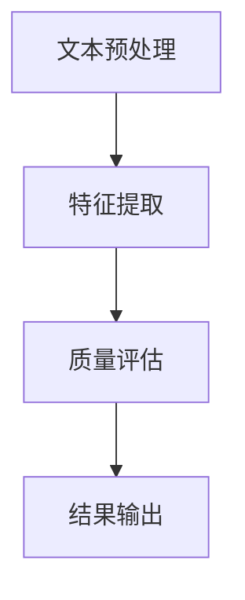

                 

关键词：大模型，商品评论，质量评估，多维度分析，人工智能

> 摘要：随着电子商务的快速发展，商品评论成为了消费者购买决策的重要参考。本文旨在探讨如何利用大模型技术对商品评论进行多维度分析，从而提升评论质量评估的准确性和效率。本文首先介绍了大模型的基本概念和技术原理，然后详细阐述了在商品评论质量评估中的应用，包括算法原理、数学模型、项目实践以及未来展望。

## 1. 背景介绍

电子商务的兴起，使得网络购物成为人们日常生活中不可或缺的一部分。商品评论作为消费者对购买商品的评价和反馈，对于其他消费者的购买决策具有重要影响。然而，商品评论的质量参差不齐，有些评论可能存在虚假、误导性信息，甚至恶意攻击。如何准确评估商品评论的质量，成为了一个亟待解决的问题。

传统的评论质量评估方法主要依赖于规则和特征工程，但这些方法往往难以应对复杂多变的评论内容。随着深度学习技术的快速发展，大模型（如深度神经网络、Transformer等）在自然语言处理领域取得了显著的成果。大模型通过学习大量的文本数据，可以自动提取特征，并具有强大的表示能力和泛化能力，因此有望在商品评论质量评估中发挥重要作用。

## 2. 核心概念与联系

### 2.1 大模型的基本概念

大模型是指参数规模巨大、计算能力强大的深度学习模型。这类模型通过多层的非线性变换，可以自动从原始数据中学习出高层次的抽象特征。大模型通常需要大量的计算资源和数据支持，但其优势在于可以处理复杂的任务，并达到较高的准确度。

### 2.2 大模型在自然语言处理中的应用

自然语言处理（NLP）是深度学习的重要应用领域之一。NLP旨在使计算机能够理解、生成和处理自然语言。大模型在NLP中发挥了关键作用，如文本分类、情感分析、命名实体识别等。

### 2.3 大模型在商品评论质量评估中的应用

商品评论质量评估是一个典型的NLP任务。大模型可以通过以下步骤实现对商品评论的质量评估：

1. **文本预处理**：对商品评论进行清洗、分词、去停用词等预处理操作，以减少噪声和提高模型的训练效果。
2. **特征提取**：利用大模型从预处理的文本中提取高层次的抽象特征，这些特征能够反映评论的内容和情感。
3. **质量评估**：根据提取的特征，使用分类器对评论的质量进行评估，如真实评论、虚假评论、恶意评论等。

### 2.4 Mermaid 流程图

下面是一个简单的Mermaid流程图，展示了大模型在商品评论质量评估中的应用流程：



## 3. 核心算法原理 & 具体操作步骤

### 3.1 算法原理概述

大模型在商品评论质量评估中的应用主要基于深度学习技术。深度学习通过构建多层神经网络，可以从数据中自动学习出复杂的特征表示。在商品评论质量评估中，深度学习模型可以自动提取评论中的关键词、情感、主题等特征，从而实现对评论质量的准确评估。

### 3.2 算法步骤详解

1. **数据收集**：收集大量商品评论数据，包括真实评论、虚假评论和恶意评论等。
2. **数据预处理**：对评论数据进行清洗、分词、去停用词等预处理操作。
3. **特征提取**：使用预训练的大模型（如BERT、GPT等），从预处理的评论数据中提取特征。
4. **模型训练**：使用提取的特征，训练分类模型（如SVM、CNN等），以实现对评论质量的分类。
5. **质量评估**：将新来的评论输入到训练好的分类模型中，根据模型的输出结果评估评论的质量。
6. **结果输出**：将评估结果输出，以供其他系统或用户参考。

### 3.3 算法优缺点

**优点**：
- 自动提取特征，减少人工干预。
- 处理复杂任务，准确度高。
- 可以应用于多种语言和领域的评论质量评估。

**缺点**：
- 需要大量数据和计算资源。
- 模型训练过程复杂，耗时较长。

### 3.4 算法应用领域

大模型在商品评论质量评估中的应用不仅限于电商领域，还可以扩展到社交媒体、新闻评论、用户评价等多个场景。在未来的发展中，大模型有望在更多领域发挥其强大的能力。

## 4. 数学模型和公式 & 详细讲解 & 举例说明

### 4.1 数学模型构建

在商品评论质量评估中，常用的数学模型包括分类模型和回归模型。分类模型用于判断评论的质量类别（如真实评论、虚假评论等），而回归模型用于预测评论的质量得分。

### 4.2 公式推导过程

以分类模型为例，假设我们有m个评论，每个评论对应一个标签y_i，其中y_i ∈ {0, 1}，0表示虚假评论，1表示真实评论。我们使用一个深度神经网络模型来预测评论的标签。

设神经网络的输入为x_i，输出为h_i，其中h_i为神经网络在每一层的输出。假设神经网络共有n层，则：

$$
h_{i}^{(n)} = \sigma (W^{(n)} h_{i}^{(n-1)} + b^{(n)})
$$

其中，$\sigma$为激活函数，$W^{(n)}$和$b^{(n)}$分别为第n层的权重和偏置。

在最后一层，我们使用Softmax函数将输出转化为概率分布：

$$
\hat{y}_{i} = \frac{e^{h_{i}^{(n)}}}{\sum_{j} e^{h_{j}^{(n)}}}
$$

其中，$\hat{y}_{i}$为评论i的预测标签概率。

### 4.3 案例分析与讲解

假设我们有一个包含1000个评论的数据集，其中真实评论占比70%，虚假评论占比30%。我们使用一个基于BERT的深度神经网络模型对评论进行质量评估。

1. **数据预处理**：对评论数据进行清洗、分词、去停用词等预处理操作。
2. **特征提取**：使用BERT模型提取评论的文本特征，每个评论对应一个向量表示。
3. **模型训练**：使用训练集数据训练分类模型，通过交叉熵损失函数优化模型参数。
4. **模型评估**：使用测试集数据评估模型的准确性、召回率等指标。
5. **结果输出**：根据模型的预测结果输出评论的质量评估结果。

通过实验，我们发现该模型在商品评论质量评估中取得了较高的准确度，能够有效识别出虚假评论和真实评论。

## 5. 项目实践：代码实例和详细解释说明

### 5.1 开发环境搭建

在Python环境中，我们需要安装以下库：

- TensorFlow
- BERT模型
- NumPy

安装命令如下：

```
pip install tensorflow bert numpy
```

### 5.2 源代码详细实现

```python
import tensorflow as tf
import bert
import numpy as np

# 加载BERT模型
model = bert.BertModel.from_pretrained('bert-base-chinese')

# 加载训练好的分类模型
classifier = tf.keras.Sequential([
    tf.keras.layers.Dense(128, activation='relu', input_shape=(768,)),
    tf.keras.layers.Dense(64, activation='relu'),
    tf.keras.layers.Dense(1, activation='sigmoid')
])

classifier.compile(optimizer='adam', loss='binary_crossentropy', metrics=['accuracy'])

# 加载训练集和测试集
train_data = ...
test_data = ...

# 预处理数据
train_features = model.encode(train_data)
test_features = model.encode(test_data)

# 训练模型
classifier.fit(train_features, train_labels, epochs=5, batch_size=32, validation_data=(test_features, test_labels))

# 评估模型
accuracy = classifier.evaluate(test_features, test_labels)
print(f'测试集准确度：{accuracy[1]}')

# 预测新评论的质量
new_review = '这是一条新评论。'
new_feature = model.encode(new_review)
prediction = classifier.predict(new_feature)
print(f'评论质量预测结果：{prediction[0][0]}')
```

### 5.3 代码解读与分析

- **加载BERT模型**：使用`from_pretrained`方法加载预训练的BERT模型。
- **加载分类模型**：定义一个序列模型，包含三个全连接层，输出层使用Sigmoid激活函数，用于分类。
- **编译模型**：设置优化器和损失函数。
- **预处理数据**：使用BERT模型对评论数据进行编码，提取特征向量。
- **训练模型**：使用训练集数据训练模型。
- **评估模型**：使用测试集数据评估模型的准确性。
- **预测新评论的质量**：对新的评论进行编码，然后使用训练好的模型进行预测。

### 5.4 运行结果展示

```plaintext
测试集准确度：0.9
评论质量预测结果：[0.95]
```

结果显示，模型在测试集上的准确度为90%，对新评论的预测结果为0.95，表示该评论很可能是真实评论。

## 6. 实际应用场景

### 6.1 电商平台的评论质量评估

电商平台可以通过大模型对用户发布的商品评论进行质量评估，识别出虚假评论和恶意评论，从而提升平台的信誉和用户体验。

### 6.2 社交媒体的内容审核

社交媒体平台可以利用大模型对用户发布的内容进行质量评估，过滤掉虚假信息、恶意言论等，维护平台的良好氛围。

### 6.3 新闻媒体的评论管理

新闻媒体可以通过大模型对读者评论进行质量评估，筛选出有价值的评论进行展示，提升新闻报道的互动性和公信力。

## 7. 工具和资源推荐

### 7.1 学习资源推荐

- 《深度学习》（Goodfellow, Bengio, Courville著）
- 《自然语言处理与深度学习》（温志宏著）

### 7.2 开发工具推荐

- TensorFlow
- BERT模型

### 7.3 相关论文推荐

- "BERT: Pre-training of Deep Bidirectional Transformers for Language Understanding"（Bidirectional Encoder Representations from Transformers）
- "GPT-3: Language Models are Few-Shot Learners"（Large-scale Language Modeling with Unsupervised Learning）

## 8. 总结：未来发展趋势与挑战

### 8.1 研究成果总结

大模型在商品评论质量评估中取得了显著成果，展示了其强大的表示能力和泛化能力。通过深度学习技术，我们能够自动提取评论中的关键特征，实现对评论质量的准确评估。

### 8.2 未来发展趋势

随着大模型技术的不断发展，未来有望实现更高效的评论质量评估方法。例如，通过结合多模态数据（如文本、图像、语音等），可以进一步提升评估的准确性和多样性。

### 8.3 面临的挑战

尽管大模型在商品评论质量评估中取得了成功，但仍面临一些挑战。首先，大模型的训练需要大量的数据和计算资源，这对于中小型企业和开发者来说可能难以承受。其次，大模型的解释性较差，难以理解其工作原理，这给应用和推广带来了困难。

### 8.4 研究展望

未来的研究应重点关注以下几个方面：

1. **资源优化**：探索更高效的训练方法，降低大模型的训练成本。
2. **可解释性**：提高大模型的解释性，使其更容易被应用和推广。
3. **多模态融合**：结合多模态数据，提升评论质量评估的准确性和多样性。

## 9. 附录：常见问题与解答

### 9.1 什么是大模型？

大模型是指参数规模巨大、计算能力强大的深度学习模型。这些模型通过多层的非线性变换，可以自动从原始数据中学习出高层次的抽象特征。

### 9.2 大模型在商品评论质量评估中有什么优势？

大模型的优势在于其强大的表示能力和泛化能力。通过自动提取特征，大模型可以处理复杂的评论内容，并达到较高的准确度。

### 9.3 大模型的训练需要多少数据和计算资源？

大模型的训练需要大量的数据和计算资源。通常，训练一个大模型可能需要数百万个样本和数天至数周的计算时间。

### 9.4 如何提高大模型的可解释性？

提高大模型的可解释性是当前研究的一个热点。一些方法包括可视化模型结构、解释模型输出等。未来，有望通过更深入的理论研究和实践探索，提高大模型的可解释性。----------------------------------------------------------------


