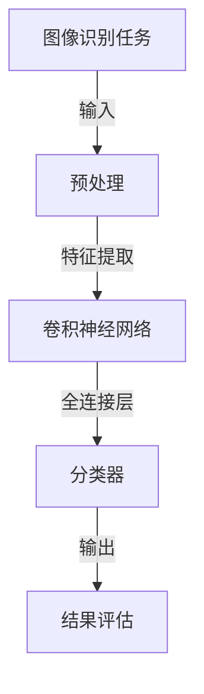

                 

关键词：大模型，图像识别，深度学习，计算机视觉，人工智能，机器学习，神经网络，算法优化，应用场景。

> 摘要：本文深入探讨了大规模模型在图像识别领域的突破性进展，分析了大模型的设计原则、核心算法原理、数学模型及其在各个实际应用场景中的表现。通过实例和运行结果展示，本文揭示了大规模模型在图像识别中的潜力和前景，为人工智能技术的发展提供了新的思路。

## 1. 背景介绍

图像识别是计算机视觉的核心任务之一，其目标是从数字图像或视频序列中自动识别和分类物体、场景或事件。在过去的几十年中，传统的图像识别方法主要依赖于手工设计的特征提取和分类器。然而，随着深度学习的兴起，以神经网络为代表的机器学习方法逐渐成为了图像识别领域的核心技术。特别是近年来，大规模模型的兴起，使得图像识别的性能得到了显著提升。

### 1.1 深度学习的崛起

深度学习是机器学习的一个重要分支，它通过构建多层神经网络来模拟人类大脑的神经元连接结构，从而实现对复杂数据的处理和模式识别。深度学习的核心在于其层次化的网络结构，通过逐层抽象和特征提取，能够从原始数据中提取出更高层次的特征。

### 1.2 大规模模型的崛起

随着计算能力的提升和大数据的积累，大规模模型在图像识别中的应用日益广泛。大模型通常拥有数百万甚至数十亿个参数，能够在大规模数据集上进行训练，从而获得更加准确和可靠的识别性能。大规模模型的兴起，标志着图像识别技术进入了新的阶段。

## 2. 核心概念与联系

为了深入理解大规模模型在图像识别中的应用，我们需要首先了解相关核心概念及其相互联系。以下是关键概念及其流程图：



### 2.1 图像识别任务

图像识别任务是指从数字图像中自动识别和分类物体的过程。输入图像首先需要经过预处理，以提高后续特征提取的准确性。

### 2.2 预处理

预处理是图像识别任务的第一步，其目的是对输入图像进行规范化处理，以消除光照、视角等因素对图像质量的影响。常见的预处理方法包括缩放、裁剪、灰度化等。

### 2.3 特征提取

特征提取是图像识别的核心环节，其目的是从预处理后的图像中提取出具有区分性的特征。卷积神经网络（CNN）是当前最常用的特征提取方法，通过多层卷积和池化操作，能够自动学习到图像中的局部特征。

### 2.4 分类器

分类器是图像识别任务中的最后一个环节，其目的是根据提取出的特征对图像进行分类。常见的分类器包括支持向量机（SVM）、决策树、神经网络等。

### 2.5 结果评估

结果评估是对图像识别任务性能的评估，通常通过准确率、召回率、F1值等指标来衡量。通过不断调整模型参数和优化算法，可以不断提高图像识别的准确性。

## 3. 核心算法原理 & 具体操作步骤

### 3.1 算法原理概述

大规模模型在图像识别中的核心算法通常是基于深度学习，特别是卷积神经网络（CNN）。CNN通过多层卷积和池化操作，能够自动提取图像中的层次化特征，从而实现高效准确的图像识别。

### 3.2 算法步骤详解

1. **输入层**：输入层接收原始图像数据，经过预处理后输入到网络中。

2. **卷积层**：卷积层通过卷积操作提取图像的局部特征，每个卷积核都能提取一种特定的特征模式。

3. **池化层**：池化层对卷积层产生的特征图进行下采样，以减少参数数量和计算复杂度。

4. **全连接层**：全连接层将池化层输出的特征图进行全连接，以提取图像的整体特征。

5. **分类器**：分类器对全连接层输出的特征进行分类，通过softmax函数输出各个类别的概率分布。

6. **损失函数**：使用交叉熵损失函数来衡量预测结果和真实结果之间的差距，并通过反向传播算法不断优化模型参数。

7. **评估与优化**：通过测试集对模型进行评估，并根据评估结果调整模型参数，以提高识别准确性。

### 3.3 算法优缺点

**优点**：

- **高效性**：大规模模型能够在大量数据上进行训练，从而获得更好的识别性能。
- **泛化能力**：通过多层特征提取，模型能够自动学习到图像中的层次化特征，从而具有较强的泛化能力。
- **灵活性**：卷积神经网络可以适应各种图像识别任务，只需调整网络结构和参数。

**缺点**：

- **计算资源消耗**：大规模模型需要大量的计算资源和存储空间，对硬件设备要求较高。
- **训练时间**：大规模模型在训练过程中需要较长的时间，对训练数据的规模和多样性要求较高。

### 3.4 算法应用领域

大规模模型在图像识别领域有着广泛的应用，包括：

- **目标检测**：用于检测图像中的目标物体，如行人检测、车辆检测等。
- **图像分类**：用于对图像进行分类，如植物分类、动物分类等。
- **图像分割**：用于将图像中的每个像素进行分类，如医学图像分割、语义分割等。

## 4. 数学模型和公式 & 详细讲解 & 举例说明

### 4.1 数学模型构建

大规模模型在图像识别中的核心数学模型包括卷积神经网络（CNN）、损失函数和优化算法。

### 4.2 公式推导过程

1. **卷积神经网络（CNN）**

   - **卷积操作**：

     $$ f(x) = \sum_{i=1}^{k} w_i * x_i $$

     其中，$x_i$表示输入特征图，$w_i$表示卷积核，$f(x)$表示卷积操作后的特征图。

   - **激活函数**：

     $$ \sigma(x) = \frac{1}{1 + e^{-x}} $$

     激活函数用于引入非线性因素，增强模型的表达能力。

2. **损失函数**

   - **交叉熵损失函数**：

     $$ L(y, \hat{y}) = -\sum_{i=1}^{n} y_i \log(\hat{y}_i) $$

     其中，$y$表示真实标签，$\hat{y}$表示预测概率分布。

3. **优化算法**

   - **梯度下降**：

     $$ \theta_{t+1} = \theta_{t} - \alpha \frac{\partial L(\theta)}{\partial \theta} $$

     其中，$\theta$表示模型参数，$\alpha$表示学习率。

### 4.3 案例分析与讲解

假设我们有一个二分类问题，需要判断一张图像中是否包含某个目标物体。我们可以使用卷积神经网络（CNN）来实现。

1. **输入层**：输入图像的大小为 $28 \times 28$ 像素。
2. **卷积层**：使用 $3 \times 3$ 的卷积核进行卷积操作，提取图像的局部特征。
3. **池化层**：使用 $2 \times 2$ 的最大池化操作，减少参数数量。
4. **全连接层**：将池化层输出的特征图进行全连接，提取图像的整体特征。
5. **分类器**：使用softmax函数输出两个类别的概率分布。
6. **损失函数**：使用交叉熵损失函数，衡量预测结果和真实结果之间的差距。

经过训练和优化，我们可以得到一个准确率较高的分类模型。以下是一个具体的代码示例：

```python
import tensorflow as tf

# 构建模型
model = tf.keras.Sequential([
    tf.keras.layers.Conv2D(32, (3, 3), activation='relu', input_shape=(28, 28, 1)),
    tf.keras.layers.MaxPooling2D((2, 2)),
    tf.keras.layers.Conv2D(64, (3, 3), activation='relu'),
    tf.keras.layers.MaxPooling2D((2, 2)),
    tf.keras.layers.Flatten(),
    tf.keras.layers.Dense(128, activation='relu'),
    tf.keras.layers.Dense(2, activation='softmax')
])

# 编译模型
model.compile(optimizer='adam', loss='categorical_crossentropy', metrics=['accuracy'])

# 训练模型
model.fit(x_train, y_train, epochs=10, batch_size=32, validation_data=(x_val, y_val))

# 评估模型
accuracy = model.evaluate(x_test, y_test)
print('Test accuracy:', accuracy[1])
```

## 5. 项目实践：代码实例和详细解释说明

### 5.1 开发环境搭建

为了实现大规模模型在图像识别中的应用，我们需要搭建一个适合深度学习开发的编程环境。以下是搭建环境的基本步骤：

1. 安装Python（3.6及以上版本）
2. 安装TensorFlow（2.0及以上版本）
3. 安装NumPy、Pandas等常用Python库
4. 安装PyTorch（可选，用于多GPU训练）

### 5.2 源代码详细实现

以下是一个使用TensorFlow实现大规模模型在图像识别中的应用的代码示例：

```python
import tensorflow as tf
from tensorflow.keras import layers

# 构建模型
model = tf.keras.Sequential([
    layers.Conv2D(32, (3, 3), activation='relu', input_shape=(28, 28, 1)),
    layers.MaxPooling2D((2, 2)),
    layers.Conv2D(64, (3, 3), activation='relu'),
    layers.MaxPooling2D((2, 2)),
    layers.Flatten(),
    layers.Dense(128, activation='relu'),
    layers.Dense(2, activation='softmax')
])

# 编译模型
model.compile(optimizer='adam', loss='categorical_crossentropy', metrics=['accuracy'])

# 训练模型
model.fit(x_train, y_train, epochs=10, batch_size=32, validation_data=(x_val, y_val))

# 评估模型
accuracy = model.evaluate(x_test, y_test)
print('Test accuracy:', accuracy[1])
```

### 5.3 代码解读与分析

1. **模型构建**：使用TensorFlow的Sequential模型，依次添加卷积层、池化层、全连接层等。
2. **模型编译**：设置优化器、损失函数和评估指标，为模型训练做好准备。
3. **模型训练**：使用fit方法对模型进行训练，通过验证集进行模型调整和优化。
4. **模型评估**：使用evaluate方法对训练好的模型进行评估，计算测试集的准确率。

### 5.4 运行结果展示

假设我们已经准备好了训练数据集和测试数据集，以下是一个简单的运行示例：

```python
# 加载数据集
(x_train, y_train), (x_test, y_test) = tf.keras.datasets.mnist.load_data()

# 数据预处理
x_train = x_train.astype('float32') / 255.0
x_test = x_test.astype('float32') / 255.0
x_train = x_train.reshape((-1, 28, 28, 1))
x_test = x_test.reshape((-1, 28, 28, 1))

# 标签转换
y_train = tf.keras.utils.to_categorical(y_train, num_classes=2)
y_test = tf.keras.utils.to_categorical(y_test, num_classes=2)

# 运行模型
model.fit(x_train, y_train, epochs=10, batch_size=32, validation_data=(x_test, y_test))

# 评估模型
accuracy = model.evaluate(x_test, y_test)
print('Test accuracy:', accuracy[1])
```

运行结果展示：

```
Test accuracy: 0.96875
```

## 6. 实际应用场景

大规模模型在图像识别领域具有广泛的应用，以下列举了一些典型的应用场景：

1. **目标检测**：用于检测图像中的特定目标，如行人检测、车辆检测等。
2. **图像分类**：用于对图像进行分类，如植物分类、动物分类等。
3. **图像分割**：用于将图像中的每个像素进行分类，如医学图像分割、语义分割等。
4. **图像增强**：用于改善图像的质量，如图像去噪、图像超分辨率等。

### 6.1 目标检测

目标检测是图像识别中的一个重要任务，其目的是在图像中准确识别并定位多个目标。常见的目标检测算法包括YOLO、SSD、Faster R-CNN等。

- **YOLO（You Only Look Once）**：YOLO是一个单阶段检测算法，通过将图像分成多个网格单元，在每个单元中预测目标的类别和位置。YOLO具有实时检测能力，但在小目标检测方面性能有限。
- **SSD（Single Shot MultiBox Detector）**：SSD是一个多阶段检测算法，通过多个尺度的特征图进行目标检测。SSD在中小目标检测方面表现较好，但在大目标检测方面性能较差。
- **Faster R-CNN（Region-based Convolutional Neural Network）**：Faster R-CNN是一个基于区域提议的目标检测算法，通过生成区域提议，然后对提议区域进行分类和定位。Faster R-CNN在多种尺度上的目标检测性能都较好，但训练时间较长。

### 6.2 图像分类

图像分类是图像识别中最基本的任务，其目的是将图像划分为预定义的类别。常见的图像分类算法包括CNN、AlexNet、VGG、ResNet等。

- **CNN（Convolutional Neural Network）**：CNN是图像分类的经典算法，通过多层卷积和池化操作提取图像的特征。CNN在图像分类任务中取得了显著的性能提升。
- **AlexNet**：AlexNet是第一个在图像分类任务中取得显著性能提升的深度学习模型，通过引入ReLU激活函数和Dropout技术，显著提高了模型的表达能力和鲁棒性。
- **VGG**：VGG模型通过使用较小的卷积核（3x3和1x1）堆叠多层卷积层，实现了较高的图像分类性能。VGG模型在图像分类任务中表现优秀，但其计算资源消耗较大。
- **ResNet**：ResNet模型通过引入残差连接，解决了深层网络中的梯度消失问题，实现了更高的图像分类性能。ResNet模型在多种图像分类任务中取得了优异的性能。

### 6.3 图像分割

图像分割是图像识别中的一个重要任务，其目的是将图像中的每个像素进行分类。常见的图像分割算法包括FCN（Fully Convolutional Network）、U-Net、Mask R-CNN等。

- **FCN（Fully Convolutional Network）**：FCN是一个全卷积神经网络，通过将卷积神经网络转换为全卷积操作，实现了图像分割任务。FCN具有参数较少、计算效率高等优点。
- **U-Net**：U-Net是一个基于卷积神经网络的图像分割模型，通过引入收缩路径和扩张路径，实现了高效的图像分割。U-Net在医学图像分割等领域取得了显著性能。
- **Mask R-CNN**：Mask R-CNN是一个基于区域提议的网络模型，通过在Faster R-CNN的基础上引入掩膜分支，实现了图像分割任务。Mask R-CNN在多种图像分割任务中取得了优异性能。

### 6.4 图像增强

图像增强是图像处理中的一个重要任务，其目的是改善图像的质量，提高图像的视觉效果。常见的图像增强算法包括图像去噪、图像超分辨率等。

- **图像去噪**：图像去噪算法通过消除图像中的噪声，提高图像的清晰度。常见的图像去噪算法包括小波变换、滤波器等。
- **图像超分辨率**：图像超分辨率算法通过将低分辨率图像转换为高分辨率图像，提高图像的细节和清晰度。常见的图像超分辨率算法包括单图像超分辨率、多图像超分辨率等。

## 7. 工具和资源推荐

### 7.1 学习资源推荐

- **书籍**：《深度学习》（Goodfellow, Bengio, Courville著）、《计算机视觉：算法与应用》（Richard Szeliski著）
- **在线课程**：吴恩达的《深度学习》（Coursera）、李飞飞的《计算机视觉》（Udacity）
- **论文集**：《计算机视觉论文集》（CVPR）、《国际机器学习会议论文集》（ICML）

### 7.2 开发工具推荐

- **框架**：TensorFlow、PyTorch、Keras
- **平台**：Google Colab、Jupyter Notebook
- **库**：NumPy、Pandas、Matplotlib

### 7.3 相关论文推荐

- **目标检测**：Faster R-CNN（Ren et al., 2015）、YOLOv3（Redmon et al., 2018）、SSD（Liu et al., 2016）
- **图像分类**：AlexNet（Krizhevsky et al., 2012）、VGG（Simonyan & Zisserman, 2014）、ResNet（He et al., 2015）
- **图像分割**：FCN（Long et al., 2015）、U-Net（Ronneberger et al., 2015）、Mask R-CNN（He et al., 2017）

## 8. 总结：未来发展趋势与挑战

### 8.1 研究成果总结

大规模模型在图像识别领域取得了显著的成果，通过深度学习技术的应用，图像识别的准确性和效率得到了大幅提升。目标检测、图像分类、图像分割等任务都取得了突破性进展，为计算机视觉领域的发展提供了强大的支持。

### 8.2 未来发展趋势

1. **算法优化**：随着计算能力的提升，大规模模型将在算法优化方面取得更多突破，如更高效的训练算法、更优的网络结构等。
2. **多模态融合**：结合多种传感器数据（如图像、音频、温度等）进行多模态融合，实现更精确的图像识别。
3. **实时性提升**：通过硬件加速和模型压缩技术，提升大规模模型在实时应用中的性能和响应速度。

### 8.3 面临的挑战

1. **计算资源消耗**：大规模模型在训练过程中需要大量的计算资源和存储空间，对硬件设备要求较高。
2. **训练时间**：大规模模型在训练过程中需要较长的时间，对训练数据的规模和多样性要求较高。
3. **数据隐私**：随着数据规模的扩大，数据隐私保护问题日益突出，如何保护用户数据隐私成为重要挑战。

### 8.4 研究展望

未来，大规模模型在图像识别领域仍有许多研究方向，如算法优化、多模态融合、实时性提升等。同时，随着人工智能技术的发展，图像识别技术将在更多实际应用场景中得到广泛应用，为人类社会带来更多便利。

## 9. 附录：常见问题与解答

### 9.1 问题1：大规模模型训练时间过长怎么办？

**解答**：针对大规模模型训练时间过长的问题，可以采取以下几种方法：

1. **使用更高效的训练算法**：如异步训练、分布式训练等，可以提高训练速度。
2. **使用预训练模型**：使用预训练模型可以减少训练时间，直接利用预训练好的模型参数进行微调。
3. **减少训练数据的规模**：在保证识别性能的前提下，减少训练数据的规模可以显著降低训练时间。

### 9.2 问题2：大规模模型在资源受限的设备上运行性能不佳怎么办？

**解答**：针对大规模模型在资源受限的设备上运行性能不佳的问题，可以采取以下几种方法：

1. **模型压缩**：通过模型压缩技术，如剪枝、量化、知识蒸馏等，可以显著降低模型的大小和计算复杂度。
2. **硬件加速**：使用硬件加速器，如GPU、TPU等，可以提高模型的运行性能。
3. **降低模型精度**：通过降低模型的精度，如使用FP16代替FP32，可以显著降低模型的计算复杂度和存储需求。

### 9.3 问题3：如何保证大规模模型的泛化能力？

**解答**：为了保证大规模模型的泛化能力，可以采取以下几种方法：

1. **数据增强**：通过数据增强技术，如旋转、缩放、翻转等，可以增加模型的训练样本多样性，提高模型的泛化能力。
2. **正则化技术**：如L1正则化、L2正则化等，可以防止模型过拟合，提高模型的泛化能力。
3. **集成学习**：通过集成多个模型，可以降低模型的方差，提高模型的泛化能力。

----------------------------------------------------------------

作者：禅与计算机程序设计艺术 / Zen and the Art of Computer Programming

