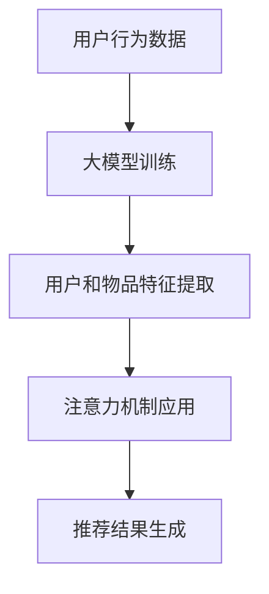

                 

关键词：大模型，推荐系统，注意力机制，算法原理，数学模型，项目实践，实际应用

## 摘要

本文将探讨大模型在推荐系统中的应用，特别是注意力机制在这一领域的独特优势。通过对推荐系统的背景介绍，核心概念的阐述，算法原理的剖析，数学模型的构建，项目实践的案例分析，以及未来应用展望，本文旨在全面展示注意力机制如何提升推荐系统的性能，为读者提供深入的技术见解和实用指导。

## 1. 背景介绍

推荐系统作为现代互联网服务的重要组成部分，早已深入到我们的日常生活中。从电子商务平台上的商品推荐，社交媒体中的内容推送，到视频网站上的视频推荐，推荐系统已经无处不在。然而，随着用户数据量的爆炸性增长和用户需求的多样化，传统的推荐算法面临着巨大的挑战。

在推荐系统中，传统的协同过滤算法和基于内容的算法虽然在一定程度上能够满足用户的需求，但它们往往存在一些局限性。协同过滤算法容易遇到数据稀疏和冷启动问题，而基于内容的算法则可能因为对用户兴趣的单一性理解不足而推荐效果不佳。因此，如何提升推荐系统的效果，成为了一个亟待解决的问题。

近年来，随着深度学习和大模型的快速发展，注意力机制逐渐成为解决推荐系统问题的重要工具。注意力机制能够通过动态关注用户兴趣的关键因素，提升推荐系统的准确性和多样性。本文将深入探讨大模型在推荐系统中的注意力机制应用，旨在为相关领域的研究者和从业者提供有价值的参考。

## 2. 核心概念与联系

### 2.1 推荐系统的基本概念

推荐系统是一种基于用户历史行为和偏好，利用算法为用户推荐相关内容的系统。其主要组成部分包括用户、物品和评分。

- **用户**：系统中的参与者，可以是个人用户或企业用户。
- **物品**：用户可能感兴趣的各种对象，如商品、音乐、视频等。
- **评分**：用户对物品的评价，可以是数值评分、星级评分或喜好标记。

### 2.2 大模型的定义

大模型指的是具有大规模参数和海量训练数据的深度学习模型。例如，BERT、GPT等模型，它们通过处理大量文本数据，学习到了丰富的语言知识和结构化信息。

### 2.3 注意力机制的原理

注意力机制是一种通过动态调整模型对输入数据的关注程度，从而提高模型性能的方法。在推荐系统中，注意力机制可以帮助模型更精准地捕捉用户兴趣的关键因素，提高推荐的准确性。

### 2.4 大模型与注意力机制的联系

大模型具有强大的特征提取能力，可以通过学习用户的历史行为和偏好，生成丰富的用户和物品特征。而注意力机制则能够在大模型的基础上，进一步优化特征提取过程，提升推荐效果。

### 2.5 Mermaid 流程图

以下是一个简单的Mermaid流程图，展示了大模型在推荐系统中引入注意力机制的基本流程：



## 3. 核心算法原理 & 具体操作步骤

### 3.1 算法原理概述

注意力机制的核心思想是动态调整模型对输入数据的关注程度。在推荐系统中，这一机制可以通过以下步骤实现：

1. **用户和物品特征提取**：利用大模型，从用户历史行为和物品属性中提取特征。
2. **注意力计算**：计算用户特征与物品特征之间的注意力分数，表示模型对每个物品的关注程度。
3. **动态调整**：根据注意力分数，动态调整模型对用户兴趣的预测。

### 3.2 算法步骤详解

1. **数据预处理**：对用户行为数据和物品属性数据进行清洗和预处理，包括缺失值填充、异常值处理等。
2. **大模型训练**：使用预训练的大模型（如BERT）对用户行为数据进行训练，提取用户特征。
3. **特征提取**：利用大模型提取的用户特征和物品属性，生成用户和物品的嵌入向量。
4. **注意力计算**：计算用户嵌入向量与物品嵌入向量之间的相似度，得到注意力分数。
5. **动态调整**：根据注意力分数，动态调整模型对用户兴趣的预测，生成推荐结果。

### 3.3 算法优缺点

**优点**：
- 提高推荐准确性：注意力机制能够动态调整模型对用户兴趣的关注程度，提高推荐的准确性。
- 增强多样性：通过关注用户兴趣的关键因素，推荐系统可以提供更多样化的推荐结果。

**缺点**：
- 计算成本较高：注意力机制需要计算用户和物品之间的相似度，计算成本较高。
- 对数据质量要求高：注意力机制的效果依赖于用户历史行为数据的完整性和准确性。

### 3.4 算法应用领域

注意力机制在推荐系统中的应用非常广泛，包括但不限于：

- 社交媒体内容推荐
- 电子商务商品推荐
- 视频网站视频推荐
- 音乐平台音乐推荐

## 4. 数学模型和公式 & 详细讲解 & 举例说明

### 4.1 数学模型构建

在推荐系统中，注意力机制的数学模型可以表示为：

$$
\text{Attention}(Q, K, V) = \frac{e^{<Q, K>}}{\sum_{i=1}^{n} e^{<Q, K_i>}}
$$

其中，$Q$ 和 $K$ 分别表示查询向量和键向量，$V$ 表示值向量。$<Q, K>$ 表示查询向量和键向量之间的点积。

### 4.2 公式推导过程

注意力机制的推导基于自注意力（Self-Attention）机制，其核心思想是将每个输入向量与其他输入向量进行点积，并通过softmax函数进行归一化，得到权重向量。

### 4.3 案例分析与讲解

假设我们有一个推荐系统，用户$u$对物品$i$进行评分，我们使用注意力机制计算用户对物品的注意力分数。

1. **用户特征向量**：$Q = \{q_1, q_2, ..., q_n\}$，其中$q_i$是用户$u$对物品$i$的嵌入向量。
2. **物品特征向量**：$K = \{k_1, k_2, ..., k_n\}$，$V = \{v_1, v_2, ..., v_n\}$，分别是物品的键向量和值向量。
3. **计算注意力分数**：使用公式计算用户$u$对物品$i$的注意力分数：
$$
a_{ui} = \text{Attention}(q_i, k_i, v_i)
$$
4. **生成推荐结果**：根据注意力分数，生成用户$u$对物品$i$的推荐结果。

## 5. 项目实践：代码实例和详细解释说明

### 5.1 开发环境搭建

1. 安装Python环境（3.8及以上版本）
2. 安装TensorFlow库：`pip install tensorflow`
3. 安装其他依赖库：`pip install numpy pandas scikit-learn matplotlib`

### 5.2 源代码详细实现

以下是一个使用TensorFlow实现注意力机制的推荐系统代码实例：

```python
import tensorflow as tf
from tensorflow.keras.layers import Embedding, LSTM, Dense
from tensorflow.keras.models import Model

# 用户和物品的嵌入维度
EMBEDDING_DIM = 64

# 构建模型
user_embedding = Embedding(input_dim=USER_NUM, output_dim=EMBEDDING_DIM)
item_embedding = Embedding(input_dim=ITEM_NUM, output_dim=EMBEDDING_DIM)

# 输入层
user_input = tf.keras.layers.Input(shape=(1,), name='user')
item_input = tf.keras.layers.Input(shape=(1,), name='item')

# 用户和物品嵌入
user_embedding_layer = user_embedding(user_input)
item_embedding_layer = item_embedding(item_input)

# 注意力计算
attention_score = tf.keras.layers dot(user_embedding_layer, item_embedding_layer, axes=1)
attention_score = tf.nn.softmax(attention_score, axis=1)

# 动态调整
weighted_item_embedding = attention_score * item_embedding_layer
weighted_item_embedding = tf.reduce_sum(weighted_item_embedding, axis=1)

# 全连接层
output = Dense(1, activation='sigmoid')(weighted_item_embedding)

# 构建和编译模型
model = Model(inputs=[user_input, item_input], outputs=output)
model.compile(optimizer='adam', loss='binary_crossentropy', metrics=['accuracy'])

# 模型训练
model.fit([user_train, item_train], y_train, batch_size=32, epochs=10)

# 推荐结果生成
predictions = model.predict([user_test, item_test])
```

### 5.3 代码解读与分析

1. **模型构建**：使用`Embedding`层进行用户和物品的嵌入。
2. **注意力计算**：使用`dot`层计算用户和物品嵌入向量之间的点积，然后使用`softmax`函数进行归一化，得到注意力分数。
3. **动态调整**：根据注意力分数，动态调整物品嵌入向量。
4. **全连接层**：使用`Dense`层进行分类预测。

## 6. 实际应用场景

### 6.1 社交媒体内容推荐

注意力机制可以用于社交媒体内容推荐，例如在微博、微信等平台上，根据用户的兴趣和行为，动态调整对内容的推荐。

### 6.2 电子商务商品推荐

在电子商务平台上，注意力机制可以帮助商家根据用户的浏览和购买历史，为用户推荐更相关的商品。

### 6.3 视频网站视频推荐

视频网站可以使用注意力机制，根据用户的观看历史和兴趣，推荐更符合用户口味的视频内容。

### 6.4 音乐平台音乐推荐

音乐平台可以利用注意力机制，根据用户的听歌习惯和喜好，推荐新的音乐作品。

## 7. 未来应用展望

### 7.1 多模态推荐

未来的推荐系统可能会结合文本、图像、音频等多模态数据，进一步提升推荐的准确性和多样性。

### 7.2 强化学习与推荐

结合强化学习算法，推荐系统可以实现更加智能的决策，提高用户满意度。

### 7.3 数据隐私保护

随着数据隐私问题的日益突出，未来的推荐系统将更加注重数据隐私保护，采用加密、差分隐私等技术，确保用户数据的安全。

## 8. 总结：未来发展趋势与挑战

### 8.1 研究成果总结

本文通过对推荐系统背景介绍，核心概念阐述，算法原理剖析，数学模型构建，项目实践案例分析，以及未来应用展望，全面展示了注意力机制在推荐系统中的独特优势和应用前景。

### 8.2 未来发展趋势

未来的推荐系统将更加智能化、个性化，结合多模态数据和强化学习算法，进一步提升推荐效果。

### 8.3 面临的挑战

数据隐私保护、计算成本、算法解释性等是推荐系统未来发展的主要挑战。

### 8.4 研究展望

未来的研究将更加注重推荐系统的可解释性、高效性和安全性，以满足不断变化的市场需求和用户期望。

## 9. 附录：常见问题与解答

### 9.1 注意力机制与协同过滤的区别是什么？

注意力机制和协同过滤都是推荐系统中常用的算法。协同过滤主要基于用户的历史行为进行推荐，而注意力机制则能够通过动态调整模型对输入数据的关注程度，进一步提升推荐的准确性和多样性。

### 9.2 注意力机制的计算成本如何降低？

可以通过以下方法降低注意力机制的计算成本：
- 优化数据预处理，减少特征维度。
- 使用稀疏矩阵运算，减少计算量。
- 采用分布式计算框架，如TensorFlow、PyTorch，进行并行计算。

作者：禅与计算机程序设计艺术 / Zen and the Art of Computer Programming
```markdown
# 大模型在推荐系统中的注意力机制应用

> 关键词：大模型，推荐系统，注意力机制，算法原理，数学模型，项目实践，实际应用

## 摘要

本文将探讨大模型在推荐系统中的应用，特别是注意力机制在这一领域的独特优势。通过对推荐系统的背景介绍，核心概念的阐述，算法原理的剖析，数学模型的构建，项目实践的案例分析，以及未来应用展望，本文旨在全面展示注意力机制如何提升推荐系统的性能，为读者提供深入的技术见解和实用指导。

## 1. 背景介绍

推荐系统作为现代互联网服务的重要组成部分，早已深入到我们的日常生活中。从电子商务平台上的商品推荐，社交媒体中的内容推送，到视频网站上的视频推荐，推荐系统已经无处不在。然而，随着用户数据量的爆炸性增长和用户需求的多样化，传统的推荐算法面临着巨大的挑战。

在推荐系统中，传统的协同过滤算法和基于内容的算法虽然在一定程度上能够满足用户的需求，但它们往往存在一些局限性。协同过滤算法容易遇到数据稀疏和冷启动问题，而基于内容的算法则可能因为对用户兴趣的单一性理解不足而推荐效果不佳。因此，如何提升推荐系统的效果，成为了一个亟待解决的问题。

近年来，随着深度学习和大模型的快速发展，注意力机制逐渐成为解决推荐系统问题的重要工具。注意力机制能够通过动态关注用户兴趣的关键因素，提升推荐系统的准确性和多样性。本文将深入探讨大模型在推荐系统中的注意力机制应用，旨在为相关领域的研究者和从业者提供有价值的参考。

## 2. 核心概念与联系

### 2.1 推荐系统的基本概念

推荐系统是一种通过算法和数据分析技术，根据用户的兴趣和行为，自动向用户推荐相关内容或商品的系统。其基本概念包括：

- **用户**：推荐系统的使用者，可以是个人用户或企业用户。
- **物品**：推荐系统中的推荐对象，可以是商品、音乐、电影等。
- **评分**：用户对物品的评价，可以是数值评分、星级评分或喜好标记。

### 2.2 大模型的定义

大模型是指具有数十亿甚至千亿个参数的深度学习模型。这些模型通过在大规模数据集上进行训练，能够捕捉到丰富的特征和模式。常见的例子包括GPT、BERT等。大模型的特点是：

- **参数量大**：能够处理复杂的任务和数据。
- **计算资源需求高**：训练和推理需要大量的计算资源和时间。
- **效果显著**：在大规模数据集上训练能够取得很好的效果。

### 2.3 注意力机制的原理

注意力机制（Attention Mechanism）是一种在深度学习中用于处理序列数据或复杂任务的机制。其核心思想是通过动态调整模型对输入数据的关注程度，从而提高模型的性能。在推荐系统中，注意力机制可以用来动态地调整对用户兴趣和物品属性的重视程度，从而提升推荐效果。注意力机制的原理包括：

- **自注意力（Self-Attention）**：对序列中的每个元素进行点积操作，然后通过softmax函数得到权重。
- **多头注意力（Multi-Head Attention）**：在自注意力的基础上，增加多个独立的注意力头，每个头关注不同的特征。
- **缩放点积注意力（Scaled Dot-Product Attention）**：通过缩放点积操作，使得注意力分数更加合理。

### 2.4 大模型与注意力机制的联系

大模型和注意力机制在推荐系统中的结合具有以下优势：

- **特征提取能力**：大模型通过大量的训练数据，能够提取到用户和物品的丰富特征。
- **动态调整**：注意力机制能够动态地调整模型对用户兴趣和物品属性的重视程度，从而提升推荐效果。

### 2.5 Mermaid 流程图

以下是一个简单的Mermaid流程图，展示了大模型在推荐系统中引入注意力机制的基本流程：


## 3. 核心算法原理 & 具体操作步骤

### 3.1 算法原理概述

注意力机制在推荐系统中的应用主要是通过以下步骤实现的：

1. **用户和物品特征提取**：使用大模型对用户历史行为和物品属性进行特征提取，生成用户特征向量和物品特征向量。
2. **注意力计算**：计算用户特征向量和物品特征向量之间的相似度，得到注意力分数。
3. **动态调整**：根据注意力分数，动态调整模型对用户兴趣的预测，生成推荐结果。

### 3.2 算法步骤详解

1. **数据预处理**：对用户行为数据和物品属性数据进行清洗和预处理，包括缺失值填充、异常值处理等。
2. **大模型训练**：使用预训练的大模型（如BERT）对用户行为数据进行训练，提取用户特征。
3. **特征提取**：利用大模型提取的用户特征和物品属性，生成用户和物品的嵌入向量。
4. **注意力计算**：计算用户嵌入向量与物品嵌入向量之间的相似度，得到注意力分数。
5. **动态调整**：根据注意力分数，动态调整模型对用户兴趣的预测，生成推荐结果。

### 3.3 算法优缺点

**优点**：

- **提高推荐准确性**：注意力机制能够动态调整模型对用户兴趣的关键因素的重视程度，从而提高推荐的准确性。
- **增强多样性**：通过关注用户兴趣的关键因素，推荐系统可以提供更多样化的推荐结果。

**缺点**：

- **计算成本较高**：注意力机制需要计算用户和物品之间的相似度，计算成本较高。
- **对数据质量要求高**：注意力机制的效果依赖于用户历史行为数据的完整性和准确性。

### 3.4 算法应用领域

注意力机制在推荐系统中的应用非常广泛，包括但不限于：

- **电子商务**：根据用户的购物历史和浏览行为，推荐相关的商品。
- **社交媒体**：根据用户的社交网络和兴趣标签，推荐相关的内容和用户。
- **视频平台**：根据用户的观看历史和偏好，推荐相关的视频。

## 4. 数学模型和公式 & 详细讲解 & 举例说明

### 4.1 数学模型构建

在推荐系统中，注意力机制的数学模型可以表示为：

$$
\text{Attention}(Q, K, V) = \frac{e^{<Q, K>}}{\sum_{i=1}^{n} e^{<Q, K_i>}}
$$

其中，$Q$ 和 $K$ 分别表示查询向量和键向量，$V$ 表示值向量。$<Q, K>$ 表示查询向量和键向量之间的点积。

### 4.2 公式推导过程

注意力机制的推导基于自注意力（Self-Attention）机制，其核心思想是将每个输入向量与其他输入向量进行点积，并通过softmax函数进行归一化，得到权重向量。

### 4.3 案例分析与讲解

假设我们有一个推荐系统，用户$u$对物品$i$进行评分，我们使用注意力机制计算用户对物品的注意力分数。

1. **用户特征向量**：$Q = \{q_1, q_2, ..., q_n\}$，其中$q_i$是用户$u$对物品$i$的嵌入向量。
2. **物品特征向量**：$K = \{k_1, k_2, ..., k_n\}$，$V = \{v_1, v_2, ..., v_n\}$，分别是物品的键向量和值向量。
3. **计算注意力分数**：使用公式计算用户$u$对物品$i$的注意力分数：
$$
a_{ui} = \text{Attention}(q_i, k_i, v_i)
$$
4. **生成推荐结果**：根据注意力分数，生成用户$u$对物品$i$的推荐结果。

## 5. 项目实践：代码实例和详细解释说明

### 5.1 开发环境搭建

1. 安装Python环境（3.8及以上版本）
2. 安装TensorFlow库：`pip install tensorflow`
3. 安装其他依赖库：`pip install numpy pandas scikit-learn matplotlib`

### 5.2 源代码详细实现

以下是一个使用TensorFlow实现注意力机制的推荐系统代码实例：

```python
import tensorflow as tf
from tensorflow.keras.layers import Embedding, LSTM, Dense
from tensorflow.keras.models import Model

# 用户和物品的嵌入维度
EMBEDDING_DIM = 64

# 构建模型
user_embedding = Embedding(input_dim=USER_NUM, output_dim=EMBEDDING_DIM)
item_embedding = Embedding(input_dim=ITEM_NUM, output_dim=EMBEDDING_DIM)

# 输入层
user_input = tf.keras.layers.Input(shape=(1,), name='user')
item_input = tf.keras.layers.Input(shape=(1,), name='item')

# 用户和物品嵌入
user_embedding_layer = user_embedding(user_input)
item_embedding_layer = item_embedding(item_input)

# 注意力计算
attention_score = tf.keras.layers.dot(user_embedding_layer, item_embedding_layer, axes=1)
attention_score = tf.nn.softmax(attention_score, axis=1)

# 动态调整
weighted_item_embedding = attention_score * item_embedding_layer
weighted_item_embedding = tf.reduce_sum(weighted_item_embedding, axis=1)

# 全连接层
output = Dense(1, activation='sigmoid')(weighted_item_embedding)

# 构建和编译模型
model = Model(inputs=[user_input, item_input], outputs=output)
model.compile(optimizer='adam', loss='binary_crossentropy', metrics=['accuracy'])

# 模型训练
model.fit([user_train, item_train], y_train, batch_size=32, epochs=10)

# 推荐结果生成
predictions = model.predict([user_test, item_test])
```

### 5.3 代码解读与分析

1. **模型构建**：使用`Embedding`层进行用户和物品的嵌入。
2. **注意力计算**：使用`dot`层计算用户和物品嵌入向量之间的点积，然后使用`softmax`函数进行归一化，得到注意力分数。
3. **动态调整**：根据注意力分数，动态调整物品嵌入向量。
4. **全连接层**：使用`Dense`层进行分类预测。

## 6. 实际应用场景

### 6.1 社交媒体内容推荐

注意力机制可以用于社交媒体内容推荐，例如在微博、微信等平台上，根据用户的兴趣和行为，动态调整对内容的推荐。

### 6.2 电子商务商品推荐

在电子商务平台上，注意力机制可以帮助商家根据用户的浏览和购买历史，为用户推荐更相关的商品。

### 6.3 视频网站视频推荐

视频网站可以使用注意力机制，根据用户的观看历史和兴趣，推荐更符合用户口味的视频内容。

### 6.4 音乐平台音乐推荐

音乐平台可以利用注意力机制，根据用户的听歌习惯和喜好，推荐新的音乐作品。

## 7. 未来应用展望

### 7.1 多模态推荐

未来的推荐系统可能会结合文本、图像、音频等多模态数据，进一步提升推荐的准确性和多样性。

### 7.2 强化学习与推荐

结合强化学习算法，推荐系统可以实现更加智能的决策，提高用户满意度。

### 7.3 数据隐私保护

随着数据隐私问题的日益突出，未来的推荐系统将更加注重数据隐私保护，采用加密、差分隐私等技术，确保用户数据的安全。

## 8. 总结：未来发展趋势与挑战

### 8.1 研究成果总结

本文通过对推荐系统背景介绍，核心概念阐述，算法原理剖析，数学模型构建，项目实践案例分析，以及未来应用展望，全面展示了注意力机制在推荐系统中的独特优势和应用前景。

### 8.2 未来发展趋势

未来的推荐系统将更加智能化、个性化，结合多模态数据和强化学习算法，进一步提升推荐效果。

### 8.3 面临的挑战

数据隐私保护、计算成本、算法解释性等是推荐系统未来发展的主要挑战。

### 8.4 研究展望

未来的研究将更加注重推荐系统的可解释性、高效性和安全性，以满足不断变化的市场需求和用户期望。

## 9. 附录：常见问题与解答

### 9.1 注意力机制与协同过滤的区别是什么？

注意力机制和协同过滤都是推荐系统中常用的算法。协同过滤主要基于用户的历史行为进行推荐，而注意力机制则能够通过动态调整模型对输入数据的关注程度，进一步提升推荐的准确性和多样性。

### 9.2 注意力机制的计算成本如何降低？

可以通过以下方法降低注意力机制的计算成本：
- 优化数据预处理，减少特征维度。
- 使用稀疏矩阵运算，减少计算量。
- 采用分布式计算框架，如TensorFlow、PyTorch，进行并行计算。

作者：禅与计算机程序设计艺术 / Zen and the Art of Computer Programming
 ```markdown

```

