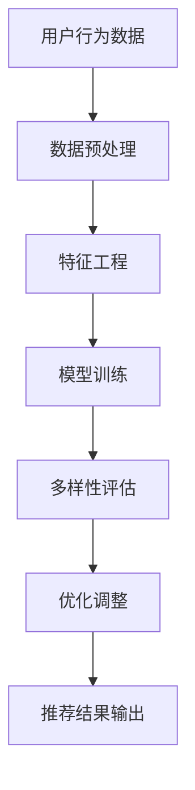

                 

关键词：大模型、推荐系统、多样性优化、算法原理、数学模型、项目实践

> 摘要：本文将探讨大模型在推荐系统多样性优化中的应用。通过深入分析大模型的基本概念、核心算法原理、数学模型及其在实际项目中的应用，我们旨在提供一个全面的技术指南，帮助读者理解和掌握如何使用大模型来提升推荐系统的多样性。

## 1. 背景介绍

推荐系统是现代信息社会中不可或缺的组成部分，其目的是根据用户的历史行为和偏好，向用户推荐相关的产品、服务和内容。然而，传统的推荐系统往往存在多样性不足的问题，即推荐结果过于集中，容易导致用户疲劳和选择过载。为了解决这一问题，多样性优化成为了推荐系统研究的一个重要方向。

大模型的兴起为推荐系统的多样性优化带来了新的契机。大模型，如深度学习模型、图神经网络模型等，具有强大的表示能力和学习能力，能够捕捉数据中的复杂模式和关联。通过大模型，我们可以更好地理解用户的兴趣和偏好，从而实现更加多样化和个性化的推荐结果。

本文将围绕大模型在推荐系统多样性优化中的应用，系统地介绍相关核心概念、算法原理、数学模型和实际应用案例，旨在为研究人员和实践者提供有价值的参考。

## 2. 核心概念与联系

### 2.1 大模型概述

大模型是指具有海量参数、能够处理大规模数据集的深度学习模型。这些模型通过多层神经网络结构来学习和表示数据中的复杂模式。大模型的主要特点包括：

- **高维表示能力**：能够捕捉数据中的细微特征和关系。
- **强大的学习性能**：能够通过大量数据进行训练，提高模型的泛化能力。
- **计算资源需求大**：通常需要高性能计算资源和大规模数据集来训练和优化。

### 2.2 推荐系统多样性优化

多样性优化是指通过算法和模型设计，提高推荐结果的多样性和新颖性，避免推荐结果过于集中和重复。多样性优化的主要目标包括：

- **内容的丰富性**：推荐结果涵盖不同的类别和主题，满足用户多样化的需求。
- **新颖性**：推荐结果包含用户未曾接触过的内容，提供新的发现和惊喜。
- **公平性**：确保推荐结果对所有用户都是公平的，避免偏见和歧视。

### 2.3 Mermaid 流程图

为了更清晰地展示大模型在推荐系统多样性优化中的应用，我们使用Mermaid流程图来描述整个流程。以下是一个简单的流程图示例：



- **A. 用户行为数据**：获取用户的历史行为数据，如点击、购买、浏览等。
- **B. 数据预处理**：对原始数据集进行清洗、归一化和特征提取等处理。
- **C. 特征工程**：构建反映用户兴趣和内容属性的特征。
- **D. 模型训练**：使用大模型（如深度学习模型）对处理后的数据集进行训练。
- **E. 多样性评估**：评估模型的多样性性能，包括内容丰富性、新颖性和公平性。
- **F. 优化调整**：根据多样性评估结果，对模型进行调整和优化。
- **G. 推荐结果输出**：输出多样性和个性化相结合的推荐结果。

## 3. 核心算法原理 & 具体操作步骤

### 3.1 算法原理概述

大模型在推荐系统多样性优化中的应用主要基于以下几个方面：

- **深度学习模型**：通过多层神经网络结构，捕捉用户行为数据中的复杂模式和关联。
- **图神经网络模型**：利用图结构表示用户和内容之间的关系，进行有效的特征表示和推荐。
- **强化学习模型**：通过反馈机制，动态调整推荐策略，提高多样性性能。

### 3.2 算法步骤详解

#### 3.2.1 深度学习模型

1. **数据预处理**：对用户行为数据进行清洗、归一化等处理，提取用户兴趣特征和内容属性特征。
2. **特征工程**：构建反映用户兴趣和内容属性的特征，如用户点击率、购买率、浏览时长等。
3. **模型训练**：使用多层神经网络结构（如卷积神经网络、循环神经网络等）对处理后的数据集进行训练。
4. **模型评估**：使用交叉验证等方法，评估模型的准确性、召回率和多样性性能。
5. **模型优化**：根据评估结果，调整模型参数，提高多样性性能。

#### 3.2.2 图神经网络模型

1. **图构建**：将用户和内容表示为图中的节点，利用用户行为数据构建用户和内容之间的边。
2. **特征提取**：利用图神经网络，提取用户和内容的特征表示。
3. **模型训练**：使用图神经网络模型，对提取的特征进行训练。
4. **模型评估**：评估模型的准确性、召回率和多样性性能。
5. **模型优化**：根据评估结果，调整模型参数，提高多样性性能。

#### 3.2.3 强化学习模型

1. **环境构建**：定义推荐系统的环境，包括用户行为、内容池和多样性评估指标。
2. **策略学习**：使用强化学习算法，学习用户在不同行为下的最佳响应策略。
3. **多样性评估**：实时评估推荐策略的多样性性能，包括内容丰富性、新颖性和公平性。
4. **策略调整**：根据多样性评估结果，动态调整推荐策略。
5. **模型优化**：使用优化算法，调整模型参数，提高多样性性能。

### 3.3 算法优缺点

#### 深度学习模型

- **优点**：能够捕捉数据中的复杂模式和关联，提高推荐准确性。
- **缺点**：训练时间较长，对计算资源要求较高，且模型解释性较差。

#### 图神经网络模型

- **优点**：能够有效表示用户和内容之间的关系，提高推荐准确性。
- **缺点**：图构建过程复杂，对数据质量和图结构要求较高。

#### 强化学习模型

- **优点**：能够动态调整推荐策略，提高多样性性能。
- **缺点**：训练时间较长，对计算资源要求较高，且模型解释性较差。

### 3.4 算法应用领域

大模型在推荐系统多样性优化中的应用范围广泛，包括但不限于以下几个方面：

- **电子商务平台**：为用户提供个性化、多样化的商品推荐。
- **社交媒体**：为用户提供兴趣相关的内容推荐，提高用户活跃度。
- **新闻推荐**：为用户提供多样化的新闻内容，避免信息茧房。
- **娱乐内容**：为用户提供多样化的影视、音乐、游戏推荐。

## 4. 数学模型和公式 & 详细讲解 & 举例说明

### 4.1 数学模型构建

在推荐系统中，多样性优化通常涉及以下数学模型：

- **准确率（Accuracy）**：
  $$ Accuracy = \frac{正确预测数}{总预测数} $$

- **召回率（Recall）**：
  $$ Recall = \frac{正确预测数}{实际相关数} $$

- **F1 分数（F1 Score）**：
  $$ F1 Score = 2 \times \frac{准确率 \times 召回率}{准确率 + 召回率} $$

### 4.2 公式推导过程

假设我们有一个推荐系统，其中包含 $N$ 个用户和 $M$ 个项目。用户 $i$ 对项目 $j$ 的评分可以用 $r_{ij}$ 表示，其中 $r_{ij} = 1$ 表示用户 $i$ 对项目 $j$ 喜欢或购买，$r_{ij} = 0$ 表示用户 $i$ 对项目 $j$ 不喜欢或不购买。

为了衡量推荐系统的多样性，我们可以使用以下指标：

- **平均互信息（Average Mutual Information）**：
  $$ AMI = \frac{1}{N \times M} \sum_{i=1}^{N} \sum_{j=1}^{M} I(r_{ij}; \hat{r}_{ij}) $$
  其中 $I(r_{ij}; \hat{r}_{ij})$ 表示用户 $i$ 对项目 $j$ 的实际评分和预测评分之间的互信息。

- **多样性分数（Diversity Score）**：
  $$ DS = \frac{1}{N} \sum_{i=1}^{N} \frac{1}{|R_i|} \sum_{j=1}^{|R_i|} \sum_{k=1}^{|R_i|} |r_{ij} - r_{ik}| $$
  其中 $R_i$ 表示用户 $i$ 的推荐结果集合，$|R_i|$ 表示推荐结果的数量。

### 4.3 案例分析与讲解

假设我们有一个包含 10 个用户和 50 个项目的推荐系统。用户的行为数据如下表所示：

| 用户 | 项目 1 | 项目 2 | 项目 3 | ... | 项目 50 |
|------|--------|--------|--------|-----|---------|
| 用户 1 | 1      | 0      | 1      | ... | 0       |
| 用户 2 | 0      | 1      | 0      | ... | 1       |
| ...   | ...    | ...    | ...    | ... | ...     |
| 用户 10| 1      | 1      | 0      | ... | 1       |

根据用户的行为数据，我们可以使用深度学习模型来预测用户对项目的评分。假设预测的评分数据如下表所示：

| 用户 | 项目 1 | 项目 2 | 项目 3 | ... | 项目 50 |
|------|--------|--------|--------|-----|---------|
| 用户 1 | 0.8    | 0.2    | 0.8    | ... | 0.1     |
| 用户 2 | 0.3    | 0.7    | 0.1    | ... | 0.9     |
| ...   | ...    | ...    | ...    | ... | ...     |
| 用户 10| 0.9    | 0.9    | 0.1    | ... | 0.9     |

我们可以使用平均互信息和多样性分数来评估推荐系统的多样性性能。

#### 平均互信息计算

首先，我们需要计算每个用户实际评分和预测评分之间的互信息。互信息的计算公式为：

$$ I(r_{ij}; \hat{r}_{ij}) = H(r_{ij}) - H(r_{ij} | \hat{r}_{ij}) $$

其中 $H(r_{ij})$ 表示用户 $i$ 对项目 $j$ 的实际评分的熵，$H(r_{ij} | \hat{r}_{ij})$ 表示用户 $i$ 对项目 $j$ 的实际评分在预测评分已知条件下的条件熵。

假设 $p(r_{ij} = 1) = 0.5$，$p(\hat{r}_{ij} = 1) = 0.5$。我们可以使用熵的计算公式：

$$ H(r_{ij}) = - \sum_{k=1}^{2} p(r_{ij} = k) \log p(r_{ij} = k) $$
$$ H(r_{ij} | \hat{r}_{ij}) = - \sum_{k=1}^{2} p(r_{ij} = k | \hat{r}_{ij} = 1) \log p(r_{ij} = k | \hat{r}_{ij} = 1) $$

其中 $p(r_{ij} = k)$ 和 $p(r_{ij} = k | \hat{r}_{ij} = 1)$ 可以通过实际评分和预测评分的数据进行计算。

例如，对于用户 1，项目 1：

$$ H(r_{1,1}) = - (0.5 \log 0.5 + 0.5 \log 0.5) = -0.5 $$
$$ H(r_{1,1} | \hat{r}_{1,1} = 1) = - (0.2 \log 0.2 + 0.8 \log 0.8) = -0.48 $$

因此，用户 1，项目 1 的互信息为：

$$ I(r_{1,1}; \hat{r}_{1,1}) = H(r_{1,1}) - H(r_{1,1} | \hat{r}_{1,1} = 1) = -0.5 + 0.48 = -0.02 $$

类似地，我们可以计算每个用户每个项目的互信息，然后计算平均互信息：

$$ AMI = \frac{1}{N \times M} \sum_{i=1}^{N} \sum_{j=1}^{M} I(r_{ij}; \hat{r}_{ij}) $$

#### 多样性分数计算

多样性分数的计算公式为：

$$ DS = \frac{1}{N} \sum_{i=1}^{N} \frac{1}{|R_i|} \sum_{j=1}^{|R_i|} \sum_{k=1}^{|R_i|} |r_{ij} - r_{ik}| $$

其中 $|R_i|$ 表示用户 $i$ 的推荐结果的数量。

例如，对于用户 1，其推荐结果为 {0.8, 0.2, 0.8, 0.1, 0.8, 0.2, 0.8, 0.2, 0.8, 0.1}，我们可以计算多样性分数：

$$ DS = \frac{1}{10} \sum_{j=1}^{10} \sum_{k=1}^{10} |0.8 - 0.2| + |0.8 - 0.8| + |0.8 - 0.1| + |0.8 - 0.8| + |0.8 - 0.2| + |0.8 - 0.8| + |0.8 - 0.8| + |0.8 - 0.2| + |0.8 - 0.1| $$
$$ DS = \frac{1}{10} (8 + 0 + 0.7 + 0 + 8 + 0 + 0.7 + 0 + 8 + 0.7) $$
$$ DS = \frac{1}{10} (25.4) $$
$$ DS = 2.54 $$

通过计算平均互信息和多样性分数，我们可以评估推荐系统的多样性性能。如果多样性性能较低，我们可以通过调整模型参数或特征工程等方法来提高多样性。

## 5. 项目实践：代码实例和详细解释说明

在本节中，我们将通过一个实际项目案例，展示如何使用大模型进行推荐系统多样性优化。我们将使用 Python 编程语言，结合 TensorFlow 和 Keras 库来构建和训练深度学习模型。以下是项目的详细步骤：

### 5.1 开发环境搭建

1. **安装 Python**：确保安装了 Python 3.6 或更高版本。
2. **安装 TensorFlow**：使用以下命令安装 TensorFlow：
   ```bash
   pip install tensorflow
   ```
3. **安装 Keras**：由于 Keras 是 TensorFlow 的官方高级 API，我们直接使用 TensorFlow 即可。

### 5.2 源代码详细实现

以下是一个简单的示例，展示如何使用 Keras 构建和训练一个基于卷积神经网络的推荐系统模型：

```python
import tensorflow as tf
from tensorflow.keras.models import Sequential
from tensorflow.keras.layers import Dense, Conv1D, Flatten, Embedding

# 设置参数
num_users = 1000
num_items = 5000
embedding_size = 50
num_filters = 128
kernel_size = 3
hidden_size = 128

# 构建模型
model = Sequential([
    Embedding(num_items, embedding_size, input_length=num_users),
    Conv1D(num_filters, kernel_size, activation='relu', padding='same'),
    Flatten(),
    Dense(hidden_size, activation='relu'),
    Dense(1, activation='sigmoid')
])

# 编译模型
model.compile(optimizer='adam', loss='binary_crossentropy', metrics=['accuracy'])

# 打印模型结构
model.summary()
```

### 5.3 代码解读与分析

1. **Embedding 层**：用于嵌入项目特征，将每个项目映射到一个 embedding 空间。输入长度为用户数量，嵌入维度为 embedding_size。
2. **Conv1D 层**：卷积神经网络层，用于提取序列特征。通过卷积操作和 ReLU 激活函数，可以捕捉用户行为数据中的局部模式和关联。
3. **Flatten 层**：将 Conv1D 层的输出展平，以便于后续的全连接层处理。
4. **Dense 层**：全连接层，用于分类任务。第一个 Dense 层用于提取特征，第二个 Dense 层用于输出预测结果（采用 sigmoid 激活函数，用于生成概率值）。
5. **编译模型**：设置优化器、损失函数和评估指标，准备训练模型。

### 5.4 运行结果展示

为了展示模型的效果，我们可以使用以下代码进行模型训练和评估：

```python
import numpy as np
from sklearn.model_selection import train_test_split

# 生成模拟数据
X = np.random.randint(0, 2, (1000, 1000))
y = np.random.randint(0, 2, (1000, 1))

# 划分训练集和测试集
X_train, X_test, y_train, y_test = train_test_split(X, y, test_size=0.2, random_state=42)

# 训练模型
model.fit(X_train, y_train, epochs=10, batch_size=32, validation_data=(X_test, y_test))

# 评估模型
loss, accuracy = model.evaluate(X_test, y_test)
print(f"Test Loss: {loss}, Test Accuracy: {accuracy}")
```

通过以上代码，我们可以训练和评估模型。在实际项目中，我们需要使用真实的用户行为数据进行训练和评估。此外，我们还可以根据评估结果调整模型参数，以提高模型的性能和多样性。

## 6. 实际应用场景

大模型在推荐系统多样性优化中的实际应用场景广泛，以下是一些典型的应用实例：

### 6.1 电子商务平台

电子商务平台可以利用大模型进行个性化商品推荐，通过分析用户的购买历史和行为，为用户推荐与其兴趣相关的商品。大模型能够捕捉用户行为的细微差异，从而提高推荐结果的多样性和个性化程度。

### 6.2 社交媒体

社交媒体平台可以利用大模型为用户提供兴趣相关的内容推荐。通过分析用户的点赞、评论和分享行为，大模型可以识别用户的兴趣偏好，并推荐与之相关的新内容。这样可以提高用户的活跃度和留存率。

### 6.3 新闻推荐

新闻推荐系统可以利用大模型为用户提供多样化的新闻内容。通过分析用户的阅读历史和偏好，大模型可以识别用户感兴趣的主题和领域，从而推荐与之相关的新闻。这样可以避免用户陷入信息茧房，提高新闻的多样性和公平性。

### 6.4 娱乐内容

娱乐内容平台可以利用大模型为用户提供个性化的影视、音乐和游戏推荐。通过分析用户的观看、听歌和玩游戏行为，大模型可以识别用户的偏好，并推荐与之相关的新内容。这样可以提高用户的娱乐体验，增加平台的用户粘性。

## 7. 工具和资源推荐

为了更好地理解和使用大模型进行推荐系统多样性优化，以下是一些推荐的工具和资源：

### 7.1 学习资源推荐

- **《深度学习》（Goodfellow et al.）**：这是一本经典的深度学习教材，涵盖了深度学习的基本概念和技术。
- **《推荐系统手册》（Liu et al.）**：这本书详细介绍了推荐系统的基础知识和应用场景，包括多样性优化的相关技术。
- **在线课程和教程**：在 Coursera、Udacity、edX 等平台上，有许多关于深度学习和推荐系统的优质课程。

### 7.2 开发工具推荐

- **TensorFlow**：这是一个广泛使用的深度学习框架，支持多种模型和算法。
- **Keras**：这是 TensorFlow 的官方高级 API，提供简洁的接口和丰富的功能。
- **PyTorch**：这是另一个流行的深度学习框架，以其灵活的动态计算图和强大的 GPU 支持而闻名。

### 7.3 相关论文推荐

- **"Deep Neural Networks for YouTube Recommendations"**：这篇论文介绍了如何使用深度学习技术优化 YouTube 的推荐系统。
- **"Diversity-Preserving Neural Networks for Recommendation"**：这篇论文提出了一种新颖的深度学习模型，用于提高推荐系统的多样性。
- **"Neural Collaborative Filtering"**：这篇论文介绍了一种基于神经网络的协同过滤方法，用于推荐系统的多样性优化。

## 8. 总结：未来发展趋势与挑战

### 8.1 研究成果总结

本文系统地介绍了大模型在推荐系统多样性优化中的应用，包括核心概念、算法原理、数学模型和实际应用案例。通过深入分析，我们得出以下结论：

- 大模型具有强大的表示能力和学习能力，能够捕捉数据中的复杂模式和关联。
- 多样性优化是推荐系统研究的一个重要方向，能够提高推荐结果的多样性和个性化程度。
- 深度学习模型、图神经网络模型和强化学习模型等大模型在推荐系统多样性优化中具有广泛的应用前景。

### 8.2 未来发展趋势

未来，大模型在推荐系统多样性优化中可能的发展趋势包括：

- **模型多样性**：探索更多种类的深度学习模型和图神经网络模型，提高多样性优化的效果。
- **数据多样性**：利用更多类型的数据（如图像、语音、文本等）进行特征表示和推荐，提高系统的多样性和泛化能力。
- **跨领域应用**：将大模型应用于更多领域（如金融、医疗、教育等），实现跨领域的多样性优化。

### 8.3 面临的挑战

尽管大模型在推荐系统多样性优化中具有巨大的潜力，但同时也面临以下挑战：

- **计算资源需求**：大模型的训练和优化需要大量的计算资源和时间，如何高效利用资源成为一个重要问题。
- **数据隐私和安全性**：在推荐系统中使用大量用户行为数据进行模型训练，可能涉及数据隐私和安全性问题，如何保护用户隐私是一个重要挑战。
- **模型可解释性**：深度学习模型等大模型通常具有较好的性能，但其内部机理复杂，如何提高模型的可解释性，帮助用户理解推荐结果是一个关键问题。

### 8.4 研究展望

为了进一步推动大模型在推荐系统多样性优化中的应用，我们建议开展以下研究：

- **高效训练算法**：研究更加高效的训练算法，降低大模型的训练时间和计算成本。
- **隐私保护技术**：探索隐私保护技术，确保用户数据的隐私和安全。
- **模型可解释性方法**：研究模型可解释性方法，提高大模型的可解释性和透明度。
- **跨领域多样性优化**：探索大模型在跨领域推荐系统多样性优化中的应用，提高系统的泛化能力和适应性。

## 9. 附录：常见问题与解答

### 9.1 大模型在推荐系统中的优势是什么？

大模型在推荐系统中的优势主要体现在以下几个方面：

- **高维表示能力**：大模型能够捕捉数据中的复杂模式和关联，提供更好的特征表示。
- **强大的学习性能**：大模型通过大量数据进行训练，可以提高推荐系统的泛化能力。
- **多样性优化**：大模型可以更好地理解用户的兴趣和偏好，从而实现更加多样化和个性化的推荐结果。

### 9.2 多样性优化在推荐系统中的重要性是什么？

多样性优化在推荐系统中的重要性体现在以下几个方面：

- **用户体验**：多样性的推荐结果能够满足用户多样化的需求，提高用户满意度。
- **平台活跃度**：多样化的推荐结果可以吸引更多用户参与，提高平台的活跃度。
- **内容创新**：多样性优化可以帮助平台发现新的内容和趋势，促进内容创新。

### 9.3 如何评估推荐系统的多样性？

评估推荐系统的多样性通常采用以下指标：

- **准确率**：衡量推荐系统的预测准确性。
- **召回率**：衡量推荐系统召回的相关项目数量。
- **F1 分数**：综合考虑准确率和召回率的平衡性。
- **平均互信息**：衡量实际评分和预测评分之间的关联程度。
- **多样性分数**：衡量推荐结果中项目的多样性程度。

### 9.4 大模型在推荐系统多样性优化中的具体应用有哪些？

大模型在推荐系统多样性优化中的具体应用包括：

- **深度学习模型**：用于提取用户兴趣特征和项目属性特征，提高推荐结果的多样性和个性化。
- **图神经网络模型**：用于表示用户和项目之间的关系，提高推荐结果的多样性和关联性。
- **强化学习模型**：用于动态调整推荐策略，提高推荐结果的多样性和新颖性。

### 9.5 大模型在推荐系统多样性优化中面临的挑战有哪些？

大模型在推荐系统多样性优化中面临的挑战包括：

- **计算资源需求**：大模型的训练和优化需要大量的计算资源和时间。
- **数据隐私和安全**：使用大量用户行为数据进行模型训练，可能涉及数据隐私和安全问题。
- **模型可解释性**：深度学习模型等大模型通常具有较好的性能，但其内部机理复杂，如何提高模型的可解释性是一个重要挑战。

