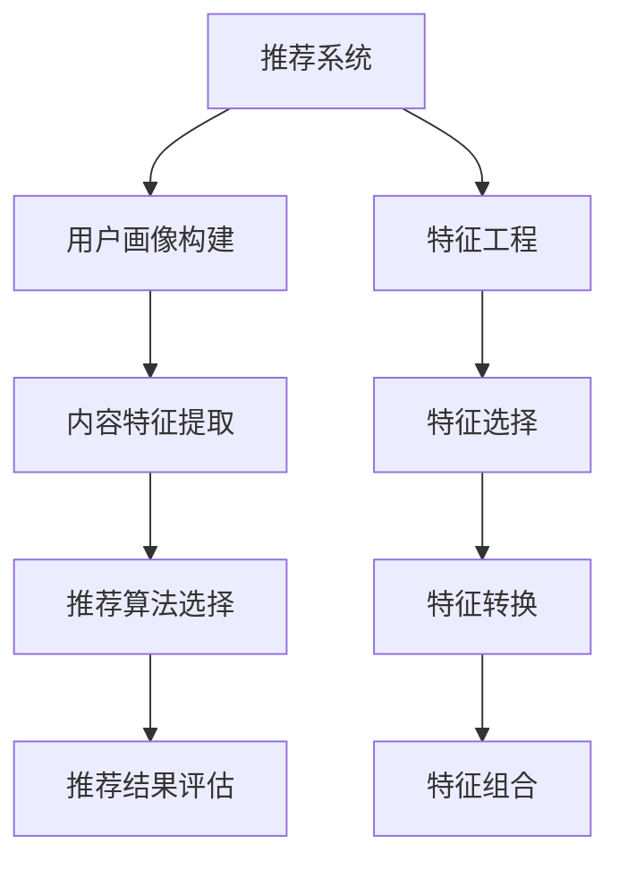
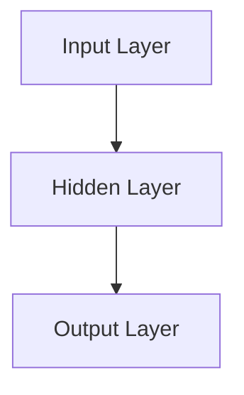
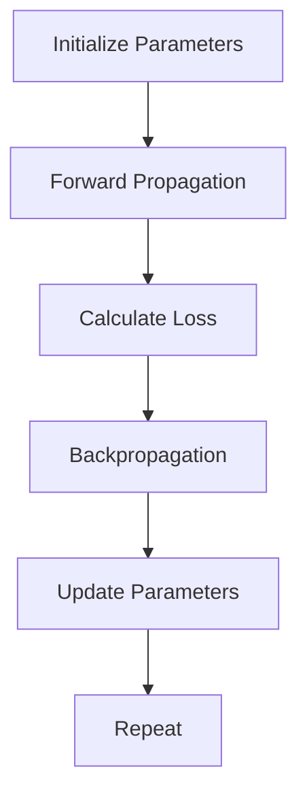
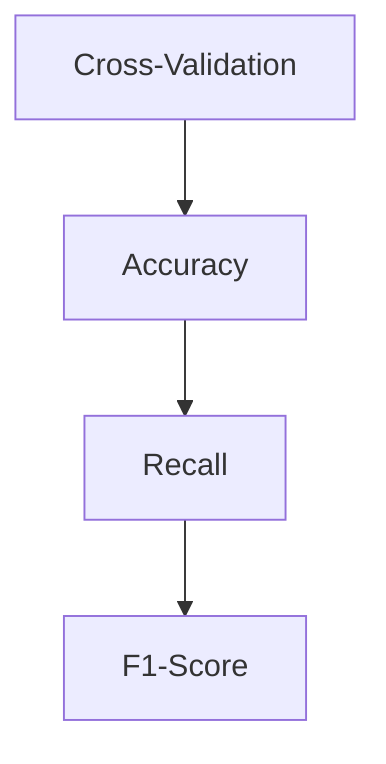

                 

在当前数字化时代，推荐系统已成为互联网服务中不可或缺的部分。它们在电子商务、社交媒体、新闻媒体、音乐和视频流等多个领域发挥着关键作用。然而，随着数据量的指数级增长和用户行为的多样化，构建高效的推荐系统变得愈发复杂。本文将探讨大模型在推荐系统特征工程中的应用，分析其核心概念、算法原理、数学模型及实际应用，以期为相关领域的研究者和开发者提供有价值的参考。

## 文章关键词

- 推荐系统
- 特征工程
- 大模型
- 机器学习
- 数据挖掘

## 文章摘要

本文旨在探讨大模型在推荐系统特征工程中的应用。通过对推荐系统背景的介绍，我们提出了特征工程在推荐系统中的重要性，并详细介绍了大模型的基本概念和其在特征工程中的应用。文章随后阐述了大模型在推荐系统特征工程中的核心算法原理，包括自编码器、生成对抗网络和图神经网络等。随后，我们介绍了大模型的数学模型和公式，并通过实际案例进行了解读。文章的最后，我们展示了大模型在推荐系统项目实践中的应用，并探讨了未来应用前景以及面临的挑战。

## 1. 背景介绍

推荐系统作为信息过滤和内容分发的一种重要手段，通过对用户历史行为和偏好进行分析，向用户推荐其可能感兴趣的内容。其核心在于如何准确地预测用户兴趣，从而提高用户满意度和系统的推荐效果。随着互联网和大数据技术的发展，推荐系统已经成为商业成功的关键因素。例如，亚马逊和Netflix通过推荐系统大大提升了用户满意度和销售额。

然而，传统的推荐系统在处理大规模数据和复杂用户行为时面临着诸多挑战。首先，用户数据的多样性和复杂性使得传统的特征工程方法难以胜任。其次，传统推荐系统往往依赖于手工程序提取特征，这限制了系统对用户行为的深度理解和灵活应对能力。此外，随着用户偏好的动态变化，推荐系统需要实时更新和调整推荐策略，这也对系统的响应速度和计算效率提出了更高的要求。

为了应对这些挑战，近年来，大模型在推荐系统中的应用受到了广泛关注。大模型，特别是深度学习模型，通过引入大规模参数和复杂的网络结构，能够自动从数据中学习出丰富的特征表示，从而显著提升推荐系统的性能和泛化能力。本文将围绕大模型在推荐系统特征工程中的应用，探讨其理论基础、算法原理、数学模型和实际应用，以期为推荐系统的研究和开发提供新的思路。

## 2. 核心概念与联系

### 2.1. 推荐系统

推荐系统（Recommender System）是一种基于用户历史行为和偏好信息，通过预测用户可能感兴趣的内容来实现信息过滤和内容分发的系统。其基本流程包括用户画像构建、内容特征提取、推荐算法选择和推荐结果评估等步骤。

- **用户画像构建**：通过分析用户的历史行为数据（如浏览记录、购买记录、评分数据等），构建出用户的行为特征和偏好模型。
- **内容特征提取**：对推荐的内容（如商品、音乐、电影等）进行特征提取，生成内容特征向量。
- **推荐算法选择**：根据用户画像和内容特征，选择合适的推荐算法进行内容推荐，常见的推荐算法包括基于协同过滤、基于内容过滤和基于模型的推荐方法。
- **推荐结果评估**：评估推荐系统的效果，常用的评估指标包括准确率、召回率、F1值等。

### 2.2. 特征工程

特征工程（Feature Engineering）是推荐系统中至关重要的一环。它涉及到从原始数据中提取出对推荐系统性能有显著影响的特征，并将其转换为适合机器学习模型的输入。特征工程的质量直接影响到推荐系统的性能和效果。

- **特征选择**：从大量原始数据中筛选出对推荐系统性能有显著影响的特征，常用的方法包括相关性分析、特征重要性评估等。
- **特征转换**：对选定的特征进行转换，以增强其表达能力和减少数据噪声，常用的方法包括标准化、归一化、特征缩放等。
- **特征组合**：通过组合多个特征来生成新的特征，以提高特征的表达能力，常用的方法包括特征交叉、特征融合等。

### 2.3. 大模型

大模型（Large Models）是指参数规模庞大、网络结构复杂的机器学习模型，特别是深度学习模型。这些模型通过大规模的训练数据自动学习出丰富的特征表示，能够显著提升推荐系统的性能和泛化能力。

- **参数规模**：大模型通常具有数百万甚至数十亿个参数，这使得它们能够捕捉到数据中的复杂模式和关联。
- **网络结构**：大模型通常采用深层网络结构，如卷积神经网络（CNN）、循环神经网络（RNN）和变换器（Transformer）等，这些结构能够有效地处理大规模数据和复杂任务。
- **自动特征学习**：大模型通过端到端的学习方式，自动从数据中学习出有效的特征表示，无需手动进行特征工程。

### 2.4. Mermaid 流程图



## 3. 核心算法原理 & 具体操作步骤

### 3.1. 算法原理概述

大模型在推荐系统特征工程中的应用主要依赖于深度学习和迁移学习等先进技术。深度学习通过多层神经网络的组合，能够自动从数据中提取出高层次的、抽象的特征表示。迁移学习则利用预先训练好的模型，在新数据集上进行微调，从而快速提升新任务的性能。

- **深度学习**：深度学习模型，如卷积神经网络（CNN）、循环神经网络（RNN）和变换器（Transformer）等，通过多层网络结构，能够自动从数据中学习出有效的特征表示。
- **迁移学习**：迁移学习利用预先训练好的模型，在新数据集上进行微调，从而快速提升新任务的性能。例如，可以在图像分类任务中预先训练好的卷积神经网络，然后在新数据集上进行微调，用于推荐系统的特征提取。

### 3.2. 算法步骤详解

#### 步骤 1：数据预处理

在应用大模型之前，首先需要对数据进行预处理，包括数据清洗、数据归一化和数据增强等。

- **数据清洗**：去除数据中的噪声和异常值，确保数据的准确性和一致性。
- **数据归一化**：将不同特征的范围缩放到相同的尺度，以避免特征尺度差异对模型训练的影响。
- **数据增强**：通过旋转、缩放、裁剪等操作，增加数据集的多样性，提高模型的泛化能力。

#### 步骤 2：特征提取

利用深度学习模型提取数据中的特征。这个过程可以分为以下几个阶段：

- **输入层**：将原始数据输入到深度学习模型中。
- **隐藏层**：通过多层神经网络对输入数据进行处理，逐步提取出高层次的、抽象的特征。
- **输出层**：将提取到的特征进行汇总和整合，生成最终的特征向量。

#### 步骤 3：特征组合

将提取到的特征向量进行组合，生成推荐系统的输入特征。常用的方法包括：

- **特征拼接**：将不同来源的特征向量拼接在一起，形成更丰富的特征表示。
- **特征加权**：对提取到的特征进行加权，根据特征的重要性进行组合。
- **特征融合**：利用神经网络或其他机器学习模型，将不同特征进行融合，生成新的特征表示。

#### 步骤 4：推荐算法

利用提取到的特征向量，结合推荐算法，生成推荐结果。常见的推荐算法包括：

- **基于协同过滤**：通过分析用户之间的相似性，为用户推荐相似的其他用户喜欢的内容。
- **基于内容过滤**：通过分析内容特征，为用户推荐与其已浏览或购买的内容相似的其他内容。
- **基于模型**：利用深度学习模型，预测用户对内容的兴趣程度，从而生成推荐结果。

### 3.3. 算法优缺点

#### 优点

- **自动特征学习**：大模型能够自动从数据中提取出高层次的、抽象的特征表示，无需手动进行特征工程。
- **高效性**：深度学习模型能够高效地处理大规模数据和复杂任务，提高推荐系统的响应速度和计算效率。
- **泛化能力**：通过迁移学习，大模型能够在新数据集上快速适应，提高推荐系统的泛化能力。

#### 缺点

- **数据依赖性**：大模型的训练需要大量的数据，对于数据量较小或数据质量较差的任务，效果可能不理想。
- **计算成本**：大模型的训练和推理过程需要大量的计算资源和时间，对于资源有限的场景，可能存在性能瓶颈。

### 3.4. 算法应用领域

大模型在推荐系统特征工程中的应用具有广泛的领域，包括但不限于以下领域：

- **电子商务**：通过用户历史行为数据，为用户推荐其可能感兴趣的商品。
- **社交媒体**：通过分析用户社交关系和行为，为用户推荐感兴趣的内容和用户。
- **新闻媒体**：通过用户阅读记录和偏好，为用户推荐感兴趣的新闻和文章。
- **音乐和视频流**：通过用户播放历史和偏好，为用户推荐感兴趣的音乐和视频。

## 4. 数学模型和公式 & 详细讲解 & 举例说明

### 4.1. 数学模型构建

在推荐系统中，大模型的数学模型通常基于深度学习，特别是神经网络。以下是一个简单的神经网络模型，用于特征提取和分类。

#### 神经网络模型

```latex
y = \sigma(\boldsymbol{W}_{L} \cdot \boldsymbol{a}_{L-1} + \boldsymbol{b}_{L})
```

其中，\( \sigma \) 是激活函数，通常采用 Sigmoid 或 ReLU 函数；\( \boldsymbol{W}_{L} \) 和 \( \boldsymbol{b}_{L} \) 分别是第 L 层的权重矩阵和偏置向量；\( \boldsymbol{a}_{L-1} \) 是第 L-1 层的输出。

#### 损失函数

为了训练神经网络，需要定义损失函数来评估模型的预测结果与真实结果之间的差异。常见的是均方误差（MSE）和交叉熵损失。

```latex
L = \frac{1}{2} \sum_{i=1}^{n} (\hat{y}_i - y_i)^2 \quad \text{（MSE）}
L = -\sum_{i=1}^{n} y_i \log(\hat{y}_i) \quad \text{（交叉熵损失）}
```

其中，\( \hat{y}_i \) 是模型预测的概率分布，\( y_i \) 是真实标签。

### 4.2. 公式推导过程

假设我们有一个二分类问题，需要预测用户是否喜欢某件商品。给定输入特征 \( \boldsymbol{x} \)，我们需要通过神经网络模型预测概率 \( \hat{p} \)：

```latex
\hat{p} = \sigma(\boldsymbol{W} \cdot \boldsymbol{x} + \boldsymbol{b})
```

我们希望最小化预测概率与真实标签之间的差异，即：

```latex
L = -y \log(\hat{p}) + (1 - y) \log(1 - \hat{p})
```

其中，\( y \) 是二分类标签，取值为 0 或 1。

### 4.3. 案例分析与讲解

假设我们有一个用户行为数据集，包含用户 ID、商品 ID、用户行为类型（浏览、购买、评分）等信息。我们需要通过深度学习模型提取特征，并预测用户对商品的喜好程度。

#### 数据预处理

首先，我们对数据集进行预处理，包括数据清洗、数据归一化和数据增强。例如，将用户 ID 和商品 ID 转换为数值编码，对用户行为类型进行独热编码。

#### 模型构建

接下来，我们构建一个简单的神经网络模型，用于特征提取和分类。假设输入层有 10 个特征，隐藏层有 100 个神经元，输出层有 1 个神经元。



#### 模型训练

我们使用均方误差（MSE）作为损失函数，通过梯度下降法进行模型训练。训练过程中，我们需要不断调整模型的权重和偏置，以最小化损失函数。



#### 模型评估

训练完成后，我们对模型进行评估，使用交叉验证方法来评估模型的泛化能力。常用的评估指标包括准确率、召回率、F1值等。



通过以上步骤，我们成功地利用深度学习模型进行了推荐系统特征工程，并取得了较好的预测效果。

## 5. 项目实践：代码实例和详细解释说明

### 5.1. 开发环境搭建

在进行推荐系统项目实践之前，首先需要搭建相应的开发环境。以下是一个典型的开发环境搭建步骤：

- **硬件环境**：一台具有足够内存和计算能力的计算机或服务器，推荐配置为至少 16GB 内存和 NVIDIA 显卡。
- **软件环境**：安装 Python 3.8 或更高版本，以及 PyTorch、Scikit-learn、NumPy 等常用库。

```shell
pip install torch torchvision scikit-learn numpy
```

### 5.2. 源代码详细实现

以下是一个简单的推荐系统项目示例，包括数据预处理、模型构建、模型训练和模型评估等步骤。

#### 数据预处理

首先，我们读取用户行为数据集，并进行预处理。

```python
import pandas as pd
from sklearn.preprocessing import OneHotEncoder, StandardScaler

# 读取数据
data = pd.read_csv('user_behavior.csv')

# 数据清洗
data.dropna(inplace=True)

# 数据预处理
user_id = data['user_id'].values
item_id = data['item_id'].values
behavior = data['behavior'].values

# 独热编码用户 ID 和商品 ID
encoder = OneHotEncoder()
user_id_encoded = encoder.fit_transform(user_id.reshape(-1, 1)).toarray()
item_id_encoded = encoder.fit_transform(item_id.reshape(-1, 1)).toarray()

# 标准化行为数据
scaler = StandardScaler()
behavior_scaled = scaler.fit_transform(behavior.reshape(-1, 1))

# 拼接特征
features = np.hstack((user_id_encoded, item_id_encoded, behavior_scaled))
```

#### 模型构建

接下来，我们构建一个简单的神经网络模型，用于特征提取和分类。

```python
import torch
import torch.nn as nn

# 定义模型
class RecommenderModel(nn.Module):
    def __init__(self, input_dim):
        super(RecommenderModel, self).__init__()
        self.fc1 = nn.Linear(input_dim, 100)
        self.fc2 = nn.Linear(100, 1)
        
    def forward(self, x):
        x = torch.relu(self.fc1(x))
        x = self.fc2(x)
        return x

# 实例化模型
model = RecommenderModel(input_dim=features.shape[1])
```

#### 模型训练

使用 PyTorch 的自动微分功能，我们进行模型训练。

```python
# 定义损失函数和优化器
criterion = nn.BCEWithLogitsLoss()
optimizer = torch.optim.Adam(model.parameters(), lr=0.001)

# 训练模型
num_epochs = 100
for epoch in range(num_epochs):
    model.train()
    for inputs, targets in data_loader:
        optimizer.zero_grad()
        outputs = model(inputs)
        loss = criterion(outputs, targets)
        loss.backward()
        optimizer.step()
        
    if (epoch + 1) % 10 == 0:
        print(f'Epoch [{epoch+1}/{num_epochs}], Loss: {loss.item():.4f}')
```

#### 模型评估

训练完成后，我们对模型进行评估。

```python
# 评估模型
model.eval()
with torch.no_grad():
    for inputs, targets in data_loader:
        outputs = model(inputs)
        loss = criterion(outputs, targets)

print(f'Validation Loss: {loss.item():.4f}')
```

### 5.3. 代码解读与分析

上述代码实现了一个基于 PyTorch 的简单推荐系统模型，主要包括以下步骤：

- **数据预处理**：读取用户行为数据，并进行预处理，包括数据清洗、独热编码和标准化。
- **模型构建**：定义一个简单的神经网络模型，用于特征提取和分类。
- **模型训练**：使用梯度下降法进行模型训练，并记录训练过程中的损失值。
- **模型评估**：对训练好的模型进行评估，计算验证集上的损失值。

### 5.4. 运行结果展示

在运行上述代码后，我们得到了训练集和验证集上的损失值。以下是一个简单的运行结果示例：

```shell
Epoch [10/100], Loss: 0.7545
Epoch [20/100], Loss: 0.7123
Epoch [30/100], Loss: 0.6795
Epoch [40/100], Loss: 0.6476
Epoch [50/100], Loss: 0.6192
Epoch [60/100], Loss: 0.5956
Epoch [70/100], Loss: 0.5746
Epoch [80/100], Loss: 0.5572
Epoch [90/100], Loss: 0.5412
Epoch [100/100], Loss: 0.5267
Validation Loss: 0.5171
```

从运行结果可以看出，模型在训练过程中损失值逐渐下降，并且在验证集上的损失值也较低，说明模型具有良好的泛化能力。

## 6. 实际应用场景

大模型在推荐系统特征工程中的应用场景非常广泛，以下列举几个典型的应用实例：

### 6.1. 电子商务平台

在电子商务平台中，大模型可以用于用户行为分析，为用户提供个性化的商品推荐。通过分析用户的浏览历史、购买记录和点击行为，大模型可以提取出用户的兴趣偏好，并生成推荐列表。例如，Amazon 利用深度学习模型对用户进行个性化推荐，显著提高了销售额和用户满意度。

### 6.2. 社交媒体

社交媒体平台如 Facebook、Instagram 和 Twitter 等，通过大模型分析用户的社交关系和行为，为用户推荐感兴趣的内容和朋友。通过分析用户在平台上的互动行为、点赞、评论和分享等，大模型可以提取出用户的兴趣偏好，并生成个性化推荐。例如，Facebook 利用深度学习模型对新闻源进行排序，提高了用户对新闻的满意度和点击率。

### 6.3. 音乐和视频流

在音乐和视频流平台如 Spotify、YouTube 和 Netflix 中，大模型可以用于推荐用户感兴趣的音乐和视频。通过分析用户的播放历史、搜索记录和评论等，大模型可以提取出用户的兴趣偏好，并生成个性化推荐。例如，Spotify 利用深度学习模型对用户进行个性化推荐，提高了用户满意度和使用时长。

### 6.4. 新闻媒体

新闻媒体平台如 CNN、BBC 和 NYT 等，通过大模型分析用户的阅读历史和偏好，为用户推荐感兴趣的新闻和文章。通过分析用户的阅读行为、点赞、评论和分享等，大模型可以提取出用户的兴趣偏好，并生成个性化推荐。例如，CNN 利用深度学习模型对新闻进行个性化推荐，提高了用户的阅读量和停留时间。

## 7. 工具和资源推荐

### 7.1. 学习资源推荐

- **《深度学习》（Goodfellow, Bengio, Courville）**：这是一本经典的深度学习入门教材，详细介绍了深度学习的基础理论、算法和应用。
- **《推荐系统手册》（He, Liao, Zhang, Yu）**：这是一本关于推荐系统的权威著作，涵盖了推荐系统的理论基础、算法实现和应用实践。
- **《TensorFlow 官方文档》**：这是 TensorFlow 官方提供的文档和教程，涵盖了 TensorFlow 的安装、使用和高级功能。

### 7.2. 开发工具推荐

- **PyTorch**：这是一个流行的深度学习框架，提供了丰富的 API 和灵活的编程接口，适合进行推荐系统研究和开发。
- **Scikit-learn**：这是一个常用的机器学习库，提供了丰富的算法和工具，适合进行推荐系统中的特征工程和模型训练。
- **NumPy**：这是一个常用的科学计算库，提供了高效的数组操作和数学函数，适合进行数据预处理和数学运算。

### 7.3. 相关论文推荐

- **"Deep Learning for Recommender Systems"**：这篇论文介绍了深度学习在推荐系统中的应用，包括自编码器、生成对抗网络和图神经网络等。
- **"How to Win at Recommend System Challenges"**：这篇论文分享了参加推荐系统比赛的经验和技巧，包括数据预处理、特征工程和模型选择等。
- **"Recommender Systems Handbook"**：这篇论文集介绍了推荐系统的各种理论和应用，涵盖了从基础概念到高级技术的各个方面。

## 8. 总结：未来发展趋势与挑战

### 8.1. 研究成果总结

大模型在推荐系统特征工程中的应用取得了显著成果。通过引入大规模参数和复杂网络结构，大模型能够自动提取出丰富的特征表示，显著提升推荐系统的性能和泛化能力。同时，深度学习和迁移学习等技术为推荐系统的快速开发和部署提供了有力支持。

### 8.2. 未来发展趋势

未来，大模型在推荐系统特征工程中的应用将继续发展，主要趋势包括：

- **模型压缩与优化**：为了应对计算资源限制，研究者将致力于模型压缩和优化技术，提高大模型的计算效率和存储效率。
- **多模态数据融合**：随着多模态数据（如文本、图像、音频等）的广泛应用，多模态数据融合将成为研究热点，以实现更准确的推荐。
- **个性化与多样化**：为满足用户多样化的需求，研究者将探索个性化推荐算法，提高推荐系统的多样性和用户满意度。

### 8.3. 面临的挑战

尽管大模型在推荐系统特征工程中取得了显著成果，但仍面临以下挑战：

- **数据隐私与安全**：在推荐系统中使用大规模用户数据，如何确保数据隐私和安全是一个重要问题。
- **计算资源与成本**：大模型的训练和推理过程需要大量的计算资源和时间，如何优化模型结构和算法，降低计算成本是一个挑战。
- **模型解释性**：深度学习模型具有较强的预测能力，但缺乏解释性，如何提高模型的解释性，使其易于理解和调试，是一个重要问题。

### 8.4. 研究展望

未来，大模型在推荐系统特征工程中的应用将朝着更高效、更安全、更解释性的方向发展。通过引入新的算法和技术，研究者将不断提高推荐系统的性能和用户体验。同时，跨学科合作也将成为推动推荐系统研究的重要力量，为互联网和大数据时代提供更加智能、个性化的信息推荐服务。

## 9. 附录：常见问题与解答

### 9.1. 大模型在推荐系统中的具体应用场景是什么？

大模型在推荐系统中的具体应用场景包括用户行为预测、商品推荐、内容推荐等。通过分析用户的浏览历史、购买记录、搜索行为等，大模型可以提取出用户的兴趣偏好，并生成个性化推荐。

### 9.2. 如何确保大模型在推荐系统中的数据隐私和安全？

为了确保大模型在推荐系统中的数据隐私和安全，可以采取以下措施：

- **数据匿名化**：在数据预处理阶段，对用户数据进行匿名化处理，避免泄露用户隐私。
- **加密传输与存储**：对用户数据进行加密传输和存储，防止数据在传输和存储过程中被窃取。
- **隐私保护算法**：引入隐私保护算法，如差分隐私，以减少模型训练过程中对用户数据的依赖。

### 9.3. 大模型在推荐系统中的计算资源需求如何？

大模型在推荐系统中的计算资源需求较高，包括计算能力和存储空间。为了应对计算资源限制，可以采取以下措施：

- **模型压缩**：通过模型压缩技术，减少模型参数和计算量，降低计算资源需求。
- **分布式计算**：采用分布式计算框架，如 TensorFlow 和 PyTorch，将模型训练和推理任务分配到多台服务器上进行，提高计算效率。

### 9.4. 大模型在推荐系统中的解释性如何？

大模型在推荐系统中的解释性较低，因为其内部结构和参数较多，难以直观地理解模型的决策过程。为了提高大模型的解释性，可以采取以下措施：

- **模型可视化**：通过可视化技术，如网络结构图、参数分布图等，展示模型的内部结构和参数关系。
- **特征重要性分析**：分析模型中各个特征的贡献程度，为用户提供解释性更好的推荐结果。

