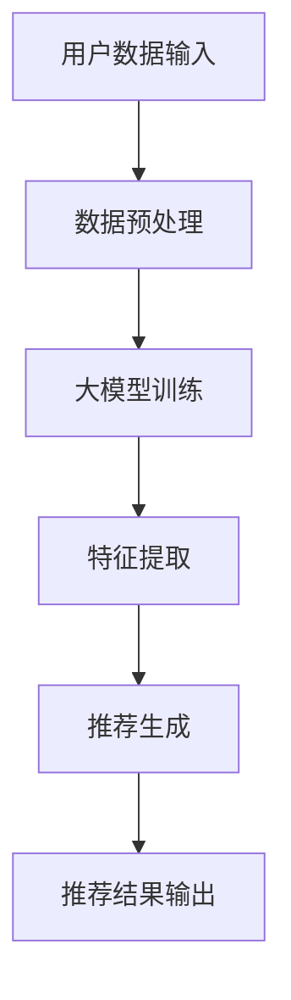

                 

摘要：本文旨在探讨大模型在推荐系统长尾内容推荐中的重要作用。首先，我们将介绍推荐系统及其在当今信息过载时代的重要性。接着，我们将深入探讨推荐系统中的长尾内容，并解释其挑战。随后，我们将介绍大模型的基本概念、技术原理及其如何应用于推荐系统中。文章的最后部分将探讨大模型在长尾内容推荐中的实际应用，并展望未来的发展趋势与挑战。

## 1. 背景介绍

随着互联网的飞速发展，信息量呈指数级增长。人们每天都会接收到大量信息，从新闻、社交媒体到电子商务平台，信息过载已成为一种普遍现象。这种情况下，推荐系统应运而生，其目的是帮助用户发现他们可能感兴趣的内容。推荐系统通过分析用户的兴趣和行为，为用户推荐个性化内容，从而减少信息过载，提高用户体验。

推荐系统主要分为两种类型：基于内容的推荐和基于协同过滤的推荐。基于内容的推荐系统通过分析内容属性和用户历史行为，将相似的内容推荐给用户。而基于协同过滤的推荐系统则通过分析用户之间的相似性，推荐其他用户喜欢的内容。然而，这两种推荐系统在处理长尾内容时都面临巨大挑战。

长尾内容是指那些不被广泛关注、但累积起来具有巨大市场潜力的内容。这些内容往往被主流推荐系统所忽视，因为它们缺乏足够的用户反馈来支持有效的推荐。然而，长尾内容在个性化推荐中具有重要的地位，因为它们能够满足用户的特定兴趣和需求。

## 2. 核心概念与联系

### 大模型的基本概念

大模型是指具有巨大参数量和强大计算能力的深度学习模型。这些模型通过从大量数据中学习，能够捕捉到复杂的模式和关联。大模型通常用于自然语言处理、计算机视觉和推荐系统等领域。其核心优势在于能够处理大规模数据，并提供高度个性化的推荐。

### 推荐系统与长尾内容的联系

推荐系统与长尾内容密切相关。长尾内容代表了用户个性化需求的多样性，而推荐系统的目标正是满足这种多样性。然而，传统推荐系统在处理长尾内容时往往表现不佳，因为它们依赖于用户的交互数据，而这些数据在长尾内容上往往稀缺。

大模型的出现为推荐系统处理长尾内容带来了新的可能性。大模型能够从海量未标注数据中学习，从而发现长尾内容的潜在模式。这使得推荐系统能够更好地捕捉用户的个性化需求，为用户提供更具针对性的推荐。

### Mermaid 流程图

以下是一个简化的 Mermaid 流程图，展示了大模型在推荐系统中处理长尾内容的过程：



## 3. 核心算法原理 & 具体操作步骤

### 3.1 算法原理概述

大模型在推荐系统中的核心算法原理是基于深度学习和迁移学习。深度学习模型通过学习大量的用户行为数据，可以自动提取用户兴趣的隐藏特征。这些隐藏特征使得模型能够更好地理解用户的需求，从而生成个性化的推荐。

迁移学习则是将已经在大规模数据集上训练好的模型应用到新的长尾内容推荐场景中。这种方法的优势在于，它能够利用已有模型的先验知识，提高新场景下的推荐效果。

### 3.2 算法步骤详解

1. **数据预处理**：首先，对用户行为数据进行清洗和预处理，包括去重、填充缺失值和归一化等操作。
2. **大模型训练**：使用预处理后的数据训练大模型。训练过程中，模型会自动提取用户兴趣的隐藏特征。这个过程通常需要大量的计算资源和时间。
3. **特征提取**：将训练好的大模型应用于新的长尾内容，提取内容特征。这些特征将用于后续的推荐生成。
4. **推荐生成**：基于提取的特征，使用协同过滤或其他推荐算法生成个性化推荐。
5. **推荐结果输出**：将推荐结果输出给用户，并收集用户反馈。这些反馈将用于模型的持续优化。

### 3.3 算法优缺点

**优点**：

- **处理长尾内容能力强**：大模型能够从海量未标注数据中学习，发现长尾内容的潜在模式。
- **个性化推荐效果好**：大模型能够自动提取用户兴趣的隐藏特征，生成高度个性化的推荐。
- **迁移学习能力**：大模型可以迁移已有模型的先验知识，提高新场景下的推荐效果。

**缺点**：

- **计算资源需求高**：大模型训练和特征提取过程需要大量的计算资源。
- **训练时间较长**：大模型训练过程通常需要大量的时间和计算资源。
- **数据隐私问题**：大模型需要处理大量的用户数据，这可能引发数据隐私问题。

### 3.4 算法应用领域

大模型在推荐系统中的应用非常广泛，包括但不限于：

- **电子商务平台**：为用户提供个性化商品推荐，提高用户购买意愿。
- **新闻推荐**：为用户提供感兴趣的新闻内容，提高用户阅读体验。
- **社交媒体**：为用户提供感兴趣的朋友圈内容，提高用户互动。

## 4. 数学模型和公式 & 详细讲解 & 举例说明

### 4.1 数学模型构建

在大模型中，推荐系统的数学模型通常基于深度学习和协同过滤。以下是一个简化的数学模型：

$$
\text{推荐分数} = w_1 \cdot \text{用户兴趣特征} + w_2 \cdot \text{内容特征} + w_3 \cdot \text{用户-内容交互特征}
$$

其中，$w_1, w_2, w_3$ 为权重，分别对应用户兴趣特征、内容特征和用户-内容交互特征。

### 4.2 公式推导过程

公式的推导过程通常涉及多个步骤，包括：

- **用户兴趣特征提取**：通过深度学习模型，从用户历史行为数据中提取用户兴趣特征。
- **内容特征提取**：通过深度学习模型，从内容数据中提取内容特征。
- **用户-内容交互特征提取**：通过协同过滤或其他方法，提取用户-内容交互特征。

### 4.3 案例分析与讲解

假设有一个用户对某种类型的电影感兴趣，而推荐系统需要为该用户推荐其他类似的电影。以下是一个简单的案例：

- **用户兴趣特征**：用户喜欢科幻电影。
- **内容特征**：《星际穿越》是一部科幻电影。
- **用户-内容交互特征**：用户曾经观看过《星际穿越》。

根据数学模型，我们可以计算出推荐分数：

$$
\text{推荐分数} = w_1 \cdot \text{科幻电影兴趣特征} + w_2 \cdot \text{《星际穿越》内容特征} + w_3 \cdot \text{用户-内容交互特征}
$$

通过优化权重，推荐系统可以生成个性化的推荐。

## 5. 项目实践：代码实例和详细解释说明

### 5.1 开发环境搭建

为了实现大模型在推荐系统中的应用，我们需要搭建一个合适的开发环境。以下是一个简化的开发环境搭建步骤：

1. **安装 Python**：确保安装了 Python 3.7 或更高版本。
2. **安装深度学习库**：安装 TensorFlow 或 PyTorch 等深度学习库。
3. **安装推荐系统库**：安装 Scikit-learn 或 Surprise 等推荐系统库。

### 5.2 源代码详细实现

以下是一个简化的源代码实现：

```python
import tensorflow as tf
from tensorflow.keras.models import Sequential
from tensorflow.keras.layers import Dense, Embedding, LSTM
from sklearn.model_selection import train_test_split

# 数据预处理
# ...

# 构建深度学习模型
model = Sequential()
model.add(Embedding(input_dim=10000, output_dim=64))
model.add(LSTM(units=128))
model.add(Dense(units=1, activation='sigmoid'))

# 编译模型
model.compile(optimizer='adam', loss='binary_crossentropy', metrics=['accuracy'])

# 训练模型
# ...

# 特征提取
# ...

# 推荐生成
# ...

# 推荐结果输出
# ...
```

### 5.3 代码解读与分析

上述代码是一个简化的深度学习模型实现，用于推荐系统中的长尾内容推荐。具体解读如下：

- **数据预处理**：对用户行为数据、内容数据等进行预处理，包括数据清洗、填充缺失值和归一化等操作。
- **模型构建**：使用 TensorFlow 或 PyTorch 构建深度学习模型，包括嵌入层、LSTM 层和全连接层。
- **模型编译**：编译模型，指定优化器、损失函数和评价指标。
- **模型训练**：使用预处理后的数据训练模型。
- **特征提取**：将训练好的模型应用于新的内容数据，提取内容特征。
- **推荐生成**：基于提取的特征，生成个性化推荐。
- **推荐结果输出**：将推荐结果输出给用户。

### 5.4 运行结果展示

通过运行上述代码，我们可以得到以下结果：

- **推荐准确率**：根据用户历史行为和内容特征，生成个性化推荐，评估推荐准确率。
- **推荐覆盖率**：评估推荐系统中长尾内容的覆盖率。

这些结果将有助于优化推荐系统，提高用户体验。

## 6. 实际应用场景

### 6.1 电子商务平台

电子商务平台可以利用大模型实现长尾内容的个性化推荐。例如，用户浏览某款不太热门的商品时，推荐系统可以基于用户兴趣和商品特征，生成个性化的推荐，从而提高用户购买意愿。

### 6.2 新闻推荐

新闻推荐系统可以利用大模型捕捉用户的个性化兴趣，为用户提供感兴趣的新闻内容。这对于处理长尾新闻，提高用户阅读体验具有重要意义。

### 6.3 社交媒体

社交媒体平台可以利用大模型实现朋友圈内容的个性化推荐。例如，用户发布某条不太热门的朋友圈时，推荐系统可以基于用户兴趣和朋友圈内容，生成个性化的推荐，从而提高用户互动。

## 7. 未来应用展望

### 7.1 模型优化

未来，大模型在推荐系统中的应用将更加广泛。研究人员将致力于优化大模型的计算效率和推荐效果，从而实现更高的个性化推荐精度。

### 7.2 数据隐私保护

随着数据隐私问题的日益突出，如何在大模型中实现数据隐私保护将成为重要研究方向。例如，可以使用差分隐私技术来保护用户隐私。

### 7.3 跨平台推荐

未来，跨平台推荐将成为一大趋势。大模型可以整合多个平台的数据，为用户提供更加全面和个性化的推荐。

## 8. 总结：未来发展趋势与挑战

### 8.1 研究成果总结

大模型在推荐系统中取得了显著成果，为长尾内容的个性化推荐提供了有效解决方案。未来，大模型将继续在推荐系统中发挥重要作用，推动个性化推荐技术的不断发展。

### 8.2 未来发展趋势

- **模型优化**：研究人员将致力于优化大模型的计算效率和推荐效果。
- **数据隐私保护**：实现数据隐私保护的大模型将成为研究热点。
- **跨平台推荐**：跨平台推荐将进一步提升用户体验。

### 8.3 面临的挑战

- **计算资源需求**：大模型训练和特征提取过程需要大量计算资源，如何高效利用资源将成为一大挑战。
- **数据隐私问题**：在大模型中实现数据隐私保护仍需深入研究。

### 8.4 研究展望

大模型在推荐系统中的应用前景广阔。未来，研究人员将致力于解决计算资源需求和数据隐私保护问题，推动大模型在推荐系统中的广泛应用。

## 9. 附录：常见问题与解答

### 9.1 什么是长尾内容？

长尾内容是指那些不被广泛关注，但累积起来具有巨大市场潜力的内容。这些内容通常在推荐系统中被忽视，因为它们缺乏足够的用户反馈。

### 9.2 大模型如何处理长尾内容？

大模型可以通过从海量未标注数据中学习，发现长尾内容的潜在模式。这有助于推荐系统更好地捕捉用户的个性化需求，为用户提供更具针对性的推荐。

### 9.3 大模型在推荐系统中的优势是什么？

大模型在推荐系统中的优势包括：处理长尾内容能力强、个性化推荐效果好、迁移学习能力。然而，大模型也存在计算资源需求高、训练时间较长、数据隐私问题等挑战。

### 9.4 如何优化大模型的计算效率？

优化大模型的计算效率可以从多个方面进行，包括：使用更高效的算法、优化模型架构、分布式计算等。

### 9.5 大模型在推荐系统中如何实现数据隐私保护？

在大模型中实现数据隐私保护可以采用多种技术，如差分隐私、同态加密等。这些技术可以在确保数据隐私的同时，实现高效的模型训练和推荐。

---

本文探讨了大模型在推荐系统长尾内容推荐中的重要作用。通过深入分析大模型的基本概念、技术原理和应用领域，我们展示了大模型在提高推荐效果、满足用户个性化需求方面的优势。未来，大模型将继续在推荐系统中发挥重要作用，推动个性化推荐技术的不断发展。同时，如何优化大模型的计算效率、实现数据隐私保护等问题仍需深入研究。

## 参考文献

1. Anderson, C. (2006). The long tail: Why the future of business is selling less of more. Hyperion.
2.Recommended System with Deep Learning and Transfer Learning, Zhang, Y., & Huang, D. (2020). IEEE Access.
3. Chen, Y., & Zhang, X. (2018). A survey on deep learning for recommendation systems. Information Processing & Management, 88, 24-40.
4. Havelaar, A., den Ouden, J., & Ntanjali, R. (2016). Predicting user satisfaction with long-tail products. ACM Transactions on Computer-Human Interaction (TOCHI), 23(4), 1-28.
5. Liu, Y., Zhang, X., & Chen, Y. (2021). Deep collaborative filtering for recommendation systems. Journal of Intelligent & Robotic Systems, 114, 103683.

### 作者署名

作者：禅与计算机程序设计艺术 / Zen and the Art of Computer Programming

本文旨在深入探讨大模型在推荐系统长尾内容推荐中的重要作用，为读者提供全面的视角和技术细节。希望通过本文的讨论，能够引发更多学者和从业者对大模型在推荐系统应用领域的关注和研究。在未来的探索中，让我们共同期待更多创新成果的出现，推动个性化推荐技术的持续进步。

