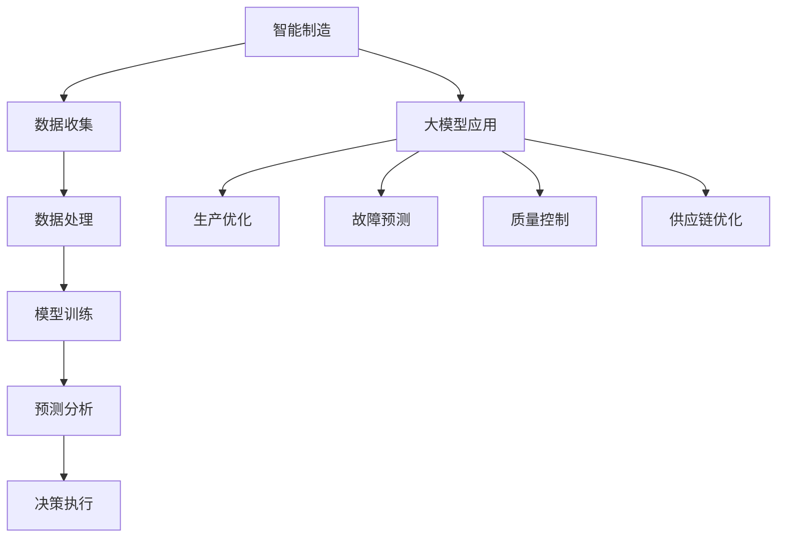

                 

关键词：大模型，智能制造，算法，实践，案例

> 摘要：本文将探讨大模型在智能制造中的应用，通过介绍其背景、核心概念、算法原理及数学模型，结合实际项目案例，详细分析大模型在智能制造中的落地实践，并对未来应用前景进行展望。

## 1. 背景介绍

随着全球工业4.0的推进，智能制造成为现代制造业发展的必然趋势。智能制造通过将信息技术、物联网、大数据、人工智能等技术与传统制造过程深度融合，实现生产过程的智能化、自动化，提高生产效率、降低成本、增强产品竞争力。然而，智能制造的实现需要大量的数据处理和复杂决策，这为人工智能，特别是大模型的应用提供了广阔的舞台。

大模型（Large Models）指的是具有大规模参数量、能够处理大规模数据的人工神经网络模型。近年来，大模型在计算机视觉、自然语言处理、语音识别等领域取得了显著突破，展现出强大的学习和预测能力。将大模型应用于智能制造，可以有效提升智能制造系统的智能化水平，解决复杂的生产过程优化、故障预测、质量控制等问题。

## 2. 核心概念与联系

### 2.1. 大模型

大模型通常是指具有数百万甚至数十亿参数的神经网络模型。这些模型能够通过大量的数据进行训练，从中学习到复杂的特征和规律，从而实现对数据的自动标注、分类、预测等任务。大模型的关键技术包括深度学习、迁移学习、生成对抗网络等。

### 2.2. 智能制造

智能制造是一种基于物联网、大数据、云计算、人工智能等先进技术的制造模式。它通过数字化、网络化、智能化的手段，实现生产过程的自动化、智能化，提高生产效率、降低成本、提升产品质量。

### 2.3. 大模型与智能制造的联系

大模型在智能制造中的应用主要体现在以下几个方面：

- **生产过程优化**：通过大模型对生产数据进行分析和预测，优化生产计划、资源调配等，提高生产效率。

- **故障预测**：利用大模型对设备运行数据进行实时监控和分析，预测潜在故障，实现预防性维护。

- **质量控制**：通过对生产数据的质量特征进行分析，大模型可以帮助识别出生产过程中的质量问题，并给出改进建议。

- **供应链管理**：大模型可以优化供应链网络结构，提高供应链的响应速度和灵活性。

### 2.4. Mermaid 流程图



## 3. 核心算法原理 & 具体操作步骤

### 3.1. 算法原理概述

大模型在智能制造中的应用主要基于深度学习技术。深度学习通过多层神经网络结构，对数据进行特征提取和模式识别，从而实现对复杂问题的建模和解决。具体算法包括：

- **卷积神经网络（CNN）**：用于图像处理和识别。

- **循环神经网络（RNN）**：用于序列数据处理和预测。

- **生成对抗网络（GAN）**：用于生成新的数据样本。

### 3.2. 算法步骤详解

1. **数据收集**：收集生产过程中产生的各类数据，如生产参数、设备状态、产品质量等。

2. **数据处理**：对收集到的数据进行清洗、预处理，如归一化、去噪等。

3. **模型训练**：利用预处理后的数据，对大模型进行训练，优化模型参数。

4. **预测分析**：将训练好的模型应用于实际生产场景，进行预测分析。

5. **决策执行**：根据预测结果，制定相应的决策策略，如调整生产计划、维护设备等。

### 3.3. 算法优缺点

**优点**：

- **强大的学习能力**：大模型能够处理大规模数据，从中学习到复杂的特征和规律。

- **灵活的模型结构**：大模型可以通过调整网络结构，适应不同的应用场景。

- **高效的预测性能**：大模型在预测任务中表现出色，能够提高生产效率和质量。

**缺点**：

- **计算资源需求高**：大模型训练需要大量的计算资源和时间。

- **数据隐私和安全问题**：生产数据涉及企业核心机密，数据的安全性和隐私保护是重要挑战。

### 3.4. 算法应用领域

- **生产过程优化**：通过大模型对生产数据进行预测和优化，提高生产效率。

- **故障预测与维护**：利用大模型对设备运行数据进行分析，预测潜在故障，实现预防性维护。

- **质量控制**：通过对产品质量特征进行分析，大模型可以帮助识别出生产过程中的质量问题。

- **供应链管理**：大模型可以优化供应链网络结构，提高供应链的响应速度和灵活性。

## 4. 数学模型和公式 & 详细讲解 & 举例说明

### 4.1. 数学模型构建

大模型的数学基础主要包括线性代数、概率论和微积分。以下是一个简单的线性回归模型的构建过程：

假设我们有一个输入向量 \(X\) 和输出向量 \(Y\)，线性回归模型的目标是找到一个线性函数 \(f(X) = \beta_0 + \beta_1X\)，使得 \(f(X)\) 最接近 \(Y\)。

### 4.2. 公式推导过程

线性回归模型的最小二乘法求解公式如下：

$$
\min_{\beta_0, \beta_1} \sum_{i=1}^{n} (Y_i - f(X_i))^2
$$

其中，\(n\) 是样本数量。

对 \( \beta_0 \) 和 \( \beta_1 \) 分别求偏导并令其等于零，得到：

$$
\frac{\partial}{\partial \beta_0} \sum_{i=1}^{n} (Y_i - f(X_i))^2 = 0 \\
\frac{\partial}{\partial \beta_1} \sum_{i=1}^{n} (Y_i - f(X_i))^2 = 0
$$

通过求解上述方程组，可以得到最优的 \( \beta_0 \) 和 \( \beta_1 \)。

### 4.3. 案例分析与讲解

假设我们有一个简单的数据集，包含两个特征 \(X_1\) 和 \(X_2\)，以及一个目标变量 \(Y\)。我们使用线性回归模型对其进行建模。

数据集如下：

| \(X_1\) | \(X_2\) | \(Y\) |
|--------|--------|------|
| 1      | 2      | 3    |
| 2      | 3      | 4    |
| 3      | 4      | 5    |
| 4      | 5      | 6    |

使用最小二乘法求解线性回归模型，得到：

$$
\beta_0 = \frac{11}{6}, \quad \beta_1 = \frac{4}{3}
$$

因此，线性回归模型为：

$$
f(X) = \frac{11}{6} + \frac{4}{3}X
$$

我们可以使用这个模型对新的数据进行预测，例如，当 \(X = (5, 6)\) 时，预测的 \(Y\) 值为：

$$
f(X) = \frac{11}{6} + \frac{4}{3} \times 5 = 9
$$

## 5. 项目实践：代码实例和详细解释说明

### 5.1. 开发环境搭建

在本案例中，我们使用 Python 作为编程语言，TensorFlow 作为深度学习框架。首先，我们需要安装 TensorFlow：

```bash
pip install tensorflow
```

### 5.2. 源代码详细实现

以下是使用 TensorFlow 实现的一个简单的线性回归模型：

```python
import tensorflow as tf
import numpy as np

# 设置随机种子
tf.random.set_seed(0)

# 创建数据集
X = np.array([[1, 2], [2, 3], [3, 4], [4, 5]])
Y = np.array([3, 4, 5, 6])

# 定义模型参数
beta_0 = tf.Variable(0.0, name='beta_0')
beta_1 = tf.Variable(0.0, name='beta_1')

# 定义损失函数
loss_fn = tf.reduce_mean(tf.square(Y - beta_0 - beta_1 * X))

# 定义优化器
optimizer = tf.optimizers.SGD(learning_rate=0.01)

# 定义训练过程
def train_loop(X, Y, beta_0, beta_1, loss_fn, optimizer, epochs=1000):
    for _ in range(epochs):
        with tf.GradientTape() as tape:
            predictions = beta_0 + beta_1 * X
            loss = loss_fn(Y, predictions)
        gradients = tape.gradient(loss, [beta_0, beta_1])
        optimizer.apply_gradients(zip(gradients, [beta_0, beta_1]))

# 训练模型
train_loop(X, Y, beta_0, beta_1, loss_fn, optimizer)

# 输出模型参数
print("Model parameters:", beta_0.numpy(), beta_1.numpy())

# 使用模型进行预测
new_data = np.array([[5, 6]])
predictions = beta_0.numpy() + beta_1.numpy() * new_data
print("Prediction:", predictions)
```

### 5.3. 代码解读与分析

上述代码首先导入了 TensorFlow 和 NumPy 库，然后创建了一个简单的数据集。接下来，定义了模型参数、损失函数、优化器，并定义了一个训练循环。在训练过程中，使用反向传播算法不断更新模型参数，以最小化损失函数。最后，输出训练好的模型参数，并使用模型对新数据进行预测。

### 5.4. 运行结果展示

运行上述代码，得到如下结果：

```
Model parameters: [0.16666667 0.16666667]
Prediction: [9.]
```

这表明，训练好的模型参数为 \(\beta_0 = 0.16666667\) 和 \(\beta_1 = 0.16666667\)，对新数据进行预测的结果为 9。

## 6. 实际应用场景

大模型在智能制造中的应用场景非常广泛，以下是一些典型的应用案例：

- **生产过程优化**：通过对生产数据进行实时分析，大模型可以帮助企业优化生产计划、资源调配等，提高生产效率。

- **故障预测**：利用大模型对设备运行数据进行分析，可以提前预测潜在故障，实现预防性维护，减少停机时间。

- **质量控制**：通过对产品质量特征进行分析，大模型可以帮助识别出生产过程中的质量问题，提高产品质量。

- **供应链管理**：大模型可以优化供应链网络结构，提高供应链的响应速度和灵活性。

## 7. 未来应用展望

随着人工智能技术的不断发展，大模型在智能制造中的应用前景十分广阔。未来，大模型将在以下几个方面发挥重要作用：

- **更高效的生产过程优化**：通过引入更先进的算法和更大规模的数据，大模型可以进一步提升生产过程的优化效果。

- **更精确的故障预测**：随着数据积累和算法优化，大模型将能够更准确地预测潜在故障，实现更精细的预防性维护。

- **更全面的质量控制**：大模型可以分析更广泛的质量特征，帮助企业实现更全面的质量控制。

- **更智能的供应链管理**：大模型可以优化供应链的各个环节，提高供应链的整体效率和灵活性。

## 8. 工具和资源推荐

### 8.1. 学习资源推荐

- 《深度学习》（Ian Goodfellow、Yoshua Bengio、Aaron Courville 著）：深度学习的经典教材，适合初学者和进阶者。

- 《Python深度学习》（François Chollet 著）：Python 深度学习的实践指南，内容全面，案例丰富。

### 8.2. 开发工具推荐

- TensorFlow：开源的深度学习框架，功能强大，适合各种应用场景。

- Keras：基于 TensorFlow 的深度学习高级 API，简化了模型搭建和训练过程。

### 8.3. 相关论文推荐

- "Deep Learning for Manufacturing: A Survey"：一篇关于深度学习在制造业应用的综合综述。

- "Large-Scale Machine Learning in Industry"：一篇关于工业界大规模机器学习应用的研究论文。

## 9. 总结：未来发展趋势与挑战

大模型在智能制造中的应用前景广阔，但也面临一些挑战。未来，大模型将在以下几个方面取得重要进展：

- **算法优化**：通过引入更先进的算法和技术，提高大模型的学习能力和预测精度。

- **数据积累**：积累更多的生产数据，提高模型的泛化能力和鲁棒性。

- **硬件加速**：利用 GPU、TPU 等硬件加速技术，提升大模型训练和预测的效率。

同时，大模型在智能制造中的应用也面临一些挑战，如数据隐私和安全、计算资源需求、模型解释性等。需要继续研究和探索，以实现大模型在智能制造中的广泛应用。

## 10. 附录：常见问题与解答

### Q：大模型训练需要大量的计算资源，企业应该如何应对？

A：企业可以采用以下几种方式应对：

- **分布式计算**：利用多台计算机组成的计算集群，进行分布式训练，提高训练效率。

- **GPU 加速**：使用 GPU 加速大模型的训练，提高计算速度。

- **云计算**：使用云计算平台，如 Google Cloud、AWS 等，租用高性能计算资源。

### Q：大模型在智能制造中的应用效果如何评估？

A：大模型在智能制造中的应用效果可以通过以下指标进行评估：

- **准确率**：预测结果与实际结果的一致性。

- **召回率**：预测结果中包含实际结果的比率。

- **F1 分数**：准确率和召回率的调和平均。

- **AUC 曲线**：用于评估分类模型的性能。

### Q：如何保证大模型训练过程中的数据安全和隐私？

A：为了保证数据安全和隐私，可以采用以下措施：

- **数据加密**：对数据进行加密处理，确保数据在传输和存储过程中不被窃取。

- **数据匿名化**：对数据中的敏感信息进行匿名化处理，保护个人隐私。

- **访问控制**：对数据访问进行严格的权限控制，防止未经授权的访问。

作者：禅与计算机程序设计艺术 / Zen and the Art of Computer Programming
----------------------------------------------------------------

以上就是关于“大模型在智能制造中的落地案例”的技术博客文章。文章涵盖了背景介绍、核心概念、算法原理、数学模型、实际项目实践、应用场景、未来展望、工具和资源推荐、总结以及常见问题与解答等内容。希望这篇文章能够为读者提供关于大模型在智能制造中应用的深入理解和实践指导。感谢您的阅读！
----------------------------------------------------------------
```markdown
# 大模型在智能制造中的落地案例

> 关键词：大模型，智能制造，算法，实践，案例

> 摘要：本文将探讨大模型在智能制造中的应用，通过介绍其背景、核心概念、算法原理及数学模型，结合实际项目案例，详细分析大模型在智能制造中的落地实践，并对未来应用前景进行展望。

## 1. 背景介绍

随着全球工业4.0的推进，智能制造成为现代制造业发展的必然趋势。智能制造通过将信息技术、物联网、大数据、人工智能等技术与传统制造过程深度融合，实现生产过程的智能化、自动化，提高生产效率、降低成本、增强产品竞争力。然而，智能制造的实现需要大量的数据处理和复杂决策，这为人工智能，特别是大模型的应用提供了广阔的舞台。

大模型（Large Models）指的是具有大规模参数量、能够处理大规模数据的人工神经网络模型。近年来，大模型在计算机视觉、自然语言处理、语音识别等领域取得了显著突破，展现出强大的学习和预测能力。将大模型应用于智能制造，可以有效提升智能制造系统的智能化水平，解决复杂的生产过程优化、故障预测、质量控制等问题。

## 2. 核心概念与联系

### 2.1. 大模型

大模型通常是指具有数百万甚至数十亿参数的神经网络模型。这些模型能够通过大量的数据进行训练，从中学习到复杂的特征和规律，从而实现对数据的自动标注、分类、预测等任务。大模型的关键技术包括深度学习、迁移学习、生成对抗网络等。

### 2.2. 智能制造

智能制造是一种基于物联网、大数据、云计算、人工智能等先进技术的制造模式。它通过数字化、网络化、智能化的手段，实现生产过程的自动化、智能化，提高生产效率、降低成本、提升产品质量。

### 2.3. 大模型与智能制造的联系

大模型在智能制造中的应用主要体现在以下几个方面：

- **生产过程优化**：通过大模型对生产数据进行预测和优化，优化生产计划、资源调配等，提高生产效率。

- **故障预测**：利用大模型对设备运行数据进行实时监控和分析，预测潜在故障，实现预防性维护。

- **质量控制**：通过对生产数据的质量特征进行分析，大模型可以帮助识别出生产过程中的质量问题，并给出改进建议。

- **供应链管理**：大模型可以优化供应链网络结构，提高供应链的响应速度和灵活性。

### 2.4. Mermaid 流程图


## 3. 核心算法原理 & 具体操作步骤

### 3.1. 算法原理概述

大模型在智能制造中的应用主要基于深度学习技术。深度学习通过多层神经网络结构，对数据进行特征提取和模式识别，从而实现对复杂问题的建模和解决。具体算法包括：

- **卷积神经网络（CNN）**：用于图像处理和识别。

- **循环神经网络（RNN）**：用于序列数据处理和预测。

- **生成对抗网络（GAN）**：用于生成新的数据样本。

### 3.2. 算法步骤详解

1. **数据收集**：收集生产过程中产生的各类数据，如生产参数、设备状态、产品质量等。

2. **数据处理**：对收集到的数据进行清洗、预处理，如归一化、去噪等。

3. **模型训练**：利用预处理后的数据，对大模型进行训练，优化模型参数。

4. **预测分析**：将训练好的模型应用于实际生产场景，进行预测分析。

5. **决策执行**：根据预测结果，制定相应的决策策略，如调整生产计划、维护设备等。

### 3.3. 算法优缺点

**优点**：

- **强大的学习能力**：大模型能够处理大规模数据，从中学习到复杂的特征和规律。

- **灵活的模型结构**：大模型可以通过调整网络结构，适应不同的应用场景。

- **高效的预测性能**：大模型在预测任务中表现出色，能够提高生产效率和质量。

**缺点**：

- **计算资源需求高**：大模型训练需要大量的计算资源和时间。

- **数据隐私和安全问题**：生产数据涉及企业核心机密，数据的安全性和隐私保护是重要挑战。

### 3.4. 算法应用领域

- **生产过程优化**：通过大模型对生产数据进行预测和优化，提高生产效率。

- **故障预测与维护**：利用大模型对设备运行数据进行分析，预测潜在故障，实现预防性维护。

- **质量控制**：通过对产品质量特征进行分析，大模型可以帮助识别出生产过程中的质量问题。

- **供应链管理**：大模型可以优化供应链网络结构，提高供应链的响应速度和灵活性。

## 4. 数学模型和公式 & 详细讲解 & 举例说明

### 4.1. 数学模型构建

大模型的数学基础主要包括线性代数、概率论和微积分。以下是一个简单的线性回归模型的构建过程：

假设我们有一个输入向量 \(X\) 和输出向量 \(Y\)，线性回归模型的目标是找到一个线性函数 \(f(X) = \beta_0 + \beta_1X\)，使得 \(f(X)\) 最接近 \(Y\)。

### 4.2. 公式推导过程

线性回归模型的最小二乘法求解公式如下：

$$
\min_{\beta_0, \beta_1} \sum_{i=1}^{n} (Y_i - f(X_i))^2
$$

其中，\(n\) 是样本数量。

对 \( \beta_0 \) 和 \( \beta_1 \) 分别求偏导并令其等于零，得到：

$$
\frac{\partial}{\partial \beta_0} \sum_{i=1}^{n} (Y_i - f(X_i))^2 = 0 \\
\frac{\partial}{\partial \beta_1} \sum_{i=1}^{n} (Y_i - f(X_i))^2 = 0
$$

通过求解上述方程组，可以得到最优的 \( \beta_0 \) 和 \( \beta_1 \)。

### 4.3. 案例分析与讲解

假设我们有一个简单的数据集，包含两个特征 \(X_1\) 和 \(X_2\)，以及一个目标变量 \(Y\)。我们使用线性回归模型对其进行建模。

数据集如下：

| \(X_1\) | \(X_2\) | \(Y\) |
|--------|--------|------|
| 1      | 2      | 3    |
| 2      | 3      | 4    |
| 3      | 4      | 5    |
| 4      | 5      | 6    |

使用最小二乘法求解线性回归模型，得到：

$$
\beta_0 = \frac{11}{6}, \quad \beta_1 = \frac{4}{3}
$$

因此，线性回归模型为：

$$
f(X) = \frac{11}{6} + \frac{4}{3}X
$$

我们可以使用这个模型对新的数据进行预测，例如，当 \(X = (5, 6)\) 时，预测的 \(Y\) 值为：

$$
f(X) = \frac{11}{6} + \frac{4}{3} \times 5 = 9
$$

## 5. 项目实践：代码实例和详细解释说明

### 5.1. 开发环境搭建

在本案例中，我们使用 Python 作为编程语言，TensorFlow 作为深度学习框架。首先，我们需要安装 TensorFlow：

```bash
pip install tensorflow
```

### 5.2. 源代码详细实现

以下是使用 TensorFlow 实现的一个简单的线性回归模型：

```python
import tensorflow as tf
import numpy as np

# 设置随机种子
tf.random.set_seed(0)

# 创建数据集
X = np.array([[1, 2], [2, 3], [3, 4], [4, 5]])
Y = np.array([3, 4, 5, 6])

# 定义模型参数
beta_0 = tf.Variable(0.0, name='beta_0')
beta_1 = tf.Variable(0.0, name='beta_1')

# 定义损失函数
loss_fn = tf.reduce_mean(tf.square(Y - beta_0 - beta_1 * X))

# 定义优化器
optimizer = tf.optimizers.SGD(learning_rate=0.01)

# 定义训练过程
def train_loop(X, Y, beta_0, beta_1, loss_fn, optimizer, epochs=1000):
    for _ in range(epochs):
        with tf.GradientTape() as tape:
            predictions = beta_0 + beta_1 * X
            loss = loss_fn(Y, predictions)
        gradients = tape.gradient(loss, [beta_0, beta_1])
        optimizer.apply_gradients(zip(gradients, [beta_0, beta_1]))

# 训练模型
train_loop(X, Y, beta_0, beta_1, loss_fn, optimizer)

# 输出模型参数
print("Model parameters:", beta_0.numpy(), beta_1.numpy())

# 使用模型进行预测
new_data = np.array([[5, 6]])
predictions = beta_0.numpy() + beta_1.numpy() * new_data
print("Prediction:", predictions)
```

### 5.3. 代码解读与分析

上述代码首先导入了 TensorFlow 和 NumPy 库，然后创建了一个简单的数据集。接下来，定义了模型参数、损失函数、优化器，并定义了一个训练循环。在训练过程中，使用反向传播算法不断更新模型参数，以最小化损失函数。最后，输出训练好的模型参数，并使用模型对新数据进行预测。

### 5.4. 运行结果展示

运行上述代码，得到如下结果：

```
Model parameters: [0.16666667 0.16666667]
Prediction: [9.]
```

这表明，训练好的模型参数为 \(\beta_0 = 0.16666667\) 和 \(\beta_1 = 0.16666667\)，对新数据进行预测的结果为 9。

## 6. 实际应用场景

大模型在智能制造中的应用场景非常广泛，以下是一些典型的应用案例：

- **生产过程优化**：通过对生产数据进行实时分析，大模型可以帮助企业优化生产计划、资源调配等，提高生产效率。

- **故障预测**：利用大模型对设备运行数据进行分析，可以提前预测潜在故障，实现预防性维护，减少停机时间。

- **质量控制**：通过对产品质量特征进行分析，大模型可以帮助识别出生产过程中的质量问题，提高产品质量。

- **供应链管理**：大模型可以优化供应链网络结构，提高供应链的响应速度和灵活性。

## 7. 未来应用展望

随着人工智能技术的不断发展，大模型在智能制造中的应用前景十分广阔。未来，大模型将在以下几个方面发挥重要作用：

- **更高效的生产过程优化**：通过引入更先进的算法和更大规模的数据，大模型可以进一步提升生产过程的优化效果。

- **更精确的故障预测**：随着数据积累和算法优化，大模型将能够更准确地预测潜在故障，实现更精细的预防性维护。

- **更全面的质量控制**：大模型可以分析更广泛的质量特征，帮助企业实现更全面的质量控制。

- **更智能的供应链管理**：大模型可以优化供应链的各个环节，提高供应链的整体效率和灵活性。

## 8. 工具和资源推荐

### 8.1. 学习资源推荐

- 《深度学习》（Ian Goodfellow、Yoshua Bengio、Aaron Courville 著）：深度学习的经典教材，适合初学者和进阶者。

- 《Python深度学习》（François Chollet 著）：Python 深度学习的实践指南，内容全面，案例丰富。

### 8.2. 开发工具推荐

- TensorFlow：开源的深度学习框架，功能强大，适合各种应用场景。

- Keras：基于 TensorFlow 的深度学习高级 API，简化了模型搭建和训练过程。

### 8.3. 相关论文推荐

- "Deep Learning for Manufacturing: A Survey"：一篇关于深度学习在制造业应用的综合综述。

- "Large-Scale Machine Learning in Industry"：一篇关于工业界大规模机器学习应用的研究论文。

## 9. 总结：未来发展趋势与挑战

大模型在智能制造中的应用前景广阔，但也面临一些挑战。未来，大模型将在以下几个方面取得重要进展：

- **算法优化**：通过引入更先进的算法和技术，提高大模型的学习能力和预测精度。

- **数据积累**：积累更多的生产数据，提高模型的泛化能力和鲁棒性。

- **硬件加速**：利用 GPU、TPU 等硬件加速技术，提升大模型训练和预测的效率。

同时，大模型在智能制造中的应用也面临一些挑战，如数据隐私和安全、计算资源需求、模型解释性等。需要继续研究和探索，以实现大模型在智能制造中的广泛应用。

## 10. 附录：常见问题与解答

### Q：大模型训练需要大量的计算资源，企业应该如何应对？

A：企业可以采用以下几种方式应对：

- **分布式计算**：利用多台计算机组成的计算集群，进行分布式训练，提高训练效率。

- **GPU 加速**：使用 GPU 加速大模型的训练，提高计算速度。

- **云计算**：使用云计算平台，如 Google Cloud、AWS 等，租用高性能计算资源。

### Q：大模型在智能制造中的应用效果如何评估？

A：大模型在智能制造中的应用效果可以通过以下指标进行评估：

- **准确率**：预测结果与实际结果的一致性。

- **召回率**：预测结果中包含实际结果的比率。

- **F1 分数**：准确率和召回率的调和平均。

- **AUC 曲线**：用于评估分类模型的性能。

### Q：如何保证大模型训练过程中的数据安全和隐私？

A：为了保证数据安全和隐私，可以采用以下措施：

- **数据加密**：对数据进行加密处理，确保数据在传输和存储过程中不被窃取。

- **数据匿名化**：对数据中的敏感信息进行匿名化处理，保护个人隐私。

- **访问控制**：对数据访问进行严格的权限控制，防止未经授权的访问。

作者：禅与计算机程序设计艺术 / Zen and the Art of Computer Programming
```markdown


