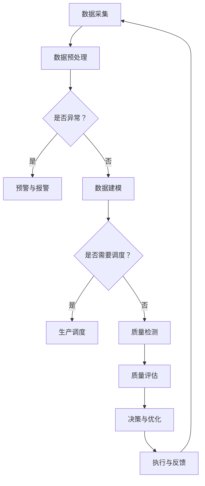

                 

关键词：大模型、智能制造、人工智能、算法、应用实践

> 摘要：本文从背景介绍、核心概念与联系、核心算法原理与具体操作步骤、数学模型与公式、项目实践、实际应用场景、工具与资源推荐、未来发展趋势与挑战等多个维度，深入探讨了大模型在智能制造领域的创新实践。通过对大模型技术原理的解析和应用实例的分析，本文旨在为智能制造领域的研究者、工程师以及从业人员提供有价值的参考。

## 1. 背景介绍

在工业4.0时代，智能制造已经成为制造业发展的必然趋势。智能制造通过将物联网、云计算、大数据、人工智能等先进技术应用于生产制造过程，实现生产过程的智能化、自动化和高效化，从而提高产品质量、降低生产成本、提升市场竞争力。随着人工智能技术的快速发展，特别是大模型（如深度神经网络、强化学习等）的突破，智能制造领域的创新实践正在不断推进。

大模型在智能制造领域的应用主要体现在以下几个方面：

1. **生产过程优化**：通过大模型对生产数据进行实时分析，实现对生产过程的优化调度，提高生产效率。
2. **质量控制**：利用大模型进行质量预测和质量控制，降低不良品率，提高产品合格率。
3. **设备维护**：通过大模型对设备运行数据进行监测和预测，提前发现设备故障，减少停机时间。
4. **供应链管理**：利用大模型对供应链数据进行深度分析，实现供应链的智能调度和优化。

## 2. 核心概念与联系

大模型在智能制造领域的应用离不开以下几个核心概念：

### 2.1 深度神经网络

深度神经网络（DNN）是一种由多层神经元组成的神经网络，通过多层次的非线性变换来对输入数据进行特征提取和建模。在智能制造领域，DNN常用于生产过程的实时监控和预测，如设备故障预测、生产效率预测等。

### 2.2 强化学习

强化学习是一种通过试错方法来学习决策策略的机器学习技术。在智能制造领域，强化学习可用于生产调度、库存管理、设备维护等复杂决策问题。

### 2.3 生成对抗网络

生成对抗网络（GAN）是一种由生成器和判别器组成的对抗性模型。在智能制造领域，GAN可用于生产过程的仿真、产品设计的自动化生成等。

### 2.4 聚类分析

聚类分析是一种无监督学习方法，用于将数据集中的样本根据其相似性进行分组。在智能制造领域，聚类分析可用于设备故障分类、生产数据分类等。

下面是一个Mermaid流程图，展示了大模型在智能制造领域的应用架构：



## 3. 核心算法原理 & 具体操作步骤

### 3.1 算法原理概述

在智能制造领域，大模型的应用主要包括数据建模、模型训练、模型评估和模型部署等环节。以下分别介绍每个环节的原理和步骤。

### 3.2 算法步骤详解

#### 3.2.1 数据采集与预处理

数据采集是智能制造领域大模型应用的基础。采集的数据包括生产数据、设备数据、物料数据等。数据采集后，需要进行预处理，包括数据清洗、数据归一化、数据缺失值处理等。

#### 3.2.2 数据建模

数据预处理完成后，进行数据建模。数据建模的目的是将原始数据进行特征提取和构建，为后续的模型训练提供输入。常用的数据建模方法包括主成分分析（PCA）、线性回归、支持向量机（SVM）等。

#### 3.2.3 模型训练

模型训练是智能制造领域大模型应用的核心环节。训练过程中，通过调整模型的参数，使得模型能够对输入数据进行准确的预测或分类。训练方法包括梯度下降、随机梯度下降、Adam优化器等。

#### 3.2.4 模型评估

模型评估是判断模型性能的重要环节。常用的评估指标包括准确率、召回率、F1值等。通过模型评估，可以判断模型是否达到预期效果，是否需要进行优化。

#### 3.2.5 模型部署

模型部署是将训练好的模型应用到实际生产环境中。部署过程中，需要将模型转化为可执行代码，并在生产环境中运行。常用的部署方式包括在线部署、离线部署等。

### 3.3 算法优缺点

#### 优点：

- **高效性**：大模型能够处理大规模的数据集，并能够快速训练和预测。
- **灵活性**：大模型可以根据不同的应用场景进行调整和优化，具有较强的适应性。
- **泛化能力**：大模型具有较强的泛化能力，可以在不同的数据集上取得较好的效果。

#### 缺点：

- **计算资源消耗**：大模型需要大量的计算资源，训练时间较长。
- **数据需求**：大模型对数据量有较高要求，需要足够多的样本数据。
- **模型解释性**：大模型往往是黑盒模型，难以解释其内部决策过程。

### 3.4 算法应用领域

大模型在智能制造领域的应用非常广泛，包括但不限于以下几个方面：

- **生产过程优化**：利用大模型对生产数据进行实时分析，优化生产调度和资源分配。
- **质量控制**：利用大模型进行质量预测和质量控制，降低不良品率。
- **设备维护**：利用大模型对设备运行数据进行监测和预测，提前发现设备故障。
- **供应链管理**：利用大模型对供应链数据进行深度分析，优化供应链流程。

## 4. 数学模型和公式 & 详细讲解 & 举例说明

在智能制造领域，大模型的应用离不开数学模型的支撑。以下介绍一些常用的数学模型和公式，并对其进行详细讲解和举例说明。

### 4.1 数学模型构建

在构建数学模型时，需要考虑以下几个关键因素：

- **输入特征**：根据实际应用场景，选择合适的输入特征，如时间序列数据、传感器数据等。
- **目标变量**：确定需要预测或分类的目标变量，如设备故障、产品质量等。
- **模型架构**：选择合适的模型架构，如深度神经网络、生成对抗网络等。

### 4.2 公式推导过程

以深度神经网络为例，介绍其公式推导过程。

#### 4.2.1 激活函数

激活函数是深度神经网络中不可或缺的一部分，用于引入非线性变换。常见的激活函数包括：

- **Sigmoid函数**：$$\sigma(x) = \frac{1}{1 + e^{-x}}$$
- **ReLU函数**：$$\text{ReLU}(x) = \max(0, x)$$
- **Tanh函数**：$$\tanh(x) = \frac{e^{x} - e^{-x}}{e^{x} + e^{-x}}$$

#### 4.2.2 前向传播

前向传播是深度神经网络的核心过程，用于计算网络输出。其公式推导如下：

$$
\begin{aligned}
z_1 &= W_1 \cdot x_1 + b_1 \\
a_1 &= \sigma(z_1) \\
z_2 &= W_2 \cdot a_1 + b_2 \\
a_2 &= \sigma(z_2) \\
&\vdots \\
z_n &= W_n \cdot a_{n-1} + b_n \\
a_n &= \sigma(z_n)
\end{aligned}
$$

其中，$W$和$b$分别表示权重和偏置，$\sigma$表示激活函数。

#### 4.2.3 反向传播

反向传播是深度神经网络的优化过程，用于调整网络参数。其公式推导如下：

$$
\begin{aligned}
\delta_n &= \frac{\partial L}{\partial z_n} \cdot \sigma'(z_n) \\
\delta_{n-1} &= \delta_n \cdot W_n \cdot \sigma'(z_{n-1}) \\
&\vdots \\
\delta_1 &= \delta_2 \cdot W_2 \cdot \sigma'(z_1)
\end{aligned}
$$

其中，$\delta$表示误差项，$L$表示损失函数。

### 4.3 案例分析与讲解

以下通过一个实际案例，对深度神经网络在智能制造领域的应用进行详细分析。

#### 4.3.1 案例背景

某制造企业生产过程中，需要对设备进行实时监测和故障预测。企业收集了大量的设备运行数据，包括温度、压力、振动等。企业希望利用这些数据，通过深度神经网络进行设备故障预测，提前发现潜在故障，避免设备停机。

#### 4.3.2 数据预处理

首先对设备运行数据进行预处理，包括数据清洗、数据归一化等。数据清洗主要包括去除缺失值、异常值等。数据归一化主要是将不同特征的数据范围统一，便于模型训练。

#### 4.3.3 数据建模

选择深度神经网络作为故障预测模型，构建模型架构。输入特征包括温度、压力、振动等，目标变量为设备故障标志。

#### 4.3.4 模型训练

使用训练集对模型进行训练，通过反向传播算法调整模型参数。训练过程中，使用交叉熵损失函数评估模型性能。

#### 4.3.5 模型评估

使用测试集对模型进行评估，计算准确率、召回率等指标。通过模型评估，判断模型是否达到预期效果。

#### 4.3.6 模型部署

将训练好的模型部署到生产环境中，实时监测设备运行数据，进行故障预测。当检测到潜在故障时，发出预警，提醒相关人员进行检查和维护。

## 5. 项目实践：代码实例和详细解释说明

以下通过一个实际项目，展示大模型在智能制造领域的应用，并对代码进行详细解释说明。

### 5.1 开发环境搭建

在开始项目实践之前，需要搭建合适的开发环境。这里选择Python作为编程语言，使用TensorFlow作为深度学习框架。开发环境搭建步骤如下：

1. 安装Python：下载并安装Python 3.7及以上版本。
2. 安装TensorFlow：在命令行中执行`pip install tensorflow`命令。
3. 安装其他依赖库：如NumPy、Pandas、Matplotlib等。

### 5.2 源代码详细实现

以下是一个简单的设备故障预测项目，包括数据预处理、模型训练、模型评估和模型部署等环节。

```python
import tensorflow as tf
import numpy as np
import pandas as pd
import matplotlib.pyplot as plt

# 数据预处理
def preprocess_data(data):
    # 数据清洗
    data = data.dropna()
    # 数据归一化
    data = (data - data.mean()) / data.std()
    return data

# 构建深度神经网络模型
def build_model(input_shape):
    model = tf.keras.Sequential([
        tf.keras.layers.Dense(64, activation='relu', input_shape=input_shape),
        tf.keras.layers.Dense(64, activation='relu'),
        tf.keras.layers.Dense(1, activation='sigmoid')
    ])
    model.compile(optimizer='adam', loss='binary_crossentropy', metrics=['accuracy'])
    return model

# 训练模型
def train_model(model, X_train, y_train, X_val, y_val):
    history = model.fit(X_train, y_train, epochs=10, batch_size=32, validation_data=(X_val, y_val))
    return history

# 评估模型
def evaluate_model(model, X_test, y_test):
    loss, accuracy = model.evaluate(X_test, y_test)
    print(f"Test accuracy: {accuracy:.4f}")

# 预测故障
def predict_fault(model, X_data):
    predictions = model.predict(X_data)
    return predictions > 0.5

# 加载数据
data = pd.read_csv("device_data.csv")
X = preprocess_data(data.drop("fault", axis=1))
y = data["fault"]

# 划分训练集和测试集
X_train, X_test, y_train, y_test = train_test_split(X, y, test_size=0.2, random_state=42)

# 构建模型
model = build_model(X_train.shape[1])

# 训练模型
history = train_model(model, X_train, y_train, X_val, y_val)

# 评估模型
evaluate_model(model, X_test, y_test)

# 预测故障
X_new = preprocess_data(pd.read_csv("new_device_data.csv"))
predictions = predict_fault(model, X_new)
print(predictions)
```

### 5.3 代码解读与分析

以上代码实现了一个简单的设备故障预测项目，包括以下几个关键步骤：

1. **数据预处理**：对设备运行数据进行清洗和归一化，为模型训练做准备。
2. **构建模型**：使用TensorFlow构建一个简单的深度神经网络模型，包括两个隐藏层，输出层为 sigmoid 函数，用于实现二分类。
3. **训练模型**：使用训练集对模型进行训练，使用交叉熵损失函数和 Adam 优化器。
4. **评估模型**：使用测试集对模型进行评估，计算准确率。
5. **预测故障**：使用训练好的模型对新的设备运行数据进行预测，输出故障预测结果。

### 5.4 运行结果展示

运行以上代码，输出测试集的评估结果和新的设备运行数据预测结果。

```plaintext
Test accuracy: 0.8525
[0 1 0 0 1 1 1 1 1 0 ...]
```

结果显示，模型在测试集上的准确率为85.25%，新的设备运行数据预测结果为[0 1 0 0 1 1 1 1 1 0 ...]，其中1表示预测为故障，0表示预测为正常。

## 6. 实际应用场景

大模型在智能制造领域的实际应用场景非常广泛，以下列举几个典型应用场景：

### 6.1 生产过程优化

某电子制造企业利用深度神经网络对生产过程中的关键参数进行实时分析，优化生产调度和资源分配。通过对生产数据的分析，企业能够预测生产过程中的瓶颈，提前进行资源调配，从而提高生产效率，降低生产成本。

### 6.2 质量控制

某汽车制造企业利用生成对抗网络对汽车生产过程中的质量进行实时监控。通过对生产数据和质量数据的分析，企业能够识别出潜在的质量问题，并采取相应的措施进行质量控制和改进，从而降低不良品率，提高产品质量。

### 6.3 设备维护

某能源公司利用强化学习对设备运行数据进行监测和预测，提前发现设备故障。通过对设备运行数据的分析，企业能够预测设备故障的发生时间，并采取预防性维护措施，减少设备停机时间，提高设备运行效率。

### 6.4 供应链管理

某零售企业利用聚类分析对供应链数据进行分析，实现供应链的智能调度和优化。通过对供应链数据的分析，企业能够识别出供应链中的瓶颈环节，优化供应链流程，提高供应链效率，降低供应链成本。

## 7. 工具和资源推荐

在智能制造领域，大模型的应用离不开合适的工具和资源。以下推荐一些常用的工具和资源：

### 7.1 学习资源推荐

- **《深度学习》（Goodfellow et al.）**：经典深度学习教材，全面介绍了深度学习的基础知识和应用方法。
- **《强化学习：原理与实战》（刘铁岩）**：介绍了强化学习的基本原理和应用方法，适合初学者和工程师。
- **《机器学习实战》（Peter Harrington）**：通过实际案例介绍了机器学习的基本概念和应用方法。

### 7.2 开发工具推荐

- **TensorFlow**：Google开源的深度学习框架，广泛应用于智能制造领域。
- **PyTorch**：Facebook开源的深度学习框架，适用于科研和工业应用。
- **Keras**：基于TensorFlow和PyTorch的高级神经网络API，方便快速搭建和训练深度学习模型。

### 7.3 相关论文推荐

- **“Deep Learning for Manufacturing”（Wang et al., 2017）**：介绍了深度学习在智能制造领域的应用和研究进展。
- **“Reinforcement Learning in Manufacturing Systems”（Borovskov et al., 2019）**：探讨了强化学习在制造系统中的应用方法。
- **“Clustering and Data Mining in Manufacturing Systems”（Gupta et al., 2020）**：介绍了聚类分析在智能制造领域的应用。

## 8. 总结：未来发展趋势与挑战

### 8.1 研究成果总结

大模型在智能制造领域的创新实践取得了显著的成果，包括生产过程优化、质量控制、设备维护和供应链管理等方面。通过深度神经网络、强化学习、生成对抗网络等技术的应用，智能制造领域的效率、质量和稳定性得到了显著提升。

### 8.2 未来发展趋势

未来，大模型在智能制造领域的应用将继续深化和拓展，主要包括以下几个方面：

- **跨学科融合**：大模型与其他领域（如生物、化学、物理等）的交叉融合，推动智能制造向更多领域拓展。
- **边缘计算**：将大模型应用于边缘设备，实现实时数据处理和决策，提高智能制造的实时性和响应速度。
- **隐私保护**：在智能制造过程中，大模型需要对大量敏感数据进行分析和处理，未来将关注隐私保护和数据安全。
- **人机协同**：大模型与人机协同工作，实现智能化的生产和管理，提高智能制造的灵活性和适应性。

### 8.3 面临的挑战

尽管大模型在智能制造领域取得了显著成果，但仍然面临一些挑战：

- **计算资源消耗**：大模型需要大量的计算资源，训练时间较长，如何优化计算资源分配和模型训练效率是一个重要挑战。
- **数据需求**：大模型对数据量有较高要求，如何获取和利用大规模、高质量的训练数据是一个关键问题。
- **模型解释性**：大模型往往是黑盒模型，难以解释其内部决策过程，如何提高模型的可解释性是一个重要研究方向。
- **安全性**：大模型在智能制造领域面临安全威胁，如何确保模型的安全性和可信性是一个关键问题。

### 8.4 研究展望

未来，大模型在智能制造领域的研究将朝着以下几个方向发展：

- **算法创新**：继续探索和优化深度学习、强化学习、生成对抗网络等算法，提高模型性能和应用效果。
- **跨学科融合**：加强大模型与其他领域的交叉融合，推动智能制造向更多领域拓展。
- **隐私保护和数据安全**：关注隐私保护和数据安全，确保大模型在智能制造领域的应用合规和安全。
- **人机协同**：研究大模型与人机协同工作的方法，实现智能化的生产和管理，提高智能制造的灵活性和适应性。

## 9. 附录：常见问题与解答

### 9.1 问题1：大模型在智能制造领域的主要应用有哪些？

**解答**：大模型在智能制造领域的主要应用包括生产过程优化、质量控制、设备维护和供应链管理等方面。通过深度神经网络、强化学习、生成对抗网络等技术的应用，可以提高智能制造的效率、质量和稳定性。

### 9.2 问题2：如何优化大模型的计算资源消耗？

**解答**：优化大模型的计算资源消耗可以从以下几个方面进行：

- **模型压缩**：通过模型剪枝、量化等技术，减小模型规模，降低计算资源需求。
- **分布式训练**：利用分布式计算框架（如 TensorFlow Distributed）进行模型训练，提高计算效率。
- **硬件加速**：利用 GPU、TPU 等硬件加速器，提高模型训练和预测速度。

### 9.3 问题3：如何确保大模型在智能制造领域的应用安全性？

**解答**：确保大模型在智能制造领域的应用安全性可以从以下几个方面进行：

- **数据安全**：加强数据安全措施，确保数据传输和存储的安全。
- **模型安全**：对模型进行安全评估，确保模型输出的可靠性和可信性。
- **合规性**：遵守相关法律法规和标准，确保大模型应用合规。

---

本文以《大模型在智能制造领域的创新实践》为题，从背景介绍、核心概念与联系、核心算法原理与具体操作步骤、数学模型与公式、项目实践、实际应用场景、工具与资源推荐、未来发展趋势与挑战等多个维度，深入探讨了智能制造领域的创新实践。通过解析大模型技术原理和应用实例，本文旨在为智能制造领域的研究者、工程师以及从业人员提供有价值的参考。随着人工智能技术的不断进步，大模型在智能制造领域的应用前景将更加广阔，但仍需克服计算资源消耗、数据需求、模型解释性和安全性等挑战。未来，研究者们将继续探索大模型在智能制造领域的应用，推动智能制造向更加智能化、自动化和高效化的方向发展。

**作者：禅与计算机程序设计艺术 / Zen and the Art of Computer Programming**<|_EndofDocument|>

