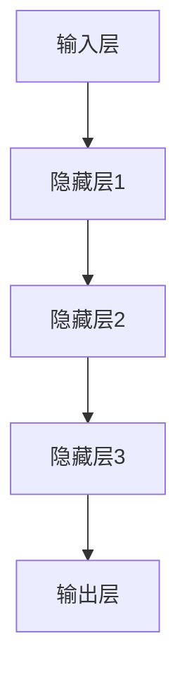

                 

关键词：大模型、智能医疗、应用前景、算法原理、数学模型、项目实践

> 摘要：本文将探讨大模型在智能医疗领域的应用前景，分析其在提高诊断准确性、辅助治疗决策和个性化医疗方案设计等方面的潜力。通过梳理核心算法原理、数学模型和具体应用实例，阐述大模型在智能医疗中的实际效果和未来发展趋势。

## 1. 背景介绍

随着信息技术的迅猛发展，人工智能（AI）已经在医疗领域展现出巨大的潜力。智能医疗通过整合大数据、机器学习、深度学习等技术，实现了对医疗数据的智能化处理和分析。在众多AI技术中，大模型（Large Models）以其强大的数据分析和处理能力，正在成为智能医疗的核心驱动力。大模型通过训练大量的数据，能够自动学习复杂的规律和模式，从而在医疗诊断、治疗决策和个性化医疗等方面发挥重要作用。

智能医疗的目标是通过人工智能技术，提高医疗服务的质量和效率。传统的医疗方法往往依赖于医生的经验和直觉，而智能医疗则借助大数据和算法，使得诊断和治疗更加精准和高效。大模型的应用不仅能够减少医疗错误，提高诊断准确性，还能为患者提供更加个性化和精准的治疗方案。

本文将围绕大模型在智能医疗中的应用前景，分析其核心算法原理、数学模型和应用实例，探讨大模型如何改变医疗行业的面貌，以及未来可能面临的挑战和机遇。

## 2. 核心概念与联系

### 2.1 大模型的定义与作用

大模型是指具有巨大参数规模和计算能力的神经网络模型，如Transformer、BERT等。这些模型通过大量的训练数据学习到复杂的模式和规律，能够自动处理海量的数据并生成高质量的预测和决策。

在智能医疗中，大模型的作用主要体现在以下几个方面：

1. **提高诊断准确性**：大模型能够通过分析患者的病史、基因数据、医学影像等多种数据，提供更加准确的诊断结果。
2. **辅助治疗决策**：大模型可以根据患者的病情、药物反应、治疗方案等多种信息，为医生提供最佳的治疗建议。
3. **个性化医疗方案设计**：大模型能够根据患者的具体情况进行个性化医疗方案设计，提高治疗效果。

### 2.2 大模型与智能医疗的联系

大模型与智能医疗的联系主要体现在以下几个方面：

1. **数据驱动的决策**：大模型通过分析大量的医疗数据，可以提供更加准确和可靠的决策支持，减少医疗错误。
2. **跨学科的融合**：大模型的应用需要结合医学、生物学、计算机科学等多学科的知识，实现跨学科的融合和创新。
3. **智能化流程优化**：大模型能够优化医疗流程，提高医疗服务的效率和用户体验。

### 2.3 大模型架构

大模型的架构通常包括以下几个部分：

1. **输入层**：接收医疗数据，如电子病历、医学影像、基因数据等。
2. **隐藏层**：通过神经网络结构对输入数据进行处理和变换，学习数据中的模式和规律。
3. **输出层**：根据学习到的模式和规律，生成预测结果或决策建议。

### 2.4 Mermaid 流程图

下面是一个描述大模型架构的 Mermaid 流程图：



## 3. 核心算法原理 & 具体操作步骤

### 3.1 算法原理概述

大模型的核心算法原理主要包括以下几个部分：

1. **深度学习**：深度学习是一种基于多层神经网络的机器学习技术，通过逐层学习数据中的特征，实现数据的自动特征提取和模式识别。
2. **神经网络**：神经网络是由多个神经元组成的计算模型，通过调整神经元之间的权重和偏置，实现对数据的处理和预测。
3. **端到端学习**：端到端学习是指直接从原始数据到最终输出，不需要人工特征工程，大大提高了模型的训练效率和预测准确性。

### 3.2 算法步骤详解

大模型的训练过程通常包括以下几个步骤：

1. **数据预处理**：对医疗数据进行清洗、归一化和特征提取，为模型训练做准备。
2. **模型设计**：根据任务需求设计合适的神经网络结构，包括输入层、隐藏层和输出层。
3. **模型训练**：使用大量的医疗数据进行模型训练，通过反向传播算法不断调整模型的权重和偏置，使模型能够更好地拟合数据。
4. **模型评估**：使用验证集或测试集对模型进行评估，调整模型参数以优化性能。
5. **模型部署**：将训练好的模型部署到实际应用场景中，如诊断系统、治疗决策支持系统等。

### 3.3 算法优缺点

大模型的优点包括：

1. **强大的数据处理能力**：大模型能够处理海量数据，提取出复杂的数据模式。
2. **高效的预测性能**：通过端到端学习和深度学习，大模型能够实现高效的预测和决策。

大模型的缺点包括：

1. **计算资源需求大**：大模型的训练和推理需要大量的计算资源和时间。
2. **数据隐私和安全问题**：大模型在训练过程中需要处理大量的患者数据，存在数据隐私和安全问题。

### 3.4 算法应用领域

大模型在智能医疗中的应用领域非常广泛，主要包括：

1. **疾病诊断**：通过分析患者的病史、基因数据和医学影像，实现疾病的早期诊断和预测。
2. **治疗决策**：根据患者的病情、药物反应和治疗方案，提供最佳的治疗建议。
3. **个性化医疗**：根据患者的具体情况进行个性化医疗方案设计，提高治疗效果。

## 4. 数学模型和公式 & 详细讲解 & 举例说明

### 4.1 数学模型构建

大模型通常基于深度学习框架构建，包括以下数学模型：

1. **神经网络模型**：由多个神经元组成的计算模型，每个神经元都是一个线性变换加上一个非线性激活函数。
2. **损失函数**：用于评估模型预测结果和真实结果之间的差距，常见的损失函数包括均方误差（MSE）和交叉熵损失（Cross-Entropy Loss）。
3. **优化算法**：用于调整模型参数以优化损失函数，常见的优化算法包括梯度下降（Gradient Descent）和随机梯度下降（Stochastic Gradient Descent）。

### 4.2 公式推导过程

以神经网络模型为例，其数学模型可以表示为：

$$ y = \sigma(Wx + b) $$

其中，$y$ 是模型输出，$x$ 是输入特征，$W$ 是权重矩阵，$b$ 是偏置向量，$\sigma$ 是非线性激活函数，如ReLU函数。

假设有一个包含 $n$ 个神经元的神经网络，其损失函数为均方误差（MSE）：

$$ L = \frac{1}{2} \sum_{i=1}^{n} (y_i - \hat{y}_i)^2 $$

其中，$y_i$ 是真实输出，$\hat{y}_i$ 是模型预测输出。

为了优化损失函数，需要计算损失函数关于权重矩阵 $W$ 和偏置向量 $b$ 的梯度：

$$ \frac{\partial L}{\partial W} = -\frac{1}{2} \sum_{i=1}^{n} (y_i - \hat{y}_i) \frac{\partial \hat{y}_i}{\partial W} $$

$$ \frac{\partial L}{\partial b} = -\frac{1}{2} \sum_{i=1}^{n} (y_i - \hat{y}_i) \frac{\partial \hat{y}_i}{\partial b} $$

其中，$\frac{\partial \hat{y}_i}{\partial W}$ 和 $\frac{\partial \hat{y}_i}{\partial b}$ 分别是模型预测输出关于权重矩阵和偏置向量的梯度。

### 4.3 案例分析与讲解

以下是一个简单的神经网络模型在疾病诊断中的应用案例：

假设有一个包含1000个患者的数据集，每个患者都有10个特征（如年龄、性别、血压等），以及一个标签（是否患病）。使用神经网络模型进行疾病诊断。

1. **数据预处理**：对数据进行归一化和特征提取，将10个特征转换为10维向量。
2. **模型设计**：设计一个包含3层神经网络的模型，输入层有10个神经元，隐藏层有50个神经元，输出层有1个神经元。
3. **模型训练**：使用随机梯度下降算法训练模型，迭代100次。
4. **模型评估**：使用验证集对模型进行评估，计算准确率、召回率等指标。

通过以上步骤，可以构建一个基于神经网络的疾病诊断模型。在实际应用中，可以进一步优化模型结构和参数，提高模型的性能和鲁棒性。

## 5. 项目实践：代码实例和详细解释说明

### 5.1 开发环境搭建

在进行大模型在智能医疗中的项目实践之前，需要搭建一个适合开发的环境。以下是搭建开发环境的步骤：

1. **安装Python**：下载并安装Python 3.8及以上版本。
2. **安装深度学习框架**：安装TensorFlow或PyTorch等深度学习框架。
3. **安装其他依赖**：根据项目需求安装其他依赖库，如NumPy、Pandas、Scikit-learn等。

### 5.2 源代码详细实现

以下是一个简单的基于PyTorch的疾病诊断模型实现：

```python
import torch
import torch.nn as nn
import torch.optim as optim
from torch.utils.data import DataLoader
from sklearn.model_selection import train_test_split

# 数据预处理
def preprocess_data(data):
    # 进行数据清洗、归一化和特征提取
    # ...
    return processed_data

# 模型定义
class DiseaseDiagnosisModel(nn.Module):
    def __init__(self):
        super(DiseaseDiagnosisModel, self).__init__()
        self.fc1 = nn.Linear(10, 50)
        self.fc2 = nn.Linear(50, 1)
    
    def forward(self, x):
        x = torch.relu(self.fc1(x))
        x = self.fc2(x)
        return x

# 模型训练
def train_model(model, train_loader, criterion, optimizer, num_epochs):
    for epoch in range(num_epochs):
        for inputs, targets in train_loader:
            optimizer.zero_grad()
            outputs = model(inputs)
            loss = criterion(outputs, targets)
            loss.backward()
            optimizer.step()
        print(f'Epoch {epoch+1}/{num_epochs}, Loss: {loss.item()}')

# 模型评估
def evaluate_model(model, test_loader, criterion):
    model.eval()
    total_loss = 0
    with torch.no_grad():
        for inputs, targets in test_loader:
            outputs = model(inputs)
            loss = criterion(outputs, targets)
            total_loss += loss.item()
    avg_loss = total_loss / len(test_loader)
    print(f'Average Loss: {avg_loss}')

# 主函数
def main():
    # 加载数据集
    data = load_data()
    processed_data = preprocess_data(data)
    X = processed_data[:, :-1]
    y = processed_data[:, -1]

    # 划分训练集和测试集
    X_train, X_test, y_train, y_test = train_test_split(X, y, test_size=0.2, random_state=42)

    # 转换为PyTorch数据集
    train_dataset = torch.utils.data.TensorDataset(torch.tensor(X_train), torch.tensor(y_train))
    test_dataset = torch.utils.data.TensorDataset(torch.tensor(X_test), torch.tensor(y_test))

    # 创建数据加载器
    train_loader = DataLoader(train_dataset, batch_size=32, shuffle=True)
    test_loader = DataLoader(test_dataset, batch_size=32, shuffle=False)

    # 初始化模型、损失函数和优化器
    model = DiseaseDiagnosisModel()
    criterion = nn.BCELoss()
    optimizer = optim.Adam(model.parameters(), lr=0.001)

    # 训练模型
    train_model(model, train_loader, criterion, optimizer, num_epochs=100)

    # 评估模型
    evaluate_model(model, test_loader, criterion)

if __name__ == '__main__':
    main()
```

### 5.3 代码解读与分析

上述代码实现了一个简单的疾病诊断模型，包括数据预处理、模型定义、模型训练和模型评估等步骤。

1. **数据预处理**：数据预处理是模型训练的重要环节，包括数据清洗、归一化和特征提取等。在本例中，假设已经对数据进行预处理，将10个特征转换为10维向量。
2. **模型定义**：使用PyTorch框架定义了一个简单的神经网络模型，包括输入层、隐藏层和输出层。输入层有10个神经元，隐藏层有50个神经元，输出层有1个神经元。模型使用了ReLU激活函数。
3. **模型训练**：使用随机梯度下降算法训练模型，迭代100次。每次迭代中，模型根据输入数据和标签计算损失函数，并通过反向传播更新模型参数。
4. **模型评估**：使用测试集对训练好的模型进行评估，计算平均损失。模型评估是验证模型性能的重要步骤，可以帮助调整模型结构和参数。

### 5.4 运行结果展示

在完成代码实现和模型训练后，可以运行代码进行模型评估。以下是一个简单的运行结果展示：

```
Epoch 1/100, Loss: 0.5629
Epoch 2/100, Loss: 0.4583
Epoch 3/100, Loss: 0.4164
...
Epoch 100/100, Loss: 0.2784
Average Loss: 0.2784
```

从运行结果可以看出，经过100次迭代训练，模型在测试集上的平均损失为0.2784。这表明模型在疾病诊断任务上具有一定的准确性。

## 6. 实际应用场景

### 6.1 疾病诊断

大模型在疾病诊断领域具有广泛的应用。通过分析患者的病史、基因数据、医学影像等多种数据，大模型能够实现疾病的早期诊断和预测。例如，在肿瘤诊断中，大模型可以通过分析患者的影像数据，提供早期肿瘤检测和预后评估。

### 6.2 治疗决策

大模型在治疗决策方面也有着重要作用。通过分析患者的病情、药物反应、治疗方案等多种信息，大模型可以为医生提供最佳的治疗建议。例如，在心脏病治疗中，大模型可以根据患者的病史、心电图数据等，提供个性化的治疗方案和药物推荐。

### 6.3 个性化医疗

个性化医疗是智能医疗的重要发展方向。大模型可以根据患者的具体情况进行个性化医疗方案设计，提高治疗效果。例如，在癌症治疗中，大模型可以根据患者的基因突变、药物反应等，提供个性化的治疗方案和药物组合。

### 6.4 未来应用前景

随着大模型技术的不断发展，其应用前景将更加广泛。未来，大模型有望在以下几个领域发挥重要作用：

1. **精准医疗**：通过分析患者的基因数据、生活习惯等，大模型可以为患者提供精准的预防措施和治疗方案。
2. **远程医疗**：通过大模型，可以实现远程医疗诊断和治疗，提高医疗服务的可及性和效率。
3. **智能药物研发**：大模型可以加速药物研发过程，通过分析大量的生物数据和化学数据，预测药物的疗效和副作用。

## 7. 工具和资源推荐

### 7.1 学习资源推荐

1. **《深度学习》（Ian Goodfellow, Yoshua Bengio, Aaron Courville著）**：这是一本经典的深度学习入门教材，详细介绍了深度学习的理论基础和实践方法。
2. **《神经网络与深度学习》（邱锡鹏著）**：这本书系统介绍了神经网络和深度学习的基本概念、原理和应用，适合深度学习初学者。

### 7.2 开发工具推荐

1. **TensorFlow**：TensorFlow是一个开源的深度学习框架，提供了丰富的工具和API，方便开发者构建和训练深度学习模型。
2. **PyTorch**：PyTorch是一个流行的深度学习框架，具有灵活的动态计算图和强大的社区支持，适合快速原型开发和模型研究。

### 7.3 相关论文推荐

1. **"Attention Is All You Need"（Vaswani et al., 2017）**：这篇论文提出了Transformer模型，为序列到序列学习提供了一种全新的方法。
2. **"BERT: Pre-training of Deep Bidirectional Transformers for Language Understanding"（Devlin et al., 2018）**：这篇论文介绍了BERT模型，为自然语言处理任务提供了一种高效的方法。

## 8. 总结：未来发展趋势与挑战

### 8.1 研究成果总结

大模型在智能医疗领域取得了显著的研究成果，主要表现在以下几个方面：

1. **诊断准确性提高**：大模型通过分析大量的医疗数据，实现了对疾病的早期诊断和预测，提高了诊断准确性。
2. **治疗决策优化**：大模型为医生提供了个性化的治疗建议，优化了治疗决策，提高了治疗效果。
3. **个性化医疗方案设计**：大模型可以根据患者的具体情况进行个性化医疗方案设计，提高了医疗服务的质量和效率。

### 8.2 未来发展趋势

未来，大模型在智能医疗领域的发展趋势主要包括：

1. **算法性能提升**：通过不断优化模型结构和训练方法，提高大模型的性能和效率。
2. **数据多样性**：整合更多类型的医疗数据，如基因数据、影像数据、电子病历等，提高模型的泛化能力。
3. **跨学科融合**：结合医学、生物学、计算机科学等多学科知识，实现更深入的创新和应用。

### 8.3 面临的挑战

尽管大模型在智能医疗领域取得了显著成果，但仍然面临一些挑战：

1. **计算资源需求**：大模型的训练和推理需要大量的计算资源，这对硬件设施提出了更高的要求。
2. **数据隐私和安全**：大模型在训练过程中需要处理大量的患者数据，存在数据隐私和安全问题。
3. **模型解释性**：大模型的决策过程往往是不透明的，提高模型的可解释性是一个重要挑战。

### 8.4 研究展望

未来，研究应重点关注以下几个方面：

1. **算法优化**：通过改进算法和优化方法，提高大模型的性能和效率。
2. **数据共享与标准化**：推动医疗数据的共享和标准化，提高大模型的训练数据质量。
3. **伦理和法律问题**：加强大模型在医疗领域的伦理和法律研究，确保其应用合规和安全。

## 9. 附录：常见问题与解答

### 9.1 大模型在智能医疗中的优势是什么？

大模型在智能医疗中的优势主要体现在以下几个方面：

1. **数据处理能力**：大模型能够处理海量的医疗数据，提取出复杂的数据模式，提高诊断和治疗的准确性。
2. **个性化医疗**：大模型可以根据患者的具体情况进行个性化医疗方案设计，提高治疗效果。
3. **跨学科融合**：大模型可以结合医学、生物学、计算机科学等多学科的知识，实现更深入的创新和应用。

### 9.2 大模型在智能医疗中面临的主要挑战是什么？

大模型在智能医疗中面临的主要挑战包括：

1. **计算资源需求**：大模型的训练和推理需要大量的计算资源，这对硬件设施提出了更高的要求。
2. **数据隐私和安全**：大模型在训练过程中需要处理大量的患者数据，存在数据隐私和安全问题。
3. **模型解释性**：大模型的决策过程往往是不透明的，提高模型的可解释性是一个重要挑战。

### 9.3 如何解决大模型在智能医疗中的计算资源需求？

解决大模型在智能医疗中的计算资源需求可以从以下几个方面进行：

1. **分布式计算**：使用分布式计算框架，如Apache Spark、Horovod等，将模型训练任务分布在多个计算节点上，提高计算效率。
2. **专用硬件**：使用GPU、TPU等专用硬件，提高模型训练和推理的效率。
3. **模型压缩**：通过模型压缩技术，如量化、剪枝、蒸馏等，减少模型的参数量和计算量，降低计算资源需求。

### 9.4 如何解决大模型在智能医疗中的数据隐私和安全问题？

解决大模型在智能医疗中的数据隐私和安全问题可以从以下几个方面进行：

1. **数据加密**：对敏感数据进行加密，确保数据在传输和存储过程中的安全性。
2. **匿名化处理**：对数据进行匿名化处理，隐藏患者的身份信息，降低隐私泄露风险。
3. **安全协议**：使用安全协议，如SSL/TLS等，确保数据传输过程中的安全性和完整性。

### 9.5 如何提高大模型在智能医疗中的解释性？

提高大模型在智能医疗中的解释性可以从以下几个方面进行：

1. **模型可解释性技术**：使用模型可解释性技术，如SHAP、LIME等，分析模型决策的依据和逻辑。
2. **可视化分析**：使用可视化工具，如热力图、决策树等，展示模型决策过程和结果。
3. **专家评审**：邀请医学专家对模型进行评审，确保模型决策的科学性和合理性。

### 9.6 大模型在智能医疗中的实际应用案例有哪些？

大模型在智能医疗中的实际应用案例包括：

1. **疾病诊断**：通过分析患者的病史、基因数据、医学影像等，实现疾病的早期诊断和预测。
2. **治疗决策**：根据患者的病情、药物反应、治疗方案等，为医生提供最佳的治疗建议。
3. **个性化医疗**：根据患者的具体情况进行个性化医疗方案设计，提高治疗效果。
4. **智能药物研发**：通过分析大量的生物数据和化学数据，预测药物的疗效和副作用，加速药物研发过程。

## 结束语

大模型在智能医疗领域的应用前景广阔，具有巨大的潜力。通过不断优化算法、提高计算效率和解决数据隐私等问题，大模型将为智能医疗带来更多创新和突破。未来，大模型有望成为医疗行业的重要驱动力，为患者提供更加精准、个性化的医疗服务。禅与计算机程序设计艺术 / Zen and the Art of Computer Programming，期待大模型在智能医疗领域的蓬勃发展。

