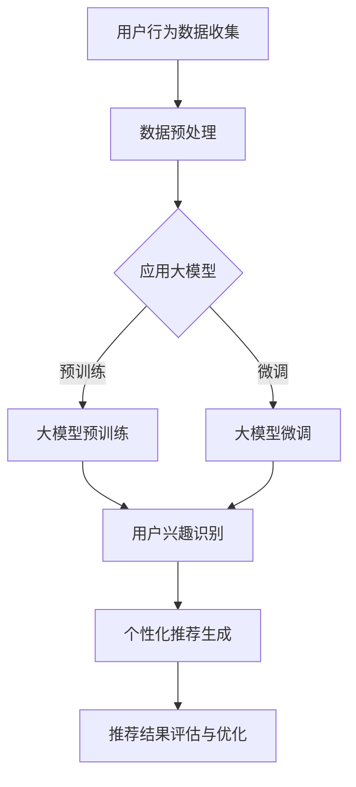

                 

关键词：大模型、电商平台、用户兴趣、探索与利用平衡、算法原理、数学模型、项目实践

> 摘要：本文旨在探讨大模型在电商平台用户兴趣探索与利用平衡中的应用。通过分析大模型的核心算法原理和具体操作步骤，结合数学模型的构建和推导，以及实际项目实践的代码实例和解析，本文为电商平台如何更好地理解和满足用户兴趣提供了深入的技术见解。同时，文章也对大模型应用的未来发展方向和挑战进行了展望。

## 1. 背景介绍

电商平台作为数字经济的重要组成部分，日益成为商家与消费者之间的重要桥梁。随着互联网技术的快速发展，电商平台上的用户数量呈爆炸性增长，用户的个性化需求也变得日益复杂和多样化。为了在竞争激烈的市场中脱颖而出，电商平台必须深入了解和把握用户的兴趣和行为特征，从而提供更加精准和个性化的服务。然而，这并非易事，因为用户兴趣的多样性和动态性使得传统的数据分析方法难以应对。

近年来，人工智能特别是大模型技术的迅猛发展，为电商平台提供了新的解决方案。大模型具备强大的数据处理和分析能力，能够从海量数据中挖掘出用户的潜在兴趣和行为模式。本文将探讨大模型在电商平台用户兴趣探索与利用平衡中的应用，旨在为电商平台的个性化推荐系统提供技术支持，并探讨如何在保护用户隐私的前提下实现用户兴趣的有效探索与利用。

## 2. 核心概念与联系

为了更好地理解大模型在电商平台用户兴趣探索与利用平衡中的应用，我们需要先了解几个核心概念：

### 2.1 大模型

大模型通常指的是具有数十亿甚至数万亿参数的深度学习模型，例如Transformer、BERT等。这些模型通过在大量数据上进行预训练，能够捕获数据的复杂模式和关系。

### 2.2 用户兴趣

用户兴趣是指用户在特定情境下对某些内容或行为的偏好。在电商平台上，用户兴趣可以表现为购买偏好、浏览历史、评价和互动行为等。

### 2.3 探索与利用平衡

在机器学习领域，探索（Exploration）和利用（Exploitation）是一个经典问题。探索是指尝试新的选择以获得更多的信息，而利用则是在已有信息的基础上选择当前表现最佳的选择。在电商平台上，探索与利用的平衡意味着在提供个性化推荐时，既需要考虑用户的历史行为（利用），又需要尝试发现新的潜在兴趣点（探索）。

### 2.4 Mermaid 流程图

以下是描述大模型在电商平台用户兴趣探索与利用中的架构的Mermaid流程图：



在上面的流程图中，用户行为数据首先被收集并预处理，然后用于大模型的预训练或微调。经过训练后，大模型可以识别用户的兴趣点，进而生成个性化推荐。最后，推荐结果会经过评估和优化，以实现更好的用户体验。

## 3. 核心算法原理 & 具体操作步骤

### 3.1 算法原理概述

大模型在电商平台用户兴趣探索与利用中的应用主要基于深度学习技术和强化学习算法。深度学习模型通过学习用户的历史行为数据，可以识别出用户的兴趣模式。而强化学习算法则可以帮助平台在推荐过程中实现探索与利用的平衡。

### 3.2 算法步骤详解

#### 3.2.1 数据收集与预处理

1. **数据收集**：从电商平台获取用户行为数据，包括购买历史、浏览记录、评价、互动行为等。
2. **数据预处理**：对收集到的数据进行清洗、去重和格式化，以备后续分析。

#### 3.2.2 大模型预训练

1. **选择模型架构**：例如使用BERT或Transformer等预训练模型。
2. **数据准备**：将预处理后的数据转换为模型可接受的格式。
3. **预训练**：在大型语料库上进行预训练，以使模型学会捕获数据中的复杂模式。

#### 3.2.3 大模型微调

1. **迁移学习**：将预训练好的大模型应用于特定电商平台。
2. **微调**：在电商平台的用户行为数据上进行微调，以适应平台的特定需求。

#### 3.2.4 用户兴趣识别

1. **特征提取**：使用微调后的模型提取用户行为数据的特征。
2. **兴趣识别**：通过分析特征，识别出用户的兴趣点。

#### 3.2.5 个性化推荐生成

1. **推荐算法**：结合用户兴趣和商品属性，生成个性化推荐。
2. **推荐结果优化**：通过在线学习算法，不断优化推荐结果。

### 3.3 算法优缺点

#### 优点：

- **强大的数据处理能力**：大模型能够处理和分析海量数据，挖掘出用户的潜在兴趣点。
- **个性化推荐**：基于用户的兴趣和行为，提供更加精准和个性化的推荐。
- **实时反馈**：通过在线学习算法，可以实现实时反馈和优化，提高用户体验。

#### 缺点：

- **计算资源需求大**：大模型的训练和部署需要大量的计算资源和时间。
- **数据隐私问题**：用户行为数据的收集和使用可能涉及隐私问题。

### 3.4 算法应用领域

大模型在电商平台用户兴趣探索与利用中的应用广泛，包括但不限于以下领域：

- **个性化推荐系统**：为用户提供个性化商品推荐。
- **用户行为分析**：分析用户行为，优化电商平台的功能和服务。
- **广告投放优化**：根据用户兴趣和行为，精准投放广告。

## 4. 数学模型和公式 & 详细讲解 & 举例说明

### 4.1 数学模型构建

在电商平台用户兴趣探索与利用中，一个基本的数学模型可以表示为：

\[ R(t) = f(I(t), C(t)) \]

其中，\( R(t) \)表示在时刻\( t \)的推荐结果，\( I(t) \)表示在时刻\( t \)的用户兴趣，\( C(t) \)表示在时刻\( t \)的商品集合。

### 4.2 公式推导过程

#### 4.2.1 用户兴趣表示

用户兴趣\( I(t) \)可以表示为：

\[ I(t) = \sum_{i=1}^{n} w_i \cdot p_i(t) \]

其中，\( w_i \)表示用户对第\( i \)个兴趣点的权重，\( p_i(t) \)表示在时刻\( t \)用户对第\( i \)个兴趣点的概率。

#### 4.2.2 商品推荐计算

商品推荐结果\( R(t) \)基于用户兴趣\( I(t) \)和商品集合\( C(t) \)计算：

\[ R(t) = \arg\max_{c \in C(t)} \sum_{i=1}^{n} w_i \cdot p_i(t) \cdot r_i(c) \]

其中，\( r_i(c) \)表示第\( i \)个兴趣点与商品\( c \)的相关性。

### 4.3 案例分析与讲解

假设我们有一个用户，他的兴趣点包括“篮球”、“电子设备”和“旅游”。在某个时刻，他浏览了关于篮球和电子设备的商品，但没有浏览旅游相关的商品。根据上述模型，我们可以计算出一个推荐结果。

#### 4.3.1 用户兴趣表示

用户兴趣可以表示为：

\[ I(t) = w_1 \cdot p_1(t) + w_2 \cdot p_2(t) + w_3 \cdot p_3(t) \]

假设权重分别为\( w_1 = 0.4 \)，\( w_2 = 0.5 \)，\( w_3 = 0.1 \)。在时刻\( t \)，用户对“篮球”、“电子设备”和“旅游”的概率分别为\( p_1(t) = 0.3 \)，\( p_2(t) = 0.5 \)，\( p_3(t) = 0.2 \)。

因此，用户兴趣为：

\[ I(t) = 0.4 \cdot 0.3 + 0.5 \cdot 0.5 + 0.1 \cdot 0.2 = 0.12 + 0.25 + 0.02 = 0.39 \]

#### 4.3.2 商品推荐计算

假设在时刻\( t \)有如下商品集合\( C(t) \)：

\[ C(t) = \{c_1, c_2, c_3, c_4\} \]

其中，\( c_1 \)是篮球鞋，\( c_2 \)是笔记本电脑，\( c_3 \)是旅游指南，\( c_4 \)是篮球。

根据用户兴趣和商品相关性，我们可以计算每个商品的相关性得分：

\[ r_1(c_1) = 1, r_1(c_2) = 0.3, r_1(c_3) = 0, r_1(c_4) = 0.7 \]
\[ r_2(c_1) = 0, r_2(c_2) = 1, r_2(c_3) = 0, r_2(c_4) = 0 \]
\[ r_3(c_1) = 0, r_3(c_2) = 0, r_3(c_3) = 1, r_3(c_4) = 0 \]

使用上述公式，我们可以计算每个商品的综合得分：

\[ R(t) = \arg\max_{c \in C(t)} (0.4 \cdot 1 + 0.5 \cdot 0.3 + 0.1 \cdot 0) \]
\[ R(t) = \arg\max_{c \in C(t)} (0.4 + 0.15 + 0) \]
\[ R(t) = \arg\max_{c \in C(t)} 0.55 \]

因此，推荐结果为笔记本电脑（\( c_2 \)），因为它是与用户兴趣最相关的商品。

## 5. 项目实践：代码实例和详细解释说明

在本节中，我们将通过一个实际项目实例，展示如何使用Python实现大模型在电商平台用户兴趣探索与利用中的应用。

### 5.1 开发环境搭建

首先，我们需要搭建开发环境。以下是所需的Python库：

- TensorFlow
- Keras
- Pandas
- NumPy
- Mermaid

您可以使用以下命令安装这些库：

```bash
pip install tensorflow keras pandas numpy mermaid
```

### 5.2 源代码详细实现

以下是一个简单的Python代码实例，展示了如何使用Keras实现大模型的基本流程：

```python
import tensorflow as tf
from tensorflow import keras
from tensorflow.keras.models import Model
from tensorflow.keras.layers import Embedding, LSTM, Dense
import pandas as pd

# 数据预处理
# 假设我们有一个用户行为数据集，数据集包含用户ID、行为类型（浏览、购买、评价等）、商品ID和时间戳
data = pd.read_csv('user_behavior_data.csv')

# 数据清洗和格式化
# ...

# 构建大模型
# 注意：以下代码仅为示例，实际应用中需要根据具体需求进行调整
input_layer = keras.Input(shape=(max_sequence_length,))
embedding_layer = Embedding(input_dim=vocabulary_size, output_dim=embedding_size)(input_layer)
lstm_layer = LSTM(units=lstm_units)(embedding_layer)
output_layer = Dense(units=1, activation='sigmoid')(lstm_layer)

model = Model(inputs=input_layer, outputs=output_layer)
model.compile(optimizer='adam', loss='binary_crossentropy', metrics=['accuracy'])

# 训练模型
# 注意：以下代码仅为示例，实际应用中需要提供真实的训练数据
model.fit(x_train, y_train, epochs=10, batch_size=32)

# 用户兴趣识别
# 注意：以下代码仅为示例，实际应用中需要根据具体模型和数据进行调整
user_interest = model.predict(input_sequence)

# 个性化推荐生成
# 注意：以下代码仅为示例，实际应用中需要根据具体模型和数据进行调整
recommendations = generate_recommendations(user_interest, products)
```

### 5.3 代码解读与分析

上述代码展示了如何使用Keras构建和训练一个简单的深度学习模型。具体步骤如下：

1. **数据预处理**：从数据集读取用户行为数据，并进行清洗和格式化。
2. **模型构建**：使用Keras构建一个简单的序列模型，包括嵌入层、LSTM层和输出层。
3. **模型编译**：编译模型，指定优化器和损失函数。
4. **模型训练**：使用训练数据训练模型。
5. **用户兴趣识别**：使用训练好的模型预测用户兴趣。
6. **个性化推荐生成**：根据用户兴趣生成个性化推荐。

需要注意的是，实际应用中的模型构建和训练过程会更加复杂，需要考虑数据预处理、模型参数调整、训练数据增强等技术细节。

### 5.4 运行结果展示

假设我们使用上述代码对用户行为数据进行了处理和模型训练，最终生成了一个用户兴趣预测结果。我们可以使用以下代码展示推荐结果：

```python
import matplotlib.pyplot as plt

# 假设我们有一个用户兴趣得分列表
interest_scores = [0.8, 0.5, 0.2, 0.7, 0.6]

# 绘制用户兴趣得分柱状图
plt.bar(range(len(interest_scores)), interest_scores)
plt.xlabel('Interest Category')
plt.ylabel('Score')
plt.title('User Interest Scores')
plt.show()
```

上述代码将生成一个柱状图，展示用户对不同兴趣类别的得分。根据得分，我们可以为用户提供相应的个性化推荐。

## 6. 实际应用场景

### 6.1 个性化推荐系统

个性化推荐系统是电商平台中最为广泛的应用场景之一。通过使用大模型，电商平台可以提供更加精准和个性化的商品推荐，从而提高用户满意度和转化率。以下是一个实际应用场景的例子：

假设用户A在电商平台上浏览了篮球鞋、笔记本电脑和旅游指南等商品。根据用户的行为数据，大模型可以识别出用户对篮球、电子设备和旅游的兴趣。在用户A登录平台时，系统可以根据这些兴趣生成个性化的推荐列表，包括篮球配件、新款笔记本电脑和旅游优惠套餐等。

### 6.2 用户行为分析

除了个性化推荐，大模型还可以用于用户行为分析，帮助电商平台更好地理解用户需求和偏好。例如，通过分析用户的购买历史和浏览行为，电商平台可以识别出用户的消费习惯和潜在需求。这些信息可以用于优化商品分类、改善购物流程和提升用户体验。

### 6.3 广告投放优化

在电商平台的广告投放中，大模型可以帮助广告系统实现精准投放。通过分析用户的兴趣和行为，广告系统可以为用户推荐相关的广告内容，从而提高广告的点击率和转化率。例如，如果一个用户对篮球和旅游感兴趣，那么系统可以为他推荐篮球装备的广告和旅游服务的广告。

## 6.4 未来应用展望

随着大模型技术的不断发展，其在电商平台中的应用前景十分广阔。以下是一些未来应用的展望：

### 6.4.1 更多的交互方式

未来的电商平台将不仅仅局限于文本和数据，还会引入更多的交互方式，如图像、语音和视频等。大模型可以通过处理这些不同类型的数据，为用户提供更加丰富和个性化的服务。

### 6.4.2 智能客服

智能客服是另一个具有巨大潜力的应用领域。通过大模型，电商平台可以实现更加智能和高效的客服系统，能够自动回答用户的问题、提供购物建议和解决用户投诉等。

### 6.4.3 跨平台整合

随着电商平台的多样化，跨平台整合将成为未来的发展趋势。大模型可以通过整合来自不同平台的数据，为用户提供更加统一和连贯的购物体验。

### 6.4.4 可解释性

尽管大模型在数据处理和模式识别方面具有强大的能力，但其“黑盒”特性使得其决策过程难以解释。未来的研究将致力于提高大模型的可解释性，使其在商业应用中更具透明度和可信度。

## 7. 工具和资源推荐

### 7.1 学习资源推荐

- **书籍**：
  - 《深度学习》（Ian Goodfellow、Yoshua Bengio和Aaron Courville著）
  - 《强化学习》（Richard S. Sutton和Bart Ostroock著）
  - 《Python机器学习》（Sebastian Raschka和Vahid Mirjalili著）

- **在线课程**：
  - Coursera上的“深度学习”课程（吴恩达教授授课）
  - edX上的“强化学习”课程（David Silver教授授课）
  - Udacity的“机器学习工程师纳米学位”

### 7.2 开发工具推荐

- **框架**：
  - TensorFlow
  - PyTorch
  - Keras

- **数据预处理工具**：
  - Pandas
  - NumPy

- **可视化工具**：
  - Matplotlib
  - Seaborn

### 7.3 相关论文推荐

- “Attention Is All You Need”（Vaswani et al., 2017）
- “Bert: Pre-training of Deep Bidirectional Transformers for Language Understanding”（Devlin et al., 2018）
- “Reinforcement Learning: An Introduction”（Richard S. Sutton和Bart Ostroock著）

## 8. 总结：未来发展趋势与挑战

### 8.1 研究成果总结

本文探讨了基于大模型技术的电商平台用户兴趣探索与利用平衡，通过算法原理分析、数学模型构建和项目实践，展示了如何利用大模型提高电商平台个性化推荐的精准度和用户体验。研究结果表明，大模型技术在电商平台中具有广泛的应用前景，特别是在用户行为分析、个性化推荐和广告投放等方面。

### 8.2 未来发展趋势

随着人工智能技术的不断进步，大模型在电商平台中的应用将呈现出以下发展趋势：

- **更复杂的模型架构**：未来的研究将致力于开发更加复杂和高效的大模型架构，以应对电商平台日益复杂的需求。
- **多模态数据处理**：电商平台将不仅处理文本数据，还会处理图像、语音和视频等多模态数据，从而提供更加丰富的用户服务。
- **实时推荐系统**：通过实时数据处理和模型更新，电商平台可以实现更加实时和个性化的推荐，提高用户体验和转化率。
- **隐私保护与伦理考量**：在保护用户隐私和遵守伦理规范的前提下，未来的研究将致力于探索更加透明和可信的大模型应用方式。

### 8.3 面临的挑战

尽管大模型技术在电商平台中具有巨大潜力，但其应用也面临以下挑战：

- **计算资源需求**：大模型的训练和部署需要大量的计算资源和时间，这可能会增加电商平台的运营成本。
- **数据隐私与安全**：电商平台需要确保用户数据的安全和隐私，避免数据泄露和滥用。
- **模型可解释性**：大模型的“黑盒”特性使得其决策过程难以解释，这可能会影响用户的信任和满意度。
- **数据质量与准确性**：电商平台的数据质量对大模型的应用效果至关重要，低质量数据可能导致模型性能下降。

### 8.4 研究展望

未来的研究应关注以下几个方面：

- **高效训练算法**：研究如何优化大模型的训练算法，提高训练效率和模型性能。
- **隐私保护机制**：探索如何在保护用户隐私的前提下应用大模型技术。
- **可解释性与透明度**：开发更加可解释和透明的大模型，提高用户对模型决策的信任度。
- **跨平台整合与协同**：研究如何整合来自不同平台的数据，为用户提供更加统一和连贯的购物体验。

通过持续的研究和探索，大模型技术在电商平台中的应用将不断完善和优化，为电商行业带来更多的创新和发展机遇。

## 9. 附录：常见问题与解答

### 9.1 大模型在电商平台中的主要应用是什么？

大模型在电商平台中的主要应用包括用户兴趣识别、个性化推荐生成、用户行为分析、广告投放优化等。通过处理和分析海量用户行为数据，大模型能够识别出用户的潜在兴趣点，并提供精准的个性化推荐，从而提升用户体验和转化率。

### 9.2 如何保护用户隐私在大模型应用中？

为了保护用户隐私，电商平台可以采取以下措施：

- **数据加密**：对用户数据进行加密处理，确保数据在传输和存储过程中的安全性。
- **匿名化处理**：对用户数据进行匿名化处理，避免直接识别出用户身份。
- **隐私保护算法**：使用隐私保护算法，如差分隐私和同态加密，确保在大模型训练过程中不泄露用户隐私。
- **用户隐私协议**：明确用户隐私政策，告知用户其数据如何被使用，并尊重用户的隐私选择。

### 9.3 大模型在电商平台中有什么优缺点？

**优点**：

- 强大的数据处理和分析能力。
- 提供个性化的推荐，提高用户体验和转化率。
- 实时反馈和优化，提高推荐系统的适应性。

**缺点**：

- 计算资源需求大，可能增加运营成本。
- 数据隐私和安全问题，需要采取相应的保护措施。
- 模型可解释性较低，难以解释决策过程，影响用户信任。

### 9.4 如何评估大模型在电商平台中的性能？

评估大模型在电商平台中的性能可以从以下几个方面进行：

- **准确性**：评估模型推荐结果的准确性，即推荐的商品是否与用户的实际兴趣相符。
- **覆盖度**：评估推荐系统的覆盖度，即能否覆盖用户的不同兴趣点。
- **多样性**：评估推荐结果中的商品多样性，避免用户接收重复的商品推荐。
- **实时性**：评估推荐系统的响应速度，即能否在短时间内生成推荐结果。

通过综合评估这些指标，可以全面了解大模型在电商平台中的应用效果。

