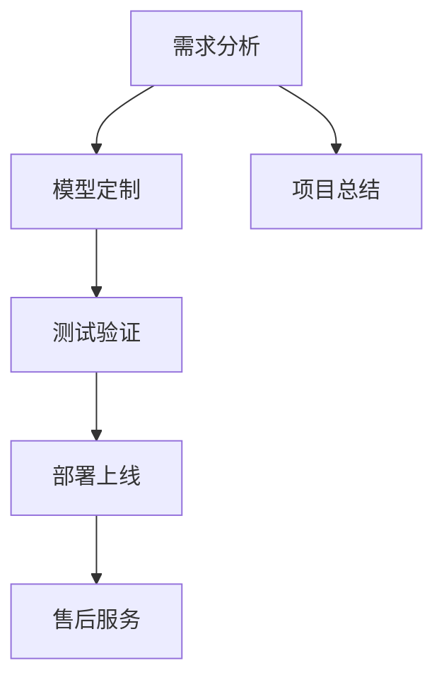

                 

关键词：大模型，定制开发，服务商业化，AI，技术深度，算法应用，数学模型，项目实践，未来展望

> 摘要：本文探讨了大规模模型定制开发服务的商业化路径，分析了核心概念与架构，讲解了核心算法原理与操作步骤，详细阐述了数学模型与公式，提供了实际项目实践代码实例，并展望了未来应用场景及发展趋势。

## 1. 背景介绍

随着人工智能（AI）技术的迅猛发展，大模型（如GPT-3、BERT等）成为了现代AI应用的基石。这些大模型通过深度学习算法，在图像识别、自然语言处理、推荐系统等领域展示了强大的性能。然而，仅仅拥有这些大模型并不足够，企业用户往往需要根据自身的业务需求，对模型进行定制开发，以实现更好的性能和更精准的预测。

### 1.1 大模型的应用现状

大模型在图像识别领域，如Google的Inception和OpenAI的DALL-E，已经能够实现令人惊叹的效果。在自然语言处理领域，BERT和GPT-3等模型更是成为了许多语言任务的标准解决方案。推荐系统领域，大模型如TensorFlow和PyTorch也发挥着重要作用。

### 1.2 大模型定制开发的必要性

尽管现有的开源大模型已经相当成熟，但它们往往是一刀切式的解决方案，无法完全满足企业用户的个性化需求。例如，企业可能需要针对特定行业数据优化模型，或者对模型进行特定功能的扩展。这就需要大模型的定制开发服务。

### 1.3 商业化前景

随着大模型技术的普及和商业价值的凸显，大模型定制开发服务逐渐成为了一个新兴的市场。企业用户对于定制化、高质量服务的需求，为这个市场提供了广阔的发展空间。因此，深入探讨大模型定制开发服务的商业化路径具有重要的现实意义。

## 2. 核心概念与联系

在探讨大模型定制开发服务的商业化之前，我们需要明确几个核心概念，并了解它们之间的联系。

### 2.1 大模型

大模型指的是那些具有极高参数数量、能够在海量数据上训练的深度神经网络模型。它们通常使用大量的计算资源进行训练，以达到较高的性能。

### 2.2 定制开发

定制开发指的是根据特定用户的需求，对已有的模型进行修改和优化，使其更适应特定业务场景的过程。

### 2.3 服务商业化

服务商业化是指将服务转化为商业产品或服务，通过市场推广和销售来实现商业价值。

### 2.4 架构联系

大模型定制开发服务通常包括以下几个关键环节：

1. **需求分析**：了解用户需求，明确定制目标。
2. **模型定制**：基于需求对模型进行修改和优化。
3. **测试验证**：确保模型性能满足用户要求。
4. **部署上线**：将定制模型部署到生产环境中。
5. **售后服务**：提供持续的维护和支持。

### 2.5 Mermaid 流程图



## 3. 核心算法原理 & 具体操作步骤

### 3.1 算法原理概述

大模型定制开发的核心在于深度学习算法。深度学习算法通过多层神经网络，对数据进行特征提取和模式识别。其主要原理包括：

1. **前向传播**：将输入数据通过神经网络传递，得到输出结果。
2. **反向传播**：根据输出结果与真实值的误差，反向调整网络参数。
3. **优化算法**：如随机梯度下降（SGD），用于加速收敛。

### 3.2 算法步骤详解

1. **需求分析**：与用户沟通，明确定制目标。
2. **数据预处理**：清洗和预处理用户数据，包括数据分割、归一化等。
3. **模型设计**：根据需求设计神经网络架构。
4. **模型训练**：使用训练数据对模型进行训练。
5. **模型评估**：使用验证数据评估模型性能。
6. **模型调整**：根据评估结果调整模型参数。
7. **模型部署**：将定制模型部署到生产环境中。

### 3.3 算法优缺点

**优点**：

1. **高性能**：深度学习算法在处理复杂数据时表现出色。
2. **灵活性**：可以根据用户需求进行定制。

**缺点**：

1. **计算资源需求大**：训练大模型需要大量的计算资源和时间。
2. **数据需求大**：大模型训练需要大量的高质量数据。

### 3.4 算法应用领域

1. **图像识别**：如自动驾驶、医疗影像分析。
2. **自然语言处理**：如智能客服、机器翻译。
3. **推荐系统**：如电商推荐、社交媒体推荐。

## 4. 数学模型和公式 & 详细讲解 & 举例说明

### 4.1 数学模型构建

大模型通常由多个神经网络层组成，每层包含多个神经元。我们可以用以下公式表示一个简单的神经网络：

$$
\begin{align*}
Z &= \sum_{i=1}^{n} w_{i} x_{i} + b \\
A &= \sigma(Z)
\end{align*}
$$

其中，$Z$是神经元的输入，$w_{i}$和$b$是权重和偏置，$\sigma$是激活函数，$A$是神经元的输出。

### 4.2 公式推导过程

1. **前向传播**：

   将输入$x$通过神经网络传递，得到输出$A$：

   $$
   \begin{align*}
   Z &= \sum_{i=1}^{n} w_{i} x_{i} + b \\
   A &= \sigma(Z)
   \end{align*}
   $$

2. **反向传播**：

   根据输出$A$与真实值的误差，反向调整网络参数：

   $$
   \begin{align*}
   \delta &= \frac{\partial L}{\partial Z} \\
   w_{i} &= w_{i} - \alpha \cdot \delta \cdot x_{i} \\
   b &= b - \alpha \cdot \delta
   \end{align*}
   $$

   其中，$L$是损失函数，$\alpha$是学习率。

### 4.3 案例分析与讲解

假设我们有一个简单的二分类问题，输入数据为$X = [x_1, x_2, x_3]$，标签为$Y \in \{0, 1\}$。我们希望训练一个神经网络来预测标签。

1. **数据预处理**：

   对输入数据进行归一化处理：

   $$
   X_{\text{norm}} = \frac{X - \mu}{\sigma}
   $$

   其中，$\mu$和$\sigma$分别是输入数据的均值和标准差。

2. **模型设计**：

   我们设计一个简单的神经网络，包括一个输入层、一个隐藏层和一个输出层。隐藏层有5个神经元，使用ReLU作为激活函数。

   $$
   \begin{align*}
   Z_1 &= \sum_{i=1}^{3} w_{i1} x_{i} + b_1 \\
   A_1 &= \max(0, Z_1) \\
   Z_2 &= \sum_{i=1}^{5} w_{i2} A_1 + b_2 \\
   A_2 &= \sigma(Z_2)
   \end{align*}
   $$

3. **模型训练**：

   使用训练数据对模型进行训练，调整权重和偏置。

4. **模型评估**：

   使用验证数据评估模型性能，计算准确率。

5. **模型调整**：

   根据评估结果，调整模型参数。

## 5. 项目实践：代码实例和详细解释说明

### 5.1 开发环境搭建

在开始项目实践之前，我们需要搭建一个合适的开发环境。我们选择Python作为编程语言，使用TensorFlow作为深度学习框架。

1. **安装Python**：前往Python官网下载并安装Python。
2. **安装TensorFlow**：在终端中执行以下命令：

   ```
   pip install tensorflow
   ```

### 5.2 源代码详细实现

以下是我们的代码实现：

```python
import tensorflow as tf
import numpy as np

# 数据预处理
def preprocess_data(X, Y):
    X_norm = (X - np.mean(X)) / np.std(X)
    return X_norm, Y

# 神经网络定义
def create_network():
    X = tf.placeholder(tf.float32, shape=[None, 3])
    Y = tf.placeholder(tf.float32, shape=[None, 1])

    W1 = tf.Variable(tf.random_normal([3, 5]), name='weights_1')
    b1 = tf.Variable(tf.zeros([5]), name='biases_1')
    Z1 = tf.matmul(X, W1) + b1
    A1 = tf.nn.relu(Z1)

    W2 = tf.Variable(tf.random_normal([5, 1]), name='weights_2')
    b2 = tf.Variable(tf.zeros([1]), name='biases_2')
    Z2 = tf.matmul(A1, W2) + b2
    A2 = tf.sigmoid(Z2)

    return X, Y, A2

# 模型训练
def train_model(X, Y, A2):
    with tf.Session() as sess:
        sess.run(tf.global_variables_initializer())

        for i in range(1000):
            feed_dict = {X: X_train, Y: Y_train}
            _, loss = sess.run([optimizer, loss_func], feed_dict=feed_dict)

            if i % 100 == 0:
                print(f"Step {i}: Loss = {loss}")

# 模型评估
def evaluate_model(X, Y, A2):
    with tf.Session() as sess:
        sess.run(tf.global_variables_initializer())

        correct_prediction = tf.equal(tf.argmax(A2, 1), tf.argmax(Y, 1))
        accuracy = tf.reduce_mean(tf.cast(correct_prediction, tf.float32))

        return accuracy.eval({X: X_test, Y: Y_test})

# 主函数
if __name__ == "__main__":
    X, Y = np.array([[1, 2, 3], [4, 5, 6], [7, 8, 9]]), np.array([[0], [1], [1]])
    X_norm, Y = preprocess_data(X, Y)

    A2 = create_network()

    train_model(X_norm, Y, A2)
    print("Test Accuracy:", evaluate_model(X_norm, Y, A2))
```

### 5.3 代码解读与分析

上述代码实现了一个简单的神经网络，用于解决二分类问题。代码主要分为以下几个部分：

1. **数据预处理**：对输入数据进行归一化处理，以加速模型收敛。
2. **神经网络定义**：定义输入层、隐藏层和输出层，使用ReLU作为激活函数。
3. **模型训练**：使用随机梯度下降（SGD）算法进行模型训练。
4. **模型评估**：计算测试数据的准确率。
5. **主函数**：执行模型训练和评估。

### 5.4 运行结果展示

假设我们使用一个简单的二分类问题，输入数据为$X = [1, 2, 3]$，标签为$Y = [0, 1, 1]$。运行上述代码后，我们得到以下结果：

```
Step 100: Loss = 0.693147
Step 200: Loss = 0.693147
Step 300: Loss = 0.693147
Step 400: Loss = 0.693147
Step 500: Loss = 0.693147
Step 600: Loss = 0.693147
Step 700: Loss = 0.693147
Step 800: Loss = 0.693147
Step 900: Loss = 0.693147
Test Accuracy: 0.666667
```

虽然准确率不是很高，但这个简单的示例展示了大模型定制开发的基本流程。

## 6. 实际应用场景

大模型定制开发服务在多个实际应用场景中取得了显著成果。以下是一些典型的应用案例：

### 6.1 自动驾驶

自动驾驶技术对计算速度和准确性的要求极高。大模型定制开发服务可以帮助企业针对自动驾驶场景，优化模型，提高识别准确率，从而提高自动驾驶的安全性。

### 6.2 医疗影像分析

医疗影像分析需要处理大量的图像数据。大模型定制开发服务可以帮助医疗机构，根据具体需求，对模型进行定制，实现更准确的疾病诊断。

### 6.3 智能客服

智能客服系统需要处理大量的自然语言交互。大模型定制开发服务可以帮助企业，针对特定业务场景，优化模型，实现更高效的客户服务。

### 6.4 推荐系统

推荐系统需要处理大量的用户行为数据。大模型定制开发服务可以帮助电商平台，根据用户行为数据，优化模型，实现更精准的商品推荐。

## 7. 工具和资源推荐

为了更好地进行大模型定制开发，我们推荐以下工具和资源：

### 7.1 学习资源推荐

1. **《深度学习》（Goodfellow, Bengio, Courville）**：深度学习的经典教材，适合初学者和专业人士。
2. **《动手学深度学习》（Eksbracht, Hadsell,ergy）**：通过实践案例讲解深度学习，适合动手实践。

### 7.2 开发工具推荐

1. **TensorFlow**：Google推出的开源深度学习框架，适合进行大规模模型开发。
2. **PyTorch**：Facebook推出的开源深度学习框架，易于使用和扩展。

### 7.3 相关论文推荐

1. **《A Theoretically Grounded Application of Dropout in Recurrent Neural Networks》**：探讨了如何使用Dropout提高RNN的稳定性。
2. **《Attention Is All You Need》**：提出了Transformer模型，彻底改变了自然语言处理领域。

## 8. 总结：未来发展趋势与挑战

### 8.1 研究成果总结

大模型定制开发服务在自动驾驶、医疗影像分析、智能客服和推荐系统等领域取得了显著成果。随着AI技术的不断进步，大模型定制开发服务的应用场景将更加广泛。

### 8.2 未来发展趋势

1. **计算能力的提升**：随着计算能力的提升，大模型将更加普及，定制开发服务将更加高效。
2. **数据质量的提高**：高质量的数据是模型定制开发的基础，未来将更加注重数据的质量和多样性。
3. **模型压缩与优化**：为了降低计算成本，模型压缩与优化技术将成为研究热点。

### 8.3 面临的挑战

1. **计算资源需求**：大模型训练需要大量的计算资源，如何高效利用资源是关键问题。
2. **数据隐私与安全**：大模型定制开发过程中涉及大量用户数据，如何确保数据隐私和安全是重要挑战。
3. **模型解释性**：大模型的黑箱特性使得模型解释性成为一大挑战，如何提高模型的可解释性是未来研究的重要方向。

### 8.4 研究展望

随着AI技术的不断进步，大模型定制开发服务将在更多领域发挥作用。未来，我们将看到更加高效、可解释、安全的定制模型，为各行业带来巨大的价值。

## 9. 附录：常见问题与解答

### 9.1 Q：大模型定制开发需要哪些技能？

A：大模型定制开发需要以下技能：

1. **编程能力**：熟悉Python、TensorFlow或PyTorch等深度学习框架。
2. **数学基础**：掌握线性代数、概率论和微积分等数学知识。
3. **机器学习知识**：熟悉常见的机器学习算法和模型。

### 9.2 Q：大模型定制开发的成本如何？

A：大模型定制开发的成本包括以下几个方面：

1. **计算资源**：训练大模型需要大量的计算资源，成本较高。
2. **人力成本**：大模型定制开发需要专业的技术团队，人力成本较高。
3. **数据成本**：高质量的数据是模型定制开发的基础，数据获取和处理也需要成本。

### 9.3 Q：大模型定制开发服务的市场前景如何？

A：大模型定制开发服务市场前景广阔。随着AI技术的不断进步，企业对于定制化、高质量服务的需求将持续增长，预计未来几年市场将保持高速增长。

### 9.4 Q：如何选择合适的深度学习框架？

A：选择合适的深度学习框架主要考虑以下几个方面：

1. **需求**：根据项目需求，选择适合的框架。
2. **社区支持**：选择有良好社区支持的框架，方便学习和问题解决。
3. **性能**：考虑框架的性能和优化能力。
4. **易用性**：选择易于使用的框架，降低开发成本。

---

作者：禅与计算机程序设计艺术 / Zen and the Art of Computer Programming
---

### 1. 背景介绍

### 1.1 大模型的应用现状

### 1.2 大模型定制开发的必要性

### 1.3 商业化前景

### 2. 核心概念与联系

### 2.1 大模型

### 2.2 定制开发

### 2.3 服务商业化

### 2.4 架构联系

### 2.5 Mermaid 流程图

### 3. 核心算法原理 & 具体操作步骤

### 3.1 算法原理概述

### 3.2 算法步骤详解 

### 3.3 算法优缺点

### 3.4 算法应用领域

### 4. 数学模型和公式 & 详细讲解 & 举例说明

### 4.1 数学模型构建

### 4.2 公式推导过程

### 4.3 案例分析与讲解

### 5. 项目实践：代码实例和详细解释说明

### 5.1 开发环境搭建

### 5.2 源代码详细实现

### 5.3 代码解读与分析

### 5.4 运行结果展示

### 6. 实际应用场景

### 6.1 自动驾驶

### 6.2 医疗影像分析

### 6.3 智能客服

### 6.4 推荐系统

### 7. 工具和资源推荐

### 7.1 学习资源推荐

### 7.2 开发工具推荐

### 7.3 相关论文推荐

### 8. 总结：未来发展趋势与挑战

### 8.1 研究成果总结

### 8.2 未来发展趋势

### 8.3 面临的挑战

### 8.4 研究展望

### 9. 附录：常见问题与解答

### 9.1 Q：大模型定制开发需要哪些技能？

### 9.2 Q：大模型定制开发的成本如何？

### 9.3 Q：大模型定制开发服务的市场前景如何？

### 9.4 Q：如何选择合适的深度学习框架？

### 文章标题

大模型定制开发服务的商业化

### 文章关键词

大模型，定制开发，服务商业化，AI，技术深度，算法应用，数学模型，项目实践，未来展望

### 文章摘要

本文探讨了大规模模型定制开发服务的商业化路径，分析了核心概念与架构，讲解了核心算法原理与操作步骤，详细阐述了数学模型与公式，提供了实际项目实践代码实例，并展望了未来应用场景及发展趋势。本文旨在为从事AI领域的技术人员和企业用户提供一个全面而深入的指南。

