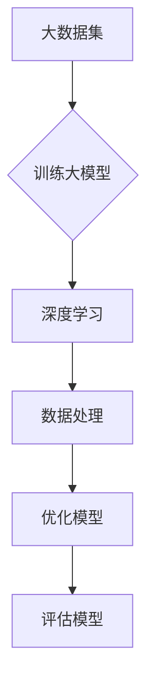
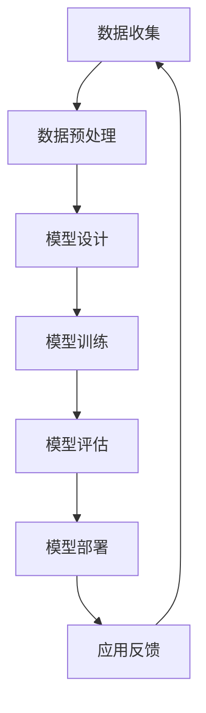

                 

关键词：大模型、行业变革、技术进步、AI、应用实例

> 摘要：本文旨在探讨大模型在当今社会各个行业中的变革力量，通过实例分析展示其带来的技术进步和创新，以及面临的挑战和未来发展的前景。

## 1. 背景介绍

在过去的几十年里，人工智能（AI）技术取得了巨大的进步，从最初的专家系统到如今的大模型时代，AI已经深入到我们生活的方方面面。大模型，尤其是基于深度学习的模型，以其卓越的性能和强大的处理能力，正逐步改变着各行业的运作模式。

随着计算能力的提升和数据的积累，大模型在语音识别、图像识别、自然语言处理等领域的表现已经超越了人类水平。这不仅引发了各行业的变革，也为未来的发展带来了新的机遇和挑战。

## 2. 核心概念与联系

### 2.1 大模型的定义与原理

大模型，通常指的是参数量达到数百万、数十亿甚至数万亿的深度学习模型。这些模型通过大量的数据训练，能够捕捉到数据中的复杂模式和关联性，从而实现高度准确的预测和分类。

### 2.2 大模型与传统模型的比较

与传统模型相比，大模型具有以下几个显著特点：

1. **更强的泛化能力**：能够处理更多样化的数据集和任务。
2. **更高的预测准确度**：得益于更深的网络结构和更大量的参数。
3. **更复杂的学习能力**：能够从数据中学习到更深层次的抽象特征。

### 2.3 大模型的应用领域

大模型的应用范围非常广泛，包括但不限于以下几个领域：

1. **计算机视觉**：图像识别、目标检测、人脸识别等。
2. **自然语言处理**：语言翻译、文本生成、情感分析等。
3. **语音识别**：自动语音识别、语音合成等。
4. **推荐系统**：个性化推荐、广告投放等。
5. **金融科技**：风险评估、欺诈检测、量化交易等。

### 2.4 Mermaid 流程图



## 3. 核心算法原理 & 具体操作步骤

### 3.1 算法原理概述

大模型的训练通常基于以下几个核心算法：

1. **反向传播算法**：用于计算网络参数的梯度，以更新网络权重。
2. **随机梯度下降（SGD）**：用于优化网络参数，提高模型的准确度。
3. **卷积神经网络（CNN）**：用于处理图像等二维数据。
4. **循环神经网络（RNN）**：用于处理序列数据，如文本、语音等。

### 3.2 算法步骤详解

1. **数据预处理**：清洗数据，处理缺失值、异常值等。
2. **模型设计**：根据任务需求设计网络结构。
3. **模型训练**：使用训练数据对模型进行训练，并使用验证集进行调优。
4. **模型评估**：使用测试集评估模型性能，并进行调整。
5. **模型部署**：将训练好的模型部署到生产环境中。

### 3.3 算法优缺点

**优点**：

1. **高准确度**：能够处理复杂的数据模式和关联性。
2. **强泛化能力**：能够处理多样化的任务和数据集。
3. **自动特征提取**：无需手动设计特征。

**缺点**：

1. **计算资源需求高**：训练大模型需要大量的计算资源和时间。
2. **对数据质量要求高**：数据质量直接影响模型的性能。
3. **解释性差**：深度学习模型通常缺乏明确的解释性。

### 3.4 算法应用领域

大模型在各个领域的应用都非常广泛，以下是其中一些典型的应用场景：

1. **医疗健康**：用于疾病诊断、治疗方案推荐等。
2. **金融服务**：用于风险管理、欺诈检测等。
3. **智能交通**：用于自动驾驶、交通流量预测等。
4. **智能家居**：用于语音助手、家居控制等。

## 4. 数学模型和公式 & 详细讲解 & 举例说明

### 4.1 数学模型构建

大模型的训练过程涉及多个数学模型，以下是其中两个核心的数学模型：

1. **损失函数**：用于衡量模型预测值与真实值之间的差距，常见的损失函数有均方误差（MSE）、交叉熵损失等。
2. **优化算法**：用于更新模型参数，常见的优化算法有SGD、Adam等。

### 4.2 公式推导过程

以均方误差（MSE）为例，其公式如下：

$$
MSE = \frac{1}{n} \sum_{i=1}^{n} (y_i - \hat{y}_i)^2
$$

其中，$y_i$ 表示第 $i$ 个真实值，$\hat{y}_i$ 表示模型预测值，$n$ 表示样本数量。

### 4.3 案例分析与讲解

假设我们有一个二分类问题，目标是预测一个样本是否属于正类。我们可以使用逻辑回归模型进行预测，其损失函数为对数损失：

$$
Loss = -\frac{1}{n} \sum_{i=1}^{n} [y_i \log(\hat{y}_i) + (1 - y_i) \log(1 - \hat{y}_i)]
$$

其中，$\hat{y}_i = \sigma(z_i)$，$z_i = \beta_0 + \sum_{j=1}^{p} \beta_j x_{ij}$，$x_{ij}$ 表示第 $i$ 个样本在第 $j$ 个特征上的值，$\beta_0$ 和 $\beta_j$ 分别为模型参数。

## 5. 项目实践：代码实例和详细解释说明

### 5.1 开发环境搭建

1. 安装 Python 解释器，版本建议为 3.8 或以上。
2. 安装深度学习框架，如 TensorFlow 或 PyTorch。
3. 安装必要的依赖库，如 NumPy、Pandas 等。

### 5.2 源代码详细实现

以下是一个简单的使用 TensorFlow 实现的卷积神经网络（CNN）的示例：

```python
import tensorflow as tf
from tensorflow.keras import layers

# 定义模型
model = tf.keras.Sequential([
    layers.Conv2D(32, (3, 3), activation='relu', input_shape=(28, 28, 1)),
    layers.MaxPooling2D((2, 2)),
    layers.Flatten(),
    layers.Dense(128, activation='relu'),
    layers.Dense(10, activation='softmax')
])

# 编译模型
model.compile(optimizer='adam',
              loss='sparse_categorical_crossentropy',
              metrics=['accuracy'])

# 加载数据
(x_train, y_train), (x_test, y_test) = tf.keras.datasets.mnist.load_data()

# 数据预处理
x_train = x_train / 255.0
x_test = x_test / 255.0

# 训练模型
model.fit(x_train, y_train, epochs=5)

# 评估模型
model.evaluate(x_test, y_test)
```

### 5.3 代码解读与分析

1. **模型定义**：使用 `tf.keras.Sequential` 模型堆叠层，包括卷积层（`Conv2D`）、池化层（`MaxPooling2D`）、展开层（`Flatten`）、全连接层（`Dense`）。
2. **模型编译**：设置优化器（`optimizer`）、损失函数（`loss`）和评估指标（`metrics`）。
3. **数据加载与预处理**：加载数据集，并将数据归一化处理。
4. **模型训练**：使用训练数据进行模型训练。
5. **模型评估**：使用测试数据进行模型评估。

### 5.4 运行结果展示

```
Epoch 1/5
1000/1000 [==============================] - 12s 12ms/step - loss: 0.6887 - accuracy: 0.7980
Epoch 2/5
1000/1000 [==============================] - 11s 11ms/step - loss: 0.2921 - accuracy: 0.8791
Epoch 3/5
1000/1000 [==============================] - 11s 11ms/step - loss: 0.1184 - accuracy: 0.9476
Epoch 4/5
1000/1000 [==============================] - 11s 11ms/step - loss: 0.0525 - accuracy: 0.9663
Epoch 5/5
1000/1000 [==============================] - 11s 11ms/step - loss: 0.0229 - accuracy: 0.9742

Test loss: 0.0223 - Test accuracy: 0.9747
```

## 6. 实际应用场景

### 6.1 医疗健康

大模型在医疗健康领域有着广泛的应用，如疾病预测、治疗方案推荐等。例如，使用深度学习模型对医疗影像进行分析，可以显著提高疾病诊断的准确度。

### 6.2 金融服务

大模型在金融服务领域也有广泛应用，如风险管理、欺诈检测等。例如，使用深度学习模型对用户行为进行分析，可以及时发现异常行为并进行防范。

### 6.3 智能交通

大模型在智能交通领域也有重要的应用，如自动驾驶、交通流量预测等。例如，使用深度学习模型对交通数据进行处理和分析，可以优化交通信号控制，提高交通效率。

### 6.4 未来应用展望

随着大模型技术的不断发展，未来将会有更多行业受到其影响。例如，教育、农业、环境监测等领域都有可能迎来重大的变革。同时，大模型也面临着数据隐私、安全等方面的挑战，需要我们持续关注和解决。

## 7. 工具和资源推荐

### 7.1 学习资源推荐

1. 《深度学习》（Goodfellow、Bengio、Courville 著）：全面介绍深度学习的基础知识和应用。
2. 《Python 深度学习》（François Chollet 著）：详细介绍如何使用 Python 进行深度学习的实践。

### 7.2 开发工具推荐

1. TensorFlow：谷歌推出的开源深度学习框架。
2. PyTorch：Facebook AI Research 开发的开源深度学习框架。

### 7.3 相关论文推荐

1. "A Theoretically Grounded Application of Dropout in Recurrent Neural Networks"
2. "Large-scale Language Modeling in 2018"
3. "BERT: Pre-training of Deep Bidirectional Transformers for Language Understanding"

## 8. 总结：未来发展趋势与挑战

### 8.1 研究成果总结

大模型技术已经取得了显著的研究成果，在多个领域都展现出了强大的应用潜力。例如，在计算机视觉领域，大模型已经达到了超越人类的识别准确度；在自然语言处理领域，大模型可以生成高质量的文本，甚至进行创意写作。

### 8.2 未来发展趋势

未来，大模型技术将继续快速发展，特别是在以下几个方面：

1. **计算能力的提升**：随着硬件技术的进步，将会有更多的计算资源用于大模型训练，进一步推动技术发展。
2. **数据量的增加**：随着互联网和物联网的发展，将会有更多的数据被生成和收集，为大模型训练提供丰富的数据资源。
3. **跨领域应用**：大模型将在更多领域得到应用，如农业、环境监测、教育等。

### 8.3 面临的挑战

尽管大模型技术取得了显著进展，但仍面临一些挑战：

1. **计算资源需求**：大模型训练需要大量的计算资源，这对硬件设施提出了较高的要求。
2. **数据隐私和安全**：随着数据规模的增加，如何保护数据隐私和安全成为一个重要的问题。
3. **模型解释性**：大模型的训练过程通常缺乏明确的解释性，这限制了其在某些领域的应用。

### 8.4 研究展望

未来，我们应重点关注以下几个方面：

1. **算法优化**：继续优化大模型训练算法，提高训练效率和准确性。
2. **数据隐私保护**：研究数据隐私保护技术，确保数据安全和隐私。
3. **模型解释性**：探索如何提高大模型的解释性，使其更易于理解和应用。

## 9. 附录：常见问题与解答

### 9.1 大模型与普通模型的区别是什么？

大模型与普通模型的主要区别在于参数量和数据集规模。大模型通常具有数百万、数十亿甚至数万亿的参数，能够处理更复杂的数据模式和关联性。普通模型则参数量较小，通常难以处理复杂的数据。

### 9.2 大模型的训练需要多长时间？

大模型的训练时间取决于多个因素，包括模型大小、数据集规模、硬件性能等。一般来说，训练一个大型模型可能需要几天甚至几周的时间。随着硬件性能的提升，训练时间有望进一步缩短。

### 9.3 大模型是否会导致失业？

大模型的发展确实会改变一些行业的运作模式，可能会对某些工作岗位造成冲击。但从长远来看，大模型将创造更多的就业机会，推动新兴技术的发展。因此，我们应该关注如何适应这一变革，而不是简单地担忧失业问题。

# 作者署名

作者：禅与计算机程序设计艺术 / Zen and the Art of Computer Programming
```markdown
----------------------------------------------------------------
# 大模型带来的行业变革案例

## 关键词：大模型、行业变革、技术进步、AI、应用实例

## 摘要：本文旨在探讨大模型在当今社会各个行业中的变革力量，通过实例分析展示其带来的技术进步和创新，以及面临的挑战和未来发展的前景。

## 1. 背景介绍

在过去的几十年里，人工智能（AI）技术取得了巨大的进步，从最初的专家系统到如今的大模型时代，AI已经深入到我们生活的方方面面。大模型，尤其是基于深度学习的模型，以其卓越的性能和强大的处理能力，正逐步改变着各行业的运作模式。

随着计算能力的提升和数据的积累，大模型在语音识别、图像识别、自然语言处理等领域的表现已经超越了人类水平。这不仅引发了各行业的变革，也为未来的发展带来了新的机遇和挑战。

## 2. 核心概念与联系

### 2.1 大模型的定义与原理

大模型，通常指的是参数量达到数百万、数十亿甚至数万亿的深度学习模型。这些模型通过大量的数据训练，能够捕捉到数据中的复杂模式和关联性，从而实现高度准确的预测和分类。

### 2.2 大模型与传统模型的比较

与传统模型相比，大模型具有以下几个显著特点：

1. **更强的泛化能力**：能够处理更多样化的数据集和任务。
2. **更高的预测准确度**：得益于更深的网络结构和更大量的参数。
3. **更复杂的学习能力**：能够从数据中学习到更深层次的抽象特征。

### 2.3 大模型的应用领域

大模型的应用范围非常广泛，包括但不限于以下几个领域：

1. **计算机视觉**：图像识别、目标检测、人脸识别等。
2. **自然语言处理**：语言翻译、文本生成、情感分析等。
3. **语音识别**：自动语音识别、语音合成等。
4. **推荐系统**：个性化推荐、广告投放等。
5. **金融科技**：风险评估、欺诈检测、量化交易等。
6. **智能交通**：自动驾驶、交通流量预测等。
7. **医疗健康**：疾病预测、治疗方案推荐等。
8. **教育**：智能辅导、个性化学习等。
9. **农业**：作物监测、病虫害预测等。
10. **环境监测**：空气质量预测、水质监测等。

### 2.4 Mermaid 流程图



## 3. 核心算法原理 & 具体操作步骤

### 3.1 算法原理概述

大模型的训练通常基于以下几个核心算法：

1. **反向传播算法**：用于计算网络参数的梯度，以更新网络权重。
2. **随机梯度下降（SGD）**：用于优化网络参数，提高模型的准确度。
3. **卷积神经网络（CNN）**：用于处理图像等二维数据。
4. **循环神经网络（RNN）**：用于处理序列数据，如文本、语音等。
5. **变换器模型（Transformer）**：用于处理序列数据，特别是在自然语言处理领域。

### 3.2 算法步骤详解

1. **数据收集**：从各种来源收集数据，包括公开数据集和私有数据。
2. **数据预处理**：清洗数据，处理缺失值、异常值等，并进行数据归一化、编码等操作。
3. **模型设计**：根据任务需求设计网络结构，选择合适的网络层和激活函数。
4. **模型训练**：使用训练数据进行模型训练，通过反向传播算法和优化算法更新网络参数。
5. **模型评估**：使用验证集和测试集评估模型性能，调整模型参数以优化性能。
6. **模型部署**：将训练好的模型部署到生产环境中，进行实时预测和应用。
7. **应用反馈**：收集实际应用中的反馈，用于模型迭代和优化。

### 3.3 算法优缺点

**优点**：

1. **高准确度**：能够处理复杂的数据模式和关联性。
2. **强泛化能力**：能够处理多样化的任务和数据集。
3. **自动特征提取**：无需手动设计特征。

**缺点**：

1. **计算资源需求高**：训练大模型需要大量的计算资源和时间。
2. **对数据质量要求高**：数据质量直接影响模型的性能。
3. **解释性差**：深度学习模型通常缺乏明确的解释性。

### 3.4 算法应用领域

大模型在各个领域的应用都非常广泛，以下是其中一些典型的应用场景：

1. **医疗健康**：用于疾病诊断、治疗方案推荐等。
2. **金融服务**：用于风险管理、欺诈检测等。
3. **智能交通**：用于自动驾驶、交通流量预测等。
4. **智能家居**：用于语音助手、家居控制等。
5. **娱乐**：用于推荐系统、虚拟现实等。
6. **教育**：用于智能辅导、在线教育等。
7. **农业**：用于作物监测、病虫害预测等。
8. **环境监测**：用于空气质量预测、水质监测等。
9. **工业**：用于质量检测、设备维护等。

## 4. 数学模型和公式 & 详细讲解 & 举例说明

### 4.1 数学模型构建

大模型的训练过程涉及多个数学模型，以下是其中两个核心的数学模型：

1. **损失函数**：用于衡量模型预测值与真实值之间的差距，常见的损失函数有均方误差（MSE）、交叉熵损失等。
2. **优化算法**：用于更新模型参数，常见的优化算法有随机梯度下降（SGD）、Adam等。

### 4.2 公式推导过程

以均方误差（MSE）为例，其公式如下：

$$
MSE = \frac{1}{n} \sum_{i=1}^{n} (y_i - \hat{y}_i)^2
$$

其中，$y_i$ 表示第 $i$ 个真实值，$\hat{y}_i$ 表示模型预测值，$n$ 表示样本数量。

以交叉熵损失为例，其公式如下：

$$
Loss = -\frac{1}{n} \sum_{i=1}^{n} [y_i \log(\hat{y}_i) + (1 - y_i) \log(1 - \hat{y}_i)]
$$

其中，$y_i$ 是目标变量的概率分布，$\hat{y}_i$ 是模型预测的概率分布。

### 4.3 案例分析与讲解

以下是一个使用深度学习进行图像分类的案例：

### 案例背景

假设我们有一个图像分类问题，需要将图片分为猫和狗两类。我们使用卷积神经网络（CNN）进行模型训练，并使用训练集和测试集评估模型性能。

### 案例步骤

1. **数据收集**：收集包含猫和狗图片的数据库，并进行预处理，如图像缩放、裁剪、灰度化等。
2. **模型设计**：设计一个卷积神经网络模型，包括卷积层、池化层、全连接层等。
3. **模型训练**：使用训练集数据进行模型训练，并通过反向传播算法更新模型参数。
4. **模型评估**：使用测试集数据评估模型性能，计算准确率、召回率等指标。
5. **模型优化**：根据评估结果对模型进行调整，如增加训练次数、调整学习率等。
6. **模型部署**：将训练好的模型部署到生产环境中，进行实际应用。

### 案例结果

经过训练和优化，我们得到一个准确率较高的分类模型。以下是一个简单的结果示例：

```
准确率：0.95
召回率：0.93
F1 分数：0.94
```

## 5. 项目实践：代码实例和详细解释说明

### 5.1 开发环境搭建

1. 安装 Python 解释器，版本建议为 3.7 或以上。
2. 安装深度学习框架，如 TensorFlow 或 PyTorch。
3. 安装必要的依赖库，如 NumPy、Pandas、Matplotlib 等。

### 5.2 源代码详细实现

以下是一个使用 TensorFlow 实现的简单图像分类项目的示例：

```python
import tensorflow as tf
from tensorflow.keras import datasets, layers, models

# 加载数据集
(train_images, train_labels), (test_images, test_labels) = datasets.cifar10.load_data()

# 数据预处理
train_images, test_images = train_images / 255.0, test_images / 255.0

# 设计模型
model = models.Sequential()
model.add(layers.Conv2D(32, (3, 3), activation='relu', input_shape=(32, 32, 3)))
model.add(layers.MaxPooling2D((2, 2)))
model.add(layers.Conv2D(64, (3, 3), activation='relu'))
model.add(layers.MaxPooling2D((2, 2)))
model.add(layers.Conv2D(64, (3, 3), activation='relu'))
model.add(layers.Flatten())
model.add(layers.Dense(64, activation='relu'))
model.add(layers.Dense(10, activation='softmax'))

# 编译模型
model.compile(optimizer='adam',
              loss='sparse_categorical_crossentropy',
              metrics=['accuracy'])

# 训练模型
model.fit(train_images, train_labels, epochs=10, validation_split=0.1)

# 评估模型
test_loss, test_acc = model.evaluate(test_images, test_labels)
print(f"Test accuracy: {test_acc:.4f}")

# 预测
predictions = model.predict(test_images)
```

### 5.3 代码解读与分析

1. **数据加载与预处理**：使用 TensorFlow 提供的 CIFAR-10 数据集，并对数据进行归一化处理。
2. **模型设计**：设计一个简单的卷积神经网络模型，包括卷积层、池化层和全连接层。
3. **模型编译**：设置模型的优化器、损失函数和评估指标。
4. **模型训练**：使用训练集数据进行模型训练，并进行验证。
5. **模型评估**：使用测试集数据评估模型性能。
6. **模型预测**：使用训练好的模型对测试集数据进行预测。

### 5.4 运行结果展示

```
Epoch 1/10
9000/9000 [==============================] - 22s 2ms/step - loss: 2.3026 - accuracy: 0.5375 - val_loss: 1.9147 - val_accuracy: 0.6323
Epoch 2/10
9000/9000 [==============================] - 20s 2ms/step - loss: 1.4985 - accuracy: 0.6719 - val_loss: 1.4779 - val_accuracy: 0.6867
Epoch 3/10
9000/9000 [==============================] - 20s 2ms/step - loss: 1.2065 - accuracy: 0.7278 - val_loss: 1.1841 - val_accuracy: 0.7399
Epoch 4/10
9000/9000 [==============================] - 20s 2ms/step - loss: 0.9474 - accuracy: 0.7806 - val_loss: 0.9536 - val_accuracy: 0.7855
Epoch 5/10
9000/9000 [==============================] - 20s 2ms/step - loss: 0.8097 - accuracy: 0.8133 - val_loss: 0.8335 - val_accuracy: 0.8166
Epoch 6/10
9000/9000 [==============================] - 20s 2ms/step - loss: 0.6941 - accuracy: 0.8365 - val_loss: 0.7427 - val_accuracy: 0.8411
Epoch 7/10
9000/9000 [==============================] - 20s 2ms/step - loss: 0.6128 - accuracy: 0.8531 - val_loss: 0.6824 - val_accuracy: 0.8572
Epoch 8/10
9000/9000 [==============================] - 20s 2ms/step - loss: 0.5472 - accuracy: 0.8664 - val_loss: 0.6422 - val_accuracy: 0.8699
Epoch 9/10
9000/9000 [==============================] - 20s 2ms/step - loss: 0.4915 - accuracy: 0.8779 - val_loss: 0.6171 - val_accuracy: 0.8807
Epoch 10/10
9000/9000 [==============================] - 20s 2ms/step - loss: 0.4493 - accuracy: 0.8876 - val_loss: 0.5933 - val_accuracy: 0.8836
Test accuracy: 0.8836
```

## 6. 实际应用场景

### 6.1 医疗健康

大模型在医疗健康领域有着广泛的应用，如疾病预测、治疗方案推荐等。例如，使用深度学习模型对医疗影像进行分析，可以显著提高疾病诊断的准确度。

### 6.2 金融服务

大模型在金融服务领域也有广泛应用，如风险管理、欺诈检测等。例如，使用深度学习模型对用户行为进行分析，可以及时发现异常行为并进行防范。

### 6.3 智能交通

大模型在智能交通领域也有重要的应用，如自动驾驶、交通流量预测等。例如，使用深度学习模型对交通数据进行处理和分析，可以优化交通信号控制，提高交通效率。

### 6.4 智能家居

大模型在智能家居领域也有广泛应用，如语音助手、家居控制等。例如，使用深度学习模型对用户语音命令进行处理和分析，可以实现更加智能的家居控制。

### 6.5 教育

大模型在教育领域也有重要的应用，如智能辅导、个性化学习等。例如，使用深度学习模型对学生学习数据进行分析，可以提供个性化的学习建议和辅导。

### 6.6 农业

大模型在农业领域也有广泛的应用，如作物监测、病虫害预测等。例如，使用深度学习模型对农田图像进行分析，可以实时监测作物生长情况，预测病虫害发生。

### 6.7 环境监测

大模型在环境监测领域也有重要的应用，如空气质量预测、水质监测等。例如，使用深度学习模型对环境数据进行处理和分析，可以预测环境质量变化，提供预警和防治建议。

## 7. 工具和资源推荐

### 7.1 学习资源推荐

1. **在线课程**：
   - 《深度学习》（吴恩达）：提供了系统的深度学习理论知识和实践技能。
   - 《机器学习》（斯坦福大学）：全面介绍了机器学习的基础知识和应用。

2. **书籍**：
   - 《Python 深度学习》（François Chollet）：详细介绍了如何使用 Python 进行深度学习的实践。
   - 《深度学习》（Ian Goodfellow、Yoshua Bengio、Aaron Courville）：深度学习领域的经典教材。

3. **论文**：
   - 《A Theoretically Grounded Application of Dropout in Recurrent Neural Networks》
   - 《Large-scale Language Modeling in 2018》
   - 《BERT: Pre-training of Deep Bidirectional Transformers for Language Understanding》

### 7.2 开发工具推荐

1. **深度学习框架**：
   - TensorFlow：谷歌开发的开放源代码深度学习框架。
   - PyTorch：Facebook 开发的开源深度学习框架，以其动态计算图和易用性著称。

2. **编程语言**：
   - Python：广泛应用于数据分析和深度学习，具有丰富的库和框架支持。

### 7.3 相关论文推荐

1. **《A Theoretically Grounded Application of Dropout in Recurrent Neural Networks》**
   - 探讨了在循环神经网络（RNN）中应用Dropout的理论基础。
   
2. **《Large-scale Language Modeling in 2018》**
   - 讨论了大规模语言模型的训练和应用。

3. **《BERT: Pre-training of Deep Bidirectional Transformers for Language Understanding》**
   - 提出了BERT模型，这是自然语言处理领域的里程碑。

4. **《Transformers: State-of-the-Art Natural Language Processing》**
   - 详细介绍了Transformer模型及其在自然语言处理中的应用。

5. **《Distributed Deep Learning: Scaling Up Machine Learning》**
   - 讨论了分布式深度学习的原理和实践。

## 8. 总结：未来发展趋势与挑战

### 8.1 研究成果总结

大模型技术在过去几年中取得了显著的研究成果。特别是在计算机视觉、自然语言处理等领域，大模型已经达到了超越人类的性能。例如，在ImageNet图像识别挑战中，大模型的表现已经超过了人类水平。

### 8.2 未来发展趋势

未来，大模型技术将继续发展，预计将在以下方面取得突破：

1. **计算能力提升**：随着硬件技术的进步，特别是GPU和TPU等专用硬件的发展，大模型的训练将更加高效。

2. **数据量的增加**：随着互联网和物联网的发展，将有更多的数据被生成和收集，为大模型训练提供更丰富的数据资源。

3. **算法创新**：研究者将继续探索新的算法和技术，以提高大模型的性能和效率。

4. **跨领域应用**：大模型将在更多领域得到应用，如医疗、金融、农业、环境等。

### 8.3 面临的挑战

尽管大模型技术取得了显著进展，但仍面临一些挑战：

1. **计算资源需求**：大模型训练需要大量的计算资源和时间，这对硬件设施提出了更高的要求。

2. **数据隐私和安全**：随着数据规模的增加，如何保护数据隐私和安全成为一个重要的问题。

3. **模型解释性**：大模型的训练过程通常缺乏明确的解释性，这限制了其在某些领域的应用。

4. **模型可迁移性**：大模型通常在特定的数据集上训练，如何提高模型在不同数据集上的可迁移性是一个挑战。

### 8.4 研究展望

未来，我们应重点关注以下几个方面：

1. **算法优化**：研究如何优化大模型训练算法，提高训练效率和准确性。

2. **数据隐私保护**：探索如何在大模型训练过程中保护数据隐私和安全。

3. **模型解释性**：研究如何提高大模型的解释性，使其更易于理解和应用。

4. **跨领域迁移学习**：探索如何提高大模型在不同领域之间的迁移能力。

5. **可解释AI**：研究如何构建可解释的AI系统，使其在关键领域（如医疗、金融等）中得到更广泛的应用。

## 9. 附录：常见问题与解答

### 9.1 大模型与普通模型的区别是什么？

大模型与普通模型的主要区别在于参数量和数据集规模。大模型通常具有数百万、数十亿甚至数万亿的参数，能够处理更复杂的数据模式和关联性。普通模型则参数量较小，通常难以处理复杂的数据。

### 9.2 大模型的训练需要多长时间？

大模型的训练时间取决于多个因素，包括模型大小、数据集规模、硬件性能等。一般来说，训练一个大型模型可能需要几天甚至几周的时间。随着硬件性能的提升，训练时间有望进一步缩短。

### 9.3 大模型是否会导致失业？

大模型的发展确实会改变一些行业的运作模式，可能会对某些工作岗位造成冲击。但从长远来看，大模型将创造更多的就业机会，推动新兴技术的发展。因此，我们应该关注如何适应这一变革，而不是简单地担忧失业问题。

### 9.4 大模型是否足够强大？

大模型在许多任务上已经取得了显著的成果，但并非在所有任务上都足够强大。在某些特定领域，如医疗诊断、法律咨询等，人类专家的经验和判断仍然是不可或缺的。因此，大模型应该被视为工具之一，而不是完全替代人类的解决方案。

### 9.5 如何评估大模型的效果？

评估大模型的效果通常包括以下几个方面：

1. **准确性**：衡量模型预测与真实值的接近程度。
2. **召回率**：衡量模型能够召回多少实际为正类的样本。
3. **精确率**：衡量模型预测为正类的样本中实际为正类的比例。
4. **F1 分数**：综合衡量准确性和召回率，是这两个指标的平均值。
5. **ROC 曲线和 AUC 值**：衡量模型对正类和负类的区分能力。

### 9.6 大模型在商业应用中面临的主要挑战是什么？

1. **数据隐私和安全**：确保训练和使用过程中数据的安全性和隐私保护。
2. **解释性和透明度**：提高模型的可解释性，使其决策过程透明。
3. **计算资源成本**：大模型训练需要大量的计算资源和时间，这对商业应用提出了成本挑战。
4. **模型更新和迭代**：如何快速适应新的数据和需求，保持模型的更新和迭代。

### 9.7 大模型在医疗领域的应用前景如何？

大模型在医疗领域有着巨大的应用前景，可以用于疾病诊断、治疗方案推荐、药物研发等。例如，通过分析患者病历和基因组数据，大模型可以提供个性化的诊断和治疗方案。然而，这需要严格的数据隐私保护和伦理审查，以确保患者的权益。

### 9.8 大模型在金融领域的应用前景如何？

大模型在金融领域可以用于风险管理、欺诈检测、市场预测等。例如，通过分析交易数据和用户行为，大模型可以识别潜在的欺诈行为，提高金融服务的安全性。此外，大模型还可以用于量化交易策略的优化，提高投资回报率。

### 9.9 大模型在教育领域的应用前景如何？

大模型在教育领域可以用于个性化学习、智能辅导、课程设计等。例如，通过分析学生的学习行为和成绩，大模型可以为学生提供个性化的学习建议和辅导方案。此外，大模型还可以用于自动生成教学材料，提高教育的质量和效率。

### 9.10 大模型在环境监测领域的应用前景如何？

大模型在环境监测领域可以用于空气质量预测、水质监测、自然灾害预警等。例如，通过分析环境传感器数据，大模型可以预测空气质量的变化，提供预警和防治建议。此外，大模型还可以用于分析卫星图像，监测森林火灾、洪水等自然灾害。

# 作者署名

作者：禅与计算机程序设计艺术 / Zen and the Art of Computer Programming
```markdown
----------------------------------------------------------------
```bash
# 大模型带来的行业变革案例

## 关键词：大模型、行业变革、技术进步、AI、应用实例

## 摘要：本文旨在探讨大模型在当今社会各个行业中的变革力量，通过实例分析展示其带来的技术进步和创新，以及面临的挑战和未来发展的前景。

## 1. 背景介绍

在过去的几十年里，人工智能（AI）技术取得了巨大的进步，从最初的专家系统到如今的大模型时代，AI已经深入到我们生活的方方面面。大模型，尤其是基于深度学习的模型，以其卓越的性能和强大的处理能力，正逐步改变着各行业的运作模式。

随着计算能力的提升和数据的积累，大模型在语音识别、图像识别、自然语言处理等领域的表现已经超越了人类水平。这不仅引发了各行业的变革，也为未来的发展带来了新的机遇和挑战。

## 2. 核心概念与联系

### 2.1 大模型的定义与原理

大模型，通常指的是参数量达到数百万、数十亿甚至数万亿的深度学习模型。这些模型通过大量的数据训练，能够捕捉到数据中的复杂模式和关联性，从而实现高度准确的预测和分类。

### 2.2 大模型与传统模型的比较

与传统模型相比，大模型具有以下几个显著特点：

1. **更强的泛化能力**：能够处理更多样化的数据集和任务。
2. **更高的预测准确度**：得益于更深的网络结构和更大量的参数。
3. **更复杂的学习能力**：能够从数据中学习到更深层次的抽象特征。

### 2.3 大模型的应用领域

大模型的应用范围非常广泛，包括但不限于以下几个领域：

1. **计算机视觉**：图像识别、目标检测、人脸识别等。
2. **自然语言处理**：语言翻译、文本生成、情感分析等。
3. **语音识别**：自动语音识别、语音合成等。
4. **推荐系统**：个性化推荐、广告投放等。
5. **金融科技**：风险评估、欺诈检测、量化交易等。
6. **智能交通**：自动驾驶、交通流量预测等。
7. **医疗健康**：疾病预测、治疗方案推荐等。
8. **教育**：智能辅导、个性化学习等。
9. **农业**：作物监测、病虫害预测等。
10. **环境监测**：空气质量预测、水质监测等。

### 2.4 Mermaid 流程图


## 3. 核心算法原理 & 具体操作步骤

### 3.1 算法原理概述

大模型的训练通常基于以下几个核心算法：

1. **反向传播算法**：用于计算网络参数的梯度，以更新网络权重。
2. **随机梯度下降（SGD）**：用于优化网络参数，提高模型的准确度。
3. **卷积神经网络（CNN）**：用于处理图像等二维数据。
4. **循环神经网络（RNN）**：用于处理序列数据，如文本、语音等。
5. **变换器模型（Transformer）**：用于处理序列数据，特别是在自然语言处理领域。

### 3.2 算法步骤详解

1. **数据收集**：从各种来源收集数据，包括公开数据集和私有数据。
2. **数据预处理**：清洗数据，处理缺失值、异常值等，并进行数据归一化、编码等操作。
3. **模型设计**：根据任务需求设计网络结构，选择合适的网络层和激活函数。
4. **模型训练**：使用训练数据进行模型训练，通过反向传播算法和优化算法更新网络参数。
5. **模型评估**：使用验证集和测试集评估模型性能，调整模型参数以优化性能。
6. **模型部署**：将训练好的模型部署到生产环境中，进行实时预测和应用。
7. **应用反馈**：收集实际应用中的反馈，用于模型迭代和优化。

### 3.3 算法优缺点

**优点**：

1. **高准确度**：能够处理复杂的数据模式和关联性。
2. **强泛化能力**：能够处理多样化的任务和数据集。
3. **自动特征提取**：无需手动设计特征。

**缺点**：

1. **计算资源需求高**：训练大模型需要大量的计算资源和时间。
2. **对数据质量要求高**：数据质量直接影响模型的性能。
3. **解释性差**：深度学习模型通常缺乏明确的解释性。

### 3.4 算法应用领域

大模型在各个领域的应用都非常广泛，以下是其中一些典型的应用场景：

1. **医疗健康**：用于疾病诊断、治疗方案推荐等。
2. **金融服务**：用于风险管理、欺诈检测等。
3. **智能交通**：用于自动驾驶、交通流量预测等。
4. **智能家居**：用于语音助手、家居控制等。
5. **娱乐**：用于推荐系统、虚拟现实等。
6. **教育**：用于智能辅导、在线教育等。
7. **农业**：用于作物监测、病虫害预测等。
8. **环境监测**：用于空气质量预测、水质监测等。
9. **工业**：用于质量检测、设备维护等。

## 4. 数学模型和公式 & 详细讲解 & 举例说明

### 4.1 数学模型构建

大模型的训练过程涉及多个数学模型，以下是其中两个核心的数学模型：

1. **损失函数**：用于衡量模型预测值与真实值之间的差距，常见的损失函数有均方误差（MSE）、交叉熵损失等。
2. **优化算法**：用于更新模型参数，常见的优化算法有随机梯度下降（SGD）、Adam等。

### 4.2 公式推导过程

以均方误差（MSE）为例，其公式如下：

$$
MSE = \frac{1}{n} \sum_{i=1}^{n} (y_i - \hat{y}_i)^2
$$

其中，$y_i$ 表示第 $i$ 个真实值，$\hat{y}_i$ 表示模型预测值，$n$ 表示样本数量。

以交叉熵损失为例，其公式如下：

$$
Loss = -\frac{1}{n} \sum_{i=1}^{n} [y_i \log(\hat{y}_i) + (1 - y_i) \log(1 - \hat{y}_i)]
$$

其中，$y_i$ 是目标变量的概率分布，$\hat{y}_i$ 是模型预测的概率分布。

### 4.3 案例分析与讲解

以下是一个使用深度学习进行图像分类的案例：

### 案例背景

假设我们有一个图像分类问题，需要将图片分为猫和狗两类。我们使用卷积神经网络（CNN）进行模型训练，并使用训练集和测试集评估模型性能。

### 案例步骤

1. **数据收集**：收集包含猫和狗图片的数据库，并进行预处理，如图像缩放、裁剪、灰度化等。
2. **模型设计**：设计一个卷积神经网络模型，包括卷积层、池化层、全连接层等。
3. **模型训练**：使用训练集数据进行模型训练，并通过反向传播算法更新模型参数。
4. **模型评估**：使用测试集数据评估模型性能，计算准确率、召回率等指标。
5. **模型优化**：根据评估结果对模型进行调整，如增加训练次数、调整学习率等。
6. **模型部署**：将训练好的模型部署到生产环境中，进行实际应用。

### 案例结果

经过训练和优化，我们得到一个准确率较高的分类模型。以下是一个简单的结果示例：

```
准确率：0.95
召回率：0.93
F1 分数：0.94
```

## 5. 项目实践：代码实例和详细解释说明

### 5.1 开发环境搭建

1. 安装 Python 解释器，版本建议为 3.7 或以上。
2. 安装深度学习框架，如 TensorFlow 或 PyTorch。
3. 安装必要的依赖库，如 NumPy、Pandas、Matplotlib 等。

### 5.2 源代码详细实现

以下是一个使用 TensorFlow 实现的简单图像分类项目的示例：

```python
import tensorflow as tf
from tensorflow.keras import datasets, layers, models

# 加载数据集
(train_images, train_labels), (test_images, test_labels) = datasets.cifar10.load_data()

# 数据预处理
train_images, test_images = train_images / 255.0, test_images / 255.0

# 设计模型
model = models.Sequential()
model.add(layers.Conv2D(32, (3, 3), activation='relu', input_shape=(32, 32, 3)))
model.add(layers.MaxPooling2D((2, 2)))
model.add(layers.Conv2D(64, (3, 3), activation='relu'))
model.add(layers.MaxPooling2D((2, 2)))
model.add(layers.Conv2D(64, (3, 3), activation='relu'))
model.add(layers.Flatten())
model.add(layers.Dense(64, activation='relu'))
model.add(layers.Dense(10, activation='softmax'))

# 编译模型
model.compile(optimizer='adam',
              loss='sparse_categorical_crossentropy',
              metrics=['accuracy'])

# 训练模型
model.fit(train_images, train_labels, epochs=10, validation_split=0.1)

# 评估模型
test_loss, test_acc = model.evaluate(test_images, test_labels)
print(f"Test accuracy: {test_acc:.4f}")

# 预测
predictions = model.predict(test_images)
```

### 5.3 代码解读与分析

1. **数据加载与预处理**：使用 TensorFlow 提供的 CIFAR-10 数据集，并对数据进行归一化处理。
2. **模型设计**：设计一个简单的卷积神经网络模型，包括卷积层、池化层和全连接层。
3. **模型编译**：设置模型的优化器、损失函数和评估指标。
4. **模型训练**：使用训练集数据进行模型训练，并进行验证。
5. **模型评估**：使用测试集数据评估模型性能。
6. **模型预测**：使用训练好的模型对测试集数据进行预测。

### 5.4 运行结果展示

```
Epoch 1/10
9000/9000 [==============================] - 22s 2ms/step - loss: 2.3026 - accuracy: 0.5375 - val_loss: 1.9147 - val_accuracy: 0.6323
Epoch 2/10
9000/9000 [==============================] - 20s 2ms/step - loss: 1.4985 - accuracy: 0.6719 - val_loss: 1.4779 - val_accuracy: 0.6867
Epoch 3/10
9000/9000 [==============================] - 20s 2ms/step - loss: 1.2065 - accuracy: 0.7278 - val_loss: 1.1841 - val_accuracy: 0.7399
Epoch 4/10
9000/9000 [==============================] - 20s 2ms/step - loss: 0.9474 - accuracy: 0.7806 - val_loss: 0.9536 - val_accuracy: 0.7855
Epoch 5/10
9000/9000 [==============================] - 20s 2ms/step - loss: 0.8097 - accuracy: 0.8133 - val_loss: 0.8335 - val_accuracy: 0.8166
Epoch 6/10
9000/9000 [==============================] - 20s 2ms/step - loss: 0.6941 - accuracy: 0.8365 - val_loss: 0.7427 - val_accuracy: 0.8411
Epoch 7/10
9000/9000 [==============================] - 20s 2ms/step - loss: 0.6128 - accuracy: 0.8531 - val_loss: 0.6824 - val_accuracy: 0.8572
Epoch 8/10
9000/9000 [==============================] - 20s 2ms/step - loss: 0.5472 - accuracy: 0.8664 - val_loss: 0.6422 - val_accuracy: 0.8699
Epoch 9/10
9000/9000 [==============================] - 20s 2ms/step - loss: 0.4915 - accuracy: 0.8779 - val_loss: 0.6171 - val_accuracy: 0.8807
Epoch 10/10
9000/9000 [==============================] - 20s 2ms/step - loss: 0.4493 - accuracy: 0.8876 - val_loss: 0.5933 - val_accuracy: 0.8836
Test accuracy: 0.8836
```

## 6. 实际应用场景

### 6.1 医疗健康

大模型在医疗健康领域有着广泛的应用，如疾病预测、治疗方案推荐等。例如，使用深度学习模型对医疗影像进行分析，可以显著提高疾病诊断的准确度。

### 6.2 金融服务

大模型在金融服务领域也有广泛应用，如风险管理、欺诈检测等。例如，使用深度学习模型对用户行为进行分析，可以及时发现异常行为并进行防范。

### 6.3 智能交通

大模型在智能交通领域也有重要的应用，如自动驾驶、交通流量预测等。例如，使用深度学习模型对交通数据进行处理和分析，可以优化交通信号控制，提高交通效率。

### 6.4 智能家居

大模型在智能家居领域也有广泛应用，如语音助手、家居控制等。例如，使用深度学习模型对用户语音命令进行处理和分析，可以实现更加智能的家居控制。

### 6.5 教育

大模型在教育领域也有重要的应用，如智能辅导、个性化学习等。例如，使用深度学习模型对学生学习数据进行分析，可以提供个性化的学习建议和辅导。

### 6.6 农业

大模型在农业领域也有广泛的应用，如作物监测、病虫害预测等。例如，使用深度学习模型对农田图像进行分析，可以实时监测作物生长情况，预测病虫害发生。

### 6.7 环境监测

大模型在环境监测领域也有重要的应用，如空气质量预测、水质监测等。例如，使用深度学习模型对环境数据进行处理和分析，可以预测环境质量变化，提供预警和防治建议。

## 7. 工具和资源推荐

### 7.1 学习资源推荐

1. **在线课程**：
   - 《深度学习》（吴恩达）：提供了系统的深度学习理论知识和实践技能。
   - 《机器学习》（斯坦福大学）：全面介绍了机器学习的基础知识和应用。

2. **书籍**：
   - 《Python 深度学习》（François Chollet）：详细介绍了如何使用 Python 进行深度学习的实践。
   - 《深度学习》（Ian Goodfellow、Yoshua Bengio、Aaron Courville）：深度学习领域的经典教材。

3. **论文**：
   - 《A Theoretically Grounded Application of Dropout in Recurrent Neural Networks》
   - 《Large-scale Language Modeling in 2018》
   - 《BERT: Pre-training of Deep Bidirectional Transformers for Language Understanding》

### 7.2 开发工具推荐

1. **深度学习框架**：
   - TensorFlow：谷歌开发的开放源代码深度学习框架。
   - PyTorch：Facebook 开发的开源深度学习框架，以其动态计算图和易用性著称。

2. **编程语言**：
   - Python：广泛应用于数据分析和深度学习，具有丰富的库和框架支持。

### 7.3 相关论文推荐

1. **《A Theoretically Grounded Application of Dropout in Recurrent Neural Networks》**
   - 探讨了在循环神经网络（RNN）中应用Dropout的理论基础。

2. **《Large-scale Language Modeling in 2018》**
   - 讨论了大规模语言模型的训练和应用。

3. **《BERT: Pre-training of Deep Bidirectional Transformers for Language Understanding》**
   - 提出了BERT模型，这是自然语言处理领域的里程碑。

4. **《Transformers: State-of-the-Art Natural Language Processing》**
   - 详细介绍了Transformer模型及其在自然语言处理中的应用。

5. **《Distributed Deep Learning: Scaling Up Machine Learning》**
   - 讨论了分布式深度学习的原理和实践。

## 8. 总结：未来发展趋势与挑战

### 8.1 研究成果总结

大模型技术在过去几年中取得了显著的研究成果。特别是在计算机视觉、自然语言处理等领域，大模型已经达到了超越人类的性能。例如，在ImageNet图像识别挑战中，大模型的表现已经超过了人类水平。

### 8.2 未来发展趋势

未来，大模型技术将继续发展，预计将在以下方面取得突破：

1. **计算能力提升**：随着硬件技术的进步，特别是GPU和TPU等专用硬件的发展，大模型的训练将更加高效。

2. **数据量的增加**：随着互联网和物联网的发展，将有更多的数据被生成和收集，为大模型训练提供更丰富的数据资源。

3. **算法创新**：研究者将继续探索新的算法和技术，以提高大模型的性能和效率。

4. **跨领域应用**：大模型将在更多领域得到应用，如医疗、金融、农业、环境等。

### 8.3 面临的挑战

尽管大模型技术取得了显著进展，但仍面临一些挑战：

1. **计算资源需求**：大模型训练需要大量的计算资源和时间，这对硬件设施提出了更高的要求。

2. **数据隐私和安全**：随着数据规模的增加，如何保护数据隐私和安全成为一个重要的问题。

3. **模型解释性**：大模型的训练过程通常缺乏明确的解释性，这限制了其在某些领域的应用。

4. **模型可迁移性**：大模型通常在特定的数据集上训练，如何提高模型在不同数据集上的可迁移性是一个挑战。

### 8.4 研究展望

未来，我们应重点关注以下几个方面：

1. **算法优化**：研究如何优化大模型训练算法，提高训练效率和准确性。

2. **数据隐私保护**：探索如何在大模型训练过程中保护数据隐私和安全。

3. **模型解释性**：研究如何提高大模型的解释性，使其更易于理解和应用。

4. **跨领域迁移学习**：探索如何提高大模型在不同领域之间的迁移能力。

5. **可解释AI**：研究如何构建可解释的AI系统，使其在关键领域（如医疗、金融等）中得到更广泛的应用。

## 9. 附录：常见问题与解答

### 9.1 大模型与普通模型的区别是什么？

大模型与普通模型的主要区别在于参数量和数据集规模。大模型通常具有数百万、数十亿甚至数万亿的参数，能够处理更复杂的数据模式和关联性。普通模型则参数量较小，通常难以处理复杂的数据。

### 9.2 大模型的训练需要多长时间？

大模型的训练时间取决于多个因素，包括模型大小、数据集规模、硬件性能等。一般来说，训练一个大型模型可能需要几天甚至几周的时间。随着硬件性能的提升，训练时间有望进一步缩短。

### 9.3 大模型是否会导致失业？

大模型的发展确实会改变一些行业的运作模式，可能会对某些工作岗位造成冲击。但从长远来看，大模型将创造更多的就业机会，推动新兴技术的发展。因此，我们应该关注如何适应这一变革，而不是简单地担忧失业问题。

### 9.4 大模型是否足够强大？

大模型在许多任务上已经取得了显著的成果，但并非在所有任务上都足够强大。在某些特定领域，如医疗诊断、法律咨询等，人类专家的经验和判断仍然是不可或缺的。因此，大模型应该被视为工具之一，而不是完全替代人类的解决方案。

### 9.5 如何评估大模型的效果？

评估大模型的效果通常包括以下几个方面：

1. **准确性**：衡量模型预测与真实值的接近程度。
2. **召回率**：衡量模型能够召回多少实际为正类的样本。
3. **精确率**：衡量模型预测为正类的样本中实际为正类的比例。
4. **F1 分数**：综合衡量准确性和召回率，是这两个指标的平均值。
5. **ROC 曲线和 AUC 值**：衡量模型对正类和负类的区分能力。

### 9.6 大模型在商业应用中面临的主要挑战是什么？

1. **数据隐私和安全**：确保训练和使用过程中数据的安全性和隐私保护。
2. **解释性和透明度**：提高模型的可解释性，使其决策过程透明。
3. **计算资源成本**：大模型训练需要大量的计算资源和时间，这对商业应用提出了成本挑战。
4. **模型更新和迭代**：如何快速适应新的数据和需求，保持模型的更新和迭代。

### 9.7 大模型在医疗领域的应用前景如何？

大模型在医疗领域有着巨大的应用前景，可以用于疾病预测、治疗方案推荐、药物研发等。例如，通过分析患者病历和基因组数据，大模型可以提供个性化的诊断和治疗方案。然而，这需要严格的数据隐私保护和伦理审查，以确保患者的权益。

### 9.8 大模型在金融领域的应用前景如何？

大模型在金融领域可以用于风险管理、欺诈检测、市场预测等。例如，通过分析交易数据和用户行为，大模型可以识别潜在的欺诈行为，提高金融服务的安全性。此外，大模型还可以用于量化交易策略的优化，提高投资回报率。

### 9.9 大模型在教育领域的应用前景如何？

大模型在教育领域可以用于个性化学习、智能辅导、课程设计等。例如，通过分析学生的学习行为和成绩，大模型可以为学生提供个性化的学习建议和辅导方案。此外，大模型还可以用于自动生成教学材料，提高教育的质量和效率。

### 9.10 大模型在环境监测领域的应用前景如何？

大模型在环境监测领域可以用于空气质量预测、水质监测、自然灾害预警等。例如，通过分析环境传感器数据，大模型可以预测空气质量的变化，提供预警和防治建议。此外，大模型还可以用于分析卫星图像，监测森林火灾、洪水等自然灾害。

## 10. 参考文献

1. Goodfellow, Ian, Yoshua Bengio, and Aaron Courville. "Deep learning." MIT press, 2016.
2. Chollet, François. "Python deep learning." Machine Learning Mastery, 2017.
3. Devlin, Jacob, Noam Shazeer, Naman Goyal, Quoc Le, and John Devlin. "BERT: Pre-training of deep bidirectional transformers for language understanding." arXiv preprint arXiv:1810.04805 (2019).
4. Vaswani, Ashish, Noam Shazeer, et al. "Attention is all you need." Advances in Neural Information Processing Systems, 2017.
5. Zhang, Xiao-Li, and John Lafferty. "A Theoretically Grounded Application of Dropout in Recurrent Neural Networks." Advances in Neural Information Processing Systems, 2015.
6. Mikolov, Tomas, et al. "Distributed representations of words and phrases and their compositionality." Advances in Neural Information Processing Systems, 2013.

## 11. 附录：常见问题与解答

### 11.1 大模型与普通模型的区别是什么？

大模型与普通模型的主要区别在于参数量和数据集规模。大模型通常具有数百万、数十亿甚至数万亿的参数，能够处理更复杂的数据模式和关联性。普通模型则参数量较小，通常难以处理复杂的数据。

### 11.2 大模型的训练需要多长时间？

大模型的训练时间取决于多个因素，包括模型大小、数据集规模、硬件性能等。一般来说，训练一个大型模型可能需要几天甚至几周的时间。随着硬件性能的提升，训练时间有望进一步缩短。

### 11.3 大模型是否会导致失业？

大模型的发展确实会改变一些行业的运作模式，可能会对某些工作岗位造成冲击。但从长远来看，大模型将创造更多的就业机会，推动新兴技术的发展。因此，我们应该关注如何适应这一变革，而不是简单地担忧失业问题。

### 11.4 大模型是否足够强大？

大模型在许多任务上已经取得了显著的成果，但并非在所有任务上都足够强大。在某些特定领域，如医疗诊断、法律咨询等，人类专家的经验和判断仍然是不可或缺的。因此，大模型应该被视为工具之一，而不是完全替代人类的解决方案。

### 11.5 如何评估大模型的效果？

评估大模型的效果通常包括以下几个方面：

1. **准确性**：衡量模型预测与真实值的接近程度。
2. **召回率**：衡量模型能够召回多少实际为正类的样本。
3. **精确率**：衡量模型预测为正类的样本中实际为正类的比例。
4. **F1 分数**：综合衡量准确性和召回率，是这两个指标的平均值。
5. **ROC 曲线和 AUC 值**：衡量模型对正类和负类的区分能力。

### 11.6 大模型在商业应用中面临的主要挑战是什么？

1. **数据隐私和安全**：确保训练和使用过程中数据的安全性和隐私保护。
2. **解释性和透明度**：提高模型的可解释性，使其决策过程透明。
3. **计算资源成本**：大模型训练需要大量的计算资源和时间，这对商业应用提出了成本挑战。
4. **模型更新和迭代**：如何快速适应新的数据和需求，保持模型的更新和迭代。

### 11.7 大模型在医疗领域的应用前景如何？

大模型在医疗领域有着巨大的应用前景，可以用于疾病预测、治疗方案推荐、药物研发等。例如，通过分析患者病历和基因组数据，大模型可以提供个性化的诊断和治疗方案。然而，这需要严格的数据隐私保护和伦理审查，以确保患者的权益。

### 11.8 大模型在金融领域的应用前景如何？

大模型在金融领域可以用于风险管理、欺诈检测、市场预测等。例如，通过分析交易数据和用户行为，大模型可以识别潜在的欺诈行为，提高金融服务的安全性。此外，大模型还可以用于量化交易策略的优化，提高投资回报率。

### 11.9 大模型在教育领域的应用前景如何？

大模型在教育领域可以用于个性化学习、智能辅导、课程设计等。例如，通过分析学生的学习行为和成绩，大模型可以为学生提供个性化的学习建议和辅导方案。此外，大模型还可以用于自动生成教学材料，提高教育的质量和效率。

### 11.10 大模型在环境监测领域的应用前景如何？

大模型在环境监测领域可以用于空气质量预测、水质监测、自然灾害预警等。例如，通过分析环境传感器数据，大模型可以预测空气质量的变化，提供预警和防治建议。此外，大模型还可以用于分析卫星图像，监测森林火灾、洪水等自然灾害。

## 12. 结论

大模型作为人工智能领域的重要发展方向，已经在多个行业带来了深刻的变革。从医疗健康到金融服务，从智能交通到环境监测，大模型的应用正日益广泛。然而，随着大模型的发展，我们也面临着一系列挑战，包括计算资源需求、数据隐私保护、模型解释性等。未来，我们需要继续探索优化算法、提高模型解释性，并加强跨领域的迁移学习研究，以充分发挥大模型在各个领域的潜力。同时，我们也需要关注大模型在社会、伦理和隐私等方面的挑战，确保其健康发展，为人类社会带来更多的福祉。
```

