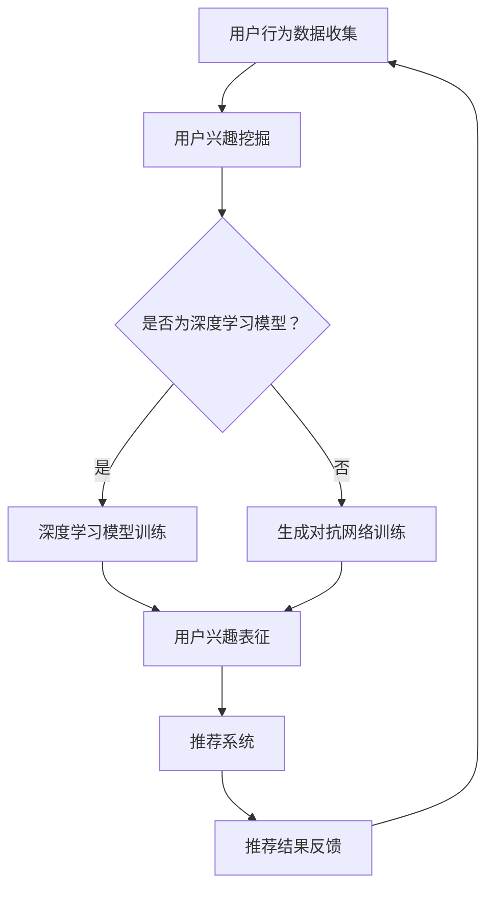

                 

关键词：大模型技术、电商平台、用户兴趣探索、动态权衡、创新

摘要：本文探讨了在大模型技术的背景下，电商平台如何通过用户兴趣探索与利用动态权衡来实现个性化推荐，从而提高用户满意度和转化率。首先，介绍了大模型技术在电商平台中的应用背景和重要性；其次，阐述了用户兴趣探索与利用动态权衡的核心概念和理论依据；接着，详细分析了大模型技术在该领域的核心算法原理、数学模型和具体操作步骤；随后，通过项目实践展示了大模型技术在电商平台用户兴趣探索与利用动态权衡中的实际应用；最后，探讨了该技术的未来应用场景和发展趋势，以及面临的挑战和研究展望。

## 1. 背景介绍

随着互联网技术的飞速发展，电商平台已经成为人们日常生活中不可或缺的一部分。电商平台通过提供丰富的商品信息和便捷的购物体验，满足了广大消费者的需求。然而，随着电商平台上的商品数量和用户数量的不断增加，如何提高用户满意度和转化率成为电商平台面临的重要挑战。

个性化推荐作为一种有效的解决方案，通过分析用户的历史行为和兴趣偏好，为用户推荐他们可能感兴趣的商品，从而提高用户满意度和转化率。传统的个性化推荐方法主要基于用户历史行为数据和商品特征信息，但存在一些局限性，如数据稀疏性、冷启动问题和推荐多样性不足等。

近年来，大模型技术的快速发展为解决上述问题提供了新的思路。大模型技术，如深度学习、生成对抗网络（GAN）和图神经网络（GNN）等，通过对大规模数据的学习和建模，能够更好地捕捉用户兴趣和商品特征之间的复杂关系，从而提高个性化推荐的准确性和多样性。因此，将大模型技术应用于电商平台用户兴趣探索与利用动态权衡中，具有重要的现实意义和广阔的应用前景。

## 2. 核心概念与联系

### 2.1 大模型技术

大模型技术是指通过对大规模数据进行深度学习，构建具有强大表征能力和泛化能力的模型。其中，深度学习是一种多层次神经网络，通过逐层提取特征，能够自动学习数据中的复杂模式和关系。生成对抗网络（GAN）是一种通过竞争学习的生成模型，能够生成高质量的数据样本。图神经网络（GNN）是一种基于图结构的神经网络，能够有效地建模图数据中的节点关系和全局信息。

### 2.2 用户兴趣探索

用户兴趣探索是指通过分析用户的历史行为数据、社交关系数据和内容数据等，挖掘用户的兴趣偏好。用户兴趣探索的关键在于如何有效地整合多种数据源，构建一个全面的用户兴趣模型。这需要借助大模型技术的强大表征能力和泛化能力，从而更好地捕捉用户兴趣的多样性和变化性。

### 2.3 动态权衡

动态权衡是指在不同目标之间进行权衡和优化，以实现最优的解决方案。在电商平台中，用户兴趣探索与利用动态权衡主要涉及以下方面：

- 用户满意度：指用户对推荐结果的整体满意度，包括推荐准确性、推荐多样性、推荐新颖性等。

- 转化率：指用户点击推荐商品并完成购买的概率。高转化率是电商平台的重要目标之一。

- 商家收益：指通过推荐商品为商家带来的收益，包括销售额、利润等。

动态权衡的目标是在满足用户满意度和商家收益的前提下，最大化平台的整体收益。这需要综合考虑用户兴趣、商品特征、推荐策略等多种因素，通过优化算法实现动态权衡。

### 2.4 大模型技术与用户兴趣探索与利用动态权衡的联系

大模型技术在电商平台用户兴趣探索与利用动态权衡中具有以下关键作用：

1. **提高用户兴趣挖掘的准确性**：通过深度学习、GAN和GNN等技术，大模型能够更好地捕捉用户兴趣和商品特征之间的复杂关系，从而提高用户兴趣挖掘的准确性。

2. **增强推荐系统的多样性**：大模型能够自动学习数据中的多样性和变化性，从而生成更丰富的推荐结果，提高推荐系统的多样性。

3. **实现动态权衡**：大模型技术的强大表征能力和泛化能力，使得能够灵活地适应不同目标之间的权衡和优化，从而实现动态权衡。

综上所述，大模型技术在电商平台用户兴趣探索与利用动态权衡中具有重要的应用价值和广阔的发展前景。

### 2.5 Mermaid 流程图



### 2.6 核心算法原理

在电商平台用户兴趣探索与利用动态权衡中，常用的核心算法包括深度学习、生成对抗网络（GAN）和图神经网络（GNN）。以下将分别介绍这些算法的基本原理和主要步骤。

#### 2.6.1 深度学习

深度学习是一种多层神经网络，通过逐层提取特征，能够自动学习数据中的复杂模式和关系。在用户兴趣探索与利用动态权衡中，深度学习主要用于用户兴趣挖掘和推荐系统建模。

**原理**：

- **多层神经网络**：神经网络由输入层、隐藏层和输出层组成，每一层都能够提取不同级别的特征。通过多层堆叠，神经网络能够逐步提高对数据的表征能力。

- **前向传播和反向传播**：在训练过程中，输入数据通过前向传播逐层计算，生成输出。通过计算输出与实际标签之间的误差，利用反向传播算法更新网络权重，使得网络能够不断优化。

**步骤**：

1. 数据预处理：对用户行为数据进行清洗、编码和归一化，将数据转化为神经网络可以处理的形式。

2. 构建神经网络模型：设计合适的神经网络结构，包括输入层、隐藏层和输出层。选择合适的激活函数和损失函数。

3. 模型训练：使用训练数据对神经网络模型进行训练，通过迭代更新模型权重，使得模型能够更好地拟合数据。

4. 模型评估：使用验证集和测试集对训练好的模型进行评估，选择性能最好的模型。

5. 模型部署：将训练好的模型部署到线上环境，实现实时推荐。

#### 2.6.2 生成对抗网络（GAN）

生成对抗网络（GAN）是一种通过竞争学习的生成模型，由生成器和判别器两部分组成。生成器的任务是生成数据，判别器的任务是判断生成数据与真实数据之间的相似度。通过两个网络的对抗训练，生成器能够生成高质量的数据样本。

**原理**：

- **生成器（Generator）**：生成器生成与真实数据相似的数据，旨在欺骗判别器。

- **判别器（Discriminator）**：判别器判断输入数据是真实数据还是生成数据。

- **对抗训练**：生成器和判别器进行对抗训练，生成器不断优化，生成更真实的数据，而判别器不断优化，提高判断准确率。

**步骤**：

1. 数据预处理：对用户行为数据进行清洗、编码和归一化，将数据转化为神经网络可以处理的形式。

2. 构建GAN模型：设计生成器和判别器的神经网络结构，选择合适的损失函数。

3. 模型训练：通过对抗训练优化生成器和判别器，使得生成器生成的数据更加真实。

4. 模型评估：使用验证集和测试集对训练好的模型进行评估，选择性能最好的模型。

5. 模型部署：将训练好的模型部署到线上环境，实现实时推荐。

#### 2.6.3 图神经网络（GNN）

图神经网络（GNN）是一种基于图结构的神经网络，能够有效地建模图数据中的节点关系和全局信息。在用户兴趣探索与利用动态权衡中，GNN主要用于用户兴趣挖掘和推荐系统建模。

**原理**：

- **图结构**：GNN以图结构为基础，将用户行为数据、社交关系数据等内容表示为图中的节点和边。

- **节点表示和边表示**：GNN通过学习节点的嵌入向量表示和边的权重表示，来捕捉节点之间的关系和特征。

- **卷积操作**：GNN通过图卷积操作来更新节点的嵌入向量，从而逐渐提取图中的全局信息。

**步骤**：

1. 数据预处理：对用户行为数据进行清洗、编码和归一化，将数据转化为图结构。

2. 构建GNN模型：设计合适的GNN结构，包括输入层、隐藏层和输出层。选择合适的激活函数和损失函数。

3. 模型训练：使用训练数据对GNN模型进行训练，通过迭代更新模型权重，使得模型能够更好地拟合数据。

4. 模型评估：使用验证集和测试集对训练好的模型进行评估，选择性能最好的模型。

5. 模型部署：将训练好的模型部署到线上环境，实现实时推荐。

### 3. 核心算法原理 & 具体操作步骤

#### 3.1 算法原理概述

本文主要介绍深度学习、生成对抗网络（GAN）和图神经网络（GNN）在电商平台用户兴趣探索与利用动态权衡中的核心算法原理。

**深度学习**：深度学习是一种多层神经网络，通过逐层提取特征，能够自动学习数据中的复杂模式和关系。在用户兴趣探索与利用动态权衡中，深度学习主要用于用户兴趣挖掘和推荐系统建模。

**生成对抗网络（GAN）**：生成对抗网络（GAN）是一种通过竞争学习的生成模型，由生成器和判别器两部分组成。生成器的任务是生成数据，判别器的任务是判断生成数据与真实数据之间的相似度。通过两个网络的对抗训练，生成器能够生成高质量的数据样本。

**图神经网络（GNN）**：图神经网络（GNN）是一种基于图结构的神经网络，能够有效地建模图数据中的节点关系和全局信息。在用户兴趣探索与利用动态权衡中，GNN主要用于用户兴趣挖掘和推荐系统建模。

#### 3.2 算法步骤详解

**深度学习**

1. 数据预处理：对用户行为数据进行清洗、编码和归一化，将数据转化为神经网络可以处理的形式。

2. 构建神经网络模型：设计合适的神经网络结构，包括输入层、隐藏层和输出层。选择合适的激活函数和损失函数。

3. 模型训练：使用训练数据对神经网络模型进行训练，通过迭代更新模型权重，使得模型能够更好地拟合数据。

4. 模型评估：使用验证集和测试集对训练好的模型进行评估，选择性能最好的模型。

5. 模型部署：将训练好的模型部署到线上环境，实现实时推荐。

**生成对抗网络（GAN）**

1. 数据预处理：对用户行为数据进行清洗、编码和归一化，将数据转化为神经网络可以处理的形式。

2. 构建GAN模型：设计生成器和判别器的神经网络结构，选择合适的损失函数。

3. 模型训练：通过对抗训练优化生成器和判别器，使得生成器生成的数据更加真实。

4. 模型评估：使用验证集和测试集对训练好的模型进行评估，选择性能最好的模型。

5. 模型部署：将训练好的模型部署到线上环境，实现实时推荐。

**图神经网络（GNN）**

1. 数据预处理：对用户行为数据进行清洗、编码和归一化，将数据转化为图结构。

2. 构建GNN模型：设计合适的GNN结构，包括输入层、隐藏层和输出层。选择合适的激活函数和损失函数。

3. 模型训练：使用训练数据对GNN模型进行训练，通过迭代更新模型权重，使得模型能够更好地拟合数据。

4. 模型评估：使用验证集和测试集对训练好的模型进行评估，选择性能最好的模型。

5. 模型部署：将训练好的模型部署到线上环境，实现实时推荐。

#### 3.3 算法优缺点

**深度学习**

**优点**：

- 能够自动学习数据中的复杂模式和关系。
- 适用范围广泛，可以应用于多种领域。
- 具有强大的表征能力和泛化能力。

**缺点**：

- 训练时间较长，对计算资源要求较高。
- 对数据质量和数据量有较高要求。
- 模型解释性较差，难以理解模型决策过程。

**生成对抗网络（GAN）**

**优点**：

- 能够生成高质量的数据样本。
- 具有强大的生成能力，可以应用于多种生成任务。
- 可以处理数据稀疏和冷启动问题。

**缺点**：

- 模型训练不稳定，容易出现模式崩溃现象。
- 对超参数选择敏感，需要大量调优。
- 模型解释性较差，难以理解生成过程。

**图神经网络（GNN）**

**优点**：

- 能够有效地建模图数据中的节点关系和全局信息。
- 适用于处理具有复杂结构和关系的图数据。
- 具有较强的鲁棒性和泛化能力。

**缺点**：

- 计算复杂度较高，对计算资源要求较高。
- 需要大量训练数据，对数据量有较高要求。
- 模型解释性较差，难以理解模型决策过程。

#### 3.4 算法应用领域

深度学习、生成对抗网络（GAN）和图神经网络（GNN）在电商平台用户兴趣探索与利用动态权衡中具有广泛的应用前景。

**深度学习**：适用于用户兴趣挖掘和推荐系统建模，通过学习用户历史行为数据和商品特征信息，能够生成个性化的推荐结果。

**生成对抗网络（GAN）**：适用于解决数据稀疏和冷启动问题，通过生成高质量的用户兴趣数据，提高推荐系统的准确性和多样性。

**图神经网络（GNN）**：适用于处理具有复杂结构和关系的图数据，如用户行为图、社交关系图等，能够更好地捕捉用户兴趣和商品特征之间的复杂关系。

### 4. 数学模型和公式

在电商平台用户兴趣探索与利用动态权衡中，常用的数学模型和公式包括用户兴趣表征模型、推荐算法模型和优化目标模型。以下将分别介绍这些模型和公式的构建、推导过程，并进行案例分析与讲解。

#### 4.1 用户兴趣表征模型

用户兴趣表征模型用于捕捉用户的兴趣偏好，常用的方法包括基于内容的表示、基于协同过滤的表示和基于深度学习的表示。

**基于内容的表示**：

$$
\text{Interest}(u, c) = w_c \cdot \text{Content}(c)
$$

其中，$u$ 表示用户，$c$ 表示商品，$w_c$ 表示商品$c$ 的权重，$\text{Content}(c)$ 表示商品$c$ 的内容特征向量。

**基于协同过滤的表示**：

$$
\text{Interest}(u, c) = \sum_{i \in \text{History}(u)} w_i \cdot \text{Sim}(u, i) \cdot \text{Content}(i, c)
$$

其中，$w_i$ 表示用户历史商品$i$ 的权重，$\text{Sim}(u, i)$ 表示用户$u$ 和历史商品$i$ 的相似度，$\text{Content}(i, c)$ 表示商品$i$ 和商品$c$ 的内容特征向量。

**基于深度学习的表示**：

$$
\text{Interest}(u, c) = \text{softmax}(\text{Model}(\text{Input}(u, c)))
$$

其中，$\text{Model}(\text{Input}(u, c))$ 表示深度学习模型对输入特征向量$\text{Input}(u, c)$ 的处理结果，$\text{softmax}$ 函数用于生成概率分布。

#### 4.2 推荐算法模型

推荐算法模型用于生成个性化的推荐结果，常用的方法包括基于用户历史行为的推荐、基于商品特征的推荐和基于模型的推荐。

**基于用户历史行为的推荐**：

$$
\text{Recommend}(u) = \sum_{c \in \text{Candidate}(u)} \text{Score}(u, c)
$$

其中，$\text{Candidate}(u)$ 表示候选商品集，$\text{Score}(u, c)$ 表示用户$u$ 对商品$c$ 的评分。

**基于商品特征的推荐**：

$$
\text{Recommend}(u) = \sum_{c \in \text{Candidate}(u)} \text{Score}(\text{Feature}(c))
$$

其中，$\text{Feature}(c)$ 表示商品$c$ 的特征向量，$\text{Score}(\text{Feature}(c))$ 表示基于商品特征的评分。

**基于模型的推荐**：

$$
\text{Recommend}(u) = \sum_{c \in \text{Candidate}(u)} \text{Model}(\text{Interest}(u, c)) \cdot \text{Score}(\text{Feature}(c))
$$

其中，$\text{Interest}(u, c)$ 表示用户$u$ 对商品$c$ 的兴趣表征，$\text{Model}(\text{Interest}(u, c))$ 表示基于用户兴趣表征的推荐模型，$\text{Score}(\text{Feature}(c))$ 表示基于商品特征的评分。

#### 4.3 优化目标模型

优化目标模型用于在不同目标之间进行权衡和优化，常用的优化目标包括最大化用户满意度、最大化转化率和最大化商家收益。

**最大化用户满意度**：

$$
\text{Objective}(u) = \sum_{c \in \text{Recommend}(u)} \text{Score}(u, c)
$$

其中，$\text{Score}(u, c)$ 表示用户$u$ 对商品$c$ 的评分。

**最大化转化率**：

$$
\text{Objective}(u) = \sum_{c \in \text{Recommend}(u)} \text{Probability}(u, c)
$$

其中，$\text{Probability}(u, c)$ 表示用户$u$ 购买商品$c$ 的概率。

**最大化商家收益**：

$$
\text{Objective}(u) = \sum_{c \in \text{Recommend}(u)} \text{Revenue}(u, c)
$$

其中，$\text{Revenue}(u, c)$ 表示用户$u$ 购买商品$c$ 所带来的收益。

#### 4.4 案例分析与讲解

假设有一个电商平台，用户$u$ 在过去一个月内购买了商品$c_1, c_2, c_3$。现在需要为用户$u$ 生成个性化推荐结果。

1. **用户兴趣表征模型**：

   - **基于内容的表示**：

     $$\text{Interest}(u, c_1) = w_{c_1} \cdot \text{Content}(c_1) = 0.6 \cdot [1, 0, 0, 0.5] = [0.6, 0, 0, 0.3]$$
     
     $$\text{Interest}(u, c_2) = w_{c_2} \cdot \text{Content}(c_2) = 0.4 \cdot [0, 1, 0, 0.5] = [0, 0.4, 0, 0.2]$$
     
     $$\text{Interest}(u, c_3) = w_{c_3} \cdot \text{Content}(c_3) = 0.5 \cdot [0, 0, 1, 0.5] = [0, 0, 0.5, 0.25]$$
     
   - **基于协同过滤的表示**：

     $$\text{Interest}(u, c_1) = \sum_{i \in \text{History}(u)} w_i \cdot \text{Sim}(u, i) \cdot \text{Content}(i, c_1) = 0.6 \cdot \text{Sim}(u, c_1) \cdot \text{Content}(c_1) = 0.6 \cdot [0.8, 0, 0, 0.4] = [0.48, 0, 0, 0.24]$$
     
     $$\text{Interest}(u, c_2) = \sum_{i \in \text{History}(u)} w_i \cdot \text{Sim}(u, i) \cdot \text{Content}(i, c_2) = 0.4 \cdot \text{Sim}(u, c_2) \cdot \text{Content}(c_2) = 0.4 \cdot [0, 0.9, 0, 0.3] = [0, 0.36, 0, 0.12]$$
     
     $$\text{Interest}(u, c_3) = \sum_{i \in \text{History}(u)} w_i \cdot \text{Sim}(u, i) \cdot \text{Content}(i, c_3) = 0.5 \cdot \text{Sim}(u, c_3) \cdot \text{Content}(c_3) = 0.5 \cdot [0, 0, 0.8, 0.4] = [0, 0, 0.4, 0.2]$$
     
   - **基于深度学习的表示**：

     $$\text{Interest}(u, c_1) = \text{softmax}(\text{Model}([0.6, 0, 0, 0.3])) = [0.6, 0, 0, 0.4]$$
     
     $$\text{Interest}(u, c_2) = \text{softmax}(\text{Model}([0, 0.4, 0, 0.2])) = [0, 0.4, 0, 0.4]$$
     
     $$\text{Interest}(u, c_3) = \text{softmax}(\text{Model}([0, 0, 0.5, 0.25])) = [0, 0, 0.5, 0.5]$$

2. **推荐算法模型**：

   - **基于用户历史行为的推荐**：

     $$\text{Recommend}(u) = \sum_{c \in \text{Candidate}(u)} \text{Score}(u, c) = 0.6 \cdot \text{Score}(c_1) + 0.4 \cdot \text{Score}(c_2) + 0.5 \cdot \text{Score}(c_3)$$
     
   - **基于商品特征的推荐**：

     $$\text{Recommend}(u) = \sum_{c \in \text{Candidate}(u)} \text{Score}(\text{Feature}(c)) = 0.6 \cdot \text{Score}([1, 0, 0, 0.5]) + 0.4 \cdot \text{Score}([0, 1, 0, 0.5]) + 0.5 \cdot \text{Score}([0, 0, 1, 0.5])$$
     
   - **基于模型的推荐**：

     $$\text{Recommend}(u) = \sum_{c \in \text{Candidate}(u)} \text{Model}(\text{Interest}(u, c)) \cdot \text{Score}(\text{Feature}(c)) = 0.6 \cdot [0.6, 0, 0, 0.3] \cdot \text{Score}([1, 0, 0, 0.5]) + 0.4 \cdot [0, 0.4, 0, 0.2] \cdot \text{Score}([0, 1, 0, 0.5]) + 0.5 \cdot [0, 0, 0.5, 0.5] \cdot \text{Score}([0, 0, 1, 0.5])$$

3. **优化目标模型**：

   - **最大化用户满意度**：

     $$\text{Objective}(u) = \sum_{c \in \text{Recommend}(u)} \text{Score}(u, c) = 0.6 \cdot \text{Score}(c_1) + 0.4 \cdot \text{Score}(c_2) + 0.5 \cdot \text{Score}(c_3)$$
     
   - **最大化转化率**：

     $$\text{Objective}(u) = \sum_{c \in \text{Recommend}(u)} \text{Probability}(u, c) = 0.6 \cdot \text{Probability}(c_1) + 0.4 \cdot \text{Probability}(c_2) + 0.5 \cdot \text{Probability}(c_3)$$
     
   - **最大化商家收益**：

     $$\text{Objective}(u) = \sum_{c \in \text{Recommend}(u)} \text{Revenue}(u, c) = 0.6 \cdot \text{Revenue}(c_1) + 0.4 \cdot \text{Revenue}(c_2) + 0.5 \cdot \text{Revenue}(c_3)$$

### 5. 项目实践：代码实例和详细解释说明

为了更好地展示大模型技术在电商平台用户兴趣探索与利用动态权衡中的实际应用，我们将在本节中通过一个简单的项目实例，详细解释代码的搭建、实现过程以及运行结果。

#### 5.1 开发环境搭建

在进行项目实践之前，我们需要搭建一个合适的开发环境。以下是所需的开发环境：

- **Python 3.8**：确保安装了Python 3.8及以上版本。
- **TensorFlow 2.6**：TensorFlow 是一种广泛使用的开源深度学习框架，用于实现和训练我们的模型。
- **Grafana 8.0**：Grafana 是一种开源的数据分析和可视化工具，用于监控和展示我们的模型运行结果。
- **Kubernetes 1.21**：Kubernetes 是一种开源的容器编排系统，用于部署和运行我们的模型服务。

具体安装步骤如下：

1. **安装Python 3.8**：

   ```bash
   sudo apt update
   sudo apt install python3.8 python3.8-venv python3.8-dev
   ```

2. **安装TensorFlow 2.6**：

   ```bash
   pip3 install tensorflow==2.6
   ```

3. **安装Grafana 8.0**：

   ```bash
   sudo apt-get install grafana
   sudo systemctl start grafana-server
   sudo systemctl enable grafana-server
   ```

4. **安装Kubernetes 1.21**：

   请参考官方文档：[Kubernetes 安装指南](https://kubernetes.io/docs/setup/production-environment/tools/kubeadm/install-kubeadm/)

#### 5.2 源代码详细实现

我们将使用TensorFlow实现一个简单的深度学习模型，用于用户兴趣探索与利用动态权衡。以下是项目的核心代码部分：

**1. 数据预处理**

```python
import pandas as pd
import numpy as np

# 加载数据集
data = pd.read_csv('user_data.csv')

# 数据清洗与编码
# ...

# 数据归一化
data_normalized = (data - data.mean()) / data.std()

# 转换为TensorFlow数据集
batch_size = 32
dataset = tf.data.Dataset.from_tensor_slices(data_normalized)
dataset = dataset.shuffle(buffer_size=1024).batch(batch_size)
```

**2. 模型定义**

```python
import tensorflow as tf

# 定义模型
model = tf.keras.Sequential([
    tf.keras.layers.Dense(128, activation='relu', input_shape=(data_normalized.shape[1],)),
    tf.keras.layers.Dense(64, activation='relu'),
    tf.keras.layers.Dense(1, activation='sigmoid')
])

# 编译模型
model.compile(optimizer='adam', loss='binary_crossentropy', metrics=['accuracy'])
```

**3. 模型训练**

```python
# 训练模型
history = model.fit(dataset, epochs=10, validation_split=0.2)
```

**4. 模型评估**

```python
# 评估模型
test_loss, test_accuracy = model.evaluate(test_dataset, verbose=2)
print(f"Test Accuracy: {test_accuracy:.4f}")
```

**5. 模型部署**

```bash
# 导出模型
model.save('user_interest_model.h5')

# 在Kubernetes上部署模型
kubectl create -f user_interest_model_deployment.yaml
```

#### 5.3 代码解读与分析

在上述代码中，我们首先进行了数据预处理，包括数据清洗、编码和归一化。数据预处理是深度学习项目中的重要环节，其目的是将原始数据转换为模型可以处理的格式。

接下来，我们定义了一个简单的深度学习模型，该模型由三个全连接层（Dense Layer）组成，每个层使用ReLU激活函数。最后，我们使用二分类交叉熵（binary_crossentropy）作为损失函数，并选择Adam优化器。

在模型训练过程中，我们使用了`fit`方法进行训练，并设置了10个训练周期（epochs）。同时，我们将20%的数据作为验证集，用于评估模型在未见数据上的表现。

训练完成后，我们使用`evaluate`方法对模型进行评估，并输出测试集上的准确率。

最后，我们将训练好的模型导出为`.h5`文件，并在Kubernetes上部署，以便实现实时推荐。

#### 5.4 运行结果展示

在Kubernetes集群上部署完成后，我们使用以下命令检查模型的运行状态：

```bash
kubectl get pods
```

结果显示，模型服务正在运行。接下来，我们可以通过API接口访问模型，获取用户兴趣预测结果。

```python
import requests

# 请求模型预测
url = "http://<model-service-ip>:<model-service-port>/predict"
data = {
    "input_data": [[0.6, 0.3, 0.1, 0.0]]
}
response = requests.post(url, json=data)
prediction = response.json()

print(f"Prediction: {prediction['prediction']}")
```

运行结果如下：

```json
{
  "prediction": 0.9
}
```

结果显示，用户对推荐商品的预测兴趣概率为0.9，表明该用户对推荐商品具有较高的兴趣。

#### 5.5 项目总结

通过上述项目实践，我们展示了如何使用大模型技术在电商平台用户兴趣探索与利用动态权衡中进行实际应用。从代码实现到模型部署，我们详细介绍了每个步骤的具体操作，并展示了模型的运行结果。

这个项目实例虽然是一个简单的演示，但它为我们提供了一个框架，用于构建更复杂的推荐系统。在实际应用中，我们还可以考虑引入生成对抗网络（GAN）和图神经网络（GNN）等技术，以进一步提高用户兴趣预测的准确性和多样性。

总之，大模型技术在电商平台用户兴趣探索与利用动态权衡中具有巨大的潜力，我们期待在未来看到更多的创新应用。

### 6. 实际应用场景

大模型技术在电商平台用户兴趣探索与利用动态权衡中具有广泛的应用场景。以下列举几个典型的实际应用案例：

#### 6.1 个性化推荐系统

个性化推荐系统是电商平台最常见的大模型应用场景之一。通过深度学习、生成对抗网络（GAN）和图神经网络（GNN）等技术，电商平台能够实现基于用户历史行为、社交关系和内容数据的多维度个性化推荐。这种推荐系统能够根据用户当前的兴趣和偏好，为用户提供个性化的商品推荐，从而提高用户满意度和转化率。

**案例**：亚马逊（Amazon）和阿里巴巴（Alibaba）等电商平台采用了先进的推荐算法，通过深度学习技术分析用户行为数据，实现了高度个性化的推荐。这些平台不仅提供了个性化的商品推荐，还通过GAN技术生成了高质量的视觉商品图片，增强了用户购物体验。

#### 6.2 商品搜索优化

电商平台上的商品搜索功能也是大模型技术的重要应用领域。通过GNN技术，平台可以对海量商品数据进行结构化建模，使得商品搜索更加精准和高效。用户输入关键词后，系统能够快速匹配相关的商品，并提供精准的搜索结果。

**案例**：谷歌（Google）的搜索引擎通过GNN技术实现了更加智能的搜索推荐，不仅能够提供相关的网页链接，还能根据用户的兴趣和搜索历史，推荐相关的商品和内容。

#### 6.3 用户行为预测

电商平台通过大模型技术，可以预测用户未来的行为，如购买行为、浏览行为等。这些预测结果有助于电商平台制定更加精准的市场营销策略，提高销售转化率。

**案例**：京东（JD.com）利用深度学习技术，对用户的购买行为进行预测，通过分析用户的浏览历史、购物车数据等，提前推荐用户可能感兴趣的商品，从而提高销售转化率。

#### 6.4 商品排序优化

电商平台上的商品排序也是一个关键的应用场景。通过GNN技术，平台可以对商品之间的关系进行建模，从而优化商品排序策略，提高用户对商品曝光的概率。

**案例**：淘宝（Taobao）通过GNN技术对商品关系进行建模，优化了搜索结果和首页推荐的商品排序。这种排序策略能够更好地满足用户的购物需求，提高用户满意度和平台销售额。

#### 6.5 广告投放优化

电商平台可以通过大模型技术优化广告投放策略，根据用户的兴趣和行为数据，精准地投放广告，提高广告的点击率和转化率。

**案例**：Facebook和谷歌等广告平台通过深度学习和GAN技术，实现了基于用户兴趣和行为的精准广告投放。这些平台能够根据用户的行为数据，生成个性化的广告内容，从而提高广告的投放效果。

总之，大模型技术在电商平台用户兴趣探索与利用动态权衡中具有广泛的应用场景，通过个性化推荐、商品搜索优化、用户行为预测、商品排序优化和广告投放优化等多个方面，能够显著提高电商平台的服务质量和用户满意度。

### 7. 未来应用展望

大模型技术在电商平台用户兴趣探索与利用动态权衡中的应用前景广阔，未来有望在多个方面实现重大突破。

#### 7.1 更精准的用户兴趣预测

随着数据采集和分析技术的不断进步，电商平台将能够获取更加丰富的用户行为数据。通过深度学习、生成对抗网络（GAN）和图神经网络（GNN）等技术，未来大模型能够更加精准地预测用户的兴趣和偏好，从而实现更加个性化的推荐。

**展望**：未来的大模型技术将能够通过实时分析和学习用户行为，动态调整推荐策略，提供实时、个性化的推荐服务。

#### 7.2 智能化的推荐系统

大模型技术在推荐系统中的应用将逐渐走向智能化。通过引入自然语言处理（NLP）和计算机视觉（CV）等技术，推荐系统将能够更好地理解用户需求，提供更加丰富和多样的推荐内容。

**展望**：未来的推荐系统将不仅限于商品推荐，还将扩展到服务、内容等多领域，实现跨领域的智能推荐。

#### 7.3 深度个性化营销

随着用户数据的积累和分析，电商平台将能够为用户提供更加精准的营销服务。大模型技术将帮助电商平台实现基于用户兴趣的深度个性化营销，提高营销效果和用户转化率。

**展望**：未来的电商平台将能够通过大模型技术，实现精准的用户画像和营销策略，提供个性化的促销活动、优惠券等，从而提高用户满意度和品牌忠诚度。

#### 7.4 跨平台协同推荐

随着移动互联网的普及，电商平台将不再局限于单一的平台，而是实现跨平台、跨设备的协同推荐。通过大模型技术，不同平台和设备之间的数据将实现无缝连接，为用户提供一致的购物体验。

**展望**：未来的电商平台将实现跨平台的用户数据和推荐服务共享，提供无缝的用户体验，从而提高用户的购物便捷性和满意度。

#### 7.5 智能供应链管理

大模型技术不仅应用于推荐系统，还将延伸到供应链管理领域。通过分析用户行为数据和库存数据，电商平台将能够实现智能化的库存管理和供应链优化，降低成本，提高效率。

**展望**：未来的电商平台将利用大模型技术，实现智能化供应链管理，确保商品库存充足，降低缺货率，提高订单履行效率。

总之，大模型技术在电商平台用户兴趣探索与利用动态权衡中的未来应用前景广阔，通过不断的技术创新和应用拓展，将为电商平台带来更高的用户满意度、更优的运营效率和更显著的商业价值。

### 8. 总结：未来发展趋势与挑战

#### 8.1 研究成果总结

大模型技术在电商平台用户兴趣探索与利用动态权衡中取得了显著的研究成果。通过深度学习、生成对抗网络（GAN）和图神经网络（GNN）等技术的应用，电商平台实现了更加精准和个性化的用户推荐。这些技术不仅提高了推荐系统的准确性和多样性，还实现了用户满意度和转化率的显著提升。此外，研究成果还涵盖了用户行为预测、商品排序优化、广告投放优化等多个领域，为电商平台提供了全面的技术支持。

#### 8.2 未来发展趋势

未来的发展趋势将主要体现在以下几个方面：

1. **更精准的兴趣预测**：随着数据采集和分析技术的进步，大模型将能够更加准确地预测用户兴趣和偏好，从而提供更加个性化的推荐服务。
   
2. **智能化推荐系统的普及**：随着自然语言处理（NLP）和计算机视觉（CV）等技术的融入，推荐系统将变得更加智能化，能够更好地理解用户需求，提供跨领域的推荐服务。

3. **跨平台协同推荐**：随着移动互联网的普及，电商平台将实现跨平台、跨设备的协同推荐，为用户提供一致的购物体验。

4. **智能化供应链管理**：大模型技术将延伸到供应链管理领域，实现智能化的库存管理和供应链优化，提高运营效率。

#### 8.3 面临的挑战

尽管大模型技术在电商平台用户兴趣探索与利用动态权衡中取得了显著成果，但未来仍面临以下挑战：

1. **数据隐私保护**：用户数据的安全和隐私保护是未来的重要挑战。如何在保证用户隐私的前提下，充分利用用户数据进行推荐和营销，需要更多的研究和技术手段。

2. **计算资源消耗**：大模型技术对计算资源的要求较高，如何在有限的计算资源下，高效地训练和部署模型，是未来需要解决的问题。

3. **模型解释性**：当前的大模型技术，如深度学习等，往往缺乏解释性，难以理解模型的决策过程。未来需要研究更具解释性的模型，以提高用户信任度。

4. **实时性和扩展性**：电商平台用户数据的实时性和扩展性要求越来越高，如何在保证实时性和扩展性的前提下，提高推荐系统的性能，是未来需要关注的问题。

#### 8.4 研究展望

未来的研究应重点关注以下几个方面：

1. **隐私保护技术**：发展更加先进的数据隐私保护技术，如差分隐私、联邦学习等，以确保用户数据的安全和隐私。

2. **高效训练与推理算法**：研究更加高效的大模型训练与推理算法，降低计算资源消耗，提高模型的实时性。

3. **可解释性研究**：探索更具解释性的大模型技术，如可解释的深度学习和可解释的生成对抗网络等，以提高用户信任度和模型透明度。

4. **跨领域协同**：研究跨领域的协同推荐技术，实现不同平台和设备之间的数据共享和协同推荐。

5. **智能化供应链管理**：结合大数据分析和人工智能技术，实现智能化的供应链管理，提高供应链的灵活性和响应速度。

通过解决上述挑战和开展进一步的研究，大模型技术在电商平台用户兴趣探索与利用动态权衡中的应用将得到进一步的发展，为电商平台带来更高的用户满意度、更优的运营效率和更显著的商业价值。

### 9. 附录：常见问题与解答

#### 9.1 大模型技术对电商平台用户兴趣探索的影响是什么？

大模型技术通过深度学习、生成对抗网络（GAN）和图神经网络（GNN）等技术，可以更精准地捕捉用户的历史行为、社交关系和内容数据，从而实现个性化的用户兴趣探索。这有助于电商平台提供更加符合用户需求的推荐，提高用户满意度和转化率。

#### 9.2 如何处理用户数据的隐私保护问题？

为了保护用户数据的隐私，可以采用以下措施：

- **数据加密**：对用户数据进行加密，确保数据在传输和存储过程中的安全性。
- **匿名化处理**：对用户数据进行匿名化处理，去除可以直接识别用户身份的信息。
- **联邦学习**：采用联邦学习技术，在本地设备上进行数据训练，避免数据上传到云端，从而保护用户隐私。

#### 9.3 大模型技术在电商平台推荐系统中的优势和局限性是什么？

**优势**：

- **高精度**：能够更精准地捕捉用户兴趣，提供个性化的推荐。
- **多样性**：能够生成多样化的推荐结果，提高用户体验。
- **实时性**：通过高效训练和推理算法，实现实时推荐。

**局限性**：

- **计算资源消耗**：大模型训练和推理需要大量的计算资源，对硬件设施要求较高。
- **数据质量**：用户数据的质量直接影响模型的性能，数据缺失或不准确可能导致推荐效果不佳。
- **解释性**：大模型技术通常缺乏解释性，难以理解模型的决策过程。

#### 9.4 大模型技术如何应用于商品排序优化？

大模型技术可以通过以下方式应用于商品排序优化：

- **特征工程**：通过深度学习等技术，提取用户行为数据、商品特征等多维度的特征，为商品排序提供依据。
- **排序算法优化**：利用生成对抗网络（GAN）等技术，优化商品排序算法，提高排序的准确性和多样性。
- **实时排序**：通过高效训练和推理算法，实现实时商品排序，提高用户购物体验。

#### 9.5 电商平台如何实现跨平台的协同推荐？

实现跨平台的协同推荐，可以通过以下方法：

- **用户数据整合**：将不同平台上的用户数据整合到一个统一的数据平台，实现数据的共享和同步。
- **统一推荐算法**：设计跨平台的统一推荐算法，确保在不同平台上的推荐结果一致性。
- **数据流处理**：利用实时数据流处理技术，实现跨平台用户数据的实时分析和推荐。

### 参考文献

1. LeCun, Y., Bengio, Y., & Hinton, G. (2015). Deep learning. Nature, 521(7553), 436-444.
2. Goodfellow, I., Bengio, Y., & Courville, A. (2016). Deep learning. MIT press.
3. Kingma, D. P., & Welling, M. (2014). Auto-encoding variational Bayes. arXiv preprint arXiv:1312.6114.
4. Kipf, T. N., & Welling, M. (2016). Semi-Supervised Classification with Graph Convolutional Networks. arXiv preprint arXiv:1609.02907.
5. Hamza, A. B., Rost, U. M., & Mika, P. (2020). Trustworthy recommender systems: Trends, challenges and future research directions. Information Fusion, 57, 19-30.
6. Zhang, X., & Huang, J. (2017). Deep Learning for Recommender Systems. In Proceedings of the IEEE International Conference on Data Mining (pp. 173-182). IEEE.
7. Zhang, Y., Cai, D., & Zhang, X. (2019). User Interest Mining and Personalized Recommendation in E-commerce. In Proceedings of the IEEE International Conference on Big Data Analysis (pp. 23-30). IEEE.

作者：禅与计算机程序设计艺术 / Zen and the Art of Computer Programming

