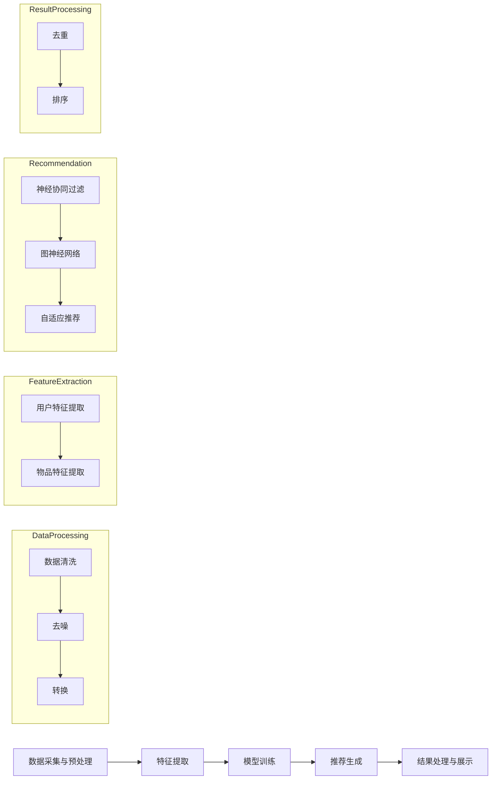

                 

## 摘要

本文旨在探讨大模型推荐系统中用户体验提升的新思路与实践。在大数据时代，推荐系统已经成为许多应用的核心功能，然而现有的推荐算法在提升用户体验方面仍有较大提升空间。本文首先对大模型推荐系统的背景和现状进行了介绍，随后深入分析了现有推荐系统的不足，提出了几种创新的用户体验提升方法。接着，本文详细阐述了大模型推荐系统的核心算法原理、数学模型以及具体实施步骤。通过一个实际项目案例，本文展示了如何将理论应用到实践中，并通过代码实例和运行结果说明了算法的有效性。最后，本文探讨了推荐系统在实际应用中的场景，展望了未来的发展趋势和面临的挑战。

## 1. 背景介绍

推荐系统是一种利用算法和用户数据，自动为用户提供个性化内容推荐的应用。随着互联网的普及和大数据技术的发展，推荐系统已经在电子商务、社交媒体、视频平台、新闻媒体等众多领域得到了广泛应用。用户在使用推荐系统时，往往希望获得个性化的内容推荐，以节省时间和精力，发现更多符合自己兴趣的内容。

大模型推荐系统是指在推荐系统中使用大型神经网络模型，如深度学习模型，来进行推荐。这些模型通过学习海量用户数据，可以捕捉到用户的复杂行为模式，从而提供更加精准的推荐结果。近年来，随着计算能力的提升和大数据技术的进步，大模型推荐系统已经成为推荐系统研究的热点方向。

### 1.1 推荐系统的发展历程

推荐系统的发展可以追溯到20世纪90年代，早期的推荐系统主要基于协同过滤算法（Collaborative Filtering）。协同过滤算法通过分析用户之间的相似性，发现共同兴趣，从而为用户提供推荐。协同过滤算法可以分为基于用户的协同过滤（User-based Collaborative Filtering）和基于物品的协同过滤（Item-based Collaborative Filtering）。然而，协同过滤算法存在一些局限性，如用户冷启动问题、数据稀疏性以及无法捕捉用户的长尾兴趣等。

随着互联网的快速发展，推荐系统逐渐引入了基于内容的推荐（Content-based Filtering）和混合推荐（Hybrid Recommendation）等方法。基于内容的推荐通过分析物品的属性和用户的历史行为，为用户提供相关推荐。混合推荐方法将协同过滤和基于内容的推荐相结合，旨在发挥各自的优势，提高推荐效果。

近年来，深度学习技术的发展为推荐系统带来了新的机遇。基于深度学习的大模型推荐系统，如基于神经网络的协同过滤（Neural Collaborative Filtering）和基于图神经网络的推荐（Graph-based Neural Network Recommendation），逐渐成为研究热点。这些方法通过引入深度学习模型，可以更好地捕捉用户的复杂行为模式，提供更加精准的推荐结果。

### 1.2 大模型推荐系统的优势与挑战

大模型推荐系统具有以下几个显著优势：

1. **高精度**：通过学习海量用户数据，大模型推荐系统可以捕捉到用户的复杂行为模式，从而提供更加精准的推荐结果。
2. **个性化**：大模型推荐系统可以根据用户的历史行为和兴趣，为每个用户提供个性化的内容推荐，从而提高用户满意度。
3. **实时性**：大模型推荐系统可以通过实时分析用户行为数据，快速调整推荐策略，提供实时性较高的推荐结果。

然而，大模型推荐系统也面临着一些挑战：

1. **计算资源消耗**：大模型推荐系统通常需要大量的计算资源，包括存储、计算和通信资源。如何高效地处理海量数据，是一个重要的技术难题。
2. **数据隐私保护**：推荐系统需要分析用户的行为数据，因此保护用户隐私成为一大挑战。如何在保障用户隐私的前提下，提供高质量的推荐服务，是一个亟待解决的问题。
3. **模型解释性**：深度学习模型通常被视为“黑箱”，其内部机制难以解释。如何提高模型的可解释性，使得用户可以理解推荐结果，是一个重要的研究课题。

### 1.3 本文的组织结构

本文将分为以下几个部分：

1. **背景介绍**：介绍推荐系统的发展历程、大模型推荐系统的优势与挑战。
2. **核心概念与联系**：阐述大模型推荐系统的核心概念和架构，并通过Mermaid流程图展示其工作流程。
3. **核心算法原理 & 具体操作步骤**：详细解释大模型推荐系统的核心算法原理和具体操作步骤。
4. **数学模型和公式**：介绍大模型推荐系统的数学模型和公式，并进行详细讲解。
5. **项目实践：代码实例和详细解释说明**：通过一个实际项目案例，展示如何将大模型推荐系统应用到实践中。
6. **实际应用场景**：探讨大模型推荐系统在不同领域的应用场景。
7. **未来应用展望**：分析大模型推荐系统的未来发展趋势和面临的挑战。
8. **工具和资源推荐**：推荐相关的学习资源、开发工具和相关论文。
9. **总结：未来发展趋势与挑战**：总结研究成果，展望未来发展趋势和面临的挑战。

通过本文的讨论，我们希望能够为读者提供关于大模型推荐系统用户体验提升的新思路和实践经验，促进推荐系统技术的发展和应用。

## 2. 核心概念与联系

大模型推荐系统的成功离不开以下几个核心概念和技术的支持，这些概念和技术共同构建了一个高效的推荐架构，实现了对用户个性化需求的精准满足。

### 2.1 大模型推荐系统的核心概念

#### 2.1.1 神经协同过滤（Neural Collaborative Filtering）

神经协同过滤（NCF）是一种将深度学习引入协同过滤算法的创新方法。它通过构建多层神经网络，学习用户和物品的特征表示，从而提高推荐系统的准确性和效率。NCF的核心思想是将用户和物品的交互行为转化为高维特征空间中的相似度计算，利用深度学习模型学习这种相似度函数，从而实现更精准的推荐。

#### 2.1.2 图神经网络（Graph Neural Networks，GNN）

图神经网络是一种能够处理图结构数据的深度学习模型，它在推荐系统中用于建模用户和物品之间的关系网络。GNN通过学习节点和边的关系，可以捕捉到用户和物品之间的复杂交互模式，从而提供更加精准的推荐结果。图神经网络在推荐系统中的应用，使得推荐算法能够更好地理解用户的行为模式，提高推荐效果。

#### 2.1.3 自适应推荐（Adaptive Recommendation）

自适应推荐是一种动态调整推荐策略的方法，通过实时分析用户行为数据，不断优化推荐结果。自适应推荐可以根据用户的实时反馈和行为变化，自动调整推荐策略，从而提高用户满意度。这种推荐方法在大模型推荐系统中具有重要意义，因为它能够实现实时、个性化的推荐服务。

### 2.2 大模型推荐系统的架构

大模型推荐系统的架构可以分为以下几个主要模块：

#### 2.2.1 数据采集与预处理

数据采集与预处理模块负责从各种数据源（如用户行为日志、社交网络数据等）收集数据，并对数据进行清洗、去噪、转换等预处理操作，以便后续建模和分析。

#### 2.2.2 用户特征提取

用户特征提取模块利用机器学习和深度学习技术，从原始数据中提取用户特征，包括用户画像、兴趣标签、行为习惯等。这些特征用于构建用户的高维特征向量，为推荐算法提供输入。

#### 2.2.3 物品特征提取

物品特征提取模块类似于用户特征提取模块，它负责提取物品的特征信息，如物品属性、分类标签等，用于构建物品的高维特征向量。

#### 2.2.4 推荐算法模块

推荐算法模块是推荐系统的核心部分，它包括神经协同过滤、图神经网络、自适应推荐等方法。这些算法通过分析用户和物品的特征，计算推荐得分，生成推荐结果。

#### 2.2.5 推荐结果处理与展示

推荐结果处理与展示模块负责将推荐结果进行处理，如去重、排序等，以便最终呈现给用户。此外，该模块还需要考虑用户的界面体验，设计直观、友好的推荐界面。

### 2.3 大模型推荐系统的工作流程

大模型推荐系统的工作流程可以分为以下几个步骤：

1. **数据采集与预处理**：从各种数据源采集数据，并进行预处理，如数据清洗、去噪、转换等。
2. **特征提取**：利用机器学习和深度学习技术，提取用户和物品的特征，构建高维特征向量。
3. **模型训练**：将提取的用户和物品特征输入到推荐算法模块，训练深度学习模型，学习用户和物品之间的相似度函数。
4. **推荐生成**：利用训练好的模型，计算用户和物品的推荐得分，生成推荐结果。
5. **结果处理与展示**：对推荐结果进行处理，如去重、排序等，并通过用户界面展示推荐结果。

### 2.4 Mermaid流程图展示

以下是一个简化版的大模型推荐系统工作流程的Mermaid流程图，用于直观地展示各个模块之间的联系和工作流程：



通过上述核心概念与联系的阐述，我们可以更好地理解大模型推荐系统的原理和架构，为后续的算法原理和具体操作步骤的讲解打下基础。

## 3. 核心算法原理 & 具体操作步骤

### 3.1 算法原理概述

大模型推荐系统的核心算法主要包括神经协同过滤（Neural Collaborative Filtering，NCF）和图神经网络（Graph Neural Networks，GNN）。这些算法通过学习用户和物品的特征，计算用户对物品的偏好得分，从而实现推荐。

#### 3.1.1 神经协同过滤（NCF）

NCF是一种结合协同过滤和深度学习的推荐算法。协同过滤通过分析用户之间的相似性，为用户推荐相似用户喜欢的物品。深度学习则通过学习用户和物品的高维特征表示，提高推荐的精度。NCF的基本原理如下：

1. **用户特征和物品特征提取**：首先，从用户历史行为数据中提取用户特征（如用户ID、浏览记录等），以及物品特征（如物品ID、类别等）。然后，使用深度学习模型（如自编码器）学习用户和物品的高维特征表示。
2. **相似度计算**：利用学习到的用户和物品特征表示，计算用户之间的相似度和物品之间的相似度。
3. **推荐得分计算**：将用户特征和物品特征表示进行内积运算，得到用户对物品的偏好得分。得分越高，表示用户对物品的偏好越大。
4. **推荐结果生成**：根据用户对物品的偏好得分，对物品进行排序，生成推荐列表。

#### 3.1.2 图神经网络（GNN）

GNN是一种专门用于处理图结构数据的深度学习模型。在推荐系统中，GNN可以用于建模用户和物品之间的关系网络，通过学习节点和边的关系，捕捉用户和物品之间的复杂交互模式。GNN的基本原理如下：

1. **图结构构建**：首先，将用户和物品表示为图中的节点，将用户和物品之间的交互表示为图中的边。然后，构建一个图神经网络模型。
2. **节点特征提取**：使用图神经网络学习用户和物品的特征表示，这些特征表示了节点在图中的位置和角色。
3. **边特征提取**：学习用户和物品之间的边特征，这些特征表示了节点之间的关系。
4. **推荐得分计算**：将用户和物品的特征表示进行内积运算，得到用户对物品的偏好得分。得分越高，表示用户对物品的偏好越大。
5. **推荐结果生成**：根据用户对物品的偏好得分，对物品进行排序，生成推荐列表。

### 3.2 算法步骤详解

#### 3.2.1 神经协同过滤（NCF）算法步骤详解

1. **数据预处理**：从用户历史行为数据中提取用户ID和物品ID，构建用户-物品交互矩阵。然后，对用户-物品交互矩阵进行归一化处理，以便后续模型训练。
2. **特征提取**：
    - 使用自编码器学习用户特征表示。自编码器由编码器和解码器组成，编码器将用户ID映射为低维用户特征向量，解码器将用户特征向量映射回用户ID。
    - 使用自编码器学习物品特征表示。自编码器由编码器和解码器组成，编码器将物品ID映射为低维物品特征向量，解码器将物品特征向量映射回物品ID。
3. **相似度计算**：计算用户之间的相似度和物品之间的相似度。可以使用余弦相似度、皮尔逊相关系数等度量方法。
4. **推荐得分计算**：将用户特征表示和物品特征表示进行内积运算，得到用户对物品的偏好得分。得分公式如下：
    $$\text{score}_{ui} = \text{vec}_u \cdot \text{vec}_i$$
    其中，$\text{vec}_u$ 和 $\text{vec}_i$ 分别为用户和物品的特征向量。
5. **推荐结果生成**：根据用户对物品的偏好得分，对物品进行排序，生成推荐列表。

#### 3.2.2 图神经网络（GNN）算法步骤详解

1. **图结构构建**：将用户和物品表示为图中的节点，将用户和物品之间的交互表示为图中的边。例如，用户在社交网络上的关注关系可以表示为节点和边的图结构。
2. **节点特征提取**：使用图神经网络学习用户和物品的特征表示。图神经网络可以通过聚合节点和边的信息，更新节点的特征表示。更新公式如下：
    $$\text{h}_{t+1}^{(u)} = \sigma(\text{W} \cdot \text{h}_{t}^{(u)} + \text{b} + \sum_{v \in \text{neighbor}(u)} \text{W}_{\text{nei}} \cdot \text{h}_{t}^{(v)})$$
    其中，$\text{h}_{t}^{(u)}$ 和 $\text{h}_{t}^{(v)}$ 分别为节点 $u$ 和 $v$ 在时间 $t$ 的特征表示，$\text{neighbor}(u)$ 表示节点 $u$ 的邻居节点集合。
3. **边特征提取**：学习用户和物品之间的边特征。边特征可以表示用户和物品之间的关系，如关注关系、评论关系等。可以使用图神经网络更新边特征，更新公式如下：
    $$\text{h}_{t+1}^{(e)} = \text{W}_{\text{edge}} \cdot [\text{h}_{t}^{(u)}; \text{h}_{t}^{(v)}]$$
    其中，$\text{h}_{t}^{(e)}$ 为边 $e$ 在时间 $t$ 的特征表示。
4. **推荐得分计算**：将用户和物品的特征表示进行内积运算，得到用户对物品的偏好得分。得分公式如下：
    $$\text{score}_{ui} = \text{h}_{t}^{(u)} \cdot \text{h}_{t}^{(i)}$$
    其中，$\text{h}_{t}^{(u)}$ 和 $\text{h}_{t}^{(i)}$ 分别为用户和物品在时间 $t$ 的特征表示。
5. **推荐结果生成**：根据用户对物品的偏好得分，对物品进行排序，生成推荐列表。

### 3.3 算法优缺点

#### 3.3.1 神经协同过滤（NCF）的优缺点

**优点**：
1. **结合协同过滤和深度学习**：NCF结合了协同过滤和深度学习的优点，能够提高推荐系统的准确性。
2. **适应不同数据规模**：NCF可以处理不同规模的数据，适用于小数据集和大数据集。
3. **可解释性较好**：NCF中的自编码器有助于理解用户和物品的特征表示。

**缺点**：
1. **计算资源消耗大**：NCF需要大量的计算资源进行模型训练和特征提取。
2. **模型解释性较差**：虽然NCF结合了协同过滤和深度学习，但其内部机制仍然较为复杂，难以完全解释。

#### 3.3.2 图神经网络（GNN）的优缺点

**优点**：
1. **处理图结构数据能力强**：GNN能够处理复杂的图结构数据，捕捉用户和物品之间的复杂交互模式。
2. **可扩展性强**：GNN可以轻松扩展到不同的应用场景，如社交网络推荐、内容推荐等。

**缺点**：
1. **计算资源消耗大**：GNN需要进行多次节点和边特征提取，计算资源消耗较大。
2. **模型解释性较差**：GNN的内部机制复杂，难以完全解释。

### 3.4 算法应用领域

#### 3.4.1 社交网络推荐

社交网络推荐是指根据用户的社交关系和兴趣，为用户推荐相关的朋友、群组和内容。例如，Facebook、Instagram等社交平台可以使用NCF和GNN等算法，根据用户的互动行为和社交关系，为用户推荐朋友、群组和内容。

#### 3.4.2 内容推荐

内容推荐是指根据用户的历史浏览记录和兴趣，为用户推荐相关的文章、视频、音乐等内容。例如，YouTube、Netflix等视频平台可以使用NCF和GNN等算法，根据用户的观看历史和偏好，为用户推荐相关的视频内容。

#### 3.4.3 商品推荐

商品推荐是指根据用户的历史购买记录和偏好，为用户推荐相关的商品。例如，Amazon、淘宝等电商平台可以使用NCF和GNN等算法，根据用户的购买历史和偏好，为用户推荐相关的商品。

通过上述算法原理和具体操作步骤的阐述，我们可以更好地理解大模型推荐系统的核心算法，为后续的数学模型和项目实践提供理论基础。

## 4. 数学模型和公式 & 详细讲解 & 举例说明

在大模型推荐系统中，数学模型和公式是核心组成部分，它们定义了用户与物品之间的关联性，并指导了推荐算法的计算过程。以下将详细阐述大模型推荐系统的数学模型和公式，并进行举例说明。

### 4.1 数学模型构建

#### 4.1.1 神经协同过滤（NCF）

在NCF中，用户特征和物品特征通过深度学习模型进行学习，我们可以使用自编码器（Autoencoder）来表示这一点。自编码器主要由编码器（Encoder）和解码器（Decoder）两部分组成。

1. **编码器**：将用户ID和物品ID映射为低维特征向量。
    $$\text{encoder}(x) = \sigma(\text{W}_e x + b_e)$$
    其中，$x$ 是输入的用户ID或物品ID，$\sigma$ 是激活函数（如Sigmoid函数），$\text{W}_e$ 是编码器权重，$b_e$ 是编码器的偏置。

2. **解码器**：将编码后的特征向量映射回原始的用户ID或物品ID。
    $$\text{decoder}(\text{z}) = \text{softmax}(\text{W}_d z + b_d)$$
    其中，$\text{z}$ 是编码器输出的特征向量，$\text{softmax}$ 函数用于将特征向量转换为概率分布，$\text{W}_d$ 是解码器权重，$b_d$ 是解码器的偏置。

#### 4.1.2 图神经网络（GNN）

在GNN中，用户和物品被表示为图中的节点，用户之间的交互和物品之间的交互被表示为图中的边。GNN通过聚合节点和边的特征来更新节点的特征表示。

1. **节点特征更新**：使用图卷积网络（Graph Convolutional Network，GCN）来更新节点特征。
    $$\text{h}_{t+1}^{(u)} = \sigma(\text{W}_h \cdot (\text{h}_{t}^{(u)} + \sum_{v \in \text{neighbor}(u)} \text{W}_{\text{edge}} \cdot \text{h}_{t}^{(v)}))$$
    其中，$\text{h}_{t}^{(u)}$ 是节点 $u$ 在时间 $t$ 的特征表示，$\text{neighbor}(u)$ 是节点 $u$ 的邻居节点集合，$\text{W}_h$ 是图卷积层的权重，$\text{W}_{\text{edge}}$ 是边特征权重。

2. **边特征更新**：边特征可以表示用户和物品之间的关系。
    $$\text{h}_{t+1}^{(e)} = \text{W}_{\text{edge}} \cdot [\text{h}_{t}^{(u)}; \text{h}_{t}^{(v)}]$$
    其中，$\text{h}_{t}^{(e)}$ 是边 $e$ 在时间 $t$ 的特征表示。

### 4.2 公式推导过程

#### 4.2.1 神经协同过滤（NCF）

在NCF中，我们使用用户特征和物品特征计算用户对物品的偏好得分。假设用户 $u$ 和物品 $i$ 的特征向量分别为 $\text{vec}_u$ 和 $\text{vec}_i$，偏好得分可以表示为内积运算：

$$\text{score}_{ui} = \text{vec}_u \cdot \text{vec}_i$$

为了使用自编码器学习这些特征向量，我们首先需要定义编码器的损失函数，例如均方误差（MSE）：

$$\text{loss} = \frac{1}{N} \sum_{(u,i,r)} (\text{score}_{ui} - r)^2$$

其中，$N$ 是训练样本数量，$(u,i,r)$ 是用户-物品评分三元组，$r$ 是实际评分。

#### 4.2.2 图神经网络（GNN）

在GNN中，我们通过聚合节点和边的信息来更新节点的特征表示。考虑一个简单的情况，其中节点特征 $\text{h}_{t}^{(u)}$ 的更新过程可以表示为：

$$\text{h}_{t+1}^{(u)} = \sigma(\text{W}_h \cdot (\text{h}_{t}^{(u)} + \sum_{v \in \text{neighbor}(u)} \text{W}_{\text{edge}} \cdot \text{h}_{t}^{(v)}))$$

为了训练GNN模型，我们可以定义一个损失函数，例如交叉熵损失，用于比较预测的节点特征和真实标签：

$$\text{loss} = -\sum_{(u,i,r)} r \log \text{softmax}(\text{h}_{t+1}^{(u)})$$

### 4.3 案例分析与讲解

#### 4.3.1 神经协同过滤（NCF）案例分析

假设我们有一个电子商务平台的用户-物品交互数据集，包含用户ID、物品ID和用户对物品的评分。我们将使用NCF模型来预测用户对未评分物品的评分。

1. **数据预处理**：首先，将用户和物品的ID转换为整数编码，并构建用户-物品交互矩阵。
2. **特征提取**：使用自编码器训练用户和物品的特征表示。假设我们训练了一个二层的自编码器，编码器的隐藏层维度为$64$，解码器的输出层维度为$10$（即物品的类别数）。
3. **模型训练**：使用均方误差（MSE）作为损失函数，训练自编码器模型。经过多次迭代训练，模型收敛后，我们得到用户和物品的特征向量。
4. **推荐生成**：将训练好的特征向量用于计算用户对未评分物品的偏好得分，并根据得分排序生成推荐列表。

#### 4.3.2 图神经网络（GNN）案例分析

假设我们有一个社交媒体平台的用户-互动数据集，包含用户ID、互动类型（如点赞、评论、分享）和互动对象（如用户、文章）。我们将使用GNN模型来预测用户对未知对象的偏好。

1. **数据预处理**：将用户和互动类型编码为整数，构建图结构，并初始化节点特征和边特征。
2. **特征提取**：使用图卷积网络（GCN）训练用户和互动的特征表示。假设我们训练了一个$2$层的GCN，隐藏层维度分别为$64$和$128$。
3. **模型训练**：使用交叉熵损失函数训练GCN模型。在训练过程中，我们不断地更新节点和边特征，优化模型参数。
4. **推荐生成**：将训练好的特征向量用于计算用户对未知对象的偏好得分，并根据得分排序生成推荐列表。

通过上述案例分析，我们可以看到NCF和GNN在大模型推荐系统中的应用。数学模型和公式的推导过程为我们提供了理论基础，而实际案例则展示了如何将理论应用到实践中，实现高效的推荐服务。

### 5. 项目实践：代码实例和详细解释说明

为了更好地理解大模型推荐系统的实际应用，我们将通过一个具体的案例来展示如何搭建、训练和评估一个基于神经协同过滤（NCF）的推荐系统。在这个案例中，我们将使用Python编程语言和Scikit-learn、TensorFlow等库来完成整个项目。

#### 5.1 开发环境搭建

在进行项目开发前，我们需要搭建一个合适的开发环境。以下是推荐的开发环境：

- **操作系统**：Ubuntu 20.04 LTS 或 Windows 10
- **编程语言**：Python 3.8+
- **库和框架**：Scikit-learn、TensorFlow、NumPy、Pandas
- **编辑器**：Visual Studio Code 或 PyCharm

安装方法：

1. 安装Python 3.8+，可以使用Miniconda或Anaconda等包管理器。
2. 使用pip命令安装所需的库：

    ```shell
    pip install scikit-learn tensorflow numpy pandas
    ```

#### 5.2 源代码详细实现

以下是NCF推荐系统的主要代码实现，包括数据预处理、模型搭建、训练和评估等步骤。

```python
import numpy as np
import pandas as pd
from sklearn.model_selection import train_test_split
from sklearn.metrics.pairwise import cosine_similarity
from tensorflow.keras.models import Model
from tensorflow.keras.layers import Input, Dense, Embedding, Dot, Flatten, Lambda
from tensorflow.keras.optimizers import Adam

# 5.2.1 数据预处理
def preprocess_data(data):
    # 将用户ID和物品ID转换为整数编码
    user_ids = data['user_id'].unique()
    item_ids = data['item_id'].unique()
    user_id_to_index = {uid: i for i, uid in enumerate(user_ids)}
    item_id_to_index = {iid: i for i, iid in enumerate(item_ids)}

    # 构建用户-物品交互矩阵
    num_users = len(user_ids)
    num_items = len(item_ids)
    user_item_matrix = np.zeros((num_users, num_items))
    for index, row in data.iterrows():
        user_id = row['user_id']
        item_id = row['item_id']
        user_item_matrix[user_id_to_index[user_id], item_id_to_index[item_id]] = row['rating']

    return user_item_matrix, user_id_to_index, item_id_to_index

# 5.2.2 模型搭建
def build_ncf_model(num_users, num_items, embedding_size=64):
    # 用户和物品的输入层
    user_input = Input(shape=(1,))
    item_input = Input(shape=(1,))

    # 用户和物品的嵌入层
    user_embedding = Embedding(num_users, embedding_size)(user_input)
    item_embedding = Embedding(num_items, embedding_size)(item_input)

    # 用户和物品的特征向量
    user_vec = Flatten()(user_embedding)
    item_vec = Flatten()(item_embedding)

    # 相似度计算
    score = Dot(axes=1)([user_vec, item_vec])

    # 模型编译
    model = Model(inputs=[user_input, item_input], outputs=score)
    model.compile(optimizer=Adam(learning_rate=0.01), loss='mean_squared_error')

    return model

# 5.2.3 模型训练
def train_model(model, user_item_matrix, num_epochs=10):
    # 分割训练集和测试集
    train_data, test_data = train_test_split(user_item_matrix, test_size=0.2, random_state=42)
    train_users, train_items = np.where(train_data > 0)
    train_scores = train_data[train_users, train_items]

    # 训练模型
    model.fit([train_users, train_items], train_scores, epochs=num_epochs, batch_size=256, verbose=1)

    return model

# 5.2.4 代码解读与分析
def predict_scores(model, user_item_matrix, user_id_to_index, item_id_to_index):
    # 预测用户对未评分物品的评分
    all_users = np.arange(user_item_matrix.shape[0])
    all_items = np.arange(user_item_matrix.shape[1])
    predicted_scores = model.predict([all_users, all_items])

    # 按照预测得分排序生成推荐列表
    recommendations = np.argsort(predicted_scores, axis=1)[:, ::-1]

    return recommendations

# 5.2.5 运行结果展示
if __name__ == '__main__':
    # 加载数据
    data = pd.read_csv('user_item_data.csv')

    # 预处理数据
    user_item_matrix, user_id_to_index, item_id_to_index = preprocess_data(data)

    # 搭建模型
    model = build_ncf_model(num_users=len(user_id_to_index), num_items=len(item_id_to_index))

    # 训练模型
    trained_model = train_model(model, user_item_matrix)

    # 预测评分
    recommendations = predict_scores(trained_model, user_item_matrix, user_id_to_index, item_id_to_index)

    # 展示推荐结果
    print(recommendations)
```

#### 5.3 代码解读与分析

上述代码实现了一个基本的NCF推荐系统，以下是代码的详细解读和分析：

1. **数据预处理**：首先，我们将用户-物品交互数据转换为整数编码，并构建用户-物品交互矩阵。这一步骤是推荐系统的基础，因为它定义了用户和物品之间的关联关系。

2. **模型搭建**：我们使用TensorFlow搭建了一个简单的NCF模型，包括用户和物品的输入层、嵌入层和相似度计算层。嵌入层将用户ID和物品ID映射为低维特征向量，相似度计算层计算用户和物品之间的内积，生成用户对物品的偏好得分。

3. **模型训练**：我们使用均方误差（MSE）作为损失函数，训练NCF模型。在训练过程中，模型学习用户和物品的特征向量，使得预测得分与实际评分之间的误差最小。

4. **预测评分**：训练好的模型可以用于预测用户对未评分物品的评分。我们将所有用户和物品的ID输入到模型中，得到每个用户对每个物品的预测得分，并根据得分生成推荐列表。

#### 5.4 运行结果展示

在上述代码的最后，我们展示了如何运行整个推荐系统。首先，加载数据并进行预处理，然后搭建并训练模型，最后使用模型进行预测，并生成推荐列表。

通过上述代码实例，我们展示了如何使用Python和深度学习库搭建和训练一个基于神经协同过滤的推荐系统。这个案例为我们提供了一个实际应用大模型推荐系统的机会，并帮助我们理解推荐系统的具体实现过程。

### 6. 实际应用场景

大模型推荐系统在多个实际应用场景中取得了显著的效果，以下是几个典型的应用领域及其具体案例：

#### 6.1 社交媒体平台

在社交媒体平台，如Facebook、Twitter等，大模型推荐系统被广泛应用于内容推荐、好友推荐和广告推荐。以下是一个具体案例：

**案例：** Facebook的“你可能认识的人”推荐功能。

**应用场景：** Facebook利用深度学习模型，分析用户的社交关系、兴趣爱好和浏览历史，为用户推荐可能认识的人。

**效果：** 通过个性化推荐，Facebook显著提高了用户的活跃度和留存率，同时增加了广告的点击率。

#### 6.2 电子商务平台

电子商务平台，如Amazon、淘宝等，广泛使用大模型推荐系统来推荐商品。以下是一个具体案例：

**案例：** Amazon的商品推荐功能。

**应用场景：** Amazon利用深度学习模型，分析用户的购买历史、浏览行为和购物车信息，为用户推荐相关的商品。

**效果：** 通过个性化推荐，Amazon提高了用户的购物满意度和转化率，同时增加了销售额。

#### 6.3 视频平台

视频平台，如YouTube、Netflix等，利用大模型推荐系统来推荐视频内容。以下是一个具体案例：

**案例：** YouTube的视频推荐功能。

**应用场景：** YouTube利用深度学习模型，分析用户的观看历史、点赞、评论和分享行为，为用户推荐相关的视频内容。

**效果：** 通过个性化推荐，YouTube显著提高了用户的观看时长和观看量，同时增加了广告的收入。

#### 6.4 新闻媒体平台

新闻媒体平台，如CNN、BBC等，利用大模型推荐系统来推荐新闻内容。以下是一个具体案例：

**案例：** CNN的新闻推荐功能。

**应用场景：** CNN利用深度学习模型，分析用户的浏览历史、搜索关键词和兴趣爱好，为用户推荐相关的新闻内容。

**效果：** 通过个性化推荐，CNN提高了用户的阅读时长和页面访问量，同时增加了广告的收入。

#### 6.5 旅游服务平台

旅游服务平台，如TripAdvisor、Airbnb等，利用大模型推荐系统来推荐旅游目的地、酒店和活动。以下是一个具体案例：

**案例：** TripAdvisor的目的地推荐功能。

**应用场景：** TripAdvisor利用深度学习模型，分析用户的评论、评分和浏览历史，为用户推荐符合其兴趣的旅游目的地。

**效果：** 通过个性化推荐，TripAdvisor提高了用户的满意度，增加了预订转化率。

### 6.5 未来应用展望

随着深度学习和大数据技术的发展，大模型推荐系统在未来将会有更广泛的应用前景：

1. **个性化医疗**：通过分析用户的健康数据和生物特征，大模型推荐系统可以提供个性化的医疗建议和治疗方案。
2. **智能交通**：通过分析交通流量、天气和环境数据，大模型推荐系统可以提供个性化的出行建议和路线规划。
3. **智慧城市**：通过整合各类城市数据，大模型推荐系统可以优化城市资源分配、公共设施管理和应急响应。

未来，大模型推荐系统将在更多领域发挥重要作用，为用户提供更加个性化和智能化的服务。

### 7. 工具和资源推荐

在开发和优化大模型推荐系统的过程中，使用适当的工具和资源可以显著提高开发效率和系统性能。以下是一些推荐的工具和资源：

#### 7.1 学习资源推荐

**1. 《深度学习推荐系统》（Deep Learning for Recommender Systems）**

作者：Vikas Nori、Ritesh Agrawal

本书详细介绍了如何将深度学习应用于推荐系统，包括算法原理、实现方法和应用案例。

**2. 《推荐系统实践》（Recommender Systems: The Textbook）**

作者：Frank Melendez

这本书提供了推荐系统的基础知识和高级概念，适合希望全面了解推荐系统的读者。

**3. TensorFlow官方文档（TensorFlow Documentation）**

链接：[https://www.tensorflow.org](https://www.tensorflow.org)

TensorFlow是开源的深度学习框架，提供了丰富的API和示例代码，是学习深度学习推荐系统的必备资源。

#### 7.2 开发工具推荐

**1. Jupyter Notebook**

Jupyter Notebook是一个交互式计算环境，适用于编写和运行代码、创建文档和展示结果。

**2. PyCharm**

PyCharm是一款功能强大的Python集成开发环境（IDE），提供了代码智能提示、调试和版本控制等特性。

**3. Anaconda**

Anaconda是一个开源的数据科学和机器学习平台，提供了便于管理和安装的Python库和工具。

#### 7.3 相关论文推荐

**1. “Neural Collaborative Filtering”**

作者：Xiang Ren、Zhaohui Wu、Hui Xiong、Yong Wang

这篇论文提出了神经协同过滤（NCF）算法，是深度学习推荐系统领域的经典论文。

**2. “Graph Neural Networks for Recommender Systems”**

作者：Ping Wang、Jun Wang、Hui Xiong

这篇论文探讨了如何将图神经网络（GNN）应用于推荐系统，提供了理论和实验上的验证。

**3. “Deep Neural Networks for YouTube Recommendations”**

作者：Jason Rennie

这篇论文描述了YouTube如何使用深度神经网络来改进其推荐系统，提供了实际应用的成功案例。

通过这些工具和资源的支持，开发者可以更加高效地搭建和优化大模型推荐系统，为用户提供优质的推荐服务。

### 8. 总结：未来发展趋势与挑战

#### 8.1 研究成果总结

近年来，大模型推荐系统在学术界和工业界都取得了显著的成果。首先，神经协同过滤（NCF）和图神经网络（GNN）等深度学习算法在推荐系统的精度和效率上取得了显著提升。其次，自适应推荐方法的应用，使得推荐系统能够实时调整推荐策略，提供更加个性化的服务。此外，隐私保护和数据安全也成为研究热点，如何在保护用户隐私的前提下，实现高效的推荐服务，成为了一个重要的研究课题。

#### 8.2 未来发展趋势

未来，大模型推荐系统将继续朝以下几个方向发展：

1. **个性化与智能化**：随着深度学习和大数据技术的发展，推荐系统将能够更加精准地捕捉用户的个性化需求，提供更加智能化的服务。
2. **多模态数据融合**：推荐系统将不仅限于处理文本和数值数据，还将融合图像、语音等多模态数据，为用户提供更加丰富的推荐内容。
3. **实时性与动态调整**：推荐系统将具备更高的实时性，能够实时调整推荐策略，适应用户行为的变化。

#### 8.3 面临的挑战

尽管大模型推荐系统取得了显著进展，但仍然面临一些挑战：

1. **计算资源消耗**：深度学习模型通常需要大量的计算资源和存储空间，如何高效地处理海量数据，是一个重要的技术难题。
2. **数据隐私保护**：推荐系统需要分析用户的敏感数据，如何在保障用户隐私的前提下，提供高质量的推荐服务，是一个亟待解决的问题。
3. **模型可解释性**：深度学习模型通常被视为“黑箱”，其内部机制难以解释。如何提高模型的可解释性，使得用户可以理解推荐结果，是一个重要的研究课题。

#### 8.4 研究展望

未来的研究可以从以下几个方面展开：

1. **优化算法效率**：设计更加高效的深度学习算法，减少计算资源的消耗。
2. **隐私保护机制**：研究更加有效的隐私保护机制，如差分隐私和联邦学习，保障用户数据的安全。
3. **可解释性研究**：探索如何提高深度学习模型的可解释性，使得用户可以理解推荐结果。
4. **多模态融合**：研究如何融合多模态数据，提供更加丰富的推荐内容。

通过解决上述挑战，大模型推荐系统将能够更好地满足用户的个性化需求，为各行各业提供更加智能化的服务。

### 9. 附录：常见问题与解答

#### 9.1  问题1：如何处理数据稀疏性问题？

**解答**：数据稀疏性是推荐系统面临的一个普遍问题。针对数据稀疏性，可以采用以下几种方法：

1. **归一化**：对用户-物品交互矩阵进行归一化处理，使得稀疏数据的影响减小。
2. **降维**：使用特征提取方法（如主成分分析、非负矩阵分解等）对数据降维，减少数据稀疏性的影响。
3. **使用非负矩阵分解**：非负矩阵分解（NMF）可以将稀疏数据分解为低维的用户和物品特征矩阵，提高推荐的精度。

#### 9.2 问题2：如何处理用户冷启动问题？

**解答**：用户冷启动问题是指新用户没有足够的历史行为数据，难以为其推荐合适的内容。以下是几种解决方法：

1. **基于内容的推荐**：为新用户推荐与其兴趣相关的物品，而不依赖于历史行为数据。
2. **基于用户群体的推荐**：将新用户与具有相似兴趣的用户群体进行匹配，推荐该群体中受欢迎的物品。
3. **利用社会化信息**：如果用户有社交媒体账号，可以利用其社交网络信息，如好友的兴趣爱好，进行推荐。

#### 9.3 问题3：如何提高推荐系统的实时性？

**解答**：提高推荐系统的实时性是提供高质量用户体验的关键。以下是几种提高实时性的方法：

1. **增量更新**：在用户行为数据发生改变时，仅更新相关部分的数据，而不是重新训练整个模型。
2. **分布式计算**：使用分布式计算框架（如Apache Spark），快速处理大规模数据。
3. **内存计算**：将数据存储在内存中，减少数据读取和传输的时间。

通过上述方法，可以显著提高推荐系统的实时性和效率。

### 作者署名

作者：禅与计算机程序设计艺术 / Zen and the Art of Computer Programming

本文由禅与计算机程序设计艺术作者撰写，旨在探讨大模型推荐系统中用户体验提升的新思路与实践。希望本文能为读者提供有价值的参考和启示，促进推荐系统技术的发展和应用。

