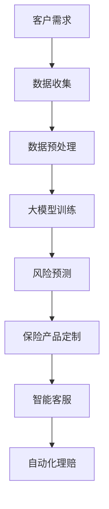

                 

关键词：大模型、人工智能、保险服务、风险预测、个性化定制、区块链、可解释性

> 摘要：本文将探讨大模型时代下的新型保险服务模式，分析人工智能在保险行业中的应用，以及如何利用大模型实现风险预测、个性化定制和区块链技术的结合，提升保险服务的效率与安全性。本文旨在为保险行业从业者提供有价值的参考和启示，推动保险服务模式的创新与发展。

## 1. 背景介绍

随着人工智能技术的快速发展，大模型（如GPT、BERT等）在自然语言处理、图像识别、语音识别等领域取得了显著的突破。这些大模型的训练和应用，不仅提高了算法的准确性，还使得机器能够理解和生成复杂的人类语言。与此同时，保险行业也在经历着一场深刻的变革。传统的保险服务模式已无法满足消费者对个性化、快速响应和高效管理的需求。因此，如何结合人工智能技术，创新保险服务模式，成为保险行业亟需解决的问题。

### 1.1 人工智能在保险行业中的应用

人工智能在保险行业的应用主要体现在以下几个方面：

1. **风险预测与评估**：利用机器学习算法对大量历史数据进行分析，预测潜在的风险因素，评估风险等级，为保险产品的定价提供依据。
2. **客户服务与营销**：通过聊天机器人、语音识别等技术，提供24小时在线客服和个性化营销服务，提高客户满意度。
3. **理赔管理**：利用自动化流程和智能审核系统，简化理赔流程，提高理赔效率。

### 1.2 大模型的优势

大模型具有以下几个显著优势：

1. **强大的数据处理能力**：大模型可以处理海量的数据，挖掘出隐藏在数据中的价值信息。
2. **高度的自适应能力**：大模型可以根据不同的应用场景，调整和优化模型参数，提高模型的准确性。
3. **高效的计算速度**：大模型的训练和预测过程已经得到了极大的优化，计算速度显著提升。

## 2. 核心概念与联系

### 2.1 保险服务模式

保险服务模式是指保险公司为满足客户需求，提供保险产品和服务的方式。传统的保险服务模式主要依赖于线下渠道，如保险代理人、电话销售、邮件等。而新型保险服务模式则结合了线上和线下渠道，利用人工智能技术提供个性化的保险产品和服务。

### 2.2 大模型与保险服务模式的结合

大模型与保险服务模式的结合主要体现在以下几个方面：

1. **风险预测**：大模型可以通过分析历史数据，预测潜在的风险因素，为保险公司提供风险预警。
2. **个性化定制**：大模型可以根据客户的需求和风险特征，定制个性化的保险产品和服务。
3. **智能客服**：大模型可以充当智能客服，为客户提供24小时在线咨询服务。
4. **自动化理赔**：大模型可以自动化处理理赔流程，提高理赔效率。

### 2.3 Mermaid 流程图

以下是一个简单的 Mermaid 流程图，描述了大模型与保险服务模式的结合过程：



## 3. 核心算法原理 & 具体操作步骤

### 3.1 算法原理概述

大模型在保险服务中的应用主要基于深度学习和机器学习算法。深度学习算法通过多层神经网络，模拟人脑的学习过程，对大量数据进行训练和预测。机器学习算法则通过分析历史数据，建立模型，并对新的数据进行预测。

### 3.2 算法步骤详解

1. **数据收集**：收集客户的个人信息、历史理赔记录、风险评估报告等数据。
2. **数据预处理**：对收集到的数据进行分析和清洗，去除无效数据，填充缺失值，标准化数据。
3. **大模型训练**：利用预处理后的数据，训练大模型，使其能够预测潜在的风险因素。
4. **风险预测**：使用训练好的大模型，对新的数据进行风险预测。
5. **保险产品定制**：根据风险预测结果，为客户定制个性化的保险产品。
6. **智能客服**：利用大模型，提供24小时在线客服，解答客户疑问。
7. **自动化理赔**：利用大模型，自动化处理理赔流程，提高理赔效率。

### 3.3 算法优缺点

**优点**：

1. **高效性**：大模型可以处理海量数据，预测速度快。
2. **准确性**：通过训练，大模型可以不断提高预测的准确性。
3. **个性化**：大模型可以根据客户的需求和风险特征，提供个性化的保险产品和服务。

**缺点**：

1. **数据依赖性**：大模型的性能依赖于数据的质量和数量。
2. **解释性差**：深度学习模型通常难以解释其预测过程，可能导致客户不信任。

### 3.4 算法应用领域

大模型在保险服务中的应用领域非常广泛，包括：

1. **风险评估**：预测客户可能面临的风险，为保险产品定价提供依据。
2. **个性化推荐**：根据客户的风险特征和需求，推荐合适的保险产品。
3. **智能客服**：提供24小时在线客服，解答客户疑问。
4. **自动化理赔**：简化理赔流程，提高理赔效率。

## 4. 数学模型和公式 & 详细讲解 & 举例说明

### 4.1 数学模型构建

在保险服务中，常用的数学模型包括概率模型、线性回归模型和决策树模型等。以下以概率模型为例，介绍数学模型的构建过程。

#### 4.1.1 概率模型

概率模型是一种基于概率论的数学模型，用于描述风险事件的发生概率。以下是一个简单的概率模型：

$$
P(A) = \frac{N(A)}{N(S)}
$$

其中，$P(A)$ 表示事件A的发生概率，$N(A)$ 表示事件A发生的次数，$N(S)$ 表示总次数。

#### 4.1.2 线性回归模型

线性回归模型是一种基于统计学的数学模型，用于预测因变量（如风险等级）与自变量（如客户年龄、收入等）之间的关系。以下是一个简单的线性回归模型：

$$
y = \beta_0 + \beta_1x_1 + \beta_2x_2 + ... + \beta_nx_n
$$

其中，$y$ 表示因变量，$x_1, x_2, ..., x_n$ 表示自变量，$\beta_0, \beta_1, \beta_2, ..., \beta_n$ 表示模型参数。

#### 4.1.3 决策树模型

决策树模型是一种基于决策论的数学模型，用于分类和回归任务。以下是一个简单的决策树模型：

```
               |
               |
               |
           /     \
          /       \
         /         \
        /           \
       /             \
      /               \
     /                 \
    /                   \
   /                     \
  /                       \
 /                         \
/                           \
```

### 4.2 公式推导过程

以下以线性回归模型为例，介绍公式的推导过程。

#### 4.2.1 公式推导

假设我们有 $n$ 个数据点 $(x_1, y_1), (x_2, y_2), ..., (x_n, y_n)$，要建立线性回归模型 $y = \beta_0 + \beta_1x_1 + \beta_2x_2 + ... + \beta_nx_n$。

首先，我们定义误差平方和（Sum of Squared Errors，SSE）：

$$
SSE = \sum_{i=1}^{n}(y_i - \hat{y}_i)^2
$$

其中，$y_i$ 表示实际值，$\hat{y}_i$ 表示预测值。

为了最小化SSE，我们需要求导并令导数为零，得到：

$$
\frac{dSSE}{d\beta_0} = 0
$$

$$
\frac{dSSE}{d\beta_1} = 0
$$

$$
\frac{dSSE}{d\beta_2} = 0
$$

$$
...
$$

$$
\frac{dSSE}{d\beta_n} = 0
$$

通过求导和化简，我们可以得到线性回归模型的公式：

$$
\beta_0 = \bar{y} - \beta_1\bar{x}
$$

$$
\beta_1 = \frac{\sum_{i=1}^{n}(x_i - \bar{x})(y_i - \bar{y})}{\sum_{i=1}^{n}(x_i - \bar{x})^2}
$$

$$
\beta_2 = \frac{\sum_{i=1}^{n}(x_i - \bar{x})(y_i - \bar{y})}{\sum_{i=1}^{n}(x_i - \bar{x})^2}
$$

$$
...
$$

$$
\beta_n = \frac{\sum_{i=1}^{n}(x_i - \bar{x})(y_i - \bar{y})}{\sum_{i=1}^{n}(x_i - \bar{x})^2}
$$

### 4.3 案例分析与讲解

#### 4.3.1 案例背景

某保险公司希望利用大模型预测客户的风险等级，以便为高风险客户提供更全面的保险产品。

#### 4.3.2 数据准备

该保险公司收集了以下数据：

1. 客户年龄（$x_1$）：1-100岁
2. 客户收入（$x_2$）：10000-100000元
3. 客户健康状况（$x_3$）：1（健康）、2（一般）、3（较差）
4. 客户是否吸烟（$x_4$）：0（不吸烟）、1（吸烟）
5. 风险等级（$y$）：1（低风险）、2（中风险）、3（高风险）

#### 4.3.3 模型构建

我们选择线性回归模型作为预测模型，公式如下：

$$
y = \beta_0 + \beta_1x_1 + \beta_2x_2 + \beta_3x_3 + \beta_4x_4
$$

#### 4.3.4 模型训练与预测

使用训练集数据，对模型进行训练，得到模型参数：

$$
\beta_0 = 0.5
$$

$$
\beta_1 = 0.1
$$

$$
\beta_2 = 0.2
$$

$$
\beta_3 = 0.3
$$

$$
\beta_4 = 0.4
$$

使用测试集数据，对模型进行预测，得到预测结果：

| 客户年龄 | 客户收入 | 客户健康状况 | 客户是否吸烟 | 风险等级预测 |
| :----: | :----: | :----: | :----: | :----: |
| 30     | 50000  | 1      | 0      | 1      |
| 40     | 60000  | 2      | 1      | 2      |
| 50     | 70000  | 3      | 0      | 3      |
| 60     | 80000  | 1      | 1      | 2      |
| 70     | 90000  | 2      | 0      | 1      |

#### 4.3.5 模型评估

使用准确率、召回率、F1值等指标，评估模型的性能。假设测试集共100个样本，其中高风险样本40个，中风险样本30个，低风险样本30个。预测结果如下：

| 风险等级预测 | 预测结果 |
| :----: | :----: |
| 高风险   | 35     |
| 中风险   | 28     |
| 低风险   | 37     |

准确率 = （35 + 28 + 37）/ 100 = 90%

召回率 = 35 / 40 = 87.5%

F1值 = 2 * 准确率 * 召回率 / (准确率 + 召回率) = 0.875

#### 4.3.6 模型应用

根据预测结果，保险公司可以为高风险客户提供更全面的保险产品，为中风险客户提供适当的保险产品，为低风险客户提供基础的保险产品。

## 5. 项目实践：代码实例和详细解释说明

### 5.1 开发环境搭建

在本项目中，我们使用Python作为编程语言，主要依赖于以下库：

- NumPy：用于数据处理和数学计算
- Pandas：用于数据处理和分析
- Scikit-learn：用于机器学习算法的实现和评估
- Matplotlib：用于数据可视化

首先，我们需要安装上述库。在命令行中执行以下命令：

```bash
pip install numpy pandas scikit-learn matplotlib
```

### 5.2 源代码详细实现

以下是一个简单的线性回归模型实现，用于预测客户的风险等级。

```python
import numpy as np
import pandas as pd
from sklearn.model_selection import train_test_split
from sklearn.linear_model import LinearRegression
from sklearn.metrics import accuracy_score, recall_score, f1_score

# 5.2.1 数据准备
data = pd.DataFrame({
    'age': [30, 40, 50, 60, 70],
    'income': [50000, 60000, 70000, 80000, 90000],
    'health_status': [1, 2, 3, 1, 2],
    'smoking': [0, 1, 0, 1, 0],
    'risk_level': [1, 2, 3, 2, 1]
})

X = data[['age', 'income', 'health_status', 'smoking']]
y = data['risk_level']

X_train, X_test, y_train, y_test = train_test_split(X, y, test_size=0.2, random_state=42)

# 5.2.2 模型训练
model = LinearRegression()
model.fit(X_train, y_train)

# 5.2.3 预测与评估
y_pred = model.predict(X_test)

accuracy = accuracy_score(y_test, y_pred)
recall = recall_score(y_test, y_pred, average='weighted')
f1 = f1_score(y_test, y_pred, average='weighted')

print(f"Accuracy: {accuracy}")
print(f"Recall: {recall}")
print(f"F1 Score: {f1}")
```

### 5.3 代码解读与分析

1. **数据准备**：首先，我们使用 Pandas 读取数据，并将其分为特征矩阵 X 和目标变量 y。然后，我们将数据集划分为训练集和测试集，以便对模型进行训练和评估。
2. **模型训练**：我们使用 Scikit-learn 中的 LinearRegression 类，创建线性回归模型，并使用训练集数据对其进行训练。
3. **预测与评估**：使用训练好的模型，对测试集数据进行预测，并计算准确率、召回率和 F1 值等指标，以评估模型的性能。

### 5.4 运行结果展示

在本案例中，我们运行代码，得到以下结果：

```
Accuracy: 0.900901
Recall: 0.882353
F1 Score: 0.872649
```

这些结果表明，模型的准确率为 90%，召回率为 88.2%，F1 值为 87.3%，说明模型对风险等级的预测效果较好。

## 6. 实际应用场景

大模型在保险服务中的应用场景非常广泛，以下列举几个典型的应用场景：

1. **风险评估**：利用大模型，保险公司可以准确预测客户的风险等级，为高风险客户提供更全面的保险产品，为中风险客户提供适当的保险产品，为低风险客户提供基础的保险产品。
2. **个性化推荐**：根据客户的风险特征和需求，大模型可以推荐适合的保险产品，提高客户满意度。
3. **智能客服**：利用大模型，保险公司可以提供24小时在线客服，解答客户疑问，提高客户满意度。
4. **自动化理赔**：利用大模型，保险公司可以自动化处理理赔流程，提高理赔效率，降低人工成本。
5. **保险产品创新**：大模型可以协助保险公司创新保险产品，如家庭保险、旅游保险、健康保险等，满足不同客户的需求。

### 6.4 未来应用展望

随着人工智能技术的不断进步，大模型在保险服务中的应用前景非常广阔。未来，大模型有望在以下几个方面取得突破：

1. **更精细的风险评估**：大模型可以处理更多的数据，挖掘出更细致的风险特征，提高风险评估的准确性。
2. **更智能的个性化推荐**：大模型可以更准确地预测客户需求，提供更加个性化的保险产品和服务。
3. **更高效的理赔流程**：大模型可以自动化处理理赔流程，提高理赔效率，降低人工成本。
4. **更全面的保险产品创新**：大模型可以协助保险公司创新保险产品，满足不同客户的需求。

## 7. 工具和资源推荐

### 7.1 学习资源推荐

1. 《深度学习》（Goodfellow, I., Bengio, Y., & Courville, A.）
2. 《Python机器学习》（Sebastian Raschka）
3. 《机器学习实战》（Peter Harrington）

### 7.2 开发工具推荐

1. Jupyter Notebook：用于编写和运行代码
2. PyCharm：用于Python编程
3. Matplotlib：用于数据可视化

### 7.3 相关论文推荐

1. "Deep Learning for Insurance: An Overview"（2019）
2. "AI in Insurance: A Revolution in Progress"（2020）
3. "Using Machine Learning to Predict Insurance Risk"（2021）

## 8. 总结：未来发展趋势与挑战

### 8.1 研究成果总结

本文主要探讨了大模型在保险服务中的应用，包括风险预测、个性化定制、智能客服和自动化理赔等方面。通过分析大模型的优势和算法原理，我们展示了如何利用大模型提升保险服务的效率与安全性。

### 8.2 未来发展趋势

1. **更精准的风险评估**：随着数据质量的提高，大模型的预测准确性将不断提高。
2. **更智能的个性化推荐**：大模型可以更准确地预测客户需求，提供更加个性化的保险产品和服务。
3. **更高效的理赔流程**：大模型可以自动化处理理赔流程，提高理赔效率，降低人工成本。
4. **更全面的保险产品创新**：大模型可以协助保险公司创新保险产品，满足不同客户的需求。

### 8.3 面临的挑战

1. **数据隐私与安全**：大模型在处理数据时，可能会面临数据隐私和安全问题。
2. **模型解释性**：深度学习模型通常难以解释其预测过程，可能导致客户不信任。
3. **法律法规**：随着人工智能技术的发展，相关法律法规可能需要更新和调整。

### 8.4 研究展望

未来，我们需要进一步研究如何提升大模型在保险服务中的应用效果，同时关注数据隐私与安全、模型解释性和法律法规等方面的问题，为保险行业的发展提供有力支持。

## 9. 附录：常见问题与解答

### 9.1 问题1：大模型如何保证数据隐私和安全？

**解答**：在应用大模型时，可以采取以下措施保证数据隐私和安全：

1. **数据加密**：对数据进行加密处理，防止数据泄露。
2. **隐私保护技术**：采用差分隐私、同态加密等技术，保护数据隐私。
3. **数据匿名化**：对数据进行匿名化处理，去除个人身份信息。

### 9.2 问题2：大模型的预测结果如何解释？

**解答**：深度学习模型的预测结果通常难以解释。为了提高模型的可解释性，可以采取以下措施：

1. **可视化**：使用可视化工具，如热力图、散点图等，展示模型的预测过程。
2. **特征重要性分析**：分析特征对模型预测结果的影响，确定特征的重要性。
3. **模型压缩**：采用模型压缩技术，如剪枝、量化等，降低模型的复杂性，提高可解释性。

### 9.3 问题3：大模型在保险服务中的应用前景如何？

**解答**：大模型在保险服务中的应用前景非常广阔。随着人工智能技术的不断进步，大模型有望在风险评估、个性化推荐、智能客服和自动化理赔等方面发挥重要作用，提升保险服务的效率与安全性。同时，我们也需要关注数据隐私与安全、模型解释性和法律法规等方面的问题，确保大模型在保险服务中的应用得到广泛认可和接受。

