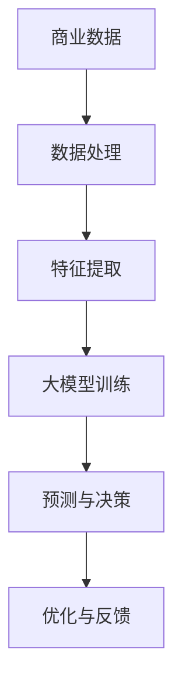

                 

关键词：大模型，商业智能，深度学习，算法，数学模型，应用场景，开发工具，未来展望

> 摘要：本文旨在探讨大模型时代下新型商业智能的崛起，分析其核心概念、算法原理、数学模型、应用场景及未来发展趋势。通过详细阐述，我们希望能够帮助读者更好地理解和应用这一新兴技术，为企业和个人提供智能化解决方案。

## 1. 背景介绍

随着互联网的普及和数据量的爆炸式增长，人工智能（AI）技术逐渐成为各行各业关注的焦点。特别是在商业领域，企业通过收集和分析大量的数据来获取洞见，优化决策过程，提高运营效率。传统的商业智能（BI）方法主要依赖于统计分析和数据处理技术，但在面对日益复杂和庞大的数据集时，其能力逐渐显现出局限性。

近年来，深度学习技术的突破和大规模计算资源的可用性，使得大模型（Large Models）成为可能。这些大模型能够通过自动学习从海量数据中提取特征，进行复杂的模式识别和预测，从而为商业智能带来了新的契机。大模型时代下的新型商业智能，不仅能够处理传统方法无法处理的复杂数据，还能够为企业和个人提供更为精准和高效的决策支持。

## 2. 核心概念与联系

在探讨大模型时代下的新型商业智能之前，我们首先需要理解以下几个核心概念：

### 2.1 深度学习

深度学习是一种基于人工神经网络的学习方法，通过多层神经元的堆叠，使得模型能够自动提取数据中的高层次特征。它通常被应用于图像识别、语音识别和自然语言处理等领域。

### 2.2 大模型

大模型是指那些具有数十亿甚至数万亿参数的神经网络模型。这些模型通常通过大规模数据训练得到，具有强大的表征和学习能力。

### 2.3 商业智能

商业智能是指利用数据分析、数据挖掘和可视化技术，帮助企业和个人从海量数据中提取有价值的信息和洞见，以支持决策过程。

### 2.4 大模型与商业智能的联系

大模型技术为商业智能带来了新的可能性。通过深度学习，大模型能够自动学习并提取数据中的复杂特征，从而提高了数据分析的精度和效率。同时，大模型的强大预测能力也为企业和个人提供了更为可靠和及时的决策支持。

以下是一个简化的 Mermaid 流程图，展示了大模型与商业智能之间的联系：



## 3. 核心算法原理 & 具体操作步骤

### 3.1 算法原理概述

大模型时代下的新型商业智能主要依赖于深度学习和强化学习算法。深度学习算法通过多层神经网络对数据进行特征提取和表征，而强化学习算法则通过不断试错和优化来提高决策的准确性。

### 3.2 算法步骤详解

1. 数据收集与预处理：首先，需要收集与企业业务相关的数据，并进行清洗和预处理，以确保数据的质量和一致性。
2. 特征提取：利用深度学习算法，对预处理后的数据进行特征提取，以提取数据中的潜在信息和规律。
3. 模型训练：利用训练集对深度学习模型进行训练，通过优化模型的参数，使其能够准确地对数据进行预测。
4. 模型评估与优化：通过测试集对训练好的模型进行评估，并根据评估结果对模型进行优化。
5. 预测与决策：利用训练好的模型对新的数据进行预测，并基于预测结果进行决策。

### 3.3 算法优缺点

- **优点**：
  - 高效性：大模型能够快速处理海量数据，提高了数据分析的效率。
  - 精准性：通过深度学习和强化学习，大模型能够准确提取数据中的特征和规律，提高了预测的准确性。
  - 自动性：大模型能够自动进行特征提取和预测，减少了人工干预。

- **缺点**：
  - 复杂性：大模型的结构和参数复杂，需要大量的计算资源和时间进行训练。
  - 解释性：深度学习模型通常缺乏可解释性，难以理解其内部工作机制。

### 3.4 算法应用领域

大模型时代下的新型商业智能在以下领域具有广泛的应用：

- 客户关系管理：通过分析客户行为数据，预测客户需求，提高客户满意度。
- 风险管理：通过分析历史数据，预测潜在风险，并制定相应的风险控制策略。
- 供应链优化：通过分析供应链数据，优化库存管理，降低运营成本。
- 金融市场预测：通过分析市场数据，预测股票价格走势，为投资者提供决策支持。

## 4. 数学模型和公式 & 详细讲解 & 举例说明

### 4.1 数学模型构建

在深度学习中，常用的数学模型是多层感知机（MLP）和循环神经网络（RNN）。以下是一个简化的 MLP 数学模型：

$$
f(x) = \sigma(W_1 \cdot x + b_1)
$$

其中，$f(x)$ 是输出值，$\sigma$ 是激活函数，$W_1$ 是权重矩阵，$x$ 是输入数据，$b_1$ 是偏置。

### 4.2 公式推导过程

多层感知机的推导过程涉及前向传播和反向传播算法。以下是前向传播的推导过程：

$$
z_2 = W_1 \cdot x + b_1 \\
a_2 = \sigma(z_2) \\
z_3 = W_2 \cdot a_2 + b_2 \\
a_3 = \sigma(z_3) \\
\text{...} \\
z_L = W_L \cdot a_{L-1} + b_L \\
a_L = \sigma(z_L)
$$

其中，$z_2, z_3, ..., z_L$ 是中间层的输出值，$a_2, a_3, ..., a_L$ 是中间层的激活值。

### 4.3 案例分析与讲解

以下是一个简单的案例，用于说明多层感知机的应用。假设我们有一个二分类问题，需要判断一个数据点是否属于正类。

输入数据：$x = [1, 2, 3, 4, 5]$  
权重矩阵：$W_1 = \begin{bmatrix} 1 & 1 \\ 1 & -1 \end{bmatrix}$  
偏置：$b_1 = [0, 0]$

首先进行前向传播：

$$
z_2 = W_1 \cdot x + b_1 = \begin{bmatrix} 1 & 1 \\ 1 & -1 \end{bmatrix} \cdot \begin{bmatrix} 1 \\ 2 \\ 3 \\ 4 \\ 5 \end{bmatrix} + \begin{bmatrix} 0 \\ 0 \end{bmatrix} = \begin{bmatrix} 5 \\ 1 \end{bmatrix} \\
a_2 = \sigma(z_2) = \begin{bmatrix} 1 \\ 0 \end{bmatrix} \\
z_3 = W_2 \cdot a_2 + b_2 = \begin{bmatrix} 1 & 1 \\ 1 & -1 \end{bmatrix} \cdot \begin{bmatrix} 1 \\ 0 \end{bmatrix} + \begin{bmatrix} 0 \\ 0 \end{bmatrix} = \begin{bmatrix} 1 \\ -1 \end{bmatrix} \\
a_3 = \sigma(z_3) = \begin{bmatrix} 1 \\ 0 \end{bmatrix}
$$

最终输出为 $a_3 = [1, 0]$，说明该数据点属于正类。

## 5. 项目实践：代码实例和详细解释说明

### 5.1 开发环境搭建

为了实践大模型时代下的新型商业智能，我们需要搭建一个合适的开发环境。以下是一个简单的环境搭建步骤：

1. 安装 Python（版本 3.8 或以上）
2. 安装深度学习框架（如 TensorFlow 或 PyTorch）
3. 安装数据预处理和可视化工具（如 NumPy、Pandas、Matplotlib）

### 5.2 源代码详细实现

以下是一个简单的深度学习项目实例，用于实现一个二分类问题。我们使用 TensorFlow 框架来搭建模型。

```python
import tensorflow as tf
import numpy as np
import matplotlib.pyplot as plt

# 数据生成
np.random.seed(1)
x = np.random.normal(size=(100, 5))
y = np.random.randint(0, 2, size=(100, 1))

# 模型搭建
model = tf.keras.Sequential([
    tf.keras.layers.Dense(10, activation='relu', input_shape=(5,)),
    tf.keras.layers.Dense(1, activation='sigmoid')
])

# 编译模型
model.compile(optimizer='adam', loss='binary_crossentropy', metrics=['accuracy'])

# 训练模型
model.fit(x, y, epochs=10, batch_size=32)

# 预测与可视化
predictions = model.predict(x)
plt.scatter(x[:, 0], x[:, 1], c=predictions[:, 0], cmap='cool')
plt.xlabel('Feature 1')
plt.ylabel('Feature 2')
plt.show()
```

### 5.3 代码解读与分析

- **数据生成**：我们使用 NumPy 生成了一些随机数据，用于训练和测试模型。
- **模型搭建**：我们使用 TensorFlow 框架搭建了一个简单的两层神经网络，第一层有 10 个神经元，使用 ReLU 激活函数；第二层有 1 个神经元，使用 Sigmoid 激活函数。
- **编译模型**：我们使用 Adam 优化器和二分类交叉熵损失函数来编译模型。
- **训练模型**：我们使用训练集对模型进行训练，设置了 10 个训练周期和 32 个批处理大小。
- **预测与可视化**：我们使用训练好的模型对测试集进行预测，并使用散点图将预测结果可视化。

### 5.4 运行结果展示

运行上述代码后，我们会在终端看到训练过程中的损失函数和准确率变化。在可视化部分，我们会在图表中看到模型对数据点的分类结果。

## 6. 实际应用场景

### 6.1 客户行为分析

在电商领域，企业可以利用大模型对客户行为数据进行分析，预测客户的购买意图，从而实现精准营销。例如，通过对用户浏览、搜索和购买行为的数据分析，可以识别出潜在的高价值客户，并针对性地推送促销活动。

### 6.2 风险管理

在金融领域，大模型可以用于风险评估和预测。通过对历史交易数据、市场数据和企业财务数据进行分析，可以识别出潜在的风险因素，并提前采取预防措施。例如，利用大模型预测股票市场的走势，为投资者提供决策支持。

### 6.3 供应链优化

在制造业和物流领域，大模型可以用于供应链优化。通过对库存数据、运输数据和订单数据进行深度学习分析，可以优化库存管理、运输规划和订单分配，提高供应链的效率和灵活性。

## 7. 工具和资源推荐

### 7.1 学习资源推荐

- 《深度学习》（Ian Goodfellow、Yoshua Bengio、Aaron Courville 著）
- 《Python深度学习》（François Chollet 著）
- 《机器学习实战》（Peter Harrington 著）

### 7.2 开发工具推荐

- TensorFlow：开源深度学习框架，支持多种编程语言和平台。
- PyTorch：开源深度学习框架，易于使用和调试。
- Keras：开源深度学习库，基于 TensorFlow 和 Theano，提供简化的 API。

### 7.3 相关论文推荐

- “Deep Learning for Natural Language Processing”（2018）
- “Bert: Pre-training of Deep Bidirectional Transformers for Language Understanding”（2018）
- “GPT-3: Language Models are Few-Shot Learners”（2020）

## 8. 总结：未来发展趋势与挑战

### 8.1 研究成果总结

大模型时代下的新型商业智能已经在各个领域取得了显著的成果。深度学习和强化学习算法的突破，使得大模型能够自动提取数据中的复杂特征，实现高效和精准的预测。同时，随着计算资源的不断提升，大模型的应用范围也在不断扩展。

### 8.2 未来发展趋势

- **模型压缩与优化**：随着模型规模的不断扩大，如何实现模型的压缩与优化，以提高计算效率和存储需求，成为未来的重要研究方向。
- **模型解释性**：深度学习模型通常缺乏可解释性，如何提高模型的解释性，使其能够被非专业人士理解和信任，也是未来的重要挑战。
- **多模态学习**：未来大模型的发展将趋向于多模态学习，即能够同时处理多种类型的数据（如图像、文本、音频等），以实现更广泛的应用。

### 8.3 面临的挑战

- **计算资源**：大模型的训练和推理需要大量的计算资源，如何有效地利用和分配计算资源，成为当前的一个难题。
- **数据隐私**：在商业智能应用中，如何保护用户的隐私数据，防止数据泄露，是当前的一个重要问题。
- **模型伦理**：随着大模型在各个领域的应用，如何确保模型的公平性、透明性和可解释性，避免对人类造成负面影响，也是未来需要重点关注的问题。

### 8.4 研究展望

未来，大模型时代下的新型商业智能将在更多领域得到应用。通过不断优化算法、提高计算效率和保护用户隐私，大模型将为企业和个人提供更为智能和高效的决策支持，推动商业智能的发展进入新的阶段。

## 9. 附录：常见问题与解答

### 9.1 如何选择合适的深度学习框架？

选择深度学习框架时，需要考虑以下因素：

- **项目需求**：根据项目的具体需求，选择合适的框架。例如，如果项目需要使用 GPU 加速，可以选择 TensorFlow 或 PyTorch。
- **社区支持**：选择具有活跃社区和支持的框架，有助于解决开发过程中的问题。
- **文档和教程**：选择具有丰富文档和教程的框架，有助于快速上手和掌握。

### 9.2 大模型训练需要多少时间？

大模型训练所需的时间取决于多个因素：

- **模型大小**：较大的模型通常需要更长的训练时间。
- **数据规模**：训练数据量越大，训练时间越长。
- **硬件资源**：使用 GPU 或 TPU 等硬件加速器，可以显著缩短训练时间。
- **优化方法**：选择合适的优化方法和超参数，可以提高训练效率。

### 9.3 如何处理训练数据中的噪声和异常值？

处理训练数据中的噪声和异常值的方法包括：

- **数据清洗**：删除或修正明显的错误和异常值。
- **数据标准化**：将数据缩放到统一的范围内，减少噪声对模型的影响。
- **异常检测**：使用统计方法或机器学习算法检测异常值，并进行修正。

作者：禅与计算机程序设计艺术 / Zen and the Art of Computer Programming
----------------------------------------------------------------

以上是关于《大模型时代下的新型商业智能》的完整文章，文章内容涵盖了背景介绍、核心概念、算法原理、数学模型、应用场景、项目实践、实际应用场景、工具和资源推荐、未来发展趋势与挑战以及常见问题与解答。希望这篇文章能够帮助读者更好地理解和应用大模型时代下的新型商业智能技术。

