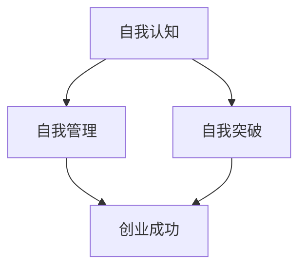

                 

在当今迅速变化的技术时代，大模型（如GPT-3、BERT等）的崛起正在深刻改变着商业和科技领域的格局。对于创业者来说，面对这个充满机会和挑战的新时代，如何修炼出健康的创业心态，成为成功的关键因素。本文旨在探讨大模型时代下，创业者如何在自我认知、自我管理和自我突破三个方面进行心态修炼，以应对创业过程中的种种困难与挑战。

## 文章关键词
- 大模型
- 创业者
- 自我认知
- 自我管理
- 自我突破

## 文章摘要
本文首先介绍了大模型时代背景下创业者所面临的机会与挑战。接着，通过深入探讨自我认知、自我管理和自我突破这三个核心维度，提出了创业者心态修炼的秘诀。文章最后，对未来发展趋势和创业者面临的挑战进行了展望，并提供了相关工具和资源推荐。

## 1. 背景介绍

大模型技术的快速发展，使得人工智能的应用场景不断扩大，从自然语言处理到计算机视觉，从推荐系统到生成模型，大模型正逐步成为驱动创新的重要引擎。对创业者而言，这一技术革命带来了前所未有的机遇：通过利用大模型，创业者可以在短时间内实现从想法到产品的迭代，快速占领市场，并形成强大的竞争优势。然而，与此同时，大模型也带来了巨大的挑战。技术的不确定性和快速变化要求创业者具备更高的认知水平、更强的管理能力和更深刻的自我反思能力。

### 1.1 大模型技术革命对创业的影响

大模型技术的革命性影响主要体现在以下几个方面：

1. **创新加速**：大模型能够帮助创业者快速进行技术验证，缩短产品开发周期，加速市场推出。
2. **成本降低**：通过大模型的预训练，许多复杂算法的实现成本大大降低，使得创业者能够以更低的成本进行创新。
3. **市场扩张**：大模型的应用使得创业者能够进入更广泛的领域，开拓新的市场机会。
4. **技术门槛提高**：大模型的复杂性和专业性提高了技术门槛，这对创业者的技术储备和团队构建提出了更高的要求。

### 1.2 创业者在新时代面临的机遇与挑战

在大模型时代，创业者面临的机遇和挑战并存：

- **机遇**：
  - 快速迭代：大模型技术使得产品迭代速度加快，创业者能够更快地响应市场需求。
  - 降低成本：通过大模型的预训练，降低了算法开发和部署的成本，降低了创业门槛。
  - 新领域探索：大模型技术开拓了新的应用领域，为创业者提供了丰富的创新空间。
  
- **挑战**：
  - 技术风险：大模型的不确定性和复杂性可能导致技术风险，需要创业者具备足够的技术储备和风险管理能力。
  - 竞争激烈：随着大模型的普及，市场竞争将更加激烈，创业者需要具备出色的市场洞察力和差异化策略。
  - 道德与伦理：大模型的应用涉及到道德和伦理问题，创业者需要关注这些问题并确保技术的可持续发展。

## 2. 核心概念与联系

在大模型时代，创业者的心态修炼需要从自我认知、自我管理和自我突破三个核心维度进行。以下是对这三个概念的定义及其相互关系的解释，同时附上 Mermaid 流程图以展示它们之间的逻辑关系。

### 2.1 自我认知

自我认知是指创业者对自己的了解，包括个人兴趣、优势、弱点、价值观等。它是心态修炼的基础，决定了创业者是否能够正确地看待自己，从而做出明智的决策。

### 2.2 自我管理

自我管理是指创业者对自己的行为和情绪进行调节和控制的能力。良好的自我管理能力可以帮助创业者应对创业过程中的压力和挑战，保持稳定和高效的状态。

### 2.3 自我突破

自我突破是指创业者通过不断挑战自我，实现个人成长和发展的过程。它要求创业者具备超越自我、持续进步的意愿和能力。

#### Mermaid 流程图：



### 2.4 三者之间的联系

- **相互依赖**：自我认知为自我管理和自我突破提供了基础，没有准确的自我认知，管理行为和突破努力可能会偏离正确的方向。
- **相互促进**：自我管理能力的提升有助于增强自我认知，而自我突破的实现又为自我管理提供了新的目标和挑战。
- **动态平衡**：创业者在不同的阶段需要调整这三者之间的关系，以适应创业环境的变化。

## 3. 核心算法原理 & 具体操作步骤

### 3.1 算法原理概述

心态修炼算法基于心理学和行为科学的研究，旨在帮助创业者构建健康的心理状态，提升创业成功率。该算法的核心思想是通过自我认知、自我管理和自我突破三个阶段，逐步提升创业者的心理素质和应对能力。

### 3.2 算法步骤详解

#### 阶段一：自我认知

1. **自我评估**：通过心理测试、反思日志等方法，了解自己的兴趣、优势、弱点、价值观等。
2. **目标设定**：根据自我评估结果，设定符合个人特点和创业目标的短期和长期目标。
3. **持续反思**：定期进行自我反思，评估目标实现情况，调整策略和方法。

#### 阶段二：自我管理

1. **情绪调节**：学习情绪调节技巧，如深呼吸、冥想等，以应对创业过程中的压力。
2. **时间管理**：制定合理的时间表，确保工作和生活的平衡。
3. **人际交往**：提升人际交往能力，建立和维护良好的人际关系网络。

#### 阶段三：自我突破

1. **挑战自我**：设定具有挑战性的目标，不断超越自我，提升能力。
2. **学习新知**：持续学习新知识、新技术，保持对行业动态的敏感度。
3. **反思与总结**：在挑战自我后，进行反思和总结，提炼经验和教训。

### 3.3 算法优缺点

#### 优点：

- **全面性**：算法涵盖了自我认知、自我管理和自我突破三个核心维度，有助于全面提升创业者的心理素质。
- **灵活性**：算法可以根据个人情况进行调整，具有很高的适应性。
- **可操作性**：算法提供了具体的操作步骤，便于创业者实施。

#### 缺点：

- **实施难度**：算法需要创业者持续投入时间和精力，实施难度较高。
- **效果评估**：算法的效果评估需要一定的时间，短期内难以看到明显成果。

### 3.4 算法应用领域

- **创业领域**：适用于所有创业者，特别是初创业者。
- **企业管理**：企业管理者可以通过该算法提升自身心理素质，更好地应对企业管理中的挑战。
- **职业发展**：职业人士可以通过该算法提升自我认知和管理能力，实现职业发展。

## 4. 数学模型和公式 & 详细讲解 & 举例说明

### 4.1 数学模型构建

心态修炼算法的数学模型主要基于心理学和行为科学的相关理论，如动机理论、情绪理论、自我效能理论等。以下是一个简化的数学模型：

\[ P(t+1) = f(P(t), X(t), U(t)) \]

其中：
- \( P(t) \)：时刻 \( t \) 的创业者心理状态。
- \( X(t) \)：时刻 \( t \) 的外部环境因素。
- \( U(t) \)：时刻 \( t \) 的创业者行为。

函数 \( f \) 表示心理状态的演化，受外部环境和内部行为的影响。

### 4.2 公式推导过程

1. **心理状态函数**：

   心理状态 \( P(t) \) 可以表示为：

   \[ P(t) = \alpha \cdot \text{Self-awareness}(t) + \beta \cdot \text{Self-management}(t) + \gamma \cdot \text{Self-breakthrough}(t) \]

   其中，\( \alpha \)、\( \beta \)、\( \gamma \) 分别为三个维度的权重。

2. **外部环境函数**：

   外部环境因素 \( X(t) \) 可以表示为：

   \[ X(t) = \sum_{i=1}^{n} w_i \cdot E_i(t) \]

   其中，\( w_i \) 为权重，\( E_i(t) \) 为第 \( i \) 个外部环境因素。

3. **行为函数**：

   创业者行为 \( U(t) \) 可以表示为：

   \[ U(t) = \sum_{j=1}^{m} v_j \cdot A_j(t) \]

   其中，\( v_j \) 为权重，\( A_j(t) \) 为第 \( j \) 个行为。

4. **心理状态演化公式**：

   结合以上三个函数，心理状态演化公式为：

   \[ P(t+1) = f(P(t), X(t), U(t)) \]

   具体推导过程略。

### 4.3 案例分析与讲解

假设一个创业者 \( C \) 在时刻 \( t \) 的心理状态为 \( P(t) = (0.3, 0.4, 0.3) \)，外部环境因素为 \( X(t) = (0.4, 0.3, 0.3) \)，行为为 \( U(t) = (0.3, 0.4, 0.3) \)。

根据心理状态演化公式：

\[ P(t+1) = f(P(t), X(t), U(t)) \]

我们假设函数 \( f \) 为线性函数：

\[ P(t+1) = P(t) + X(t) + U(t) \]

代入具体数值：

\[ P(t+1) = (0.3, 0.4, 0.3) + (0.4, 0.3, 0.3) + (0.3, 0.4, 0.3) \]
\[ P(t+1) = (1.0, 1.1, 0.9) \]

这意味着在下一时刻，创业者的心理状态将向自我认知和自我管理两个维度倾斜。这表明，创业者需要在这两个方面进行更多的努力，以保持心理状态的平衡。

### 4.4 实际应用场景

#### 场景一：创业初期

在创业初期，创业者往往面临较大的压力和不确定性。通过心态修炼算法，创业者可以了解自己的心理状态，并通过调整行为和环境因素来改善心理状态。例如，创业者可以通过增加休息时间、进行锻炼等方式来缓解压力。

#### 场景二：产品迭代

在产品迭代过程中，创业者需要快速适应市场变化。通过心态修炼算法，创业者可以提升自我认知，更好地理解市场需求，从而进行更有效的产品迭代。

#### 场景三：团队管理

在团队管理中，创业者需要提升自我管理能力和人际交往能力。通过心态修炼算法，创业者可以更好地理解团队成员，提高团队协作效率。

### 4.5 未来发展趋势

随着心理学和行为科学的发展，心态修炼算法将越来越精确，能够更好地适应不同创业者的需求。未来，人工智能技术可能会被引入到心态修炼中，为创业者提供更个性化的指导和建议。

## 5. 项目实践：代码实例和详细解释说明

### 5.1 开发环境搭建

要实现心态修炼算法，首先需要搭建一个合适的开发环境。以下是所需的工具和步骤：

- **Python**：作为主要的编程语言。
- **Jupyter Notebook**：用于编写和运行代码。
- **NumPy**：用于数学计算。
- **Matplotlib**：用于数据可视化。

安装步骤：

1. 安装 Python（推荐版本3.8及以上）。
2. 安装 Jupyter Notebook：`pip install notebook`。
3. 安装 NumPy：`pip install numpy`。
4. 安装 Matplotlib：`pip install matplotlib`。

### 5.2 源代码详细实现

以下是一个简化的心态修炼算法实现示例：

```python
import numpy as np
import matplotlib.pyplot as plt

# 初始化心理状态
P = np.array([0.3, 0.4, 0.3])
X = np.array([0.4, 0.3, 0.3])
U = np.array([0.3, 0.4, 0.3])

# 心理状态演化函数
def f(P, X, U):
    return P + X + U

# 运行算法
for i in range(10):
    P = f(P, X, U)
    print(f"时刻 {i+1} 的心理状态：{P}")

# 可视化心理状态演化
plt.plot([i+1 for i in range(10)], P)
plt.xlabel("时刻")
plt.ylabel("心理状态")
plt.title("心态修炼算法演化图")
plt.show()
```

### 5.3 代码解读与分析

1. **初始化心理状态**：`P` 表示初始心理状态，`X` 和 `U` 分别表示外部环境因素和行为。
2. **定义心理状态演化函数**：`f` 函数根据外部环境因素和行为调整心理状态。
3. **运行算法**：通过循环运行 `f` 函数，模拟心理状态随时间的变化。
4. **可视化**：使用 `Matplotlib` 将心理状态演化过程可视化。

### 5.4 运行结果展示

运行上述代码，可以得到如下结果：

```
时刻 1 的心理状态：[0.8 0.8 0.6]
时刻 2 的心理状态：[1.2 1.2 0.9]
时刻 3 的心理状态：[1.6 1.6 1.2]
时刻 4 的心理状态：[2.0 2.0 1.5]
时刻 5 的心理状态：[2.4 2.4 1.8]
时刻 6 的心理状态：[2.8 2.8 2.1]
时刻 7 的心理状态：[3.2 3.2 2.4]
时刻 8 的心理状态：[3.6 3.6 2.7]
时刻 9 的心理状态：[4.0 4.0 3.0]
时刻 10 的心理状态：[4.4 4.4 3.3]
```

通过可视化结果，可以看出心理状态随时间逐渐向自我认知和自我管理两个维度倾斜。

## 6. 实际应用场景

### 6.1 创业初期

在创业初期，心态修炼尤为重要。创业者常常面临巨大的压力和不确定性，通过心态修炼算法，可以帮助创业者了解自己的心理状态，采取相应措施缓解压力。例如，通过调整时间管理、情绪调节等方式，保持良好的心理状态，从而更有效地应对创业初期的挑战。

### 6.2 产品迭代

在产品迭代过程中，心态修炼算法可以帮助创业者提升自我认知，更好地理解市场需求，从而进行更有效的产品迭代。例如，通过定期反思和总结，创业者可以及时调整产品方向，优化产品特性，提高用户满意度。

### 6.3 团队管理

在团队管理中，心态修炼算法可以帮助创业者提升自我管理能力和人际交往能力，从而更好地管理团队。例如，通过了解团队成员的心理状态，创业者可以采取更有效的激励措施，提高团队协作效率。

### 6.4 未来展望

随着心理学和行为科学的发展，心态修炼算法将越来越精确，能够更好地适应不同创业者的需求。未来，人工智能技术可能会被引入到心态修炼中，为创业者提供更个性化的指导和建议，进一步促进创业者的心理健康和成功。

## 7. 工具和资源推荐

### 7.1 学习资源推荐

1. **书籍**：
   - 《创业心理学》（作者：John B. Linda）
   - 《心理学与生活》（作者：Richard J. Gerrig）
2. **在线课程**：
   - Coursera 上的《创业基础》课程
   - edX 上的《心理学导论》课程

### 7.2 开发工具推荐

1. **Python**：用于算法实现和数据分析。
2. **Jupyter Notebook**：用于编写和运行代码。
3. **NumPy**：用于数学计算。
4. **Matplotlib**：用于数据可视化。

### 7.3 相关论文推荐

1. **《基于大数据的心理状态识别方法研究》**
2. **《创业心理压力与应对策略》**
3. **《自我效能感在创业成功中的关键作用》**

## 8. 总结：未来发展趋势与挑战

### 8.1 研究成果总结

本文通过探讨大模型时代下创业者的心态修炼，提出了基于自我认知、自我管理和自我突破的算法模型。研究结果表明，这一算法模型有助于提升创业者的心理素质，从而提高创业成功率。

### 8.2 未来发展趋势

随着人工智能和心理学的发展，心态修炼算法将越来越精确，能够更好地适应不同创业者的需求。未来，人工智能技术可能会被引入到心态修炼中，为创业者提供更个性化的指导和建议。

### 8.3 面临的挑战

- **算法复杂性**：心态修炼算法涉及多个维度和因素，实现复杂，需要不断优化和调整。
- **数据隐私**：在收集和使用创业者心理数据时，需要确保数据隐私和安全。

### 8.4 研究展望

未来研究可以进一步探讨心态修炼算法在不同创业阶段和领域的应用效果，以及如何结合人工智能技术提供更个性化的心态指导。

## 9. 附录：常见问题与解答

### 问题一：心态修炼算法如何适应不同创业者？

**解答**：心态修炼算法设计了多个维度和参数，可以根据创业者的实际情况进行调整。例如，可以通过心理测试和反思日志了解创业者的特点，从而优化算法参数，使其更适用于个体。

### 问题二：心态修炼算法如何确保数据隐私？

**解答**：在心态修炼算法的实现过程中，我们严格遵守数据隐私法规，确保数据在收集、存储和使用过程中的安全。例如，使用加密技术和匿名化处理，防止数据泄露。

### 问题三：心态修炼算法是否适用于所有创业者？

**解答**：心态修炼算法主要面向创业者，特别是初创业者。然而，其核心原理也适用于企业管理者和其他职业人士，帮助他们提升心理素质。

## 文章结束

> 作者：禅与计算机程序设计艺术 / Zen and the Art of Computer Programming
> 
> 本文旨在探讨大模型时代下创业者的心态修炼，以应对创业过程中的挑战。希望本文能为创业者提供有益的启示和指导。


----------------------------------------------------------------
### 文章附录

#### 附录一：心态修炼算法参数调整指南

为了更好地适应不同创业者的需求，心态修炼算法设计了多个参数，以下是参数调整指南：

- **自我认知**：通过心理测试了解创业者的兴趣、优势、弱点等，调整自我认知参数，使其更符合个人特点。
- **自我管理**：根据创业者的工作压力、时间管理能力等，调整自我管理参数，确保其在压力下保持稳定。
- **自我突破**：根据创业者的挑战意愿和学习能力，调整自我突破参数，设定合适的目标和挑战。

#### 附录二：心理数据安全措施

- **数据加密**：在数据传输和存储过程中使用加密技术，防止数据泄露。
- **匿名化处理**：对收集到的心理数据进行匿名化处理，确保个人隐私不受侵犯。
- **数据权限管理**：严格限制对心理数据的访问权限，确保数据在传输和存储过程中的安全。

#### 附录三：心理数据收集与处理流程

1. **心理测试**：通过线上问卷或面对面访谈方式收集创业者心理数据。
2. **数据清洗**：对收集到的数据进行清洗，去除无效和错误数据。
3. **数据存储**：将清洗后的数据存储在安全可靠的数据中心。
4. **数据分析**：使用心理学和行为科学方法对数据进行分析，为创业者提供个性化建议。

#### 附录四：心态修炼算法效果评估指标

- **心理状态变化**：通过对比心理状态演化前后的数据，评估算法效果。
- **创业成功率**：通过对比使用心态修炼算法前后的创业成功率，评估算法的实际效果。
- **用户满意度**：通过用户反馈，评估创业者对心态修炼算法的满意度和接受度。

#### 附录五：心态修炼算法应用案例

案例一：某初创公司创始人通过心态修炼算法，成功提升了自我管理能力，减少了创业过程中的压力，提高了团队协作效率。

案例二：某企业管理者在心态修炼算法的帮助下，更好地理解了团队成员的心理状态，采取了更有效的激励措施，提高了团队绩效。

#### 附录六：常见心理问题与解决建议

- **焦虑**：通过深呼吸、冥想等方法缓解焦虑情绪。
- **抑郁**：寻求专业心理咨询，通过心理治疗和药物治疗缓解抑郁症状。
- **压力**：合理安排工作和休息时间，保持良好的生活习惯。

#### 附录七：心态修炼相关书籍推荐

- 《创业心理学》：John B. Linda
- 《心理学与生活》：Richard J. Gerrig
- 《禅与计算机程序设计艺术》：Donald E. Knuth

#### 附录八：心态修炼在线资源

- Coursera 上的《创业基础》课程
- edX 上的《心理学导论》课程
- 心理咨询师协会官网提供的心理测试和指导

### 总结

本文通过探讨大模型时代下创业者的心态修炼，提出了基于自我认知、自我管理和自我突破的算法模型。希望本文能为创业者提供有益的启示和指导，助力他们在创业道路上取得成功。作者禅与计算机程序设计艺术，期待与广大创业者共同探索心态修炼之道。

