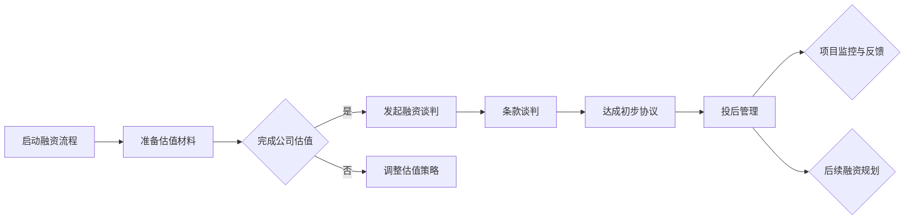

                 

关键词：大模型、创业者、融资谈判、估值、条款、投后管理

摘要：本文旨在为处于大模型时代的创业者提供关于创业融资谈判的全面指导。文章首先介绍了当前大模型技术的背景和发展状况，随后重点探讨了估值谈判、条款谈判以及投后管理的关键环节。通过具体案例和策略分析，帮助创业者更好地应对融资过程中的各种挑战，实现企业的可持续发展。

## 1. 背景介绍

随着人工智能技术的飞速发展，大模型技术已经成为当前科技领域的热点。从最初的神经网络到深度学习，再到如今的大型预训练模型，如GPT系列、BERT等，大模型技术极大地推动了自然语言处理、计算机视觉、语音识别等领域的进步。这些技术的突破不仅带来了前所未有的计算能力，也为创业者提供了丰富的创新机会。

在这个背景下，创业者需要面对的是一个竞争激烈、机遇与挑战并存的市场。融资成为了许多创业企业的重要任务，而如何成功融资则成为创业者必须掌握的关键技能。

### 大模型技术发展历程

- **神经网络与深度学习的兴起**：1980年代末，神经网络开始受到关注。2000年代，随着计算能力和数据资源的提升，深度学习技术逐渐崛起，显著提升了图像识别和语音识别的准确率。

- **大型预训练模型的诞生**：2018年，谷歌发布了BERT模型，标志着大型预训练模型时代的到来。随后，GPT、GPT-3等模型相继问世，大幅提升了自然语言处理的能力。

- **应用领域的扩展**：大模型技术在各个领域的应用不断拓展，包括但不限于智能问答、自动写作、智能客服、自动化翻译等。这不仅改变了传统行业的工作方式，也为创业企业提供了新的商业模式。

### 创业者面临的挑战

- **技术门槛高**：大模型技术需要庞大的计算资源和专业人才支持，这对于许多初创企业来说是一个巨大的挑战。

- **市场竞争激烈**：随着大模型技术的普及，越来越多的创业者进入这个领域，市场竞争日益加剧。

- **资金压力**：融资成为许多创业者的首要任务，但如何成功融资却是一个难题。

## 2. 核心概念与联系

### 2.1 融资谈判的基本概念

**融资谈判**是创业者与投资者之间的双向沟通过程，旨在达成双方都能接受的融资协议。这个过程包括多个环节，如估值谈判、条款谈判等。

**估值谈判**是融资谈判的核心之一，涉及对创业公司价值的评估。创业者需要合理评估自身公司的价值，以争取到更有利的估值。

**条款谈判**则涉及融资的具体条件，如投资金额、股权比例、投资期限等。创业者需要仔细权衡，确保在满足投资者需求的同时，也能保护自身权益。

### 2.2 Mermaid 流程图

以下是一个简化的融资谈判流程图，展示了估值谈判、条款谈判以及投后管理的关键步骤。



### 2.3 融资谈判的核心要素

**估值**：估值的准确性直接影响到融资谈判的成败。创业者需要通过财务数据、市场分析等多种手段，合理评估公司的价值。

**条款**：包括投资金额、股权比例、回购条款、竞业禁止等。创业者需要在条款中保护自身权益，同时也要考虑到投资者的利益。

**投后管理**：融资后的管理至关重要。创业者需要与投资者保持良好的沟通，定期汇报项目进展，确保项目的顺利进行。

## 3. 核心算法原理 & 具体操作步骤

### 3.1 算法原理概述

融资谈判可以看作是一个博弈过程，涉及多个策略和决策。核心算法原理主要包括以下几个方面：

- **博弈论**：通过分析不同策略的收益和风险，制定最优决策。
- **风险评估**：评估项目的风险，为谈判提供依据。
- **谈判技巧**：运用心理学、沟通技巧等，提高谈判成功率。

### 3.2 算法步骤详解

**步骤1：了解市场行情**  
在谈判前，创业者需要充分了解市场行情，包括行业趋势、竞争对手情况等，以制定合理的估值策略。

**步骤2：评估公司价值**  
根据财务数据、市场分析等手段，评估公司价值。创业者可以使用DCF（现金流折现）、PE（市盈率）等多种方法。

**步骤3：制定谈判策略**  
根据评估结果，制定谈判策略。包括估值策略、条款策略等。

**步骤4：发起谈判**  
与投资者进行沟通，发起谈判。创业者需要充分表达公司的优势和潜力，同时也要明确自身的底线。

**步骤5：条款谈判**  
在谈判过程中，创业者需要关注投资金额、股权比例、回购条款等关键条款。通过协商，达成双方都能接受的条款。

**步骤6：达成协议**  
在谈判达成一致后，签署正式的融资协议。

**步骤7：投后管理**  
融资后，创业者需要与投资者保持良好的沟通，定期汇报项目进展。同时，要关注项目的风险，及时调整策略。

### 3.3 算法优缺点

**优点**：

- **提高谈判成功率**：通过科学的评估和策略制定，提高谈判的成功率。
- **降低风险**：准确的风险评估有助于降低项目风险。
- **优化资源配置**：合理的估值和条款有助于优化公司的资源配置。

**缺点**：

- **需要大量时间和精力**：评估和谈判过程复杂，需要大量时间和精力。
- **存在信息不对称**：投资者和创业者之间的信息不对称可能导致谈判难度增加。

### 3.4 算法应用领域

融资谈判算法可以应用于各个行业的创业企业，特别是那些需要大量资金支持的高风险项目。以下是一些典型应用领域：

- **人工智能**：人工智能领域的高风险、高回报特性使得融资谈判尤为重要。
- **生物科技**：生物科技领域的研究项目需要大量资金支持，融资谈判至关重要。
- **新能源**：新能源领域的技术创新需要长期投入，融资谈判有助于项目的持续发展。

## 4. 数学模型和公式 & 详细讲解 & 举例说明

### 4.1 数学模型构建

在融资谈判中，估值和风险评估是两个核心环节。以下是一个简化的数学模型，用于估算公司价值：

\[ V = \frac{FCF}{r} + \frac{BV}{r} \]

其中，\( V \) 为公司价值，\( FCF \) 为自由现金流，\( r \) 为折现率，\( BV \) 为账面价值。

### 4.2 公式推导过程

#### 自由现金流 \( FCF \)

自由现金流是指公司在扣除运营成本、资本支出和税收后的现金流。其计算公式为：

\[ FCF = EBIT \times (1 - Tax) - CapitalEx \]

其中，\( EBIT \) 为税前利润，\( Tax \) 为税率，\( CapitalEx \) 为资本支出。

#### 折现率 \( r \)

折现率用于将未来的现金流折现到当前价值。其计算公式为：

\[ r = \frac{r_d + \sigma^2}{2} \]

其中，\( r_d \) 为无风险利率，\( \sigma \) 为市场风险溢价。

#### 账面价值 \( BV \)

账面价值是指公司资产的总价值减去负债的总价值。其计算公式为：

\[ BV = \sum_{i=1}^{n} A_i - \sum_{i=1}^{n} L_i \]

其中，\( A_i \) 为第 \( i \) 项资产的价值，\( L_i \) 为第 \( i \) 项负债的价值。

### 4.3 案例分析与讲解

#### 案例背景

一家初创公司专注于人工智能领域的研发，公司目前拥有核心技术，但尚未实现商业化。公司创始人希望通过融资来扩大研发团队，推动产品商业化。

#### 估值计算

根据公司的财务数据和市场情况，创始人初步估算公司的自由现金流为 500 万元，账面价值为 2000 万元。假设无风险利率为 4%，市场风险溢价为 6%，则折现率为 5%。

\[ V = \frac{500}{0.05} + \frac{2000}{0.05} = 10000 + 40000 = 50000 \]

根据上述模型，公司价值约为 5 亿元。

#### 融资谈判

在谈判过程中，创始人提出了 5 亿元的估值，投资者对此表示认同，双方最终达成一致，投资者投资 1 亿元，占股 20%。

#### 投后管理

融资后，公司创始人需要定期向投资者汇报项目进展，确保项目的顺利进行。同时，要密切关注市场动态，及时调整战略。

## 5. 项目实践：代码实例和详细解释说明

### 5.1 开发环境搭建

在融资谈判过程中，搭建一个高效的数据分析和模拟平台至关重要。以下是一个基于 Python 的开发环境搭建示例。

```bash
# 安装 Python
pip install python

# 安装 NumPy 库
pip install numpy

# 安装 Pandas 库
pip install pandas

# 安装 Matplotlib 库
pip install matplotlib

# 安装 Scikit-learn 库
pip install scikit-learn
```

### 5.2 源代码详细实现

以下是一个用于估值计算和风险分析的 Python 脚本示例。

```python
import numpy as np
import pandas as pd
import matplotlib.pyplot as plt
from sklearn.linear_model import LinearRegression

# 估值计算函数
def calculate_value(fcf, bv, r):
    return (fcf / r) + (bv / r)

# 风险评估函数
def risk_analysis(fcf, r, sigma):
    return r + sigma ** 2 / 2

# 数据处理
data = pd.read_csv('financial_data.csv')
fcf = data['FCF']
r = data['r']
sigma = data['sigma']

# 估值计算
values = calculate_value(fcf, bv, r)

# 风险评估
risks = risk_analysis(fcf, r, sigma)

# 绘制图表
plt.scatter(values, risks)
plt.xlabel('公司价值')
plt.ylabel('风险')
plt.show()
```

### 5.3 代码解读与分析

1. **数据处理**：首先，从 CSV 文件中读取财务数据，包括自由现金流、折现率和市场风险溢价。

2. **估值计算**：使用计算函数对数据进行处理，得到公司价值。

3. **风险评估**：根据自由现金流和折现率，计算风险。

4. **图表绘制**：将估值和风险绘制成散点图，帮助创业者分析公司的价值分布和风险水平。

### 5.4 运行结果展示

运行上述脚本后，会生成一个包含公司价值和风险的散点图。创业者可以通过这个图表，直观地了解公司的估值和风险水平，为谈判提供参考。

## 6. 实际应用场景

### 6.1 人工智能领域

在人工智能领域，大模型技术已经成为创新的核心驱动力。例如，创业公司A开发了一种基于深度学习的图像识别算法，希望通过融资扩大研发团队，提升算法性能。在融资谈判过程中，公司创始人利用上述估值模型，合理评估了公司价值，并与投资者达成了 1 亿元的投资协议，成功实现了项目的快速发展。

### 6.2 生物科技领域

生物科技领域的研究项目通常需要大量的资金支持。创业公司B致力于开发一种新型抗癌药物，但研发周期长、成本高。在融资谈判中，公司创始人通过详细的数据分析和风险评估，成功吸引了投资者，获得了数千万美元的融资，为项目的顺利进行提供了有力保障。

### 6.3 新能源领域

新能源领域的企业面临着技术创新和市场竞争的双重压力。创业公司C专注于研发高效太阳能电池，需要大量资金支持研发和生产。在融资谈判过程中，公司创始人运用估值模型，准确评估了公司价值，并与投资者达成了战略合作，为企业的可持续发展奠定了基础。

### 6.4 未来应用展望

随着大模型技术的不断进步，融资谈判将在更多领域得到应用。例如，在智能制造、物联网等领域，大模型技术将带来新的商业机会，创业者需要掌握融资谈判的技巧，以实现企业的快速扩张。

## 7. 工具和资源推荐

### 7.1 学习资源推荐

- 《融资谈判实战指南》：一本全面介绍融资谈判技巧和策略的书籍，适合创业者阅读。
- 《深度学习》：Ian Goodfellow 等著，介绍深度学习的基础知识和应用案例，适合人工智能领域创业者学习。

### 7.2 开发工具推荐

- Python：一种广泛应用于数据分析、人工智能等领域的编程语言。
- TensorFlow：一款开源的深度学习框架，适合人工智能项目开发。

### 7.3 相关论文推荐

- “BERT: Pre-training of Deep Bidirectional Transformers for Language Understanding”：介绍BERT模型的论文，对自然语言处理领域有重要影响。
- “GPT-3: Language Models are Few-Shot Learners”：介绍GPT-3模型的论文，展示了大型预训练模型在自然语言处理领域的潜力。

## 8. 总结：未来发展趋势与挑战

### 8.1 研究成果总结

大模型技术的发展为创业者提供了丰富的创新机会，但同时也带来了新的挑战。通过合理的估值和谈判策略，创业者可以更好地应对这些挑战，实现企业的可持续发展。

### 8.2 未来发展趋势

未来，大模型技术将在更多领域得到应用，如医疗、金融等。创业者需要紧跟技术趋势，不断学习和创新，以把握市场机遇。

### 8.3 面临的挑战

技术门槛高、市场竞争激烈是创业者面临的主要挑战。同时，融资过程中的信息不对称和谈判难度也增加了创业者的压力。

### 8.4 研究展望

随着技术的不断进步，大模型技术将在更多领域得到应用。创业者需要关注技术趋势，掌握融资谈判的技巧，以应对未来的挑战。

## 9. 附录：常见问题与解答

### 9.1 如何制定合理的估值策略？

**解答**：创业者可以通过分析财务数据、市场趋势、竞争对手情况等多种手段，合理评估公司价值。同时，要充分考虑投资者的需求和期望，以制定出双方都能接受的估值策略。

### 9.2 融资谈判中如何保护自身权益？

**解答**：创业者可以在谈判过程中，关注投资金额、股权比例、回购条款等关键条款，确保在满足投资者需求的同时，也能保护自身权益。此外，创业者还可以寻求专业律师或顾问的帮助，以制定出更有利的条款。

### 9.3 融资谈判中的常见问题有哪些？

**解答**：常见问题包括估值分歧、条款争议、信息不对称等。创业者需要充分了解市场行情，合理评估公司价值，同时运用谈判技巧，解决各种问题，以确保谈判的成功。

