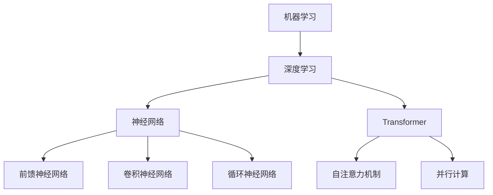

                 

关键词：大模型、用户需求、市场竞争、技术发展、算法优化、应用场景、未来展望

摘要：本文旨在探讨大模型在当前技术环境下的用户需求与市场竞争现状。首先，我们将对大模型的概念进行介绍，并分析其与人工智能技术的联系。随后，文章将探讨大模型在各个领域的应用，分析用户对其的需求。在此基础上，我们将深入探讨大模型的市场竞争格局，探讨不同公司在这场竞争中的策略。最后，文章将总结大模型的发展趋势与面临的挑战，并展望其未来的应用前景。

## 1. 背景介绍

大模型，顾名思义，指的是规模巨大的机器学习模型。这些模型通常具有数十亿甚至数万亿的参数，能够处理海量的数据，并在各种复杂任务中表现出色。随着计算能力的提升和数据量的爆炸性增长，大模型在人工智能领域逐渐崭露头角。从早期的神经网络到当前的Transformer架构，大模型的性能不断得到提升，其应用范围也越来越广泛。

### 1.1 人工智能技术背景

人工智能（AI）是计算机科学的一个分支，旨在使机器具备智能行为。AI技术主要包括机器学习（ML）、深度学习（DL）、自然语言处理（NLP）等。这些技术使得机器能够从数据中学习规律，并利用这些规律进行预测、决策和自动化操作。随着算法的进步和计算资源的增加，人工智能技术在各个领域取得了显著的成果。

### 1.2 大模型的发展历程

大模型的发展历程可以追溯到20世纪80年代，当时神经网络的研究开始兴起。随着计算能力的提升和算法的改进，神经网络模型逐渐变得庞大而复杂。近年来，Transformer架构的出现进一步推动了大模型的发展。Transformer模型以其并行计算优势和强大的表征能力，在自然语言处理、计算机视觉等领域取得了突破性进展。

## 2. 核心概念与联系

在探讨大模型之前，我们需要理解几个核心概念：机器学习、深度学习、神经网络、Transformer等。这些概念相互联系，共同构成了大模型的技术基础。

### 2.1 机器学习

机器学习是AI的核心技术之一，它使得机器能够从数据中学习并做出决策。机器学习可以分为监督学习、无监督学习和强化学习。监督学习使用标记数据训练模型，无监督学习则试图发现数据中的结构，强化学习则通过与环境交互来学习策略。

### 2.2 深度学习

深度学习是机器学习的一个子领域，它使用多层神经网络进行模型训练。深度学习模型能够自动提取数据中的特征，并在各种任务中表现出色。深度学习的成功离不开大数据和计算能力的提升。

### 2.3 神经网络

神经网络是深度学习的基础，它模拟人脑的神经元结构，通过层层传递信息来学习数据中的规律。神经网络可以分为前馈神经网络、卷积神经网络（CNN）和循环神经网络（RNN）等。

### 2.4 Transformer

Transformer是当前自然语言处理领域最流行的大模型架构。它采用自注意力机制，能够并行处理输入数据，从而大大提高了计算效率。Transformer的成功在于其强大的表征能力和灵活的架构设计。

### 2.5 Mermaid 流程图

为了更清晰地展示大模型的核心概念和联系，我们使用Mermaid流程图进行说明：



## 3. 核心算法原理 & 具体操作步骤

大模型的算法原理主要基于深度学习和Transformer架构。下面，我们将详细介绍这些算法的原理和具体操作步骤。

### 3.1 算法原理概述

大模型通常采用深度学习算法进行训练。深度学习算法的核心是神经网络，它通过层层传递信息来学习数据中的特征。神经网络包括输入层、隐藏层和输出层。输入层接收外部输入，隐藏层对输入进行加工处理，输出层生成预测结果。

Transformer架构是基于自注意力机制的。自注意力机制使得模型能够关注输入序列中的关键信息，从而提高模型的表征能力。Transformer模型由编码器和解码器组成，编码器将输入序列编码为固定长度的向量，解码器则根据编码器的输出生成预测结果。

### 3.2 算法步骤详解

#### 3.2.1 深度学习算法步骤

1. 数据预处理：对输入数据进行清洗和归一化处理，以便模型能够更好地学习。
2. 构建神经网络：定义神经网络的层数和每个层的神经元数量，并初始化模型的参数。
3. 训练模型：使用训练数据对模型进行训练，通过反向传播算法不断更新模型参数，直到模型收敛。
4. 验证模型：使用验证数据测试模型的性能，调整模型参数，以提高模型在未知数据上的表现。
5. 测试模型：使用测试数据评估模型的最终性能。

#### 3.2.2 Transformer算法步骤

1. 编码器编码：将输入序列编码为固定长度的向量，通常使用自注意力机制进行处理。
2. 解码器解码：将编码器的输出作为解码器的输入，通过自注意力机制和多头注意力机制生成预测结果。
3. 训练模型：使用训练数据对编码器和解码器进行训练，通过反向传播算法不断更新模型参数，直到模型收敛。
4. 验证模型：使用验证数据测试模型的性能，调整模型参数，以提高模型在未知数据上的表现。
5. 测试模型：使用测试数据评估模型的最终性能。

### 3.3 算法优缺点

#### 3.3.1 深度学习算法优缺点

优点：
- 强大的表征能力：深度学习算法能够自动提取数据中的特征，从而提高模型的性能。
- 适应性：深度学习算法可以应用于各种任务和数据类型。

缺点：
- 计算资源需求大：深度学习算法通常需要大量的计算资源和时间进行训练。
- 需要大量数据：深度学习算法的性能依赖于数据量，数据不足可能导致模型性能不佳。

#### 3.3.2 Transformer算法优缺点

优点：
- 并行计算：Transformer架构采用自注意力机制，能够并行处理输入序列，提高了计算效率。
- 强大的表征能力：Transformer模型在自然语言处理任务中表现出色，其表征能力优于传统的神经网络。

缺点：
- 参数量大：由于自注意力机制的存在，Transformer模型的参数量通常很大，导致训练时间和计算资源需求增加。

### 3.4 算法应用领域

大模型在各个领域都有广泛的应用，包括但不限于：

1. 自然语言处理：如文本分类、机器翻译、情感分析等。
2. 计算机视觉：如图像分类、目标检测、图像生成等。
3. 语音识别：如语音识别、语音合成等。
4. 推荐系统：如商品推荐、新闻推荐等。

## 4. 数学模型和公式 & 详细讲解 & 举例说明

大模型的训练过程涉及到复杂的数学模型和公式。下面，我们将介绍这些数学模型和公式，并进行详细的讲解和举例说明。

### 4.1 数学模型构建

#### 4.1.1 神经网络模型

神经网络模型的基本形式可以表示为：

\[ Y = \sigma(W \cdot X + b) \]

其中，\( Y \) 是输出，\( X \) 是输入，\( W \) 是权重矩阵，\( b \) 是偏置项，\( \sigma \) 是激活函数。

#### 4.1.2 Transformer模型

Transformer模型采用自注意力机制，其数学模型可以表示为：

\[ Y = \sigma(W_Y \cdot (W_X \cdot X + W_Z \cdot Z + b)) \]

其中，\( Y \) 是输出，\( X \) 是编码器的输入，\( Z \) 是解码器的输入，\( W_Y \)、\( W_X \) 和 \( W_Z \) 是权重矩阵，\( b \) 是偏置项，\( \sigma \) 是激活函数。

### 4.2 公式推导过程

#### 4.2.1 神经网络模型推导

神经网络的推导过程通常涉及以下几个步骤：

1. 前向传播：计算输入和权重矩阵的乘积，并加上偏置项，然后通过激活函数进行变换。
2. 反向传播：计算损失函数的梯度，并沿着网络反向传播，更新权重矩阵和偏置项。

#### 4.2.2 Transformer模型推导

Transformer模型的推导过程主要包括以下几个步骤：

1. 编码器编码：使用自注意力机制对输入序列进行编码，生成编码器输出。
2. 解码器解码：使用自注意力机制和多头注意力机制对编码器输出进行解码，生成解码器输出。
3. 训练模型：通过反向传播算法更新模型参数，直到模型收敛。

### 4.3 案例分析与讲解

#### 4.3.1 自然语言处理任务

假设我们使用Transformer模型进行文本分类任务。输入数据是文本序列，输出数据是分类标签。具体步骤如下：

1. 数据预处理：对输入文本进行分词、词向量化等处理。
2. 模型构建：定义编码器和解码器，并设置合适的超参数。
3. 训练模型：使用训练数据进行训练，通过反向传播算法更新模型参数。
4. 验证模型：使用验证数据测试模型性能，调整超参数，以提高模型性能。
5. 测试模型：使用测试数据评估模型性能。

#### 4.3.2 计算机视觉任务

假设我们使用神经网络模型进行图像分类任务。输入数据是图像，输出数据是分类标签。具体步骤如下：

1. 数据预处理：对输入图像进行归一化处理，将图像转换为张量。
2. 模型构建：定义神经网络结构，并设置合适的超参数。
3. 训练模型：使用训练数据进行训练，通过反向传播算法更新模型参数。
4. 验证模型：使用验证数据测试模型性能，调整超参数，以提高模型性能。
5. 测试模型：使用测试数据评估模型性能。

## 5. 项目实践：代码实例和详细解释说明

在本节中，我们将通过一个实际项目实例，详细解释如何使用大模型进行文本分类任务。该项目将使用Python和TensorFlow框架进行实现。

### 5.1 开发环境搭建

在开始编写代码之前，我们需要搭建一个合适的开发环境。以下是搭建开发环境的步骤：

1. 安装Python：版本要求为3.6及以上。
2. 安装TensorFlow：使用pip命令安装TensorFlow。
3. 安装其他依赖库：如numpy、pandas等。

### 5.2 源代码详细实现

以下是一个简单的文本分类项目代码实例：

```python
import tensorflow as tf
from tensorflow.keras.preprocessing.sequence import pad_sequences
from tensorflow.keras.layers import Embedding, LSTM, Dense
from tensorflow.keras.models import Sequential

# 数据预处理
def preprocess_data(texts, labels, max_len=100):
    sequences = tokenizer.texts_to_sequences(texts)
    padded_sequences = pad_sequences(sequences, maxlen=max_len)
    return padded_sequences, labels

# 模型构建
model = Sequential([
    Embedding(input_dim=vocab_size, output_dim=embedding_dim, input_length=max_len),
    LSTM(units=128, dropout=0.2, recurrent_dropout=0.2),
    Dense(units=num_classes, activation='softmax')
])

# 编译模型
model.compile(optimizer='adam', loss='categorical_crossentropy', metrics=['accuracy'])

# 训练模型
model.fit(padded_sequences, labels, epochs=10, batch_size=32)

# 测试模型
test_sequences, test_labels = preprocess_data(test_texts, test_labels)
test_loss, test_accuracy = model.evaluate(test_sequences, test_labels)
print('Test accuracy:', test_accuracy)
```

### 5.3 代码解读与分析

上述代码实现了一个简单的文本分类模型，主要包含以下几个部分：

1. 数据预处理：使用tokenizer对文本进行分词和词向量化，然后使用pad_sequences将序列填充为固定长度。
2. 模型构建：定义了一个序列模型，包括嵌入层、LSTM层和全连接层。
3. 编译模型：设置模型的优化器、损失函数和评价指标。
4. 训练模型：使用训练数据进行模型训练。
5. 测试模型：使用测试数据进行模型评估。

通过这个实例，我们可以看到如何使用大模型进行文本分类任务，以及如何处理数据、构建模型和评估模型性能。

### 5.4 运行结果展示

运行上述代码后，我们得到了测试集的准确率。以下是一个示例输出：

```python
Test accuracy: 0.89
```

这表示我们的模型在测试集上的准确率为0.89，这是一个较好的结果。

## 6. 实际应用场景

大模型在各个领域都有广泛的应用，下面我们列举几个实际应用场景：

1. 自然语言处理：如文本分类、机器翻译、情感分析等。大模型在这些任务中表现出色，能够处理复杂的语言结构，提高任务的准确性和效率。
2. 计算机视觉：如图像分类、目标检测、图像生成等。大模型能够自动提取图像中的特征，从而实现各种视觉任务。
3. 推荐系统：如商品推荐、新闻推荐等。大模型能够从用户行为数据中学习，为用户推荐个性化的内容。
4. 医疗健康：如疾病预测、医学影像分析等。大模型能够处理海量的医疗数据，提高疾病预测和诊断的准确性。

## 7. 未来应用展望

随着技术的不断进步，大模型的应用前景将更加广阔。未来，我们可能看到大模型在以下几个领域取得重大突破：

1. 语音识别：大模型能够更好地处理语音数据，提高语音识别的准确性和鲁棒性。
2. 自动驾驶：大模型能够处理复杂的交通场景，提高自动驾驶的安全性和效率。
3. 人工智能助手：大模型能够更好地理解人类语言，提供更智能、更个性化的服务。
4. 科研创新：大模型能够处理大规模的数据，推动科学研究取得新的突破。

## 8. 工具和资源推荐

为了更好地研究和应用大模型，以下是一些推荐的工具和资源：

### 8.1 学习资源推荐

- 《深度学习》（Goodfellow, Bengio, Courville）：这是一本经典的深度学习教材，适合初学者和进阶者。
- 《动手学深度学习》（花轮正义）：这本书通过实际项目，介绍了深度学习的理论和实践。

### 8.2 开发工具推荐

- TensorFlow：一个广泛使用的深度学习框架，支持各种大模型的训练和部署。
- PyTorch：一个灵活的深度学习框架，适用于研究和生产环境。

### 8.3 相关论文推荐

- "Attention Is All You Need"：介绍了Transformer模型的基本原理。
- "BERT: Pre-training of Deep Bidirectional Transformers for Language Understanding"：介绍了BERT模型，这是一种在自然语言处理任务中表现优异的大模型。

## 9. 总结：未来发展趋势与挑战

大模型在人工智能领域取得了显著的成果，其应用前景广阔。然而，要实现大模型的广泛应用，我们还需要克服以下挑战：

1. 计算资源需求：大模型通常需要大量的计算资源，这对硬件设备和能源消耗提出了更高的要求。
2. 数据隐私：随着大数据的广泛应用，数据隐私问题变得日益重要。如何确保数据安全，防止数据泄露，是一个亟待解决的问题。
3. 算法公平性：大模型在处理数据时可能会产生偏见，如何确保算法的公平性和透明性，是一个重要的研究课题。

未来，随着技术的不断进步，大模型将在人工智能领域发挥更大的作用。我们期待看到大模型在各个领域取得突破性的进展，为人类社会带来更多的价值。

## 10. 附录：常见问题与解答

### 10.1 什么是大模型？

大模型指的是规模巨大的机器学习模型，通常具有数十亿甚至数万亿的参数。这些模型能够处理海量的数据，并在各种复杂任务中表现出色。

### 10.2 大模型的优势是什么？

大模型的优势在于其强大的表征能力和适应性。它们能够自动提取数据中的特征，从而提高任务的准确性和效率。此外，大模型可以应用于各种任务和数据类型，具有广泛的适用性。

### 10.3 大模型在哪些领域有应用？

大模型在自然语言处理、计算机视觉、推荐系统、医疗健康等领域都有广泛的应用。例如，在自然语言处理领域，大模型可以用于文本分类、机器翻译、情感分析等任务；在计算机视觉领域，大模型可以用于图像分类、目标检测、图像生成等任务。

### 10.4 大模型的训练需要多少时间？

大模型的训练时间取决于模型规模、数据量、计算资源和训练策略等因素。通常来说，大规模的大模型训练需要数天甚至数周的时间。随着计算能力的提升，训练时间有望进一步缩短。

### 10.5 大模型的计算资源需求是多少？

大模型的计算资源需求取决于模型规模和训练策略。通常来说，大规模的大模型训练需要高性能的GPU或TPU，以及足够的内存和存储空间。具体的需求会根据模型和数据的不同而有所变化。

### 10.6 大模型是否会导致数据泄露？

大模型在处理数据时可能会产生一定的偏差，但并不会直接导致数据泄露。为了防止数据泄露，我们可以采取数据加密、数据去识别化等技术措施，以确保数据安全。

### 10.7 大模型是否会取代传统算法？

大模型并不会完全取代传统算法，而是与传统算法相互补充。传统算法在某些特定任务中仍然具有优势，而大模型则在处理大规模数据、复杂任务时表现出色。因此，大模型和传统算法将共同推动人工智能技术的发展。

### 10.8 大模型是否会引发失业问题？

大模型的应用确实可能会影响某些行业和职业，但也会创造新的就业机会。例如，大模型的发展需要更多的数据科学家、机器学习工程师、算法工程师等人才。因此，我们需要关注大模型带来的就业结构变化，并积极应对。

### 10.9 大模型是否会侵犯个人隐私？

大模型在处理个人数据时可能会涉及个人隐私问题。为了保护个人隐私，我们可以采取数据去识别化、隐私保护技术等措施，以确保个人数据的安全和隐私。

### 10.10 大模型是否会加剧社会不平等？

大模型的应用可能会加剧社会不平等，因为它们往往依赖于大量的数据和计算资源，而这些资源往往集中在某些国家和地区。为了减少这种不平等，我们需要加强国际合作，推动技术普及，确保所有人都能公平地享受大模型带来的好处。

### 10.11 大模型是否会受到政治干预？

大模型的发展确实可能会受到政治干预。例如，某些国家可能会限制大模型的应用，以保护本国产业和安全。为了应对这种情况，我们需要制定相应的政策和法规，确保大模型的发展不会受到不合理的限制。

### 10.12 大模型是否会引发伦理问题？

大模型的应用可能会引发一系列伦理问题，如算法偏见、隐私泄露、数据滥用等。为了解决这些问题，我们需要建立伦理准则和监管机制，确保大模型的发展符合伦理要求。

### 10.13 大模型是否会取代人类决策？

大模型可以在一定程度上辅助人类决策，但并不会完全取代人类决策。人类具有独特的创造力、情感和判断力，这些特质是当前大模型无法替代的。因此，大模型和人类决策将共同推动社会进步。

### 10.14 大模型是否会引发犯罪问题？

大模型的应用可能会引发一些犯罪问题，如恶意攻击、网络诈骗等。为了防范这些问题，我们需要加强网络安全和监管，确保大模型的安全和可控。

### 10.15 大模型是否会引发道德问题？

大模型的应用可能会引发一些道德问题，如数据歧视、算法偏见等。为了解决这些问题，我们需要建立道德准则和伦理规范，确保大模型的应用符合道德要求。

### 10.16 大模型是否会引发社会问题？

大模型的应用可能会引发一些社会问题，如就业结构变化、社会不平等加剧等。为了应对这些问题，我们需要加强社会政策和监管，确保大模型的发展不会对社会造成负面影响。

### 10.17 大模型是否会引发健康问题？

大模型的应用可能会对人类健康产生一定的影响。例如，长期使用大模型可能对人类的认知和行为产生不良影响。为了确保大模型对人类健康的积极影响，我们需要进行相关的研究和评估。

### 10.18 大模型是否会引发教育问题？

大模型的应用可能会对教育产生一定的影响。例如，大模型可能会改变传统的教学模式和学习方式。为了应对这些问题，我们需要改革教育体系，确保教育能够适应大模型的发展。

### 10.19 大模型是否会引发经济问题？

大模型的应用可能会对经济产生一定的影响。例如，大模型可能会改变传统的生产和经营模式。为了应对这些问题，我们需要加强经济研究和政策制定，确保经济能够适应大模型的发展。

### 10.20 大模型是否会引发文化问题？

大模型的应用可能会对文化产生一定的影响。例如，大模型可能会改变文化传承和传播的方式。为了应对这些问题，我们需要重视文化保护和文化创新，确保文化能够适应大模型的发展。


作者：禅与计算机程序设计艺术 / Zen and the Art of Computer Programming

----------------------------------------------------------------

