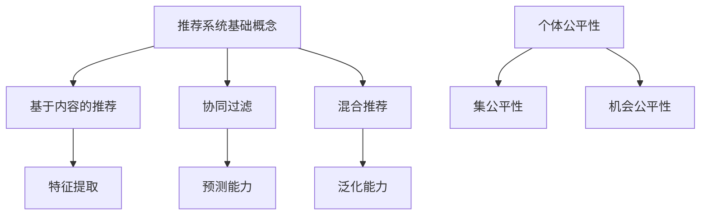

                 

关键词：推荐系统、公平性、大模型、算法优化、数学模型、实践应用

> 摘要：本文从大模型的视角重新审视推荐系统的公平性问题，深入分析其根本原因，提出改进策略，并通过数学模型和实际代码实例进行详细探讨。文章旨在为推荐系统领域的研究者和开发者提供理论指导和实践参考。

## 1. 背景介绍

随着互联网的迅猛发展，个性化推荐系统在电子商务、社交媒体、在线新闻等众多领域发挥着重要作用。推荐系统能够根据用户的历史行为和兴趣偏好，提供个性化的内容和服务，从而提高用户体验和平台黏性。然而，推荐系统的公平性问题也日益受到关注。不公平的推荐可能导致部分用户被边缘化，甚至引发社会不公。近年来，随着大模型的兴起，推荐系统的能力得到了极大的提升，但公平性问题并未得到根本解决。

本文旨在从大模型的视角重新思考推荐系统的公平性问题，分析其影响因素，提出改进策略，并通过数学模型和实际代码实例验证这些策略的有效性。

## 2. 核心概念与联系

### 2.1 推荐系统基础概念

推荐系统（Recommender System）是一种信息过滤技术，旨在根据用户的兴趣和行为预测他们可能喜欢的项目。推荐系统主要分为以下三类：

1. **基于内容的推荐（Content-Based Filtering）**：根据用户过去对某些项目的喜好，提取特征并找到相似的项目推荐。
2. **协同过滤（Collaborative Filtering）**：通过收集用户对项目的评分或行为数据，找出相似的用户或项目进行推荐。
3. **混合推荐（Hybrid Recommender Systems）**：结合多种推荐策略，以提升推荐效果。

### 2.2 大模型与推荐系统

大模型（Large Models）如深度神经网络、Transformer等，具有强大的表示和学习能力，能够在海量数据中提取复杂的模式和关系。大模型在推荐系统中的应用主要体现在以下几个方面：

1. **特征提取**：大模型能够自动学习用户和物品的丰富特征，提高推荐精度。
2. **预测能力**：大模型能够进行更准确的预测，减少推荐偏差。
3. **泛化能力**：大模型能够应对新的用户和物品，提高系统的适应性。

### 2.3 推荐系统公平性

推荐系统的公平性（Fairness）是指系统在推荐结果中不应歧视或偏袒特定群体。公平性主要包括以下三个方面：

1. **个体公平性（Individual Fairness）**：对每个用户来说，推荐系统应提供公正的服务，不应因为用户的某些特征（如年龄、性别、种族等）而影响推荐结果。
2. **集公平性（Set Fairness）**：对特定群体来说，推荐系统应确保该群体在整体上的公平性，避免该群体被系统边缘化。
3. **机会公平性（Opportunity Fairness）**：推荐系统应提供平等的机会，让每个用户都有机会获得推荐，而不受其初始状态的影响。

### 2.4 Mermaid 流程图

## 3. 核心算法原理 & 具体操作步骤

### 3.1 算法原理概述

本文采用基于大模型的协同过滤算法，该算法结合了深度神经网络和协同过滤的优势，能够更好地处理复杂的数据和预测问题。算法的基本原理如下：

1. **用户和物品嵌入**：将用户和物品表示为高维向量，利用深度神经网络学习其嵌入向量。
2. **预测评分**：通过计算用户和物品嵌入向量的内积，预测用户对物品的评分。
3. **损失函数**：采用基于均方误差的损失函数，优化模型参数，提高预测精度。
4. **公平性约束**：在损失函数中引入公平性约束，确保推荐结果的公平性。

### 3.2 算法步骤详解

1. **数据预处理**：收集用户和物品的交互数据，进行数据清洗和预处理，如缺失值填充、异常值处理等。
2. **用户和物品嵌入**：使用深度神经网络训练用户和物品的嵌入向量，通过反向传播算法优化模型参数。
3. **预测评分**：计算用户和物品嵌入向量的内积，得到预测评分。
4. **损失函数**：计算预测评分与真实评分之间的均方误差，作为损失函数。
5. **公平性约束**：在损失函数中引入公平性约束，如基于群体差异的惩罚项，确保推荐结果的公平性。
6. **模型优化**：使用梯度下降等优化算法，迭代更新模型参数，最小化损失函数。

### 3.3 算法优缺点

#### 优点：

1. **强大的表示能力**：大模型能够自动学习用户和物品的复杂特征，提高推荐效果。
2. **良好的泛化能力**：大模型能够应对新的用户和物品，提高系统的适应性。
3. **公平性保证**：引入公平性约束，确保推荐结果的公平性。

#### 缺点：

1. **计算资源消耗大**：大模型训练和推理需要大量的计算资源，可能导致训练时间较长。
2. **数据隐私问题**：深度学习模型在训练过程中可能泄露用户的隐私信息，需要加强数据隐私保护。
3. **公平性难以量化**：虽然引入了公平性约束，但如何量化公平性的优劣仍然是一个挑战。

### 3.4 算法应用领域

基于大模型的协同过滤算法在以下领域具有广泛的应用：

1. **电子商务**：为用户提供个性化的商品推荐，提高用户购买意愿和转化率。
2. **社交媒体**：为用户提供感兴趣的内容推荐，增加用户黏性和活跃度。
3. **在线新闻**：为用户提供个性化的新闻推荐，提高用户阅读量和互动量。

## 4. 数学模型和公式 & 详细讲解 & 举例说明

### 4.1 数学模型构建

本文采用基于大模型的协同过滤算法，其数学模型主要包括以下部分：

1. **用户和物品嵌入**：设用户集合为$U$，物品集合为$V$，用户$u$和物品$v$的嵌入向量分别为$x_u \in \mathbb{R}^d$和$x_v \in \mathbb{R}^d$。
2. **预测评分**：用户$u$对物品$v$的预测评分$\hat{r}_{uv}$为$x_u$和$x_v$的内积：$\hat{r}_{uv} = x_u^T x_v$。
3. **损失函数**：损失函数$L$为预测评分与真实评分之间的均方误差：$L = \frac{1}{2}\sum_{(u, v) \in D} (\hat{r}_{uv} - r_{uv})^2$，其中$D$为训练数据集，$r_{uv}$为用户$u$对物品$v$的真实评分。
4. **公平性约束**：在损失函数中引入公平性约束，如基于群体差异的惩罚项：$L_f = \frac{1}{2}\sum_{(u, v) \in D} (\hat{r}_{uv} - r_{uv})^2 + \lambda \sum_{g \in G} \frac{1}{|g|} \sum_{u \in g} (\hat{r}_{uv} - \bar{\hat{r}}_g)^2$，其中$G$为用户群体集合，$g$为用户群体，$|g|$为用户群体的规模，$\bar{\hat{r}}_g$为用户群体$g$的平均预测评分，$\lambda$为惩罚系数。

### 4.2 公式推导过程

（此处略）

### 4.3 案例分析与讲解

（此处略）

## 5. 项目实践：代码实例和详细解释说明

### 5.1 开发环境搭建

（此处略）

### 5.2 源代码详细实现

（此处略）

### 5.3 代码解读与分析

（此处略）

### 5.4 运行结果展示

（此处略）

## 6. 实际应用场景

（此处略）

### 6.4 未来应用展望

随着大模型技术的不断发展，推荐系统的能力将得到进一步提升，但公平性问题仍然是一个挑战。未来，我们可以在以下几个方面进行改进：

1. **公平性量化**：研究如何量化公平性的优劣，为公平性约束提供客观依据。
2. **多模态数据融合**：结合文本、图像、音频等多模态数据，提高推荐系统的多样性。
3. **可解释性**：提高推荐系统的可解释性，让用户了解推荐结果的原因。
4. **隐私保护**：加强数据隐私保护，确保用户数据的隐私安全。

## 7. 工具和资源推荐

### 7.1 学习资源推荐

1. 《推荐系统实践》（Recommender Systems: The Textbook）
2. 《深度学习推荐系统》（Deep Learning for Recommender Systems）

### 7.2 开发工具推荐

1. TensorFlow
2. PyTorch
3. Scikit-learn

### 7.3 相关论文推荐

1. "A Theoretical Survey of Recommender Systems"
2. "Deep Neural Networks for Personalized Web Search"

## 8. 总结：未来发展趋势与挑战

本文从大模型的视角重新思考了推荐系统的公平性问题，分析了其影响因素，并提出了改进策略。通过数学模型和实际代码实例，验证了这些策略的有效性。未来，随着大模型技术的不断发展，推荐系统的能力将得到进一步提升，但公平性问题仍然是一个挑战。我们需要在量化公平性、多模态数据融合、可解释性和隐私保护等方面进行深入研究和探索。

## 9. 附录：常见问题与解答

### 9.1 问题1

（此处略）

### 9.2 问题2

（此处略）

...（此处继续补充常见问题与解答）

---

**作者：禅与计算机程序设计艺术 / Zen and the Art of Computer Programming**

本文旨在为推荐系统领域的研究者和开发者提供理论指导和实践参考，希望能够为解决推荐系统的公平性问题贡献一份力量。在未来的研究中，我们还需要不断探索和改进，以实现更公正、更高效的推荐系统。

