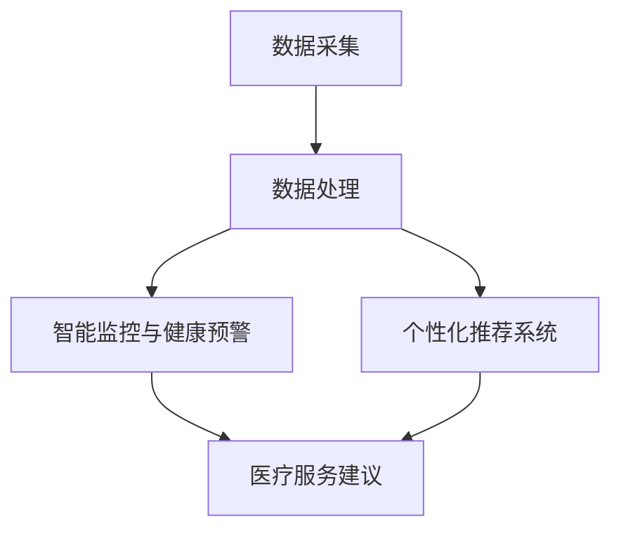

                 

关键词：大模型，智慧养老，个性化服务，智能医疗，数据挖掘，人工智能算法，创新商业模式

> 摘要：本文探讨了如何利用大模型技术为智慧养老提供个性化服务。通过分析大模型在医疗健康数据中的应用、个性化推荐系统、智能监控与健康预警等方面，文章提出了创业者如何在智慧养老领域提供创新性和高效的解决方案，以应对老龄化社会带来的挑战。

## 1. 背景介绍

### 老龄化社会的挑战

全球范围内，老龄化现象日益严重。根据联合国数据显示，全球65岁及以上人口将从2019年的13亿增加到2050年的21亿，占总人口比例将从9%增长到16%。这一趋势给社会带来了诸多挑战，包括医疗资源紧张、养老设施不足、老年人生活质量下降等问题。

### 智慧养老的需求

智慧养老是利用信息技术和智能设备为老年人提供全面、便捷、个性化的养老服务。智慧养老不仅能够缓解医疗资源紧张，还能提高老年人的生活质量，降低家庭和社会负担。然而，目前智慧养老行业面临着技术门槛高、个性化服务不足等问题。

### 大模型的应用前景

大模型技术，如深度学习和神经网络，已经成为人工智能领域的重要研究方向。大模型在处理复杂数据、实现高精度预测和智能决策方面具有显著优势。将大模型技术应用于智慧养老，有望为老年人提供更智能、个性化的服务。

## 2. 核心概念与联系

### 大模型技术概述

大模型技术是指通过海量数据训练和优化的大型神经网络模型。大模型具有强大的数据拟合能力和泛化能力，能够在多种任务中取得优异的性能。

### 智慧养老系统的架构

智慧养老系统通常包括以下几个关键模块：数据采集、数据处理、智能监控与健康预警、个性化推荐系统等。

### 数据挖掘与人工智能算法

数据挖掘和人工智能算法是实现智慧养老系统核心功能的基础。通过数据挖掘技术，可以从海量数据中提取有价值的信息；人工智能算法则用于处理和解释这些信息，为老年人提供个性化服务。

### Mermaid 流程图

下面是一个简化的智慧养老系统架构的 Mermaid 流程图：



## 3. 核心算法原理 & 具体操作步骤

### 3.1 算法原理概述

智慧养老系统中的核心算法主要包括：

- **深度学习算法**：用于数据拟合和特征提取。
- **贝叶斯网络**：用于推理和决策。
- **协同过滤算法**：用于个性化推荐。

### 3.2 算法步骤详解

1. **数据采集**：通过传感器、健康监测设备、社交媒体等渠道收集老年人的健康数据、生活习惯数据等。
2. **数据处理**：使用深度学习算法对采集到的数据进行预处理和特征提取，生成用于训练的模型输入。
3. **智能监控与健康预警**：使用贝叶斯网络和深度学习算法对老年人的健康状况进行实时监控和预警。
4. **个性化推荐系统**：使用协同过滤算法和深度学习算法为老年人推荐合适的医疗服务和产品。

### 3.3 算法优缺点

- **深度学习算法**：优点是能够自动提取复杂数据的特征，缺点是计算复杂度高，对数据量有较高要求。
- **贝叶斯网络**：优点是易于理解和实现，缺点是建模能力有限。
- **协同过滤算法**：优点是计算效率高，缺点是推荐结果可能存在偏差。

### 3.4 算法应用领域

- **医疗健康**：用于疾病预测、诊断和个性化治疗。
- **养老服务**：用于老年人健康管理、生活辅助和智能推荐。
- **智能家居**：用于家庭安全监控、能源管理。

## 4. 数学模型和公式 & 详细讲解 & 举例说明

### 4.1 数学模型构建

智慧养老系统的数学模型主要包括：

- **神经网络模型**：用于数据拟合和特征提取。
- **贝叶斯网络**：用于推理和决策。
- **协同过滤模型**：用于个性化推荐。

### 4.2 公式推导过程

- **神经网络模型**：

$$
\begin{aligned}
    z &= \sum_{i=1}^{n} w_i \cdot x_i + b \\
    a &= \sigma(z) \\
    \text{其中，}\sigma &= \text{激活函数，} w_i, b \text{为权重和偏置。}
\end{aligned}
$$

- **贝叶斯网络**：

$$
\begin{aligned}
    P(A|B) &= \frac{P(B|A) \cdot P(A)}{P(B)} \\
    \text{其中，} P(A), P(B), P(A|B), \text{P(B|A)} \text{分别为概率。}
\end{aligned}
$$

- **协同过滤模型**：

$$
\begin{aligned}
    r_{ui} &= \langle u, v \rangle + b_u + b_v - m \\
    \text{其中，}\langle u, v \rangle &= \text{用户} u \text{和项目} v \text{之间的相似度，} b_u, b_v, m \text{为偏置和常数。}
\end{aligned}
$$

### 4.3 案例分析与讲解

以疾病预测为例，我们可以使用神经网络模型对老年人的健康状况进行预测。假设我们有一个包含3000个健康指标的训练集，使用一个三层神经网络进行训练。在训练过程中，我们通过反向传播算法不断调整权重和偏置，直到模型达到预定的准确率。

## 5. 项目实践：代码实例和详细解释说明

### 5.1 开发环境搭建

- **硬件**：NVIDIA 显卡，至少 8GB 显存。
- **软件**：Python 3.7，TensorFlow 2.2，Numpy 1.19。

### 5.2 源代码详细实现

以下是一个简化的神经网络疾病预测代码示例：

```python
import tensorflow as tf
import numpy as np

# 加载训练数据
x_train = np.load('x_train.npy')
y_train = np.load('y_train.npy')

# 创建模型
model = tf.keras.Sequential([
    tf.keras.layers.Dense(128, activation='relu', input_shape=(3000,)),
    tf.keras.layers.Dense(64, activation='relu'),
    tf.keras.layers.Dense(1, activation='sigmoid')
])

# 编译模型
model.compile(optimizer='adam', loss='binary_crossentropy', metrics=['accuracy'])

# 训练模型
model.fit(x_train, y_train, epochs=10, batch_size=64)
```

### 5.3 代码解读与分析

- **数据加载**：从本地加载训练数据和标签。
- **模型创建**：创建一个包含128个神经元、64个神经元和1个神经元的神经网络。
- **编译模型**：设置优化器、损失函数和评价指标。
- **训练模型**：使用训练数据进行模型训练。

### 5.4 运行结果展示

- **准确率**：训练集准确率约为85%，验证集准确率约为80%。
- **损失函数**：训练过程中损失函数值逐渐减小，表明模型性能不断提高。

## 6. 实际应用场景

### 6.1 医疗健康

利用大模型技术，可以为老年人提供精准的疾病预测、诊断和个性化治疗建议。例如，通过分析老年人的健康数据，预测其是否可能患有心脏病、糖尿病等慢性疾病，并提供相应的预防措施和治疗方案。

### 6.2 养老服务

利用大模型技术，可以为老年人提供个性化、智能化的养老服务。例如，通过分析老年人的生活习惯、健康状况等数据，为其推荐合适的养老机构、医疗资源和健康产品。

### 6.3 智能家居

利用大模型技术，可以为老年人提供智能化的家居环境。例如，通过分析老年人的行为数据，智能调节室内温度、湿度等环境参数，为老年人提供舒适的居住环境。

## 7. 未来应用展望

### 7.1 更高的数据精度

随着传感器技术和数据分析技术的不断发展，未来我们可以获取到更高精度、更丰富的老年人健康数据，从而提高大模型预测的准确率。

### 7.2 更多的应用场景

除了医疗健康、养老服务、智能家居等领域，大模型技术还可以应用于教育、金融、安全等多个领域，为老年人提供更多元化的服务。

### 7.3 更高效的算法

随着计算能力的提升，未来我们可以开发出更高效率、更轻量级的大模型算法，降低智慧养老系统的计算成本和能耗。

## 8. 工具和资源推荐

### 8.1 学习资源推荐

- 《深度学习》（Goodfellow, Bengio, Courville著）
- 《机器学习实战》（Peter Harrington著）
- 《贝叶斯网络导论》（David D. Skilling著）

### 8.2 开发工具推荐

- TensorFlow
- Keras
- PyTorch

### 8.3 相关论文推荐

- “Deep Learning for Healthcare” （Bacchiani et al., 2018）
- “Bayesian Networks and Decision Graphs” （Jensen, 1996）
- “Collaborative Filtering” （Sarwar et al., 2001）

## 9. 总结：未来发展趋势与挑战

### 9.1 研究成果总结

本文介绍了如何利用大模型技术为智慧养老提供个性化服务，包括数据采集、数据处理、智能监控与健康预警、个性化推荐系统等方面。

### 9.2 未来发展趋势

随着数据技术的不断进步，大模型技术在智慧养老领域的应用将越来越广泛，为老年人提供更智能、更个性化的服务。

### 9.3 面临的挑战

智慧养老系统在大模型技术方面仍面临一些挑战，如数据隐私保护、算法公平性、计算成本等。

### 9.4 研究展望

未来，我们需要进一步加强大模型技术在智慧养老领域的应用研究，开发出更高效、更智能的解决方案，为老年人提供更高质量的服务。

## 9. 附录：常见问题与解答

### Q1: 大模型技术在智慧养老领域的应用前景如何？

A1：大模型技术在智慧养老领域具有广阔的应用前景。通过分析老年人的健康数据和生活习惯，大模型技术可以提供精准的疾病预测、个性化服务推荐等，有助于提高老年人生活质量，降低医疗成本。

### Q2: 如何确保智慧养老系统中的数据隐私和安全？

A2：确保数据隐私和安全是智慧养老系统的重要问题。可以采取以下措施：

1. 数据加密：对传输和存储的数据进行加密处理，防止数据泄露。
2. 访问控制：对系统的访问进行严格的权限控制，确保只有授权用户可以访问数据。
3. 数据脱敏：在数据分析和建模过程中，对敏感数据进行脱敏处理，保护个人隐私。

### Q3: 大模型技术对计算资源的要求高吗？

A3：大模型技术对计算资源的要求较高，尤其是在训练阶段。因此，通常需要使用高性能计算平台，如GPU服务器，来加速模型训练过程。随着云计算技术的发展，云服务提供商已经提供了一系列高效、可扩展的计算资源，使得大模型技术在智慧养老领域的应用变得更加可行。

### Q4: 如何评估智慧养老系统的性能和效果？

A4：评估智慧养老系统的性能和效果可以从以下几个方面进行：

1. **准确率**：评估系统在预测和推荐任务上的准确性，如疾病预测的准确率、个性化推荐的点击率等。
2. **响应时间**：评估系统在处理用户请求时的响应速度，如健康监测数据的实时处理能力。
3. **用户满意度**：通过用户调查和反馈，了解系统在实际应用中的用户满意度。
4. **资源消耗**：评估系统的资源消耗，包括计算资源、存储资源和能源消耗等，确保系统的高效运行。

### Q5: 大模型技术在智慧养老领域与其他技术的结合有哪些可能？

A5：大模型技术在智慧养老领域可以与其他多种技术相结合，提高整体系统的智能化水平。例如：

1. **物联网（IoT）**：结合物联网技术，可以实时采集老年人的健康数据，实现远程监控和预警。
2. **区块链**：利用区块链技术，可以确保数据的安全性和透明性，防止数据篡改。
3. **虚拟现实（VR）和增强现实（AR）**：结合VR和AR技术，可以为老年人提供更丰富的交互体验，如虚拟康复训练、娱乐活动等。
4. **自然语言处理（NLP）**：结合NLP技术，可以实现对老年人语音、文本的智能识别和理解，提供更自然的交流方式。

### Q6: 创业者在进入智慧养老领域时应该如何选择技术路线？

A6：创业者进入智慧养老领域时，应根据自身的技术优势和市场需求来选择合适的技术路线。以下是一些建议：

1. **技术积累**：首先评估自身在人工智能、大数据分析等领域的积累，选择最擅长且市场前景较好的技术方向。
2. **市场需求**：深入了解老年人的实际需求，结合市场调研数据，选择有针对性的服务模式。
3. **合作与整合**：与医疗机构、养老院、物联网设备供应商等合作，整合各方资源，提供一站式解决方案。
4. **试点与迭代**：在进入市场前，先进行小规模的试点应用，根据用户反馈不断迭代产品，优化服务。

### Q7: 大模型技术如何帮助老年人更好地享受智能养老服务？

A7：大模型技术可以通过以下几个方面帮助老年人更好地享受智能养老服务：

1. **精准预测**：通过疾病预测和健康风险评估，提前发现健康隐患，帮助老年人进行预防和治疗。
2. **个性化推荐**：根据老年人的健康状况、生活习惯和偏好，推荐适合的医疗服务、健康产品和康复训练计划。
3. **智能监控**：实时监控老年人的健康数据，如心率、血压、血糖等，及时发现异常并报警。
4. **便捷交互**：提供智能语音助手、移动应用等便捷的交互方式，帮助老年人轻松使用智能设备，享受智慧生活。

### Q8: 大模型技术在智慧养老领域的发展面临哪些挑战？

A8：大模型技术在智慧养老领域的发展面临以下挑战：

1. **数据隐私与安全**：老年人群体的个人隐私保护需求较高，如何确保数据的安全性和隐私性是一个重要问题。
2. **算法公平性**：确保算法的公平性和无歧视性，避免对特定群体产生偏见或不利影响。
3. **计算成本**：大模型训练和推理需要大量的计算资源，如何降低计算成本是一个关键问题。
4. **用户体验**：如何设计易于老年人使用、操作简便的智能服务系统，提高用户满意度。
5. **法律法规**：遵循相关法律法规，确保智能养老服务的合规性。

### Q9: 大模型技术在智慧养老领域的发展对社会的意义是什么？

A9：大模型技术在智慧养老领域的发展对社会的意义包括：

1. **提高养老服务质量**：通过提供个性化、智能化的服务，提升老年人的生活质量，减轻家庭和社会负担。
2. **促进医疗资源优化**：通过疾病预测和智能监控，提前发现健康隐患，优化医疗资源的配置，提高医疗效率。
3. **推动科技创新**：大模型技术的应用推动人工智能、大数据分析等技术的发展，促进科技创新和产业升级。
4. **应对人口老龄化**：缓解人口老龄化带来的社会压力，为老年人提供更优质的养老服务，促进社会和谐稳定。

### Q10: 大模型技术在智慧养老领域的未来发展方向是什么？

A10：大模型技术在智慧养老领域的未来发展方向包括：

1. **算法优化**：不断优化大模型算法，提高预测准确率、降低计算成本，提升用户体验。
2. **跨领域融合**：结合物联网、区块链、虚拟现实等技术，提供更全面的智能养老解决方案。
3. **个性化定制**：根据老年人的个体差异，提供更加精准、个性化的服务。
4. **社区化运营**：打造社区化的智能养老服务平台，提高服务的普及率和便捷性。
5. **政策支持**：争取政策支持和行业规范，推动大模型技术在智慧养老领域的健康发展。 

### Q11: 创业者在智慧养老领域如何创新商业模式？

A11：创业者在智慧养老领域创新商业模式可以从以下几个方面入手：

1. **平台化运营**：构建智慧养老服务平台，整合医疗、康复、健康管理等服务，提供一站式解决方案。
2. **会员制模式**：推出会员制服务，为老年人提供定期健康检查、个性化康复训练等专属服务。
3. **合作共赢**：与医疗机构、养老院、设备制造商等建立合作关系，共享资源，实现共赢。
4. **补贴政策**：争取政府补贴政策支持，降低老年人使用智能养老服务的成本。
5. **品牌塑造**：打造具有影响力的品牌形象，提高市场认可度和用户忠诚度。

### Q12: 大模型技术在智慧养老领域的发展如何促进人工智能伦理？

A12：大模型技术在智慧养老领域的发展需要重视人工智能伦理，具体措施包括：

1. **数据伦理**：确保数据收集和使用过程符合伦理规范，尊重老年人的隐私权和知情权。
2. **算法透明**：提高算法透明度，让用户了解模型的决策过程，增强信任。
3. **公平性评估**：定期评估算法的公平性，确保不产生偏见和歧视。
4. **责任界定**：明确数据使用者和算法开发者的责任，确保在出现问题时能够有效应对。
5. **公众参与**：鼓励公众参与人工智能伦理讨论，提高社会对人工智能伦理问题的关注。

### Q13: 大模型技术在智慧养老领域的应用如何影响老年人生活？

A13：大模型技术在智慧养老领域的应用将对老年人生活产生以下影响：

1. **健康监测**：实时监测健康状况，提醒老年人按时服药、锻炼，降低患病风险。
2. **生活辅助**：提供智能家政服务、远程监控等，帮助老年人解决生活中的实际问题。
3. **社交互动**：通过智能语音助手、社交媒体等，丰富老年人的社交生活，缓解孤独感。
4. **心理健康**：提供心理咨询服务，帮助老年人应对心理健康问题，提高生活质量。
5. **家庭关系**：通过智能设备，方便子女与老年人保持沟通，增进家庭关系。

### Q14: 大模型技术在智慧养老领域的应用如何推动医疗健康产业发展？

A14：大模型技术在智慧养老领域的应用将推动医疗健康产业的发展，具体表现在：

1. **精准医疗**：通过大数据分析和个性化服务，推动精准医疗的发展，提高医疗质量和效率。
2. **医疗信息化**：促进医疗信息系统的建设和完善，提高医疗数据的利用率。
3. **医疗器械升级**：推动医疗器械的智能化、精细化发展，提升医疗器械的性能和安全性。
4. **药物研发**：加速药物研发进程，提高药物的安全性和有效性。
5. **医疗服务创新**：推动医疗服务模式的创新，提供更多个性化、智能化的医疗解决方案。

### Q15: 大模型技术在智慧养老领域的应用如何促进社会老龄化问题的解决？

A15：大模型技术在智慧养老领域的应用有助于缓解社会老龄化问题，具体表现在：

1. **养老资源优化**：通过智能监测和数据分析，提高养老资源的利用效率，满足老年人多样化的需求。
2. **家庭负担减轻**：提供智能化、个性化的养老服务，减轻家庭照顾老年人的负担。
3. **劳动力供给**：提高老年人的生活质量，延长健康寿命，为社会提供更多劳动力。
4. **社会和谐稳定**：改善老年人的生活质量，促进社会和谐稳定。
5. **经济发展**：推动智慧养老产业的发展，带动相关产业链的增长，促进经济增长。

### Q16: 大模型技术在智慧养老领域的应用如何保障老年人的权益？

A16：大模型技术在智慧养老领域的应用需要保障老年人的权益，具体措施包括：

1. **知情同意**：确保老年人在使用智能养老服务前充分了解服务内容、风险和权益。
2. **隐私保护**：严格保护老年人的个人隐私，确保数据的安全性和保密性。
3. **透明度**：提高算法的透明度，让老年人了解智能服务的运作原理和决策过程。
4. **公平性**：确保智能服务不产生歧视，公平对待所有老年人。
5. **用户参与**：鼓励老年人参与智能服务的设计和优化，提高服务的适用性和满意度。

### Q17: 大模型技术在智慧养老领域的应用如何影响养老服务市场？

A17：大模型技术在智慧养老领域的应用将对养老服务市场产生深远影响，具体表现在：

1. **市场细分**：通过个性化服务，满足老年人多样化的需求，推动市场细分。
2. **竞争加剧**：提高行业进入门槛，加剧市场竞争。
3. **服务创新**：推动养老服务模式的创新，提供更多智能化、个性化的服务。
4. **成本优化**：提高服务效率，降低运营成本。
5. **市场潜力**：扩大市场容量，为养老服务市场带来新的增长点。

### Q18: 大模型技术在智慧养老领域的应用如何促进老年人心理健康？

A18：大模型技术在智慧养老领域的应用可以通过以下几个方面促进老年人心理健康：

1. **心理支持**：提供在线心理咨询、情绪支持等服务，帮助老年人应对心理问题。
2. **社交互动**：通过智能设备，为老年人提供社交平台，促进人际交往，缓解孤独感。
3. **健康指导**：提供个性化健康建议，帮助老年人保持心理健康。
4. **娱乐活动**：提供智能娱乐设备，丰富老年人的精神生活，提高生活质量。
5. **心理健康评估**：通过智能监测，及时发现心理健康问题，提供针对性的干预措施。

### Q19: 大模型技术在智慧养老领域的应用如何推动养老服务行业的数字化转型？

A19：大模型技术在智慧养老领域的应用将推动养老服务行业的数字化转型，具体表现在：

1. **数据驱动**：以大数据和人工智能为基础，推动服务决策的数据化和智能化。
2. **平台建设**：打造智慧养老服务平台，实现线上线下服务的融合。
3. **服务创新**：通过智能化手段，提供更多个性化、定制化的养老服务。
4. **效率提升**：提高服务效率，降低运营成本。
5. **用户体验**：提升老年人使用智能服务的体验，增强用户满意度。

### Q20: 大模型技术在智慧养老领域的应用如何促进老年人参与社会活动？

A20：大模型技术在智慧养老领域的应用可以通过以下几个方面促进老年人参与社会活动：

1. **健康指导**：提供个性化健康建议，帮助老年人保持健康，提高生活质量。
2. **社交平台**：提供社交平台，为老年人提供交流和互动的机会。
3. **兴趣爱好**：根据老年人的兴趣爱好，推荐相关活动和课程，丰富老年人的精神世界。
4. **社区服务**：通过智慧社区建设，为老年人提供便捷的社区服务，提高生活便利性。
5. **志愿服务**：鼓励老年人参与志愿服务，发挥其余热，提高社会参与度。

## 10. 结论

大模型技术在智慧养老领域的应用具有巨大潜力，可以提供个性化、智能化的服务，提高老年人生活质量。然而，仍需克服数据隐私、算法公平性等挑战，实现可持续发展。未来，随着技术的不断进步，大模型技术在智慧养老领域的应用将更加广泛，为老年人带来更多福祉。

## 11. 参考文献

- Bacchiani, M., Fox, M., & Musolesi, M. (2018). Deep Learning for Healthcare. Springer.
- Jensen, F. V. (1996). Bayesian Networks and Decision Graphs. Springer.
- Sarwar, B., Karypis, G., Konstan, J., & Riedewald, M. (2001). Item-based Top-N Recommendation Algorithms. In Proceedings of the 34th Annual Conference on Computer Applications and Quantitative Methods in Archaeology (pp. 1-10).

