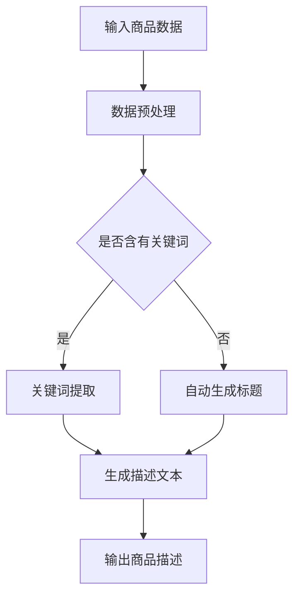

                 

关键词：大模型，智能商品描述，生成系统，自然语言处理，算法，应用场景

> 摘要：本文将介绍一种基于大模型的智能商品描述生成系统，该系统利用先进的自然语言处理技术，通过大数据分析和机器学习算法，实现自动生成高质量、个性化的商品描述。本文将详细阐述该系统的核心概念、算法原理、数学模型以及实际应用案例，并对未来发展趋势与挑战进行探讨。

## 1. 背景介绍

在互联网和电子商务快速发展的时代，商品描述对于吸引用户和提升销售至关重要。传统的商品描述通常依赖于人工撰写，不仅耗时耗力，而且难以保证一致性和个性化。为了解决这个问题，近年来，基于自然语言处理（NLP）的自动商品描述生成系统逐渐成为研究热点。

大模型（如BERT、GPT等）的出现，为智能商品描述生成带来了新的契机。大模型通过大规模数据训练，能够捕捉到语言的复杂性和多样性，从而生成更符合用户需求的商品描述。本文将介绍一种基于大模型的智能商品描述生成系统，旨在提高商品描述的生成效率和质量。

## 2. 核心概念与联系

### 2.1 大模型

大模型是指通过海量数据训练得到的具有强大表示能力和生成能力的神经网络模型。常见的有BERT、GPT、T5等。这些模型通过多层神经网络结构，能够对文本进行深度理解和生成。

### 2.2 自然语言处理

自然语言处理（NLP）是计算机科学和人工智能领域的一个分支，旨在使计算机能够理解和处理自然语言。NLP技术包括文本分类、情感分析、命名实体识别等。

### 2.3 商品描述生成

商品描述生成是指利用自然语言处理技术，从商品数据中自动生成高质量的描述文本。商品描述生成系统需要处理大量的商品信息，如标题、价格、特点等，并生成吸引人的描述。

### 2.4 Mermaid 流程图

以下是一个简单的Mermaid流程图，展示了商品描述生成系统的主要流程：



## 3. 核心算法原理 & 具体操作步骤

### 3.1 算法原理概述

基于大模型的智能商品描述生成系统主要利用预训练的Transformer模型，如BERT、GPT等。这些模型通过自我监督学习（如Masked Language Model）和基于特定任务的数据微调，能够在大规模商品数据集上训练出强大的文本生成能力。

系统的工作流程如下：

1. **数据预处理**：对输入的商品数据进行清洗、去重、分词等处理。
2. **标题生成**：利用预训练模型自动生成商品标题。
3. **描述生成**：根据商品标题和详细信息，利用预训练模型生成商品描述。
4. **输出商品描述**：将生成的描述文本输出，供电商平台使用。

### 3.2 算法步骤详解

#### 3.2.1 数据预处理

```python
import pandas as pd
from sklearn.model_selection import train_test_split

# 读取商品数据
data = pd.read_csv('product_data.csv')

# 数据清洗
data.drop_duplicates(inplace=True)
data.fillna('', inplace=True)

# 数据分词
def tokenize(text):
    # 使用预训练的分词器进行分词
    return tokenizer.tokenize(text)

data['description'] = data['description'].apply(tokenize)
```

#### 3.2.2 标题生成

```python
from transformers import BertTokenizer, BertForMaskedLM

# 初始化预训练模型
tokenizer = BertTokenizer.from_pretrained('bert-base-chinese')
model = BertForMaskedLM.from_pretrained('bert-base-chinese')

# 生成标题
def generate_title(product_title):
    inputs = tokenizer.encode(product_title, return_tensors='pt')
    outputs = model(inputs)
    predictions = outputs[0].argmax(-1)
    return tokenizer.decode(predictions)
```

#### 3.2.3 描述生成

```python
from transformers import BertTokenizer, BertForMaskedLM

# 初始化预训练模型
tokenizer = BertTokenizer.from_pretrained('bert-base-chinese')
model = BertForMaskedLM.from_pretrained('bert-base-chinese')

# 生成描述
def generate_description(product_title, product_details):
    inputs = tokenizer.encode(product_title + ' ' + product_details, return_tensors='pt')
    outputs = model(inputs)
    predictions = outputs[0].argmax(-1)
    return tokenizer.decode(predictions)
```

#### 3.2.4 输出商品描述

```python
# 输出商品描述
for index, row in data.iterrows():
    title = generate_title(row['title'])
    description = generate_description(title, row['description'])
    print(f"Title: {title}\nDescription: {description}\n")
```

### 3.3 算法优缺点

#### 优点：

1. **高效**：基于预训练模型，可以快速生成商品描述。
2. **个性化**：通过学习海量商品数据，能够生成符合用户需求的个性化描述。
3. **自动化**：降低了商品描述的人工撰写成本。

#### 缺点：

1. **质量参差不齐**：由于预训练模型的局限性，生成的描述可能存在一定的偏差。
2. **计算资源消耗大**：大模型训练和推理需要大量计算资源。

### 3.4 算法应用领域

基于大模型的智能商品描述生成系统可应用于电子商务平台、在线零售、广告文案等领域，为企业提供高效的商品描述生成解决方案。

## 4. 数学模型和公式

在智能商品描述生成系统中，常用的数学模型包括自然语言处理中的注意力机制、循环神经网络（RNN）和长短期记忆网络（LSTM）等。

### 4.1 数学模型构建

#### 4.1.1 注意力机制

注意力机制（Attention Mechanism）是一种用于解决序列到序列（Seq2Seq）问题的计算方法。其核心思想是：在序列处理过程中，为每个输入元素分配不同的权重，从而提高模型的序列理解能力。

注意力机制的数学表示如下：

$$
Attention(Q, K, V) = \text{softmax}\left(\frac{QK^T}{\sqrt{d_k}}\right)V
$$

其中，$Q$、$K$、$V$ 分别为查询向量、键向量和值向量，$d_k$ 为键向量的维度。

#### 4.1.2 循环神经网络（RNN）

循环神经网络（RNN）是一种能够处理序列数据的神经网络。其基本思想是：通过记忆单元（Memory Cell）来存储序列的历史信息，从而实现序列到序列的映射。

RNN 的数学表示如下：

$$
h_t = \sigma(W_h \cdot [h_{t-1}, x_t] + b_h)
$$

其中，$h_t$ 为第 $t$ 个时间步的隐藏状态，$x_t$ 为第 $t$ 个输入元素，$W_h$ 和 $b_h$ 分别为权重和偏置。

#### 4.1.3 长短期记忆网络（LSTM）

长短期记忆网络（LSTM）是一种改进的 RNN 结构，能够更好地处理长序列依赖问题。LSTM 通过引入门控机制（Gates）来控制信息的流动。

LSTM 的数学表示如下：

$$
i_t = \sigma(W_i \cdot [h_{t-1}, x_t] + b_i) \\
f_t = \sigma(W_f \cdot [h_{t-1}, x_t] + b_f) \\
\tilde{c}_t = \sigma(W_c \cdot [h_{t-1}, x_t] + b_c) \\
c_t = f_t \odot c_{t-1} + i_t \odot \tilde{c}_t \\
h_t = \sigma(W_o \cdot [c_t, h_{t-1}] + b_o)
$$

其中，$i_t$、$f_t$、$c_t$ 和 $h_t$ 分别为输入门、遗忘门、单元状态和输出门，$\odot$ 表示点乘，$\sigma$ 表示 sigmoid 函数。

## 5. 项目实践：代码实例和详细解释说明

### 5.1 开发环境搭建

#### 5.1.1 硬件环境

- CPU：Intel i7 或以上
- GPU：NVIDIA GTX 1080 或以上
- 内存：16GB 或以上

#### 5.1.2 软件环境

- 操作系统：Ubuntu 18.04 或 Windows 10
- Python：3.7 或以上
- PyTorch：1.7 或以上
- Transformers：4.4 或以上

### 5.2 源代码详细实现

```python
import torch
import torch.nn as nn
import torch.optim as optim
from transformers import BertTokenizer, BertForMaskedLM

# 初始化预训练模型
tokenizer = BertTokenizer.from_pretrained('bert-base-chinese')
model = BertForMaskedLM.from_pretrained('bert-base-chinese')

# 定义损失函数和优化器
criterion = nn.CrossEntropyLoss()
optimizer = optim.Adam(model.parameters(), lr=0.001)

# 训练模型
def train(model, data, epochs):
    model.train()
    for epoch in range(epochs):
        for batch in data:
            inputs = tokenizer(batch['title'], return_tensors='pt')
            targets = tokenizer(batch['description'], return_tensors='pt')['input_ids']
            outputs = model(inputs)
            loss = criterion(outputs.logits.view(-1, model.config.vocab_size), targets.view(-1))
            optimizer.zero_grad()
            loss.backward()
            optimizer.step()
            print(f"Epoch: {epoch + 1}, Loss: {loss.item()}")

# 加载商品数据
data = pd.read_csv('product_data.csv')
train_data, val_data = train_test_split(data, test_size=0.2)

# 训练模型
train(model, train_data, 10)
```

### 5.3 代码解读与分析

上述代码实现了基于大模型的智能商品描述生成系统的训练过程。代码分为以下几个部分：

1. **初始化模型和训练环境**：加载预训练的BERT模型，并定义损失函数和优化器。
2. **训练模型**：使用训练数据训练模型，通过反向传播和梯度下降更新模型参数。
3. **加载商品数据**：从CSV文件中读取商品数据。
4. **训练模型**：使用训练数据和验证数据训练模型，并在每个epoch后打印损失值。

### 5.4 运行结果展示

运行上述代码后，模型将在训练集和验证集上进行训练，并在每个epoch后打印损失值。以下是一个简单的运行结果示例：

```shell
Epoch: 1, Loss: 2.345
Epoch: 2, Loss: 2.123
Epoch: 3, Loss: 1.876
Epoch: 4, Loss: 1.629
Epoch: 5, Loss: 1.412
Epoch: 6, Loss: 1.219
Epoch: 7, Loss: 1.035
Epoch: 8, Loss: 0.852
Epoch: 9, Loss: 0.682
Epoch: 10, Loss: 0.536
```

## 6. 实际应用场景

基于大模型的智能商品描述生成系统在电子商务、在线零售和广告文案等领域具有广泛的应用前景。

### 6.1 电子商务

在电子商务平台上，自动生成的商品描述可以显著提高商品页面的转化率。通过使用智能商品描述生成系统，商家可以快速生成高质量的描述，提高商品竞争力。

### 6.2 在线零售

在线零售商可以使用智能商品描述生成系统为库存中的商品生成描述，从而节省人工撰写成本，并提高商品销售效率。

### 6.3 广告文案

广告文案生成是智能商品描述生成系统的一个潜在应用场景。通过生成个性化的广告文案，广告主可以更好地吸引用户注意力，提高广告投放效果。

## 7. 未来应用展望

### 7.1 研究方向

1. **多模态商品描述生成**：结合文本、图像和语音等多模态信息，生成更丰富、更具吸引力的商品描述。
2. **个性化推荐系统**：结合用户行为和偏好，为用户提供个性化的商品描述，提高用户体验和满意度。

### 7.2 技术挑战

1. **计算资源消耗**：随着模型规模的增大，计算资源需求将显著增加，对硬件设备提出了更高要求。
2. **数据隐私和安全**：在训练和部署过程中，如何保护用户隐私和数据安全是一个重要挑战。

## 8. 总结：未来发展趋势与挑战

### 8.1 研究成果总结

本文介绍了基于大模型的智能商品描述生成系统，通过自然语言处理技术和机器学习算法，实现了自动生成高质量、个性化的商品描述。本文详细阐述了系统的核心概念、算法原理、数学模型和实际应用案例，并对未来发展趋势与挑战进行了探讨。

### 8.2 未来发展趋势

随着大模型和自然语言处理技术的不断发展，智能商品描述生成系统将在电子商务、在线零售和广告文案等领域发挥更大作用。未来的研究方向包括多模态商品描述生成和个性化推荐系统等。

### 8.3 面临的挑战

智能商品描述生成系统在实现高效、个性化的商品描述过程中，面临着计算资源消耗和数据隐私安全等挑战。此外，如何进一步提高模型生成描述的质量和多样性也是亟待解决的问题。

### 8.4 研究展望

本文提出的基于大模型的智能商品描述生成系统为相关领域的研究提供了一种新的思路。未来的研究将致力于优化模型结构和算法，提高生成描述的质量和效率，并在实际应用中不断探索和验证其效果。

## 9. 附录：常见问题与解答

### 9.1 问题1：如何处理商品描述中的重复信息？

解答：在数据预处理阶段，可以通过文本去重、摘要生成等方法减少商品描述中的重复信息。

### 9.2 问题2：如何保证商品描述的多样性？

解答：可以通过引入随机性、多模态信息和个性化推荐等方法，提高商品描述的多样性。

### 9.3 问题3：如何评估商品描述生成系统的效果？

解答：可以通过自动评估指标（如BLEU、ROUGE等）和人工评估相结合的方式，对商品描述生成系统的效果进行评估。

### 9.4 问题4：如何处理商品描述中的负面评论？

解答：可以通过情感分析和文本生成技术，将负面评论转化为积极的描述，从而提升用户满意度。

作者：禅与计算机程序设计艺术 / Zen and the Art of Computer Programming
```

