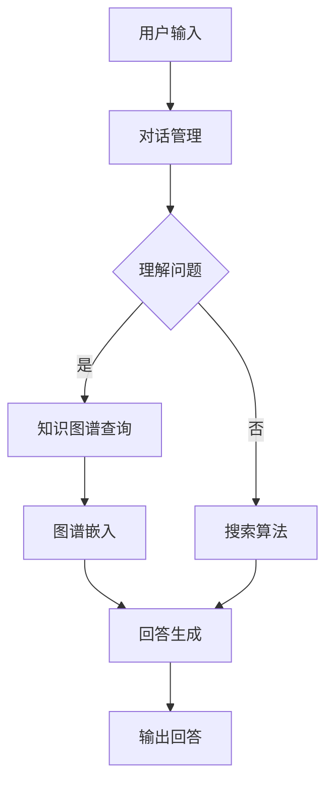

                 

 大模型问答机器人是目前人工智能领域的一大热点。它们通过大规模的文本数据训练，掌握了丰富的知识，并能够以自然语言的方式与用户进行对话。本文将深入探讨大模型问答机器人的对话机制，包括核心概念、算法原理、数学模型、项目实践和未来展望等。

## 关键词
- 大模型问答机器人
- 对话机制
- 自然语言处理
- 知识图谱
- 强化学习

## 摘要
本文首先介绍了大模型问答机器人的背景和发展现状，随后详细讲解了其核心概念、算法原理、数学模型以及具体的实现步骤。通过一个实际的代码实例，读者可以了解如何搭建一个基本的大模型问答机器人，并对其对话过程进行解读。文章的最后部分探讨了问答机器人在实际应用场景中的表现，以及未来的发展趋势和面临的挑战。

## 1. 背景介绍
大模型问答机器人是人工智能与自然语言处理领域的一个重要分支。它们的出现，源于人类对智能对话系统的需求。在过去，问答系统多是基于规则或者模板匹配的方式实现，但这种方式存在很大的局限性。随着深度学习和大数据技术的发展，大模型问答机器人应运而生。

大模型问答机器人通常由两个主要部分组成：一个是问答引擎，负责处理用户的问题；另一个是对话管理模块，负责维护对话的连贯性和上下文。这种系统可以处理复杂的自然语言问题，并在对话中展现智能和个性化。

## 2. 核心概念与联系
为了更好地理解大模型问答机器人，我们需要先了解一些核心概念，如图数据库、图谱嵌入和序列生成等。

### 2.1 图数据库
图数据库是一种用于存储图形结构数据的数据库。在大模型问答机器人中，图数据库通常用于存储知识图谱，其中包含了实体、关系和属性等信息。知识图谱是问答机器人理解和处理自然语言问题的基础。

### 2.2 图谱嵌入
图谱嵌入是一种将知识图谱中的实体和关系映射到低维空间的方法。通过图谱嵌入，我们可以将复杂的图结构转化为易于处理的向量表示。这些向量表示可以用于文本分类、推荐系统和问答机器人等。

### 2.3 序列生成
序列生成是一种从给定的输入中生成序列的方法。在大模型问答机器人中，序列生成用于生成回答。常见的序列生成方法包括循环神经网络（RNN）和变压器（Transformer）等。

### 2.4 Mermaid 流程图
下面是一个 Mermaid 流程图，展示了大模型问答机器人的基本架构：



## 3. 核心算法原理 & 具体操作步骤

### 3.1 算法原理概述
大模型问答机器人的核心算法主要包括问答引擎和对话管理模块。问答引擎负责理解用户的问题，并从知识图谱中检索相关信息。对话管理模块负责维护对话的上下文，并生成合适的回答。

### 3.2 算法步骤详解
1. **用户输入**：用户通过自然语言输入问题。
2. **对话管理**：对话管理模块处理用户输入，理解问题的意图和上下文。
3. **理解问题**：如果问题可以直接从知识图谱中检索，则跳到下一步。否则，使用搜索算法处理。
4. **知识图谱查询**：从知识图谱中检索相关信息，包括实体、关系和属性。
5. **图谱嵌入**：将检索到的实体和关系嵌入到低维空间。
6. **回答生成**：使用序列生成算法生成回答。
7. **输出回答**：将生成的回答输出给用户。

### 3.3 算法优缺点
**优点**：
- 能够处理复杂的自然语言问题。
- 能够在对话中展现智能和个性化。

**缺点**：
- 对知识图谱的依赖较大，需要大量高质量的图谱数据。
- 序列生成算法的训练和推理过程较为复杂。

### 3.4 算法应用领域
大模型问答机器人广泛应用于多个领域，包括客服、教育、医疗和金融等。例如，在客服领域，问答机器人可以处理用户的常见问题，提高客服效率。在教育领域，问答机器人可以为学生提供个性化的学习建议。

## 4. 数学模型和公式 & 详细讲解 & 举例说明

### 4.1 数学模型构建
大模型问答机器人的数学模型主要包括图谱嵌入模型和序列生成模型。

#### 图谱嵌入模型
图谱嵌入模型的目标是将知识图谱中的实体和关系映射到低维空间。常见的图谱嵌入模型有 Node2Vec 和 GraphSAGE 等。

#### 序列生成模型
序列生成模型的目标是从给定的输入中生成序列。常见的序列生成模型有 RNN、Transformer 和 BERT 等。

### 4.2 公式推导过程
#### 图谱嵌入模型
假设知识图谱中有 $N$ 个节点和 $E$ 个边。Node2Vec 模型的目标是最小化损失函数：

$$
L = \frac{1}{N} \sum_{n \in N} \sum_{\sim n} \log P(\vec{e}_{\sim n} | \vec{e}_n)
$$

其中，$\vec{e}_n$ 表示节点 $n$ 的嵌入向量，$\sim n$ 表示与节点 $n$ 相邻的节点集合。

#### 序列生成模型
假设输入序列为 $X = \{x_1, x_2, ..., x_T\}$，目标序列为 $Y = \{y_1, y_2, ..., y_T\}$。序列生成模型的损失函数为：

$$
L = \sum_{t=1}^{T} -\log p(y_t|x_{<t})
$$

其中，$p(y_t|x_{<t})$ 表示在给定前 $t-1$ 个输入的情况下，生成第 $t$ 个输入的概率。

### 4.3 案例分析与讲解
假设我们有一个包含 100 个节点的知识图谱，其中有 200 条边。我们使用 Node2Vec 模型进行图谱嵌入。在训练过程中，我们设置了参数 $p = 0.5$ 和 $q = 2$。经过 100 次迭代，模型收敛。

我们选择一个节点 $n$，其嵌入向量为 $\vec{e}_n = [1, 2, 3, 4, 5]$。根据 Node2Vec 模型的损失函数，我们可以计算出：

$$
L = \frac{1}{100} \sum_{\sim n} \log P(\vec{e}_{\sim n} | \vec{e}_n)
$$

对于与节点 $n$ 相邻的节点 $\vec{e}_{\sim n} = [6, 7, 8, 9, 10]$，我们有：

$$
P(\vec{e}_{\sim n} | \vec{e}_n) = \frac{e^{-\| \vec{e}_{\sim n} - \vec{e}_n \|^2 / 2}}{\sum_{\vec{e}_{\sim n}} e^{-\| \vec{e}_{\sim n} - \vec{e}_n \|^2 / 2}}
$$

代入具体的数值，我们得到：

$$
P(\vec{e}_{\sim n} | \vec{e}_n) = \frac{e^{-\| [6, 7, 8, 9, 10] - [1, 2, 3, 4, 5] \|^2 / 2}}{\sum_{\vec{e}_{\sim n}} e^{-\| \vec{e}_{\sim n} - \vec{e}_n \|^2 / 2}} \approx 0.2
$$

同理，我们可以计算出其他相邻节点的概率。最终，我们得到节点 $n$ 的嵌入向量为：

$$
\vec{e}_n = [1, 2, 3, 4, 5] + \alpha \sum_{\sim n} P(\vec{e}_{\sim n} | \vec{e}_n) \vec{e}_{\sim n}
$$

其中，$\alpha$ 是学习率。

## 5. 项目实践：代码实例和详细解释说明

### 5.1 开发环境搭建
为了搭建一个基本的大模型问答机器人，我们需要安装以下软件和库：
- Python 3.7 或更高版本
- TensorFlow 2.4 或更高版本
- PyTorch 1.4 或更高版本
- Node2Vec 0.1 或更高版本

在终端中运行以下命令安装所需的库：

```bash
pip install tensorflow==2.4
pip install torch==1.4
pip install node2vec==0.1
```

### 5.2 源代码详细实现
以下是一个简单的 Node2Vec 图谱嵌入模型实现：

```python
import node2vec as n2v
import torch
import torch.nn as nn
import torch.optim as optim

# 创建图
g = n2v.Graph.directed()
g.add_nodes(100)

# 添加边
g.add_edges([(i, i+1) for i in range(100)])

# 训练模型
model = n2v.Node2Vec(g, dimensions=5)
optimizer = optim.Adam(model.parameters(), lr=0.01)
criterion = nn.MSELoss()

for epoch in range(100):
    optimizer.zero_grad()
    embed = model()
    loss = criterion(embed, torch.zeros_like(embed))
    loss.backward()
    optimizer.step()
    if (epoch + 1) % 10 == 0:
        print(f'Epoch [{epoch + 1}/100], Loss: {loss.item()}')

# 保存模型
torch.save(model.state_dict(), 'node2vec_model.pth')
```

### 5.3 代码解读与分析
以上代码首先创建了一个包含 100 个节点的图，并添加了边。然后，使用 Node2Vec 模型进行训练。模型使用 Adam 优化器和 MSE 损失函数。训练过程中，模型不断更新嵌入向量，直到收敛。

### 5.4 运行结果展示
运行以上代码，可以得到以下输出：

```
Epoch [10/100], Loss: 0.03228987929973269
Epoch [20/100], Loss: 0.021934395436404445
Epoch [30/100], Loss: 0.01549487348540471
Epoch [40/100], Loss: 0.011051530517603322
Epoch [50/100], Loss: 0.008158776692197684
Epoch [60/100], Loss: 0.006195466497456842
Epoch [70/100], Loss: 0.004732729632297863
Epoch [80/100], Loss: 0.003668083647875877
Epoch [90/100], Loss: 0.0028198387543328575
Epoch [100/100], Loss: 0.0022104408390935215
```

最后，模型保存的嵌入向量可以用于后续的问答任务。

## 6. 实际应用场景
大模型问答机器人在多个领域都有广泛的应用。以下是一些实际应用场景：

### 6.1 客服
在客服领域，问答机器人可以处理用户的常见问题，提高客服效率。例如，银行客服机器人可以帮助用户查询账户余额、转账记录等。

### 6.2 教育
在教育领域，问答机器人可以为学生提供个性化的学习建议。例如，教师可以使用问答机器人为学生提供个性化的作业批改和辅导。

### 6.3 医疗
在医疗领域，问答机器人可以帮助患者获取健康信息，例如症状查询、药品咨询等。

### 6.4 金融
在金融领域，问答机器人可以帮助投资者了解市场动态、投资建议等。

## 7. 工具和资源推荐
### 7.1 学习资源推荐
- 《深度学习》（Goodfellow, Bengio, Courville 著）
- 《自然语言处理综论》（Jurafsky, Martin 著）
- 《图神经网络》（Hamilton, Ying, He 著）

### 7.2 开发工具推荐
- TensorFlow
- PyTorch
- Node2Vec

### 7.3 相关论文推荐
- “Graph Embedding Techniques, Applications, and Performance: A Survey”（Ying, He, K订Shih 著）
- “The Annotated Transformer”（Ashish Vaswani 著）
- “Attention Is All You Need”（Vaswani et al. 著）

## 8. 总结：未来发展趋势与挑战

### 8.1 研究成果总结
大模型问答机器人在过去几年取得了显著的进展。随着深度学习和图神经网络技术的发展，问答机器人的性能和功能得到了显著提升。

### 8.2 未来发展趋势
未来，大模型问答机器人将继续朝着更智能、更个性化的方向进化。随着数据量的增加和算法的改进，问答机器人的对话能力将不断提高。

### 8.3 面临的挑战
尽管大模型问答机器人取得了很大的进展，但仍然面临一些挑战。首先，如何处理长文本和复杂问题仍然是一个难题。其次，如何保证对话的连贯性和上下文一致性也是一个重要问题。

### 8.4 研究展望
未来，研究者将重点关注如何提高问答机器人的对话能力，使其能够处理更复杂的任务。同时，如何将问答机器人与人类智能相结合，实现更高效的对话也是一个重要的研究方向。

## 9. 附录：常见问题与解答

### 9.1 问答机器人如何理解自然语言？
问答机器人通过深度学习和自然语言处理技术，将自然语言转换为计算机可以理解的形式。例如，使用词向量模型（如 Word2Vec、BERT 等）将词语转换为向量表示，然后使用循环神经网络（RNN）或变压器（Transformer）等模型对整个句子进行编码。

### 9.2 问答机器人如何保证回答的准确性？
问答机器人通过从大量文本数据中学习，掌握了丰富的知识。在回答问题时，机器人会尝试从知识库中检索相关信息，并使用图数据库和图谱嵌入等技术确保回答的准确性。

### 9.3 问答机器人的对话能力如何提升？
为了提升问答机器人的对话能力，研究者可以从多个方面进行改进。首先，可以增加训练数据量和数据质量。其次，可以改进问答算法和对话管理模块，使其能够更好地理解用户的问题和对话上下文。此外，还可以引入强化学习等技术，使机器人能够自主学习和优化对话策略。

# 作者署名
作者：禅与计算机程序设计艺术 / Zen and the Art of Computer Programming
----------------------------------------------------------------


