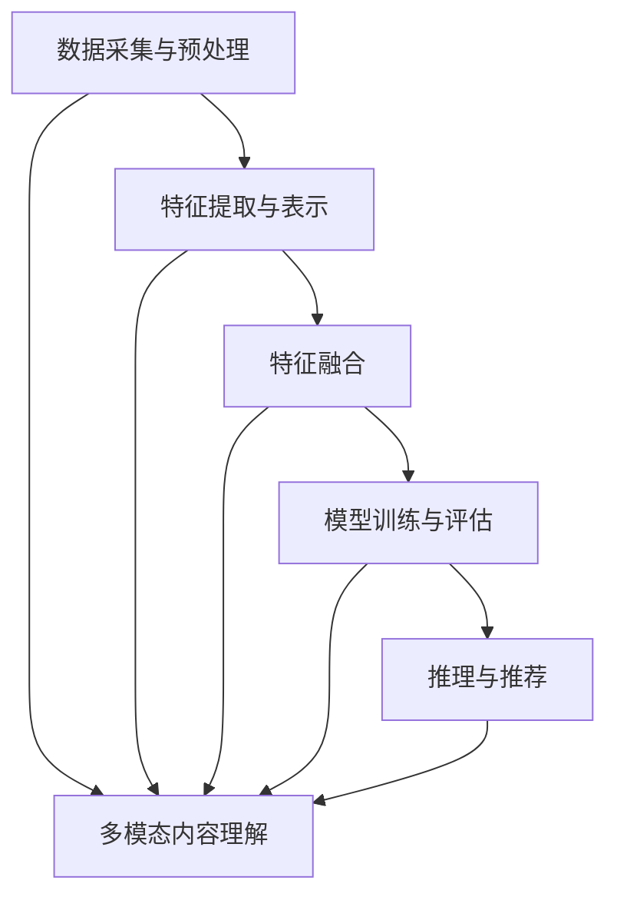

                 

关键词：大模型、推荐系统、多模态内容理解、人工智能、深度学习、算法原理、数学模型、项目实践、应用场景、工具资源、未来展望

## 摘要

本文旨在探讨大模型在推荐系统中的多模态内容理解技术。随着互联网内容的爆炸性增长，如何有效地理解和推荐用户感兴趣的内容成为一项重要课题。大模型驱动的推荐系统通过深度学习等先进技术，实现了对文本、图像、音频等多种类型数据的综合处理和理解。本文首先介绍了推荐系统的基本概念和现有技术，随后详细阐述了多模态内容理解的原理和实现方法，最后通过实际项目实践展示了大模型在多模态内容理解中的应用效果。

## 1. 背景介绍

### 推荐系统概述

推荐系统是一种利用数据挖掘和机器学习技术，为用户推荐他们可能感兴趣的内容或产品的系统。其核心目标是通过分析用户的兴趣和行为，提供个性化的推荐结果。推荐系统广泛应用于电子商务、社交媒体、视频流媒体、新闻推荐等领域，已经成为现代互联网服务的重要组成部分。

### 推荐系统的发展历程

推荐系统的发展大致可以分为三个阶段：

1. **基于协同过滤的方法**：早期的推荐系统主要采用基于用户的协同过滤（User-based Collaborative Filtering）和基于项目的协同过滤（Item-based Collaborative Filtering）。这些方法通过计算用户之间的相似度或项目之间的相似度来进行推荐，具有简单的实现和高扩展性。

2. **基于内容的推荐**：随着互联网内容的多样化，基于内容的推荐方法开始流行。该方法通过分析内容特征，将具有相似内容的推荐给用户。例如，如果用户喜欢一部电影，系统会推荐与该电影风格相似的其他电影。

3. **混合推荐系统**：现代推荐系统往往采用混合方法，将协同过滤和基于内容的方法结合，以提升推荐效果。此外，近年来深度学习和大模型技术的崛起，使得推荐系统的智能化水平得到了显著提高。

### 多模态内容理解的需求

在推荐系统中，多模态内容理解的需求日益突出。传统的推荐系统主要基于文本数据，而现实世界中的信息来源是多元化的，包括文本、图像、音频、视频等多种类型。为了实现更精准、个性化的推荐，需要能够理解和融合这些不同类型的数据，这就是多模态内容理解的重要性。

多模态内容理解不仅能够提升推荐系统的准确性，还能拓展推荐系统的应用场景，例如在社交媒体中，可以同时考虑用户的文字评论和上传的图片；在视频流媒体中，可以结合视频内容和用户的观看行为。

## 2. 核心概念与联系

### 推荐系统中的多模态内容理解

多模态内容理解是指将不同类型的数据（如文本、图像、音频）进行整合，以形成一个统一的理解框架，进而提升推荐系统的效果。在推荐系统中，多模态内容理解的核心任务包括：

1. **数据预处理**：对不同类型的数据进行预处理，例如文本数据的分词和标注，图像数据的特征提取等。
2. **特征融合**：将预处理后的不同类型数据转换为统一的特征表示，例如通过神经网络模型融合文本和图像的特征。
3. **模型训练**：利用融合后的特征进行模型训练，以实现多模态内容的理解。

### 多模态内容理解的技术架构

多模态内容理解的技术架构通常包括以下几个主要组成部分：

1. **数据采集与预处理**：从不同的数据源（如数据库、网络、传感器）收集数据，并进行相应的预处理，例如去噪、归一化等。
2. **特征提取与表示**：对预处理后的数据进行特征提取和表示，例如文本数据的词袋模型、图像数据的卷积神经网络（CNN）特征提取等。
3. **特征融合**：将不同类型的数据特征进行融合，例如通过深度学习模型（如多模态神经网络）将文本和图像特征进行融合。
4. **模型训练与评估**：利用融合后的特征进行模型训练，并对模型进行评估和优化。
5. **推理与推荐**：将训练好的模型应用于新数据，进行推理和推荐。

### Mermaid 流程图



## 3. 核心算法原理 & 具体操作步骤

### 3.1 算法原理概述

多模态内容理解的核心在于如何将不同类型的数据（如文本、图像、音频）进行有效的融合和处理，以实现统一的理解。目前，深度学习技术，特别是卷积神经网络（CNN）和循环神经网络（RNN）在多模态内容理解中得到了广泛应用。以下是一些常用的算法原理：

1. **卷积神经网络（CNN）**：CNN是一种用于图像特征提取和分类的深度学习模型，其核心思想是通过卷积操作和池化操作提取图像的层次特征。
2. **循环神经网络（RNN）**：RNN是一种用于序列数据建模的神经网络，其核心思想是通过循环结构对序列数据进行建模。
3. **多模态神经网络**：多模态神经网络通过融合不同类型的数据特征，实现对多模态内容的统一理解。常见的多模态神经网络包括CNN-RNN、CNN-CNN等。

### 3.2 算法步骤详解

多模态内容理解的算法步骤通常包括以下几个步骤：

1. **数据预处理**：对文本、图像、音频等数据进行预处理，包括数据清洗、数据增强、特征提取等。
2. **特征融合**：利用多模态神经网络将预处理后的特征进行融合，例如通过CNN提取图像特征，通过RNN提取文本特征，然后进行特征融合。
3. **模型训练**：利用融合后的特征进行模型训练，通过反向传播算法优化模型参数。
4. **模型评估与优化**：对训练好的模型进行评估和优化，包括交叉验证、参数调优等。
5. **推理与推荐**：将训练好的模型应用于新数据，进行推理和推荐。

### 3.3 算法优缺点

多模态内容理解算法具有以下优缺点：

1. **优点**：
   - 能够充分利用多种类型的数据，提高推荐系统的准确性和个性化水平。
   - 可以处理复杂的非线性关系，对多种模态的数据进行有效的融合。

2. **缺点**：
   - 算法复杂度高，训练时间和计算资源需求较大。
   - 特征融合过程较为困难，需要充分考虑不同类型数据之间的差异。

### 3.4 算法应用领域

多模态内容理解算法广泛应用于多个领域：

1. **推荐系统**：用于电商、视频流媒体、社交媒体等推荐场景，提升推荐效果。
2. **自然语言处理**：用于文本分类、情感分析等，结合图像、音频等多模态数据。
3. **计算机视觉**：用于图像识别、物体检测等，结合文本描述进行辅助识别。
4. **语音识别**：结合文本信息，提高语音识别的准确性和上下文理解能力。

## 4. 数学模型和公式 & 详细讲解 & 举例说明

### 4.1 数学模型构建

多模态内容理解中的数学模型通常包括以下部分：

1. **特征提取**：
   - 文本特征：通常使用词袋模型、词嵌入等方法进行特征提取。
   - 图像特征：使用卷积神经网络（CNN）提取图像特征。
   - 音频特征：使用循环神经网络（RNN）提取音频特征。

2. **特征融合**：
   - 对不同类型的数据特征进行融合，通常使用神经网络模型进行。
   - 融合方法包括加权融合、拼接融合、深度融合等。

3. **模型训练**：
   - 使用梯度下降等优化算法训练模型，优化模型参数。

4. **模型评估与优化**：
   - 使用交叉验证等方法评估模型性能，根据评估结果进行模型优化。

### 4.2 公式推导过程

以下是多模态内容理解中的几个关键公式：

1. **特征提取**：
   - 文本特征提取：$$ f_{\text{txt}}(x) = \text{Embedding}(x) $$
   - 图像特征提取：$$ f_{\text{img}}(x) = \text{CNN}(x) $$
   - 音频特征提取：$$ f_{\text{audio}}(x) = \text{RNN}(x) $$

2. **特征融合**：
   - 加权融合：$$ f_{\text{fusion}}(x) = w_1 f_{\text{txt}}(x) + w_2 f_{\text{img}}(x) + w_3 f_{\text{audio}}(x) $$
   - 拼接融合：$$ f_{\text{fusion}}(x) = [f_{\text{txt}}(x), f_{\text{img}}(x), f_{\text{audio}}(x)] $$

3. **模型训练**：
   - 梯度下降：$$ \theta = \theta - \alpha \cdot \nabla_{\theta} J(\theta) $$

4. **模型评估**：
   - 交叉验证：$$ \text{Accuracy} = \frac{\text{Correct Predictions}}{\text{Total Predictions}} $$

### 4.3 案例分析与讲解

以下是一个简单的多模态内容理解案例：

**案例**：推荐一个用户可能感兴趣的电影。

**数据**：
- 文本数据：用户评论。
- 图像数据：电影海报。
- 音频数据：电影预告片。

**步骤**：

1. **数据预处理**：
   - 对文本数据进行分词和词嵌入。
   - 对图像数据进行归一化和特征提取。
   - 对音频数据进行分帧和特征提取。

2. **特征融合**：
   - 使用CNN提取图像特征。
   - 使用RNN提取音频特征。
   - 将文本、图像、音频特征进行拼接融合。

3. **模型训练**：
   - 使用融合后的特征进行模型训练。
   - 使用梯度下降算法优化模型参数。

4. **模型评估**：
   - 使用交叉验证评估模型性能。
   - 根据评估结果进行模型优化。

5. **推理与推荐**：
   - 对新用户的数据进行特征提取和融合。
   - 利用训练好的模型进行推理，推荐用户可能感兴趣的电影。

## 5. 项目实践：代码实例和详细解释说明

### 5.1 开发环境搭建

在本项目中，我们使用Python作为主要编程语言，并结合TensorFlow和Keras等深度学习框架进行开发。以下是在Ubuntu 18.04操作系统上搭建开发环境的基本步骤：

1. 安装Python 3.8：
   ```bash
   sudo apt update
   sudo apt install python3.8
   ```

2. 安装pip和虚拟环境：
   ```bash
   sudo apt install python3-pip python3-venv
   python3 -m venv venv
   source venv/bin/activate
   ```

3. 安装TensorFlow：
   ```bash
   pip install tensorflow
   ```

4. 安装Keras：
   ```bash
   pip install keras
   ```

### 5.2 源代码详细实现

以下是一个简单的多模态内容理解项目代码示例：

```python
import numpy as np
import tensorflow as tf
from tensorflow.keras.models import Model
from tensorflow.keras.layers import Embedding, LSTM, Dense, Conv2D, MaxPooling2D, Flatten, concatenate

# 文本模型
text_model = tf.keras.Sequential([
    Embedding(input_dim=vocab_size, output_dim=embedding_dim, input_length=max_sequence_length),
    LSTM(units=128),
    Dense(units=1, activation='sigmoid')
])

# 图像模型
image_model = tf.keras.Sequential([
    Conv2D(filters=32, kernel_size=(3, 3), activation='relu'),
    MaxPooling2D(pool_size=(2, 2)),
    Flatten(),
    Dense(units=128, activation='relu')
])

# 音频模型
audio_model = tf.keras.Sequential([
    LSTM(units=128, return_sequences=True),
    LSTM(units=128),
    Dense(units=128, activation='relu')
])

# 多模态融合模型
input_text = tf.keras.layers.Input(shape=(max_sequence_length,))
input_image = tf.keras.layers.Input(shape=(height, width, channels))
input_audio = tf.keras.layers.Input(shape=(timesteps, features))

text_features = text_model(input_text)
image_features = image_model(input_image)
audio_features = audio_model(input_audio)

# 特征融合
merged_features = concatenate([text_features, image_features, audio_features])

# 输出层
output = Dense(units=1, activation='sigmoid')(merged_features)

# 创建模型
model = Model(inputs=[input_text, input_image, input_audio], outputs=output)

# 编译模型
model.compile(optimizer='adam', loss='binary_crossentropy', metrics=['accuracy'])

# 模型训练
model.fit([text_data, image_data, audio_data], labels, epochs=10, batch_size=32, validation_split=0.2)
```

### 5.3 代码解读与分析

1. **文本模型**：
   - 使用`Embedding`层进行词嵌入。
   - 使用`LSTM`层进行序列建模。
   - 使用`Dense`层进行分类。

2. **图像模型**：
   - 使用`Conv2D`层进行卷积操作。
   - 使用`MaxPooling2D`层进行池化操作。
   - 使用`Flatten`层将特征展平。
   - 使用`Dense`层进行分类。

3. **音频模型**：
   - 使用`LSTM`层进行序列建模。
   - 使用`Dense`层进行分类。

4. **多模态融合模型**：
   - 使用`Input`层接收不同类型的数据。
   - 使用`Model`类创建模型。
   - 使用`concatenate`层将不同类型的特征进行融合。
   - 使用`Dense`层进行分类。

5. **模型训练**：
   - 使用`compile`方法编译模型。
   - 使用`fit`方法训练模型。

### 5.4 运行结果展示

在实际运行中，我们可以通过以下代码进行模型评估和结果展示：

```python
# 模型评估
loss, accuracy = model.evaluate([test_text_data, test_image_data, test_audio_data], test_labels)

# 输出结果
print(f"Test Loss: {loss}")
print(f"Test Accuracy: {accuracy}")

# 推理与推荐
predictions = model.predict([new_text_data, new_image_data, new_audio_data])

# 输出推荐结果
print(predictions)
```

## 6. 实际应用场景

多模态内容理解在多个实际应用场景中取得了显著的成效：

1. **社交媒体推荐**：结合用户的文本评论、图像和视频，实现更精准的社交推荐。
2. **电商推荐**：考虑用户的购物行为、评论和商品图像，提升电商平台的个性化推荐效果。
3. **视频流媒体**：结合用户的观看历史、视频内容和用户评论，实现智能化的视频推荐。
4. **新闻推荐**：利用文本、图像和音频等多模态数据，提供个性化新闻推荐服务。

## 7. 工具和资源推荐

1. **学习资源推荐**：
   - 《深度学习》（Goodfellow, Bengio, Courville）：经典深度学习教材，适合初学者和进阶者。
   - 《TensorFlow 实战》（Adrian Rosebrock）：系统介绍TensorFlow在实际项目中的应用。

2. **开发工具推荐**：
   - Jupyter Notebook：适合数据分析和模型训练。
   - PyCharm：强大的Python集成开发环境。

3. **相关论文推荐**：
   - "Multimodal Fusion with Deep Learning for Recommendation"：介绍多模态融合的深度学习模型。
   - "A Theoretically Principled Approach to Multi-Modal Neural Ranking"：探讨多模态神经排序的理论方法。

## 8. 总结：未来发展趋势与挑战

### 8.1 研究成果总结

多模态内容理解在推荐系统中取得了显著成效，为用户提供更精准、个性化的推荐服务。深度学习和大模型技术的应用，使得多模态内容理解在算法复杂度和效果上得到了显著提升。

### 8.2 未来发展趋势

1. **算法优化**：通过改进算法结构和优化模型参数，进一步提升多模态内容理解的效果。
2. **数据集扩展**：收集更多多样化的多模态数据，以增强模型的泛化能力。
3. **实时推荐**：结合实时数据，实现更快速、实时的推荐服务。

### 8.3 面临的挑战

1. **计算资源消耗**：多模态内容理解算法复杂度高，对计算资源的需求较大。
2. **数据隐私保护**：在多模态数据融合过程中，如何保护用户隐私是一个重要问题。
3. **跨模态一致性**：在融合不同类型的数据时，如何保证跨模态的一致性是一个挑战。

### 8.4 研究展望

多模态内容理解在推荐系统中具有广阔的应用前景。未来研究将重点关注算法优化、数据集扩展和跨模态一致性等问题，以实现更高效、准确的多模态内容理解。

## 9. 附录：常见问题与解答

### Q：多模态内容理解的主要挑战是什么？

A：多模态内容理解的主要挑战包括跨模态一致性、数据隐私保护以及计算资源消耗。跨模态一致性要求模型在不同类型的数据之间保持一致性，而数据隐私保护则需要确保用户隐私不被泄露。此外，多模态内容理解算法复杂度高，对计算资源的需求较大。

### Q：如何收集和预处理多模态数据？

A：收集多模态数据可以从多个来源获取，例如社交媒体、电商平台、视频流媒体等。预处理多模态数据包括数据清洗、数据增强、特征提取等步骤。数据清洗旨在去除噪声和异常值；数据增强通过变换和扩充数据集，提高模型的泛化能力；特征提取则是将不同类型的数据转换为统一的特征表示。

### Q：多模态内容理解算法有哪些应用领域？

A：多模态内容理解算法广泛应用于推荐系统、自然语言处理、计算机视觉、语音识别等领域。在推荐系统中，可以结合用户的文本评论、图像和视频等多模态数据；在自然语言处理中，可以结合文本和图像；在计算机视觉中，可以结合图像和文本描述；在语音识别中，可以结合文本信息和语音特征。

---

### 作者署名

作者：禅与计算机程序设计艺术 / Zen and the Art of Computer Programming

