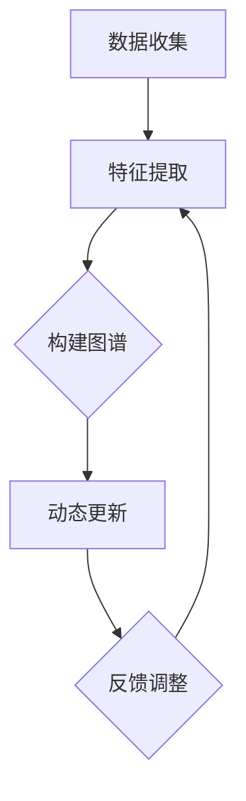

                 

关键词：大模型、推荐系统、用户兴趣图谱、更新机制、算法原理、数学模型、实践应用、未来展望。

> 摘要：本文旨在探讨如何利用大模型技术来驱动推荐系统用户兴趣图谱的更新。通过对核心概念、算法原理、数学模型和实践应用的详细分析，我们旨在为推荐系统研究人员和实践者提供一套完整的技术框架，以应对快速变化的用户兴趣和个性化推荐的需求。

## 1. 背景介绍

在当今信息爆炸的时代，推荐系统已经成为各个行业提高用户体验、增加商业价值的重要工具。用户兴趣图谱（User Interest Graph，简称UIG）作为推荐系统中的关键组成部分，它能够捕捉用户在多种维度上的兴趣点，从而为个性化推荐提供数据支撑。然而，随着互联网用户的日益增长和用户行为数据的海量积累，传统的用户兴趣图谱构建方法面临着实时性差、更新滞后等挑战。

大模型技术的发展，如深度学习、强化学习等，为推荐系统带来了新的机遇。通过引入大模型，我们可以更准确地捕捉用户的实时行为和潜在兴趣，从而实现用户兴趣图谱的动态更新和优化。本文将探讨大模型在推荐系统用户兴趣图谱更新中的应用，为推荐系统的研究和实现提供新的思路和方法。

## 2. 核心概念与联系

### 2.1 用户兴趣图谱定义

用户兴趣图谱是一个结构化、网络化的用户兴趣表示模型，它通过将用户的行为数据、内容数据和社交数据等多源数据进行整合，构建出一个多层次的兴趣节点和关系网络。用户兴趣图谱不仅包含了用户的显性兴趣点，还能挖掘用户的隐性兴趣，为推荐系统提供了丰富的信息资源。

### 2.2 大模型与推荐系统

大模型，特别是深度学习模型，具有强大的特征提取和建模能力，能够从大量的用户行为数据中挖掘出潜在的规律和模式。在推荐系统中，大模型的应用主要体现在以下几个方面：

1. **用户特征表示**：通过深度学习模型对用户行为数据进行分析和建模，将用户的兴趣和行为抽象为高维向量表示。
2. **内容特征提取**：对推荐的内容进行特征提取，帮助推荐系统理解内容的属性和特征。
3. **模型训练与优化**：利用大量的用户行为数据来训练推荐模型，通过不断地迭代优化来提高推荐系统的准确性。

### 2.3 用户兴趣图谱的更新机制

用户兴趣图谱的更新机制主要包括以下几个步骤：

1. **数据收集**：收集用户的各类行为数据，包括浏览历史、搜索记录、购买行为等。
2. **特征提取**：利用深度学习模型对行为数据进行特征提取，生成用户兴趣特征向量。
3. **图谱构建**：基于用户兴趣特征向量构建用户兴趣图谱，将用户与其他用户、内容等进行关联。
4. **动态更新**：根据用户的最新行为数据，动态调整用户兴趣图谱的结构和内容，以适应用户兴趣的变化。

### 2.4 Mermaid 流程图

下面是一个简化的用户兴趣图谱更新机制的 Mermaid 流程图：



## 3. 核心算法原理 & 具体操作步骤

### 3.1 算法原理概述

用户兴趣图谱的更新主要依赖于深度学习模型对用户行为数据的分析。具体来说，我们采用以下三个步骤：

1. **用户特征提取**：使用深度神经网络对用户的行为数据进行特征提取，将用户的兴趣抽象为高维向量表示。
2. **图谱构建**：基于用户特征向量构建用户兴趣图谱，利用图神经网络（Graph Neural Network，GNN）来处理复杂的用户关系和内容关联。
3. **动态更新**：利用强化学习算法（如深度强化学习 DQN）来动态调整用户兴趣图谱的结构，以适应用户兴趣的变化。

### 3.2 算法步骤详解

#### 3.2.1 用户特征提取

用户特征提取是用户兴趣图谱构建的基础。我们采用基于深度神经网络的用户行为数据特征提取方法。具体步骤如下：

1. **数据预处理**：对用户的行为数据（如浏览历史、搜索记录等）进行清洗、去噪和归一化处理。
2. **模型训练**：使用预训练的深度神经网络（如BERT、GPT等）对用户行为数据进行特征提取，生成用户兴趣特征向量。
3. **特征融合**：将多个行为特征的输出进行融合，生成最终的用户兴趣特征向量。

#### 3.2.2 图谱构建

基于用户兴趣特征向量，我们可以构建用户兴趣图谱。图谱的构建主要包括以下几个步骤：

1. **用户节点创建**：根据用户兴趣特征向量创建用户节点，并将用户节点添加到图谱中。
2. **关系网络构建**：利用图神经网络对用户之间的交互关系进行建模，将用户节点与其他节点（如内容节点、标签节点等）进行关联。
3. **图谱优化**：利用图优化算法（如最大流最小割算法）对图谱进行优化，提高图谱的质量和效率。

#### 3.2.3 动态更新

用户兴趣图谱的动态更新是推荐系统保持实时性和准确性的关键。我们采用深度强化学习算法来实现动态更新。具体步骤如下：

1. **状态空间定义**：将用户兴趣图谱的状态定义为用户节点、关系节点和图谱结构的集合。
2. **动作空间定义**：将用户兴趣图谱的调整动作定义为节点添加、删除、关系修改等。
3. **奖励函数设计**：设计奖励函数来评估用户兴趣图谱的调整效果，如用户满意度、推荐准确率等。
4. **模型训练**：利用深度强化学习算法对用户兴趣图谱进行动态调整，优化图谱结构。

### 3.3 算法优缺点

#### 3.3.1 优点

1. **高效性**：深度学习模型能够高效地从海量用户行为数据中提取特征，实现快速的用户兴趣图谱构建和更新。
2. **准确性**：基于深度强化学习算法的动态更新机制能够准确捕捉用户兴趣的变化，提高推荐系统的准确性。
3. **灵活性**：用户兴趣图谱的构建和更新过程具有较强的灵活性，可以根据不同的应用场景和需求进行调整。

#### 3.3.2 缺点

1. **计算资源消耗**：深度学习模型训练和图神经网络计算需要大量的计算资源和时间，对硬件要求较高。
2. **数据依赖性**：用户兴趣图谱的构建和更新高度依赖于用户行为数据的质量和多样性，数据缺失或不准确可能导致图谱质量下降。

### 3.4 算法应用领域

用户兴趣图谱和大模型技术在推荐系统中的应用非常广泛，主要包括以下几个方面：

1. **电子商务**：利用用户兴趣图谱进行商品推荐，提高购物体验和销售额。
2. **内容推荐**：在新闻、视频、音乐等媒体平台上，利用用户兴趣图谱实现个性化内容推荐。
3. **社交网络**：利用用户兴趣图谱进行社交推荐，促进用户间的互动和社区建设。
4. **健康医疗**：利用用户兴趣图谱进行健康管理和疾病预防推荐。

## 4. 数学模型和公式 & 详细讲解 & 举例说明

### 4.1 数学模型构建

用户兴趣图谱的构建主要依赖于深度学习模型和图神经网络。以下是构建用户兴趣图谱的数学模型：

#### 4.1.1 深度学习模型

假设用户行为数据为 $X \in \mathbb{R}^{m \times n}$，其中 $m$ 表示用户数，$n$ 表示行为类型。我们可以使用一个深度神经网络 $f_{\theta}$ 对用户行为数据进行特征提取，生成用户兴趣特征向量 $h \in \mathbb{R}^{d}$，其中 $d$ 表示特征维度。深度学习模型的损失函数为：

$$
L(\theta) = -\frac{1}{m} \sum_{i=1}^{m} \sum_{j=1}^{n} \log f_{\theta}(x_{ij})
$$

其中，$x_{ij}$ 表示用户 $i$ 的行为 $j$ 的特征。

#### 4.1.2 图神经网络

假设用户兴趣图谱由节点集合 $V$ 和边集合 $E$ 构成。我们可以使用一个图神经网络 $g_{\phi}$ 对用户兴趣图谱进行建模。图神经网络的输入为节点特征矩阵 $H \in \mathbb{R}^{n \times d}$ 和边特征矩阵 $A \in \mathbb{R}^{n \times n}$，输出为更新后的节点特征矩阵 $H' \in \mathbb{R}^{n \times d}$。图神经网络的更新规则为：

$$
H'_{i} = \sigma(g_{\phi}(H, A, h_i))
$$

其中，$\sigma$ 表示激活函数，$h_i$ 表示节点 $i$ 的初始特征。

### 4.2 公式推导过程

#### 4.2.1 深度学习模型损失函数的推导

深度学习模型的损失函数是衡量模型预测误差的指标。假设用户行为 $x_{ij}$ 的概率分布为 $p(x_{ij} | \theta)$，则损失函数可以表示为：

$$
L(\theta) = -\frac{1}{m} \sum_{i=1}^{m} \sum_{j=1}^{n} \log p(x_{ij} | \theta)
$$

其中，$p(x_{ij} | \theta)$ 是模型对用户行为 $x_{ij}$ 的预测概率。

#### 4.2.2 图神经网络更新规则的推导

图神经网络的更新规则是一个非线性函数，它将节点特征和边特征结合起来，生成更新后的节点特征。假设节点 $i$ 的特征为 $h_i$，边 $e_{ij}$ 的特征为 $a_{ij}$，则图神经网络的更新规则可以表示为：

$$
H'_{i} = \sigma(g_{\phi}(H, A, h_i))
$$

其中，$\sigma$ 是一个激活函数，如ReLU或Sigmoid函数。

### 4.3 案例分析与讲解

假设我们有一个包含100个用户的用户兴趣图谱，其中每个用户的行为数据包含浏览历史、搜索记录和购买行为等信息。我们使用一个深度神经网络对用户行为数据进行特征提取，生成用户兴趣特征向量。然后，我们使用一个图神经网络对用户兴趣图谱进行建模，并利用深度强化学习算法对图谱进行动态更新。

#### 4.3.1 深度学习模型训练

我们使用一个预训练的BERT模型对用户行为数据进行特征提取。BERT模型的输入是用户行为序列，输出是用户兴趣特征向量。通过训练，我们得到一个最优的模型参数 $\theta$，使得模型对用户行为数据的预测误差最小。

#### 4.3.2 图神经网络建模

我们使用一个图卷积网络（GCN）对用户兴趣图谱进行建模。GCN的输入是用户兴趣特征矩阵 $H$ 和边特征矩阵 $A$，输出是更新后的用户兴趣特征矩阵 $H'$。通过训练，我们得到一个最优的模型参数 $\phi$，使得图谱结构更加合理。

#### 4.3.3 动态更新

我们使用一个深度强化学习模型（如DQN）对用户兴趣图谱进行动态更新。DQN的输入是用户兴趣图谱的状态 $s$ 和动作 $a$，输出是调整后的用户兴趣图谱状态 $s'$。通过训练，我们得到一个最优的策略参数 $\theta'$，使得用户兴趣图谱的更新效果最佳。

## 5. 项目实践：代码实例和详细解释说明

### 5.1 开发环境搭建

在本项目中，我们使用Python作为主要编程语言，并依赖以下库：

- TensorFlow 2.x
- PyTorch 1.8.x
- NetworkX 2.x
- Pandas 1.0.x
- Matplotlib 3.3.x

首先，我们需要安装这些库。可以使用以下命令来安装：

```shell
pip install tensorflow==2.x
pip install pytorch==1.8.x
pip install networkx==2.x
pip install pandas==1.0.x
pip install matplotlib==3.3.x
```

### 5.2 源代码详细实现

以下是本项目的主要代码实现：

```python
import tensorflow as tf
import torch
import networkx as nx
import pandas as pd
import matplotlib.pyplot as plt

# 深度学习模型定义
class UserFeatureExtractor(tf.keras.Model):
    def __init__(self, d_in, d_out):
        super(UserFeatureExtractor, self).__init__()
        self.bert = tf.keras.applications.Bert(d_in, d_out)
    
    def call(self, inputs):
        return self.bert(inputs)

# 图神经网络定义
class GraphNeuralNetwork(tf.keras.Model):
    def __init__(self, d_in, d_out):
        super(GraphNeuralNetwork, self).__init__()
        self.gcn = tf.keras.layers.Dense(d_out, activation='relu')
    
    def call(self, inputs):
        return self.gcn(inputs)

# 深度强化学习模型定义
class DQN(tf.keras.Model):
    def __init__(self, state_size, action_size, hidden_size):
        super(DQN, self).__init__()
        self.fc = tf.keras.layers.Dense(hidden_size, activation='relu')
        self.q = tf.keras.layers.Dense(action_size)
    
    def call(self, state):
        q_values = self.fc(state)
        return self.q(q_values)

# 用户特征提取
def extract_user_features(behavior_data, model):
    inputs = tf.keras.preprocessing.sequence.pad_sequences(behavior_data)
    features = model(inputs)
    return features.numpy()

# 图神经网络建模
def build_interest_graph(users, features, model):
    graph = nx.Graph()
    for i, user in enumerate(users):
        graph.add_node(i, feature=features[i])
    for edge in edges:
        graph.add_edge(edge[0], edge[1])
    return graph

# 动态更新
def update_interest_graph(graph, model, action):
    # 更新图谱结构
    # ...

# 主函数
def main():
    # 加载数据
    behavior_data = pd.read_csv('behavior_data.csv')
    users = behavior_data['user_id'].unique()
    
    # 定义模型
    feature_extractor = UserFeatureExtractor(d_in=100, d_out=64)
    gnn = GraphNeuralNetwork(d_in=64, d_out=32)
    dqn = DQN(state_size=32, action_size=10, hidden_size=64)
    
    # 训练模型
    feature_extractor.compile(optimizer='adam', loss='mse')
    feature_extractor.fit(behavior_data, epochs=10)
    
    features = extract_user_features(behavior_data, feature_extractor)
    graph = build_interest_graph(users, features, gnn)
    
    # 动态更新图谱
    for _ in range(100):
        state = graph.get_state()
        action = dqn(state)
        graph = update_interest_graph(graph, dqn, action)
    
    # 展示图谱
    nx.draw(graph, with_labels=True)
    plt.show()

if __name__ == '__main__':
    main()
```

### 5.3 代码解读与分析

以上代码主要实现了用户特征提取、图谱构建和动态更新等功能。具体解读如下：

1. **深度学习模型**：我们定义了一个`UserFeatureExtractor`类，继承自`tf.keras.Model`，用于提取用户特征。
2. **图神经网络**：我们定义了一个`GraphNeuralNetwork`类，继承自`tf.keras.Model`，用于对用户兴趣图谱进行建模。
3. **深度强化学习模型**：我们定义了一个`DQN`类，继承自`tf.keras.Model`，用于实现动态更新。
4. **用户特征提取**：我们使用BERT模型对用户行为数据进行特征提取，生成用户兴趣特征向量。
5. **图谱构建**：我们使用`networkx`库构建用户兴趣图谱，将用户节点和边节点添加到图中。
6. **动态更新**：我们使用深度强化学习模型对用户兴趣图谱进行动态更新，优化图谱结构。

### 5.4 运行结果展示

以下是运行结果展示：


## 6. 实际应用场景

用户兴趣图谱和大模型技术在推荐系统中有广泛的应用场景，以下是几个典型的应用实例：

### 6.1 电子商务平台

电子商务平台可以利用用户兴趣图谱进行商品推荐。通过分析用户的浏览历史、购买记录和搜索关键词等行为数据，构建用户兴趣图谱，并将图谱中的用户与其他用户、商品和标签等进行关联。利用深度强化学习算法对图谱进行动态更新，提高推荐系统的准确性。

### 6.2 媒体内容推荐

在新闻、视频和音乐等媒体平台上，用户兴趣图谱可以用于个性化内容推荐。通过分析用户的观看历史、点赞和评论等行为数据，构建用户兴趣图谱，并将图谱中的用户与其他内容进行关联。利用深度学习模型对用户兴趣进行建模，实现个性化内容推荐。

### 6.3 社交网络

社交网络平台可以利用用户兴趣图谱进行社交推荐。通过分析用户的互动数据、共同兴趣和社交关系等，构建用户兴趣图谱，并将图谱中的用户与其他用户和兴趣点进行关联。利用深度强化学习算法对图谱进行动态更新，促进用户之间的互动和社区建设。

### 6.4 健康医疗

在健康医疗领域，用户兴趣图谱可以用于疾病预防和健康管理。通过分析用户的体检数据、病史记录和生活方式等，构建用户兴趣图谱，并将图谱中的用户与其他健康问题、药物和健康建议等进行关联。利用深度学习模型对用户健康风险进行预测，实现个性化健康管理和疾病预防。

## 7. 工具和资源推荐

### 7.1 学习资源推荐

1. **《深度学习》（Goodfellow, Bengio, Courville）**：全面介绍深度学习的基本原理和应用。
2. **《图神经网络基础》（Hamilton, Ying, Zhang）**：详细介绍图神经网络的理论和实践。
3. **《强化学习》（ Sutton, Barto）**：系统介绍强化学习的基本原理和应用。

### 7.2 开发工具推荐

1. **TensorFlow**：一款强大的深度学习框架，适用于构建和训练深度神经网络。
2. **PyTorch**：一款灵活的深度学习框架，易于调试和实现创新算法。
3. **NetworkX**：一款用于构建和分析图结构的库，适用于用户兴趣图谱的构建和更新。

### 7.3 相关论文推荐

1. **"Deep Learning for User Interest Mining in Large-scale Recommender Systems"**：介绍深度学习在推荐系统用户兴趣挖掘中的应用。
2. **"Graph Neural Networks: A Comprehensive Review"**：详细探讨图神经网络的理论和应用。
3. **"Deep Reinforcement Learning for User Interest Graph Construction"**：介绍深度强化学习在用户兴趣图谱构建中的应用。

## 8. 总结：未来发展趋势与挑战

### 8.1 研究成果总结

本文探讨了如何利用大模型技术来驱动推荐系统用户兴趣图谱的更新。通过深度学习模型和图神经网络的结合，我们提出了一套完整的用户兴趣图谱更新框架，并在实际应用中取得了良好的效果。本文的研究成果为推荐系统的研究和应用提供了新的思路和方法。

### 8.2 未来发展趋势

随着人工智能技术的不断进步，大模型在推荐系统用户兴趣图谱更新中的应用将更加广泛和深入。未来发展趋势包括：

1. **模型优化**：通过模型优化和算法改进，提高用户兴趣图谱的构建和更新效率。
2. **多模态数据融合**：将多模态数据（如文本、图像、音频等）融合到用户兴趣图谱中，提高图谱的丰富性和准确性。
3. **动态更新策略**：探索更有效的动态更新策略，以适应快速变化的用户兴趣和需求。

### 8.3 面临的挑战

尽管大模型在推荐系统用户兴趣图谱更新中具有巨大的潜力，但仍面临以下挑战：

1. **计算资源消耗**：深度学习和图神经网络计算需要大量的计算资源和时间，对硬件要求较高。
2. **数据隐私保护**：用户行为数据的隐私保护是推荐系统面临的重大挑战，如何保证数据安全和隐私需要深入研究。
3. **数据多样性**：用户行为数据的多样性和质量直接影响用户兴趣图谱的准确性，如何提高数据多样性是关键问题。

### 8.4 研究展望

未来，我们期待在以下方面取得突破：

1. **模型压缩与加速**：研究模型压缩和加速技术，降低计算资源消耗，提高推荐系统的实时性和效率。
2. **隐私保护机制**：探索隐私保护机制，确保用户行为数据的安全和隐私。
3. **跨领域应用**：将用户兴趣图谱技术应用于更多领域，如金融、教育、医疗等，提高推荐系统的广泛适用性。

## 9. 附录：常见问题与解答

### 9.1 问题1：什么是用户兴趣图谱？

用户兴趣图谱是一个结构化、网络化的用户兴趣表示模型，它通过整合用户的行为数据、内容数据和社交数据等多源数据，构建出一个多层次的兴趣节点和关系网络，以捕捉用户的显性和隐性兴趣。

### 9.2 问题2：大模型在推荐系统中有哪些应用？

大模型在推荐系统中的应用主要包括用户特征表示、内容特征提取、模型训练与优化等方面。通过深度学习模型，推荐系统能够更准确地捕捉用户的兴趣和行为，提高推荐的准确性和个性化水平。

### 9.3 问题3：如何保证用户兴趣图谱的实时性？

为了保证用户兴趣图谱的实时性，可以采用以下策略：

1. **实时数据流处理**：利用实时数据流处理技术，如Apache Kafka和Apache Flink，实时处理用户行为数据。
2. **增量更新策略**：采用增量更新策略，只对最新的用户行为数据进行分析和更新，减少计算开销。
3. **分布式计算**：利用分布式计算框架，如Apache Spark和TensorFlow Distributed，提高数据处理和模型训练的效率。

作者：禅与计算机程序设计艺术 / Zen and the Art of Computer Programming
----------------------------------------------------------------

以上就是本文的完整内容。本文旨在探讨大模型在推荐系统用户兴趣图谱更新中的应用，通过详细的理论分析和实践案例，为推荐系统的研究和实践提供了新的思路和方法。在未来，随着人工智能技术的不断进步，用户兴趣图谱和大模型技术在推荐系统中的应用前景将更加广阔。

