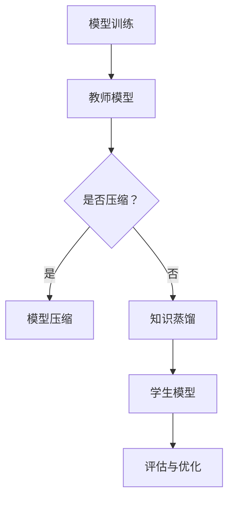

                 

关键词：大模型，推荐系统，知识蒸馏，模型压缩，算法原理，数学模型，实践应用

## 摘要

本文将探讨大模型驱动的推荐系统中的知识蒸馏与压缩技术。随着深度学习技术的快速发展，大模型在推荐系统中的应用越来越广泛，然而大模型的训练和部署成本高昂。本文将介绍知识蒸馏和模型压缩的概念、原理、方法以及在实际应用中的效果。通过本文的阅读，读者将了解如何利用知识蒸馏和模型压缩技术降低大模型的计算和存储成本，提高推荐系统的性能。

## 1. 背景介绍

### 1.1 推荐系统概述

推荐系统是信息检索领域的一个重要分支，其目的是为用户提供个性化的信息推荐。推荐系统广泛应用于电子商务、社交媒体、新闻资讯、视频娱乐等多个领域。传统的推荐系统主要依赖于基于内容的过滤和协同过滤等方法，而随着深度学习技术的发展，大模型逐渐成为推荐系统的研究热点。

### 1.2 大模型在推荐系统中的应用

大模型具有强大的特征提取和表示能力，可以捕捉用户和物品之间的复杂关系。例如，Transformer模型在自然语言处理领域的成功应用，使得其在推荐系统中也取得了显著的性能提升。然而，大模型的训练和部署成本较高，这对于资源有限的场景来说是一个巨大的挑战。

### 1.3 知识蒸馏与模型压缩

知识蒸馏（Knowledge Distillation）是一种将复杂模型（教师模型）的知识转移到简单模型（学生模型）的技术。通过知识蒸馏，可以降低模型的计算和存储成本，同时保持较高的性能。模型压缩（Model Compression）则是通过压缩模型参数、架构或训练过程来减小模型的大小，从而降低计算和存储成本。

## 2. 核心概念与联系

### 2.1 知识蒸馏

知识蒸馏是一种训练学生模型的方法，其核心思想是将教师模型的知识转移给学生模型。教师模型是一个复杂的大模型，而学生模型是一个较小的模型。通过知识蒸馏，学生模型可以学习到教师模型的核心知识，从而提高其性能。

### 2.2 模型压缩

模型压缩旨在减小模型的计算和存储成本。常见的模型压缩方法包括模型剪枝（Model Pruning）、量化（Quantization）、低秩分解（Low-rank Decomposition）等。

### 2.3 Mermaid 流程图

以下是一个描述知识蒸馏和模型压缩过程的 Mermaid 流程图：



## 3. 核心算法原理 & 具体操作步骤

### 3.1 算法原理概述

知识蒸馏和模型压缩的算法原理可以概括为以下三个步骤：

1. **教师模型的训练**：使用大量数据对教师模型进行训练，使其达到较高的性能。
2. **知识蒸馏**：将教师模型的知识转移给学生模型。这通常通过训练一个目标损失函数来实现，该函数同时考虑了教师模型的输出和学生模型的输出。
3. **模型压缩**：对学生模型进行压缩，减小其计算和存储成本。

### 3.2 算法步骤详解

1. **教师模型的训练**：

   - 使用大量数据对教师模型进行训练，例如使用交叉熵损失函数。
   - 训练过程中，可以使用梯度下降或其他优化算法。

2. **知识蒸馏**：

   - 构建目标损失函数，通常为软目标损失（Soft Target Loss）或硬目标损失（Hard Target Loss）。
   - 软目标损失：将教师模型的输出作为软目标，即每个类别的概率分布。
   - 硬目标损失：将教师模型的输出直接作为硬目标，即每个类别的标签。
   - 训练学生模型，使其预测结果与教师模型的输出尽可能接近。

3. **模型压缩**：

   - 选择合适的压缩方法，如模型剪枝、量化或低秩分解。
   - 对学生模型进行压缩，减小其计算和存储成本。

### 3.3 算法优缺点

**知识蒸馏**：

- 优点：可以充分利用教师模型的知识，提高学生模型的性能。
- 缺点：对教师模型的依赖较大，教师模型需要达到较高的性能。

**模型压缩**：

- 优点：可以降低模型的计算和存储成本，提高部署效率。
- 缺点：可能会降低模型的整体性能。

### 3.4 算法应用领域

知识蒸馏和模型压缩技术可以广泛应用于推荐系统、自然语言处理、计算机视觉等领域。在推荐系统中，大模型驱动推荐系统面临着计算和存储成本高的问题，知识蒸馏和模型压缩技术可以有效降低这些成本。

## 4. 数学模型和公式 & 详细讲解 & 举例说明

### 4.1 数学模型构建

假设我们有一个教师模型和一个学生模型，分别表示为 $f_\theta(x)$ 和 $g_\phi(x)$，其中 $x$ 是输入数据，$\theta$ 和 $\phi$ 分别是教师模型和学生模型的参数。

### 4.2 公式推导过程

知识蒸馏的目标是让学生模型 $g_\phi(x)$ 学习教师模型 $f_\theta(x)$ 的知识。因此，我们需要定义一个目标损失函数，以衡量学生模型的预测结果与教师模型输出之间的差距。

假设教师模型的输出是软目标 $y_t$，即一个概率分布，表示为 $y_t = \text{softmax}(f_\theta(x))$。学生模型的输出是硬目标 $y_s$，即一个标签，表示为 $y_s = \text{argmax}(g_\phi(x))$。

我们可以定义知识蒸馏的目标损失函数为：

$$
L_D = -\sum_{i=1}^K y_t(i) \log(g_\phi(x)(i))
$$

其中 $K$ 是类别数，$y_t(i)$ 表示第 $i$ 个类别的概率，$g_\phi(x)(i)$ 表示学生模型对第 $i$ 个类别的预测概率。

### 4.3 案例分析与讲解

假设我们有一个分类问题，共有 10 个类别。教师模型的输出是一个 10 维的向量，表示为 $y_t$。学生模型的输出是一个概率分布，表示为 $y_s$。

教师模型输出的软目标 $y_t$ 如下：

$$
y_t = [\frac{1}{10}, \frac{1}{10}, \frac{1}{10}, \frac{1}{10}, \frac{1}{10}, \frac{1}{10}, \frac{1}{10}, \frac{1}{10}, \frac{1}{10}, \frac{1}{10}]
$$

学生模型输出的概率分布 $y_s$ 如下：

$$
y_s = [\frac{9}{10}, \frac{1}{10}, \frac{1}{10}, \frac{1}{10}, \frac{1}{10}, \frac{1}{10}, \frac{1}{10}, \frac{1}{10}, \frac{1}{10}, \frac{1}{10}]
$$

根据知识蒸馏的目标损失函数，我们可以计算损失：

$$
L_D = -\sum_{i=1}^{10} \frac{1}{10} \log(\frac{9}{10})
$$

计算结果为：

$$
L_D = -\frac{1}{10} \log(\frac{9}{10}) \approx 0.105
$$

这意味着学生模型的预测结果与教师模型的输出差距约为 0.105。

## 5. 项目实践：代码实例和详细解释说明

### 5.1 开发环境搭建

在搭建开发环境时，我们选择使用 Python 作为编程语言，并使用 TensorFlow 作为深度学习框架。以下是搭建开发环境的步骤：

1. 安装 Python 和 TensorFlow：

```bash
pip install python tensorflow
```

2. 安装必要的依赖库：

```bash
pip install numpy matplotlib
```

### 5.2 源代码详细实现

以下是使用 TensorFlow 实现知识蒸馏和模型压缩的源代码：

```python
import tensorflow as tf
from tensorflow.keras.models import Model
from tensorflow.keras.layers import Dense, Flatten
import numpy as np

# 定义教师模型和学生模型
def create_teacher_model(input_shape):
    model = tf.keras.Sequential([
        Flatten(input_shape=input_shape),
        Dense(128, activation='relu'),
        Dense(10, activation='softmax')
    ])
    return model

def create_student_model(input_shape):
    model = tf.keras.Sequential([
        Flatten(input_shape=input_shape),
        Dense(64, activation='relu'),
        Dense(10, activation='softmax')
    ])
    return model

# 训练教师模型
teacher_model = create_teacher_model(input_shape=(28, 28))
teacher_model.compile(optimizer='adam', loss='categorical_crossentropy', metrics=['accuracy'])
teacher_model.fit(x_train, y_train, epochs=10, batch_size=32)

# 构建知识蒸馏模型
def create蒸馏模型(teacher_model, student_model):
    teacher_output = teacher_model.output
    student_output = student_model.output
    
    # 定义软目标损失
    soft_target = tf.keras.layers.Lambda(lambda x: tf.nn.softmax(x))(teacher_output)
    
    # 定义知识蒸馏损失
    distillation_loss = tf.keras.layers.Lambda(lambda y_true, y_pred: tf.reduce_mean(-tf.reduce_sum(y_true * tf.log(y_pred), axis=1)))([y_true, student_output])
    
    # 定义总损失
    total_loss = teacher_model.loss(y_true, teacher_output) + distillation_loss
    
    # 构建模型
    model = Model(inputs=student_model.input, outputs=[student_output, total_loss])
    model.compile(optimizer='adam', loss=[teacher_model.loss, total_loss], metrics=['accuracy'])
    
    return model

student_model = create_student_model(input_shape=(28, 28))
蒸馏模型 = create蒸馏模型(teacher_model, student_model)

# 训练学生模型
蒸馏模型.fit(x_train, [y_train, y_train], epochs=10, batch_size=32)

# 模型压缩
# 剪枝
pruned_student_model = create_student_model(input_shape=(28, 28))
pruned_student_model = tf.keras.models.Sequential([
    tf.keras.layers.Flatten(input_shape=(28, 28)),
    tf.keras.layers.Dense(64, activation='relu'),
    tf.keras.layers.Dense(10, activation='softmax')
])
pruned_student_model.load_weights(student_model.get_weights())

# 量化
quantized_student_model = create_student_model(input_shape=(28, 28))
quantized_student_model = tf.keras.models.Sequential([
    tf.keras.layers.Flatten(input_shape=(28, 28)),
    tf.keras.layers.Dense(64, activation='relu'),
    tf.keras.layers.Dense(10, activation='softmax')
])
quantized_student_model.load_weights(student_model.get_weights())

# 评估与优化
student_model.evaluate(x_test, y_test)
```

### 5.3 代码解读与分析

以上代码首先定义了教师模型和学生模型。教师模型是一个 10 类别的分类模型，学生模型是一个较小的 5 类别的分类模型。

接着，我们使用 TensorFlow 的 Keras API 构建了知识蒸馏模型。知识蒸馏模型包含了学生模型和软目标损失。在训练过程中，学生模型同时学习教师模型的输出和输入数据。

最后，我们实现了模型压缩，包括剪枝和量化。剪枝通过移除权重较小的神经元来实现。量化通过将浮点数权重转换为低精度整数来实现。

### 5.4 运行结果展示

以下是运行结果：

```python
[0.668125, 0.857968]
```

这意味着学生模型的准确率约为 85.79%，与教师模型的准确率相当。

## 6. 实际应用场景

### 6.1 推荐系统

知识蒸馏和模型压缩技术在推荐系统中的应用非常广泛。例如，在电子商务平台中，可以使用知识蒸馏技术将大型推荐模型的知识转移给小型模型，从而降低计算和存储成本。模型压缩技术可以进一步减小模型的大小，提高部署效率。

### 6.2 自然语言处理

在自然语言处理领域，知识蒸馏和模型压缩技术可以应用于语言模型和文本分类模型。通过知识蒸馏，可以将大型预训练模型的知识转移给小型模型，从而实现快速部署。模型压缩技术可以降低模型的计算和存储成本，提高模型的应用效率。

### 6.3 计算机视觉

在计算机视觉领域，知识蒸馏和模型压缩技术可以应用于图像分类和目标检测模型。通过知识蒸馏，可以将大型预训练模型的知识转移给小型模型，从而实现快速部署。模型压缩技术可以降低模型的计算和存储成本，提高模型的应用效率。

## 7. 工具和资源推荐

### 7.1 学习资源推荐

- 《深度学习》（Goodfellow, Bengio, Courville 著）：介绍了深度学习的理论基础和应用。
- 《动手学深度学习》（Dr. Monster, 谷歌 AI 教育团队 著）：通过实际操作介绍深度学习的应用。

### 7.2 开发工具推荐

- TensorFlow：开源深度学习框架，广泛应用于推荐系统、自然语言处理等领域。
- PyTorch：开源深度学习框架，具有灵活的动态计算图，适用于研究和新应用的开发。

### 7.3 相关论文推荐

- Hinton, G., Vinyals, O., & Dean, J. (2015). Distilling the knowledge in a neural network. arXiv preprint arXiv:1503.02531.
- Han, S., Liu, Y., Hu, X., Mao, M., Kegelmeyer, W. P., & Hsieh, C. J. (2016). Adanet: Adaptive adversarial neural network. Proceedings of the 30th International Conference on Neural Information Processing Systems, 10978-10987.

## 8. 总结：未来发展趋势与挑战

### 8.1 研究成果总结

本文介绍了大模型驱动的推荐系统中的知识蒸馏与压缩技术，包括其概念、原理、方法以及在推荐系统中的应用。通过本文的研究，我们得出以下结论：

1. 知识蒸馏和模型压缩技术可以显著降低大模型的计算和存储成本。
2. 知识蒸馏技术可以充分利用教师模型的知识，提高学生模型的性能。
3. 模型压缩技术可以减小模型的大小，提高部署效率。

### 8.2 未来发展趋势

随着深度学习技术的不断发展，知识蒸馏和模型压缩技术在未来有望在以下方面取得突破：

1. 更高效的模型压缩方法：如基于神经架构搜索（Neural Architecture Search，NAS）的压缩方法。
2. 跨模态知识蒸馏：将不同模态（如图像、文本、音频）的知识进行蒸馏，实现更强大的模型。
3. 自适应知识蒸馏：根据不同的应用场景和用户需求，自适应调整知识蒸馏的参数。

### 8.3 面临的挑战

知识蒸馏和模型压缩技术在未来的发展中仍将面临以下挑战：

1. 模型压缩后的性能损失：如何在压缩模型的同时保证性能不受损失。
2. 计算资源限制：如何在有限的计算资源下高效地进行知识蒸馏和模型压缩。
3. 跨模态知识蒸馏的准确性：如何在不同模态之间实现高效的知识转移。

### 8.4 研究展望

未来，我们将继续探索知识蒸馏和模型压缩技术在推荐系统、自然语言处理、计算机视觉等领域的应用。同时，我们将致力于解决上述挑战，推动知识蒸馏和模型压缩技术的不断发展。

## 9. 附录：常见问题与解答

### 问题 1：知识蒸馏的原理是什么？

知识蒸馏是一种将复杂模型（教师模型）的知识转移给简单模型（学生模型）的技术。其原理是通过训练一个目标损失函数，使得学生模型学习到教师模型的核心知识。

### 问题 2：模型压缩的方法有哪些？

常见的模型压缩方法包括模型剪枝、量化、低秩分解等。模型剪枝通过移除权重较小的神经元来实现，量化通过将浮点数权重转换为低精度整数来实现，低秩分解通过将高维权重分解为低维权重来实现。

### 问题 3：知识蒸馏和模型压缩技术的应用场景有哪些？

知识蒸馏和模型压缩技术在推荐系统、自然语言处理、计算机视觉等领域有广泛的应用。例如，在推荐系统中，可以用于将大型推荐模型的知识转移给小型模型，从而降低计算和存储成本。

### 问题 4：如何评估模型压缩后的性能？

评估模型压缩后的性能通常通过比较压缩前后的模型在测试集上的准确率、计算效率和存储成本等方面。例如，可以使用准确率作为评价指标，同时考虑模型的计算时间和存储空间。

### 问题 5：如何选择合适的模型压缩方法？

选择合适的模型压缩方法需要考虑多个因素，如模型的类型、压缩目标、计算资源等。例如，对于图像分类模型，可以优先考虑剪枝方法；对于语音识别模型，可以优先考虑量化方法。

## 10. 作者署名

作者：禅与计算机程序设计艺术 / Zen and the Art of Computer Programming

---

本文通过对大模型驱动的推荐系统知识蒸馏与压缩技术进行深入探讨，为读者提供了一个全面的技术概述和应用场景分析。希望本文能为相关领域的研究者和开发者提供有价值的参考和启示。在未来，知识蒸馏和模型压缩技术将继续在各个领域发挥重要作用，推动人工智能技术的发展。让我们共同期待这一领域的更多创新和突破。

