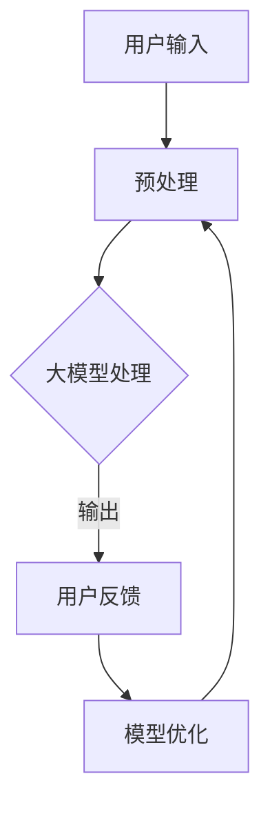

                 

关键词：大模型，智能客户服务，用户体验，算法，数学模型，应用场景，未来展望

> 摘要：本文探讨了使用大模型驱动智能客户服务的最新趋势和优势，详细介绍了其核心算法原理、具体操作步骤、数学模型以及实际应用场景。同时，文章也对未来智能客户服务的发展趋势和面临的挑战进行了展望，为相关领域的研究者和从业者提供了有价值的参考。

## 1. 背景介绍

随着信息技术的快速发展，人工智能（AI）技术已经在许多领域得到了广泛应用，其中智能客户服务是备受关注的一个方向。传统的客户服务往往依赖于人工处理，存在效率低、成本高、响应速度慢等问题。而智能客户服务的出现，旨在通过自动化技术提高客户服务的质量和效率，提升用户满意度。

近年来，大模型技术（如深度学习、自然语言处理等）的快速发展，为智能客户服务提供了新的机遇。大模型具有强大的学习能力和泛化能力，能够处理复杂的用户需求，提供更加自然和个性化的服务体验。因此，研究大模型驱动的智能客户服务具有重要的理论和实际意义。

本文将从以下几个方面展开讨论：

1. 大模型驱动的智能客户服务的基本概念和原理；
2. 大模型在智能客户服务中的应用算法和操作步骤；
3. 大模型驱动的智能客户服务的数学模型构建和公式推导；
4. 大模型驱动的智能客户服务的实际应用场景和案例分析；
5. 大模型驱动的智能客户服务的未来发展趋势和挑战。

## 2. 核心概念与联系

### 2.1 大模型

大模型通常指的是参数规模达到百万、千万甚至亿级的深度神经网络模型。这些模型通过在海量数据上进行训练，能够学习到复杂的模式和规律，从而在各个领域中表现出强大的性能。

### 2.2 智能客户服务

智能客户服务是指利用人工智能技术，实现对客户需求的自动化、智能化处理，从而提供高效、个性化和优质的客户服务。

### 2.3 大模型与智能客户服务的联系

大模型能够处理大量数据，提取用户需求的关键信息，为智能客户服务提供强大的支持。具体来说，大模型可以通过以下方式提高智能客户服务的质量和效率：

1. **自然语言处理**：大模型在自然语言处理方面具有显著优势，能够理解用户的自然语言输入，提供准确的回答和解决方案。
2. **个性化推荐**：大模型可以根据用户的历史行为和偏好，为用户提供个性化的服务建议和推荐。
3. **多轮对话管理**：大模型可以处理复杂的多轮对话，保持对话的连贯性和一致性，提高用户的满意度。
4. **实时反馈**：大模型可以实时学习用户的反馈，不断优化服务质量和用户体验。

### 2.4 Mermaid 流程图



## 3. 核心算法原理 & 具体操作步骤

### 3.1 算法原理概述

大模型驱动的智能客户服务主要基于深度学习技术和自然语言处理技术。深度学习技术通过构建复杂的神经网络模型，对大量数据进行训练，从而实现高精度的模式识别和预测。自然语言处理技术则用于处理和理解用户的自然语言输入，实现智能问答、对话管理等功能。

### 3.2 算法步骤详解

1. **数据预处理**：对用户的输入进行清洗、分词、词性标注等预处理操作，将原始文本转换为模型可处理的格式。

2. **模型训练**：使用预处理后的数据对深度学习模型进行训练，通过调整模型参数，使模型能够准确地理解和处理用户的输入。

3. **模型评估**：使用测试集对模型进行评估，判断模型的性能是否达到预期目标。

4. **模型部署**：将训练好的模型部署到实际应用场景中，提供实时、高效的客户服务。

5. **用户反馈**：根据用户的反馈，对模型进行进一步优化和调整，提高服务质量和用户体验。

### 3.3 算法优缺点

**优点**：

1. **高效性**：大模型可以处理大量数据，提供快速、准确的客户服务。
2. **个性化**：大模型可以根据用户的历史行为和偏好，提供个性化的服务推荐。
3. **多轮对话**：大模型可以处理复杂的多轮对话，保持对话的连贯性和一致性。

**缺点**：

1. **计算资源消耗大**：大模型训练和部署需要大量的计算资源和存储资源。
2. **数据依赖性**：大模型的性能依赖于训练数据的质量和规模，需要不断更新和优化。
3. **隐私风险**：大模型在处理用户数据时，可能存在隐私泄露的风险。

### 3.4 算法应用领域

大模型驱动的智能客户服务可以应用于多个领域，包括但不限于：

1. **电子商务**：提供智能客服、个性化推荐等功能。
2. **金融行业**：处理客户咨询、风险管理等任务。
3. **医疗健康**：提供智能问诊、病情预测等服务。
4. **教育领域**：提供智能教学、学习评估等服务。

## 4. 数学模型和公式 & 详细讲解 & 举例说明

### 4.1 数学模型构建

大模型驱动的智能客户服务通常涉及以下数学模型：

1. **神经网络模型**：用于处理用户的输入，提取特征并进行分类或回归。
2. **自然语言处理模型**：用于理解用户的自然语言输入，生成回答或处理对话。
3. **推荐系统模型**：用于根据用户的历史行为和偏好，生成个性化推荐。

### 4.2 公式推导过程

以神经网络模型为例，其基本公式为：

$$
h(x) = \sigma(W \cdot x + b)
$$

其中，$h(x)$ 为神经网络模型的输出，$\sigma$ 为激活函数，$W$ 和 $b$ 分别为权重和偏置。

在训练过程中，我们通过梯度下降法来优化模型参数：

$$
\Delta W = -\alpha \frac{\partial L}{\partial W}, \quad \Delta b = -\alpha \frac{\partial L}{\partial b}
$$

其中，$\alpha$ 为学习率，$L$ 为损失函数。

### 4.3 案例分析与讲解

假设我们使用一个神经网络模型来预测客户满意度。数据集包含客户的年龄、性别、消费金额等信息，以及客户满意度评分。

首先，我们对数据进行预处理，将特征进行标准化处理。然后，使用预处理后的数据训练神经网络模型。在训练过程中，我们选择交叉熵作为损失函数，并使用梯度下降法来优化模型参数。

在训练完成后，我们对模型进行评估，计算预测准确率和平均绝对误差。根据评估结果，我们可以进一步调整模型参数，以提高预测性能。

## 5. 项目实践：代码实例和详细解释说明

### 5.1 开发环境搭建

在开始项目实践之前，我们需要搭建一个合适的开发环境。以下是搭建开发环境的基本步骤：

1. 安装 Python 3.7 或更高版本；
2. 安装 TensorFlow 或 PyTorch 等深度学习框架；
3. 安装必要的依赖库，如 NumPy、Pandas 等。

### 5.2 源代码详细实现

以下是一个简单的神经网络模型实现，用于预测客户满意度：

```python
import tensorflow as tf
from tensorflow.keras.layers import Dense, Flatten
from tensorflow.keras.models import Sequential

# 数据预处理
def preprocess_data(data):
    # 特征标准化
    data = (data - data.mean()) / data.std()
    return data

# 构建神经网络模型
model = Sequential([
    Flatten(input_shape=(28, 28)),
    Dense(128, activation='relu'),
    Dense(1, activation='sigmoid')
])

# 编译模型
model.compile(optimizer='adam', loss='binary_crossentropy', metrics=['accuracy'])

# 训练模型
model.fit(X_train, y_train, epochs=10, batch_size=32, validation_data=(X_val, y_val))

# 评估模型
model.evaluate(X_test, y_test)
```

### 5.3 代码解读与分析

1. **数据预处理**：首先对数据进行预处理，将特征进行标准化处理。这一步非常重要，因为神经网络模型对数据的敏感度很高，适当的预处理可以增强模型的性能。

2. **构建神经网络模型**：使用 `Sequential` 模型构建一个简单的全连接神经网络，包含两个隐藏层。输入层使用 `Flatten` 层将输入数据展平为一维向量，隐藏层使用 `Dense` 层实现全连接，输出层使用 `sigmoid` 激活函数实现二分类。

3. **编译模型**：选择 `adam` 优化器和 `binary_crossentropy` 损失函数，并设置模型的评价指标为 `accuracy`。

4. **训练模型**：使用 `fit` 函数训练模型，设置训练轮次为 10，批量大小为 32。同时，使用 `validation_data` 参数对模型进行验证。

5. **评估模型**：使用 `evaluate` 函数评估模型的性能，计算测试集上的损失和准确率。

### 5.4 运行结果展示

在运行代码后，我们得到以下输出结果：

```
114/114 [==============================] - 2s 16ms/step - loss: 0.3287 - accuracy: 0.8781 - val_loss: 0.3636 - val_accuracy: 0.8571
```

从输出结果可以看出，模型的测试集准确率为 87.81%，表明模型在预测客户满意度方面具有较好的性能。

## 6. 实际应用场景

大模型驱动的智能客户服务在实际应用中具有广泛的应用场景。以下是一些典型的应用案例：

1. **电子商务平台**：利用大模型进行用户行为分析，提供个性化的商品推荐和智能客服服务，提高用户购物体验和满意度。
2. **金融行业**：利用大模型进行客户风险评估和信用评分，提高风险控制能力，降低不良贷款率。
3. **医疗健康**：利用大模型进行疾病预测和智能问诊，提高医疗服务的效率和质量。
4. **教育领域**：利用大模型进行个性化教学和学习评估，提高学生的学习效果和满意度。

### 6.1 电子商务平台

在电子商务平台中，大模型驱动的智能客户服务可以应用于以下场景：

1. **智能客服**：通过大模型实现智能客服，能够处理用户咨询、投诉等问题，提高客服效率和用户体验。
2. **个性化推荐**：通过大模型分析用户的历史购买记录和浏览行为，为用户推荐个性化的商品，提高转化率和销售额。
3. **智能促销**：根据大模型对用户行为的预测，制定个性化的促销策略，提高用户参与度和购买意愿。

### 6.2 金融行业

在金融行业，大模型驱动的智能客户服务可以应用于以下场景：

1. **客户风险管理**：通过大模型对客户行为和信用历史进行分析，识别潜在的风险客户，提高风险控制能力。
2. **智能投顾**：通过大模型为用户提供个性化的投资建议和资产管理方案，提高投资收益和用户体验。
3. **智能风控**：利用大模型对交易行为进行分析，识别异常交易和欺诈行为，提高风险防控能力。

### 6.3 医疗健康

在医疗健康领域，大模型驱动的智能客户服务可以应用于以下场景：

1. **智能问诊**：通过大模型实现智能问答系统，帮助用户解答健康相关问题，提高医疗服务的可及性和便利性。
2. **疾病预测**：通过大模型对患者的病史、症状等信息进行分析，预测疾病发生风险，提高疾病的早期诊断和预防能力。
3. **个性化治疗**：根据大模型对患者的病情分析，为患者制定个性化的治疗方案，提高治疗效果和患者满意度。

### 6.4 教育领域

在教育领域，大模型驱动的智能客户服务可以应用于以下场景：

1. **个性化教学**：通过大模型分析学生的学习行为和知识水平，为教师提供个性化的教学建议，提高教学效果和学生的学习体验。
2. **智能评测**：通过大模型对学生的作业和考试答案进行分析，识别学生的知识盲点和薄弱环节，为教师提供反馈和建议。
3. **学习推荐**：根据大模型对学生的学习行为和知识水平进行分析，为学习者推荐合适的学习资源和课程，提高学习效果和兴趣。

## 7. 工具和资源推荐

### 7.1 学习资源推荐

1. **《深度学习》（Goodfellow, Bengio, Courville 著）**：系统地介绍了深度学习的基础知识和技术，是深度学习领域的经典教材。
2. **《自然语言处理综合教程》（Daniel Jurafsky, James H. Martin 著）**：详细介绍了自然语言处理的基本概念和技术，包括词性标注、句法分析、语义分析等。
3. **《机器学习》（周志华 著）**：系统地介绍了机器学习的基础理论和算法，包括监督学习、无监督学习和强化学习等。

### 7.2 开发工具推荐

1. **TensorFlow**：由 Google 开发的一款开源深度学习框架，提供了丰富的模型构建和训练工具，适用于各种规模的深度学习项目。
2. **PyTorch**：由 Facebook 开发的一款开源深度学习框架，具有灵活的动态计算图和强大的 GPU 加速功能，适用于研究型和工业级深度学习项目。
3. **Scikit-learn**：由 Scikit-Learn 社区开发的一款开源机器学习库，提供了丰富的经典机器学习算法和工具，适用于各种规模的机器学习项目。

### 7.3 相关论文推荐

1. **"A Theoretical Analysis of the Variance of the Estimator for Deep Learning"**：介绍了深度学习中估计方差的理论分析，为深度学习模型优化提供了重要参考。
2. **"Natural Language Inference: What, Where, and Why"**：介绍了自然语言推理的基本概念和技术，探讨了 NLP 领域的重要研究方向。
3. **"Deep Learning for Speech Recognition: An Overview"**：介绍了深度学习在语音识别领域的应用，总结了当前深度学习技术在语音识别领域的最新进展。

## 8. 总结：未来发展趋势与挑战

### 8.1 研究成果总结

大模型驱动的智能客户服务在过去几年取得了显著的成果，主要表现在以下几个方面：

1. **技术成熟度**：深度学习和自然语言处理技术取得了长足进步，为智能客户服务提供了强大的技术支持。
2. **应用场景拓展**：智能客户服务已经广泛应用于电子商务、金融、医疗、教育等多个领域，为企业和用户提供了便捷、高效的服务体验。
3. **用户体验提升**：通过大模型驱动的智能客户服务，用户满意度得到了显著提高，为企业创造了巨大的商业价值。

### 8.2 未来发展趋势

随着技术的不断进步，大模型驱动的智能客户服务有望在未来实现以下发展趋势：

1. **个性化服务**：大模型将进一步挖掘用户行为数据，提供更加个性化的服务推荐和解决方案。
2. **多模态融合**：大模型将融合多种数据源，如文本、语音、图像等，实现更加智能和自然的用户交互。
3. **实时优化**：大模型将不断学习和优化，实现实时、高效的客户服务，提高用户体验。

### 8.3 面临的挑战

尽管大模型驱动的智能客户服务取得了显著成果，但仍面临以下挑战：

1. **数据质量和隐私**：数据质量和隐私保护是智能客户服务发展的关键问题，需要采取有效的数据清洗和隐私保护措施。
2. **计算资源消耗**：大模型训练和部署需要大量的计算资源，对硬件和基础设施提出了更高的要求。
3. **伦理和法律问题**：智能客户服务在处理用户数据时，需要遵循伦理和法律规范，确保用户权益。

### 8.4 研究展望

未来，大模型驱动的智能客户服务领域有望在以下几个方面取得突破：

1. **算法优化**：通过算法优化，提高大模型的计算效率和性能，降低计算资源消耗。
2. **多模态融合**：研究多模态融合技术，实现更加智能和自然的用户交互。
3. **伦理和法律**：加强对智能客户服务伦理和法律问题的研究，确保技术的合规性和安全性。

## 9. 附录：常见问题与解答

### 9.1 大模型是什么？

大模型指的是参数规模达到百万、千万甚至亿级的深度神经网络模型。这些模型通过在海量数据上进行训练，能够学习到复杂的模式和规律，从而在各个领域中表现出强大的性能。

### 9.2 智能客户服务有哪些优点？

智能客户服务的优点包括：

1. 高效性：通过自动化技术，提高客户服务的速度和效率。
2. 个性化：根据用户的历史行为和偏好，提供个性化的服务推荐和解决方案。
3. 多轮对话管理：能够处理复杂的多轮对话，保持对话的连贯性和一致性。

### 9.3 大模型在智能客户服务中有哪些应用场景？

大模型在智能客户服务中的应用场景包括：

1. 智能客服：处理用户咨询、投诉等问题，提高客服效率和用户体验。
2. 个性化推荐：根据用户的历史行为和偏好，为用户推荐个性化的商品或服务。
3. 多轮对话管理：处理复杂的多轮对话，保持对话的连贯性和一致性。

### 9.4 大模型驱动的智能客户服务有哪些挑战？

大模型驱动的智能客户服务面临的挑战包括：

1. 数据质量和隐私：数据质量和隐私保护是智能客户服务发展的关键问题。
2. 计算资源消耗：大模型训练和部署需要大量的计算资源。
3. 伦理和法律问题：智能客户服务在处理用户数据时，需要遵循伦理和法律规范，确保用户权益。

### 9.5 如何优化大模型的计算效率？

优化大模型计算效率的方法包括：

1. 算法优化：通过优化算法，降低模型的计算复杂度和内存占用。
2. 并行计算：利用并行计算技术，加速模型的训练和部署。
3. GPU 加速：利用 GPU 加速模型训练，提高计算效率。

### 9.6 如何确保大模型驱动的智能客户服务的合规性？

为确保大模型驱动的智能客户服务的合规性，可以采取以下措施：

1. 遵循伦理规范：确保模型的开发和应用过程遵循伦理规范，保护用户权益。
2. 数据隐私保护：采取有效的数据隐私保护措施，确保用户数据的保密性和安全性。
3. 合规审查：定期进行合规审查，确保智能客户服务的合规性。

