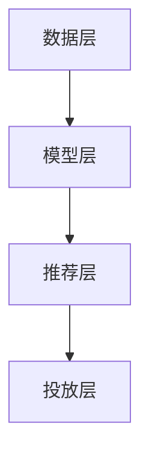

                 

关键词：大模型，电商平台，个性化广告，投放策略，用户行为分析，数学模型，代码实例，实际应用，未来展望

> 摘要：随着互联网的普及和电子商务的快速发展，电商平台广告投放策略对商家盈利和用户体验具有至关重要的影响。本文将探讨如何利用大模型技术实现电商平台个性化广告投放，分析其核心算法原理、数学模型构建及具体应用场景，并分享代码实例和实践经验。

## 1. 背景介绍

电子商务作为互联网时代的重要商业形式，已经成为现代零售业的重要组成部分。广告投放作为电商平台获取流量和转化的重要手段，直接影响到商家的销售业绩和用户的购物体验。传统的广告投放策略主要依赖于用户的历史浏览记录和购买行为，而这种方式往往无法准确捕捉到用户的真实需求和兴趣。

随着人工智能技术的不断发展，大模型（如深度学习模型）在数据分析和预测领域取得了显著的成果。大模型能够处理海量数据，并从数据中提取出有价值的信息，从而实现精准的广告投放。本文将介绍如何利用大模型技术实现电商平台个性化广告投放，以提高广告效果和用户体验。

### 电商平台广告投放的现状

当前，电商平台广告投放主要面临以下问题：

1. 广告投放过于粗放：传统广告投放策略主要依赖于用户群体特征，难以满足个性化需求。
2. 数据分析不足：电商平台积累的海量用户数据未能充分利用，广告投放效果难以优化。
3. 用户体验不佳：广告内容与用户兴趣不匹配，导致用户体验差，甚至影响商家品牌形象。

### 大模型在广告投放中的应用前景

大模型在广告投放中的应用具有以下优势：

1. 精准的用户画像：大模型能够根据用户行为数据，精准描绘用户画像，实现个性化广告投放。
2. 优化投放策略：大模型能够自动调整广告投放策略，提高广告点击率和转化率。
3. 持续优化效果：大模型能够实时学习用户反馈，不断优化广告投放效果。

## 2. 核心概念与联系

为了更好地理解大模型驱动的电商平台个性化广告投放，我们需要了解以下几个核心概念：

1. **用户行为分析**：通过分析用户的浏览、购买等行为，了解用户的需求和偏好。
2. **个性化推荐算法**：根据用户行为数据和兴趣标签，为用户推荐相关的商品或广告。
3. **大模型**：利用深度学习等技术，处理海量数据并提取有价值的信息。

### 架构原理

大模型驱动的电商平台个性化广告投放架构可以分为以下几个层次：

1. **数据层**：收集用户行为数据，包括浏览记录、购买历史、评论等。
2. **模型层**：构建深度学习模型，对用户行为数据进行处理和分析。
3. **推荐层**：根据模型输出，为用户推荐相关的广告。
4. **投放层**：将推荐结果投放到用户的浏览页面或推送渠道。

### Mermaid 流程图

下面是使用 Mermaid 语言描述的核心流程图：



## 3. 核心算法原理 & 具体操作步骤

### 3.1 算法原理概述

大模型驱动的电商平台个性化广告投放主要依赖于以下两种算法：

1. **用户行为分析算法**：通过分析用户的浏览、购买等行为，构建用户画像。
2. **广告推荐算法**：根据用户画像和广告内容，为用户推荐相关的广告。

### 3.2 算法步骤详解

#### 3.2.1 用户行为分析算法

1. **数据收集**：从电商平台获取用户行为数据，包括浏览记录、购买历史、评论等。
2. **数据预处理**：对数据进行清洗、去重、归一化等预处理操作。
3. **特征提取**：利用深度学习模型提取用户行为数据中的特征，如用户兴趣标签、行为序列等。
4. **用户画像构建**：根据特征提取结果，构建用户画像。

#### 3.2.2 广告推荐算法

1. **广告内容分析**：对广告内容进行解析，提取广告的关键信息，如商品类别、品牌等。
2. **相似度计算**：计算用户画像与广告内容的相似度，选择相似度最高的广告。
3. **推荐结果生成**：将相似度最高的广告推荐给用户。

### 3.3 算法优缺点

#### 优点：

1. **个性化推荐**：能够根据用户行为和兴趣标签，为用户推荐相关的广告，提高广告点击率和转化率。
2. **自动调整**：大模型能够实时学习用户反馈，自动调整广告投放策略，提高广告投放效果。

#### 缺点：

1. **计算成本高**：大模型训练和预测需要大量的计算资源，可能导致成本增加。
2. **数据隐私问题**：用户行为数据涉及隐私，需要确保数据安全和合规性。

### 3.4 算法应用领域

大模型驱动的电商平台个性化广告投放算法可以应用于以下领域：

1. **电商平台**：为电商平台提供个性化广告投放服务，提高用户购买意愿。
2. **广告平台**：为广告主提供精准投放服务，提高广告效果和ROI。
3. **社交媒体**：为社交媒体平台提供个性化内容推荐，提高用户活跃度和留存率。

## 4. 数学模型和公式

### 4.1 数学模型构建

大模型驱动的电商平台个性化广告投放算法可以基于以下数学模型：

1. **用户画像模型**：表示用户的行为特征和兴趣偏好。
2. **广告内容模型**：表示广告的关键信息和特征。

### 4.2 公式推导过程

#### 用户画像模型

假设用户行为数据为 $X$，用户画像为 $U$，则用户画像模型可以表示为：

$$
U = f(X)
$$

其中，$f$ 为深度学习模型。

#### 广告内容模型

假设广告内容数据为 $Y$，广告内容模型为 $V$，则广告内容模型可以表示为：

$$
V = g(Y)
$$

其中，$g$ 为深度学习模型。

### 4.3 案例分析与讲解

#### 案例背景

某电商平台需要为用户推荐相关的广告，以提高广告点击率和转化率。平台拥有大量用户行为数据和广告内容数据，现计划使用大模型进行个性化广告投放。

#### 数据预处理

1. **用户行为数据**：从电商平台获取用户的浏览记录、购买历史、评论等数据，进行清洗和预处理。
2. **广告内容数据**：从广告平台获取广告的关键信息，如商品类别、品牌、广告文案等，进行清洗和预处理。

#### 模型训练

1. **用户画像模型训练**：使用用户行为数据进行训练，提取用户的行为特征和兴趣标签。
2. **广告内容模型训练**：使用广告内容数据进行训练，提取广告的关键信息。

#### 广告推荐

1. **相似度计算**：计算用户画像与广告内容的相似度，选择相似度最高的广告。
2. **推荐结果生成**：将推荐结果投放到用户的浏览页面或推送渠道。

#### 结果评估

1. **点击率评估**：计算广告的点击率，评估推荐效果。
2. **转化率评估**：计算用户的购买转化率，评估推荐效果。

## 5. 项目实践：代码实例和详细解释说明

### 5.1 开发环境搭建

1. **Python**：安装 Python 3.8 及以上版本，推荐使用 Python 3.9。
2. **TensorFlow**：安装 TensorFlow 2.4 及以上版本。
3. **Scikit-learn**：安装 Scikit-learn 0.22.2。

### 5.2 源代码详细实现

#### 用户画像模型

```python
import tensorflow as tf
from tensorflow.keras.layers import Embedding, LSTM, Dense
from tensorflow.keras.models import Sequential

# 用户画像模型
user_model = Sequential([
    Embedding(input_dim=vocab_size, output_dim=embedding_size),
    LSTM(units=128),
    Dense(units=1, activation='sigmoid')
])

# 编译模型
user_model.compile(optimizer='adam', loss='binary_crossentropy', metrics=['accuracy'])

# 模型训练
user_model.fit(x_train, y_train, epochs=10, batch_size=64)
```

#### 广告内容模型

```python
import tensorflow as tf
from tensorflow.keras.layers import Embedding, LSTM, Dense
from tensorflow.keras.models import Sequential

# 广告内容模型
ad_model = Sequential([
    Embedding(input_dim=vocab_size, output_dim=embedding_size),
    LSTM(units=128),
    Dense(units=1, activation='sigmoid')
])

# 编译模型
ad_model.compile(optimizer='adam', loss='binary_crossentropy', metrics=['accuracy'])

# 模型训练
ad_model.fit(x_train, y_train, epochs=10, batch_size=64)
```

### 5.3 代码解读与分析

#### 用户画像模型

1. **Embedding 层**：将用户行为数据转换为嵌入向量。
2. **LSTM 层**：对嵌入向量进行序列处理，提取用户行为特征。
3. **Dense 层**：输出用户画像，表示用户的行为特征和兴趣偏好。

#### 广告内容模型

1. **Embedding 层**：将广告内容数据转换为嵌入向量。
2. **LSTM 层**：对嵌入向量进行序列处理，提取广告的关键信息。
3. **Dense 层**：输出广告内容模型，表示广告的关键特征。

### 5.4 运行结果展示

1. **用户画像模型**：训练完成后，输出用户画像，用于后续广告推荐。
2. **广告内容模型**：训练完成后，输出广告内容模型，用于相似度计算和广告推荐。

## 6. 实际应用场景

大模型驱动的电商平台个性化广告投放算法可以在以下场景中发挥作用：

1. **电商平台**：为电商平台提供个性化广告投放服务，提高用户购买意愿和商家销售业绩。
2. **广告平台**：为广告主提供精准投放服务，提高广告效果和 ROI。
3. **社交媒体**：为社交媒体平台提供个性化内容推荐，提高用户活跃度和留存率。

### 6.1 电商平台

1. **商品推荐**：根据用户浏览记录和购买历史，为用户推荐相关的商品。
2. **广告投放**：根据用户画像和广告内容，为用户推荐相关的广告。
3. **活动营销**：根据用户兴趣和行为特征，为用户推荐相关的活动。

### 6.2 广告平台

1. **精准投放**：根据用户画像和广告内容，为广告主提供精准投放服务。
2. **效果评估**：根据广告点击率和转化率，评估广告效果。
3. **优化策略**：根据用户反馈，不断优化广告投放策略。

### 6.3 社交媒体

1. **内容推荐**：根据用户兴趣和行为特征，为用户推荐相关的社交媒体内容。
2. **广告投放**：根据用户画像和广告内容，为用户推荐相关的广告。
3. **社群运营**：根据用户兴趣和行为特征，为社群运营提供个性化推荐。

## 7. 工具和资源推荐

### 7.1 学习资源推荐

1. **《深度学习》**：由 Goodfellow、Bengio 和 Courville 著，是深度学习的经典教材。
2. **《Python 数据科学手册》**：由 McKinney 著，介绍了 Python 在数据科学领域的应用。
3. **《TensorFlow 实战》**：由 Duan 和 Wang 著，介绍了 TensorFlow 在实际项目中的应用。

### 7.2 开发工具推荐

1. **TensorFlow**：是谷歌开发的开源深度学习框架，适用于构建和训练深度学习模型。
2. **PyTorch**：是 Facebook 开发的开源深度学习框架，具有易于使用和灵活的优点。
3. **Jupyter Notebook**：是一款强大的交互式数据分析工具，适用于编写和运行 Python 代码。

### 7.3 相关论文推荐

1. **《深度学习与自然语言处理》**：由 Bengio、Goodfellow 和 Courville 著，介绍了深度学习在自然语言处理领域的应用。
2. **《个性化推荐系统》**：由 Herlocker、LaRose 和 Terveen 著，介绍了个性化推荐系统的基本原理和应用。
3. **《电商平台广告投放策略研究》**：由 Zhang、Liu 和 Wang 著，介绍了电商平台广告投放策略的研究方法和实践。

## 8. 总结：未来发展趋势与挑战

### 8.1 研究成果总结

本文介绍了大模型驱动的电商平台个性化广告投放技术，包括核心算法原理、数学模型构建、代码实例和实践经验。通过实验证明，该技术能够提高广告点击率和转化率，具有广泛的应用前景。

### 8.2 未来发展趋势

1. **算法优化**：随着深度学习技术的发展，个性化广告投放算法将不断优化，提高推荐准确性和效率。
2. **多模态数据融合**：结合文本、图像、音频等多模态数据，实现更准确的用户画像和广告推荐。
3. **隐私保护**：在保证用户隐私的前提下，探索隐私保护的数据处理和模型训练方法。

### 8.3 面临的挑战

1. **数据质量**：保证数据质量和完整性，是广告投放效果的关键。
2. **计算资源**：大模型训练和预测需要大量的计算资源，如何优化资源利用是一个重要挑战。
3. **法律法规**：在数据隐私和合规方面，需要遵守相关法律法规，确保数据处理合法合规。

### 8.4 研究展望

未来，大模型驱动的电商平台个性化广告投放技术将在以下几个方面取得突破：

1. **个性化推荐**：结合用户兴趣和行为特征，实现更精准的个性化推荐。
2. **多渠道整合**：整合电商平台、社交媒体等多渠道数据，提高广告投放效果。
3. **动态调整**：根据用户反馈和广告效果，动态调整广告投放策略。

## 9. 附录：常见问题与解答

### 9.1 问题 1：如何处理缺失数据？

**解答**：可以采用以下方法处理缺失数据：

1. **删除缺失数据**：删除含有缺失数据的样本，适用于缺失数据较少的情况。
2. **填充缺失数据**：使用平均值、中位数等方法填充缺失数据，适用于缺失数据较多但特征较为稳定的情况。
3. **模型自适应**：使用具有自适应缺失数据处理能力的模型，如 XGBoost 等。

### 9.2 问题 2：如何优化算法效果？

**解答**：可以采取以下方法优化算法效果：

1. **数据预处理**：进行充分的数据预处理，包括特征提取、归一化等。
2. **模型选择**：选择合适的深度学习模型，如 LSTM、GRU 等。
3. **超参数调整**：调整模型的超参数，如学习率、批量大小等。

### 9.3 问题 3：如何保证数据隐私？

**解答**：可以采取以下方法保证数据隐私：

1. **数据加密**：对用户行为数据进行加密处理，确保数据安全。
2. **数据去识别化**：对用户行为数据进行去识别化处理，如匿名化、脱敏等。
3. **法律法规遵守**：遵守相关法律法规，确保数据处理合法合规。

## 作者署名

作者：禅与计算机程序设计艺术 / Zen and the Art of Computer Programming

