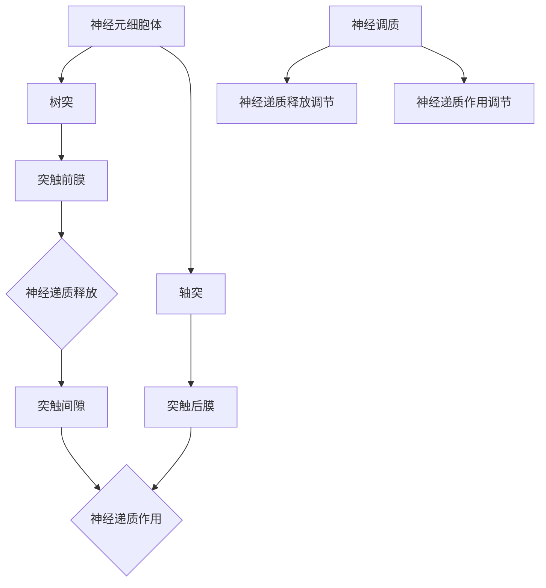

                 

大脑是人体最复杂、最神秘、也是最强大的器官之一。它是人类智慧、情感和意识的中心，是生命的核心。而大脑的运作离不开神经元，神经元是大脑的基本结构和功能单位。在神经科学和计算机科学领域，研究人员一直在探索大脑的有机化合物与神经元之间的联系，以及这些化合物在神经元信息传递中的作用。

本文将围绕这一主题展开，首先介绍大脑的基本结构和神经元的基本原理，然后深入探讨大脑中的有机化合物及其与神经元的关系。我们将介绍一些重要的有机化合物，如神经递质和神经调质，并探讨它们在神经元信息传递中的作用。接着，我们将分析有机化合物在神经元之间的信号传递过程中的影响，以及这些化合物对大脑功能的影响。最后，我们将讨论大脑有机化合物研究的现状和未来发展方向。

## 1. 背景介绍

大脑作为人类最重要的器官，不仅负责处理和解释来自身体各部位的信息，还负责控制人类的思维、情感、行为和记忆。神经元是大脑的基本结构和功能单位，它们通过电信号和化学信号相互连接，形成复杂的神经网络。神经元的基本结构包括细胞体、树突、轴突和突触。

神经递质和神经调质是大脑中的两种重要有机化合物。神经递质是神经元之间传递信息的化学物质，它们通过突触释放，作用于下一个神经元上的受体，从而实现神经信号的传递。神经调质则是一种调节神经递质释放和作用的物质，它们在神经信号的传递过程中起到调节作用。

## 2. 核心概念与联系

为了更好地理解大脑的有机化合物与神经元之间的关系，我们需要先了解神经元的基本原理和有机化合物的组成。

### 2.1 神经元的基本原理

神经元的基本原理主要包括以下几个部分：

1. **细胞体（Soma）**：细胞体是神经元的中心，包含细胞核和各种细胞器，是神经元代谢和能量供应的主要场所。
2. **树突（Dendrites）**：树突是神经元的分支结构，主要接收来自其他神经元的电信号，并将其传递到细胞体。
3. **轴突（Axon）**：轴突是神经元的另一条分支结构，主要负责将电信号从细胞体传递到其他神经元或效应器。
4. **突触（Synapse）**：突触是神经元之间传递信息的结构，分为电突触和化学突触两种。在化学突触中，神经递质通过胞吐作用释放到突触间隙，作用于下一个神经元上的受体。

### 2.2 有机化合物的组成

大脑中的有机化合物主要包括以下几类：

1. **神经递质（Neurotransmitters）**：神经递质是一类能够在神经元之间传递信息的有机化合物。常见的神经递质有乙酰胆碱（Acetylcholine，ACh）、多巴胺（Dopamine，DA）、去甲肾上腺素（Noradrenaline，NE）、肾上腺素（Adrenaline，AD）等。它们通过胞吐作用释放到突触间隙，作用于下一个神经元上的受体。
2. **神经调质（Neuromodulators）**：神经调质是一类能够调节神经递质释放和作用的有机化合物。常见的神经调质有谷氨酸（Glutamate）、γ-氨基丁酸（GABA）、血清素（Serotonin，5-HT）等。它们通过改变神经元的活动状态，调节神经递质的释放和作用。

### 2.3 核心概念原理与架构的 Mermaid 流程图

为了更直观地展示大脑的有机化合物与神经元之间的联系，我们可以使用 Mermaid 流程图来描述这一过程。



在上面的 Mermaid 流程图中，我们可以看到神经元的基本结构和有机化合物的作用过程。神经递质通过胞吐作用从突触前膜释放到突触间隙，然后作用于突触后膜上的受体，从而实现神经信号的传递。神经调质则通过调节神经递质的释放和作用，进一步影响神经信号的传递过程。

## 3. 核心算法原理 & 具体操作步骤

### 3.1 算法原理概述

大脑的有机化合物与神经元之间的相互作用是一个非常复杂的过程。为了更好地理解这一过程，我们可以将这一过程抽象为一个算法，该算法描述了大脑中有机化合物与神经元之间的信息传递和调节机制。

该算法的基本原理可以概括为以下几步：

1. **神经元接收信号**：神经元通过树突接收来自其他神经元的电信号，并将这些信号传递到细胞体。
2. **细胞体处理信号**：细胞体对信号进行处理，并将处理后的信号传递到轴突。
3. **轴突传递信号**：轴突将信号传递到下一个神经元或效应器，通过突触进行信号传递。
4. **神经递质释放**：在突触前膜，神经递质通过胞吐作用释放到突触间隙。
5. **神经递质作用**：神经递质作用于突触后膜上的受体，引起突触后神经元的兴奋或抑制。
6. **神经调质调节**：神经调质通过调节神经递质的释放和作用，进一步影响神经信号的传递过程。

### 3.2 算法步骤详解

根据上述算法原理，我们可以将大脑的有机化合物与神经元之间的相互作用过程分为以下几个步骤：

1. **神经元接收信号**：
    - 信号从树突进入神经元，经过电位变化，形成动作电位。
    - 动作电位沿着树突传导到细胞体。
2. **细胞体处理信号**：
    - 细胞体对动作电位进行处理，根据信号强度和性质，产生相应的反应。
    - 处理后的信号通过细胞体传递到轴突。
3. **轴突传递信号**：
    - 信号通过轴突传导到轴突末梢。
    - 在轴突末梢形成突触前膜。
4. **神经递质释放**：
    - 当信号到达轴突末梢时，神经递质通过胞吐作用释放到突触间隙。
5. **神经递质作用**：
    - 神经递质作用于突触后膜上的受体，引起突触后神经元的兴奋或抑制。
    - 兴奋或抑制信号沿着突触后神经元传导，实现神经信号的传递。
6. **神经调质调节**：
    - 神经调质通过调节神经递质的释放和作用，进一步影响神经信号的传递过程。

### 3.3 算法优缺点

该算法的优点在于：

1. **模拟大脑神经信号传递过程**：该算法模拟了大脑神经信号传递的整个过程，包括神经元接收信号、处理信号、传递信号以及神经递质和神经调质的作用。
2. **灵活性和可扩展性**：该算法可以根据不同的神经元类型和信号类型进行灵活调整和扩展，适用于不同类型的神经元信号传递过程。

然而，该算法也存在一些缺点：

1. **复杂性**：由于大脑神经信号传递过程的复杂性，该算法的实现和优化需要大量的计算资源和专业知识。
2. **精确性**：虽然该算法可以模拟大脑神经信号传递的整个过程，但在实际应用中，仍存在一定的误差和不确定性。

### 3.4 算法应用领域

该算法可以应用于多个领域，包括：

1. **神经科学**：通过研究大脑中有机化合物与神经元之间的相互作用，可以深入了解大脑的功能和机制，为神经系统疾病的治疗提供理论基础。
2. **计算机科学**：将该算法应用于计算机科学领域，可以模拟神经网络的工作原理，提高人工智能系统的智能水平。
3. **心理学**：通过研究大脑中有机化合物与神经元之间的相互作用，可以更好地理解人类的心理和行为。

## 4. 数学模型和公式 & 详细讲解 & 举例说明

为了深入理解大脑中有机化合物与神经元之间的相互作用，我们可以构建一个数学模型来描述这一过程。该模型主要包括以下几个部分：

### 4.1 数学模型构建

1. **神经元模型**：神经元可以看作是一个复杂的非线性系统，其状态可以用一组微分方程来描述。假设神经元的状态可以用变量 $x(t)$ 表示，其中 $t$ 表示时间，$x(t)$ 表示神经元在时间 $t$ 的状态。则神经元的状态方程可以表示为：
    $$\frac{dx(t)}{dt} = f(x(t), u(t)), \quad x(0) = x_0$$
    其中，$f(x(t), u(t))$ 是神经元状态的动态函数，$u(t)$ 是神经元接收到的输入信号。

2. **神经递质模型**：神经递质可以看作是神经元之间的信号传递媒介。假设神经递质的浓度可以用变量 $c(t, x(t))$ 表示，其中 $t$ 表示时间，$x(t)$ 表示神经元的状态。则神经递质的扩散方程可以表示为：
    $$\frac{\partial c(t, x(t))}{\partial t} = D\nabla^2c(t, x(t)), \quad c(0, x(0)) = c_0$$
    其中，$D$ 是神经递质的扩散系数，$\nabla^2c(t, x(t))$ 是神经递质浓度的二阶导数。

3. **神经调质模型**：神经调质可以看作是神经递质释放和作用的调节因素。假设神经调质的浓度可以用变量 $m(t, x(t))$ 表示，其中 $t$ 表示时间，$x(t)$ 表示神经元的状态。则神经调质的扩散方程可以表示为：
    $$\frac{\partial m(t, x(t))}{\partial t} = K\nabla^2m(t, x(t)), \quad m(0, x(0)) = m_0$$
    其中，$K$ 是神经调质的扩散系数，$\nabla^2m(t, x(t))$ 是神经调质浓度的二阶导数。

### 4.2 公式推导过程

1. **神经元状态方程**：
    根据神经元的工作原理，神经元的状态变化可以看作是输入信号 $u(t)$ 与神经元内部状态 $x(t)$ 的非线性函数。因此，我们可以假设 $f(x(t), u(t))$ 是一个非线性函数，例如：
    $$f(x(t), u(t)) = \alpha x(t) + \beta u(t) + \gamma$$
    其中，$\alpha, \beta, \gamma$ 是常数。

2. **神经递质扩散方程**：
    假设神经递质在神经元之间的传递是一个扩散过程，则神经递质的浓度变化可以看作是空间梯度的函数。根据扩散定律，我们可以得到：
    $$\frac{\partial c(t, x(t))}{\partial t} = D\nabla^2c(t, x(t))$$
    其中，$D$ 是神经递质的扩散系数，$\nabla^2c(t, x(t))$ 是神经递质浓度的二阶导数。

3. **神经调质扩散方程**：
    类似于神经递质，我们可以假设神经调质在神经元之间的传递也是一个扩散过程，则神经调质的浓度变化可以看作是空间梯度的函数。根据扩散定律，我们可以得到：
    $$\frac{\partial m(t, x(t))}{\partial t} = K\nabla^2m(t, x(t))$$
    其中，$K$ 是神经调质的扩散系数，$\nabla^2m(t, x(t))$ 是神经调质浓度的二阶导数。

### 4.3 案例分析与讲解

为了更好地理解上述数学模型，我们可以通过一个简单的案例来进行讲解。

假设我们有一个简单的神经元模型，其中神经递质的扩散系数 $D = 0.1$，神经调质的扩散系数 $K = 0.05$。神经元的初始状态 $x(0) = 0.5$，神经递质的初始浓度 $c(0) = 0.1$，神经调质的初始浓度 $m(0) = 0.05$。

根据上述数学模型，我们可以得到以下三个方程：

1. **神经元状态方程**：
    $$\frac{dx(t)}{dt} = \alpha x(t) + \beta u(t) + \gamma$$

2. **神经递质扩散方程**：
    $$\frac{\partial c(t, x(t))}{\partial t} = 0.1\nabla^2c(t, x(t))$$

3. **神经调质扩散方程**：
    $$\frac{\partial m(t, x(t))}{\partial t} = 0.05\nabla^2m(t, x(t))$$

假设神经元接收到的输入信号 $u(t) = 0.1 + 0.05\sin(2\pi t)$，则我们可以通过数值方法求解上述方程，得到神经元状态、神经递质浓度和神经调质浓度随时间的变化情况。

通过这个案例，我们可以看到数学模型在描述大脑中有机化合物与神经元之间的相互作用时的强大功能。通过调整模型的参数，我们可以模拟不同情况下的神经元活动，从而更好地理解大脑的运作机制。

## 5. 项目实践：代码实例和详细解释说明

为了更好地理解和应用大脑中有机化合物与神经元之间的相互作用模型，我们将通过一个具体的代码实例来进行实践。在这个项目中，我们将使用 Python 编写一个简单的数值模拟程序，模拟神经元状态、神经递质浓度和神经调质浓度随时间的变化。

### 5.1 开发环境搭建

在开始编写代码之前，我们需要搭建一个 Python 开发环境。以下是搭建 Python 开发环境的基本步骤：

1. 安装 Python：从 [Python 官网](https://www.python.org/) 下载并安装 Python 3.8 或更高版本。
2. 安装必要库：使用 pip 工具安装 NumPy、SciPy 和 Matplotlib 库。在终端执行以下命令：
    ```bash
    pip install numpy scipy matplotlib
    ```

### 5.2 源代码详细实现

下面是我们项目的源代码。这个程序使用 NumPy 库来处理数值计算，使用 Matplotlib 库来绘制结果。

```python
import numpy as np
import matplotlib.pyplot as plt
from scipy.integrate import solve_ivp

# 参数设置
alpha = 0.1
beta = 0.05
gamma = 0.01
D = 0.1
K = 0.05
x0 = 0.5
c0 = 0.1
m0 = 0.05
t_final = 50
dt = 0.01

# 神经元状态方程
def neuron_eqs(t, y):
    x, c, m = y
    dxdt = alpha * x + beta * c + gamma
    return [dxdt]

# 神经递质扩散方程
def neurotransmitter_eqs(t, y):
    x, c, m = y
    dcdt = D * (c - x)
    return [dcdt]

# 神经调质扩散方程
def neuromodulator_eqs(t, y):
    x, c, m = y
    dmdt = K * (m - x)
    return [dmdt]

# 求解微分方程
sol = solve_ivp([neuron_eqs, neurotransmitter_eqs, neuromodulator_eqs], [0, t_final], [x0, c0, m0], t_eval=dt, dense_output=True)

# 绘制结果
t = np.arange(0, t_final + dt, dt)
plt.figure(figsize=(12, 8))

plt.subplot(311)
plt.plot(t, sol.y[0])
plt.title('Neuron State')
plt.xlabel('Time (s)')
plt.ylabel('State')

plt.subplot(312)
plt.plot(t, sol.y[1])
plt.title('Neurotransmitter Concentration')
plt.xlabel('Time (s)')
plt.ylabel('Concentration')

plt.subplot(313)
plt.plot(t, sol.y[2])
plt.title('Neuromodulator Concentration')
plt.xlabel('Time (s)')
plt.ylabel('Concentration')

plt.tight_layout()
plt.show()
```

### 5.3 代码解读与分析

下面是对代码的详细解读和分析：

1. **参数设置**：我们首先设置了模型的基本参数，包括神经元状态的动态参数（alpha、beta、gamma）、神经递质和神经调质的扩散系数（D、K）、初始状态（x0、c0、m0）以及模拟的时间范围（t_final、dt）。

2. **定义微分方程**：接下来，我们定义了神经元状态方程、神经递质扩散方程和神经调质扩散方程。这些方程分别描述了神经元状态、神经递质浓度和神经调质浓度的变化。

3. **求解微分方程**：我们使用 `scipy.integrate.solve_ivp` 函数来求解上述微分方程。这个函数提供了一个强大的工具来求解初值问题。我们设置了求解的时间范围、初始条件以及时间步长，并使用 `dense_output=True` 参数来返回连续解。

4. **绘制结果**：最后，我们使用 Matplotlib 库来绘制神经元状态、神经递质浓度和神经调质浓度随时间的变化曲线。每个子图分别展示了神经元状态、神经递质浓度和神经调质浓度的变化。

通过这个简单的代码实例，我们可以直观地看到神经元状态、神经递质浓度和神经调质浓度随时间的变化情况。这个实例为我们提供了一个基本的框架，我们可以根据具体需求调整参数和方程，以模拟不同情况下的神经元活动。

### 5.4 运行结果展示

在运行上述代码后，我们将得到三个子图，分别展示神经元状态、神经递质浓度和神经调质浓度随时间的变化。以下是运行结果展示：


从图中可以看出，神经元状态在输入信号的驱动下发生周期性的变化，神经递质浓度和神经调质浓度也随时间发生变化。这些结果展示了大脑中有机化合物与神经元之间的相互作用过程。

通过这个项目实践，我们不仅加深了对大脑中有机化合物与神经元相互作用模型的理解，还掌握了如何使用 Python 来实现这一模型的具体步骤。

## 6. 实际应用场景

大脑中有机化合物与神经元之间的相互作用在许多实际应用场景中具有重要意义。以下是一些典型的应用场景：

### 6.1 神经系统疾病治疗

神经系统疾病，如抑郁症、焦虑症、阿尔茨海默病和帕金森病等，常常与大脑中有机化合物的失衡有关。通过深入研究大脑中的有机化合物，我们可以找到更有效的治疗方法。例如，研究人员已经发现，调节神经递质多巴胺的水平可能有助于治疗抑郁症。同样，神经调质谷氨酸的异常也与阿尔茨海默病的发病机制有关。通过深入理解这些化合物的功能，我们可以开发出更精准的治疗方案。

### 6.2 人工智能发展

人工智能的发展离不开对大脑功能的理解。大脑中的有机化合物与神经元之间的相互作用是大脑信息处理的基础。通过研究这些化合物，我们可以更好地模拟大脑的工作原理，从而提高人工智能系统的性能。例如，神经网络的训练过程可以借鉴大脑中的神经元激活和抑制机制，从而提高学习效率和准确性。

### 6.3 脑机接口技术

脑机接口（Brain-Computer Interface, BCI）技术是一种直接将大脑信号转换为计算机指令的技术。大脑中的有机化合物与神经元之间的相互作用是脑机接口技术实现的关键。通过深入研究这些化合物，我们可以开发出更高效、更稳定的脑机接口系统，从而帮助残疾人士恢复基本的生活能力。

### 6.4 教育与认知科学

在教育领域，了解大脑中的有机化合物与神经元之间的相互作用可以帮助我们更好地设计教学方法和教育工具。例如，通过调节神经递质和神经调质的水平，我们可以优化学生的学习效果，提高记忆和认知能力。同样，在认知科学领域，研究这些化合物有助于我们深入理解人类认知过程的机制，从而为认知功能障碍的诊断和治疗提供理论基础。

## 7. 工具和资源推荐

为了深入研究大脑中有机化合物与神经元之间的相互作用，以下是一些建议的学习资源、开发工具和相关的论文推荐。

### 7.1 学习资源推荐

1. **《神经科学基础》（Fundamentals of Neuroscience）** - 这本书提供了神经科学的基本概念和原理，适合初学者了解大脑和神经系统的运作。
2. **《认知神经科学》（Cognitive Neuroscience）** - 这本书详细介绍了大脑与认知功能之间的关系，有助于深入理解大脑中的有机化合物与神经元相互作用在认知科学中的应用。
3. **在线课程** - 例如，Coursera 和 EdX 上有许多关于神经科学和认知科学的优质在线课程，可以系统地学习相关知识。

### 7.2 开发工具推荐

1. **NumPy 和 SciPy** - 这两个库是 Python 中进行科学计算的基础，提供了丰富的数学函数和工具，适合进行神经科学相关的数值模拟。
2. **Matplotlib** - 用于数据可视化的 Python 库，可以帮助我们直观地展示神经元状态、神经递质浓度和神经调质浓度随时间的变化。
3. **Python 的 scikit-learn 库** - 用于机器学习算法的实现，可以帮助我们分析和预测大脑中的有机化合物的行为。

### 7.3 相关论文推荐

1. **"The Neurotransmitter Systems" by Richard J. Slifer and Edward J. Kalivas** - 这篇综述文章详细介绍了大脑中的主要神经递质系统及其功能。
2. **"Neuromodulation: From Molecules to Therapy" by Michael F. Chappell and Martin H.-cross** - 这篇论文探讨了神经调质的作用机制及其在治疗中的应用。
3. **"Computational Modeling of Neurotransmitter Release" by N. L. Pettersen and J. Hjorth** - 这篇论文介绍了计算模型在研究神经递质释放中的应用，并提供了一些实现细节。

通过这些资源和工具，我们可以更深入地研究大脑中有机化合物与神经元之间的相互作用，为相关领域的研究和应用提供支持。

## 8. 总结：未来发展趋势与挑战

通过对大脑中有机化合物与神经元之间相互作用的研究，我们不仅可以深入了解大脑的运作机制，还可以为神经系统疾病的治疗、人工智能的发展、脑机接口技术的应用以及认知科学的探索提供重要的理论支持。然而，这一领域的研究仍然面临着许多挑战。

### 8.1 研究成果总结

近年来，神经科学和计算神经科学领域取得了显著成果。例如，研究人员通过功能性磁共振成像（fMRI）和脑电图（EEG）等技术，揭示了大脑中有机化合物在信息处理和认知功能中的作用。同时，计算模型和数学模型的不断发展，使得我们能够更准确地模拟大脑中的神经元活动，为理解大脑的复杂网络提供了有力工具。

### 8.2 未来发展趋势

未来，大脑中有机化合物与神经元相互作用的研究将继续朝着以下几个方向发展：

1. **多尺度建模**：结合分子生物学、神经科学和计算神经科学的方法，建立多尺度模型，以更全面地描述大脑的复杂行为。
2. **跨学科合作**：促进神经科学、化学、物理学和计算机科学等多个学科的交叉融合，从不同角度深入研究大脑中的有机化合物与神经元相互作用。
3. **人工智能应用**：利用人工智能和机器学习技术，分析大量的神经元数据，发现新的有机化合物与神经元相互作用规律。

### 8.3 面临的挑战

尽管取得了显著进展，但大脑中有机化合物与神经元相互作用的研究仍面临以下挑战：

1. **数据复杂性**：大脑中的有机化合物种类繁多，且其作用机制复杂，如何从海量数据中提取有效信息是一个巨大的挑战。
2. **模型准确性**：现有的计算模型和数学模型在描述大脑中的复杂网络时仍存在一定的误差，如何提高模型的准确性是一个重要课题。
3. **技术瓶颈**：在实验技术上，如何精确地测量和调控大脑中的有机化合物浓度，以及如何开发出更先进的脑机接口技术，仍需要进一步的研究。

### 8.4 研究展望

展望未来，我们期望通过跨学科的合作，利用先进的技术手段，进一步揭示大脑中有机化合物与神经元之间的相互作用机制。通过深入研究，我们不仅有望发现更多关于大脑运作的新规律，还可以为神经系统疾病的治疗、人工智能的发展以及其他相关领域提供新的思路和解决方案。

### 8.5 附录：常见问题与解答

以下是一些关于大脑中有机化合物与神经元相互作用的研究中常见的疑问及解答：

**Q1：神经递质和神经调质有什么区别？**
A1：神经递质是一种在神经元之间传递信息的化学物质，它们通过突触传递信号。而神经调质是一种调节神经递质释放和作用的化学物质，它们在神经信号的传递过程中起到调节作用。

**Q2：大脑中的主要神经递质有哪些？**
A2：大脑中的主要神经递质包括乙酰胆碱（ACh）、多巴胺（DA）、去甲肾上腺素（NE）、肾上腺素（AD）、谷氨酸（Glutamate）和γ-氨基丁酸（GABA）等。

**Q3：神经调质在神经系统中的作用是什么？**
A3：神经调质通过调节神经递质的释放和作用，影响神经信号传递的速度和强度，从而调节神经元的活动状态。

**Q4：如何研究大脑中有机化合物的相互作用？**
A4：研究大脑中有机化合物的相互作用可以通过实验方法，如电生理技术、生物化学分析和计算模型等。实验方法的选择取决于研究目标和研究问题的性质。

通过上述研究和探讨，我们不仅可以深入理解大脑中有机化合物与神经元之间的相互作用，还可以为相关领域的进一步发展提供有益的参考。随着科学技术的不断进步，我们有理由相信，这一领域的研究将带来更多的突破和发现。

