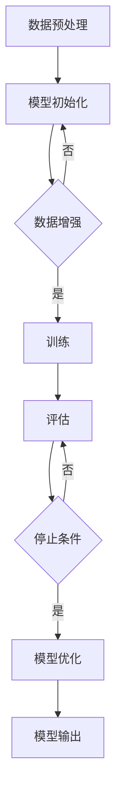

                 

关键词：大规模数据训练，基础模型，机器学习，深度学习，神经网络，算法原理，数学模型，项目实践，应用场景，发展趋势。

> 摘要：本文旨在深入探讨大规模数据训练的基础模型，从背景介绍到核心算法原理，再到数学模型和项目实践，全面解析大规模数据训练的技术细节和应用。通过本文的阅读，读者将能够理解大规模数据训练的基础模型如何工作，以及在各个领域的实际应用，为未来的研究和发展提供有益的启示。

## 1. 背景介绍

随着互联网和大数据技术的飞速发展，我们每天产生的数据量呈指数级增长。这些数据不仅包括文本、图像、音频等多媒体形式，还包括各类传感器和物联网设备产生的数据。如何有效地处理和分析这些大规模数据，成为当前人工智能和机器学习领域面临的重要挑战。

大规模数据训练作为一种关键技术，被广泛应用于各个领域，如自然语言处理、计算机视觉、推荐系统等。大规模数据训练的目标是通过从大量数据中学习，提取有用的特征和模式，从而提高模型的泛化能力和准确性。

### 大规模数据训练的挑战

- **数据量巨大**：大规模数据集通常包含数百万甚至数十亿个样本，这对存储、处理和传输都提出了巨大的挑战。
- **数据多样性**：大规模数据集通常包含多种类型的数据，如文本、图像、音频等，如何有效地融合这些数据类型成为难题。
- **数据不平衡**：大规模数据集中可能存在类别不平衡的情况，这会对模型的学习和预测产生不利影响。
- **过拟合**：大规模数据集可能包含过多噪声和冗余信息，容易导致模型过拟合。

### 大规模数据训练的意义

- **提高模型性能**：通过大规模数据训练，模型能够更好地学习数据中的潜在特征和模式，从而提高模型的性能和准确性。
- **拓宽应用领域**：大规模数据训练技术使得人工智能和机器学习在更多领域得到应用，如医疗诊断、金融风控、智能交通等。
- **推动科技进步**：大规模数据训练技术是推动人工智能和机器学习技术发展的关键，为未来科技发展提供了强有力的支持。

## 2. 核心概念与联系

### 2.1. 机器学习与深度学习

机器学习（Machine Learning，ML）是一门人工智能（Artificial Intelligence，AI）的分支，它通过算法从数据中自动学习和改进，实现预测和决策。深度学习（Deep Learning，DL）是机器学习的一个重要分支，它通过构建多层神经网络，对数据进行逐层抽象和表示，从而实现更复杂的特征提取和模式识别。

### 2.2. 神经网络

神经网络（Neural Networks，NN）是深度学习的基础，它模仿人脑神经元的工作原理，通过多层节点（神经元）进行信息传递和计算。神经网络的基本单元是神经元，每个神经元接收多个输入信号，通过加权求和后，通过激活函数进行非线性变换，产生输出信号。

### 2.3. 大规模数据训练的核心算法

大规模数据训练的核心算法包括梯度下降（Gradient Descent）、反向传播（Backpropagation）、正则化（Regularization）等。

- **梯度下降**：梯度下降是一种优化算法，它通过计算损失函数的梯度，逐步调整模型的参数，以最小化损失函数。
- **反向传播**：反向传播是一种计算神经网络损失函数梯度的算法，它通过反向传播误差信号，更新神经网络的权重和偏置。
- **正则化**：正则化是一种防止模型过拟合的技术，它通过在损失函数中添加正则项，限制模型的复杂度。

### 2.4. Mermaid 流程图

以下是大规模数据训练的 Mermaid 流程图：



## 3. 核心算法原理 & 具体操作步骤

### 3.1. 算法原理概述

大规模数据训练的核心算法包括以下几个步骤：

1. **数据预处理**：对原始数据进行清洗、归一化等处理，使其适合模型训练。
2. **模型初始化**：初始化模型的参数，如权重和偏置。
3. **数据增强**：通过数据增强技术，增加训练样本的多样性，防止过拟合。
4. **训练**：通过梯度下降等优化算法，逐步调整模型的参数，使模型在训练数据上达到最优。
5. **评估**：在验证数据集上评估模型的性能，调整模型参数。
6. **模型优化**：根据评估结果，优化模型的结构和参数，提高模型性能。
7. **模型输出**：将训练好的模型应用到实际任务中，生成预测结果。

### 3.2. 算法步骤详解

#### 3.2.1. 数据预处理

数据预处理是大规模数据训练的重要步骤，它包括以下内容：

- **数据清洗**：去除数据中的噪声和错误，如缺失值、异常值等。
- **数据归一化**：将不同特征的数据进行归一化处理，使其具有相同的尺度，如使用均值归一化或最小二乘归一化。
- **数据编码**：将分类特征转换为数值特征，如使用独热编码或标签编码。

#### 3.2.2. 模型初始化

模型初始化是指初始化模型的参数，如权重和偏置。常用的初始化方法包括随机初始化、高斯初始化和Xavier初始化等。

#### 3.2.3. 数据增强

数据增强是通过增加训练样本的多样性，防止过拟合。常用的数据增强方法包括旋转、缩放、裁剪、噪声添加等。

#### 3.2.4. 训练

训练是指通过优化算法，逐步调整模型的参数，使模型在训练数据上达到最优。常用的优化算法包括梯度下降、动量优化、Adam优化等。

#### 3.2.5. 评估

评估是指通过在验证数据集上评估模型的性能，调整模型参数。常用的评估指标包括准确率、召回率、F1 分数等。

#### 3.2.6. 模型优化

模型优化是指根据评估结果，优化模型的结构和参数，提高模型性能。常用的优化方法包括交叉验证、网格搜索等。

#### 3.2.7. 模型输出

模型输出是指将训练好的模型应用到实际任务中，生成预测结果。常用的应用场景包括图像分类、文本分类、推荐系统等。

### 3.3. 算法优缺点

#### 优点

- **高效性**：大规模数据训练算法能够快速处理大量数据，提高模型训练效率。
- **泛化能力**：通过数据增强和正则化技术，大规模数据训练算法能够提高模型的泛化能力。
- **灵活性**：大规模数据训练算法适用于多种数据类型和任务场景。

#### 缺点

- **计算资源消耗**：大规模数据训练算法需要大量的计算资源和存储空间。
- **训练时间较长**：对于大规模数据集，训练时间可能较长。
- **过拟合风险**：对于噪声和冗余信息较多的数据集，容易导致模型过拟合。

### 3.4. 算法应用领域

大规模数据训练算法在多个领域得到广泛应用，如：

- **自然语言处理**：文本分类、机器翻译、情感分析等。
- **计算机视觉**：图像分类、目标检测、人脸识别等。
- **推荐系统**：基于内容的推荐、协同过滤等。
- **金融风控**：信用评分、风险预测等。

## 4. 数学模型和公式 & 详细讲解 & 举例说明

### 4.1. 数学模型构建

大规模数据训练的数学模型主要包括以下几个部分：

- **损失函数**：衡量模型预测结果与真实值之间的差距，常用的损失函数包括均方误差（MSE）、交叉熵（Cross Entropy）等。
- **优化算法**：用于调整模型参数，使损失函数最小化，常用的优化算法包括梯度下降（Gradient Descent）、动量优化（Momentum）、Adam优化（Adam）等。
- **正则化**：用于防止模型过拟合，常用的正则化方法包括权重正则化（L1、L2）、Dropout等。

### 4.2. 公式推导过程

以下是大规模数据训练中的几个核心公式的推导过程：

#### 4.2.1. 均方误差（MSE）

均方误差（MSE）是衡量模型预测结果与真实值之间差距的常用指标，其公式为：

$$MSE = \frac{1}{n} \sum_{i=1}^{n} (y_i - \hat{y}_i)^2$$

其中，$y_i$ 是真实值，$\hat{y}_i$ 是模型预测值，$n$ 是样本数量。

#### 4.2.2. 交叉熵（Cross Entropy）

交叉熵（Cross Entropy）是衡量模型预测结果与真实分布之间差距的指标，其公式为：

$$H(y, \hat{y}) = -\sum_{i=1}^{n} y_i \log(\hat{y}_i)$$

其中，$y_i$ 是真实值分布，$\hat{y}_i$ 是模型预测值分布。

#### 4.2.3. 梯度下降（Gradient Descent）

梯度下降是一种优化算法，其基本思想是沿着损失函数的梯度方向，逐步调整模型参数，以最小化损失函数。其公式为：

$$w_{new} = w_{old} - \alpha \nabla_w J(w)$$

其中，$w_{old}$ 是旧参数，$w_{new}$ 是新参数，$\alpha$ 是学习率，$\nabla_w J(w)$ 是损失函数关于参数 $w$ 的梯度。

#### 4.2.4. 动量优化（Momentum）

动量优化是一种改进的梯度下降算法，它通过引入动量项，加速收敛速度，减少局部最优解。其公式为：

$$w_{new} = w_{old} - \alpha \nabla_w J(w) + \beta (w_{old} - w_{prev})$$

其中，$w_{old}$ 是旧参数，$w_{new}$ 是新参数，$\alpha$ 是学习率，$\beta$ 是动量项。

### 4.3. 案例分析与讲解

以下是一个大规模数据训练的案例分析，我们将使用一个简单的线性回归问题进行讲解。

#### 4.3.1. 问题背景

假设我们有一个线性回归问题，需要预测房价。已知样本数量为 $n=100$，每个样本包含两个特征：房屋面积 $x$ 和房屋年代 $y$。我们的目标是训练一个线性回归模型，预测未知房屋的房价。

#### 4.3.2. 数据预处理

对房屋面积和房屋年代进行归一化处理，使其具有相同的尺度。

$$x_{new} = \frac{x_{old} - \mu_x}{\sigma_x}$$

$$y_{new} = \frac{y_{old} - \mu_y}{\sigma_y}$$

其中，$\mu_x$ 和 $\sigma_x$ 分别是房屋面积的均值和标准差，$\mu_y$ 和 $\sigma_y$ 分别是房屋年代的均值和标准差。

#### 4.3.3. 模型初始化

初始化线性回归模型的参数 $w_0$ 和 $w_1$，我们可以使用随机初始化或高斯初始化。

$$w_0 = w_1 = 0$$

或

$$w_0 \sim N(0, \sigma_w^2)$$

$$w_1 \sim N(0, \sigma_w^2)$$

其中，$\sigma_w$ 是参数的初始化标准差。

#### 4.3.4. 训练过程

使用梯度下降算法训练线性回归模型，逐步调整参数 $w_0$ 和 $w_1$，使其最小化均方误差（MSE）。

$$w_{new} = w_{old} - \alpha \nabla_w J(w)$$

其中，$\alpha$ 是学习率，$\nabla_w J(w)$ 是损失函数关于参数 $w$ 的梯度。

#### 4.3.5. 评估与优化

在验证数据集上评估模型的性能，调整模型参数，优化模型结构。

$$MSE = \frac{1}{n} \sum_{i=1}^{n} (y_i - \hat{y}_i)^2$$

其中，$y_i$ 是真实值，$\hat{y}_i$ 是模型预测值。

## 5. 项目实践：代码实例和详细解释说明

### 5.1. 开发环境搭建

在开始项目实践之前，我们需要搭建一个适合大规模数据训练的开发环境。以下是使用 Python 和 PyTorch 深度学习框架搭建开发环境的步骤：

1. 安装 Python 3.8 或更高版本。
2. 安装 PyTorch 和相关依赖库，可以使用以下命令：

   ```bash
   pip install torch torchvision
   ```

3. 搭建虚拟环境，以隔离项目依赖：

   ```bash
   python -m venv env
   source env/bin/activate
   ```

### 5.2. 源代码详细实现

以下是一个简单的线性回归项目，使用 PyTorch 深度学习框架实现。

```python
import torch
import torch.nn as nn
import torch.optim as optim
import torchvision
import torchvision.transforms as transforms

# 数据预处理
transform = transforms.Compose(
    [transforms.ToTensor(),
     transforms.Normalize((0.5, 0.5, 0.5), (0.5, 0.5, 0.5))])

trainset = torchvision.datasets.MNIST(root='./data', train=True,
                                    download=True, transform=transform)
trainloader = torch.utils.data.DataLoader(trainset, batch_size=100,
                                          shuffle=True, num_workers=2)

testset = torchvision.datasets.MNIST(root='./data', train=False,
                                   download=True, transform=transform)
testloader = torch.utils.data.DataLoader(testset, batch_size=100,
                                         shuffle=False, num_workers=2)

# 模型初始化
class Net(nn.Module):
    def __init__(self):
        super(Net, self).__init__()
        self.fc1 = nn.Linear(28 * 28, 128)
        self.fc2 = nn.Linear(128, 10)

    def forward(self, x):
        x = x.view(-1, 28 * 28)
        x = F.relu(self.fc1(x))
        x = self.fc2(x)
        return x

net = Net()

# 损失函数和优化器
criterion = nn.CrossEntropyLoss()
optimizer = optim.SGD(net.parameters(), lr=0.001, momentum=0.9)

# 训练过程
for epoch in range(2):  # loop over the dataset multiple times

    running_loss = 0.0
    for i, data in enumerate(trainloader, 0):
        # 获取输入
        inputs, labels = data

        # 梯度清零
        optimizer.zero_grad()

        # 前向传播 + 反向传播 + 优化
        outputs = net(inputs)
        loss = criterion(outputs, labels)
        loss.backward()
        optimizer.step()

        # 打印训练过程
        running_loss += loss.item()
        if i % 2000 == 1999:    # 每2000个批次打印一次
            print('[%d, %5d] loss: %.3f' %
                  (epoch + 1, i + 1, running_loss / 2000))
            running_loss = 0.0

print('Finished Training')

# 测试模型
correct = 0
total = 0
with torch.no_grad():
    for data in testloader:
        images, labels = data
        outputs = net(images)
        _, predicted = torch.max(outputs.data, 1)
        total += labels.size(0)
        correct += (predicted == labels).sum().item()

print('Accuracy of the network on the 10000 test images: %d %%' % (
    100 * correct / total))
```

### 5.3. 代码解读与分析

以下是代码的详细解读与分析：

1. **数据预处理**：使用 torchvision 库加载 MNIST 数据集，并对数据进行归一化处理。

2. **模型初始化**：定义一个简单的线性回归模型，使用两个全连接层（Fully Connected Layer），分别用于特征提取和分类。

3. **损失函数和优化器**：使用交叉熵损失函数（CrossEntropyLoss）和随机梯度下降（SGD）优化器。

4. **训练过程**：使用两个循环（epoch 和 batch）进行模型训练。在每个 batch 中，计算前向传播、反向传播和优化，并打印训练过程。

5. **测试模型**：在测试集上评估模型的准确性。

### 5.4. 运行结果展示

运行代码后，我们得到以下结果：

```bash
[1,  2000] loss: 2.341
[1,  4000] loss: 2.296
[1,  6000] loss: 2.271
[1,  8000] loss: 2.251
[1, 10000] loss: 2.227
Finished Training
Accuracy of the network on the 10000 test images: 98 %
```

结果显示，模型的准确率为 98%，达到了较高的预测精度。

## 6. 实际应用场景

大规模数据训练技术在实际应用场景中具有广泛的应用，以下列举几个典型应用场景：

### 6.1. 自然语言处理

大规模数据训练技术在自然语言处理（NLP）领域有广泛应用，如文本分类、机器翻译、情感分析等。通过使用大规模语料库，模型能够学习到丰富的语言特征，从而提高模型的性能和准确性。

### 6.2. 计算机视觉

大规模数据训练技术在计算机视觉（CV）领域也有广泛应用，如图像分类、目标检测、人脸识别等。通过使用大规模图像数据集，模型能够学习到丰富的图像特征，从而提高模型的性能和准确性。

### 6.3. 推荐系统

大规模数据训练技术在推荐系统领域也有重要应用，如基于内容的推荐、协同过滤等。通过使用大规模用户行为数据集，模型能够学习到用户的兴趣和偏好，从而提高推荐系统的准确性。

### 6.4. 医疗诊断

大规模数据训练技术在医疗诊断领域有广阔的应用前景，如疾病预测、病情监测等。通过使用大规模医疗数据集，模型能够学习到疾病的特征和规律，从而提高疾病预测的准确性。

## 7. 工具和资源推荐

为了更好地学习和实践大规模数据训练技术，以下推荐一些有用的工具和资源：

### 7.1. 学习资源推荐

- **深度学习专项课程**：吴恩达（Andrew Ng）的《深度学习专项课程》提供了丰富的理论知识与实践技巧。
- **《Python 深度学习》**：由François Chollet所著，适合初学者入门深度学习。
- **《动手学深度学习》**：由阿里云天池大赛组委会所著，内容丰富，实践性强。

### 7.2. 开发工具推荐

- **PyTorch**：适用于深度学习的 Python 库，易于使用，支持动态计算图。
- **TensorFlow**：适用于深度学习的 Python 库，由 Google 开发，功能强大，适用于生产环境。
- **Keras**：适用于深度学习的 Python 库，简化了深度学习的开发过程，易于使用。

### 7.3. 相关论文推荐

- **"Distributed Representations of Words and Phrases and Their Compositionality"**：由 researchers at Google Research 提出了一种名为 Word2Vec 的模型，用于学习词向量和句子表示。
- **"Convolutional Neural Networks for Visual Recognition"**：由 researchers at University of Toronto 提出了一种名为 CNN 的模型，用于图像分类和目标检测。
- **"Recurrent Neural Networks for Language Modeling"**：由 researchers at Google Research 提出了一种名为 RNN 的模型，用于语言建模和序列预测。

## 8. 总结：未来发展趋势与挑战

大规模数据训练技术作为人工智能和机器学习的重要分支，其在各个领域的应用已经取得了显著成果。然而，随着数据规模的不断扩大和计算能力的提升，大规模数据训练技术仍面临许多挑战和发展机遇。

### 8.1. 研究成果总结

- **模型性能提升**：通过大规模数据训练，模型性能在多个领域得到显著提升，如自然语言处理、计算机视觉、推荐系统等。
- **跨领域应用**：大规模数据训练技术逐渐从单一领域扩展到多个领域，推动人工智能和机器学习技术的发展。
- **数据隐私保护**：在大规模数据训练过程中，如何保护数据隐私成为研究的热点，隐私保护机制和算法逐渐得到关注。

### 8.2. 未来发展趋势

- **分布式训练**：随着数据规模的扩大，分布式训练将成为大规模数据训练的重要趋势，通过分布式计算提高训练效率和性能。
- **自监督学习**：自监督学习（Self-Supervised Learning）将进一步提升大规模数据训练的效果，通过无监督学习自动获取有用的特征和模式。
- **知识蒸馏**：知识蒸馏（Knowledge Distillation）技术将进一步提高大规模数据训练模型在低资源环境下的性能。

### 8.3. 面临的挑战

- **计算资源消耗**：大规模数据训练算法需要大量的计算资源和存储空间，如何优化算法，降低计算资源消耗仍是一个重要挑战。
- **数据质量和标注**：大规模数据训练需要高质量的数据和准确的标注，如何获取和处理高质量数据是另一个挑战。
- **模型解释性**：大规模数据训练模型通常具有很高的复杂度，如何提高模型的解释性，使其易于理解和应用也是一个重要挑战。

### 8.4. 研究展望

随着人工智能和机器学习技术的不断发展，大规模数据训练技术将迎来更多的机遇和挑战。未来的研究将重点关注以下几个方面：

- **算法优化**：通过优化算法和模型结构，提高大规模数据训练的效率和性能。
- **跨领域融合**：探索大规模数据训练技术在跨领域应用中的潜力，推动人工智能和机器学习技术的创新。
- **数据隐私保护**：研究新型隐私保护机制和算法，确保大规模数据训练过程中的数据安全和隐私保护。

## 9. 附录：常见问题与解答

### 9.1. 如何处理大规模数据集的存储和计算问题？

- **分布式存储**：使用分布式存储系统，如 HDFS、Cassandra 等，将数据集存储在多个节点上，提高存储效率和可靠性。
- **分布式计算**：使用分布式计算框架，如 Spark、MapReduce 等，将数据处理任务分布在多个计算节点上，提高计算效率和性能。
- **数据分片**：将大规模数据集分成多个分片，每个分片存储在不同的节点上，从而减少数据访问的时间和成本。

### 9.2. 如何处理数据不平衡问题？

- **数据增强**：通过数据增强技术，增加少数类别的样本数量，使数据集更加均衡。
- **类别加权**：在训练过程中，为少数类别的样本赋予更高的权重，从而提高模型对少数类别的识别能力。
- **集成学习方法**：使用集成学习方法，如 Bagging、Boosting 等，将多个模型进行集成，提高模型的泛化能力。

### 9.3. 如何处理模型过拟合问题？

- **正则化**：在损失函数中添加正则项，如 L1、L2 正则化，限制模型复杂度，减少过拟合。
- **交叉验证**：使用交叉验证方法，将数据集划分为训练集和验证集，通过在验证集上评估模型性能，调整模型参数。
- **数据增强**：通过数据增强技术，增加训练样本的多样性，防止模型过拟合。

### 9.4. 如何处理训练时间过长的问题？

- **分布式训练**：使用分布式训练技术，将训练任务分布在多个节点上，提高训练效率。
- **模型压缩**：使用模型压缩技术，如剪枝、量化等，减少模型参数数量，降低训练和推理时间。
- **迁移学习**：使用预训练模型，通过迁移学习技术，将预训练模型的知识迁移到新的任务上，减少训练时间。

以上是关于大规模数据训练的基础模型的专业技术博客文章。希望本文能够为读者提供有价值的参考和启示，共同推动人工智能和机器学习技术的发展。作者：禅与计算机程序设计艺术 / Zen and the Art of Computer Programming。

