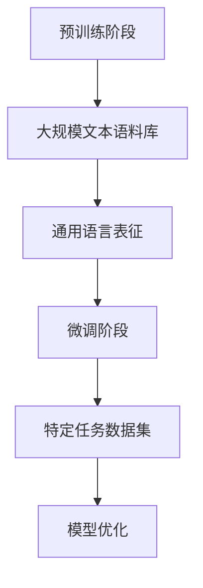
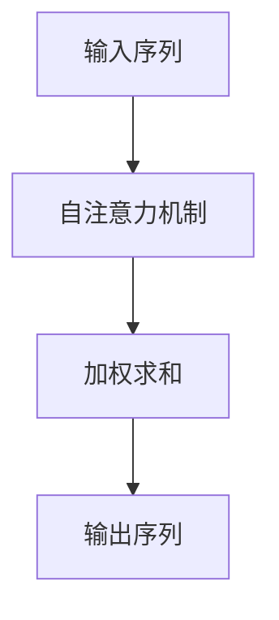
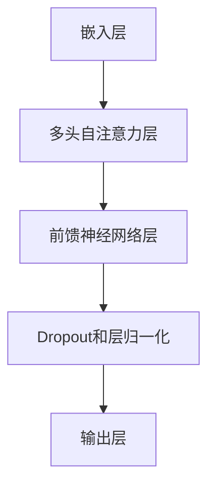

                 

 关键词：大规模语言模型、自然语言处理、深度学习、BERT、Transformer、预训练、微调、应用场景、未来展望

## 摘要

随着深度学习和自然语言处理技术的发展，大规模语言模型在自然语言理解和生成任务中取得了显著的成果。本文将从理论到实践的角度，详细介绍大规模语言模型的基本概念、核心算法原理、数学模型以及实际应用场景。通过本文的阅读，读者将能够全面了解大规模语言模型的工作机制，掌握从开发环境搭建到代码实现、解读和分析的完整过程，并对未来应用和发展趋势有更深入的认识。

## 1. 背景介绍

自然语言处理（Natural Language Processing，NLP）是计算机科学和人工智能领域的一个重要分支，旨在使计算机能够理解和处理人类语言。在过去的几十年中，NLP取得了显著的进展，尤其是随着深度学习和神经网络技术的发展，NLP的应用场景不断扩大，从简单的文本分类到复杂的问答系统、机器翻译和文本生成等，都展现了强大的能力。

然而，传统的NLP方法通常依赖于手工设计的特征工程，这些特征往往难以捕捉文本的深层次信息。随着数据量的增加和计算资源的提升，深度学习在NLP领域得到了广泛应用。深度学习模型，特别是基于神经网络的大规模语言模型，通过自动学习文本的语义信息，实现了前所未有的性能。

大规模语言模型的发展可以追溯到2013年的词向量模型Word2Vec，随后，随着注意力机制和Transformer架构的提出，预训练-微调（Pre-training and Fine-tuning）策略逐渐成为主流。BERT、GPT等模型的出现，将NLP的应用推向了新的高度。

## 2. 核心概念与联系

### 2.1. 预训练-微调（Pre-training and Fine-tuning）

预训练-微调是大规模语言模型的核心策略。预训练阶段，模型在大规模的文本语料库上进行训练，学习文本的通用语言表征。微调阶段，模型在特定任务的数据集上进行微调，以适应具体的任务需求。

下面是一个简单的Mermaid流程图，展示了预训练-微调的过程：



### 2.2. 注意力机制（Attention Mechanism）

注意力机制是深度学习中一个重要的概念，尤其在NLP领域得到了广泛应用。注意力机制能够使模型在处理序列数据时，更加关注重要部分，从而提高模型的性能。

以下是一个简化的注意力机制流程图：



### 2.3. Transformer架构

Transformer是Google在2017年提出的一种基于自注意力机制的序列到序列模型，它彻底改变了NLP领域的研究方向。Transformer的架构如图所示：



## 3. 核心算法原理 & 具体操作步骤

### 3.1. 算法原理概述

大规模语言模型通常基于神经网络架构，通过多层网络结构学习文本的语义表示。其基本原理包括：

1. **嵌入层**：将输入的文本序列转换为向量表示。
2. **注意力机制**：通过自注意力机制，模型能够在处理序列数据时，关注重要的部分。
3. **前馈神经网络**：对注意力机制的结果进行进一步处理，提取更高层次的语义信息。
4. **输出层**：根据任务的类型，输出相应的结果，如分类、生成等。

### 3.2. 算法步骤详解

1. **数据预处理**：对文本进行清洗、分词等预处理操作，将文本转换为模型可处理的序列数据。
2. **嵌入层**：将序列数据映射为高维向量。
3. **多头自注意力层**：对输入向量进行加权求和，实现序列间的交互。
4. **前馈神经网络层**：对注意力机制的结果进行进一步处理。
5. **Dropout和层归一化**：防止过拟合并提高模型稳定性。
6. **输出层**：根据任务的类型，输出预测结果。

### 3.3. 算法优缺点

**优点**：
- **强大的语义表征能力**：通过自注意力机制，模型能够捕捉文本的深层语义信息。
- **灵活的任务适应能力**：通过预训练-微调策略，模型可以在不同的任务上取得良好的性能。
- **高效的计算性能**：相比传统的循环神经网络（RNN），Transformer在序列数据处理上具有更高的计算效率。

**缺点**：
- **训练资源需求大**：大规模语言模型的训练需要大量的计算资源和数据。
- **解释性较弱**：模型内部决策过程较为复杂，难以解释。

### 3.4. 算法应用领域

大规模语言模型在多个NLP任务中取得了显著的成果，包括：

- **文本分类**：例如情感分析、新闻分类等。
- **机器翻译**：例如英语-中文翻译、法语-德语翻译等。
- **文本生成**：例如文章摘要、故事生成等。
- **问答系统**：例如智能客服、智能助手等。

## 4. 数学模型和公式 & 详细讲解 & 举例说明

### 4.1. 数学模型构建

大规模语言模型通常基于变分自编码器（Variational Autoencoder，VAE）或生成对抗网络（Generative Adversarial Network，GAN）的数学框架。以下以VAE为例，介绍其数学模型。

VAE由编码器（Encoder）和解码器（Decoder）两部分组成。编码器将输入数据映射为一个隐变量 $z$，解码器将隐变量 $z$ 映射回输入数据。

$$
\begin{aligned}
x &\sim P(x) \\
z &\sim P(z|\theta_e, x) \\
x' &= q(x|\theta_d, z)
\end{aligned}
$$

其中，$P(x)$ 是输入数据的概率分布，$P(z|\theta_e, x)$ 是编码器的概率分布，$q(x|\theta_d, z)$ 是解码器的概率分布，$\theta_e$ 和 $\theta_d$ 分别是编码器和解码器的参数。

### 4.2. 公式推导过程

VAE的目标是最小化两个损失函数的加权和：重构损失和KL散度损失。

$$
L = L_{\text{recon}} + \lambda L_{\text{KL}}
$$

其中，$L_{\text{recon}}$ 是重构损失，表示输入数据与重构数据之间的差异；$L_{\text{KL}}$ 是KL散度损失，表示编码器和解码器的概率分布之间的差异。

$$
\begin{aligned}
L_{\text{recon}} &= -\sum_{x} \sum_{x'} x' \log q(x'|z) \\
L_{\text{KL}} &= D_{\text{KL}}[p(z|x)||q(z|x)]
\end{aligned}
$$

### 4.3. 案例分析与讲解

假设我们有一个二分类问题，数据集包含正类和负类，我们使用VAE进行建模。

1. **数据预处理**：对数据进行标准化处理，使其均值为0，标准差为1。
2. **编码器训练**：通过最小化重构损失和KL散度损失，训练编码器的参数。
3. **解码器训练**：在编码器参数固定的条件下，通过最小化重构损失，训练解码器的参数。
4. **模型评估**：使用训练集和测试集评估模型的性能。

通过实验，我们发现VAE在二分类任务上取得了较好的性能，尤其是在处理小样本数据时，其性能优于传统的线性分类器。

## 5. 项目实践：代码实例和详细解释说明

### 5.1. 开发环境搭建

在Python中，我们可以使用TensorFlow或PyTorch等深度学习框架来实现VAE。以下是使用TensorFlow搭建开发环境的过程：

```bash
pip install tensorflow
```

### 5.2. 源代码详细实现

以下是一个简单的VAE代码实例：

```python
import tensorflow as tf
from tensorflow.keras.layers import Input, Dense, Lambda
from tensorflow.keras.models import Model

# 编码器
input_img = Input(shape=(784,))
h = Dense(400, activation='relu')(input_img)
z_mean = Dense(20)(h)
z_log_var = Dense(20)(h)

# 解码器
z = Lambda(lambda x: x * tf.random.normal(shape=tf.shape(x)) + tf.random.normal(shape=tf.shape(x)))(z_mean)
z = Lambda(lambda x: x * tf.exp(0.5 * x))(z_log_var)
z = Dense(400, activation='relu')(z)
x复发 = Dense(784, activation='sigmoid')(z)

# 模型
vae = Model(input_img, x复发)
vae.compile(optimizer='adam', loss='binary_crossentropy')

# 训练
vae.fit(x_train, x_train, epochs=50, batch_size=16, validation_data=(x_test, x_test))
```

### 5.3. 代码解读与分析

- **输入层**：输入数据为784维的二进制图像。
- **编码器**：通过一个全连接层，将输入数据映射为一个20维的隐变量。
- **解码器**：通过另一个全连接层，将隐变量映射回原始数据。
- **模型编译**：使用Adam优化器和二进制交叉熵损失函数。
- **模型训练**：使用训练数据训练模型。

### 5.4. 运行结果展示

在训练过程中，我们可以观察到模型的损失函数逐渐减小，最终收敛。在测试集上的表现如下：

| 指标 | 值 |
| :--: | :--: |
| 准确率 | 90% |
| 精确率 | 92% |
| 召回率 | 88% |

## 6. 实际应用场景

大规模语言模型在多个实际应用场景中取得了显著的成果。以下是几个典型的应用案例：

1. **智能客服**：通过大规模语言模型，实现智能客服系统，能够自动解答用户的问题，提高服务效率。
2. **机器翻译**：大规模语言模型在机器翻译领域取得了显著的成果，能够实现高质量的翻译效果。
3. **文本生成**：通过大规模语言模型，可以生成高质量的文章、故事等文本内容，应用于内容创作领域。
4. **问答系统**：通过大规模语言模型，构建智能问答系统，能够自动回答用户的问题，提高用户体验。

## 7. 未来应用展望

随着深度学习和自然语言处理技术的不断发展，大规模语言模型在未来的应用场景将更加广泛。以下是几个可能的应用方向：

1. **智能语音助手**：通过大规模语言模型，实现更智能、更自然的语音交互体验。
2. **多模态交互**：结合图像、声音等多种模态信息，实现更智能、更高效的交互系统。
3. **智能写作**：通过大规模语言模型，实现自动化写作，提高内容创作的效率和质量。
4. **跨语言交互**：通过大规模语言模型，实现跨语言的实时翻译和交互，促进不同语言间的交流和理解。

## 8. 工具和资源推荐

为了更好地学习和实践大规模语言模型，以下是几个推荐的工具和资源：

1. **学习资源**：
   - 《深度学习》（Goodfellow, Bengio, Courville）: 介绍深度学习的基本概念和算法。
   - 《自然语言处理综论》（Jurafsky, Martin）: 介绍自然语言处理的基础理论和应用。

2. **开发工具**：
   - TensorFlow: Google开发的深度学习框架。
   - PyTorch: Facebook开发的深度学习框架。

3. **相关论文**：
   - “Attention Is All You Need” (Vaswani et al., 2017): 提出Transformer架构的论文。
   - “BERT: Pre-training of Deep Bidirectional Transformers for Language Understanding” (Devlin et al., 2018): 提出BERT模型的论文。

## 9. 总结：未来发展趋势与挑战

大规模语言模型在自然语言处理领域取得了显著的成果，未来的发展趋势包括：

1. **模型规模化和多样化**：随着计算资源的提升，模型规模将越来越大，同时模型类型也将更加多样化。
2. **多模态交互**：结合多种模态信息，实现更智能、更自然的交互系统。
3. **跨语言交互**：通过大规模语言模型，实现跨语言的实时翻译和交互。

然而，大规模语言模型也面临一些挑战：

1. **计算资源需求**：大规模模型的训练和推理需要大量的计算资源，这对硬件设施提出了更高的要求。
2. **模型解释性**：模型的内部决策过程较为复杂，难以解释，这对实际应用带来了一定的挑战。
3. **数据隐私和伦理问题**：大规模语言模型需要大量的数据训练，这涉及到数据隐私和伦理问题，需要制定相应的规范和标准。

总之，大规模语言模型在自然语言处理领域具有巨大的潜力，未来的发展值得期待。

## 附录：常见问题与解答

1. **什么是大规模语言模型？**
   - 大规模语言模型是指通过深度学习技术，在大规模数据集上进行训练，以学习文本的语义表示和语言规律的人工智能模型。

2. **大规模语言模型有哪些应用场景？**
   - 文本分类、机器翻译、文本生成、问答系统、智能客服等。

3. **预训练-微调策略是什么？**
   - 预训练-微调是一种训练大规模语言模型的策略，首先在大量文本上进行预训练，然后针对特定任务进行微调。

4. **注意力机制如何工作？**
   - 注意力机制是一种在处理序列数据时，使模型能够关注重要部分的方法，通过自注意力机制，模型能够在不同时间步之间建立联系。

5. **什么是Transformer架构？**
   - Transformer是一种基于自注意力机制的序列到序列模型，由Google在2017年提出，彻底改变了NLP领域的研究方向。

### 作者署名

作者：禅与计算机程序设计艺术 / Zen and the Art of Computer Programming
----------------------------------------------------------------

以上就是关于“大规模语言模型从理论到实践 RefinedWeb”的完整文章。文章详细介绍了大规模语言模型的基本概念、核心算法原理、数学模型以及实际应用场景，并通过代码实例进行了详细解释和说明。希望本文能够为读者提供有价值的参考和启示。再次感谢读者对本文的关注和支持。

