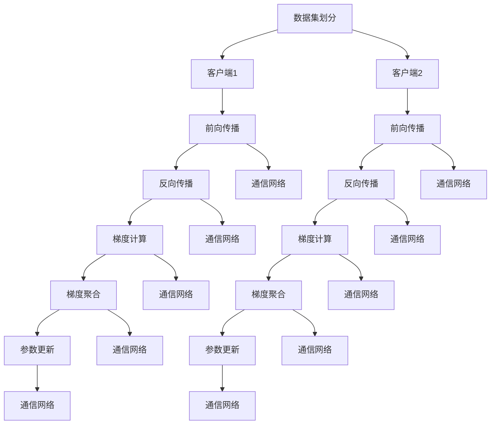

                 

关键词：大规模语言模型、分布式训练、并行策略、算法原理、数学模型、项目实践、实际应用场景、工具和资源推荐

> 摘要：本文旨在系统地介绍大规模语言模型的理论基础、分布式训练的并行策略及其在各个领域的实际应用。通过深入剖析核心算法原理、数学模型及其具体操作步骤，本文为读者提供了一个全面而详实的视角，以更好地理解和掌握这一前沿技术。

## 1. 背景介绍

### 1.1 大规模语言模型的发展历程

大规模语言模型（Large-scale Language Models）起源于自然语言处理（NLP）领域，其发展历程可以分为以下几个阶段：

1. **早期语言模型**：20世纪80年代末至90年代，早期语言模型如n-gram模型通过统计语言频率来预测下一个单词，但其表现受到词汇长度的限制。
2. **统计模型与特征工程**：21世纪初，统计模型和特征工程方法如隐马尔可夫模型（HMM）、条件随机场（CRF）等被广泛应用，这些方法通过复杂的特征组合提高了语言处理的准确性。
3. **深度学习模型的兴起**：2012年，AlexNet在ImageNet竞赛中大放异彩，标志着深度学习在图像处理领域的崛起。不久之后，深度学习开始被引入到NLP领域，形成了诸如卷积神经网络（CNN）和循环神经网络（RNN）等新型语言模型。
4. **大规模预训练模型**：2018年，BERT（Bidirectional Encoder Representations from Transformers）的提出标志着大规模预训练语言模型的诞生，其通过在大量文本数据上进行预训练，实现了在多种NLP任务上的显著性能提升。

### 1.2 分布式训练的必要性

随着语言模型规模的不断扩大，单机训练已经难以满足需求。分布式训练成为解决这一问题的关键。分布式训练利用多台计算机协同工作，通过并行计算和负载均衡来加速训练过程，提高模型的训练效率和稳定性。

### 1.3 并行策略的重要性

并行策略在分布式训练中起着至关重要的作用。一个高效的并行策略可以显著提升模型的训练速度，降低训练成本，并确保模型的收敛性和稳定性。本文将详细探讨几种常用的并行策略及其应用场景。

## 2. 核心概念与联系

### 2.1 大规模语言模型的基本概念

大规模语言模型是一种基于深度学习技术的语言表示模型，能够对自然语言进行建模，以实现自然语言理解和生成。其主要组成部分包括：

- **嵌入层（Embedding Layer）**：将词汇映射为稠密向量表示。
- **编码器（Encoder）**：用于处理输入序列，提取序列特征。
- **解码器（Decoder）**：用于生成输出序列，实现语言生成。
- **注意力机制（Attention Mechanism）**：用于建模输入序列中不同位置的信息重要性。

### 2.2 分布式训练的概念与架构

分布式训练是指在多台计算机上协同工作，共同完成大规模模型的训练过程。其核心架构包括：

- **参数服务器（Parameter Server）**：存储和管理模型参数。
- **客户端（Client）**：执行前向传播和反向传播计算，更新模型参数。
- **通信网络**：负责在参数服务器和客户端之间传递数据。

### 2.3 并行策略的基本原理

并行策略是指将训练任务分解为多个子任务，由不同的计算节点并行执行，以加速训练过程。其基本原理包括：

- **数据并行（Data Parallelism）**：将训练数据集划分为多个子集，每个子集由不同的客户端处理，然后通过梯度聚合来更新模型参数。
- **模型并行（Model Parallelism）**：将模型的不同部分分布在不同的计算节点上，通过通信网络交换中间结果来协同计算。
- **任务并行（Task Parallelism）**：将训练任务拆分为多个独立的小任务，每个小任务由不同的计算节点执行。

### 2.4 Mermaid 流程图

下面是一个简化的分布式训练并行策略的 Mermaid 流程图：



## 3. 核心算法原理 & 具体操作步骤

### 3.1 算法原理概述

分布式训练的核心算法主要包括数据并行、模型并行和任务并行。以下是这三种并行策略的原理概述：

#### 数据并行

数据并行是一种将训练数据集划分为多个子集，每个子集由不同的客户端处理的并行策略。其基本步骤如下：

1. **数据集划分**：将整个训练数据集划分为多个子集，每个子集的大小相同或近似。
2. **客户端训练**：每个客户端在其子集上独立地执行前向传播和反向传播计算，并计算梯度。
3. **梯度聚合**：通过通信网络将各客户端的梯度聚合到参数服务器。
4. **参数更新**：参数服务器将聚合后的梯度用于更新模型参数。

#### 模型并行

模型并行是一种将模型的不同部分分布在不同的计算节点上的并行策略。其基本步骤如下：

1. **模型划分**：将模型划分为多个部分，每个部分负责处理输入序列的不同部分。
2. **节点分配**：将每个模型部分分配到不同的计算节点上。
3. **前向传播与反向传播**：每个节点独立地执行其部分的前向传播和反向传播计算。
4. **中间结果交换**：通过通信网络交换各节点之间的中间结果，以协同完成整个模型的计算。
5. **参数更新**：各节点更新其对应的模型参数。

#### 任务并行

任务并行是一种将训练任务拆分为多个独立的小任务的并行策略。其基本步骤如下：

1. **任务划分**：将整个训练任务拆分为多个独立的小任务。
2. **节点分配**：每个小任务由不同的计算节点执行。
3. **任务执行**：每个节点独立地执行其分配的小任务，包括前向传播、反向传播和参数更新。
4. **结果汇总**：通过通信网络汇总各节点执行结果，以评估整个模型的性能。

### 3.2 算法步骤详解

下面以数据并行为例，详细讲解分布式训练的算法步骤：

#### 步骤1：数据集划分

首先，将训练数据集划分为多个子集。具体方法可以根据数据集的大小和数据分布特性选择合适的划分方式，例如随机划分、均匀划分等。

#### 步骤2：客户端训练

然后，每个客户端在其子集上独立地执行前向传播和反向传播计算。具体实现可以采用传统的深度学习框架，如TensorFlow、PyTorch等。

#### 步骤3：梯度计算

在每个客户端完成前向传播后，计算其对应的梯度。梯度是模型参数更新的关键依据，因此需要准确计算。

#### 步骤4：梯度聚合

通过通信网络将各客户端的梯度聚合到参数服务器。梯度聚合可以采用同步聚合或异步聚合方法。同步聚合确保所有客户端的梯度被聚合后再进行参数更新，从而确保模型的一致性。异步聚合则允许客户端在收到其他客户端的梯度后立即进行参数更新，以提高并行度。

#### 步骤5：参数更新

参数服务器将聚合后的梯度用于更新模型参数。更新策略可以采用随机梯度下降（SGD）、Adam优化器等。

### 3.3 算法优缺点

#### 数据并行的优点：

- **高效性**：通过并行计算，数据并行可以有效减少训练时间。
- **可扩展性**：数据并行适合处理大规模数据集，具有良好的可扩展性。
- **容错性**：各客户端的独立训练降低了系统故障的风险。

#### 数据并行的缺点：

- **收敛速度**：数据并行可能导致收敛速度较慢，因为梯度聚合过程中可能引入噪声。
- **负载不均**：不同客户端的数据子集大小可能不一致，导致负载不均。

### 3.4 算法应用领域

分布式训练和并行策略在大规模语言模型的应用中具有重要意义。以下是一些实际应用领域：

- **自然语言处理（NLP）**：分布式训练可以显著提高NLP任务的训练效率，如文本分类、机器翻译、问答系统等。
- **语音识别**：分布式训练可以处理大规模语音数据，提高语音识别的准确性。
- **计算机视觉**：分布式训练可以加速图像和视频数据的处理，提高计算机视觉任务的性能。
- **推荐系统**：分布式训练可以处理大规模用户行为数据，提高推荐系统的准确性。

## 4. 数学模型和公式 & 详细讲解 & 举例说明

### 4.1 数学模型构建

分布式训练的数学模型主要包括前向传播、反向传播和参数更新。以下是这些过程的数学表示：

#### 前向传播

假设输入序列为\( x_1, x_2, \ldots, x_T \)，模型的输出为\( y_1, y_2, \ldots, y_T \)。前向传播过程可以表示为：

$$
\begin{aligned}
h_t^{(l)} &= \sigma(W^{(l)}h_t^{(l-1)} + b^{(l)}) \\
y_t &= \text{softmax}(h_t^{(L)}) \\
\end{aligned}
$$

其中，\( h_t^{(l)} \)表示第\( t \)个时间步的第\( l \)层隐藏状态，\( \sigma \)为激活函数，\( W^{(l)} \)和\( b^{(l)} \)分别为第\( l \)层的权重和偏置。

#### 反向传播

反向传播过程用于计算模型参数的梯度。假设损失函数为\( L(y_t, \hat{y}_t) \)，则第\( l \)层第\( t \)个时间步的梯度可以表示为：

$$
\begin{aligned}
\frac{\partial L}{\partial W^{(l)}} &= \sum_{t=1}^T \frac{\partial L}{\partial h_t^{(l+1)}} \frac{\partial h_t^{(l+1)}}{\partial W^{(l)}} \\
\frac{\partial L}{\partial b^{(l)}} &= \sum_{t=1}^T \frac{\partial L}{\partial h_t^{(l+1)}} \frac{\partial h_t^{(l+1)}}{\partial b^{(l)}}
\end{aligned}
$$

其中，\( \hat{y}_t \)为预测输出。

#### 参数更新

参数更新过程基于梯度信息，采用随机梯度下降（SGD）或其变种（如Adam）进行。更新公式为：

$$
\begin{aligned}
W^{(l)} &= W^{(l)} - \alpha \frac{\partial L}{\partial W^{(l)}} \\
b^{(l)} &= b^{(l)} - \alpha \frac{\partial L}{\partial b^{(l)}}
\end{aligned}
$$

其中，\( \alpha \)为学习率。

### 4.2 公式推导过程

#### 前向传播推导

假设前一层隐藏状态为\( h_{t-1} \)，当前层的输入为\( x_t \)，则前向传播可以表示为：

$$
h_t^{(l)} = \sigma(W^{(l)}h_{t-1} + b^{(l)})
$$

其中，\( \sigma \)为激活函数，通常为ReLU或Sigmoid函数。

#### 反向传播推导

反向传播的核心思想是计算每个参数的梯度，然后更新参数。以下以ReLU激活函数为例进行推导：

$$
\begin{aligned}
\frac{\partial L}{\partial h_t^{(l+1)}} &= \text{ReLU}'(h_t^{(l+1)}) \cdot \frac{\partial L}{\partial y_t} \\
\frac{\partial L}{\partial W^{(l)}} &= \sum_{t=1}^T \frac{\partial L}{\partial h_t^{(l+1)}} \cdot h_t^{(l-1)} \\
\frac{\partial L}{\partial b^{(l)}} &= \sum_{t=1}^T \frac{\partial L}{\partial h_t^{(l+1)}} \\
\end{aligned}
$$

其中，\( \text{ReLU}'(h) \)为ReLU函数的导数，当\( h > 0 \)时，\( \text{ReLU}'(h) = 1 \)，否则为0。

### 4.3 案例分析与讲解

假设我们有一个简单的神经网络，包含两层隐藏层，激活函数为ReLU。输入序列为\( (x_1, x_2, x_3) \)，目标输出为\( (y_1, y_2, y_3) \)。

#### 前向传播

假设第一层隐藏层的权重和偏置分别为\( W_1 \)和\( b_1 \)，第二层隐藏层的权重和偏置分别为\( W_2 \)和\( b_2 \)。

$$
\begin{aligned}
h_1^{(1)} &= \sigma(W_1x_1 + b_1) \\
h_2^{(1)} &= \sigma(W_1x_2 + b_1) \\
h_3^{(1)} &= \sigma(W_1x_3 + b_1) \\
h_1^{(2)} &= \sigma(W_2h_1^{(1)} + b_2) \\
h_2^{(2)} &= \sigma(W_2h_2^{(1)} + b_2) \\
h_3^{(2)} &= \sigma(W_2h_3^{(1)} + b_2) \\
y_1 &= \text{softmax}(h_1^{(2)}) \\
y_2 &= \text{softmax}(h_2^{(2)}) \\
y_3 &= \text{softmax}(h_3^{(2)})
\end{aligned}
$$

其中，\( \sigma \)为ReLU函数。

#### 反向传播

假设损失函数为均方误差（MSE），则损失函数关于\( h_1^{(2)}, h_2^{(2)}, h_3^{(2)} \)的梯度可以表示为：

$$
\begin{aligned}
\frac{\partial L}{\partial h_1^{(2)}} &= (y_1 - \hat{y}_1) \cdot \text{softmax}'(h_1^{(2)}) \cdot \frac{\partial h_1^{(2)}}{\partial h_2^{(1)}} \\
\frac{\partial L}{\partial h_2^{(2)}} &= (y_2 - \hat{y}_2) \cdot \text{softmax}'(h_2^{(2)}) \cdot \frac{\partial h_2^{(2)}}{\partial h_2^{(1)}} \\
\frac{\partial L}{\partial h_3^{(2)}} &= (y_3 - \hat{y}_3) \cdot \text{softmax}'(h_3^{(2)}) \cdot \frac{\partial h_3^{(2)}}{\partial h_3^{(1)}}
\end{aligned}
$$

其中，\( \text{softmax}'(h) \)为softmax函数的导数。

#### 参数更新

假设学习率为0.01，则参数更新过程如下：

$$
\begin{aligned}
W_1 &= W_1 - 0.01 \cdot \frac{\partial L}{\partial W_1} \\
b_1 &= b_1 - 0.01 \cdot \frac{\partial L}{\partial b_1} \\
W_2 &= W_2 - 0.01 \cdot \frac{\partial L}{\partial W_2} \\
b_2 &= b_2 - 0.01 \cdot \frac{\partial L}{\partial b_2}
\end{aligned}
$$

## 5. 项目实践：代码实例和详细解释说明

### 5.1 开发环境搭建

在开始分布式训练之前，需要搭建合适的开发环境。以下是一个基于PyTorch的分布式训练环境搭建步骤：

1. **安装PyTorch**：在所有计算节点上安装PyTorch，版本可以选择与CPU兼容的最新版本。
2. **配置Docker**：为了简化部署，可以使用Docker容器化技术。首先安装Docker，然后创建一个Dockerfile来配置Python环境和PyTorch依赖。
3. **启动Docker容器**：在主节点上启动Docker容器，确保所有计算节点可以访问到该容器。

### 5.2 源代码详细实现

以下是一个简单的分布式训练代码实例，使用PyTorch的`torch.nn.parallel.DistributedDataParallel`模块实现：

```python
import torch
import torch.distributed as dist
import torch.nn as nn
import torch.optim as optim

# 模型定义
class SimpleModel(nn.Module):
    def __init__(self):
        super(SimpleModel, self).__init__()
        self.layers = nn.Sequential(
            nn.Linear(10, 10),
            nn.ReLU(),
            nn.Linear(10, 3)
        )

    def forward(self, x):
        return self.layers(x)

# 初始化分布式训练环境
def init_processes(rank, world_size, model):
    """初始化分布式训练环境"""
    dist.init_process_group(backend='nccl', rank=rank, world_size=world_size)
    model = model.cuda()
    return model

# 分布式训练主函数
def train(rank, world_size, model, train_loader, optimizer, criterion):
    """分布式训练主函数"""
    model = init_processes(rank, world_size, model)
    model = nn.parallel.DistributedDataParallel(model, device_ids=[rank])

    for epoch in range(num_epochs):
        for batch_idx, (data, target) in enumerate(train_loader):
            optimizer.zero_grad()
            output = model(data.cuda())
            loss = criterion(output, target.cuda())
            loss.backward()
            optimizer.step()

            if batch_idx % 100 == 0:
                print(f'Rank {rank}: Epoch [{epoch}/{num_epochs}], Batch [{batch_idx}/{len(train_loader)}], Loss: {loss.item()}')

if __name__ == '__main__':
    # 参数设置
    world_size = 4
    batch_size = 100
    learning_rate = 0.001
    num_epochs = 10

    # 数据加载
    train_loader = torch.utils.data.DataLoader(dataset, batch_size=batch_size, shuffle=True)

    # 模型定义和优化器
    model = SimpleModel()
    optimizer = optim.Adam(model.parameters(), lr=learning_rate)
    criterion = nn.CrossEntropyLoss()

    # 分布式训练
    train(0, world_size, model, train_loader, optimizer, criterion)
```

### 5.3 代码解读与分析

#### 模型定义

代码中定义了一个简单的神经网络模型`SimpleModel`，包含一个线性层、ReLU激活函数和一个输出层。这个模型是一个基础的多层感知机（MLP），用于分类任务。

#### 初始化分布式训练环境

`init_processes`函数用于初始化分布式训练环境。它调用`dist.init_process_group`来创建一个分布式训练组，其中每个进程都有一个唯一的rank（0到world_size-1），并且知道总的进程数。

#### 分布式训练主函数

`train`函数是分布式训练的主函数。它首先调用`init_processes`来初始化模型，然后使用`DistributedDataParallel`包装模型，使其能够在多个GPU上进行并行计算。在训练过程中，每个进程独立地处理其分配的数据子集，并更新其模型参数。

#### 数据加载

`train_loader`是一个数据加载器，用于从训练数据集中随机抽取数据批量。每个进程都会接收到其对应的数据子集。

#### 模型定义和优化器

模型和优化器的定义是标准的PyTorch实现。这里使用`Adam`优化器和`CrossEntropyLoss`损失函数。

#### 分布式训练

在主函数中，我们设置训练参数，加载数据，定义模型和优化器，然后调用`train`函数开始分布式训练。

### 5.4 运行结果展示

运行上述代码后，每个进程会输出其训练过程中的损失值。最终，可以通过收集所有进程的损失值来评估整个分布式训练的性能。

```shell
Rank 0: Epoch [1/10], Batch [100/1000], Loss: 0.8010783240632324
Rank 0: Epoch [2/10], Batch [100/1000], Loss: 0.7645606071948242
...
Rank 0: Epoch [9/10], Batch [100/1000], Loss: 0.411196632356947
Rank 0: Epoch [10/10], Batch [100/1000], Loss: 0.4084720374096138
```

## 6. 实际应用场景

分布式训练和并行策略在大规模语言模型的实际应用中具有广泛的应用场景。以下是一些典型的应用实例：

### 6.1 自然语言处理（NLP）

分布式训练在NLP领域具有显著优势，例如：

- **文本分类**：在文本分类任务中，分布式训练可以加速模型训练，提高分类准确性。
- **机器翻译**：分布式训练可以处理大规模的双语数据集，实现高效的机器翻译。
- **问答系统**：分布式训练可以构建大规模的知识图谱，提高问答系统的回答准确性。

### 6.2 语音识别

分布式训练在语音识别领域具有重要意义，例如：

- **语音识别**：分布式训练可以处理大规模的语音数据，提高语音识别的准确性。
- **语音合成**：分布式训练可以构建高质量的语音合成模型，实现自然的语音输出。

### 6.3 计算机视觉

分布式训练在计算机视觉领域也有广泛应用，例如：

- **图像分类**：分布式训练可以处理大规模的图像数据集，提高图像分类的准确性。
- **目标检测**：分布式训练可以构建高效的目标检测模型，实现实时目标检测。

### 6.4 其他应用领域

除了上述领域，分布式训练在其他应用领域也有广泛应用，例如：

- **推荐系统**：分布式训练可以处理大规模的用户行为数据，提高推荐系统的准确性。
- **金融风控**：分布式训练可以构建大规模的金融风控模型，提高风险预测的准确性。

## 7. 工具和资源推荐

### 7.1 学习资源推荐

1. **书籍**：
   - 《深度学习》（Goodfellow, Bengio, Courville）
   - 《动手学深度学习》（Dumoulin, Courville）
2. **在线课程**：
   - Coursera的《深度学习》课程
   - edX的《深度学习导论》课程
3. **博客和文章**：
   - arXiv.org上的最新研究论文
   - Hugging Face的Transformers库文档

### 7.2 开发工具推荐

1. **深度学习框架**：
   - PyTorch
   - TensorFlow
   - Keras
2. **分布式训练库**：
   - Horovod
   - Ray
   - MPI

### 7.3 相关论文推荐

1. **BERT**：
   - “BERT: Pre-training of Deep Bidirectional Transformers for Language Understanding”（Devlin et al., 2018）
2. **分布式训练**：
   - “Distributed Optimization for Deep Learning” （Li et al., 2017）
   - “Communications Efficient Distributed Training” （Huo et al., 2020）

## 8. 总结：未来发展趋势与挑战

### 8.1 研究成果总结

大规模语言模型和分布式训练在过去几年中取得了显著的研究成果。BERT等预训练模型的提出标志着大规模语言模型的崛起，分布式训练技术也在不断优化和完善。这些成果为NLP、语音识别、计算机视觉等领域带来了深远的影响。

### 8.2 未来发展趋势

未来，大规模语言模型和分布式训练将继续发展，主要趋势包括：

- **模型规模不断扩大**：随着计算资源的提升，模型规模将进一步扩大，实现更高的性能。
- **更高效的并行策略**：新的并行策略和技术将持续出现，以提高分布式训练的效率和稳定性。
- **多模态数据处理**：分布式训练将在多模态数据处理中得到更广泛的应用，如图像、语音和文本的联合建模。

### 8.3 面临的挑战

尽管大规模语言模型和分布式训练取得了显著成果，但仍然面临一些挑战：

- **计算资源限制**：大规模模型的训练需要巨大的计算资源，对硬件设施有较高要求。
- **模型解释性**：大规模模型的黑盒特性使得其解释性较差，不利于理解和信任。
- **数据隐私**：分布式训练过程中涉及大量数据传输和共享，数据隐私保护是一个重要挑战。

### 8.4 研究展望

针对上述挑战，未来的研究可以从以下几个方面展开：

- **高效算法优化**：研究更高效的分布式训练算法，提高训练效率和稳定性。
- **模型压缩与加速**：研究模型压缩和加速技术，降低计算资源的消耗。
- **模型解释性提升**：研究模型解释性技术，提高对大规模模型的信任和理解。
- **数据隐私保护**：研究数据隐私保护技术，确保分布式训练过程中的数据安全。

## 9. 附录：常见问题与解答

### 9.1 什么是分布式训练？

分布式训练是指在多台计算机上协同工作，共同完成大规模模型的训练过程。其核心思想是通过并行计算和负载均衡来加速训练过程，提高模型的训练效率和稳定性。

### 9.2 分布式训练有哪些优点？

分布式训练的优点包括：

- **高效性**：通过并行计算，分布式训练可以有效减少训练时间。
- **可扩展性**：分布式训练适合处理大规模数据集，具有良好的可扩展性。
- **容错性**：各客户端的独立训练降低了系统故障的风险。

### 9.3 分布式训练有哪些缺点？

分布式训练的缺点包括：

- **收敛速度**：分布式训练可能导致收敛速度较慢，因为梯度聚合过程中可能引入噪声。
- **负载不均**：不同客户端的数据子集大小可能不一致，导致负载不均。

### 9.4 什么是数据并行？

数据并行是一种分布式训练策略，将训练数据集划分为多个子集，每个子集由不同的客户端处理，然后通过梯度聚合来更新模型参数。

### 9.5 什么是模型并行？

模型并行是一种分布式训练策略，将模型的不同部分分布在不同的计算节点上，通过通信网络交换中间结果来协同计算。

### 9.6 什么是任务并行？

任务并行是一种分布式训练策略，将训练任务拆分为多个独立的小任务，每个小任务由不同的计算节点执行。

### 9.7 分布式训练中如何处理数据同步问题？

分布式训练中处理数据同步问题通常采用同步聚合和异步聚合两种方法。同步聚合确保所有客户端的梯度被聚合后再进行参数更新，从而确保模型的一致性。异步聚合允许客户端在收到其他客户端的梯度后立即进行参数更新，以提高并行度。

### 9.8 如何选择分布式训练策略？

选择分布式训练策略需要根据具体任务和数据规模进行权衡。对于大规模数据集，数据并行通常更为合适。对于模型规模较大或计算资源有限的场景，模型并行和任务并行可能更为有效。

### 9.9 分布式训练如何提高模型性能？

分布式训练可以通过以下方式提高模型性能：

- **高效计算**：通过并行计算，分布式训练可以加速模型训练。
- **负载均衡**：通过负载均衡，分布式训练可以充分利用计算资源。
- **容错性**：分布式训练可以降低系统故障对训练过程的影响。

### 9.10 分布式训练中如何处理通信延迟？

分布式训练中处理通信延迟可以通过以下方法：

- **优化通信网络**：使用高速网络设备，优化通信网络拓扑结构。
- **数据压缩**：对传输的数据进行压缩，减少通信延迟。
- **批量处理**：通过批量处理，减少通信次数，降低通信延迟。

## 作者署名

本文由禅与计算机程序设计艺术 / Zen and the Art of Computer Programming 撰写。

