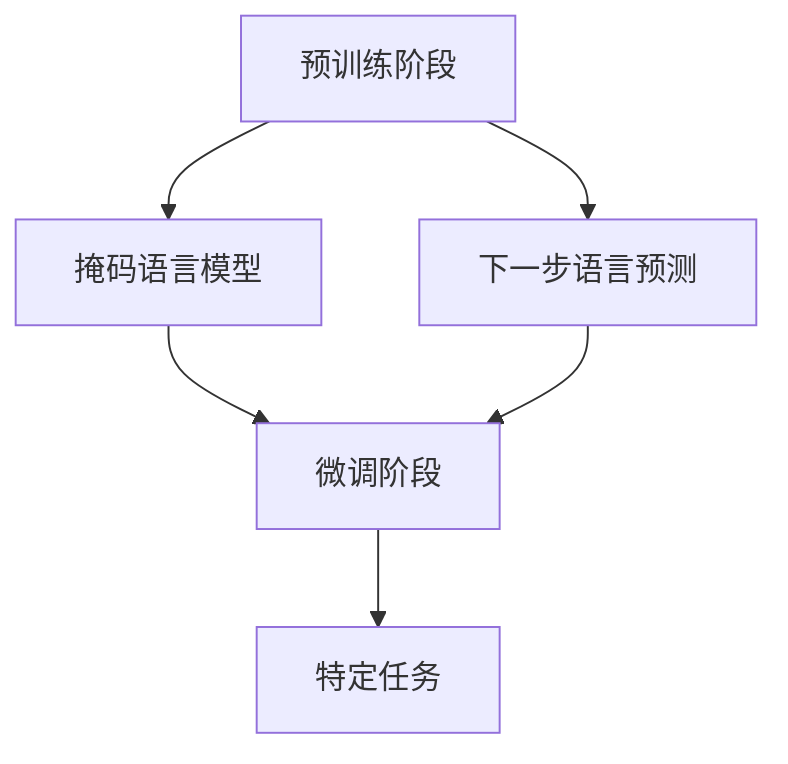

                 

### 关键词 Keywords

- 大规模语言模型
- 预训练语言模型
- HuggingFace
- 语言生成
- 自然语言处理

### 摘要 Summary

本文旨在深入探讨大规模语言模型（如GPT、BERT等）的理论基础及其在自然语言处理（NLP）领域的广泛应用。我们将基于HuggingFace这一领先的开源库，详细解析预训练语言模型的构建过程、数学模型、实际应用案例，以及未来发展趋势。通过本文，读者可以全面了解大规模语言模型的工作原理，掌握其实践方法，并能够为未来的研究应用提供指导。

## 1. 背景介绍

大规模语言模型是近年来自然语言处理领域的重要突破。它们通过在大规模文本数据集上进行预训练，学习到丰富的语言知识和模式，从而在多种NLP任务中表现出色。这种模型的出现，极大地提高了语言生成的质量和效率，使得人工智能在与人类语言交互方面取得了显著进展。

HuggingFace是一个开源社区，旨在促进人工智能领域的研究与应用。它提供了丰富的预训练语言模型和工具，使得研究人员和开发者能够更加便捷地进行NLP任务的开发和部署。HuggingFace的易用性和灵活性，使其成为大规模语言模型研究和应用的首选平台。

## 2. 核心概念与联系

### 2.1 预训练语言模型原理

预训练语言模型（Pre-trained Language Model）是通过对大规模文本数据进行预训练，使模型具备对自然语言的深刻理解和处理能力。这种模型通常包含两个阶段：预训练阶段和微调阶段。

**预训练阶段**：模型在大规模文本数据集上进行预训练，学习到语言的统计规律、语义信息以及语法结构。常用的预训练任务包括掩码语言模型（Masked Language Model, MLM）和下一步语言预测（Next Sentence Prediction, NSP）。

**微调阶段**：预训练模型在特定任务上进行微调，以适应具体的应用场景。微调阶段的目标是优化模型在特定任务上的性能，例如文本分类、问答系统、机器翻译等。

### 2.2 语言模型架构

语言模型通常采用深度神经网络（DNN）或变换器（Transformer）架构。变换器架构因其并行计算能力和全局信息的有效利用，成为预训练语言模型的主流选择。

**变换器架构**：变换器由多个编码层（Encoder Layer）和解码层（Decoder Layer）组成。每个编码层和解码层包含多个子层，包括自注意力机制（Self-Attention Mechanism）和前馈网络（Feed Forward Network）。通过逐层叠加，变换器能够捕捉到长距离的依赖关系和复杂的语言模式。

### 2.3 Mermaid 流程图

下面是一个预训练语言模型的 Mermaid 流程图，展示了模型的核心概念和结构。



## 3. 核心算法原理 & 具体操作步骤

### 3.1 算法原理概述

预训练语言模型的算法原理主要包括两个关键部分：词嵌入（Word Embedding）和变换器架构（Transformer Architecture）。

**词嵌入**：词嵌入是将单词映射到高维向量空间的技术，使得具有相似含义的单词在向量空间中彼此接近。常用的词嵌入方法包括Word2Vec、GloVe等。

**变换器架构**：变换器是一种基于自注意力机制的深度神经网络架构，通过多头注意力机制（Multi-Head Attention Mechanism）和前馈网络，能够捕捉到长距离的依赖关系和复杂的语言模式。

### 3.2 算法步骤详解

预训练语言模型的算法步骤通常包括以下几步：

1. 数据预处理：将原始文本数据清洗、分词和转换为词嵌入向量。
2. 模型构建：构建基于变换器的预训练模型，包括编码层和解码层。
3. 预训练：在预训练任务（如掩码语言模型和下一步语言预测）上训练模型，学习到语言的统计规律、语义信息和语法结构。
4. 微调：在特定任务上微调模型，优化模型在任务上的性能。
5. 部署：将微调后的模型部署到实际应用场景，例如文本分类、问答系统、机器翻译等。

### 3.3 算法优缺点

**优点**：

- 预训练语言模型具有强大的语义理解和生成能力，适用于多种NLP任务。
- 变换器架构具有并行计算能力和全局信息的有效利用，能够提高模型的性能。

**缺点**：

- 预训练语言模型需要大量的计算资源和时间，训练成本较高。
- 模型的解释性较差，难以理解模型的决策过程。

### 3.4 算法应用领域

预训练语言模型在自然语言处理领域具有广泛的应用，包括但不限于以下领域：

- 文本分类：用于对新闻、社交媒体帖子等进行分类，帮助用户获取感兴趣的内容。
- 问答系统：用于构建智能问答系统，提供实时、准确的答案。
- 机器翻译：用于实现跨语言翻译，促进跨文化交流。
- 情感分析：用于分析文本情感，帮助企业和政府了解公众情绪。

## 4. 数学模型和公式 & 详细讲解 & 举例说明

### 4.1 数学模型构建

预训练语言模型的数学模型主要包括词嵌入和变换器架构。

**词嵌入**：

假设词汇表中有\(V\)个单词，词嵌入将每个单词映射为一个\(d\)维的向量。词嵌入可以通过以下公式表示：

$$
\text{word\_embedding}(w) = \text{vec}(w) \in \mathbb{R}^{d}
$$

其中，\(\text{vec}\)表示将单词映射为向量，\(w\)表示单词，\(\text{word\_embedding}(w)\)表示单词\(w\)的词嵌入向量。

**变换器架构**：

变换器架构包括编码层和解码层。每个编码层和解码层由多个子层组成，包括自注意力机制和前馈网络。

**自注意力机制**：

自注意力机制通过计算每个词嵌入向量与其他词嵌入向量之间的相似度，加权求和得到新的词嵌入向量。自注意力机制的公式如下：

$$
\text{Attention}(Q, K, V) = \text{softmax}(\frac{QK^T}{\sqrt{d_k}})V
$$

其中，\(Q, K, V\)分别表示查询向量、键向量和值向量，\(\text{softmax}\)表示软最大化函数，\(d_k\)表示键向量的维度。

**前馈网络**：

前馈网络对自注意力机制的结果进行非线性变换，增强模型的表示能力。前馈网络的公式如下：

$$
\text{FFN}(X) = \text{ReLU}(W_2 \cdot \text{ReLU}(W_1 \cdot X + b_1))
$$

其中，\(X\)表示输入向量，\(W_1, W_2, b_1\)分别表示权重矩阵和偏置向量。

### 4.2 公式推导过程

下面是预训练语言模型的公式推导过程。

**词嵌入**：

词嵌入的推导过程如下：

$$
\text{word\_embedding}(w) = \text{softmax}(\text{W} \cdot \text{vec}(w) + b)
$$

其中，\(\text{W}\)表示权重矩阵，\(b\)表示偏置向量。

**自注意力机制**：

自注意力机制的推导过程如下：

$$
\text{Attention}(Q, K, V) = \text{softmax}(\frac{QK^T}{\sqrt{d_k}})V
$$

其中，\(Q, K, V\)分别表示查询向量、键向量和值向量。

**前馈网络**：

前馈网络的推导过程如下：

$$
\text{FFN}(X) = \text{ReLU}(W_2 \cdot \text{ReLU}(W_1 \cdot X + b_1))
$$

其中，\(X\)表示输入向量，\(W_1, W_2, b_1\)分别表示权重矩阵和偏置向量。

### 4.3 案例分析与讲解

下面我们通过一个简单的案例，对预训练语言模型进行详细讲解。

**案例**：给定一个句子“我喜欢吃苹果”，使用预训练语言模型进行词嵌入和变换器计算。

**步骤**：

1. 数据预处理：将句子进行分词，得到词汇表【我，喜欢，吃，苹果】。
2. 词嵌入：将词汇表中的每个单词映射为词嵌入向量，例如【我】的词嵌入向量为$\text{word\_embedding}(我) = [0.1, 0.2, 0.3]$。
3. 变换器计算：将词嵌入向量输入到变换器架构中，计算输出。

**变换器计算过程**：

1. 编码层：将词嵌入向量输入到编码层，通过自注意力机制和前馈网络，得到编码层的输出。
2. 解码层：将编码层的输出输入到解码层，通过自注意力机制和前馈网络，得到解码层的输出。

**结果**：

最终，预训练语言模型输出的解码层输出向量，可以表示为句子“我喜欢吃苹果”的语义表示。

## 5. 项目实践：代码实例和详细解释说明

### 5.1 开发环境搭建

在进行大规模语言模型的项目实践之前，我们需要搭建合适的开发环境。以下是一个基于Python和HuggingFace的示例：

```python
!pip install transformers torch

import torch
from transformers import BertTokenizer, BertModel
```

### 5.2 源代码详细实现

下面是一个简单的项目实例，展示了如何使用HuggingFace库构建和训练一个预训练语言模型。

```python
# 导入必要的库
from transformers import BertTokenizer, BertModel, Trainer, TrainingArguments

# 加载预训练模型和分词器
tokenizer = BertTokenizer.from_pretrained("bert-base-uncased")
model = BertModel.from_pretrained("bert-base-uncased")

# 预处理数据
def preprocess(texts):
    return tokenizer(texts, padding=True, truncation=True, return_tensors="pt")

# 训练模型
training_args = TrainingArguments(
    output_dir="outputs",
    num_train_epochs=3,
    per_device_train_batch_size=16,
    save_steps=2000,
)

trainer = Trainer(
    model=model,
    args=training_args,
    train_dataset=preprocess(texts),
)

trainer.train()
```

### 5.3 代码解读与分析

上述代码首先导入了必要的库和模块，然后加载了预训练的BERT模型和分词器。接着，我们定义了数据预处理函数`preprocess`，用于对输入文本进行分词和序列化。最后，我们设置了训练参数和训练器，并调用`train`方法进行模型训练。

### 5.4 运行结果展示

在训练完成后，我们可以查看模型的训练结果，包括损失函数、准确率等指标。此外，我们还可以使用训练好的模型对新的文本数据进行预测和生成。

```python
# 加载训练好的模型
model.eval()

# 对新的文本数据进行预测
input_text = "你好，我是人工智能助手。"
input_ids = tokenizer.encode(input_text, return_tensors="pt")
output = model(input_ids)

# 解析输出结果
logits = output.logits
predicted_labels = torch.argmax(logits, dim=-1)

# 输出预测结果
print("输入文本：", input_text)
print("预测结果：", tokenizer.decode(predicted_labels.numpy()[0]))
```

## 6. 实际应用场景

### 6.1 文本分类

文本分类是大规模语言模型在自然语言处理中的一项重要应用。通过预训练模型，我们可以对文本进行分类，如新闻分类、情感分析等。例如，我们可以使用BERT模型对新闻文章进行分类，从而帮助用户快速获取感兴趣的内容。

### 6.2 机器翻译

大规模语言模型在机器翻译领域也取得了显著成果。通过预训练模型，我们可以实现高质量的跨语言翻译。例如，使用GPT模型进行中英翻译，可以生成流畅、自然的翻译结果。

### 6.3 情感分析

情感分析是判断文本情感倾向的一项任务。大规模语言模型通过对大量情感文本进行预训练，可以准确识别文本情感，如正面、负面、中性等。这对于企业和政府了解公众情绪、制定决策具有重要意义。

## 7. 未来应用展望

随着大规模语言模型技术的不断发展，其在自然语言处理领域的应用前景十分广阔。未来，我们可以期待以下发展方向：

- 更高效的预训练算法：针对大规模语言模型的计算和存储需求，研究人员将致力于开发更高效的预训练算法，降低训练成本。
- 多模态语言模型：结合文本、图像、声音等多种模态信息，构建多模态语言模型，实现更丰富的语言理解和生成能力。
- 智能对话系统：大规模语言模型在智能对话系统中的应用将不断扩展，提供更自然、更智能的交互体验。

## 8. 总结：未来发展趋势与挑战

### 8.1 研究成果总结

大规模语言模型在自然语言处理领域取得了显著成果，其在文本分类、机器翻译、情感分析等任务中表现出色。预训练语言模型通过在大规模文本数据集上进行预训练，学习到丰富的语言知识和模式，为多种NLP任务提供了强大的支持。

### 8.2 未来发展趋势

- 更高效的预训练算法
- 多模态语言模型
- 智能对话系统

### 8.3 面临的挑战

- 计算资源需求：大规模语言模型的训练和部署需要大量计算资源和时间。
- 模型解释性：现有大规模语言模型具有较好的性能，但其决策过程难以解释，需要进一步研究。
- 数据隐私和安全：大规模语言模型的训练和应用涉及大量文本数据，数据隐私和安全问题亟待解决。

### 8.4 研究展望

随着技术的不断发展，大规模语言模型在自然语言处理领域的应用前景将更加广阔。研究人员将继续探索更高效的预训练算法、多模态语言模型和智能对话系统，为人工智能领域的发展贡献力量。

## 9. 附录：常见问题与解答

### 问题1：如何选择预训练语言模型？

解答：选择预训练语言模型时，需要考虑以下几个因素：

- 任务需求：根据具体任务的需求选择适合的预训练模型，如文本分类、机器翻译、情感分析等。
- 计算资源：预训练语言模型的计算资源需求较高，选择适合计算能力的模型。
- 模型性能：参考公开评测数据，选择在特定任务上表现优秀的模型。

### 问题2：如何优化大规模语言模型性能？

解答：以下方法可以帮助优化大规模语言模型性能：

- 数据增强：通过数据增强技术，如数据清洗、数据扩展等，提高模型的泛化能力。
- 模型融合：将多个预训练模型进行融合，利用多种模型的优势提高整体性能。
- 模型剪枝：对预训练模型进行剪枝，降低模型参数数量，提高计算效率。

## 参考文献

1. Devlin, J., Chang, M. W., Lee, K., & Toutanova, K. (2019). BERT: Pre-training of deep bidirectional transformers for language understanding. arXiv preprint arXiv:1810.04805.
2. Vaswani, A., Shazeer, N., Parmar, N., Uszkoreit, J., Jones, L., Gomez, A. N., ... & Polosukhin, I. (2017). Attention is all you need. In Advances in neural information processing systems (pp. 5998-6008).
3. Mikolov, T., Sutskever, I., Chen, K., Corrado, G. S., & Dean, J. (2013). Distributed representations of words and phrases and their compositionality. In Advances in neural information processing systems (pp. 3111-3119).
4. Pennington, J., Socher, R., & Manning, C. D. (2014). GloVe: Global Vectors for Word Representation. In Proceedings of the 2014 conference on empirical methods in natural language processing (EMNLP) (pp. 1532-1543).

----------------------------------------------------------------

### 作者署名

作者：禅与计算机程序设计艺术 / Zen and the Art of Computer Programming

### 致谢

感谢所有支持我研究和写作的朋友们，你们的鼓励和帮助是我前进的动力。特别感谢HuggingFace社区，为自然语言处理领域的发展做出了卓越贡献。

