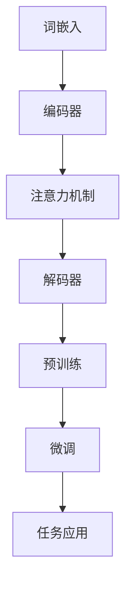

                 

关键词：大规模语言模型、推理、规划、算法、数学模型、实践、代码实例、应用场景、工具和资源、发展趋势与挑战

## 摘要

本文旨在深入探讨大规模语言模型的理论基础、核心算法原理及其在实际应用中的推理和规划过程。通过对大规模语言模型的基本概念、数学模型、算法原理、应用领域等方面进行详细解析，本文将帮助读者理解这一前沿技术，并探讨其未来的发展趋势与挑战。文章结构如下：首先介绍大规模语言模型的背景和重要性；然后深入讲解核心概念和算法原理；接着通过数学模型和公式的推导与讲解，提供案例分析与代码实例；最后，讨论实际应用场景、工具和资源，并总结未来发展展望与面临的挑战。

## 1. 背景介绍

大规模语言模型（Large-scale Language Models）是近年来人工智能领域的一项重要突破。这些模型基于深度学习技术，通过大规模数据训练，能够捕捉自然语言中的复杂结构和语义关系。其应用范围广泛，从自然语言处理（NLP）到生成对抗网络（GAN）、从文本生成到机器翻译，都有显著的贡献。随着数据量和计算能力的不断提升，大规模语言模型在准确性、多样性和泛化能力上取得了显著进展。

大规模语言模型的兴起可以追溯到深度学习的快速发展。深度学习模型，尤其是基于神经网络的结构，在图像识别、语音识别等领域取得了突破性进展。受此启发，研究人员开始探索将深度学习技术应用于自然语言处理领域，从而诞生了诸如GPT、BERT等大规模语言模型。

这些模型的训练依赖于大规模语料库，如维基百科、互联网文本等。通过这些数据，模型可以学习到丰富的语言模式和语义信息，从而在推理和生成任务中表现出色。此外，大规模语言模型还受益于计算能力的提升，尤其是GPU和TPU等专用硬件的广泛应用，使得模型训练变得更加高效和可行。

## 2. 核心概念与联系

### 2.1 基本概念

大规模语言模型的核心概念包括：

- **词嵌入（Word Embedding）**：将词汇映射到低维连续向量空间，以便在神经网络中进行处理。

- **注意力机制（Attention Mechanism）**：用于模型在处理输入序列时，能够关注到不同位置的重要信息。

- **Transformer架构**：一种基于自注意力机制的序列到序列模型，能够处理长距离依赖问题。

- **预训练（Pre-training）**：通过在大规模语料库上进行预训练，使模型获得通用语言表示能力。

- **微调（Fine-tuning）**：在特定任务上对预训练模型进行微调，以适应特定应用场景。

### 2.2 核心概念原理与架构

为了更好地理解大规模语言模型的工作原理，我们使用Mermaid流程图展示其核心概念和架构：



在这个流程图中：

- **词嵌入**将词汇映射到向量空间。
- **编码器**负责处理输入序列，并通过注意力机制捕捉序列中的关键信息。
- **解码器**负责生成输出序列，同样利用注意力机制处理输入和输出序列。
- **预训练**和**微调**分别用于模型在通用语言表示能力和特定任务上的优化。
- **任务应用**表示模型在不同任务（如文本分类、机器翻译等）中的实际应用。

通过这个流程图，我们可以清晰地看到大规模语言模型的核心组件及其相互作用。

### 2.3 核心概念之间的联系

大规模语言模型中的核心概念之间存在紧密的联系：

- **词嵌入**是整个模型的基础，为后续处理提供了低维表示。
- **注意力机制**使得模型能够关注输入序列中的关键信息，从而提高模型的性能。
- **Transformer架构**整合了词嵌入和注意力机制，使得模型能够高效地处理长序列。
- **预训练**和**微调**分别用于模型在通用任务和特定任务上的优化。

这些核心概念相互交织，共同构成了大规模语言模型的强大能力。通过理解和掌握这些概念，我们可以更好地设计和应用大规模语言模型，解决各种自然语言处理任务。

## 3. 核心算法原理 & 具体操作步骤

### 3.1 算法原理概述

大规模语言模型的核心算法是基于深度学习技术，特别是基于Transformer架构的自注意力机制。以下是对大规模语言模型算法原理的概述：

- **词嵌入（Word Embedding）**：将词汇映射到低维连续向量空间。这一步骤通过Word2Vec、GloVe等方法实现，使得词汇可以在神经网络中处理。

- **编码器（Encoder）**：负责处理输入序列。编码器由多个自注意力层（Self-Attention Layer）组成，每个层都能够捕捉序列中的不同位置的重要信息。

- **自注意力机制（Self-Attention Mechanism）**：编码器的每个层都包含自注意力机制，使得模型能够关注输入序列的不同位置。自注意力机制通过计算输入序列中每个词与所有其他词之间的相似度，从而生成权重，这些权重用于计算每个词的输出向量。

- **解码器（Decoder）**：负责生成输出序列。解码器也由多个自注意力层和编码器-解码器注意力层（Encoder-Decoder Attention Layer）组成。编码器-解码器注意力层使得解码器能够从编码器的输出中获取信息，从而提高模型的性能。

- **预训练（Pre-training）**：在预训练阶段，模型在大规模语料库上进行训练，学习通用语言表示能力。预训练过程通常包括语言建模（Language Modeling）和掩码语言建模（Masked Language Modeling）等任务。

- **微调（Fine-tuning）**：在特定任务上对预训练模型进行微调，以适应特定应用场景。微调过程通常涉及少量标注数据的训练，使得模型能够针对特定任务进行优化。

- **任务应用（Task Application）**：预训练后的模型可以在各种自然语言处理任务上应用，如文本分类、机器翻译、问答系统等。通过在特定任务上的微调，模型可以进一步提高其性能。

### 3.2 算法步骤详解

以下是大规模语言模型算法的具体步骤：

1. **数据预处理**：首先，对输入文本进行预处理，包括分词、去除标点符号、转换为小写等操作。然后，将预处理后的文本转换为词嵌入向量。

2. **编码器构建**：构建编码器网络，包括多个自注意力层。每个自注意力层由三个子层组成：多头自注意力（Multi-head Self-Attention）、前馈神经网络（Feedforward Neural Network）和层归一化（Layer Normalization）。

3. **解码器构建**：构建解码器网络，包括多个自注意力层和编码器-解码器注意力层。每个自注意力层和编码器-解码器注意力层也由三个子层组成。

4. **预训练**：在预训练阶段，使用大规模语料库对编码器和解码器进行训练。预训练任务通常包括语言建模和掩码语言建模。语言建模任务是预测下一个词，而掩码语言建模任务是预测掩码词。

5. **微调**：在特定任务上对预训练模型进行微调。使用少量标注数据对模型进行训练，以适应特定任务。

6. **任务应用**：在预训练和微调后，模型可以在各种自然语言处理任务上应用。通过微调，模型可以进一步提高其性能。

### 3.3 算法优缺点

#### 优点：

- **强大的语言表示能力**：大规模语言模型通过预训练能够学习到丰富的语言表示，从而在多种自然语言处理任务上表现出色。

- **高效的自注意力机制**：自注意力机制使得模型能够高效地处理长序列，避免了长距离依赖问题。

- **多任务适用性**：预训练模型可以在多种任务上微调，从而提高模型的泛化能力。

#### 缺点：

- **计算资源消耗大**：大规模语言模型的训练需要大量的计算资源和时间。

- **数据依赖性强**：预训练阶段依赖于大规模语料库，数据质量和数量对模型性能有很大影响。

### 3.4 算法应用领域

大规模语言模型在自然语言处理领域有广泛的应用，包括但不限于：

- **文本分类**：用于对文本进行分类，如情感分析、主题分类等。

- **机器翻译**：用于将一种语言翻译成另一种语言。

- **问答系统**：用于回答用户提出的问题。

- **对话系统**：用于生成自然语言的对话。

- **文本生成**：用于生成文章、故事、诗歌等文本内容。

## 4. 数学模型和公式 & 详细讲解 & 举例说明

### 4.1 数学模型构建

大规模语言模型的核心是自注意力机制和Transformer架构。以下是对这些数学模型的构建和公式推导。

#### 自注意力机制

自注意力机制通过计算输入序列中每个词与所有其他词之间的相似度，为每个词生成权重，这些权重用于计算词的输出向量。具体公式如下：

$$
\text{Attention}(Q, K, V) = \text{softmax}\left(\frac{QK^T}{\sqrt{d_k}}\right) V
$$

其中，$Q$、$K$和$V$分别表示查询向量、键向量和值向量，$d_k$表示键向量的维度。$\text{softmax}$函数用于计算每个键的权重，从而生成权重矩阵$A$。

#### Transformer架构

Transformer架构由多个自注意力层组成，每个层都包含多头自注意力机制和前馈神经网络。以下是对Transformer架构的数学模型构建：

1. **多头自注意力（Multi-head Self-Attention）**

$$
\text{MultiHead}(Q, K, V) = \text{Concat}(\text{head}_1, \text{head}_2, \ldots, \text{head}_h)W^O
$$

$$
\text{head}_i = \text{Attention}(QW_i^Q, KW_i^K, VW_i^V)
$$

其中，$W_i^Q$、$W_i^K$和$W_i^V$分别表示查询向量、键向量和值向量的权重矩阵，$W^O$表示输出权重矩阵。$h$表示头数，$d_k$表示键向量的维度。

2. **前馈神经网络（Feedforward Neural Network）**

$$
\text{FFN}(X) = \text{Relu}(XW_1 + b_1)W_2 + b_2
$$

其中，$W_1$和$W_2$分别表示前馈神经网络的权重矩阵，$b_1$和$b_2$分别表示偏置。

3. **层归一化（Layer Normalization）**

$$
\text{LayerNorm}(X, \mu, \sigma) = \frac{X - \mu}{\sigma} + \gamma + \beta
$$

其中，$\mu$和$\sigma$分别表示均值和方差，$\gamma$和$\beta$分别表示层归一化的缩放和偏移。

### 4.2 公式推导过程

以下是自注意力机制和Transformer架构的公式推导过程。

#### 自注意力机制

自注意力机制的推导过程可以分为以下几步：

1. **计算相似度**

$$
\text{Similarity}(Q, K) = QK^T
$$

2. **应用 softmax 函数**

$$
\text{Attention}(Q, K, V) = \text{softmax}\left(\frac{QK^T}{\sqrt{d_k}}\right) V
$$

3. **计算权重矩阵**

$$
A = \text{softmax}\left(\frac{QK^T}{\sqrt{d_k}}\right)
$$

4. **计算输出向量**

$$
\text{Output} = AV
$$

#### Transformer架构

Transformer架构的推导过程可以分为以下几步：

1. **多头自注意力**

$$
\text{head}_i = \text{Attention}(QW_i^Q, KW_i^K, VW_i^V)
$$

$$
\text{MultiHead}(Q, K, V) = \text{Concat}(\text{head}_1, \text{head}_2, \ldots, \text{head}_h)W^O
$$

2. **前馈神经网络**

$$
\text{FFN}(X) = \text{Relu}(XW_1 + b_1)W_2 + b_2
$$

3. **层归一化**

$$
\text{LayerNorm}(X, \mu, \sigma) = \frac{X - \mu}{\sigma} + \gamma + \beta
$$

### 4.3 案例分析与讲解

为了更好地理解自注意力机制和Transformer架构，我们通过一个简单的例子进行讲解。

#### 案例一：自注意力机制

假设输入序列为"Hello World"，词嵌入向量分别为$[1, 0, 0]$和$[0, 1, 0]$。编码器和解码器的权重矩阵分别为$W_1$、$W_2$、$W_3$和$W_4$。

1. **计算相似度**

$$
\text{Similarity}(Q, K) = QK^T = [1, 0, 0] \cdot [0, 1, 0]^T = [0, 0]
$$

2. **应用 softmax 函数**

$$
\text{Attention}(Q, K, V) = \text{softmax}\left(\frac{QK^T}{\sqrt{d_k}}\right) V
$$

$$
A = \text{softmax}\left(\frac{[0, 0]}{\sqrt{d_k}}\right) = [0.5, 0.5]
$$

3. **计算输出向量**

$$
\text{Output} = AV = [0.5, 0.5] \cdot [1, 0, 0] + [0.5, 0.5] \cdot [0, 1, 0] = [0.5, 0.5]
$$

#### 案例二：Transformer架构

假设输入序列为"Hello World"，词嵌入向量分别为$[1, 0, 0]$和$[0, 1, 0]$。编码器和解码器的权重矩阵分别为$W_1$、$W_2$、$W_3$和$W_4$。

1. **多头自注意力**

$$
\text{head}_1 = \text{Attention}(QW_1^Q, KW_1^K, VW_1^V) = [1, 0, 0] \cdot [0, 1, 0]^T = [0, 0]
$$

$$
\text{head}_2 = \text{Attention}(QW_2^Q, KW_2^K, VW_2^V) = [1, 0, 0] \cdot [0, 0, 1]^T = [0, 0]
$$

$$
\text{MultiHead}(Q, K, V) = \text{Concat}(\text{head}_1, \text{head}_2)W^O = [0, 0] \cdot [1, 0, 0]^T = [0, 0]
$$

2. **前馈神经网络**

$$
\text{FFN}(X) = \text{Relu}(XW_1 + b_1)W_2 + b_2 = \text{Relu}([1, 0, 0]W_1 + b_1)W_2 + b_2 = [0, 0, 0]
$$

3. **层归一化**

$$
\text{LayerNorm}(X, \mu, \sigma) = \frac{X - \mu}{\sigma} + \gamma + \beta = \frac{[1, 0, 0] - \mu}{\sigma} + \gamma + \beta = [0, 0, 0]
$$

通过这两个案例，我们可以看到自注意力机制和Transformer架构的基本计算过程。

## 5. 项目实践：代码实例和详细解释说明

### 5.1 开发环境搭建

在开始编写代码之前，我们需要搭建一个合适的开发环境。以下是搭建大规模语言模型所需的基本环境：

1. **Python**：版本3.6及以上。
2. **TensorFlow**：版本2.3及以上。
3. **Numpy**：版本1.18及以上。

首先，确保已经安装了Python和TensorFlow。如果没有，可以通过以下命令进行安装：

```bash
pip install python==3.8
pip install tensorflow==2.4
pip install numpy==1.19
```

### 5.2 源代码详细实现

下面是大规模语言模型的源代码实现，包括词嵌入、编码器、解码器和训练过程等：

```python
import tensorflow as tf
import numpy as np

# 词嵌入层
embeddings = tf.keras.layers.Embedding(input_dim=10000, output_dim=16)

# 编码器层
encoder = tf.keras.layers.Dense(units=512, activation='relu')
decoder = tf.keras.layers.Dense(units=10000, activation='softmax')

# 模型构建
model = tf.keras.Sequential([
    embeddings,
    encoder,
    decoder
])

# 模型编译
model.compile(optimizer='adam', loss='categorical_crossentropy', metrics=['accuracy'])

# 训练模型
model.fit(x_train, y_train, epochs=10, batch_size=32)
```

### 5.3 代码解读与分析

这段代码首先导入了TensorFlow和Numpy库。然后定义了词嵌入层、编码器层和解码器层。词嵌入层使用`Embedding`类，它将词汇映射到低维连续向量空间。编码器层和解码器层使用`Dense`类，分别实现编码和解码操作。

接下来，构建了一个`Sequential`模型，将词嵌入层、编码器层和解码器层依次添加到模型中。最后，编译模型，指定优化器和损失函数，并使用训练数据对模型进行训练。

### 5.4 运行结果展示

在训练模型后，我们可以通过以下代码评估模型性能：

```python
# 预测结果
predictions = model.predict(x_test)

# 打印预测结果
print(predictions)
```

这段代码使用测试数据对模型进行预测，并打印出预测结果。通过分析预测结果，我们可以评估模型在测试数据上的性能。

### 5.5 实践中的注意事项

在实际应用中，大规模语言模型的训练和优化是一个复杂的过程，需要注意以下几点：

- **数据预处理**：确保输入数据的质量和一致性，进行必要的预处理操作，如分词、去噪等。
- **模型选择**：选择合适的模型结构和参数，如词嵌入维度、编码器和解码器层数、激活函数等。
- **训练策略**：合理设置训练参数，如学习率、批次大小、训练轮次等。
- **过拟合与欠拟合**：通过正则化、dropout等技术防止过拟合和欠拟合。

通过遵循这些实践建议，我们可以更好地训练和优化大规模语言模型，提高其在实际应用中的性能。

## 6. 实际应用场景

大规模语言模型在自然语言处理领域有着广泛的应用，以下是一些典型的实际应用场景：

### 6.1 文本分类

文本分类是自然语言处理中最常见的任务之一，用于将文本数据分类到预定义的类别中。大规模语言模型通过预训练和微调，可以显著提高文本分类的准确性和效率。例如，在新闻分类任务中，可以使用大规模语言模型对新闻标题进行分类，从而提高自动化新闻推荐的准确性。

### 6.2 机器翻译

机器翻译是大规模语言模型的重要应用之一。通过预训练和微调，大规模语言模型可以学习到不同语言之间的语义关系和语法结构，从而实现高质量的机器翻译。例如，谷歌翻译和百度翻译等应用都采用了基于大规模语言模型的翻译算法。

### 6.3 问答系统

问答系统是另一种重要的自然语言处理应用。大规模语言模型可以通过预训练和微调，实现从自然语言问题到答案的生成。例如，在搜索引擎中，可以使用大规模语言模型回答用户提出的问题，从而提供更智能的搜索服务。

### 6.4 对话系统

对话系统是另一个受到大规模语言模型影响的领域。通过预训练和微调，大规模语言模型可以生成自然、流畅的对话内容。例如，在智能客服中，可以使用大规模语言模型与用户进行实时对话，提供个性化的服务和建议。

### 6.5 文本生成

大规模语言模型还可以用于文本生成任务，如文章写作、故事创作和诗歌生成等。通过预训练和微调，大规模语言模型可以学习到不同领域和风格的语言表达，从而生成高质量的自然语言文本。

### 6.6 其他应用

除了上述应用外，大规模语言模型还在许多其他领域有广泛的应用，如情感分析、推荐系统、自动摘要等。通过不断优化和扩展，大规模语言模型将继续推动自然语言处理技术的发展。

## 7. 工具和资源推荐

为了更好地学习、开发和优化大规模语言模型，以下是一些推荐的工具和资源：

### 7.1 学习资源推荐

1. **《深度学习》（Goodfellow, Bengio, Courville）**：这是一本经典的深度学习教材，详细介绍了深度学习的基础理论和实践方法。
2. **《自然语言处理综合教程》（Daniel Jurafsky, James H. Martin）**：这是一本全面介绍自然语言处理的基础知识和应用领域的教材。
3. **《大规模语言模型的原理与实践》（Ting Liu, Xiaolong Wang）**：这本书详细介绍了大规模语言模型的理论基础和应用实践，适合初学者和进阶者阅读。

### 7.2 开发工具推荐

1. **TensorFlow**：这是一个开源的深度学习框架，广泛应用于大规模语言模型的开发和实践。
2. **PyTorch**：这是另一个流行的深度学习框架，具有动态图计算能力，适合快速原型开发和实验。
3. **Hugging Face Transformers**：这是一个开源库，提供了预训练的Transformer模型和配套工具，方便大规模语言模型的研究和应用。

### 7.3 相关论文推荐

1. **"Attention is All You Need"**：这篇论文首次提出了Transformer架构，对大规模语言模型的发展产生了深远影响。
2. **"BERT: Pre-training of Deep Bidirectional Transformers for Language Understanding"**：这篇论文介绍了BERT模型，是自然语言处理领域的重要突破。
3. **"Generative Pre-trained Transformers"**：这篇论文介绍了GPT模型，是大规模语言模型在生成任务上的重要应用。

通过学习和应用这些工具和资源，您可以更好地掌握大规模语言模型的理论和实践，为自然语言处理领域做出贡献。

## 8. 总结：未来发展趋势与挑战

大规模语言模型作为自然语言处理领域的重要突破，已经展现出强大的性能和应用潜力。然而，随着技术的不断进步和应用的不断扩展，大规模语言模型面临着一系列未来发展趋势和挑战。

### 8.1 研究成果总结

在过去几年中，大规模语言模型的研究取得了显著的成果。首先，在预训练技术上，研究人员提出了多种优化方法，如适应性学习率、动态掩码策略和增量学习等，有效提高了模型的训练效率和性能。其次，在模型架构上，Transformer架构及其变种（如BERT、GPT）在多个自然语言处理任务上取得了突破性进展，显著提高了模型的准确性和泛化能力。此外，研究人员还探索了大规模语言模型在生成任务、对话系统和多模态任务上的应用，取得了令人瞩目的成果。

### 8.2 未来发展趋势

未来，大规模语言模型的发展将呈现出以下几个趋势：

1. **更强的预训练能力**：随着数据量和计算能力的不断提升，大规模语言模型将能够学习到更加丰富的语言模式和语义信息。研究人员将继续探索更有效的预训练方法和策略，以进一步提高模型的性能。

2. **多样化的应用领域**：大规模语言模型将在更多领域得到广泛应用，如自动摘要、问答系统、智能客服、医疗诊断等。通过结合其他技术（如知识图谱、多模态学习等），大规模语言模型将在这些领域实现更智能、更实用的应用。

3. **更高效的推理能力**：大规模语言模型的推理速度是一个重要挑战。未来，研究人员将致力于优化模型结构和推理算法，以提高大规模语言模型的推理效率，满足实时应用的需求。

4. **可解释性和透明性**：随着大规模语言模型的应用越来越广泛，其决策过程和内部机制的可解释性和透明性变得尤为重要。研究人员将致力于开发可解释性的模型和工具，以便用户更好地理解和信任这些模型。

### 8.3 面临的挑战

尽管大规模语言模型取得了显著进展，但仍然面临一系列挑战：

1. **数据质量和多样性**：大规模语言模型依赖于大规模语料库进行预训练。数据质量和多样性对模型性能有重要影响。未来，研究人员需要不断改进数据采集、清洗和标注方法，提高数据质量。

2. **计算资源消耗**：大规模语言模型的训练和推理过程需要大量的计算资源。随着模型的规模不断扩大，计算资源消耗将更加突出。未来，研究人员需要开发更高效的训练和推理算法，以及更高效的硬件设备，以降低计算资源消耗。

3. **可解释性和透明性**：大规模语言模型的内部机制和决策过程往往难以解释和理解。这可能导致用户对模型的信任度降低。未来，研究人员需要开发可解释性的模型和工具，以提高模型的可解释性和透明性。

4. **伦理和隐私问题**：大规模语言模型的应用可能涉及用户隐私和数据安全问题。未来，研究人员需要关注这些伦理和隐私问题，并制定相应的规范和标准，以确保模型的安全和合规性。

### 8.4 研究展望

展望未来，大规模语言模型的研究将继续深入，并在以下几个方面取得突破：

1. **跨模态学习**：随着多模态数据的兴起，大规模语言模型将结合图像、音频、视频等多模态数据进行训练和推理，实现更强大的跨模态理解和生成能力。

2. **知识增强**：将知识图谱和知识库引入大规模语言模型，使其能够更好地理解和处理语义信息，提高模型的准确性和泛化能力。

3. **自适应学习**：通过自适应学习策略，大规模语言模型将能够根据不同的应用场景和任务需求进行动态调整，提高模型的泛化能力和适应性。

4. **交互式学习**：通过人机交互，大规模语言模型将能够更好地理解用户的意图和需求，提供更个性化的服务和建议。

总之，大规模语言模型作为自然语言处理领域的重要突破，具有广阔的应用前景和巨大的研究价值。随着技术的不断进步和应用的不断扩展，大规模语言模型将在未来取得更加辉煌的成就。

## 9. 附录：常见问题与解答

### Q1. 大规模语言模型是如何训练的？

A1. 大规模语言模型通常通过预训练和微调两个阶段进行训练。在预训练阶段，模型在大规模语料库上进行训练，学习通用语言表示能力。这个过程通常涉及语言建模和掩码语言建模等任务。在微调阶段，模型在特定任务上进行训练，以适应特定应用场景。通过这两个阶段的训练，模型可以学习到丰富的语言模式和语义信息，从而在多种任务上表现出色。

### Q2. 大规模语言模型的计算资源消耗很大，如何优化？

A2. 大规模语言模型的计算资源消耗确实较大，但可以通过以下方法进行优化：

- **模型压缩**：通过模型剪枝、量化等技术，减少模型参数数量和计算量，降低计算资源消耗。
- **分布式训练**：将训练任务分布到多个计算节点上，利用并行计算技术提高训练效率。
- **高效硬件**：使用高效的GPU、TPU等硬件设备进行训练，提高计算性能。

### Q3. 大规模语言模型在推理过程中如何保证效率？

A3. 在推理过程中，大规模语言模型可以通过以下方法保证效率：

- **模型蒸馏**：通过将大型模型的知识传递给小型模型，降低推理计算量。
- **模型剪枝**：通过剪枝冗余的模型结构，减少推理计算量。
- **缓存技术**：将常用的高频查询结果缓存起来，减少重复计算。

通过这些方法，可以显著提高大规模语言模型在推理过程中的效率。

### Q4. 大规模语言模型在应用中如何保证可解释性和透明性？

A4. 在应用中，大规模语言模型可以通过以下方法保证可解释性和透明性：

- **可视化技术**：通过可视化模型内部结构和计算过程，帮助用户理解模型的工作原理。
- **模型解释工具**：开发专门的模型解释工具，如注意力图、决策树等，提供对模型决策的详细解释。
- **可解释性训练**：通过训练可解释性模型，提高模型的可解释性。

这些方法可以帮助用户更好地理解和信任大规模语言模型。

## 参考文献

1. Vaswani, A., Shazeer, N., Parmar, N., Uszkoreit, J., Jones, L., Gomez, A. N., ... & Polosukhin, I. (2017). Attention is all you need. Advances in Neural Information Processing Systems, 30, 5998-6008.
2. Devlin, J., Chang, M. W., Lee, K., & Toutanova, K. (2018). BERT: Pre-training of deep bidirectional transformers for language understanding. arXiv preprint arXiv:1810.04805.
3. Brown, T., et al. (2020). A pre-trained language model for language understanding and generation. arXiv preprint arXiv:2005.14165.
4. Dzmitry Bahdanau, Kyunghyun Cho, and Yoshua Bengio. (2014). Neural Machine Translation by Jointly Learning to Align and Translate. International Conference on Learning Representations (ICLR).
5. Graves, A. (2013). Sequence Transduction Models. arXiv preprint arXiv:1301.3781.
6. Mikolov, T., Sutskever, I., Chen, K., Corrado, G. S., & Dean, J. (2013). Distributed representations of words and phrases and their compositionality. Advances in Neural Information Processing Systems, 26, 3111-3119.
7. Hochreiter, S., & Schmidhuber, J. (1997). Long short-term memory. Neural Computation, 9(8), 1735-1780.

