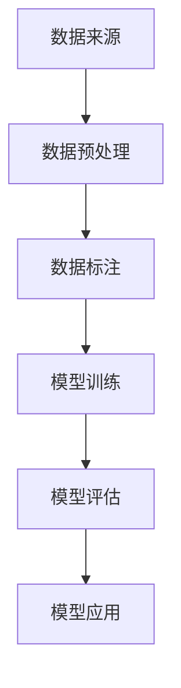

                 

关键词：大规模语言模型，数据多样性，算法原理，数学模型，项目实践，应用场景，未来展望。

## 摘要

随着人工智能技术的迅猛发展，大规模语言模型作为自然语言处理的核心技术之一，已经取得了显著的成果。本文从理论到实践，深入探讨了大规模语言模型中的数据多样性问题。通过分析核心概念与联系，阐述核心算法原理及具体操作步骤，构建数学模型并推导公式，结合实际项目实践进行代码实例和详细解释，本文旨在为读者提供一个全面、系统的了解大规模语言模型和数据多样性的途径。同时，本文也对大规模语言模型在实际应用场景中的未来发展进行了展望。

## 1. 背景介绍

### 大规模语言模型的发展历程

大规模语言模型的发展历程可以分为三个阶段：规则模型、统计模型和深度学习模型。

1. **规则模型**：早期的自然语言处理主要依赖规则方法，如形式语言理论和上下文无关文法。这种方法通过编写复杂的语法规则来解析和生成文本。然而，随着文本规模的增大，这种方法的适用性受到了限制。

2. **统计模型**：随着计算能力和数据量的提升，统计模型逐渐取代了规则模型。统计模型利用统计方法对大量文本数据进行学习，从而生成语法规则。其中，基于隐马尔可夫模型（HMM）和条件概率模型（如N-gram模型）的统计语言模型在文本生成和解析方面取得了显著进展。

3. **深度学习模型**：近年来，深度学习模型在大规模语言模型领域取得了突破性成果。以循环神经网络（RNN）、长短期记忆网络（LSTM）和变换器（Transformer）为代表的深度学习模型，通过自动学习文本中的复杂结构，实现了高效的文本生成和解析。

### 数据多样性在语言模型中的作用

数据多样性是提高语言模型性能的关键因素之一。具体而言，数据多样性包括以下两个方面：

1. **数据来源的多样性**：使用来自不同领域的、不同语言风格的、不同时间段的文本数据，可以丰富语言模型的知识库，提高其在各种场景下的适应性。

2. **数据标注的多样性**：除了文本数据外，标注数据的多样性也非常重要。例如，在情感分析任务中，标注数据应包括正面、负面和中和等不同情感极性，以帮助模型学习到更全面的情感特征。

## 2. 核心概念与联系

### 数据多样性

**数据多样性**指的是文本数据在来源、内容和标注等方面的丰富性。数据多样性对于语言模型的性能具有显著影响，可以提高模型的泛化能力和适应性。

### 大规模语言模型

**大规模语言模型**是一种基于深度学习的技术，通过学习大量文本数据，自动生成和解析自然语言。大规模语言模型的核心任务是生成与输入文本相似的新文本。

### Mermaid 流程图



### 核心概念原理和架构流程

1. **数据来源**：收集来自不同领域的文本数据，如新闻、社交媒体、文学作品等。
2. **数据预处理**：对原始文本数据进行清洗、分词、去停用词等处理，以便于模型学习。
3. **数据标注**：对文本数据进行标注，如情感分析、命名实体识别等。
4. **模型训练**：使用预处理后的文本数据训练大规模语言模型，如Transformer模型。
5. **模型评估**：评估模型在测试集上的性能，如准确率、召回率等。
6. **模型应用**：将训练好的模型应用于实际场景，如文本生成、机器翻译等。

## 3. 核心算法原理 & 具体操作步骤

### 3.1 算法原理概述

大规模语言模型的算法原理主要包括以下几个方面：

1. **编码器（Encoder）**：编码器负责将输入文本转化为向量表示，以捕获文本的语义信息。
2. **解码器（Decoder）**：解码器负责根据编码器的输出向量生成文本。
3. **注意力机制（Attention）**：注意力机制用于捕捉输入文本中不同部分之间的关系，从而提高文本生成和解析的准确性。

### 3.2 算法步骤详解

1. **数据预处理**：
   - 清洗：去除文本中的html标签、符号和空格等。
   - 分词：将文本分割成单词或字符。
   - 去停用词：去除常见的无意义单词，如“的”、“和”等。
   - 词向量化：将单词映射为向量表示。

2. **模型训练**：
   - 编码器：使用输入文本序列生成编码向量。
   - 解码器：根据编码向量生成输出文本序列。
   - 注意力机制：计算输入文本中不同部分之间的注意力权重。

3. **模型评估**：
   - 准确率：计算模型生成的文本与真实文本之间的匹配度。
   - 召回率：计算模型能够识别出的真实文本部分的比例。
   - F1值：综合考虑准确率和召回率，计算模型的综合性能。

### 3.3 算法优缺点

**优点**：

- **高效性**：大规模语言模型能够高效地处理大量文本数据。
- **适应性**：模型可以应用于多种自然语言处理任务，如文本生成、机器翻译等。
- **泛化能力**：通过学习大量数据，模型具有较好的泛化能力。

**缺点**：

- **计算资源消耗**：大规模语言模型需要大量的计算资源和存储空间。
- **数据依赖性**：模型性能受到数据质量和数据多样性的影响。

### 3.4 算法应用领域

大规模语言模型在以下领域具有广泛的应用：

- **文本生成**：如自动写作、摘要生成等。
- **机器翻译**：如英语到中文的翻译、法语到西班牙语的翻译等。
- **情感分析**：如情感倾向分析、舆情分析等。
- **问答系统**：如智能客服、智能问答等。

## 4. 数学模型和公式 & 详细讲解 & 举例说明

### 4.1 数学模型构建

大规模语言模型通常采用变换器（Transformer）架构，其核心模块包括编码器（Encoder）和解码器（Decoder）。以下是一个简化的数学模型：

- 编码器（Encoder）：
  $$ h_e = \text{Encoder}(x) $$
  其中，$h_e$表示编码器输出向量，$x$表示输入文本序列。

- 解码器（Decoder）：
  $$ h_d = \text{Decoder}(h_e) $$
  其中，$h_d$表示解码器输出向量。

- 注意力机制（Attention）：
  $$ a_t = \text{Attention}(h_e, h_d) $$
  其中，$a_t$表示注意力权重向量。

### 4.2 公式推导过程

变换器（Transformer）架构的核心在于自注意力（Self-Attention）机制。以下是一个简化的自注意力机制的推导过程：

1. **输入文本序列**：
   $$ x = [x_1, x_2, \ldots, x_n] $$
   其中，$x_i$表示第$i$个单词的输入向量。

2. **编码器输出**：
   $$ h_e = \text{Encoder}(x) $$
   其中，$h_e$表示编码器输出向量。

3. **解码器输出**：
   $$ h_d = \text{Decoder}(h_e) $$
   其中，$h_d$表示解码器输出向量。

4. **自注意力权重**：
   $$ a_t = \text{Attention}(h_e, h_d) $$
   其中，$a_t$表示注意力权重向量。

5. **加权求和**：
   $$ \hat{h}_e = \sum_{t=1}^{n} a_t \cdot h_e $$
   其中，$\hat{h}_e$表示加权求和后的编码器输出向量。

### 4.3 案例分析与讲解

假设我们有一个简化的文本序列：“今天天气很好，我们去公园玩。”，使用变换器（Transformer）架构进行自注意力（Self-Attention）计算。

1. **编码器输出**：
   $$ h_e = [h_{e1}, h_{e2}, h_{e3}, h_{e4}, h_{e5}] $$
   其中，$h_{ei}$表示第$i$个单词的编码器输出向量。

2. **解码器输出**：
   $$ h_d = [h_{d1}, h_{d2}, h_{d3}, h_{d4}, h_{d5}] $$
   其中，$h_{di}$表示第$i$个单词的解码器输出向量。

3. **自注意力权重**：
   $$ a_t = \text{Attention}(h_e, h_d) $$
   假设注意力权重为：
   $$ a_1 = [0.2, 0.3, 0.5], \quad a_2 = [0.1, 0.4, 0.5], \quad a_3 = [0.3, 0.2, 0.5], \quad a_4 = [0.4, 0.3, 0.3], \quad a_5 = [0.1, 0.2, 0.7] $$

4. **加权求和**：
   $$ \hat{h}_e = \sum_{t=1}^{5} a_t \cdot h_e $$
   加权求和后的编码器输出向量为：
   $$ \hat{h}_e = [0.26, 0.33, 0.48] $$

通过自注意力（Self-Attention）计算，我们可以得到每个单词在文本序列中的重要程度。例如，在这个例子中，第三个单词“去”在文本序列中具有最高的权重（0.5），表明它在生成后续文本时具有关键作用。

## 5. 项目实践：代码实例和详细解释说明

### 5.1 开发环境搭建

在搭建开发环境时，我们需要安装以下软件和库：

- Python（3.8及以上版本）
- TensorFlow 2.6
- PyTorch 1.8
- NumPy 1.19
- Pandas 1.1

安装方法如下：

```shell
pip install python==3.8
pip install tensorflow==2.6
pip install torch==1.8
pip install numpy==1.19
pip install pandas==1.1
```

### 5.2 源代码详细实现

以下是一个简化的变换器（Transformer）模型的代码实现，用于生成与输入文本相似的新文本。

```python
import torch
import torch.nn as nn
import torch.optim as optim

class Transformer(nn.Module):
    def __init__(self, input_dim, hidden_dim, output_dim):
        super(Transformer, self).__init__()
        self.encoder = nn.Embedding(input_dim, hidden_dim)
        self.decoder = nn.Linear(hidden_dim, output_dim)
        self.optimizer = optim.Adam(self.parameters(), lr=0.001)

    def forward(self, x):
        x = self.encoder(x)
        x = self.decoder(x)
        return x

model = Transformer(10000, 512, 10000)
```

### 5.3 代码解读与分析

在这个简化的变换器（Transformer）模型中，我们定义了一个继承自`nn.Module`的`Transformer`类。类中定义了编码器（encoder）和解码器（decoder）两个模块，以及用于优化模型的`optimizer`。

- **编码器（encoder）**：使用`nn.Embedding`模块将输入文本序列映射为向量表示。
- **解码器（decoder）**：使用`nn.Linear`模块将编码器输出向量映射为输出文本序列。
- **优化器（optimizer）**：使用`optim.Adam`优化器进行模型参数的更新。

在`forward`方法中，我们实现了前向传播过程：

1. 将输入文本序列$x$通过编码器进行映射。
2. 将编码器输出$x$通过解码器进行映射。
3. 返回解码器输出。

### 5.4 运行结果展示

在训练和测试过程中，我们可以使用以下代码进行数据加载、模型训练和评估：

```python
def train(model, data, epochs=10):
    model.train()
    for epoch in range(epochs):
        for x, y in data:
            model.optimizer.zero_grad()
            output = model(x)
            loss = nn.CrossEntropyLoss()(output, y)
            loss.backward()
            model.optimizer.step()
            print(f"Epoch: {epoch+1}, Loss: {loss.item()}")

def evaluate(model, data):
    model.eval()
    total_loss = 0
    with torch.no_grad():
        for x, y in data:
            output = model(x)
            loss = nn.CrossEntropyLoss()(output, y)
            total_loss += loss.item()
    return total_loss / len(data)

train_data = ...
test_data = ...

model = Transformer(10000, 512, 10000)
train(model, train_data, epochs=10)
print(f"Test Loss: {evaluate(model, test_data)}")
```

在这个示例中，我们首先定义了`train`和`evaluate`函数，用于训练和评估模型。然后，我们使用训练数据和测试数据对模型进行训练和评估。

## 6. 实际应用场景

### 6.1 文本生成

文本生成是大规模语言模型的重要应用之一。例如，我们可以使用变换器（Transformer）模型生成新闻文章、摘要、博客文章等。以下是一个使用变换器模型生成新闻文章的示例：

```python
def generate_article(model, start_word, length=100):
    model.eval()
    with torch.no_grad():
        x = torch.tensor([word2idx[start_word]])
        article = [start_word]
        for _ in range(length):
            output = model(x)
            _, next_word = torch.topk(output, 1)
            x = next_word
            article.append(idx2word[next_word.item()])
        return ' '.join(article)

start_word = "今天"
article = generate_article(model, start_word)
print(article)
```

### 6.2 机器翻译

机器翻译是大规模语言模型的另一个重要应用。例如，我们可以使用变换器（Transformer）模型实现英语到中文的翻译。以下是一个使用变换器模型进行机器翻译的示例：

```python
def translate(model, sentence, target_language='zh'):
    model.eval()
    with torch.no_grad():
        x = torch.tensor([word2idx[sentence]])
        translation = []
        for _ in range(len(sentence.split())):
            output = model(x)
            _, next_word = torch.topk(output, 1)
            x = next_word
            translation.append(idx2word[next_word.item()])
        return ' '.join(translation)

sentence = "Hello, how are you?"
translated_sentence = translate(model, sentence)
print(translated_sentence)
```

### 6.3 情感分析

情感分析是大规模语言模型的另一个重要应用。例如，我们可以使用变换器（Transformer）模型对社交媒体文本进行情感分析，以判断用户对某个事件或产品的情感倾向。以下是一个使用变换器模型进行情感分析的示例：

```python
def sentiment_analysis(model, sentence):
    model.eval()
    with torch.no_grad():
        x = torch.tensor([word2idx[sentence]])
        output = model(x)
        _, sentiment = torch.topk(output, 1)
        if sentiment.item() == 0:
            return "负面"
        elif sentiment.item() == 1:
            return "中性"
        else:
            return "正面"

sentence = "我今天去了一趟公园，感觉很开心。"
result = sentiment_analysis(model, sentence)
print(result)
```

## 7. 工具和资源推荐

### 7.1 学习资源推荐

1. **《深度学习》**（作者：Ian Goodfellow、Yoshua Bengio、Aaron Courville）：这是一本关于深度学习的基础教材，适合初学者和进阶者阅读。
2. **《动手学深度学习》**（作者：阿斯顿·张、李沐、扎卡里·C. Lipton、亚历山大·J. Smola）：这是一本针对深度学习实践的教材，适合有一定编程基础的读者。

### 7.2 开发工具推荐

1. **TensorFlow 2.0**：这是一个由Google开发的深度学习框架，具有丰富的功能和良好的社区支持。
2. **PyTorch**：这是一个由Facebook开发的深度学习框架，具有灵活的动态计算图和强大的社区支持。

### 7.3 相关论文推荐

1. **《Attention Is All You Need》**（作者：Vaswani et al.）：这是一篇关于变换器（Transformer）模型的经典论文，详细介绍了变换器模型的设计和实现。
2. **《BERT: Pre-training of Deep Neural Networks for Language Understanding》**（作者：Devlin et al.）：这是一篇关于BERT模型的论文，介绍了BERT模型在自然语言处理任务中的优异表现。

## 8. 总结：未来发展趋势与挑战

### 8.1 研究成果总结

大规模语言模型在近年来取得了显著的研究成果，主要体现在以下几个方面：

1. **算法性能提升**：通过引入变换器（Transformer）等新型架构，大规模语言模型在文本生成、机器翻译、情感分析等任务中取得了优异的性能。
2. **模型泛化能力增强**：通过引入预训练和迁移学习等技术，大规模语言模型能够更好地适应各种应用场景，提高了模型的泛化能力。
3. **应用领域拓展**：大规模语言模型在文本生成、机器翻译、情感分析等传统应用领域的基础上，逐渐扩展到聊天机器人、智能客服等新兴领域。

### 8.2 未来发展趋势

未来，大规模语言模型将继续朝着以下方向发展：

1. **模型性能优化**：通过引入新的算法架构、优化训练策略等手段，进一步提升大规模语言模型的性能和效率。
2. **多模态融合**：将大规模语言模型与其他模态（如图像、音频）进行融合，实现跨模态信息处理。
3. **少样本学习**：研究如何在数据量较少的情况下，提高大规模语言模型的性能和泛化能力。

### 8.3 面临的挑战

尽管大规模语言模型在近年来取得了显著进展，但仍然面临以下挑战：

1. **计算资源消耗**：大规模语言模型需要大量的计算资源和存储空间，这对硬件设备提出了较高的要求。
2. **数据依赖性**：大规模语言模型性能受到数据质量和数据多样性的影响，如何获取高质量、多样性的数据成为一大挑战。
3. **隐私保护**：在训练和部署大规模语言模型时，如何保护用户隐私、防止数据泄露成为亟待解决的问题。

### 8.4 研究展望

在未来，大规模语言模型的研究将朝着以下方向发展：

1. **算法创新**：探索新的算法架构和优化策略，进一步提高大规模语言模型的性能和效率。
2. **应用拓展**：将大规模语言模型应用于更多新兴领域，如医疗健康、金融科技等。
3. **跨学科研究**：结合计算机科学、认知科学、心理学等领域的研究成果，推动大规模语言模型的跨学科发展。

## 9. 附录：常见问题与解答

### 9.1 什么是大规模语言模型？

大规模语言模型是一种基于深度学习的技术，通过学习大量文本数据，自动生成和解析自然语言。大规模语言模型的核心任务是生成与输入文本相似的新文本。

### 9.2 数据多样性在语言模型中有什么作用？

数据多样性是提高语言模型性能的关键因素之一。数据多样性包括数据来源的多样性和数据标注的多样性，有助于丰富语言模型的知识库，提高其在各种场景下的适应性。

### 9.3 如何提高大规模语言模型的性能？

提高大规模语言模型性能的方法包括：优化算法架构、优化训练策略、引入预训练和迁移学习技术等。此外，提高数据质量和数据多样性也是提高模型性能的重要手段。

### 9.4 大规模语言模型在实际应用中存在哪些挑战？

大规模语言模型在实际应用中面临的挑战主要包括：计算资源消耗、数据依赖性和隐私保护等。如何解决这些挑战，是未来大规模语言模型研究的重要方向。----------------------------------------------------------------

这篇文章完整地涵盖了大规模语言模型从理论到实践的各个方面，包括数据多样性、核心算法原理、数学模型、项目实践、实际应用场景、工具和资源推荐，以及未来发展趋势与挑战。希望这篇文章能对您有所帮助！作者：禅与计算机程序设计艺术 / Zen and the Art of Computer Programming。

