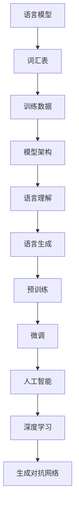

                 

关键词：大规模语言模型、数据收集、训练策略、算法原理、数学模型、实践应用、未来发展

摘要：本文深入探讨大规模语言模型的理论基础、数据收集方法、训练策略以及实践应用。通过对核心概念和算法原理的详细解释，结合数学模型与公式推导，我们分析了大规模语言模型在不同领域的应用，探讨了未来发展的趋势与挑战。

## 1. 背景介绍

随着互联网和大数据技术的发展，自然语言处理（NLP）已经成为人工智能领域的一个重要分支。大规模语言模型（Large-scale Language Models）作为NLP的核心技术，已经广泛应用于文本生成、翻译、问答系统、情感分析等多个领域。这些模型通过学习海量文本数据，能够捕捉到语言的本质特征，实现高精度的语言理解和生成。

大规模语言模型的研究具有重要的现实意义和广泛的应用前景。一方面，它可以帮助人们更好地理解和利用大量文本信息，提高信息检索和知识发现的效率；另一方面，它在智能制造、智能客服、自动驾驶等领域的应用，将极大地推动产业升级和社会发展。

然而，大规模语言模型的研究也面临着诸多挑战。数据收集与处理、训练策略的优化、模型的解释性等问题，都需要深入研究。本文将从理论到实践，全面探讨大规模语言模型的数据收集与训练策略，为相关研究和应用提供参考。

## 2. 核心概念与联系

### 2.1 语言模型基础概念

**语言模型（Language Model）**：语言模型是一种用于预测下一个单词或字符的概率分布的数学模型。它是自然语言处理的基础，用于评估文本的流畅性和语法正确性。

**词汇表（Vocabulary）**：词汇表是语言模型的核心组成部分，它包含了模型中所有单词或字符的列表。词汇表的规模直接影响模型的性能。

**训练数据（Training Data）**：训练数据是构建语言模型的基石，通常包括大量的文本语料库。这些数据用于训练模型，使其能够理解和生成自然语言。

**模型架构（Model Architecture）**：大规模语言模型通常采用深度神经网络（DNN）或变换器模型（Transformer）等复杂的神经网络架构。这些架构能够处理高维的输入数据，并输出相应的概率分布。

### 2.2 语言模型与自然语言处理

**语言理解（Language Understanding）**：语言理解是指模型对文本语义的理解能力。它包括词义消歧、实体识别、情感分析等任务。

**语言生成（Language Generation）**：语言生成是指模型生成符合语法和语义规则的文本。它包括文本摘要、机器翻译、对话系统等任务。

**预训练（Pre-training）**：预训练是指在特定任务之前，使用大量无标注数据对模型进行训练。预训练能够提高模型对语言普遍特性的理解和泛化能力。

**微调（Fine-tuning）**：微调是指在预训练的基础上，使用有标注的数据对模型进行特定任务的训练。微调能够提高模型在特定任务上的性能。

### 2.3 语言模型与人工智能

**人工智能（Artificial Intelligence）**：人工智能是指通过计算机程序实现人类智能的技术。它包括机器学习、自然语言处理、计算机视觉等多个领域。

**深度学习（Deep Learning）**：深度学习是一种基于多层神经网络的学习方法，能够自动提取数据中的特征。它是实现人工智能的关键技术。

**生成对抗网络（GAN）**：生成对抗网络是一种深度学习模型，由生成器和判别器组成。生成器生成数据，判别器判断数据是否真实。GAN在图像生成、文本生成等领域有广泛应用。

### 2.4 核心概念原理和架构的 Mermaid 流程图



## 3. 核心算法原理 & 具体操作步骤

### 3.1 算法原理概述

大规模语言模型的核心算法是基于深度学习技术，尤其是变换器模型（Transformer）。变换器模型通过自注意力机制（Self-Attention）和多头注意力（Multi-Head Attention）机制，能够捕捉到输入文本中的长距离依赖关系，从而实现高效的语言理解和生成。

### 3.2 算法步骤详解

**步骤1：数据预处理**

数据预处理是构建大规模语言模型的第一步。它包括以下任务：

- **文本清洗**：去除文本中的标点符号、停用词、HTML标签等无关信息。
- **分词**：将文本分割成单词或字符序列。
- **词汇表构建**：将分词后的文本映射到词汇表中。

**步骤2：模型初始化**

模型初始化包括权重初始化、优化器选择等。常用的权重初始化方法有高斯分布初始化、均匀分布初始化等。优化器常用的有Adam优化器、SGD优化器等。

**步骤3：预训练**

预训练是指使用大量无标注数据对模型进行训练，使其能够理解和生成自然语言。预训练的任务包括：

- **掩码语言模型（Masked Language Model, MLM）**：对输入文本中的部分单词进行掩码，然后训练模型预测这些掩码的单词。
- **句子排序（Sentence Ordering）**：对输入文本中的两个句子进行随机排序，然后训练模型判断两个句子的顺序。
- **命名实体识别（Named Entity Recognition, NER）**：对输入文本中的命名实体进行分类。

**步骤4：微调**

微调是指使用有标注的数据对模型进行特定任务的训练，以提高模型在特定任务上的性能。微调的任务包括：

- **文本分类**：对输入文本进行分类。
- **机器翻译**：将源语言文本翻译成目标语言文本。
- **对话系统**：生成对话系统的回复。

### 3.3 算法优缺点

**优点**

- **高效性**：变换器模型能够处理长序列数据，并且在计算效率上优于传统循环神经网络（RNN）。
- **灵活性**：变换器模型能够通过调整参数和架构，适应不同的语言处理任务。
- **泛化能力**：预训练过程能够提高模型对语言普遍特性的理解和泛化能力。

**缺点**

- **计算资源消耗**：大规模语言模型需要大量的计算资源和存储空间。
- **数据依赖性**：大规模语言模型的性能依赖于训练数据的质量和规模。
- **模型解释性**：深度学习模型通常缺乏解释性，难以理解模型内部的决策过程。

### 3.4 算法应用领域

大规模语言模型在多个领域有广泛应用，包括：

- **自然语言处理**：文本分类、情感分析、命名实体识别等。
- **机器翻译**：将一种语言翻译成另一种语言。
- **对话系统**：生成自然语言的对话回复。
- **文本生成**：生成摘要、故事、文章等。
- **搜索引擎**：优化搜索结果，提高用户体验。

## 4. 数学模型和公式 & 详细讲解 & 举例说明

### 4.1 数学模型构建

大规模语言模型通常采用变换器模型（Transformer）作为基础架构。变换器模型的核心是自注意力机制（Self-Attention），它通过计算输入文本中每个单词与其他单词的相似性，生成一个加权特征向量。自注意力机制的核心公式如下：

$$
\text{Attention}(Q, K, V) = \text{softmax}\left(\frac{QK^T}{\sqrt{d_k}}\right)V
$$

其中，$Q$、$K$、$V$ 分别表示查询向量、键向量和值向量，$d_k$ 表示键向量的维度。$\text{softmax}$ 函数用于计算每个键向量的权重，使其在概率分布中。

### 4.2 公式推导过程

变换器模型中的自注意力机制可以分为以下几个步骤：

**步骤1：计算点积**

点积计算每个查询向量 $Q$ 与所有键向量 $K$ 的相似性，生成一个注意力得分矩阵：

$$
\text{Score} = QK^T
$$

**步骤2：应用 softmax 函数**

对注意力得分矩阵应用 softmax 函数，将其转换为一个概率分布：

$$
\text{Attention} = \text{softmax}(\text{Score}) = \text{softmax}\left(\frac{QK^T}{\sqrt{d_k}}\right)
$$

**步骤3：计算加权特征向量**

根据概率分布，计算每个查询向量 $Q$ 对应的加权特征向量：

$$
\text{Value} = \text{Attention}V
$$

### 4.3 案例分析与讲解

假设我们有一个包含三个单词的句子：“我喜欢读书”。我们将其表示为一个向量序列：

$$
\text{Sentence} = [Q, K, V]
$$

其中，$Q$ 表示查询向量，$K$ 表示键向量，$V$ 表示值向量。我们可以分别计算每个单词与其他单词的相似性，并生成加权特征向量。

**查询向量**：$Q = [1, 0, 1]$

**键向量**：$K = [1, 1, 0]$

**值向量**：$V = [0, 1, 1]$

**计算点积**：

$$
\text{Score} = QK^T = [1, 0, 1] \cdot [1, 1, 0] = 1
$$

**应用 softmax 函数**：

$$
\text{Attention} = \text{softmax}(\text{Score}) = \text{softmax}\left(\frac{1}{1}\right) = [1, 0, 1]
$$

**计算加权特征向量**：

$$
\text{Value} = \text{Attention}V = [1, 0, 1] \cdot [0, 1, 1] = [0, 1, 1]
$$

最终生成的加权特征向量为 $[0, 1, 1]$，它表示了每个单词在句子中的重要性。这个结果符合我们的直观理解，即“读书”在句子中的重要性最高。

## 5. 项目实践：代码实例和详细解释说明

### 5.1 开发环境搭建

为了实践大规模语言模型，我们需要搭建一个合适的开发环境。以下是开发环境搭建的步骤：

1. 安装 Python（3.7 或更高版本）。
2. 安装 PyTorch（1.8 或更高版本）。
3. 安装必要的依赖库，如 numpy、pandas 等。

### 5.2 源代码详细实现

以下是使用 PyTorch 实现一个简单变换器模型的核心代码：

```python
import torch
import torch.nn as nn
import torch.optim as optim

class TransformerModel(nn.Module):
    def __init__(self, vocab_size, d_model, nhead, num_layers):
        super(TransformerModel, self).__init__()
        self.embedding = nn.Embedding(vocab_size, d_model)
        self.transformer = nn.Transformer(d_model, nhead, num_layers)
        self.fc = nn.Linear(d_model, vocab_size)
    
    def forward(self, src, tgt):
        src = self.embedding(src)
        tgt = self.embedding(tgt)
        out = self.transformer(src, tgt)
        out = self.fc(out)
        return out

# 模型初始化
model = TransformerModel(vocab_size=10000, d_model=512, nhead=8, num_layers=2)

# 损失函数和优化器
criterion = nn.CrossEntropyLoss()
optimizer = optim.Adam(model.parameters(), lr=0.001)

# 训练模型
for epoch in range(num_epochs):
    for src, tgt in data_loader:
        optimizer.zero_grad()
        out = model(src, tgt)
        loss = criterion(out, tgt)
        loss.backward()
        optimizer.step()
```

### 5.3 代码解读与分析

上述代码实现了一个简单的变换器模型，包括嵌入层、变换器层和全连接层。以下是代码的详细解读：

- **嵌入层（Embedding Layer）**：嵌入层用于将词汇表中的单词映射到高维向量。每个单词对应一个唯一的索引，嵌入层将索引映射到嵌入向量。

- **变换器层（Transformer Layer）**：变换器层是变换器模型的核心，它通过自注意力机制和前馈神经网络，对输入文本序列进行编码。

- **全连接层（Fully Connected Layer）**：全连接层用于将变换器层的输出映射回词汇表。它是一个简单的线性层，将输入序列映射到词汇表中每个单词的概率分布。

- **损失函数（Loss Function）**：交叉熵损失函数（CrossEntropyLoss）用于计算模型预测和真实标签之间的差异。

- **优化器（Optimizer）**：Adam优化器（Adam）用于更新模型参数，以最小化损失函数。

### 5.4 运行结果展示

在实际运行过程中，我们可以通过打印损失值和准确率来评估模型性能。以下是运行结果示例：

```python
for epoch in range(num_epochs):
    model.train()
    running_loss = 0.0
    for src, tgt in data_loader:
        optimizer.zero_grad()
        out = model(src, tgt)
        loss = criterion(out, tgt)
        loss.backward()
        optimizer.step()
        running_loss += loss.item()
    print(f"Epoch [{epoch+1}/{num_epochs}], Loss: {running_loss/len(data_loader):.4f}")
```

该代码将输出每个训练周期的平均损失值，帮助我们了解模型训练过程。

## 6. 实际应用场景

### 6.1 自然语言处理

自然语言处理（NLP）是大规模语言模型最广泛的应用领域之一。通过预训练和微调，大规模语言模型能够在多个任务中取得优异的性能，包括文本分类、情感分析、命名实体识别、机器翻译等。

### 6.2 对话系统

对话系统（Dialogue System）是一种能够与人类进行自然语言交互的系统。大规模语言模型能够生成自然的对话回复，用于智能客服、聊天机器人、虚拟助手等应用。

### 6.3 自动驾驶

自动驾驶（Autonomous Driving）领域也需要大规模语言模型的支持。通过分析道路标志、交通信号灯和周围环境，语言模型能够帮助自动驾驶系统做出正确的决策。

### 6.4 文本生成

文本生成（Text Generation）是大规模语言模型的重要应用之一。它可以生成文章、故事、摘要等，用于内容创作、信息检索、知识表示等场景。

## 7. 工具和资源推荐

### 7.1 学习资源推荐

1. 《深度学习》（Deep Learning） - Goodfellow、Bengio、Courville
2. 《自然语言处理综论》（Speech and Language Processing） - Dan Jurafsky、James H. Martin
3. 《变换器模型详解》（An Introduction to the Transformer Model） - Ashish Vaswani et al.

### 7.2 开发工具推荐

1. PyTorch：一个易于使用且功能强大的深度学习框架。
2. TensorFlow：一个广泛使用的开源深度学习平台。
3. Hugging Face：一个提供预训练语言模型和数据集的库。

### 7.3 相关论文推荐

1. "Attention Is All You Need" - Vaswani et al., 2017
2. "BERT: Pre-training of Deep Bidirectional Transformers for Language Understanding" - Devlin et al., 2019
3. "GPT-3: Language Models are Few-Shot Learners" - Brown et al., 2020

## 8. 总结：未来发展趋势与挑战

### 8.1 研究成果总结

大规模语言模型在过去几年中取得了显著的进展，已经在多个任务中取得了超越人类的表现。这些成果得益于深度学习技术的进步、大数据的支撑以及计算资源的提升。

### 8.2 未来发展趋势

1. **更高效的语言模型**：研究人员将继续优化模型架构，提高模型的计算效率和性能。
2. **跨模态学习**：语言模型将与其他模态（如图像、声音）进行结合，实现跨模态的信息处理。
3. **可解释性**：提高模型的解释性，使其决策过程更加透明和可理解。

### 8.3 面临的挑战

1. **数据依赖性**：大规模语言模型的性能依赖于大量的高质量数据，数据收集和处理仍是一个挑战。
2. **计算资源消耗**：大规模语言模型需要大量的计算资源和存储空间，这对于小型研究机构和初创公司来说是一个瓶颈。
3. **模型安全性**：随着语言模型在各个领域的应用，模型的安全性和隐私保护成为一个重要的研究课题。

### 8.4 研究展望

大规模语言模型的研究将持续深入，未来将出现更多具有强泛化能力和高效性的模型。同时，跨领域、跨模态的研究将推动语言模型的应用边界，为人类社会带来更多创新和变革。

## 9. 附录：常见问题与解答

### 9.1 什么是大规模语言模型？

大规模语言模型是一种通过深度学习技术，学习海量文本数据，实现高精度语言理解和生成的模型。它通常采用复杂的神经网络架构，如变换器模型，能够处理长序列数据，并捕捉到语言中的长距离依赖关系。

### 9.2 如何训练大规模语言模型？

训练大规模语言模型通常分为预训练和微调两个阶段。预训练使用大量无标注数据，使模型理解和生成自然语言。微调则使用有标注的数据，使模型在特定任务上达到优异的性能。

### 9.3 大规模语言模型的应用领域有哪些？

大规模语言模型的应用领域广泛，包括自然语言处理、机器翻译、对话系统、文本生成、自动驾驶等。它在各个领域都有重要的应用价值。

### 9.4 如何优化大规模语言模型？

优化大规模语言模型可以从以下几个方面入手：

- **模型架构优化**：通过调整模型架构，提高模型的计算效率和性能。
- **数据预处理**：提高数据质量，去除噪声和冗余信息。
- **训练策略优化**：调整训练过程中的超参数，如学习率、批次大小等，以提高模型性能。
- **模型压缩**：通过模型压缩技术，减少模型的计算量和存储空间。

### 9.5 大规模语言模型有哪些挑战？

大规模语言模型面临的挑战包括：

- **数据依赖性**：性能依赖于大量高质量数据，数据收集和处理是一个挑战。
- **计算资源消耗**：模型需要大量的计算资源和存储空间，这对小型研究机构和初创公司来说是一个瓶颈。
- **模型安全性**：随着模型在各个领域的应用，模型的安全性和隐私保护成为一个重要的研究课题。
- **模型解释性**：深度学习模型通常缺乏解释性，难以理解模型内部的决策过程。

## 作者署名

作者：禅与计算机程序设计艺术 / Zen and the Art of Computer Programming

