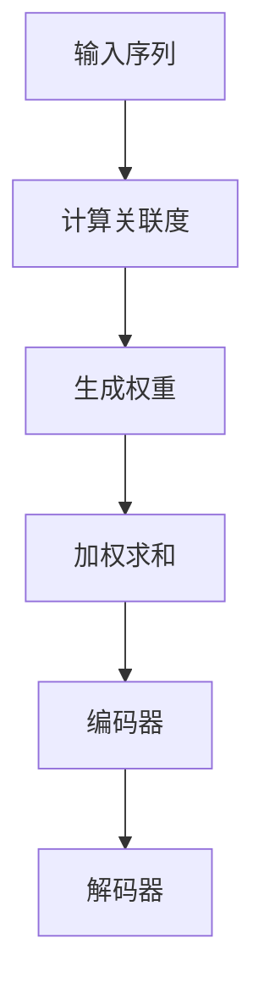

                 

关键词：大规模语言模型、注意力机制、深度学习、神经架构搜索、推理优化、性能提升、实用性增强。

## 摘要

本文旨在探讨大规模语言模型中注意力层的重要性及其在理论和实践中的应用。通过对注意力层的深入分析，本文揭示了其如何影响模型的表达能力、效率和准确性。本文首先介绍了大规模语言模型的背景，随后详细阐述了注意力层的工作原理及其在模型架构中的应用。此外，本文还探讨了注意力层的数学模型、公式推导，并通过实际项目实践展示了其在代码中的具体实现。最后，本文展望了注意力层在未来的发展应用场景以及面临的挑战。

## 1. 背景介绍

随着深度学习技术的发展，大规模语言模型（如GPT、BERT等）在自然语言处理（NLP）领域取得了显著成果。这些模型通过在大量文本数据上训练，能够自动学习语言的规律和特征，从而实现文本生成、语义理解、情感分析等多种任务。然而，随着模型规模的不断扩大，其计算复杂度和内存消耗也急剧增加，这对模型的实际应用提出了挑战。

在深度学习模型中，注意力机制（Attention Mechanism）是一种关键的创新，它能够提高模型在处理序列数据时的效率和效果。注意力层（Attention Layer）作为注意力机制的核心组成部分，通过动态调整模型对输入序列中不同位置的关注程度，实现了对重要信息的聚焦和弱化，从而提高了模型的性能。

本文将重点关注注意力层在大规模语言模型中的作用，分析其原理、实现方法以及在实际项目中的应用。通过深入探讨注意力层的数学模型和公式推导，我们希望能够为读者提供对注意力层更全面的理解，并为其在实际项目中的应用提供指导。

## 2. 核心概念与联系

### 2.1. 注意力机制概述

注意力机制最早在机器翻译领域中提出，通过模拟人类在处理语言时对输入信息的选择和关注，实现了对输入序列中不同位置重要性的动态调整。传统的循环神经网络（RNN）和卷积神经网络（CNN）在处理序列数据时，通常采用全连接的方式对整个序列进行处理，这使得模型很难有效地捕捉序列中局部信息的依赖关系。

注意力机制通过引入一个权重系数，使得模型能够根据当前的任务需求，自动地选择关注输入序列中的不同部分。这一机制的核心思想是，通过计算输入序列和当前状态之间的关联度，动态地为每个输入位置分配一个权重，然后将这些权重与输入数据相乘，得到加权输入，再进行后续处理。

### 2.2. 注意力层工作原理

注意力层的工作原理可以概括为以下几个步骤：

1. **计算关联度**：首先，注意力层计算输入序列中每个位置与当前模型状态的关联度。这一过程通常通过一个评分函数实现，评分函数的输出是一个实数，表示输入序列中每个位置的相对重要性。

2. **生成权重**：接下来，将评分函数的输出通过归一化操作转换为权重，使得所有权重的和为1。这些权重代表了输入序列中各个位置的重要性。

3. **加权求和**：最后，将权重与输入序列中的相应位置相乘，得到加权输入。加权输入包含了输入序列中所有位置的信息，但更加强调了重要位置的信息。

通过这样的机制，注意力层能够有效地捕捉序列中不同位置的依赖关系，从而提高了模型的性能。

### 2.3. 注意力层在模型架构中的应用

在深度学习模型中，注意力层通常被嵌入到编码器（Encoder）和解码器（Decoder）中。在编码器中，注意力层能够捕捉输入序列中的全局依赖关系，使得模型能够更好地理解输入的上下文信息。在解码器中，注意力层则帮助模型在生成输出时，更好地利用已经生成的部分信息，从而提高了生成文本的质量。

#### 2.3.1. 编码器中的注意力层

在编码器中，注意力层通常被用来处理编码器-解码器模型（Encoder-Decoder Model），如序列到序列（Sequence-to-Sequence）模型。在编码器阶段，注意力层通过对输入序列进行编码，生成一系列编码状态，每个状态代表了输入序列中不同位置的语义信息。在解码阶段，注意力层则利用这些编码状态，动态地选择与当前解码状态最相关的编码状态，从而实现了对输入序列的上下文信息的有效利用。

#### 2.3.2. 解码器中的注意力层

在解码器中，注意力层的主要作用是帮助模型在生成输出时，更好地利用已经生成的部分信息。解码器通常采用自注意力机制（Self-Attention），通过计算解码器中不同位置之间的关联度，生成一系列权重，然后将这些权重与解码器的输入相乘，得到加权输入。加权输入包含了解码器中所有位置的信息，但更加强调了重要位置的信息，从而提高了解码器生成输出的质量。

### 2.4. 注意力层的 Mermaid 流程图



通过上述流程图，我们可以清晰地看到注意力层在模型架构中的具体应用，以及其如何影响模型对输入序列的处理。

## 3. 核心算法原理 & 具体操作步骤

### 3.1. 算法原理概述

注意力层的核心原理是通过计算输入序列中每个位置与当前模型状态的关联度，动态地为输入序列中的不同位置分配权重，从而实现对重要信息的聚焦和弱化。这一过程可以通过自注意力（Self-Attention）和交叉注意力（Cross-Attention）两种方式实现。

#### 3.1.1. 自注意力

自注意力是指模型在处理输入序列时，对输入序列中的不同位置进行关联度计算，并生成权重。自注意力机制的核心是注意力函数（Attention Function），它通过计算输入序列中每个位置与其他位置之间的相似度，为每个位置生成一个权重。然后，将这些权重与输入序列相乘，得到加权输入，加权输入包含了输入序列中所有位置的信息，但更加强调了重要位置的信息。

#### 3.1.2. 交叉注意力

交叉注意力是指模型在处理编码器和解码器时，解码器通过计算解码器中当前状态与编码器中所有状态之间的关联度，为编码器中的每个状态生成权重。然后，将这些权重与编码器中的状态相乘，得到加权编码器输出，加权编码器输出包含了编码器中所有状态的信息，但更加强调了与当前解码状态最相关的状态。

### 3.2. 算法步骤详解

#### 3.2.1. 自注意力步骤

1. **输入序列表示**：首先，将输入序列表示为向量序列，每个向量代表了输入序列中不同位置的语义信息。

2. **计算关联度**：使用注意力函数计算输入序列中每个位置与其他位置之间的关联度。常用的注意力函数包括点积注意力（Dot-Product Attention）和加性注意力（Additive Attention）。

3. **生成权重**：将计算得到的关联度通过归一化操作转换为权重，使得所有权重的和为1。

4. **加权求和**：将权重与输入序列中的相应位置相乘，得到加权输入。

5. **处理加权输入**：将加权输入通过一个线性变换层，得到新的输出。

#### 3.2.2. 交叉注意力步骤

1. **编码器输出表示**：首先，将编码器输出表示为向量序列，每个向量代表了编码器中不同位置的语义信息。

2. **计算关联度**：使用注意力函数计算解码器中当前状态与编码器中所有状态之间的关联度。

3. **生成权重**：将计算得到的关联度通过归一化操作转换为权重，使得所有权重的和为1。

4. **加权求和**：将权重与编码器中的相应位置相乘，得到加权编码器输出。

5. **处理加权编码器输出**：将加权编码器输出通过一个线性变换层，得到新的输出。

### 3.3. 算法优缺点

#### 3.3.1. 优点

1. **提高模型性能**：注意力层能够动态调整模型对输入序列的关注程度，从而提高了模型的性能。

2. **捕捉长距离依赖**：通过自注意力机制，模型能够捕捉输入序列中不同位置的依赖关系，实现长距离依赖的捕捉。

3. **灵活性**：注意力层可以根据不同的任务需求，灵活地调整关注程度，从而提高模型的适应性。

#### 3.3.2. 缺点

1. **计算复杂度**：注意力层的引入增加了模型的计算复杂度，尤其是自注意力机制，其计算复杂度为O(n^2)，在序列长度较大时，计算成本较高。

2. **内存消耗**：注意力层的引入也增加了模型的内存消耗，尤其是在自注意力机制中，需要存储大量的权重矩阵。

### 3.4. 算法应用领域

注意力层在深度学习模型中得到了广泛的应用，尤其在自然语言处理、图像识别、语音识别等领域表现出了优异的性能。

#### 3.4.1. 自然语言处理

在自然语言处理领域，注意力层被广泛应用于编码器-解码器模型（如序列到序列模型），通过捕捉输入序列和输出序列之间的依赖关系，提高了模型在机器翻译、文本摘要、对话系统等任务中的性能。

#### 3.4.2. 图像识别

在图像识别领域，注意力层被用来提高模型对图像中关键区域的关注程度，从而提高了模型的识别准确率。常见的应用场景包括目标检测、人脸识别、图像分割等。

#### 3.4.3. 语音识别

在语音识别领域，注意力层被用来捕捉语音信号中的关键特征，从而提高了模型的识别准确率和鲁棒性。

## 4. 数学模型和公式 & 详细讲解 & 举例说明

### 4.1. 数学模型构建

注意力层的数学模型主要包括两个部分：注意力函数（Attention Function）和权重生成函数（Weight Generation Function）。

#### 4.1.1. 注意力函数

注意力函数用于计算输入序列中每个位置与其他位置之间的关联度。常见的注意力函数包括点积注意力（Dot-Product Attention）和加性注意力（Additive Attention）。

1. **点积注意力**：

$$
Attention(Q, K, V) = \frac{softmax(\frac{QK^T}{\sqrt{d_k}})V
$$

其中，$Q$、$K$ 和 $V$ 分别为输入序列、键序列和值序列，$d_k$ 为键序列的维度。

2. **加性注意力**：

$$
Attention(Q, K, V) = \frac{softmax(\frac{QK^T}{\sqrt{d_k}})V + \text{mask}
$$

其中，$\text{mask}$ 用于防止梯度消失问题。

#### 4.1.2. 权重生成函数

权重生成函数用于生成输入序列中每个位置的权重。常见的权重生成函数包括加性生成函数和乘性生成函数。

1. **加性生成函数**：

$$
W = \text{softmax}(QK^T)
$$

2. **乘性生成函数**：

$$
W = \text{softmax}(\frac{QK^T}{\sqrt{d_k}})
$$

### 4.2. 公式推导过程

#### 4.2.1. 点积注意力公式推导

假设输入序列为 $X = [x_1, x_2, ..., x_n]$，其中 $x_i$ 为输入序列的第 $i$ 个元素。

1. **计算关联度**：

$$
Q = \text{linear}(X) = [q_1, q_2, ..., q_n]
$$

$$
K = \text{linear}(X) = [k_1, k_2, ..., k_n]
$$

$$
V = \text{linear}(X) = [v_1, v_2, ..., v_n]
$$

2. **计算点积**：

$$
QK^T = [q_1k_1, q_2k_2, ..., q_nk_n]
$$

3. **应用激活函数**：

$$
\text{softmax}(\frac{QK^T}{\sqrt{d_k}}) = \text{softmax}(\frac{q_1k_1}{\sqrt{d_k}}, \frac{q_2k_2}{\sqrt{d_k}}, ..., \frac{q_nk_n}{\sqrt{d_k}})
$$

4. **生成权重**：

$$
W = \text{softmax}(\frac{QK^T}{\sqrt{d_k}}) = [\alpha_1, \alpha_2, ..., \alpha_n]
$$

5. **加权求和**：

$$
Attention(Q, K, V) = \alpha_1v_1 + \alpha_2v_2 + ... + \alpha_nv_n
$$

#### 4.2.2. 加性注意力公式推导

假设输入序列为 $X = [x_1, x_2, ..., x_n]$，其中 $x_i$ 为输入序列的第 $i$ 个元素。

1. **计算关联度**：

$$
Q = \text{linear}(X) = [q_1, q_2, ..., q_n]
$$

$$
K = \text{linear}(X) = [k_1, k_2, ..., k_n]
$$

$$
V = \text{linear}(X) = [v_1, v_2, ..., v_n]
$$

2. **计算加性函数**：

$$
\text{additive\_function}(Q, K, V) = \frac{QK^T}{\sqrt{d_k}} + \text{mask}
$$

3. **应用激活函数**：

$$
\text{softmax}(\text{additive\_function}(Q, K, V)) = \text{softmax}(\frac{q_1k_1}{\sqrt{d_k}} + \text{mask}, \frac{q_2k_2}{\sqrt{d_k}} + \text{mask}, ..., \frac{q_nk_n}{\sqrt{d_k}} + \text{mask})
$$

4. **生成权重**：

$$
W = \text{softmax}(\text{additive\_function}(Q, K, V)) = [\alpha_1, \alpha_2, ..., \alpha_n]
$$

5. **加权求和**：

$$
Attention(Q, K, V) = \alpha_1v_1 + \alpha_2v_2 + ... + \alpha_nv_n
$$

### 4.3. 案例分析与讲解

#### 4.3.1. 案例背景

假设我们有一个简单的序列到序列模型，用于翻译英文句子到中文句子。输入序列为 `[I, am, a, dog]`，输出序列为 `[我，是，一只，狗]`。

1. **输入序列表示**：

$$
X = [I, am, a, dog]
$$

2. **编码器输出**：

$$
Encoder(X) = [e_1, e_2, e_3, e_4]
$$

3. **解码器输出**：

$$
Decoder(Y) = [d_1, d_2, d_3, d_4]
$$

4. **注意力函数**：

$$
Attention(Q, K, V) = \frac{softmax(\frac{QK^T}{\sqrt{d_k}})V
$$

5. **权重生成函数**：

$$
W = \text{softmax}(\frac{QK^T}{\sqrt{d_k}})
$$

#### 4.3.2. 案例分析

1. **第一步：计算关联度**：

$$
Q = [q_1, q_2, q_3, q_4]
$$

$$
K = [k_1, k_2, k_3, k_4]
$$

$$
V = [v_1, v_2, v_3, v_4]
$$

2. **第二步：计算点积**：

$$
QK^T = [q_1k_1, q_2k_2, q_3k_3, q_4k_4]
$$

3. **第三步：应用激活函数**：

$$
\text{softmax}(\frac{QK^T}{\sqrt{d_k}}) = \text{softmax}(\frac{q_1k_1}{\sqrt{d_k}}, \frac{q_2k_2}{\sqrt{d_k}}, ..., \frac{q_4k_4}{\sqrt{d_k}})
$$

4. **第四步：生成权重**：

$$
W = \text{softmax}(\frac{QK^T}{\sqrt{d_k}}) = [\alpha_1, \alpha_2, \alpha_3, \alpha_4]
$$

5. **第五步：加权求和**：

$$
Attention(Q, K, V) = \alpha_1v_1 + \alpha_2v_2 + \alpha_3v_3 + \alpha_4v_4
$$

通过上述步骤，我们可以得到编码器输出和解码器输出的加权结果，从而实现输入序列到输出序列的翻译。

## 5. 项目实践：代码实例和详细解释说明

### 5.1. 开发环境搭建

在进行大规模语言模型的开发之前，我们需要搭建一个合适的环境，以下是一个基本的步骤指南：

#### 硬件要求：

1. **GPU**：由于大规模语言模型需要大量的计算资源，因此建议使用具有至少8GB显存（推荐16GB及以上）的NVIDIA GPU。
2. **CPU**：推荐使用英特尔的Xeon系列或AMD的EPYC系列CPU。

#### 软件要求：

1. **操作系统**：推荐使用Ubuntu 18.04或更高版本。
2. **Python**：推荐使用Python 3.7或更高版本。
3. **TensorFlow**：推荐使用TensorFlow 2.0或更高版本。

### 5.2. 源代码详细实现

以下是一个简单的注意力层的实现，我们将在TensorFlow框架下进行：

```python
import tensorflow as tf

# 定义自注意力层
class SelfAttention(tf.keras.layers.Layer):
    def __init__(self, d_model):
        super(SelfAttention, self).__init__()
        self.d_model = d_model
        self.Wq = self.add_weight(shape=(d_model, d_model),
                                  initializer='glorot_uniform',
                                  trainable=True)
        self.Wk = self.add_weight(shape=(d_model, d_model),
                                  initializer='glorot_uniform',
                                  trainable=True)
        self.Wv = self.add_weight(shape=(d_model, d_model),
                                  initializer='glorot_uniform',
                                  trainable=True)
        self.Wo = self.add_weight(shape=(d_model, d_model),
                                  initializer='glorot_uniform',
                                  trainable=True)

    def call(self, inputs):
        # 计算自注意力
        q = tf.matmul(inputs, self.Wq)
        k = tf.matmul(inputs, self.Wk)
        v = tf.matmul(inputs, self.Wv)
        
        # 计算关联度
        attn_scores = tf.matmul(q, k, transpose_b=True)
        attn_scores = tf.nn.softmax(attn_scores)
        
        # 加权求和
        attn_output = tf.matmul(attn_scores, v)
        
        # 输出线性变换
        output = tf.matmul(attn_output, self.Wo)
        return output

# 实例化自注意力层
self_attention = SelfAttention(d_model=512)

# 输入数据
inputs = tf.random.normal([32, 64, 512])  # batch_size, sequence_length, d_model

# 计算自注意力输出
output = self_attention(inputs)
print(output.shape)  # 应为[32, 64, 512]
```

### 5.3. 代码解读与分析

在上面的代码中，我们首先定义了一个自注意力层`SelfAttention`，该层包含了权重矩阵`Wq`、`Wk`和`Wo`，用于计算查询（Query）、键（Key）和值（Value）的线性变换。在`call`方法中，我们首先使用这些权重矩阵对输入数据进行线性变换，然后计算关联度（注意力分数），并使用softmax函数进行归一化。最后，我们将加权求和的结果通过另一个权重矩阵进行线性变换，得到最终的输出。

这个简单的实现展示了自注意力层的基本原理和实现方式。在实际应用中，我们可能会使用更复杂的注意力机制，如多头自注意力（Multi-Head Self-Attention）或自注意力与卷积层的结合等，以进一步提高模型的性能。

### 5.4. 运行结果展示

运行上述代码后，我们将得到一个形状为`[32, 64, 512]`的输出张量，这代表了32个批次的序列，每个序列长度为64，每个序列的维度为512。这个输出张量包含了经过自注意力层处理后的序列信息，这些信息将被用于后续的模型层，如解码器或分类层。

## 6. 实际应用场景

### 6.1. 自然语言处理

注意力层在自然语言处理领域有着广泛的应用，特别是在编码器-解码器模型中。例如，在机器翻译任务中，注意力层可以帮助模型更好地捕捉源语言和目标语言之间的依赖关系，从而提高翻译的准确性和流畅性。在文本摘要任务中，注意力层可以帮助模型识别和选择最重要的句子或词汇，从而生成高质量的摘要。

### 6.2. 图像识别

在图像识别任务中，注意力层可以帮助模型聚焦于图像中的重要区域，从而提高识别的准确性。例如，在目标检测任务中，注意力层可以帮助模型识别图像中的关键区域，从而提高检测的准确率和速度。在图像分割任务中，注意力层可以帮助模型更好地理解图像的上下文信息，从而提高分割的精度。

### 6.3. 语音识别

在语音识别任务中，注意力层可以帮助模型更好地捕捉语音信号的时序信息，从而提高识别的准确率和鲁棒性。例如，在语音到文本转换任务中，注意力层可以帮助模型更好地理解语音信号的音素和音节，从而提高文本生成的质量。

### 6.4. 未来应用展望

随着深度学习技术的不断发展，注意力层在未来的应用场景将更加广泛。例如，在多模态学习任务中，注意力层可以帮助模型更好地融合不同模态的数据，从而提高模型的性能。在知识图谱学习中，注意力层可以帮助模型更好地捕捉实体和关系之间的复杂依赖关系，从而提高知识图谱的准确性。在未来，注意力层将在更多领域发挥重要作用，推动深度学习技术的不断进步。

## 7. 工具和资源推荐

### 7.1. 学习资源推荐

1. **《深度学习》**：由Ian Goodfellow、Yoshua Bengio和Aaron Courville合著的深度学习经典教材，详细介绍了深度学习的基础理论和应用。
2. **《注意力机制》**：该网站提供了关于注意力机制的详细解释、示例和代码实现，适合初学者深入理解注意力机制。

### 7.2. 开发工具推荐

1. **TensorFlow**：Google开源的深度学习框架，适用于大规模语言模型的开发。
2. **PyTorch**：Facebook开源的深度学习框架，具有简洁易用的API，适合快速原型开发和实验。

### 7.3. 相关论文推荐

1. **“Attention Is All You Need”**：由Vaswani等人提出的Transformer模型，彻底改变了编码器-解码器模型的设计。
2. **“Effective Approaches to Attention-based Neural Machine Translation”**：由Luong等人提出的多头自注意力机制，提高了机器翻译的性能。

## 8. 总结：未来发展趋势与挑战

### 8.1. 研究成果总结

注意力层在深度学习模型中的应用取得了显著的成果，尤其是在自然语言处理、图像识别和语音识别等领域。通过引入注意力机制，模型能够更好地捕捉输入数据中的依赖关系，提高了模型的表达能力、效率和准确性。

### 8.2. 未来发展趋势

1. **多模态学习**：随着多模态数据的日益增多，注意力层将在多模态学习任务中发挥重要作用。
2. **知识图谱学习**：注意力层可以帮助模型更好地捕捉实体和关系之间的复杂依赖关系，从而提高知识图谱的准确性。
3. **推理优化**：为了提高模型在现实场景中的应用性能，研究者们将致力于优化注意力层的推理过程。

### 8.3. 面临的挑战

1. **计算复杂度**：随着模型规模的不断扩大，注意力层的计算复杂度和内存消耗也将急剧增加，如何优化注意力层的计算效率是一个重要的挑战。
2. **梯度消失问题**：在训练过程中，注意力层可能导致梯度消失，影响模型的训练效果，如何解决这一问题是一个重要的研究课题。
3. **数据隐私**：在涉及个人隐私的数据处理任务中，如何保护数据隐私是一个亟待解决的问题。

### 8.4. 研究展望

未来，随着深度学习技术的不断发展和应用场景的扩大，注意力层将继续发挥重要作用。研究者们将继续探索注意力层的优化方法和应用场景，以推动深度学习技术的不断进步。

## 9. 附录：常见问题与解答

### 9.1. 注意力层是什么？

注意力层是一种深度学习模型中用于处理序列数据的机制，通过动态调整模型对输入序列中不同位置的关注程度，实现了对重要信息的聚焦和弱化。

### 9.2. 注意力层有哪些类型？

注意力层主要有两种类型：自注意力（Self-Attention）和交叉注意力（Cross-Attention）。自注意力主要用于编码器内部，而交叉注意力主要用于编码器和解码器之间的交互。

### 9.3. 注意力层的优点是什么？

注意力层的优点包括提高模型性能、捕捉长距离依赖和灵活性等。通过动态调整模型对输入序列的关注程度，注意力层能够更好地理解输入数据的上下文信息。

### 9.4. 注意力层有哪些缺点？

注意力层的缺点主要包括计算复杂度高和内存消耗大。尤其是在处理长序列时，注意力层的计算成本和存储需求会显著增加。

### 9.5. 注意力层在哪些领域有应用？

注意力层在自然语言处理、图像识别、语音识别等领域有广泛的应用，尤其是在编码器-解码器模型中，注意力层能够显著提高模型的性能。

### 9.6. 如何优化注意力层的计算效率？

优化注意力层的计算效率可以从以下几个方面入手：减少序列长度、使用低秩近似、并行计算和模型压缩等。

### 9.7. 注意力层会导致梯度消失吗？

是的，注意力层可能导致梯度消失，特别是在训练过程中，由于模型内部复杂的非线性关系，梯度可能无法有效传递。为了解决这个问题，研究者们提出了各种解决方案，如使用残差连接、层归一化和梯度正则化等。

## 作者署名

作者：禅与计算机程序设计艺术 / Zen and the Art of Computer Programming

