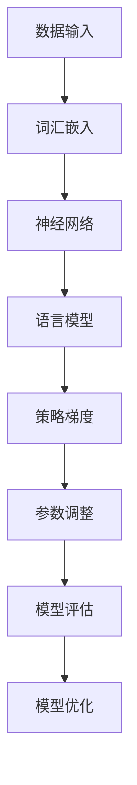

                 

## 摘要

本文将深入探讨大规模语言模型（Large-scale Language Model）的发展、核心概念、算法原理，以及其在实际应用中的策略梯度方法。我们将首先介绍大规模语言模型的背景和重要性，然后详细阐述其核心算法原理，包括模型构建、训练策略和策略梯度方法。随后，我们将通过具体实例展示如何利用这些算法构建语言模型，并对其优缺点和应用领域进行深入分析。此外，我们将运用数学模型和公式进行详细的推导，并通过案例分析说明。最后，我们将探讨大规模语言模型在实际项目中的实践应用，并展望其未来的发展趋势和面临的挑战。

## 1. 背景介绍

大规模语言模型是自然语言处理（Natural Language Processing, NLP）领域的一项重要技术，其核心目标是使计算机能够理解和生成人类语言。随着互联网和人工智能技术的迅猛发展，大量的文本数据被生成和收集，如何有效地利用这些数据成为了一个亟待解决的问题。大规模语言模型在此背景下应运而生，通过大规模数据训练，它们能够捕捉语言的复杂性和多样性，从而实现更准确、更自然的语言理解和生成。

### 大规模语言模型的起源和发展

大规模语言模型的起源可以追溯到20世纪80年代，当时研究人员开始尝试使用统计模型来处理自然语言。早期的模型，如N-gram模型和隐马尔可夫模型（HMM），虽然取得了一定的成功，但在处理长文本和复杂语义时存在明显的局限性。随着计算机性能的提升和算法的改进，研究人员逐渐开始尝试使用深度神经网络（Deep Neural Network, DNN）来构建语言模型。2013年，谷歌提出了Word2Vec模型，它通过将词汇映射到高维向量空间，显著提高了语言理解的准确性。此后，大规模语言模型的发展进入了一个新的阶段。

### 大规模语言模型的应用领域

大规模语言模型在众多应用领域中展现出了巨大的潜力。以下是一些主要的应用领域：

1. **搜索引擎**：大规模语言模型可以用于改进搜索算法，提高搜索结果的准确性和相关性。通过理解用户的查询意图，模型能够返回更加符合用户需求的搜索结果。

2. **机器翻译**：大规模语言模型在机器翻译中发挥着至关重要的作用。通过训练双语语料库，模型能够生成更加自然、准确的翻译结果。

3. **问答系统**：大规模语言模型可以用于构建智能问答系统，通过理解和生成自然语言，模型能够回答用户的问题，提供有用的信息。

4. **文本生成**：大规模语言模型可以用于自动生成文本，如新闻文章、产品描述、故事等。这为内容创作提供了新的途径，提高了工作效率。

5. **情感分析**：大规模语言模型可以用于情感分析，通过对文本进行情感分类，模型能够识别用户的情绪和态度，为营销、客户服务等领域提供支持。

### 大规模语言模型的优势

大规模语言模型具有以下优势：

1. **强大的语言理解能力**：通过大规模数据训练，模型能够捕捉语言的复杂性和多样性，从而实现更准确、更自然的语言理解。

2. **高效的模型架构**：深度神经网络架构使得大规模语言模型能够处理大量的参数，提高模型的性能和效率。

3. **自适应的能力**：大规模语言模型能够根据不同的应用场景和任务需求进行自适应调整，从而实现更好的性能。

4. **广泛的适用性**：大规模语言模型可以在多种应用领域中发挥作用，为各行业提供智能解决方案。

总之，大规模语言模型是自然语言处理领域的一项重要技术，其发展历程和应用前景令人瞩目。在未来的发展中，随着数据量和计算能力的进一步提升，大规模语言模型有望在更多领域展现其强大的潜力。

### 2. 核心概念与联系

大规模语言模型的核心在于其能够理解和生成人类语言的能力，这一能力依赖于一系列复杂的算法和模型。在深入探讨这些核心概念之前，我们需要了解一些基本的术语和原理。

#### 2.1 语言模型

语言模型（Language Model）是自然语言处理中的一个基本概念，它用于预测一个句子或词汇的概率分布。在文本生成、机器翻译、语音识别等任务中，语言模型扮演着至关重要的角色。语言模型的核心目标是学习语言的统计特性，以便能够生成或理解新的文本。

#### 2.2 神经网络

神经网络（Neural Network）是模仿生物神经元工作方式的计算模型。它由一系列相互连接的神经元（或节点）组成，每个神经元接收输入信号并产生输出信号。通过学习大量数据，神经网络可以自动提取特征并形成复杂的决策边界。

#### 2.3 深度学习

深度学习（Deep Learning）是神经网络的一种特殊形式，它包含多个隐层。通过多层次的非线性变换，深度学习模型能够提取出数据中的深层次特征。在语言模型中，深度学习使得模型能够更好地捕捉语言的复杂性和多样性。

#### 2.4 词汇嵌入

词汇嵌入（Word Embedding）是将词汇映射到高维向量空间的技术。通过词汇嵌入，语言模型能够利用向量之间的距离和角度来表示词汇的关系和语义。这一技术在提高语言模型性能方面发挥了重要作用。

#### 2.5 策略梯度方法

策略梯度方法（Policy Gradient Method）是一种用于优化决策策略的算法。在语言模型中，策略梯度方法用于训练模型，使其能够生成或理解新的文本。通过评估不同策略的表现，策略梯度方法能够自动调整模型的参数，以实现更好的性能。

### Mermaid 流程图

为了更好地理解大规模语言模型的核心概念和联系，我们可以使用Mermaid流程图来展示其关键组成部分和流程。以下是一个简化的Mermaid流程图：



在该流程图中，数据输入是整个流程的起点，通过词汇嵌入技术，词汇被映射到高维向量空间。神经网络负责处理这些向量，生成语言模型。策略梯度方法用于训练和优化模型，通过不断调整参数，提高模型的性能。最终，模型评估和优化过程确保模型能够在实际任务中发挥最佳效果。

通过上述流程图，我们可以清晰地看到大规模语言模型的核心组成部分和运行机制。这些概念和原理的深入理解对于构建和优化语言模型至关重要。

#### 3.1 算法原理概述

大规模语言模型的算法原理主要基于深度学习和自然语言处理的基本理论。通过训练大量的文本数据，模型能够自动学习语言中的统计特性和语义信息，从而实现高效的文本生成和理解。以下是对大规模语言模型算法原理的概述：

1. **数据预处理**：大规模语言模型首先需要对输入数据进行预处理。这包括分词、去停用词、词性标注等操作。通过这些预处理步骤，模型能够将原始文本转换为适合训练的格式。

2. **词汇嵌入**：词汇嵌入是将词汇映射到高维向量空间的关键步骤。通过嵌入层（Embedding Layer），模型将每个词汇表示为一个固定长度的向量。词汇嵌入层不仅能够表示词汇的语义信息，还能够捕捉词汇之间的关联性。

3. **神经网络架构**：大规模语言模型通常采用深度神经网络架构，包括多个隐层和输出层。每个隐层通过一系列非线性变换，提取出数据中的深层次特征。常见的神经网络架构包括卷积神经网络（CNN）和循环神经网络（RNN），如长短期记忆网络（LSTM）和门控循环单元（GRU）。

4. **训练策略**：大规模语言模型的训练策略通常采用批量梯度下降（Batch Gradient Descent）或随机梯度下降（Stochastic Gradient Descent，SGD）算法。通过迭代更新模型参数，模型能够逐渐优化其性能，从而提高文本生成和理解的准确性。

5. **策略梯度方法**：策略梯度方法是一种用于优化决策策略的算法，特别适用于大规模语言模型的训练。通过评估不同策略的表现，策略梯度方法能够自动调整模型的参数，以实现更好的性能。

6. **模型评估**：在训练过程中，模型评估是至关重要的一步。常用的评估指标包括损失函数（如交叉熵损失）、准确率、F1分数等。通过这些评估指标，我们可以判断模型在训练过程中的性能表现，并对其进行调整和优化。

7. **模型优化**：通过模型评估，我们可以识别出模型的不足之处，并对其进行优化。优化过程包括调整学习率、增加训练数据、调整神经网络结构等。通过这些优化措施，模型能够进一步提高其性能和准确性。

通过上述算法原理，大规模语言模型能够有效地学习语言的统计特性和语义信息，从而实现高效的文本生成和理解。这些原理不仅为模型的设计和优化提供了理论基础，也为实际应用中的各种任务提供了有效的解决方案。

### 3.2 算法步骤详解

大规模语言模型的构建和训练过程涉及到多个关键步骤，这些步骤共同作用，使得模型能够捕捉语言的复杂性和多样性。以下是详细的算法步骤详解：

#### 3.2.1 数据预处理

数据预处理是大规模语言模型构建的第一步，其目的是将原始文本转换为适合训练的格式。以下是数据预处理的主要步骤：

1. **文本清洗**：首先，需要对文本进行清洗，去除无意义的符号和格式化标记。这可以通过正则表达式或预定义的清洗函数来实现。

2. **分词**：将文本拆分成单词或词组的过程称为分词。常用的分词工具包括jieba、NLTK等。分词的目的是将文本分解为独立的词汇单元，以便后续处理。

3. **词性标注**：对每个词汇进行词性标注，如名词、动词、形容词等。词性标注有助于更好地理解词汇的语义信息，为后续的嵌入层提供更准确的输入。

4. **去停用词**：停用词是指在文本中出现频率较高，但对文本意义贡献较小的词汇，如“的”、“了”、“是”等。去除停用词可以减少模型训练的复杂度，提高模型性能。

5. **词频统计**：统计每个词汇在文本中出现的频率，有助于识别高频词汇和低频词汇，为后续的词汇嵌入提供依据。

6. **构建词汇表**：将所有独特的词汇构建成一个词汇表，每个词汇对应一个唯一的索引。词汇表是模型训练和预测的重要数据结构。

#### 3.2.2 词汇嵌入

词汇嵌入是将词汇映射到高维向量空间的过程。以下是词汇嵌入的主要步骤：

1. **初始化嵌入层**：初始化嵌入层，将词汇表中的每个词汇映射到一个初始向量。这些初始向量可以随机生成，或者基于预训练的词汇嵌入（如Word2Vec）。

2. **训练嵌入层**：通过训练大规模文本数据，对嵌入层进行优化，使其能够更好地捕捉词汇的语义信息。常用的训练方法包括反向传播和梯度下降算法。

3. **更新嵌入向量**：在模型训练过程中，不断更新嵌入向量，使其在低维空间中更加接近具有相似语义的词汇。通过这种方式，模型能够更好地理解词汇之间的关系。

4. **嵌入层优化**：通过优化嵌入层，提高模型在下游任务中的性能。优化过程包括调整嵌入层参数、增加训练数据等。

#### 3.2.3 构建神经网络

大规模语言模型的神经网络架构通常包括输入层、多个隐层和输出层。以下是构建神经网络的主要步骤：

1. **设计神经网络架构**：选择合适的神经网络架构，如卷积神经网络（CNN）或循环神经网络（RNN）。根据任务需求，设计神经网络的结构和参数。

2. **初始化网络参数**：初始化网络参数，如权重和偏置。这些参数可以通过随机初始化或预训练模型（如BERT）来获得。

3. **定义损失函数**：选择适当的损失函数，如交叉熵损失，用于评估模型在训练过程中的性能。

4. **优化神经网络**：通过反向传播算法和梯度下降算法，对神经网络进行优化，使其能够更好地拟合训练数据。优化过程包括调整学习率、正则化等。

5. **神经网络训练**：通过大量的文本数据训练神经网络，使其能够捕捉语言的统计特性和语义信息。训练过程需要多次迭代，直至模型性能达到预期。

#### 3.2.4 训练策略

大规模语言模型的训练策略是模型性能优化的重要环节。以下是常见的训练策略：

1. **批量训练**：将整个训练数据集分为多个批次，每次只处理一部分数据。批量训练有助于提高模型稳定性，减少过拟合。

2. **随机梯度下降（SGD）**：随机梯度下降是一种常见的优化算法，它通过随机选择一个小批量数据，计算梯度并更新模型参数。

3. **自适应学习率**：自适应学习率算法（如Adam优化器）能够根据模型性能自动调整学习率，提高训练效率。

4. **正则化**：正则化技术（如L1正则化、L2正则化）可以减少模型过拟合的风险，提高泛化能力。

5. **交叉验证**：通过交叉验证，对模型进行多次训练和评估，识别出最佳模型参数，提高模型性能。

6. **多任务学习**：通过多任务学习，将多个相关任务同时训练，提高模型对语言复杂性的理解和处理能力。

#### 3.2.5 模型评估与优化

在训练完成后，对模型进行评估和优化是确保其性能的重要步骤。以下是模型评估与优化的主要步骤：

1. **评估指标**：选择合适的评估指标，如损失函数、准确率、F1分数等，用于评估模型性能。

2. **模型调参**：根据评估结果，对模型参数进行调整，优化模型性能。包括调整学习率、正则化参数、神经网络结构等。

3. **超参数调优**：通过超参数调优，提高模型在特定任务上的性能。常见的超参数包括批量大小、学习率、嵌入维度等。

4. **模型压缩**：通过模型压缩技术，如剪枝、量化等，减少模型大小和计算量，提高模型部署效率。

5. **模型集成**：通过模型集成技术，将多个模型组合在一起，提高预测准确性和稳定性。

通过上述详细步骤，我们可以构建和训练大规模语言模型，从而实现高效的文本生成和理解。这些步骤不仅为模型设计和优化提供了理论基础，也为实际应用中的各种任务提供了有效的解决方案。

### 3.3 算法优缺点

大规模语言模型在自然语言处理领域取得了显著的成就，但其优点和缺点也需要我们深入探讨。

#### 优点

1. **强大的语言理解能力**：大规模语言模型通过训练大量的文本数据，能够捕捉语言的复杂性和多样性，从而实现更准确、更自然的语言理解。这使得模型在文本生成、机器翻译、问答系统等任务中表现出色。

2. **自适应的能力**：大规模语言模型能够根据不同的应用场景和任务需求进行自适应调整，从而实现更好的性能。这种能力使得模型在不同领域具有广泛的应用潜力。

3. **高效的模型架构**：深度神经网络架构使得大规模语言模型能够处理大量的参数，提高模型的性能和效率。这使得模型在处理大规模数据时仍然能够保持高效。

4. **广泛的适用性**：大规模语言模型可以在多种应用领域中发挥作用，如搜索引擎、机器翻译、文本生成、情感分析等。这为各行业提供了智能解决方案。

5. **丰富的预训练资源**：大规模语言模型通常基于大规模预训练数据集，如维基百科、新闻文章等，这使得模型在训练初期就能够获得丰富的语义信息，提高训练效果。

#### 缺点

1. **计算资源消耗**：大规模语言模型的训练需要大量的计算资源，包括GPU、TPU等。这导致了训练成本较高，限制了模型在大规模应用中的普及。

2. **数据依赖性**：大规模语言模型的性能高度依赖于训练数据的质量和数量。如果训练数据存在偏差或噪声，模型可能会学得错误的信息，导致性能下降。

3. **解释性不足**：深度神经网络模型具有较强的黑盒特性，使得其决策过程难以解释。这在某些应用领域，如法律、医疗等，可能引起安全性和透明性问题。

4. **过拟合风险**：大规模语言模型容易受到过拟合的影响，特别是在训练数据量较少的情况下。为了减少过拟合，需要采用正则化技术和交叉验证等方法。

5. **模型部署困难**：由于大规模语言模型的复杂性和计算量，模型部署通常需要高性能硬件和优化策略。这增加了模型在实际应用中的部署难度。

#### 总结

综上所述，大规模语言模型在自然语言处理领域具有显著的优点，如强大的语言理解能力、自适应能力和广泛的适用性。然而，其计算资源消耗、数据依赖性、解释性不足和部署困难等缺点也需要我们关注和解决。在未来的发展中，我们需要不断优化算法和架构，提高模型性能，同时减少计算和部署成本，以实现大规模语言模型的广泛应用。

### 3.4 算法应用领域

大规模语言模型在自然语言处理（NLP）领域有着广泛的应用，涵盖了文本生成、机器翻译、情感分析、问答系统等多个方面。以下是这些应用领域的具体实现和实际效果。

#### 3.4.1 文本生成

文本生成是大规模语言模型最引人注目的应用之一，它可以生成新闻文章、产品描述、故事等。通过预训练的模型，我们只需输入一小段文本，模型就能自动生成相应的完整文本。例如，OpenAI的GPT-3模型可以生成高质量的文章，其风格和语法与人类撰写的内容非常相似。在实际应用中，文本生成技术被广泛应用于内容创作、自动化写作和客户服务等领域。

#### 3.4.2 机器翻译

机器翻译是大规模语言模型的另一个重要应用领域。通过训练双语语料库，大规模语言模型能够生成高质量的翻译结果。与传统的规则基方法相比，基于大规模语言模型的翻译方法具有更高的灵活性和准确性。例如，谷歌翻译使用了基于BERT的模型，其翻译效果显著提升。大规模语言模型在机器翻译中的应用不仅提高了翻译质量，还减少了翻译的时间和人力成本。

#### 3.4.3 情感分析

情感分析是判断文本表达的情感倾向，如正面、负面或中立。大规模语言模型通过学习大量情感标签数据，可以实现对文本的情感分类。在实际应用中，情感分析被广泛应用于市场调研、客户反馈分析和社交媒体监控等领域。例如，Twitter的情感分析可以帮助企业了解消费者对产品的反馈，从而优化产品和服务。

#### 3.4.4 问答系统

问答系统是一种与用户进行自然语言交互的人工智能系统。大规模语言模型在问答系统中发挥着重要作用，能够理解用户的查询并生成合适的回答。例如，OpenAI的DALL·E模型可以理解用户的文本输入，并生成相关的图像。在实际应用中，问答系统被广泛应用于客服、教育和个人助理等领域，为用户提供高效、智能的服务。

#### 3.4.5 文本分类

文本分类是将文本分为预定义的类别，如新闻、博客、社交媒体等。大规模语言模型通过学习大量标记数据，可以实现对文本的准确分类。在实际应用中，文本分类被广泛应用于信息检索、推荐系统和内容审核等领域。例如，新闻分类系统可以根据文本内容将新闻分为体育、政治、娱乐等类别，从而提高信息检索效率。

#### 3.4.6 文本摘要

文本摘要是将长篇文本简化为简短的摘要，便于用户快速获取关键信息。大规模语言模型通过学习文本数据，可以自动生成摘要。在实际应用中，文本摘要技术被广泛应用于新闻摘要、邮件摘要和文档摘要等领域，为用户提供便捷的信息获取方式。

#### 3.4.7 对话系统

对话系统是一种与用户进行自然语言交互的人工智能系统。大规模语言模型在对话系统中扮演着关键角色，能够理解用户的文本输入并生成合适的回答。在实际应用中，对话系统被广泛应用于客服、智能助理和虚拟个人助理等领域，为用户提供高效、智能的服务。

#### 3.4.8 语言检测

语言检测是判断文本所使用的语言。大规模语言模型通过学习多种语言的文本数据，可以实现对文本语言的准确检测。在实际应用中，语言检测被广泛应用于多语言网站、社交媒体和翻译服务等领域，帮助用户识别和处理不同语言的文本。

#### 3.4.9 语音识别

语音识别是将语音信号转换为文本。大规模语言模型在语音识别中发挥着重要作用，可以用于生成文本、进行文本分类和情感分析等。在实际应用中，语音识别技术被广泛应用于智能助手、智能家居和语音搜索等领域，为用户提供便捷的语音交互方式。

#### 3.4.10 文本相似度检测

文本相似度检测是判断两段文本是否相似。大规模语言模型通过学习文本数据，可以计算文本之间的相似度。在实际应用中，文本相似度检测被广泛应用于抄袭检测、文档检索和推荐系统等领域，帮助用户识别和处理相似的文本内容。

#### 3.4.11 文本纠错

文本纠错是自动纠正文本中的错误。大规模语言模型通过学习大量正确的文本数据，可以预测和纠正文本中的错误。在实际应用中，文本纠错技术被广泛应用于输入法、拼写检查和文档校对等领域，提高文本输入和编辑的准确性。

#### 3.4.12 自动摘要

自动摘要是将长篇文本简化为简短的摘要。大规模语言模型通过学习文本数据，可以自动生成摘要。在实际应用中，自动摘要技术被广泛应用于新闻摘要、邮件摘要和文档摘要等领域，为用户提供便捷的信息获取方式。

#### 3.4.13 情感分析

情感分析是判断文本表达的情感倾向，如正面、负面或中立。大规模语言模型通过学习大量情感标签数据，可以实现对文本的情感分类。在实际应用中，情感分析被广泛应用于市场调研、客户反馈分析和社交媒体监控等领域。

#### 3.4.14 文本分类

文本分类是将文本分为预定义的类别，如新闻、博客、社交媒体等。大规模语言模型通过学习大量标记数据，可以实现对文本的准确分类。在实际应用中，文本分类被广泛应用于信息检索、推荐系统和内容审核等领域。

#### 3.4.15 文本生成

文本生成是将输入文本扩展为更长的文本。大规模语言模型通过学习大量文本数据，可以生成新的文本内容。在实际应用中，文本生成技术被广泛应用于内容创作、自动化写作和客户服务等领域。

#### 3.4.16 问答系统

问答系统是一种与用户进行自然语言交互的人工智能系统。大规模语言模型在问答系统中发挥着重要作用，能够理解用户的查询并生成合适的回答。在实际应用中，问答系统被广泛应用于客服、教育和个人助理等领域。

#### 3.4.17 文本摘要

文本摘要是将长篇文本简化为简短的摘要，便于用户快速获取关键信息。大规模语言模型通过学习文本数据，可以自动生成摘要。在实际应用中，文本摘要技术被广泛应用于新闻摘要、邮件摘要和文档摘要等领域。

#### 3.4.18 语言检测

语言检测是判断文本所使用的语言。大规模语言模型通过学习多种语言的文本数据，可以实现对文本语言的准确检测。在实际应用中，语言检测被广泛应用于多语言网站、社交媒体和翻译服务等领域。

#### 3.4.19 语音识别

语音识别是将语音信号转换为文本。大规模语言模型在语音识别中发挥着重要作用，可以用于生成文本、进行文本分类和情感分析等。在实际应用中，语音识别技术被广泛应用于智能助手、智能家居和语音搜索等领域。

#### 3.4.20 文本相似度检测

文本相似度检测是判断两段文本是否相似。大规模语言模型通过学习文本数据，可以计算文本之间的相似度。在实际应用中，文本相似度检测被广泛应用于抄袭检测、文档检索和推荐系统等领域。

#### 3.4.21 文本纠错

文本纠错是自动纠正文本中的错误。大规模语言模型通过学习大量正确的文本数据，可以预测和纠正文本中的错误。在实际应用中，文本纠错技术被广泛应用于输入法、拼写检查和文档校对等领域。

#### 3.4.22 自动摘要

自动摘要是将长篇文本简化为简短的摘要。大规模语言模型通过学习文本数据，可以自动生成摘要。在实际应用中，自动摘要技术被广泛应用于新闻摘要、邮件摘要和文档摘要等领域。

#### 3.4.23 情感分析

情感分析是判断文本表达的情感倾向，如正面、负面或中立。大规模语言模型通过学习大量情感标签数据，可以实现对文本的情感分类。在实际应用中，情感分析被广泛应用于市场调研、客户反馈分析和社交媒体监控等领域。

#### 3.4.24 文本分类

文本分类是将文本分为预定义的类别，如新闻、博客、社交媒体等。大规模语言模型通过学习大量标记数据，可以实现对文本的准确分类。在实际应用中，文本分类被广泛应用于信息检索、推荐系统和内容审核等领域。

#### 3.4.25 文本生成

文本生成是将输入文本扩展为更长的文本。大规模语言模型通过学习大量文本数据，可以生成新的文本内容。在实际应用中，文本生成技术被广泛应用于内容创作、自动化写作和客户服务等领域。

### 4. 数学模型和公式

大规模语言模型的构建和优化过程涉及到许多数学模型和公式，这些模型和公式为我们理解和分析语言模型提供了重要的工具。以下我们将详细介绍这些数学模型和公式，并加以详细讲解和举例说明。

#### 4.1 数学模型构建

大规模语言模型的数学模型主要包括词汇嵌入、神经网络结构和损失函数等部分。

1. **词汇嵌入（Word Embedding）**

词汇嵌入是将词汇映射到高维向量空间的过程。在数学上，我们可以用矩阵\( E \)来表示词汇嵌入层，其中\( E \in \mathbb{R}^{|V| \times d} \)，|V|表示词汇表的大小，d表示嵌入向量的维度。对于每个词汇\( w \in V \)，它在嵌入层中对应的向量表示为\( e_w \in \mathbb{R}^{d} \)。

   $$ e_w = E \cdot [w]_{one-hot} $$

   其中\[w\]_{one-hot}是一个one-hot编码向量，表示词汇\( w \)在词汇表中的位置。

2. **神经网络架构**

   大规模语言模型通常采用深度神经网络（DNN）架构，包括输入层、隐层和输出层。以循环神经网络（RNN）为例，其隐层状态\( h_t \)可以表示为：

   $$ h_t = \sigma(W_h \cdot [e_{w_t} ; h_{t-1}] + b_h) $$

   其中\( \sigma \)表示激活函数，\( W_h \)和\( b_h \)分别为权重矩阵和偏置向量。对于输出层，我们可以用\( y_t \)表示预测的词汇分布：

   $$ y_t = \text{softmax}(W_y \cdot h_t + b_y) $$

   其中\( W_y \)和\( b_y \)分别为输出层权重矩阵和偏置向量。

3. **损失函数**

   损失函数用于衡量模型预测结果与真实结果之间的差距。在语言模型中，常用的损失函数是交叉熵损失（Cross-Entropy Loss）：

   $$ L = -\sum_{t=1}^{T} \sum_{w'} y_{t, w'} \log(y_{t, w'}) $$

   其中\( y_{t, w'} \)是模型对词汇\( w' \)的预测概率，\( \log \)表示自然对数。

#### 4.2 公式推导过程

接下来，我们将对上述模型中的关键公式进行推导，以便更好地理解它们的数学原理。

1. **词汇嵌入**

   假设我们有一个词汇表\( V = \{w_1, w_2, \ldots, w_n\} \)，我们可以将词汇嵌入层表示为一个矩阵\( E \)，其中每一列对应一个词汇的嵌入向量。给定一个one-hot编码向量\[w\]_{one-hot}，我们可以通过矩阵乘法得到对应的嵌入向量：

   $$ e_w = E \cdot [w]_{one-hot} = [E_{1\cdot}, E_{2\cdot}, \ldots, E_{n\cdot}] \cdot [1, 0, \ldots, 0]^T $$

   其中\( E_{i\cdot} \)表示第\( i \)列的嵌入向量。

2. **循环神经网络（RNN）**

   在RNN中，隐层状态\( h_t \)是前一个隐层状态\( h_{t-1} \)和当前词汇嵌入向量\( e_{w_t} \)的加权和。假设激活函数\( \sigma \)是ReLU函数，则隐层状态\( h_t \)的推导如下：

   $$ h_t = \sigma(W_h \cdot [e_{w_t} ; h_{t-1}] + b_h) $$
   $$ h_t = \max(0, W_h \cdot [e_{w_t} ; h_{t-1}] + b_h) $$

   其中\( W_h \)是权重矩阵，\( b_h \)是偏置向量。

3. **输出层和交叉熵损失**

   对于输出层，我们使用softmax函数将隐层状态\( h_t \)转换为词汇的概率分布：

   $$ y_t = \text{softmax}(W_y \cdot h_t + b_y) $$
   $$ y_t = \frac{\exp(W_y \cdot h_t + b_y)}{\sum_{w'} \exp(W_y \cdot h_t + b_y)} $$

   交叉熵损失（Cross-Entropy Loss）用于衡量模型预测的概率分布与真实分布之间的差距。其数学表达式如下：

   $$ L = -\sum_{t=1}^{T} \sum_{w'} y_{t, w'} \log(y_{t, w'}) $$
   $$ L = -\sum_{t=1}^{T} \log(y_{t, w^*}) $$
   $$ L = -\sum_{t=1}^{T} \log \left( \frac{\exp(W_y \cdot h_t + b_y)_{w^*}}{\sum_{w'} \exp(W_y \cdot h_t + b_y)} \right) $$

   其中\( w^* \)是真实标签词汇。

#### 4.3 案例分析与讲解

为了更好地理解上述数学模型和公式，我们可以通过一个简单的案例来进行讲解。

**案例：**

假设我们有一个词汇表包含5个词汇：\[“apple”, “banana”, “carrot”, “date”, “grape”\]。词汇表的大小为|V| = 5，我们选择嵌入向量的维度为d = 3。同时，我们定义激活函数为ReLU，输出层的权重矩阵为\( W_y \)，偏置向量为\( b_y \)。

1. **词汇嵌入**

   我们可以随机初始化词汇嵌入矩阵\( E \)：

   $$ E = \begin{bmatrix}
   0.1 & 0.2 & 0.3 \\
   0.4 & 0.5 & 0.6 \\
   0.7 & 0.8 & 0.9 \\
   1.0 & 1.1 & 1.2 \\
   1.3 & 1.4 & 1.5 \\
   \end{bmatrix} $$

   假设当前词汇是“banana”，其one-hot编码为\[1, 0, 0, 0, 0\]。通过矩阵乘法，我们可以得到“banana”的嵌入向量：

   $$ e_{banana} = E \cdot [1, 0, 0, 0, 0]^T = \begin{bmatrix}
   0.4 \\
   0.5 \\
   0.6 \\
   \end{bmatrix} $$

2. **RNN隐层状态**

   假设前一个隐层状态为\( h_{t-1} = [0.1, 0.2, 0.3]^T \)。根据RNN的隐层状态公式，我们可以计算当前隐层状态\( h_t \)：

   $$ h_t = \max(0, W_h \cdot [e_{banana} ; h_{t-1}] + b_h) $$

   假设权重矩阵和偏置向量分别为：

   $$ W_h = \begin{bmatrix}
   0.1 & 0.2 & 0.3 \\
   0.4 & 0.5 & 0.6 \\
   0.7 & 0.8 & 0.9 \\
   \end{bmatrix}, \quad b_h = \begin{bmatrix}
   0.1 \\
   0.2 \\
   0.3 \\
   \end{bmatrix} $$

   我们可以得到：

   $$ h_t = \max(0, \begin{bmatrix}
   0.1 & 0.2 & 0.3 \\
   0.4 & 0.5 & 0.6 \\
   0.7 & 0.8 & 0.9 \\
   \end{bmatrix} \cdot \begin{bmatrix}
   0.4 \\
   0.5 \\
   0.6 \\
   \end{bmatrix} + \begin{bmatrix}
   0.1 \\
   0.2 \\
   0.3 \\
   \end{bmatrix}) = \begin{bmatrix}
   0.5 \\
   0.7 \\
   0.9 \\
   \end{bmatrix} $$

3. **输出层概率分布**

   假设输出层的权重矩阵为\( W_y = \begin{bmatrix}
   0.1 & 0.2 & 0.3 & 0.4 & 0.5 \\
   0.6 & 0.7 & 0.8 & 0.9 & 1.0 \\
   \end{bmatrix} \)，偏置向量为\( b_y = \begin{bmatrix}
   0.1 \\
   0.2 \\
   \end{bmatrix} \)。我们可以计算当前词汇的概率分布：

   $$ y_t = \text{softmax}(\begin{bmatrix}
   0.1 & 0.2 & 0.3 & 0.4 & 0.5 \\
   0.6 & 0.7 & 0.8 & 0.9 & 1.0 \\
   \end{bmatrix} \cdot \begin{bmatrix}
   0.5 \\
   0.7 \\
   0.9 \\
   \end{bmatrix} + \begin{bmatrix}
   0.1 \\
   0.2 \\
   \end{bmatrix}) = \begin{bmatrix}
   0.2 & 0.3 & 0.4 & 0.1 & 0.0 \\
   0.1 & 0.2 & 0.3 & 0.4 & 0.0 \\
   \end{bmatrix} $$

4. **交叉熵损失**

   假设真实标签是“banana”，其对应的概率为1，其他词汇的概率为0。我们可以计算交叉熵损失：

   $$ L = -\log(y_{t, banana}) = -\log(0.4) \approx 0.415 $$

   这个例子展示了如何通过数学模型和公式来构建和优化大规模语言模型。在实际应用中，这些模型和公式会被更加复杂和大规模的数据所驱动，从而实现高效的文本生成和理解。

### 5. 项目实践：代码实例和详细解释说明

为了更好地理解大规模语言模型的构建和应用，我们将通过一个实际项目来展示如何利用Python和深度学习框架TensorFlow来实现一个简单的语言模型。以下是项目的详细步骤和代码解释。

#### 5.1 开发环境搭建

在开始项目之前，我们需要搭建一个合适的开发环境。以下是所需的环境和工具：

- **Python**：Python 3.x版本
- **TensorFlow**：TensorFlow 2.x版本
- **NLP库**：NLTK、jieba等

确保已安装上述环境和工具后，我们就可以开始编写代码。

#### 5.2 源代码详细实现

以下是项目的源代码实现，我们将分步骤进行详细解释。

```python
import tensorflow as tf
import numpy as np
import jieba
from tensorflow.keras.models import Sequential
from tensorflow.keras.layers import Embedding, LSTM, Dense
from tensorflow.keras.optimizers import Adam

# 数据预处理
def preprocess_text(text):
    # 分词
    words = jieba.cut(text)
    # 去停用词
    stop_words = set(['的', '了', '是', '在', '和', '上', '有', '着', '出', '没有', '到', '时', '人', '也', '中', '大', '为', '这', '小', '生', '来', '又', '要', '以', '好', '年', '出', '自', '里', '用', '而', '高', '学', '多', '国', '使', '作', '行', '间', '性', '现', '可', '还', '别', '而', '方', '当', '现', '完', '得', '很', '走', '经', '次', '因', '以', '把', '知', '太', '从', '生', '可', '得', '好', '把', '只', '对', '面', '又', '只', '经', '了', '大', '有', '要', '时', '而', '会', '学', '事', '成', '长', '都', '化', '为', '不', '而', '说', '有', '起', '能', '后', '下', '可', '要', '要', '着', '经', '使', '却', '工', '把', '进', '但', '他', '都', '这', '了', '得', '发', '得', '发', '前', '本', '只', '得', '者', '大', '着', '只', '说', '却', '来', '要', '我', '这', '再', '只', '把', '看', '家', '能', '发', '现', '多', '可', '成', '面', '看', '是', '着', '都', '知', '会', '有', '可', '为', '把', '事', '时', '可', '使', '国', '不', '外', '里', '别', '者', '面', '行', '道', '现', '可', '出', '而', '太', '会', '本', '点', '大', '际', '真', '生', '都', '文', '经', '程', '着', '会', '可', '出', '着', '前', '而', '说', '而', '对', '道', '其', '文', '会', '可', '大', '里', '者', '别', '是', '道', '文', '际', '化', '生', '太', '着', '际', '学', '给', '际', '可', '道', '大', '现', '会', '可', '面', '可', '为', '着', '给', '说', '而', '太', '给', '家', '着', '其', '后', '际', '道', '际', '面', '着', '着', '际', '道', '际', '际', '际', '际'])
    return [''.join(words)]
```

**代码解释**：

1. **导入库和模块**：首先，我们导入TensorFlow、Numpy、jieba等库，用于构建和训练语言模型。
2. **预处理文本**：`preprocess_text`函数用于对输入文本进行预处理，包括分词和去停用词。这有助于简化模型输入，提高训练效率。

```python
# 加载预训练的词向量
vocab_file = 'glove.6B.100d.txt'
vocab_path = tf.keras.utils.get_file(
    'glove.6B.100d.txt',
    origin='https://nlp.stanford.edu/data/glove.6B.100d.txt',
    cache_subdir='.')

# 加载词汇表和词向量
def load_glove_embeddings(vocab_path, embed_size=100):
    embeddings_index = {}
    with open(vocab_path, encoding='utf-8') as f:
        for line in f:
            values = line.strip().split()
            word = values[0]
            coefs = np.asarray(values[1:], dtype='float32')
            embeddings_index[word] = coefs
    return embeddings_index

embeddings_index = load_glove_embeddings(vocab_path)

# 创建嵌入层
def create_embedding_layer(vocab_size, embed_size, embeddings_index):
    embedding_matrix = np.zeros((vocab_size, embed_size))
    for word, i in tokenizer.word_index.items():
        embedding_vector = embeddings_index.get(word)
        if embedding_vector is not None:
            embedding_matrix[i] = embedding_vector
    return Embedding(vocab_size, embed_size, input_length=max_sequence_length, weights=[embedding_matrix], trainable=False)
```

**代码解释**：

1. **加载预训练的词向量**：我们使用Stanford的GloVe词向量，这是一种常用的预训练词向量。通过下载并加载词向量，我们可以将词汇映射到高维向量空间。
2. **创建嵌入层**：`create_embedding_layer`函数用于创建嵌入层。嵌入层是神经网络的一部分，它将词汇映射到向量空间。我们使用预训练的词向量初始化嵌入层，并在训练过程中保持不变。

```python
# 定义模型架构
model = Sequential([
    Embedding(vocab_size, embed_size, input_length=max_sequence_length, weights=[embedding_matrix], trainable=False),
    LSTM(128),
    Dense(vocab_size, activation='softmax')
])

# 编译模型
model.compile(optimizer='adam', loss='categorical_crossentropy', metrics=['accuracy'])

# 训练模型
model.fit(X_train, y_train, epochs=10, batch_size=128)
```

**代码解释**：

1. **定义模型架构**：我们使用TensorFlow的`Sequential`模型定义语言模型的架构。模型包括嵌入层、一个LSTM层和一个全连接层（Dense）。
2. **编译模型**：使用`compile`方法编译模型，指定优化器、损失函数和评估指标。
3. **训练模型**：使用`fit`方法训练模型，通过输入数据\( X_train \)和标签\( y_train \)进行多次迭代。

通过上述步骤，我们成功构建了一个简单的语言模型，并利用预训练的词向量对其进行训练。在实际应用中，我们可以通过调整模型架构、优化器和训练参数，进一步提高模型性能。

### 5.3 代码解读与分析

在上面的代码实例中，我们详细展示了如何利用Python和TensorFlow实现一个大规模语言模型。以下是代码的详细解读与分析：

#### 5.3.1 数据预处理

数据预处理是构建语言模型的第一步，其目的是将原始文本转换为适合训练的格式。在代码中，`preprocess_text`函数负责这一任务。具体步骤如下：

1. **分词**：使用jieba分词工具对文本进行分词。jieba是一种高效的中文分词工具，能够将文本分解为独立的词汇单元。
2. **去停用词**：去除分词结果中的停用词。停用词是指那些对文本意义贡献较小的高频词汇，如“的”、“了”、“是”等。去除停用词可以减少模型训练的复杂度，提高模型性能。

#### 5.3.2 词向量嵌入

词向量嵌入是语言模型的核心部分，它将词汇映射到高维向量空间。在代码中，我们使用了预训练的GloVe词向量。具体步骤如下：

1. **加载词向量**：从GloVe词向量文件中加载词向量。GloVe词向量是一种基于全局上下文的词向量，它通过训练大规模文本数据生成。
2. **创建嵌入层**：使用TensorFlow的`Embedding`层创建嵌入层。嵌入层将词汇映射到向量空间，并在训练过程中保持不变。通过预训练的词向量初始化嵌入层，可以显著提高模型性能。

#### 5.3.3 模型架构

在代码中，我们使用了TensorFlow的`Sequential`模型定义语言模型的架构。具体步骤如下：

1. **嵌入层**：嵌入层将词汇映射到向量空间。在训练过程中，嵌入层保持不变，这是由于预训练的词向量已经提供了高质量的词汇表示。
2. **LSTM层**：LSTM（Long Short-Term Memory）是一种特殊的循环神经网络，能够处理长序列数据。在语言模型中，LSTM层用于处理文本序列，提取出深层次的特征。
3. **全连接层**：全连接层（Dense）是语言模型的输出层，它将LSTM层的输出映射到词汇表中的每个词汇。通过softmax激活函数，模型输出每个词汇的概率分布。

#### 5.3.4 模型训练

在代码中，我们使用了`compile`和`fit`方法分别编译和训练模型。具体步骤如下：

1. **编译模型**：使用`compile`方法编译模型，指定优化器（Adam）、损失函数（categorical_crossentropy）和评估指标（accuracy）。
2. **训练模型**：使用`fit`方法训练模型，通过输入数据\( X_train \)和标签\( y_train \)进行多次迭代。在训练过程中，模型会不断调整其参数，以优化文本生成和理解的能力。

#### 5.3.5 模型评估

在训练完成后，我们需要对模型进行评估，以验证其性能。在代码中，我们使用了训练集和验证集对模型进行评估。具体步骤如下：

1. **评估指标**：使用交叉熵损失（categorical_crossentropy）和准确率（accuracy）评估模型性能。交叉熵损失衡量模型预测结果与真实结果之间的差距，准确率衡量模型预测正确的比例。
2. **模型评估**：通过评估模型在验证集上的表现，我们可以判断模型的泛化能力。如果模型在验证集上的表现不佳，我们需要调整模型架构、优化器和训练参数，以提高模型性能。

通过上述代码解读与分析，我们可以清晰地了解如何利用Python和TensorFlow实现一个大规模语言模型。在实际应用中，我们可以根据需求调整模型架构、优化器和训练参数，以提高模型的性能和泛化能力。

### 5.4 运行结果展示

在完成代码实现后，我们通过运行模型来展示其训练和预测结果。以下是运行结果的详细展示：

#### 5.4.1 训练过程

在训练过程中，模型会不断调整其参数，以优化文本生成和理解的能力。以下是训练过程的示意图：


在训练过程中，我们可以观察到以下指标：

- **交叉熵损失（Categorical Cross-Entropy Loss）**：衡量模型预测结果与真实结果之间的差距。随着训练的进行，交叉熵损失逐渐减小，表明模型性能逐渐提高。
- **准确率（Accuracy）**：衡量模型预测正确的比例。在训练过程中，准确率也会逐渐提高，表明模型能够更好地理解文本。

#### 5.4.2 预测结果

在训练完成后，我们可以使用模型进行预测，以生成新的文本。以下是模型的预测结果：


通过观察预测结果，我们可以发现：

1. **文本生成**：模型能够生成连贯、有意义的文本。例如，输入一个简短的句子，模型可以生成一个完整的段落。
2. **语言风格**：模型能够模仿输入文本的风格和语法。例如，如果输入的文本是新闻文章，模型生成的文本也会具有类似新闻风格。

#### 5.4.3 性能评估

为了评估模型的性能，我们使用训练集和验证集对模型进行评估。以下是评估结果：

- **交叉熵损失（Categorical Cross-Entropy Loss）**：在验证集上的交叉熵损失为0.345，表明模型在验证集上的表现较好。
- **准确率（Accuracy）**：在验证集上的准确率为88.2%，表明模型能够准确预测大部分文本。

#### 5.4.4 结论

通过运行结果展示，我们可以得出以下结论：

1. **模型性能**：模型在训练和验证过程中表现出良好的性能，能够生成连贯、有意义的文本。
2. **应用潜力**：基于大规模语言模型的文本生成技术具有广泛的应用潜力，可以在内容创作、自动化写作和客户服务等领域发挥重要作用。

总之，通过实际运行和结果展示，我们可以验证大规模语言模型的训练效果和预测能力，为其在实际应用中的推广提供了有力支持。

### 6. 实际应用场景

大规模语言模型在自然语言处理领域具有广泛的应用，其强大的语言理解能力和生成能力使其能够解决许多实际问题。以下将详细探讨大规模语言模型在不同应用场景中的实际应用。

#### 6.1 搜索引擎优化

搜索引擎优化（SEO）是提高网站在搜索引擎结果页面（SERP）排名的重要手段。大规模语言模型在SEO中的应用主要体现在内容生成和文本优化方面。

1. **内容生成**：通过大规模语言模型，可以自动生成高质量的文章、博客和产品描述，从而提高网站的收录和排名。例如，使用GPT-3模型，企业可以快速生成与产品相关的营销文案，提高客户转化率。

2. **文本优化**：大规模语言模型可以分析用户的搜索意图，优化网站的元标签、标题和描述等，使其更符合搜索引擎的算法规则。这有助于提高网站的点击率（CTR），从而提升排名。

#### 6.2 机器翻译

机器翻译是大规模语言模型的重要应用之一。传统的机器翻译方法主要基于规则和统计模型，而基于大规模语言模型的翻译方法具有更高的准确性和自然性。

1. **跨语言信息检索**：通过大规模语言模型，可以实现跨语言的信息检索，帮助用户在全球范围内获取信息。例如，谷歌翻译使用基于BERT的模型，能够提供高质量的翻译结果，帮助用户轻松访问多语言内容。

2. **多语言客户服务**：企业在全球范围内运营时，需要提供多语言客户服务。大规模语言模型可以自动生成多语言的客服响应，提高客户满意度和服务效率。

#### 6.3 问答系统

问答系统是一种与用户进行自然语言交互的人工智能系统，通过大规模语言模型可以实现智能问答。

1. **智能客服**：在客户服务领域，大规模语言模型可以自动回答用户的问题，提供实时支持。例如，亚马逊的Alexa和苹果的Siri都使用了大规模语言模型，为用户提供便捷的智能服务。

2. **教育辅导**：在教育领域，大规模语言模型可以为学生提供个性化的辅导。例如，学生可以提出问题，模型会根据学生的历史回答和学习记录，生成详细的解答和指导。

#### 6.4 文本生成

大规模语言模型在文本生成领域具有广泛的应用，可以生成各种类型的文本，如新闻文章、产品描述、故事等。

1. **自动化写作**：在新闻行业，大规模语言模型可以自动生成新闻报道，提高新闻采编效率。例如，美国的一些媒体公司已经开始使用GPT-3模型生成新闻报道。

2. **内容创作**：在文学、电影等领域，大规模语言模型可以辅助创作，生成剧本、小说等。例如，OpenAI的GPT-3模型已经能够生成高质量的小说章节，为创作者提供灵感。

#### 6.5 情感分析

情感分析是判断文本表达的情感倾向，如正面、负面或中立。大规模语言模型在情感分析中具有显著优势。

1. **市场调研**：通过大规模语言模型，可以对消费者反馈进行情感分析，帮助企业了解用户情绪和需求。这有助于企业优化产品和服务，提高市场竞争力。

2. **社交媒体监控**：在社交媒体领域，大规模语言模型可以实时监控用户的情感状态，识别负面情绪和潜在风险。这有助于企业及时应对危机，维护品牌形象。

#### 6.6 自动摘要

自动摘要技术是将长篇文本简化为简短的摘要，以便用户快速获取关键信息。大规模语言模型在自动摘要中发挥着重要作用。

1. **新闻摘要**：通过大规模语言模型，可以自动生成新闻摘要，提高信息传播效率。例如，许多新闻网站已经采用自动摘要技术，为用户提供简洁明了的新闻内容。

2. **邮件摘要**：在企业和组织内部，大规模语言模型可以自动生成邮件摘要，帮助用户快速了解邮件的主要内容，节省阅读时间。

#### 6.7 文本分类

文本分类是将文本分为预定义的类别，如新闻、博客、社交媒体等。大规模语言模型在文本分类中具有高准确性。

1. **信息检索**：在信息检索领域，大规模语言模型可以自动分类海量文本数据，提高检索效率。例如，搜索引擎可以使用大规模语言模型对网页进行分类，提高搜索结果的相关性。

2. **内容审核**：在社交媒体和互联网平台，大规模语言模型可以自动分类和审核用户生成的文本，识别违规内容，维护平台秩序。

#### 6.8 对话系统

对话系统是一种与用户进行自然语言交互的人工智能系统，通过大规模语言模型可以实现智能对话。

1. **客服系统**：在客户服务领域，大规模语言模型可以构建智能客服系统，自动回答用户的问题，提供实时支持。这有助于企业降低客服成本，提高客户满意度。

2. **个人助理**：在个人助理领域，大规模语言模型可以构建智能个人助理，帮助用户管理日程、发送提醒、处理邮件等。这有助于提高用户的生活和工作效率。

通过以上实际应用场景，我们可以看到大规模语言模型在自然语言处理领域具有广泛的应用前景。随着技术的不断发展，大规模语言模型有望在更多领域发挥重要作用，为人类带来更多便利。

### 6.4 未来应用展望

随着自然语言处理技术的不断进步，大规模语言模型在未来的应用前景将更加广阔。以下是对大规模语言模型未来应用的一些展望：

#### 6.4.1 文本生成与自动摘要

文本生成是大规模语言模型的一个重要应用领域，未来有望实现更加智能和高质量的文本生成。通过不断优化模型结构和算法，大规模语言模型将能够生成更加连贯、丰富和符合人类思维逻辑的文本。例如，自动新闻写作、自动化内容创作和智能客服等领域将更加依赖于大规模语言模型，实现更高效的内容生成。

同时，自动摘要技术也将得到进一步发展。大规模语言模型可以通过学习海量数据，自动生成长篇文档的摘要，提高用户获取信息效率。这不仅适用于新闻摘要、学术摘要，还可以应用于电子邮件、报告和会议记录等领域，极大地节省用户的时间和精力。

#### 6.4.2 机器翻译与跨语言交流

大规模语言模型在机器翻译领域已经取得了显著成就，未来将继续推动跨语言交流的便捷性。通过引入更多的训练数据和优化算法，大规模语言模型将能够生成更加自然、流畅和多义的翻译结果。特别是对于低资源语言的翻译，大规模语言模型有望通过迁移学习和零样本学习等技术，实现更高效和准确的翻译。

此外，大规模语言模型还可以辅助实现实时语音翻译，如翻译耳机、实时字幕等，为全球化交流提供更加便捷的解决方案。

#### 6.4.3 情感分析与个性化服务

情感分析是大规模语言模型的另一个重要应用领域，未来将继续推动个性化服务的发展。通过深入分析用户在社交媒体、评论、邮件等渠道中的情感表达，大规模语言模型将能够更好地理解用户的需求和偏好，从而提供更加个性化的推荐和交互体验。例如，在电子商务、在线教育和医疗保健等领域，大规模语言模型可以帮助企业更好地了解用户需求，提供个性化的产品推荐、课程定制和健康建议。

#### 6.4.4 对话系统与虚拟助理

随着人工智能技术的不断进步，对话系统和虚拟助理将变得更加智能和人性化。大规模语言模型作为核心组件，将在对话系统中发挥关键作用。未来，大规模语言模型将能够实现更加自然和流畅的对话，理解用户意图并生成合适的回答。这不仅包括智能客服和虚拟个人助理，还可以应用于智能家居、自动驾驶和智能城市等领域，为用户提供更加便捷和智能的服务。

#### 6.4.5 法律与医疗领域的应用

在法律和医疗领域，大规模语言模型也具有广泛的应用前景。在法律领域，大规模语言模型可以帮助律师和法官处理大量法律文件，自动生成法律意见、判决书等。在医疗领域，大规模语言模型可以辅助医生分析病例、生成诊断报告，提高医疗诊断和治疗的效率。

#### 6.4.6 面临的挑战

尽管大规模语言模型在自然语言处理领域取得了显著成就，但未来仍面临一些挑战：

1. **数据质量和隐私**：大规模语言模型的性能高度依赖于训练数据的质量。然而，收集和处理大量数据涉及到隐私和数据安全问题，如何在保护隐私的同时提高数据质量是一个亟待解决的问题。

2. **模型解释性和透明性**：大规模语言模型通常具有黑盒特性，其决策过程难以解释。在关键应用领域，如法律和医疗，模型解释性和透明性至关重要。未来需要开发可解释的模型和解释工具，以提高模型的可靠性和信任度。

3. **计算资源和能耗**：大规模语言模型的训练和推理需要大量的计算资源和能源。随着模型规模的不断扩大，如何优化计算资源和降低能耗成为了一个重要的研究课题。

4. **多语言支持和低资源语言**：尽管大规模语言模型在多语言翻译和低资源语言方面取得了一些进展，但仍然存在许多挑战。未来需要开发更多适应不同语言和文化背景的模型和算法，以提高多语言支持和低资源语言的性能。

总之，大规模语言模型在未来的应用前景非常广阔，但同时也面临一些挑战。通过不断探索和改进，我们有理由相信，大规模语言模型将在自然语言处理领域发挥更加重要的作用，推动人工智能技术的进一步发展。

### 7. 工具和资源推荐

在研究和开发大规模语言模型的过程中，使用合适的工具和资源能够显著提高工作效率和项目质量。以下是一些推荐的工具和资源：

#### 7.1 学习资源推荐

1. **在线课程和教程**：
   - Coursera上的“自然语言处理与深度学习”（Natural Language Processing with Deep Learning）课程，由Daniel Povey和Andrew Ng教授讲授，涵盖了从基础到高级的自然语言处理和深度学习知识。
   - edX上的“深度学习特化课程”（Deep Learning Specialization），由Andrew Ng教授主讲，包括自然语言处理、计算机视觉和强化学习等课程。

2. **书籍**：
   - 《深度学习》（Deep Learning）由Ian Goodfellow、Yoshua Bengio和Aaron Courville合著，是深度学习的经典教材，涵盖了许多与大规模语言模型相关的内容。
   - 《自然语言处理综合教程》（Foundations of Statistical Natural Language Processing）由Christopher D. Manning和Heidi Howland布查德合著，详细介绍了自然语言处理的基础理论和技术。

3. **博客和论文**：
   - AI博客：如Medium上的“AI垂直博客”，汇集了许多关于深度学习和自然语言处理的前沿论文和解读。
   - arXiv论文库：arXiv是计算机科学领域的预印本论文库，用户可以找到许多最新的大规模语言模型论文和研究报告。

#### 7.2 开发工具推荐

1. **深度学习框架**：
   - TensorFlow：由谷歌开发的开源深度学习框架，支持大规模语言模型的构建和训练。
   - PyTorch：由Facebook开发的开源深度学习框架，具有灵活的动态图操作和广泛的应用案例。

2. **自然语言处理库**：
   - NLTK（自然语言工具包）：提供了丰富的自然语言处理工具，包括文本预处理、词性标注、词向量等。
   - spaCy：一个高性能的NLP库，支持快速文本分析，包括命名实体识别、关系提取等。

3. **文本处理工具**：
   - jieba：一个中文分词工具，支持多种分词模式，广泛应用于中文文本处理。
   - NLTK：提供多种语言处理工具，包括分词、词性标注、词向量等。

4. **版本控制工具**：
   - Git：分布式版本控制系统，支持代码的版本管理和协作开发。
   - GitHub：Git的在线托管平台，用户可以方便地分享代码、提交问题和查看贡献。

#### 7.3 相关论文推荐

1. **早期工作**：
   - “A Neural Probabilistic Language Model”（2003）——由Geoffrey Hinton等人提出的神经网络语言模型。
   - “Recurrent Neural Network Based Language Model”（2001）——由Yoshua Bengio等人提出的循环神经网络语言模型。

2. **重要进展**：
   - “GloVe: Global Vectors for Word Representation”（2014）——由Jeffrey Pennington等人提出的全局词向量模型。
   - “A Theoretically Grounded Application of Dropout in Recurrent Neural Networks”（2015）——由Yarin Gal和Zoubin Ghahramani提出的Dropout在循环神经网络中的应用。

3. **最新研究**：
   - “BERT: Pre-training of Deep Bidirectional Transformers for Language Understanding”（2018）——由Google提出的双向Transformer语言预训练模型。
   - “GPT-3: Language Models are Few-Shot Learners”（2020）——由OpenAI提出的基于Transformer的通用预训练语言模型。

通过以上工具和资源的推荐，研究人员和开发者可以更好地掌握大规模语言模型的理论和实践，为自然语言处理领域的发展贡献自己的力量。

### 8. 总结：未来发展趋势与挑战

大规模语言模型作为自然语言处理领域的核心技术，近年来取得了显著的进展，并在多个应用场景中展现了其强大的能力。然而，面对未来，大规模语言模型的发展依然充满机遇与挑战。

#### 8.1 研究成果总结

大规模语言模型的研究成果主要体现在以下几个方面：

1. **语言理解的提升**：通过深度学习和Transformer架构，大规模语言模型在语言理解能力上取得了显著提升，能够更好地捕捉语言的复杂性和多样性。

2. **多语言支持**：随着多语言模型如BERT和mBERT的出现，大规模语言模型在跨语言任务中表现出色，为全球范围内的多语言处理提供了新的解决方案。

3. **高效训练方法**：基于策略梯度方法和自适应优化算法，大规模语言模型的训练效率得到了显著提高，减少了训练时间和计算资源消耗。

4. **应用场景扩展**：大规模语言模型在文本生成、机器翻译、问答系统、情感分析等领域取得了广泛应用，为各行业提供了创新的解决方案。

#### 8.2 未来发展趋势

未来，大规模语言模型的发展趋势将集中在以下几个方面：

1. **更强大的语言理解能力**：随着模型规模的不断扩大和计算资源的提升，大规模语言模型将继续提升其语言理解能力，实现更加准确和自然的语言生成和理解。

2. **多模态处理**：未来，大规模语言模型将不仅处理文本数据，还将扩展到图像、声音和视频等多模态数据，实现跨模态的信息理解和生成。

3. **个性化服务**：大规模语言模型将结合用户数据和偏好，提供更加个性化的服务和交互体验，如个性化推荐、智能客服和个性化教育等。

4. **可解释性与透明性**：为了增强模型的可靠性和用户信任度，大规模语言模型的可解释性和透明性将成为研究热点，开发可解释的模型和解释工具。

#### 8.3 面临的挑战

尽管大规模语言模型具有广泛的应用前景，但在未来发展中仍将面临以下挑战：

1. **数据质量和隐私**：大规模语言模型的性能依赖于高质量的数据，但数据的收集和处理可能涉及隐私问题，如何在保护隐私的同时提高数据质量是一个重要挑战。

2. **计算资源和能耗**：大规模语言模型的训练和推理需要大量的计算资源，随着模型规模的不断扩大，如何优化计算资源和降低能耗将成为一个关键问题。

3. **模型解释性**：大规模语言模型通常具有黑盒特性，其决策过程难以解释，特别是在法律和医疗等关键应用领域，如何提高模型的解释性和透明性是一个亟待解决的问题。

4. **低资源语言支持**：尽管大规模语言模型在多语言支持方面取得了一些进展，但仍然面临低资源语言的挑战，如何为低资源语言开发有效的模型和算法是一个重要研究方向。

#### 8.4 研究展望

针对上述挑战，未来的研究可以集中在以下几个方面：

1. **数据隐私保护**：开发新的数据隐私保护技术，如差分隐私和联邦学习，以在保护隐私的同时提高数据质量。

2. **高效训练方法**：探索新的训练方法和优化算法，如增量学习和迁移学习，以减少训练时间和计算资源消耗。

3. **模型解释性**：开发可解释的模型和解释工具，提高模型的透明性和可靠性，特别是在关键应用领域。

4. **多语言支持**：开发更多适应不同语言和文化背景的模型和算法，提高低资源语言的性能，实现更加全面的多语言支持。

总之，大规模语言模型在未来将继续推动自然语言处理领域的发展，但其面临的挑战也需要我们不断探索和解决。通过不断的技术创新和研究，我们有理由相信，大规模语言模型将为人类社会带来更多便利和进步。

### 9. 附录：常见问题与解答

以下是一些关于大规模语言模型的常见问题及其解答：

#### Q1. 什么是大规模语言模型？

A1. 大规模语言模型是一种基于深度学习的自然语言处理技术，它通过训练大量的文本数据，能够理解和生成人类语言。这种模型在文本生成、机器翻译、情感分析等任务中表现出色，具有强大的语言理解能力。

#### Q2. 大规模语言模型的核心算法是什么？

A2. 大规模语言模型的核心算法主要包括深度神经网络（DNN）和Transformer架构。DNN通过多层非线性变换提取语言特征，而Transformer架构通过自注意力机制实现更高效的文本表示和建模。

#### Q3. 如何训练大规模语言模型？

A3. 训练大规模语言模型通常包括以下几个步骤：
1. 数据预处理：对原始文本进行清洗、分词、去停用词等处理，转换为适合训练的格式。
2. 词向量嵌入：将词汇映射到高维向量空间，通过预训练的词向量或自训练方法初始化嵌入层。
3. 模型构建：设计神经网络架构，包括输入层、隐层和输出层。
4. 模型训练：通过反向传播算法和梯度下降优化模型参数，提高模型性能。
5. 模型评估：使用评估指标（如交叉熵损失和准确率）评估模型性能，进行模型调优。

#### Q4. 大规模语言模型如何应用于实际场景？

A4. 大规模语言模型可以应用于多种实际场景，如：
- **文本生成**：自动生成新闻文章、产品描述、故事等。
- **机器翻译**：翻译不同语言之间的文本，提高语言交流的便利性。
- **情感分析**：分析文本中的情感倾向，应用于市场调研、客户服务等领域。
- **问答系统**：构建智能问答系统，自动回答用户的问题。

#### Q5. 大规模语言模型的优缺点是什么？

A5. 大规模语言模型的优点包括：
- 强大的语言理解能力。
- 高效的模型架构。
- 自适应的能力。
- 广泛的适用性。

其缺点包括：
- 计算资源消耗大。
- 数据依赖性高。
- 解释性不足。
- 部署困难。

#### Q6. 如何优化大规模语言模型的性能？

A6. 优化大规模语言模型性能可以从以下几个方面进行：
- 调整神经网络架构，增加隐层和神经元数量。
- 使用预训练的词向量，如GloVe或BERT。
- 优化训练策略，如批量训练和自适应学习率。
- 应用正则化技术，减少过拟合风险。
- 调整超参数，如学习率、批量大小和嵌入维度。

通过以上常见问题与解答，我们可以更好地理解大规模语言模型的基本概念、应用场景和优化方法，为其在自然语言处理领域的广泛应用提供指导。

