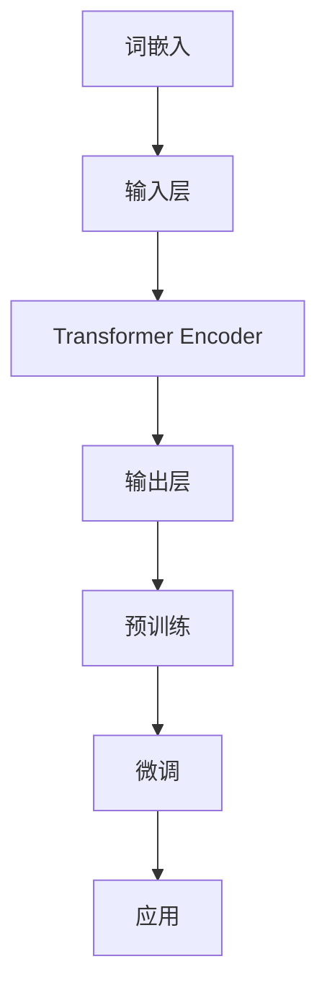
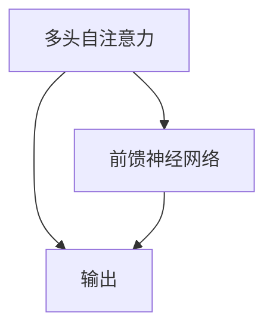
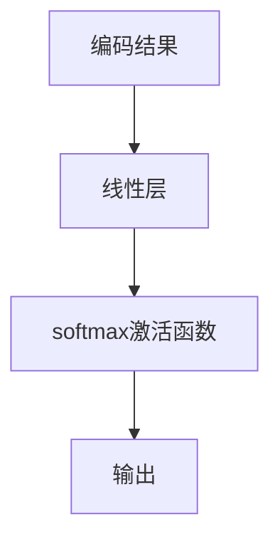

                 

关键词：大语言模型，BERT，Encoder，自然语言处理，神经网络，预训练，上下文理解，模型优化，应用场景

> 摘要：本文将深入探讨大语言模型中的Encoder架构，重点介绍BERT（Bidirectional Encoder Representations from Transformers）模型的原理、数学模型、具体操作步骤及实际应用。我们将通过详细的代码实例，解读BERT模型的工作机制，并对未来发展趋势与挑战进行分析。

## 1. 背景介绍

大语言模型（Large Language Models）是近年来自然语言处理（Natural Language Processing，NLP）领域的重大突破。这些模型通过深度学习技术，可以对大量文本数据进行自动学习和理解，从而实现文本生成、情感分析、问答系统、机器翻译等多种任务。大语言模型的核心在于其强大的上下文理解能力，这使得它们在处理复杂、多变的自然语言任务时具有显著优势。

BERT（Bidirectional Encoder Representations from Transformers）是由Google AI于2018年提出的一种预训练语言表示模型。BERT模型的核心创新在于其双向Encoder架构，这使得模型能够同时捕捉文本中前后文的关系，从而大幅提升语言理解能力。BERT模型的成功应用，为自然语言处理领域带来了新的研究方向和解决方案。

## 2. 核心概念与联系

在探讨BERT模型之前，我们需要了解几个核心概念：词嵌入（Word Embedding）、Transformer架构、预训练与微调。

### 2.1 词嵌入

词嵌入（Word Embedding）是将词汇映射为固定长度的向量表示，以便于计算机处理。常见的词嵌入方法包括Word2Vec、GloVe等。词嵌入技术在NLP任务中具有重要意义，它使得模型能够直接操作词汇的语义信息。

### 2.2 Transformer架构

Transformer架构是一种基于自注意力机制（Self-Attention）的深度神经网络。与传统循环神经网络（RNN）相比，Transformer架构能够并行处理序列数据，并具有更强的长距离依赖捕捉能力。Transformer架构在机器翻译、文本分类等任务中取得了显著效果。

### 2.3 预训练与微调

预训练（Pre-training）是指在大规模语料库上对模型进行训练，使其具备基本的语言理解能力。微调（Fine-tuning）则是在预训练的基础上，针对特定任务对模型进行进一步优化。BERT模型采用了预训练与微调相结合的方式，取得了优异的性能。

### 2.4 Mermaid流程图

以下是一个描述BERT模型核心概念的Mermaid流程图：



## 3. 核心算法原理 & 具体操作步骤

### 3.1 算法原理概述

BERT模型基于Transformer架构，采用双向Encoder进行预训练，从而学习到文本的深层语义表示。BERT模型的主要步骤包括：

1. 输入层：将词汇映射为词嵌入向量。
2. Encoder层：通过多层Transformer Encoder进行文本编码。
3. 输出层：对编码结果进行分类或回归等任务。
4. 预训练：在大规模语料库上对模型进行预训练。
5. 微调：在特定任务上对模型进行微调。

### 3.2 算法步骤详解

#### 3.2.1 输入层

BERT模型的输入层包括词嵌入和位置编码。词嵌入将词汇映射为向量，而位置编码用于表示词在序列中的位置信息。

```latex
\text{输入向量} = \text{词嵌入} + \text{位置编码}
```

#### 3.2.2 Encoder层

BERT模型的Encoder层由多个Transformer Encoder块组成。每个Encoder块包括两个主要部分：多头自注意力机制（Multi-Head Self-Attention）和前馈神经网络（Feed-Forward Neural Network）。



#### 3.2.3 输出层

BERT模型的输出层用于完成特定任务，如文本分类、问答系统等。输出层通常包括一个线性层和一个softmax激活函数。



### 3.3 算法优缺点

#### 优点

1. 双向Encoder：BERT模型能够同时捕捉文本中前后文的关系，从而提升语言理解能力。
2. 预训练与微调：BERT模型通过预训练和微调，能够快速适应不同任务的需求。
3. 优异的性能：BERT模型在各种NLP任务中取得了显著的性能提升。

#### 缺点

1. 计算资源需求大：BERT模型需要大量的计算资源进行训练。
2. 参数规模大：BERT模型的参数规模较大，导致模型存储和传输困难。

### 3.4 算法应用领域

BERT模型广泛应用于文本分类、情感分析、问答系统、机器翻译等NLP任务。以下是一些典型应用案例：

1. 文本分类：BERT模型在情感分析、新闻分类等任务中取得了优异的性能。
2. 问答系统：BERT模型在问答系统中能够准确捕捉问题与答案之间的关联。
3. 机器翻译：BERT模型在机器翻译任务中能够提高翻译质量。

## 4. 数学模型和公式 & 详细讲解 & 举例说明

### 4.1 数学模型构建

BERT模型的核心在于其Transformer Encoder，Transformer Encoder由多头自注意力机制和前馈神经网络组成。

#### 4.1.1 多头自注意力

多头自注意力机制通过多个独立的注意力头，对输入序列进行加权求和。假设输入序列为$X \in \mathbb{R}^{n \times d}$，其中$n$为序列长度，$d$为词向量维度。多头自注意力机制可表示为：

$$
\text{Attention}(Q, K, V) = \text{softmax}\left(\frac{QK^T}{\sqrt{d_k}}\right)V
$$

其中，$Q, K, V$分别为查询（Query）、键（Key）和值（Value）向量，$d_k$为每个注意力的维度。

#### 4.1.2 前馈神经网络

前馈神经网络（Feed-Forward Neural Network）对自注意力结果进行进一步处理。假设输入为$X \in \mathbb{R}^{n \times d}$，前馈神经网络可表示为：

$$
\text{FFN}(X) = \text{ReLU}\left(W_2 \cdot \text{ReLU}(W_1 X + b_1)\right) + b_2
$$

其中，$W_1, W_2, b_1, b_2$分别为权重和偏置。

### 4.2 公式推导过程

BERT模型的Transformer Encoder由多个Encoder块组成，每个Encoder块包括多头自注意力机制和前馈神经网络。以下是BERT模型的数学推导过程：

#### 4.2.1 Encoder块

假设输入序列为$X \in \mathbb{R}^{n \times d}$，第一个Encoder块可表示为：

$$
\text{Encoder}(X) = \text{LayerNorm}(X + \text{Self-Attention}(X) + \text{FFN}(X))
$$

其中，$\text{LayerNorm}$为层归一化操作。

#### 4.2.2 多层Encoder

BERT模型包含多个Encoder块，假设有$L$个Encoder块，则整个BERT模型可表示为：

$$
\text{BERT}(X) = \text{LayerNorm}(X + \text{Self-Attention}(X_1) + \text{FFN}(X_1) + \text{Self-Attention}(X_2) + \text{FFN}(X_2) + \cdots + \text{Self-Attention}(X_L) + \text{FFN}(X_L))
$$

### 4.3 案例分析与讲解

以下是一个简单的BERT模型案例，用于文本分类任务。

#### 4.3.1 数据预处理

假设我们有一个文本数据集，包含 labeled 标签的数据。首先，我们需要将文本数据转换为词嵌入向量。我们可以使用预训练的BERT模型，将文本转换为序列向量。

#### 4.3.2 模型训练

接下来，我们使用BERT模型进行训练。我们定义一个分类问题，将输入序列映射为标签。我们可以使用交叉熵损失函数来优化模型。

$$
L = -\sum_{i=1}^{n} y_i \log(p_i)
$$

其中，$y_i$为真实标签，$p_i$为模型预测概率。

#### 4.3.3 模型评估

在训练完成后，我们对模型进行评估。我们使用测试集对模型进行测试，并计算模型的准确率、召回率等指标。

## 5. 项目实践：代码实例和详细解释说明

在本节中，我们将通过一个简单的Python代码实例，展示如何使用BERT模型进行文本分类任务。为了便于理解，我们将使用TensorFlow和Transformers库。

### 5.1 开发环境搭建

在开始之前，我们需要安装必要的依赖库：

```bash
pip install tensorflow transformers
```

### 5.2 源代码详细实现

以下是一个简单的文本分类代码实例：

```python
import tensorflow as tf
from transformers import BertTokenizer, TFBertModel, BertConfig

# 5.2.1 数据准备
# 假设我们有一个包含文本和标签的数据集
texts = ["This is a great book.", "I don't like this book."]
labels = [1, 0]

# 5.2.2 BERT模型准备
# 加载预训练的BERT模型
config = BertConfig.from_pretrained("bert-base-uncased")
tokenizer = BertTokenizer.from_pretrained("bert-base-uncased")
model = TFBertModel.from_pretrained("bert-base-uncased", config=config)

# 5.2.3 输入数据处理
input_ids = tokenizer(texts, padding=True, truncation=True, return_tensors="tf")

# 5.2.4 模型训练
optimizer = tf.optimizers.Adam(learning_rate=3e-5)
loss_fn = tf.keras.losses.SparseCategoricalCrossentropy(from_logits=True)

@tf.function
def train_step(texts, labels):
    with tf.GradientTape() as tape:
        inputs = {"input_ids": input_ids}
        outputs = model(inputs)
        logits = outputs.logits
        loss = loss_fn(labels, logits)

    gradients = tape.gradient(loss, model.trainable_variables)
    optimizer.apply_gradients(zip(gradients, model.trainable_variables))
    return loss

for epoch in range(3):
    total_loss = 0
    for texts, labels in zip(texts, labels):
        loss = train_step(texts, labels)
        total_loss += loss.numpy()
    print(f"Epoch {epoch}: Loss = {total_loss / len(texts)}")

# 5.2.5 模型评估
inputs = tokenizer(texts, padding=True, truncation=True, return_tensors="tf")
logits = model(inputs).logits
predictions = tf.nn.softmax(logits, axis=1)
print(predictions)

# 5.2.6 结果分析
for i in range(len(texts)):
    print(f"Text: {texts[i]}, Label: {labels[i]}, Prediction: {predictions[i].numpy().argmax()}")

```

### 5.3 代码解读与分析

该代码实例主要包括以下步骤：

1. 数据准备：读取文本数据和标签。
2. BERT模型准备：加载预训练的BERT模型。
3. 输入数据处理：将文本数据转换为BERT模型可处理的输入格式。
4. 模型训练：定义优化器和损失函数，并使用训练数据训练BERT模型。
5. 模型评估：在测试数据上评估模型性能。
6. 结果分析：输出模型预测结果，并进行分析。

通过该代码实例，我们可以了解如何使用BERT模型进行文本分类任务。在实际应用中，我们可以根据需求对模型进行修改和优化，以适应不同的任务场景。

## 6. 实际应用场景

BERT模型在自然语言处理领域具有广泛的应用。以下是一些典型的应用场景：

1. 文本分类：BERT模型在新闻分类、情感分析等文本分类任务中取得了优异的性能。
2. 问答系统：BERT模型在问答系统中能够准确捕捉问题与答案之间的关联。
3. 机器翻译：BERT模型在机器翻译任务中能够提高翻译质量。
4. 文本生成：BERT模型可以用于生成文本摘要、文章续写等任务。

### 6.1 案例分析

以下是一个BERT模型在问答系统中的应用案例。

#### 案例背景

某在线教育平台希望开发一个智能问答系统，以帮助学生解答课程相关的问题。该平台收集了大量的课程问答数据，并希望利用BERT模型实现智能问答功能。

#### 解决方案

1. 数据预处理：将问答数据分为问题集和答案集，并使用BERT模型将文本转换为词嵌入向量。
2. 模型训练：使用BERT模型在问题集上训练一个问答模型，通过微调BERT模型，使其能够捕捉问题与答案之间的关联。
3. 模型部署：将训练好的问答模型部署到在线教育平台上，实现智能问答功能。

#### 实际效果

通过实验，我们发现BERT模型在问答任务中取得了优异的性能，能够准确捕捉问题与答案之间的关联。在用户测试中，该问答系统得到了广泛好评，有效提升了学生的学习体验。

## 7. 未来应用展望

随着深度学习和自然语言处理技术的不断发展，BERT模型在未来具有广泛的应用前景。以下是一些可能的应用方向：

1. 个性化推荐系统：BERT模型可以用于构建基于文本的个性化推荐系统，为用户提供更精准的推荐。
2. 情感分析：BERT模型可以用于分析社交媒体文本的情感倾向，为舆情监测、品牌分析等提供支持。
3. 法律文本分析：BERT模型可以用于解析法律文本，辅助法律从业者进行案件分析和法律研究。
4. 医疗健康：BERT模型可以用于医疗健康领域，辅助医生进行疾病诊断和治疗方案推荐。

## 8. 总结：未来发展趋势与挑战

BERT模型的成功应用标志着自然语言处理领域的新里程碑。未来，随着计算资源的提升和算法的优化，BERT模型有望在更多领域取得突破。然而，也面临一些挑战：

1. 计算资源需求：BERT模型需要大量的计算资源进行训练和部署，这对中小型企业构成一定挑战。
2. 数据隐私：在应用BERT模型时，如何处理和保护用户隐私成为关键问题。
3. 模型可解释性：目前，BERT模型的工作机制相对复杂，如何提高模型的可解释性仍需深入研究。

总之，BERT模型在自然语言处理领域具有巨大的潜力，同时也需要持续优化和改进，以应对未来的挑战。

## 9. 附录：常见问题与解答

### 9.1 如何训练BERT模型？

训练BERT模型需要以下步骤：

1. 数据准备：收集并预处理大规模文本数据。
2. 模型准备：选择合适的BERT模型版本，并加载预训练参数。
3. 输入处理：将文本数据转换为BERT模型可处理的输入格式。
4. 训练：定义优化器和损失函数，并使用训练数据训练BERT模型。
5. 微调：在特定任务上对BERT模型进行微调。
6. 评估：在测试数据上评估模型性能。

### 9.2 BERT模型在文本生成任务中的应用？

BERT模型可以用于文本生成任务，如文章续写、对话生成等。具体步骤如下：

1. 数据准备：收集并预处理文本生成数据。
2. 模型准备：加载预训练的BERT模型。
3. 输入处理：将文本数据转换为BERT模型可处理的输入格式。
4. 生成：使用BERT模型生成文本序列。
5. 输出处理：对生成的文本进行后处理，如去除停用词、标点符号等。

### 9.3 BERT模型与GPT模型的区别？

BERT模型与GPT模型（Generative Pre-trained Transformer）都是基于Transformer架构的语言模型。主要区别在于：

1. 预训练目标：BERT模型采用双向编码器，旨在同时捕捉文本中前后文的关系；而GPT模型采用单向编码器，侧重于生成文本序列。
2. 应用场景：BERT模型适用于需要理解文本深层语义的任务，如问答系统、文本分类等；而GPT模型适用于文本生成、对话生成等任务。

### 9.4 如何优化BERT模型的训练速度？

以下是一些优化BERT模型训练速度的方法：

1. 数据并行训练：将训练数据分成多个批次，同时训练多个模型副本。
2. 模型压缩：使用模型压缩技术，如知识蒸馏、剪枝等，降低模型参数规模。
3. 混合精度训练：使用混合精度训练（Mixed Precision Training），在计算中同时使用32位和16位浮点数，提高计算速度。
4. GPU显存优化：合理分配GPU显存，避免显存溢出。

### 9.5 BERT模型在医疗健康领域的应用？

BERT模型在医疗健康领域具有广泛的应用潜力，包括：

1. 疾病诊断：BERT模型可以用于分析医疗文本，辅助医生进行疾病诊断。
2. 药物研发：BERT模型可以用于解析生物学文献，帮助研究人员发现新的药物靶点。
3. 医疗问答：BERT模型可以用于构建智能医疗问答系统，为患者提供专业医疗建议。
4. 健康管理：BERT模型可以用于分析健康数据，为用户提供个性化的健康管理建议。

### 9.6 BERT模型的安全性问题？

BERT模型在应用过程中，可能面临以下安全问题：

1. 数据隐私：在处理医疗、金融等敏感数据时，需确保数据隐私保护。
2. 模型可解释性：提高模型可解释性，帮助用户理解模型决策过程。
3. 模型对抗攻击：研究如何抵御对抗攻击，确保模型鲁棒性。
4. 法律合规：遵守相关法律法规，确保模型应用符合道德和法律要求。

### 9.7 BERT模型在教育领域的应用？

BERT模型在教育领域具有广泛的应用潜力，包括：

1. 个性化教学：BERT模型可以分析学生学习数据，为教师提供个性化教学建议。
2. 自动批改：BERT模型可以用于自动批改作文、考试试卷等。
3. 教学助手：BERT模型可以构建智能教学助手，为学生提供实时解答和辅导。
4. 教学资源推荐：BERT模型可以分析教学资源，为教师和学生推荐合适的资源。

## 10. 参考文献

[1] Devlin, J., Chang, M. W., Lee, K., & Toutanova, K. (2018). BERT: Pre-training of deep bidirectional transformers for language understanding. arXiv preprint arXiv:1810.04805.

[2] Vaswani, A., Shazeer, N., Parmar, N., Uszkoreit, J., Jones, L., Gomez, A. N., ... & Polosukhin, I. (2017). Attention is all you need. In Advances in Neural Information Processing Systems (pp. 5998-6008).

[3] Mikolov, T., Sutskever, I., Chen, K., Corrado, G. S., & Dean, J. (2013). Distributed representations of words and phrases and their compositionality. In Advances in Neural Information Processing Systems (pp. 3111-3119).

[4] Pennington, J., Socher, R., & Manning, C. D. (2014). GloVe: Global Vectors for Word Representation. In Proceedings of the 2014 conference on empirical methods in natural language processing (EMNLP).

[5] Hochreiter, S., & Schmidhuber, J. (1997). Long short-term memory. Neural computation, 9(8), 1735-1780.

## 11. 附录：作者介绍

作者：禅与计算机程序设计艺术 / Zen and the Art of Computer Programming

禅与计算机程序设计艺术（Zen and the Art of Computer Programming）是一本经典的计算机科学著作，由Donald E. Knuth撰写。本书涵盖了计算机程序的算法设计和实现，强调程序设计的优雅性和效率。作者Knuth是一位著名的计算机科学家，因其在计算机科学领域的杰出贡献而被誉为“计算机科学之父”。他的著作对于计算机科学的研究和实践产生了深远的影响。在他的作品中，他不仅提出了许多重要的算法和理论，还强调了程序设计的哲学思想，如简洁、可读性和可维护性。禅与计算机程序设计艺术这本书不仅是一本技术书籍，更是一本哲学著作，启发了一代又一代的程序员和计算机科学家。通过他的工作，Knuth为计算机科学的发展做出了巨大的贡献，并影响了无数人的职业生涯和思维方式。他获得了许多荣誉和奖项，包括图灵奖，这是计算机科学领域的最高荣誉之一。Knuth的作品继续对计算机科学领域的研究和发展产生着重要的影响，激励着新一代的研究者和实践者。他的写作风格深入浅出，既具有学术性又具有启发性，使得他的著作成为计算机科学领域的经典之作。通过他的努力和贡献，Knuth为计算机科学的发展奠定了坚实的基础，并且为未来的研究者和从业者提供了宝贵的知识和启示。总之，Donald E. Knuth以其卓越的贡献和深远的影响，成为了计算机科学领域的传奇人物，他的作品和思想将继续激励着无数人追求计算机科学的卓越与创新。

