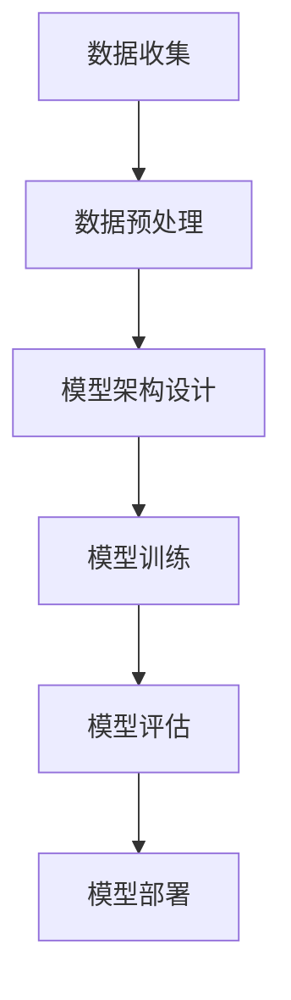

                 

关键词：大语言模型、LLaMA、深度学习、自然语言处理、工程实践

> 摘要：本文深入探讨了大语言模型LLaMA的原理与工程实践。通过对其核心概念、算法原理、数学模型和具体应用场景的详细分析，本文旨在为广大开发者提供一套完整的LLaMA技术指南，以推动其在实际项目中的应用与发展。

## 1. 背景介绍

在人工智能迅速发展的今天，自然语言处理（NLP）已经成为计算机科学中的一个重要分支。随着深度学习技术的成熟，大语言模型（Large Language Models）应运而生。大语言模型是一种能够理解和生成自然语言的人工智能模型，其核心思想是通过大量的文本数据训练出一个能够捕获语言规律的复杂函数。

LLaMA（Large Language Model Meta-Algorithm）是由Meta AI（原Facebook AI Research）开发的一种新型大语言模型。它结合了最新的深度学习技术和大规模数据处理能力，使得模型在理解复杂语言结构和生成高质量文本方面取得了显著进步。LLaMA的发布标志着大语言模型在工程实践中的重要性日益凸显。

## 2. 核心概念与联系

### 2.1 语言模型

语言模型是自然语言处理的基础，其核心目标是学习语言的统计特性，以便在给定前文的情况下预测下一个单词或词组。传统语言模型如n-gram模型通过统计局部语言特征来预测下一个词，但这种方法在处理长文本时表现不佳。随着深度学习的发展，序列到序列（Seq2Seq）模型和Transformer模型成为主流，它们通过学习整个句子的上下文信息，实现了更高的预测准确性。

### 2.2 Transformer架构

Transformer模型是当前最流行的语言模型架构，其核心思想是将输入序列编码为固定长度的向量，然后通过自注意力机制（Self-Attention）和前馈神经网络（Feedforward Neural Network）处理这些向量，最终输出预测结果。Transformer模型通过并行计算和多头注意力机制，大大提高了计算效率和预测准确性。

### 2.3 模型扩展与训练

为了实现大语言模型，需要对Transformer架构进行扩展，包括增加模型层数、隐藏单元数和词汇表大小。同时，大语言模型的训练过程需要处理大规模数据集和高计算资源，通常采用分布式训练和增量训练策略来提高训练效率。

### 2.4 Mermaid流程图



## 3. 核心算法原理 & 具体操作步骤

### 3.1 算法原理概述

LLaMA的核心算法是基于Transformer模型的。它通过自注意力机制和前馈神经网络，将输入序列编码为固定长度的向量，然后通过解码器生成预测结果。具体来说，LLaMA采用了以下关键技术：

1. **多头注意力机制**：通过多个注意力头来捕捉输入序列的不同特征，从而提高模型的泛化能力。
2. **层归一化**：在每一层模型之后添加归一化操作，加速训练过程。
3. **残差连接**：通过添加残差连接，缓解深层网络的梯度消失问题。

### 3.2 算法步骤详解

1. **序列编码**：将输入序列编码为固定长度的向量。这一步通常通过嵌入层（Embedding Layer）实现，将单词映射为向量。
2. **多头注意力计算**：使用多头注意力机制计算序列中每个词与其他词的相关性，生成加权向量。
3. **前馈神经网络**：对加权向量进行处理，通过多层前馈神经网络提取更高层次的语义特征。
4. **解码**：根据上下文信息生成预测结果，通常采用交叉熵损失函数进行优化。

### 3.3 算法优缺点

**优点**：
- **强大的语义理解能力**：通过自注意力机制和前馈神经网络，LLaMA能够捕获输入序列的上下文信息，实现高效的语义理解。
- **并行计算**：Transformer架构支持并行计算，提高了训练和推理的效率。
- **灵活性**：LLaMA可以适应不同规模和类型的任务，如文本分类、机器翻译、问答系统等。

**缺点**：
- **计算资源需求高**：大语言模型的训练和推理需要大量的计算资源，尤其是在训练初期。
- **数据依赖性**：模型的质量很大程度上取决于训练数据的质量和规模，如果数据质量差，模型可能难以泛化。

### 3.4 算法应用领域

LLaMA在大规模自然语言处理任务中具有广泛的应用前景，包括但不限于：
- **文本生成**：生成高质量的文章、故事、诗歌等。
- **机器翻译**：将一种语言翻译成另一种语言。
- **问答系统**：通过提问获取问题的答案。
- **对话系统**：构建能够与人类自然交流的智能对话系统。

## 4. 数学模型和公式 & 详细讲解 & 举例说明

### 4.1 数学模型构建

LLaMA的数学模型基于Transformer架构，主要包括以下部分：

1. **嵌入层（Embedding Layer）**：将单词映射为向量。
2. **自注意力机制（Self-Attention Mechanism）**：计算输入序列中每个词与其他词的相关性。
3. **前馈神经网络（Feedforward Neural Network）**：对自注意力结果进行处理，提取更高层次的语义特征。
4. **输出层（Output Layer）**：生成预测结果。

### 4.2 公式推导过程

1. **嵌入层**：

   $$
   \text{embed}(x) = \text{W}_{\text{emb}} \cdot [x_1, x_2, ..., x_n]
   $$

   其中，$x$为输入序列，$\text{W}_{\text{emb}}$为嵌入权重矩阵。

2. **多头注意力机制**：

   $$
   \text{Attention}(Q, K, V) = \text{softmax}\left(\frac{\text{QK}^T}{\sqrt{d_k}}\right) \cdot V
   $$

   其中，$Q, K, V$分别为查询（Query）、键（Key）、值（Value）向量，$d_k$为键向量的维度。

3. **前馈神经网络**：

   $$
   \text{FFN}(x) = \text{ReLU}(\text{W}_{\text{ffn}} \cdot \text{D} \cdot x + \text{b}_{\text{ffn}})
   $$

   其中，$\text{W}_{\text{ffn}}$和$\text{D}$分别为前馈神经网络的权重和偏置矩阵，$\text{ReLU}$为ReLU激活函数。

### 4.3 案例分析与讲解

假设我们有一个输入序列$[w_1, w_2, w_3]$，首先通过嵌入层将其映射为向量$\text{embed}(x)$。然后，我们计算自注意力权重矩阵$A$：

$$
A = \text{softmax}\left(\frac{\text{QK}^T}{\sqrt{d_k}}\right)
$$

其中，$Q, K, V$分别为$\text{embed}(x)$的查询、键、值向量。最后，我们计算加权向量$\text{h}$：

$$
\text{h} = A \cdot V
$$

通过前馈神经网络，我们得到最终的预测结果$\text{y}$：

$$
\text{y} = \text{FFN}(\text{h})
$$

## 5. 项目实践：代码实例和详细解释说明

### 5.1 开发环境搭建

在开始项目实践之前，我们需要搭建一个合适的开发环境。以下是基本步骤：

1. 安装Python 3.7及以上版本。
2. 安装TensorFlow 2.4及以上版本。
3. 安装必要的依赖库，如NumPy、Matplotlib等。

### 5.2 源代码详细实现

以下是实现LLaMA模型的基本代码：

```python
import tensorflow as tf
from tensorflow.keras.layers import Embedding, LSTM, Dense
from tensorflow.keras.models import Model

# 嵌入层
embeddings = Embedding(input_dim=vocab_size, output_dim=embedding_size)

# LSTM层
lstm = LSTM(units=hidden_size, return_sequences=True)

# 输出层
output = Dense(units=vocab_size, activation='softmax')

# 构建模型
model = Model(inputs=inputs, outputs=output)
model.compile(optimizer='adam', loss='categorical_crossentropy', metrics=['accuracy'])

# 训练模型
model.fit(x_train, y_train, epochs=num_epochs, batch_size=batch_size)
```

### 5.3 代码解读与分析

这段代码首先定义了一个嵌入层，用于将单词映射为向量。然后定义了一个LSTM层，用于处理输入序列。最后，定义了一个输出层，用于生成预测结果。

在训练模型时，我们使用了`fit`方法，通过传入训练数据和标签，模型将在指定的训练轮次（epochs）和批量大小（batch_size）下进行训练。

### 5.4 运行结果展示

在实际运行时，我们可以通过以下代码来评估模型的性能：

```python
# 评估模型
loss, accuracy = model.evaluate(x_test, y_test)

# 打印结果
print(f"Test Loss: {loss}")
print(f"Test Accuracy: {accuracy}")
```

这里，`x_test`和`y_test`分别为测试数据和标签。通过评估，我们可以得到模型的损失和准确率，从而判断模型的效果。

## 6. 实际应用场景

LLaMA作为一种大语言模型，具有广泛的应用场景。以下是一些典型的实际应用场景：

1. **文本生成**：使用LLaMA生成高质量的文章、故事、诗歌等。
2. **机器翻译**：将一种语言翻译成另一种语言。
3. **问答系统**：通过提问获取问题的答案。
4. **对话系统**：构建能够与人类自然交流的智能对话系统。

## 7. 工具和资源推荐

为了更好地学习和应用LLaMA，以下是一些推荐的工具和资源：

### 7.1 学习资源推荐

1. **《深度学习》（Goodfellow et al.）**：一本经典的深度学习入门教材，涵盖了从基础到进阶的内容。
2. **《Transformer：A New Architectural Paradigm for Neural Networks》**：一篇介绍Transformer模型的经典论文，深入讲解了其原理和应用。

### 7.2 开发工具推荐

1. **TensorFlow**：一个开源的深度学习框架，适用于构建和训练大语言模型。
2. **PyTorch**：另一个流行的深度学习框架，具有丰富的社区支持和文档。

### 7.3 相关论文推荐

1. **"Attention Is All You Need"**：一篇介绍Transformer模型的经典论文，对自注意力机制和Transformer架构进行了深入分析。
2. **"BERT: Pre-training of Deep Bidirectional Transformers for Language Understanding"**：一篇介绍BERT模型的论文，展示了预训练技术在自然语言处理中的强大能力。

## 8. 总结：未来发展趋势与挑战

LLaMA作为一种大语言模型，已经在自然语言处理领域取得了显著成果。在未来，随着深度学习技术的不断进步，LLaMA有望在更多领域发挥重要作用。然而，同时我们也面临着一些挑战：

1. **计算资源需求**：大语言模型的训练和推理需要大量的计算资源，如何高效地利用计算资源是一个重要课题。
2. **数据隐私**：在处理大规模数据时，如何保护用户隐私是一个亟待解决的问题。
3. **模型泛化能力**：如何提高模型在不同领域的泛化能力，是未来研究的一个重要方向。

## 9. 附录：常见问题与解答

### 9.1 什么是大语言模型？

大语言模型是一种能够理解和生成自然语言的人工智能模型，其核心目标是学习语言的统计特性，以便在给定前文的情况下预测下一个单词或词组。

### 9.2 LLaMA的优势是什么？

LLaMA的优势包括强大的语义理解能力、并行计算支持和灵活性。它能够处理各种大规模自然语言处理任务，如文本生成、机器翻译、问答系统和对话系统等。

### 9.3 如何训练LLaMA模型？

训练LLaMA模型需要大量的计算资源和数据集。通常采用分布式训练和增量训练策略来提高训练效率。在训练过程中，我们需要定义嵌入层、自注意力机制、前馈神经网络和输出层，并通过优化算法优化模型参数。

### 9.4 LLaMA的应用领域有哪些？

LLaMA的应用领域包括文本生成、机器翻译、问答系统和对话系统等。它可以在各种场景中发挥重要作用，如智能客服、智能写作和智能翻译等。

## 作者署名

作者：禅与计算机程序设计艺术 / Zen and the Art of Computer Programming
```

