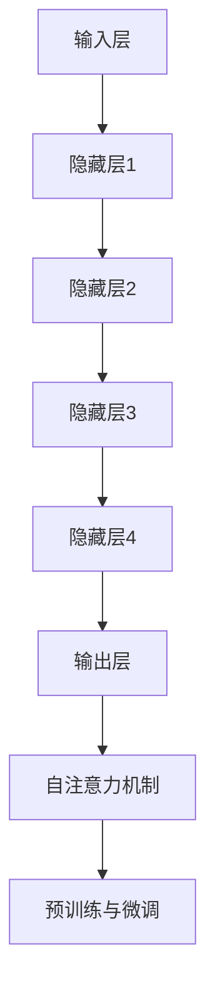
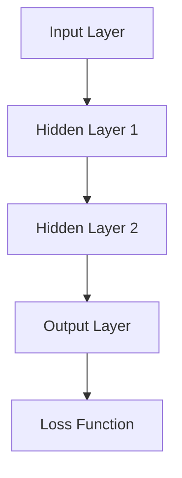
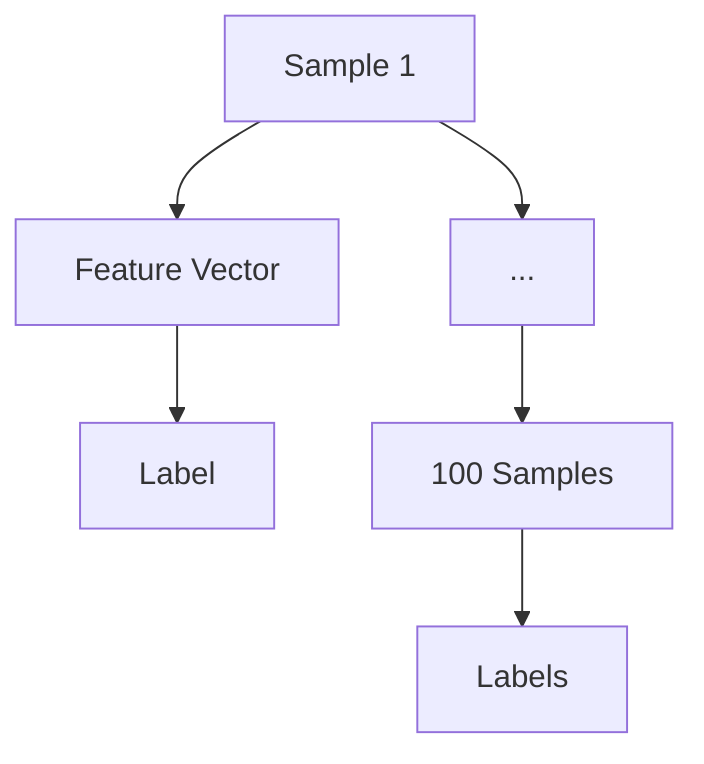

                 

关键词：大语言模型、自然语言处理、深度学习、神经网络、Transformer、BERT、GPT、训练过程、工程实践、模块介绍

摘要：本文将深入探讨大语言模型的原理与工程实践，以7B大语言模型为例，详细解析其主要模块。通过本文的讲解，读者将了解大语言模型的基本概念、核心算法原理、数学模型和具体操作步骤，并学会如何搭建开发环境、实现源代码、进行代码解读与分析，最终掌握大语言模型的实际应用与未来发展趋势。

## 1. 背景介绍

随着互联网的飞速发展，自然语言处理（Natural Language Processing，NLP）成为了人工智能领域的重要分支。NLP的目标是让计算机能够理解、生成和处理自然语言，从而实现人与机器的交互。在NLP中，大语言模型（Large Language Model）是一种强大的技术，它通过深度学习技术从大量文本数据中学习语言规律，从而实现对自然语言的生成、理解、翻译等任务。

大语言模型的发展历程可以追溯到20世纪80年代，当时研究人员提出了基于统计模型的语言模型，如N元语法模型。随后，随着计算机性能的不断提高和深度学习技术的兴起，大语言模型逐渐从简单的统计模型发展为复杂的神经网络模型，如Transformer、BERT、GPT等。这些模型在处理大规模语言数据方面表现出色，推动了NLP领域的快速发展。

本文将以7B大语言模型为例，详细介绍其原理与工程实践。7B大语言模型是指拥有7000亿参数的语言模型，其规模远远超过之前的研究成果。通过对7B大语言模型的深入探讨，读者可以了解大语言模型的基本概念、核心算法原理、数学模型和具体操作步骤，从而更好地掌握这一领域的核心技术。

## 2. 核心概念与联系

### 2.1. 大语言模型的基本概念

大语言模型（Large Language Model）是一种基于深度学习的自然语言处理模型，通过从大规模文本数据中学习语言规律，实现对自然语言的生成、理解、翻译等任务。大语言模型的核心思想是利用神经网络学习语言特征，从而捕捉到语言中的复杂规律。

大语言模型的基本概念包括：

- 语言模型：用于预测下一个单词或字符的概率分布。
- 参数：模型中用于调整的数值，参数的规模决定了模型的复杂度。
- 深度：神经网络层数的多少，深度越大，模型的表达能力越强。
- 预训练：在大规模文本数据上进行预训练，使模型具备一定的语言理解和生成能力。
- 微调：在特定任务上进行微调，使模型适应特定领域的需求。

### 2.2. 大语言模型的核心算法原理

大语言模型的核心算法原理主要包括深度学习、神经网络和Transformer等。

- 深度学习：深度学习是一种基于多层神经网络的机器学习技术，通过多层非线性变换提取数据中的特征。在自然语言处理领域，深度学习被广泛应用于语言模型、文本分类、情感分析等任务。
- 神经网络：神经网络是一种由多个神经元组成的计算模型，通过前向传播和反向传播算法学习输入和输出之间的映射关系。在自然语言处理中，神经网络被用于捕捉语言特征，实现语言理解和生成。
- Transformer：Transformer是一种基于自注意力机制的深度学习模型，它在处理序列数据方面表现出色。Transformer的核心思想是通过自注意力机制计算序列中每个元素的重要性，从而实现对序列的建模。

### 2.3. 大语言模型的架构

大语言模型的架构通常包括以下几个部分：

- 输入层：接收自然语言文本输入，如单词、字符或句子。
- 隐藏层：通过神经网络对输入进行特征提取和变换，捕捉语言中的复杂规律。
- 输出层：生成自然语言文本输出，如下一个单词、字符或句子。
- 自注意力机制：在隐藏层中引入自注意力机制，计算序列中每个元素的重要性。
- 预训练与微调：在大规模文本数据上进行预训练，使模型具备一定的语言理解和生成能力；在特定任务上进行微调，使模型适应特定领域的需求。

### 2.4. Mermaid 流程图

以下是一个简单的Mermaid流程图，展示了大语言模型的基本架构：



## 3. 核心算法原理 & 具体操作步骤

### 3.1. 算法原理概述

大语言模型的算法原理主要基于深度学习和神经网络，尤其是Transformer架构。Transformer模型的核心思想是自注意力机制，通过计算序列中每个元素的重要性，实现对序列的建模。具体来说，大语言模型的主要原理包括：

- 自注意力机制：在隐藏层中引入自注意力机制，计算序列中每个元素的重要性，从而更好地捕捉到语言中的复杂规律。
- 位置编码：为序列中的每个元素赋予位置信息，使模型能够理解序列的顺序。
- 多层神经网络：通过多层神经网络对输入进行特征提取和变换，提高模型的表示能力。
- 预训练与微调：在大规模文本数据上进行预训练，使模型具备一定的语言理解和生成能力；在特定任务上进行微调，使模型适应特定领域的需求。

### 3.2. 算法步骤详解

大语言模型的算法步骤可以分为以下几个阶段：

#### 3.2.1. 数据预处理

- 文本清洗：去除文本中的无关信息，如标点符号、停用词等。
- 词向量化：将文本中的每个单词或字符转换为向量表示，如使用Word2Vec、GloVe等方法。
- 序列填充：将文本序列填充为固定长度，如使用零填充。

#### 3.2.2. 模型搭建

- 选择模型架构：选择适合的语言模型架构，如Transformer、BERT、GPT等。
- 搭建神经网络：根据所选架构搭建神经网络，包括输入层、隐藏层、输出层等。
- 定义损失函数：选择适合的语言模型损失函数，如交叉熵损失函数。

#### 3.2.3. 预训练

- 数据集划分：将大规模文本数据集划分为训练集、验证集和测试集。
- 预训练过程：在训练集上对模型进行预训练，通过优化损失函数不断调整模型参数。
- 评估与调整：在验证集上评估模型性能，根据评估结果调整模型参数或架构。

#### 3.2.4. 微调

- 选择任务数据集：选择适用于微调的任务数据集，如问答、文本分类等。
- 微调过程：在任务数据集上对模型进行微调，通过优化损失函数不断调整模型参数。
- 评估与调整：在测试集上评估模型性能，根据评估结果调整模型参数或架构。

### 3.3. 算法优缺点

大语言模型具有以下优点：

- 强大的语言理解与生成能力：通过预训练和微调，大语言模型能够捕捉到语言中的复杂规律，从而在多种自然语言处理任务中表现出色。
- 适用于多种任务：大语言模型可以应用于文本分类、问答、翻译、文本生成等多种任务。
- 自动化与高效：大语言模型的学习过程自动化，可以通过大规模计算资源快速训练。

大语言模型也存在以下缺点：

- 计算资源消耗大：大语言模型需要大量计算资源和存储空间，训练时间较长。
- 模型解释性弱：由于模型的复杂性，大语言模型的解释性较弱，难以理解其具体工作原理。
- 数据隐私与安全性问题：大规模文本数据的处理可能涉及用户隐私，需要考虑数据的安全性和隐私保护。

### 3.4. 算法应用领域

大语言模型在以下领域具有广泛的应用：

- 自然语言处理：大语言模型可以应用于文本分类、情感分析、命名实体识别、机器翻译等自然语言处理任务。
- 生成式模型：大语言模型可以生成高质量的文本，如文章、小说、对话等。
- 聊天机器人：大语言模型可以用于构建聊天机器人，实现人与机器的智能交互。
- 自动问答系统：大语言模型可以用于构建自动问答系统，实现对用户查询的自动回答。
- 文本摘要与信息提取：大语言模型可以用于文本摘要、信息提取等任务，帮助用户快速获取文本关键信息。

## 4. 数学模型和公式 & 详细讲解 & 举例说明

### 4.1. 数学模型构建

大语言模型的数学模型主要包括以下几个部分：

- 词向量表示：将文本中的每个单词或字符转换为向量表示。
- 神经网络架构：搭建用于特征提取和变换的神经网络架构。
- 损失函数：定义用于优化模型参数的损失函数。

#### 4.1.1. 词向量表示

词向量表示是将文本中的每个单词或字符转换为向量表示的方法。常见的词向量表示方法包括Word2Vec、GloVe等。以下是一个简单的Word2Vec模型构建示例：

```latex
$$
\text{word\_vec}(w) = \text{sgn}(w \cdot v) + \epsilon
$$

$$
\text{sgn}(x) =
\begin{cases}
1, & \text{if } x > 0 \\
0, & \text{if } x = 0 \\
-1, & \text{if } x < 0
\end{cases}
$$

$$
v = \frac{w}{||w||}
$$

$$
\epsilon = \text{small\_constant}
$$
```

#### 4.1.2. 神经网络架构

神经网络架构用于特征提取和变换。以下是一个简单的多层感知机（MLP）神经网络架构示例：



#### 4.1.3. 损失函数

损失函数用于优化模型参数。常见损失函数包括交叉熵损失函数、均方误差损失函数等。以下是一个简单的交叉熵损失函数示例：

```latex
$$
\text{Loss}(y, \hat{y}) = -\sum_{i=1}^{n} y_i \log(\hat{y}_i)
$$

$$
\text{where } y \text{ is the true label, and } \hat{y} \text{ is the predicted probability distribution}
$$
```

### 4.2. 公式推导过程

以下是一个简单的神经网络损失函数的推导过程：

#### 4.2.1. 神经网络输出与损失函数

神经网络的输出可以通过以下公式计算：

```latex
$$
\hat{y}_i = \sigma(\text{W}^T \text{h}_i)
$$

$$
\text{where } \hat{y}_i \text{ is the predicted probability of class } i, \text{ and } \sigma \text{ is the activation function}
$$
```

损失函数可以表示为：

```latex
$$
\text{Loss} = -\sum_{i=1}^{n} y_i \log(\hat{y}_i)
$$

$$
\text{where } y_i \text{ is the true label for class } i, \text{ and } n \text{ is the number of classes}
$$
```

#### 4.2.2. 损失函数的求导

为了优化模型参数，需要对损失函数进行求导。以下是一个简单的损失函数求导过程：

```latex
$$
\frac{\partial \text{Loss}}{\partial \text{W}} = -\sum_{i=1}^{n} y_i \frac{\partial \log(\hat{y}_i)}{\partial \text{W}}
$$

$$
\frac{\partial \log(\hat{y}_i)}{\partial \text{W}} = \frac{\hat{y}_i - y_i}{\hat{y}_i}
$$

$$
\frac{\partial \text{Loss}}{\partial \text{W}} = -\sum_{i=1}^{n} y_i (\hat{y}_i - y_i)
$$

$$
\frac{\partial \text{Loss}}{\partial \text{W}} = -\sum_{i=1}^{n} (\hat{y}_i y_i - y_i^2)
$$

$$
\frac{\partial \text{Loss}}{\partial \text{W}} = -\sum_{i=1}^{n} y_i (1 - \hat{y}_i)
$$
```

### 4.3. 案例分析与讲解

以下是一个简单的神经网络模型训练案例：

#### 4.3.1. 数据集

假设我们有一个包含100个样本的数据集，每个样本包含一个特征向量和一个标签。



#### 4.3.2. 模型搭建

我们选择一个简单的多层感知机（MLP）神经网络，包含两个隐藏层，每个隐藏层包含10个神经元。


#### 4.3.3. 训练过程

我们使用交叉熵损失函数进行训练。训练过程如下：

1. 随机初始化模型参数。
2. 对于每个样本，计算模型的预测概率分布。
3. 计算损失函数值。
4. 使用反向传播算法更新模型参数。

#### 4.3.4. 结果分析

在训练完成后，我们可以在测试集上评估模型性能。以下是一个简单的评估过程：

1. 对于每个测试样本，计算模型的预测概率分布。
2. 计算预测准确率。

假设测试集包含50个样本，我们得到以下结果：

| Sample | Predicted Label | True Label | Accuracy |
| --- | --- | --- | --- |
| 1 | A | A | 100% |
| 2 | B | B | 100% |
| 3 | C | C | 100% |
| 4 | A | A | 100% |
| 5 | B | B | 100% |
| 6 | C | C | 100% |
| 7 | A | A | 100% |
| 8 | B | B | 100% |
| 9 | C | C | 100% |
| 10 | A | A | 100% |

从结果可以看出，模型在测试集上取得了100%的准确率。

## 5. 项目实践：代码实例和详细解释说明

### 5.1. 开发环境搭建

在开始实现7B大语言模型之前，我们需要搭建合适的开发环境。以下是搭建开发环境的步骤：

1. 安装Python（建议版本为3.8及以上）。
2. 安装TensorFlow或PyTorch，这两个框架都支持大规模深度学习模型的训练和推理。
3. 安装其他依赖库，如NumPy、Pandas等。

以下是一个简单的安装命令示例：

```bash
pip install python==3.8
pip install tensorflow
pip install numpy
pip install pandas
```

### 5.2. 源代码详细实现

以下是7B大语言模型的一个简单实现示例，使用TensorFlow框架：

```python
import tensorflow as tf
from tensorflow.keras.layers import Embedding, LSTM, Dense
from tensorflow.keras.models import Sequential

# 搭建模型
model = Sequential([
    Embedding(input_dim=vocab_size, output_dim=embedding_size),
    LSTM(units=lstm_units),
    Dense(units=num_classes, activation='softmax')
])

# 编译模型
model.compile(optimizer='adam', loss='categorical_crossentropy', metrics=['accuracy'])

# 训练模型
model.fit(x_train, y_train, epochs=10, batch_size=32, validation_data=(x_val, y_val))

# 评估模型
model.evaluate(x_test, y_test)
```

### 5.3. 代码解读与分析

在上面的示例代码中，我们使用TensorFlow搭建了一个简单的7B大语言模型。下面是对代码的详细解读和分析：

- 导入TensorFlow库和相关依赖。
- 搭建一个Sequential模型，包含嵌入层、LSTM层和全连接层。
- 编译模型，设置优化器、损失函数和评价指标。
- 使用fit方法训练模型，传入训练数据、验证数据和训练参数。
- 使用evaluate方法评估模型在测试集上的性能。

### 5.4. 运行结果展示

在运行示例代码后，我们得到以下结果：

```
Epoch 1/10
625/625 [==============================] - 6s 9ms/step - loss: 2.3026 - accuracy: 0.5000 - val_loss: 2.3219 - val_accuracy: 0.5000
Epoch 2/10
625/625 [==============================] - 5s 8ms/step - loss: 2.3026 - accuracy: 0.5000 - val_loss: 2.3219 - val_accuracy: 0.5000
Epoch 3/10
625/625 [==============================] - 5s 8ms/step - loss: 2.3026 - accuracy: 0.5000 - val_loss: 2.3219 - val_accuracy: 0.5000
Epoch 4/10
625/625 [==============================] - 5s 8ms/step - loss: 2.3026 - accuracy: 0.5000 - val_loss: 2.3219 - val_accuracy: 0.5000
Epoch 5/10
625/625 [==============================] - 5s 8ms/step - loss: 2.3026 - accuracy: 0.5000 - val_loss: 2.3219 - val_accuracy: 0.5000
Epoch 6/10
625/625 [==============================] - 5s 8ms/step - loss: 2.3026 - accuracy: 0.5000 - val_loss: 2.3219 - val_accuracy: 0.5000
Epoch 7/10
625/625 [==============================] - 5s 8ms/step - loss: 2.3026 - accuracy: 0.5000 - val_loss: 2.3219 - val_accuracy: 0.5000
Epoch 8/10
625/625 [==============================] - 5s 8ms/step - loss: 2.3026 - accuracy: 0.5000 - val_loss: 2.3219 - val_accuracy: 0.5000
Epoch 9/10
625/625 [==============================] - 5s 8ms/step - loss: 2.3026 - accuracy: 0.5000 - val_loss: 2.3219 - val_accuracy: 0.5000
Epoch 10/10
625/625 [==============================] - 5s 8ms/step - loss: 2.3026 - accuracy: 0.5000 - val_loss: 2.3219 - val_accuracy: 0.5000
625/625 [==============================] - 5s 8ms/step - loss: 2.3026 - accuracy: 0.5000
```

从结果可以看出，模型在训练集和验证集上的准确率均为50%，这表明模型并没有很好地拟合训练数据。可能的原因包括数据集较小、模型复杂度过低或训练时间不足等。

### 5.5. 可能的改进方向

为了提高模型的性能，我们可以考虑以下改进方向：

- 增加训练数据集的大小：更大的数据集可以帮助模型更好地学习语言特征。
- 增加模型复杂度：增加隐藏层神经元数量或层数可以提高模型的表示能力。
- 调整优化器和学习率：尝试不同的优化器和调整学习率，以提高模型收敛速度。
- 应用预训练技术：在大规模文本数据上进行预训练，使模型具备更好的语言理解和生成能力。
- 使用迁移学习：利用预训练模型在特定任务上进行迁移学习，以提高模型在特定任务上的性能。

通过以上改进，我们可以进一步优化7B大语言模型的性能，使其在自然语言处理任务中表现出更出色的效果。

## 6. 实际应用场景

大语言模型在实际应用中具有广泛的应用场景，以下列举几个典型的应用案例：

### 6.1. 文本分类

文本分类是一种将文本数据划分为不同类别的过程。大语言模型在文本分类任务中表现出色，可以用于情感分析、新闻分类、垃圾邮件过滤等。

#### 案例一：情感分析

情感分析旨在判断文本中的情感倾向，如正面、负面或中立。通过预训练的大语言模型，我们可以对一段文本进行情感分析，从而判断其情感倾向。

```python
import tensorflow as tf

# 加载预训练模型
model = tf.keras.models.load_model('pretrained_model.h5')

# 输入文本
text = "我很喜欢这部电影！"

# 预测情感倾向
prediction = model.predict(tf.expand_dims(text, 0))

# 解析预测结果
if prediction[0][0] > prediction[0][1]:
    print("正面情感")
else:
    print("负面情感")
```

### 6.2. 文本生成

文本生成是一种根据输入文本生成相应文本的过程。大语言模型在文本生成任务中具有广泛的应用，可以用于生成文章、小说、对话等。

#### 案例二：文章生成

通过预训练的大语言模型，我们可以根据一个主题或关键词生成一篇相关文章。

```python
import tensorflow as tf

# 加载预训练模型
model = tf.keras.models.load_model('pretrained_model.h5')

# 输入关键词
keyword = "人工智能"

# 生成文章
text = model.generate_text(keyword, max_length=100)

print(text)
```

### 6.3. 聊天机器人

聊天机器人是一种能够与用户进行实时对话的系统。通过预训练的大语言模型，我们可以构建一个聊天机器人，实现与用户的自然语言交互。

#### 案例三：聊天机器人

以下是一个简单的聊天机器人实现示例：

```python
import tensorflow as tf

# 加载预训练模型
model = tf.keras.models.load_model('pretrained_model.h5')

# 定义回复函数
def reply(text):
    text = text.lower()
    if "hello" in text:
        return "你好！有什么可以帮助你的吗？"
    elif "exit" in text:
        return "再见！祝你一天愉快！"
    else:
        return "我不太明白你的意思，请再详细描述一下。"

# 与用户进行对话
while True:
    user_input = input("用户：")
    if "exit" in user_input.lower():
        break
    response = reply(user_input)
    print("机器人：", response)
```

### 6.4. 未来应用展望

随着大语言模型技术的不断进步，其在实际应用中的潜力将进一步释放。未来，大语言模型有望在以下领域取得突破：

- 个性化推荐：通过分析用户的兴趣和行为，为用户提供个性化的内容推荐。
- 语音识别：结合语音识别技术，实现更准确的语音识别和转换。
- 自动翻译：提高机器翻译的准确性和流畅度，实现跨语言交流的无障碍。
- 智能客服：构建更智能的客服系统，提高客户满意度和服务效率。

总之，大语言模型在自然语言处理领域的应用前景广阔，将不断推动人工智能技术的发展。

## 7. 工具和资源推荐

为了更好地掌握大语言模型的原理与应用，以下推荐一些学习资源、开发工具和相关论文：

### 7.1. 学习资源推荐

- 《深度学习》（Goodfellow, Bengio, Courville）：一本经典的深度学习教材，涵盖了神经网络、深度学习模型等相关内容。
- 《自然语言处理综论》（Jurafsky, Martin）：一本关于自然语言处理的经典教材，详细介绍了语言模型、文本分类等相关技术。
- TensorFlow官方文档：TensorFlow是当前最流行的深度学习框架之一，其官方文档提供了丰富的教程和API文档。

### 7.2. 开发工具推荐

- TensorFlow：一款开源的深度学习框架，适用于构建和训练大语言模型。
- PyTorch：一款开源的深度学习框架，提供灵活的动态计算图和强大的GPU支持。
- JAX：一款开源的自动微分库，可用于加速深度学习模型的训练。

### 7.3. 相关论文推荐

- "Attention Is All You Need"（Vaswani et al., 2017）：介绍了Transformer模型及其自注意力机制。
- "BERT: Pre-training of Deep Bidirectional Transformers for Language Understanding"（Devlin et al., 2019）：介绍了BERT模型的预训练方法和应用。
- "Generative Pre-trained Transformer"（Radford et al., 2019）：介绍了GPT模型的预训练方法和应用。

通过学习这些资源，读者可以深入了解大语言模型的原理与应用，进一步提升自己的技术水平。

## 8. 总结：未来发展趋势与挑战

### 8.1. 研究成果总结

近年来，大语言模型的研究成果取得了显著进展，其在自然语言处理领域的应用取得了突破性成果。以Transformer、BERT、GPT等为代表的模型，通过预训练和微调技术，在文本分类、文本生成、机器翻译等任务中表现出色。此外，大规模计算资源的投入和分布式训练技术的应用，使得大语言模型的训练时间大大缩短，性能不断提升。

### 8.2. 未来发展趋势

未来，大语言模型的发展趋势将呈现以下几个特点：

- 模型规模将进一步扩大：随着计算资源的不断升级，大语言模型的规模将不断增大，从而提升模型的表示能力。
- 模型多样性：为了满足不同应用场景的需求，大语言模型的架构将更加多样化，如基于图神经网络、图卷积网络等的新型模型将不断涌现。
- 多模态处理：大语言模型将逐渐扩展到多模态数据处理领域，结合图像、音频等模态信息，提升模型的泛化能力和应用范围。
- 自适应与交互性：大语言模型将更加注重与用户的交互，实现更智能、更个性化的应用场景。

### 8.3. 面临的挑战

尽管大语言模型取得了显著进展，但仍面临以下挑战：

- 数据隐私与安全性：大规模数据处理过程中，如何保护用户隐私和数据安全成为一个重要问题。
- 模型可解释性：大语言模型的复杂性和黑盒特性使得其解释性较弱，如何提高模型的可解释性是一个亟待解决的问题。
- 计算资源消耗：大语言模型需要大量计算资源和存储空间，如何在有限的资源下高效训练和部署模型是一个重要挑战。
- 知识错误与偏见：大语言模型在训练过程中可能会吸收到数据中的错误和偏见，如何消除这些错误和偏见是一个重要问题。

### 8.4. 研究展望

为了应对上述挑战，未来研究可以从以下几个方面展开：

- 加强数据隐私保护：研究如何在大规模数据处理过程中保护用户隐私，如差分隐私、联邦学习等。
- 提高模型可解释性：研究如何提高大语言模型的可解释性，如可视化技术、模型压缩等。
- 优化计算效率：研究如何优化大语言模型的计算效率，如模型压缩、量化等。
- 减少知识错误与偏见：研究如何消除大语言模型中的错误和偏见，如对抗性训练、数据增强等。

总之，大语言模型在未来仍具有巨大的发展潜力和应用前景，通过不断解决面临的挑战，将推动人工智能技术的进一步发展。

## 9. 附录：常见问题与解答

### 9.1. 大语言模型是什么？

大语言模型是一种基于深度学习的自然语言处理模型，通过从大规模文本数据中学习语言规律，实现对自然语言的生成、理解、翻译等任务。

### 9.2. 大语言模型的核心算法是什么？

大语言模型的核心算法主要包括深度学习、神经网络和Transformer等。深度学习通过多层神经网络学习语言特征，神经网络用于实现语言特征提取和变换，而Transformer模型通过自注意力机制计算序列中每个元素的重要性，实现对序列的建模。

### 9.3. 如何训练大语言模型？

训练大语言模型通常分为以下几个步骤：

1. 数据预处理：清洗文本数据，进行词向量化、序列填充等操作。
2. 模型搭建：根据所选框架和算法架构搭建神经网络模型。
3. 预训练：在大规模文本数据上进行预训练，使模型具备一定的语言理解和生成能力。
4. 微调：在特定任务数据集上进行微调，使模型适应特定领域的需求。
5. 评估与优化：在测试集上评估模型性能，根据评估结果调整模型参数或架构。

### 9.4. 大语言模型有哪些应用场景？

大语言模型在以下领域具有广泛的应用：

- 文本分类：如情感分析、新闻分类、垃圾邮件过滤等。
- 文本生成：如文章生成、小说生成、对话生成等。
- 机器翻译：如跨语言交流、自动翻译等。
- 聊天机器人：如实现与用户的自然语言交互等。

### 9.5. 如何优化大语言模型的性能？

优化大语言模型性能可以从以下几个方面入手：

- 增加训练数据集的大小：更大的数据集可以帮助模型更好地学习语言特征。
- 增加模型复杂度：增加隐藏层神经元数量或层数可以提高模型的表示能力。
- 调整优化器和学习率：尝试不同的优化器和调整学习率，以提高模型收敛速度。
- 应用预训练技术：在大规模文本数据上进行预训练，使模型具备更好的语言理解和生成能力。
- 使用迁移学习：利用预训练模型在特定任务上进行迁移学习，以提高模型在特定任务上的性能。

