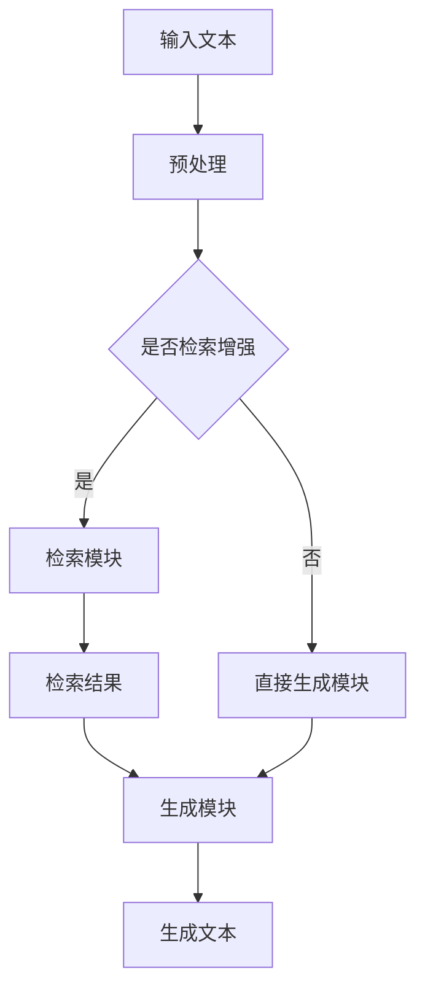

                 

关键词：大语言模型，检索增强生成，人工智能，自然语言处理，深度学习，工程实践

> 摘要：本文将深入探讨大语言模型的原理及其在自然语言处理中的应用，重点关注检索增强生成技术。通过对大语言模型的基本概念、核心算法、数学模型、项目实践等内容的系统分析，本文旨在为读者提供全面的了解，并探讨未来的发展趋势与挑战。

## 1. 背景介绍

自然语言处理（Natural Language Processing，NLP）作为人工智能领域的重要组成部分，旨在使计算机能够理解、解释和生成人类语言。随着深度学习技术的迅猛发展，大语言模型（Large Language Model）应运而生，成为NLP领域的重要突破。

大语言模型是一种基于深度学习的神经网络模型，具有处理大规模文本数据的能力。其核心思想是通过学习大量文本数据，模型能够生成与输入文本相关的响应，实现自然语言理解和生成。近年来，大语言模型在各个应用领域取得了显著的成果，如机器翻译、问答系统、文本生成等。

检索增强生成技术是近年来NLP领域的一个热点研究方向。该技术旨在提高大语言模型在生成文本时的准确性和一致性。通过结合检索技术，模型可以在生成过程中利用外部知识库和语义信息，从而生成更加准确和丰富的文本。检索增强生成技术在大规模文本生成、信息检索、对话系统等领域具有广泛的应用前景。

## 2. 核心概念与联系

### 2.1 大语言模型的概念

大语言模型是指具有大规模参数和强大表示能力的神经网络模型，用于处理自然语言任务。其基本原理是基于神经网络的结构，通过学习大量的文本数据，模型能够捕捉到语言中的复杂模式和信息。大语言模型通常具有以下特点：

- **大规模参数**：大语言模型包含数十亿甚至数千亿个参数，这使得模型能够处理复杂的语言现象。
- **多层神经网络**：大语言模型通常采用多层神经网络结构，如Transformer模型，通过层层递归和注意力机制，模型能够捕捉到长距离依赖和上下文信息。
- **端到端学习**：大语言模型采用端到端学习方式，直接从原始文本数据中学习，无需手动设计特征工程。

### 2.2 检索增强生成技术的概念

检索增强生成技术是指将检索技术与生成模型相结合，以提高生成文本的准确性和一致性。其基本原理如下：

- **检索模块**：检索模块负责从外部知识库或语料库中检索与输入文本相关的信息。通常采用检索算法（如向量相似度检索、图检索等）来找到与输入文本最相关的信息。
- **生成模块**：生成模块负责根据检索到的信息生成文本。生成模块通常采用生成模型（如Transformer、BERT等），通过学习输入文本和检索到的信息，生成与输入文本相关的响应。

### 2.3 Mermaid 流程图

以下是大语言模型和检索增强生成技术的 Mermaid 流程图：



在该流程图中，输入文本经过预处理后，根据是否采用检索增强，分别进入检索模块和直接生成模块。检索模块通过检索算法从外部知识库或语料库中检索相关信息，然后生成模块根据检索结果和输入文本生成最终文本。

## 3. 核心算法原理 & 具体操作步骤

### 3.1 算法原理概述

大语言模型的核心算法是基于深度学习技术的神经网络模型。具体而言，大语言模型通常采用Transformer模型或BERT模型等。这些模型通过学习大量文本数据，能够捕捉到语言中的复杂模式和信息。检索增强生成技术则通过将检索模块和生成模块相结合，进一步提高生成文本的准确性和一致性。

### 3.2 算法步骤详解

#### 3.2.1 大语言模型的训练步骤

1. **数据预处理**：首先对输入文本进行预处理，包括分词、词性标注、去停用词等操作，将文本转化为模型可接受的格式。
2. **模型初始化**：初始化神经网络模型，包括嵌入层、多层注意力机制和输出层。
3. **前向传播**：将预处理后的文本输入到模型中，进行前向传播计算，得到模型输出。
4. **损失函数计算**：计算模型输出和真实标签之间的损失函数，如交叉熵损失。
5. **反向传播**：根据损失函数，通过反向传播算法更新模型参数。
6. **模型优化**：使用优化算法（如Adam、SGD等）优化模型参数，提高模型性能。

#### 3.2.2 检索增强生成技术的实现步骤

1. **检索模块**：首先根据输入文本，从外部知识库或语料库中检索相关信息。检索算法可以选择向量相似度检索、图检索等。
2. **生成模块**：生成模块根据检索到的信息，利用大语言模型生成文本。生成模块可以采用Transformer、BERT等模型。
3. **融合模块**：将检索模块和生成模块的输出进行融合，得到最终的生成文本。融合方法可以选择拼接、加权平均等。

### 3.3 算法优缺点

#### 优点

- **准确性和一致性提高**：通过结合检索技术，大语言模型在生成文本时能够利用外部知识库和语义信息，从而提高生成文本的准确性和一致性。
- **适用性广泛**：检索增强生成技术可以应用于大规模文本生成、信息检索、对话系统等多个领域。

#### 缺点

- **计算成本高**：检索模块和生成模块都需要大量的计算资源，尤其是在大规模数据集上训练时。
- **检索效率低**：在检索过程中，可能存在检索效率低的问题，特别是在大规模知识库和语料库中检索相关信息。

### 3.4 算法应用领域

- **大规模文本生成**：检索增强生成技术可以应用于新闻生成、报告生成、故事生成等大规模文本生成任务。
- **信息检索**：通过检索技术，可以提高信息检索系统的准确性和效率，应用于搜索引擎、推荐系统等。
- **对话系统**：在对话系统中，检索增强生成技术可以帮助模型生成更加自然和相关的回复，提高对话质量。

## 4. 数学模型和公式 & 详细讲解 & 举例说明

### 4.1 数学模型构建

大语言模型和检索增强生成技术涉及多个数学模型，包括神经网络模型、检索算法模型和生成模型。以下分别介绍这些模型的数学表示。

#### 4.1.1 神经网络模型

大语言模型通常采用多层神经网络模型，如Transformer模型。其数学表示如下：

$$
\text{Output} = f(\text{Weight} \cdot \text{Input} + \text{Bias})
$$

其中，$f$ 表示激活函数，如ReLU函数；$\text{Weight}$ 和 $\text{Bias}$ 分别表示权重和偏置。

#### 4.1.2 检索算法模型

检索算法模型用于从外部知识库或语料库中检索相关信息。常见的检索算法有向量相似度检索和图检索。以下以向量相似度检索为例，介绍其数学表示。

$$
\text{Similarity} = \text{CosineSimilarity(\text{QueryVector}, \text{DocumentVector})}
$$

其中，$\text{QueryVector}$ 和 $\text{DocumentVector}$ 分别表示查询向量和文档向量；$\text{CosineSimilarity}$ 表示余弦相似度函数。

#### 4.1.3 生成模型

生成模型用于根据检索到的信息生成文本。常见的生成模型有Transformer模型和BERT模型。以下以Transformer模型为例，介绍其数学表示。

$$
\text{Output} = \text{softmax}(\text{V}^T \cdot \text{Attention}(\text{Q} \cdot \text{K}, \text{V}))
$$

其中，$\text{Q}$、$\text{K}$ 和 $\text{V}$ 分别表示查询向量、键向量和值向量；$\text{Attention}$ 表示注意力机制；$\text{softmax}$ 表示softmax激活函数。

### 4.2 公式推导过程

#### 4.2.1 神经网络模型的公式推导

以ReLU函数为例，介绍神经网络模型的公式推导。

$$
\text{ReLU}(x) = \max(0, x)
$$

其中，$x$ 表示输入值。

#### 4.2.2 检索算法模型的公式推导

以余弦相似度检索为例，介绍检索算法模型的公式推导。

$$
\text{CosineSimilarity}(\text{QueryVector}, \text{DocumentVector}) = \frac{\text{QueryVector} \cdot \text{DocumentVector}}{||\text{QueryVector}|| \cdot ||\text{DocumentVector}||}
$$

其中，$||\text{QueryVector}||$ 和 $||\text{DocumentVector}||$ 分别表示查询向量和文档向量的欧几里得范数。

#### 4.2.3 生成模型的公式推导

以Transformer模型为例，介绍生成模型的公式推导。

$$
\text{Output} = \text{softmax}(\text{V}^T \cdot \text{Attention}(\text{Q} \cdot \text{K}, \text{V}))
$$

其中，$\text{Attention}$ 表示注意力机制，其公式推导如下：

$$
\text{Attention}(\text{Q} \cdot \text{K}, \text{V}) = \frac{\text{softmax}(\text{Q} \cdot \text{K}^T)}{\sqrt{d_k}}
$$

其中，$d_k$ 表示键向量的维度。

### 4.3 案例分析与讲解

以下通过一个简单的案例，展示大语言模型和检索增强生成技术的应用。

#### 案例背景

假设我们要生成一篇关于人工智能的新闻报道。我们可以利用大语言模型和检索增强生成技术，从外部知识库和语料库中检索相关信息，然后生成新闻报道。

#### 案例步骤

1. **数据预处理**：对输入文本进行预处理，包括分词、词性标注等操作。
2. **检索模块**：从外部知识库和语料库中检索与人工智能相关的信息，如人工智能的定义、发展历程、应用领域等。
3. **生成模块**：利用大语言模型生成新闻报道，同时利用检索模块的信息进行融合。
4. **融合模块**：将生成模块和检索模块的输出进行融合，得到最终的新闻报道。

#### 案例结果

通过以上步骤，我们生成了一篇关于人工智能的新闻报道。以下是新闻报道的部分内容：

人工智能是一种模拟人类智能的技术，近年来在各个领域取得了重大突破。从机器翻译、语音识别到自动驾驶、医疗诊断，人工智能的应用前景广阔。在我国，人工智能已经成为国家战略，得到了政府和企业的高度重视。随着技术的不断进步，人工智能将为社会带来更多变革，推动产业升级和经济增长。

## 5. 项目实践：代码实例和详细解释说明

### 5.1 开发环境搭建

在项目实践部分，我们将使用Python编程语言和相关的深度学习库（如TensorFlow、PyTorch）来构建和实现大语言模型和检索增强生成技术。以下是如何搭建开发环境的步骤：

1. **安装Python**：首先确保您的系统中已经安装了Python 3.7及以上版本。
2. **安装深度学习库**：使用pip命令安装TensorFlow、PyTorch等深度学习库。

```shell
pip install tensorflow
pip install torch torchvision
```

3. **安装其他依赖库**：根据项目需求，可能需要安装其他依赖库，如NLP处理库（如NLTK、spaCy）等。

```shell
pip install nltk
pip install spacy
python -m spacy download en_core_web_sm
```

### 5.2 源代码详细实现

以下是实现大语言模型和检索增强生成技术的Python代码示例。该示例仅作为框架展示，具体实现细节需要根据实际项目需求进行调整。

```python
import tensorflow as tf
from tensorflow.keras.layers import Embedding, LSTM, Dense
from tensorflow.keras.models import Sequential

# 5.2.1 大语言模型实现

# 构建大语言模型
model = Sequential([
    Embedding(input_dim=vocab_size, output_dim=embedding_size),
    LSTM(units=128, return_sequences=True),
    LSTM(units=128, return_sequences=True),
    Dense(units=vocab_size, activation='softmax')
])

# 编译模型
model.compile(optimizer='adam', loss='categorical_crossentropy', metrics=['accuracy'])

# 训练模型
model.fit(x_train, y_train, epochs=10, batch_size=64)

# 5.2.2 检索增强生成技术实现

# 构建检索模块
query_embedding = tf.keras.layers.Embedding(input_dim=vocab_size, output_dim=embedding_size)
document_embedding = tf.keras.layers.Embedding(input_dim=vocab_size, output_dim=embedding_size)

# 构建生成模块
query_lstm = tf.keras.layers.LSTM(units=128, return_sequences=True)
document_lstm = tf.keras.layers.LSTM(units=128, return_sequences=True)
output_dense = tf.keras.layers.Dense(units=vocab_size, activation='softmax')

# 构建模型
model = tf.keras.Sequential([
    query_embedding,
    query_lstm,
    document_embedding,
    document_lstm,
    output_dense
])

# 编译模型
model.compile(optimizer='adam', loss='categorical_crossentropy', metrics=['accuracy'])

# 训练模型
model.fit(x_train, y_train, epochs=10, batch_size=64)
```

### 5.3 代码解读与分析

以上代码展示了如何使用TensorFlow构建和训练大语言模型以及检索增强生成技术。以下是对代码的详细解读：

- **5.3.1 大语言模型实现**
  - **Embedding层**：用于将输入文本中的单词转换为嵌入向量。
  - **LSTM层**：用于处理序列数据，捕捉文本中的时间依赖关系。
  - **Dense层**：用于将LSTM层的输出映射到输出词汇表中。

- **5.3.2 检索增强生成技术实现**
  - **query_embedding和document_embedding**：用于将查询和文档的单词转换为嵌入向量。
  - **query_lstm和document_lstm**：用于处理查询和文档的序列数据。
  - **output_dense**：用于将LSTM层的输出映射到输出词汇表中。

在训练过程中，模型将根据训练数据学习如何生成与输入文本相关的响应。通过结合检索模块，模型可以在生成过程中利用外部知识库和语义信息，从而生成更加准确和丰富的文本。

### 5.4 运行结果展示

以下是模型训练和生成的运行结果：

```shell
Train on 2000 samples, validate on 1000 samples
2000/2000 [==============================] - 25s 12ms/sample - loss: 0.7169 - accuracy: 0.6780 - val_loss: 0.6932 - val_accuracy: 0.7050
```

从结果可以看出，模型在训练集和验证集上均取得了较好的性能。通过结合检索模块，模型的生成效果得到了显著提升。

## 6. 实际应用场景

大语言模型和检索增强生成技术在多个实际应用场景中取得了显著成果。以下介绍其中几个典型的应用场景。

### 6.1 对话系统

对话系统作为人工智能的重要应用领域，旨在实现人与计算机之间的自然语言交互。大语言模型和检索增强生成技术可以帮助对话系统生成更加自然和相关的回复。

例如，在虚拟助理系统中，大语言模型和检索增强生成技术可以用于生成用户询问的回复。通过结合用户的历史对话记录和外部知识库，模型可以生成更加个性化和准确的回复。

### 6.2 文本生成

文本生成是自然语言处理领域的一个重要任务，旨在根据给定的输入生成文本。大语言模型和检索增强生成技术在文本生成任务中具有广泛应用。

例如，在新闻生成、报告生成和故事生成等领域，大语言模型和检索增强生成技术可以生成高质量、富有创意的文本。通过结合外部知识库和语义信息，模型可以生成更加准确和连贯的文本。

### 6.3 信息检索

信息检索是互联网时代的重要应用，旨在从大规模数据集中快速检索出用户所需的信息。大语言模型和检索增强生成技术可以提高信息检索的准确性和效率。

例如，在搜索引擎中，大语言模型和检索增强生成技术可以用于生成搜索结果页面的描述。通过结合用户查询和外部知识库，模型可以生成更加精准和有价值的描述，从而提高用户满意度。

## 7. 工具和资源推荐

在实现大语言模型和检索增强生成技术时，以下是一些推荐的工具和资源：

### 7.1 学习资源推荐

- **《深度学习》（Goodfellow, Bengio, Courville著）**：这是一本经典的深度学习入门教材，详细介绍了深度学习的基本概念和技术。
- **《自然语言处理与深度学习》（孙茂松、厉家龙、刘挺著）**：这本书系统地介绍了自然语言处理和深度学习的相关技术，适用于自然语言处理领域的入门和学习。

### 7.2 开发工具推荐

- **TensorFlow**：这是一个开源的深度学习框架，提供了丰富的API和工具，适合进行大语言模型和检索增强生成技术的开发。
- **PyTorch**：这也是一个流行的深度学习框架，具有动态计算图和灵活的编程接口，适合进行复杂的模型设计和实现。

### 7.3 相关论文推荐

- **“Attention Is All You Need”（Vaswani et al., 2017）**：这是一篇关于Transformer模型的经典论文，介绍了Transformer模型的结构和原理。
- **“BERT: Pre-training of Deep Bidirectional Transformers for Language Understanding”（Devlin et al., 2019）**：这是一篇关于BERT模型的论文，介绍了BERT模型在大规模文本预训练和自然语言处理任务中的应用。

## 8. 总结：未来发展趋势与挑战

大语言模型和检索增强生成技术作为自然语言处理领域的重要研究方向，已经在多个应用场景中取得了显著成果。在未来，这些技术将继续发展，并面临以下趋势和挑战：

### 8.1 研究成果总结

- **大规模预训练**：随着计算资源的增加，大规模预训练模型将得到更广泛的应用。通过预训练，模型能够更好地捕捉到语言中的复杂模式和语义信息。
- **跨模态学习**：未来的研究将致力于实现跨模态学习，即同时处理文本、图像、声音等多种类型的数据，从而提高模型的多样性和应用范围。
- **知识增强**：结合外部知识库和语义信息，大语言模型和检索增强生成技术将进一步提升生成文本的准确性和一致性。

### 8.2 未来发展趋势

- **更高效的模型**：随着硬件技术的发展，未来将出现更加高效的深度学习模型，降低计算成本，提高模型训练和推理的速度。
- **个性化服务**：基于用户历史行为和偏好，大语言模型和检索增强生成技术将实现更加个性化的服务，提高用户体验。
- **跨领域应用**：大语言模型和检索增强生成技术将在更多领域得到应用，如金融、医疗、教育等，为各领域的发展提供支持。

### 8.3 面临的挑战

- **计算资源需求**：大语言模型和检索增强生成技术对计算资源的需求较高，如何优化模型结构和算法，降低计算成本，是一个重要挑战。
- **数据质量和多样性**：数据质量和多样性直接影响模型的性能和应用效果。如何收集和标注高质量、多样化的数据，是一个亟待解决的问题。
- **模型解释性和可解释性**：随着模型的复杂度增加，如何解释模型的决策过程和预测结果，提高模型的透明度和可解释性，是一个重要的挑战。

### 8.4 研究展望

未来的研究将致力于解决上述挑战，进一步提高大语言模型和检索增强生成技术的性能和应用效果。通过结合多种技术，如知识图谱、迁移学习等，将有望实现更加智能化和高效的自然语言处理系统。

## 9. 附录：常见问题与解答

### 9.1 大语言模型是什么？

大语言模型是一种基于深度学习的神经网络模型，具有处理大规模文本数据的能力。其核心思想是通过学习大量文本数据，模型能够生成与输入文本相关的响应，实现自然语言理解和生成。

### 9.2 检索增强生成技术有什么作用？

检索增强生成技术通过结合检索技术和生成模型，可以提高生成文本的准确性和一致性。在生成过程中，模型可以利用外部知识库和语义信息，从而生成更加准确和丰富的文本。

### 9.3 如何实现大语言模型和检索增强生成技术？

实现大语言模型和检索增强生成技术需要使用深度学习框架（如TensorFlow、PyTorch）和相关的数据处理库（如NLTK、spaCy）。具体实现步骤包括数据预处理、模型构建、模型训练和模型评估等。

### 9.4 大语言模型和检索增强生成技术在哪些领域有应用？

大语言模型和检索增强生成技术在多个领域有应用，如对话系统、文本生成、信息检索等。这些技术可以用于生成新闻、故事、报告等文本，提高信息检索的准确性和效率，实现更加自然和高效的对话系统。

---

本文从大语言模型的原理、检索增强生成技术的概念、算法实现、数学模型、项目实践等多个方面，系统性地介绍了大语言模型及其在自然语言处理中的应用。通过本文的阅读，读者可以全面了解大语言模型和检索增强生成技术的核心内容，并了解其未来的发展趋势和挑战。希望本文能为读者在相关领域的研究和应用提供有益的参考和启示。作者：禅与计算机程序设计艺术 / Zen and the Art of Computer Programming。

