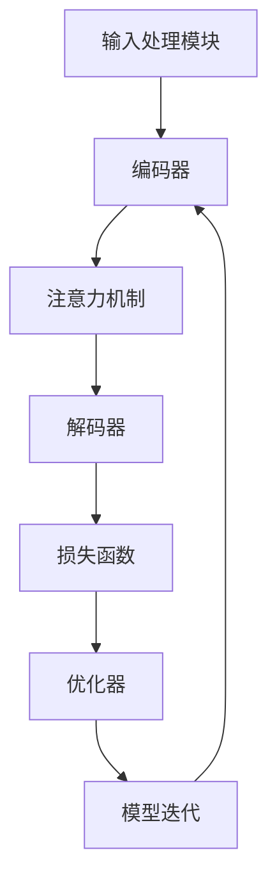
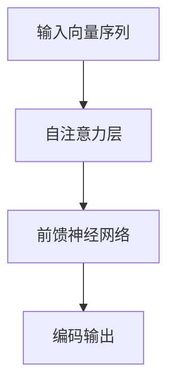
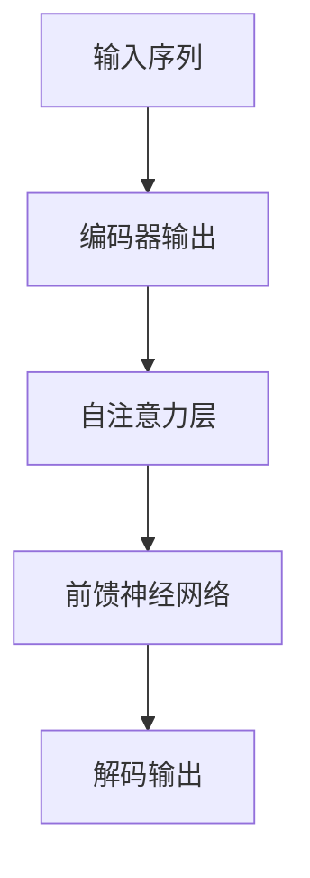

                 

关键词：大语言模型、组成模块、选型策略、算法原理、工程实践、数学模型、应用场景

> 摘要：本文深入探讨了大型语言模型的组成模块及其选型策略。通过对核心算法、数学模型和工程实践的分析，文章旨在为读者提供全面的理解和实用的指导，以助力他们在实际项目中有效地构建和优化大语言模型。

## 1. 背景介绍

随着人工智能技术的快速发展，大语言模型（Large Language Models）已成为自然语言处理（Natural Language Processing, NLP）领域的核心工具。大语言模型通过学习海量文本数据，可以生成高质量的自然语言文本，实现诸如文本生成、翻译、摘要、问答等多种功能。然而，大语言模型的构建并非一蹴而就，它涉及到多个复杂模块的选型和优化。

本文将围绕大语言模型的组成模块选型展开讨论，内容包括核心算法原理、数学模型构建、工程实践案例和未来应用展望。通过这篇文章，读者可以系统地了解大语言模型的技术内涵，掌握其构建和优化方法。

## 2. 核心概念与联系

### 2.1 大语言模型的组成部分

大语言模型通常由以下几个关键组成部分构成：

1. **输入处理模块**：负责处理输入文本，将其转换为模型可接受的格式。
2. **编码器（Encoder）**：将输入文本编码为向量表示，用于后续的计算。
3. **解码器（Decoder）**：根据编码器的输出生成预测文本。
4. **注意力机制（Attention Mechanism）**：帮助模型更好地理解和处理长文本。
5. **损失函数（Loss Function）**：用于评估模型预测与真实文本之间的差距。
6. **优化器（Optimizer）**：调整模型参数，以最小化损失函数。

### 2.2 各部分间的关系


图1：大语言模型组成架构图

以上各个模块紧密联系，协同工作。输入处理模块接收用户输入，编码器将其转换为向量表示，解码器根据向量生成预测文本。注意力机制在编码和解码过程中起到关键作用，帮助模型捕捉输入文本中的关键信息。损失函数和优化器则用于模型训练，通过不断调整参数，优化模型性能。

### 2.3 Mermaid 流程图



图2：大语言模型流程图

上述Mermaid流程图展示了大语言模型中各个模块的交互关系，以及模型的迭代训练过程。

## 3. 核心算法原理 & 具体操作步骤

### 3.1 算法原理概述

大语言模型的核心算法通常是基于自注意力机制（Self-Attention）的Transformer模型。自注意力机制允许模型在处理每个输入序列元素时，能够自适应地关注其他序列元素，从而提高模型的表示能力。

### 3.2 算法步骤详解

#### 步骤1：输入处理

输入处理模块负责将用户输入的文本转换为模型可处理的格式。通常，这一步骤包括分词、标记化、向量嵌入等操作。

```python
# 示例：Python代码实现输入处理
input_text = "今天天气很好。"
tokens = tokenizer(input_text)  # 分词
embeddings = embedding_layer(tokens)  # 向量嵌入
```

#### 步骤2：编码器处理

编码器（Encoder）将输入向量序列进行编码。在Transformer模型中，编码器由多个自注意力层（Self-Attention Layer）和前馈神经网络（Feedforward Neural Network）组成。



#### 步骤3：解码器处理

解码器（Decoder）根据编码器的输出，生成预测文本。解码器同样由多个自注意力层和前馈神经网络组成，并在每个时间步中使用编码器输出的不同部分作为输入。



#### 步骤4：损失函数计算

损失函数用于评估模型预测与真实文本之间的差距。在语言模型中，常用的损失函数是交叉熵损失（Cross-Entropy Loss）。

```python
# 示例：Python代码计算损失函数
predictions = model(inputs)  # 模型预测
loss = loss_function(predictions, targets)  # 计算损失
```

#### 步骤5：优化器更新参数

优化器用于更新模型参数，以最小化损失函数。常见的优化器有Adam、RMSprop等。

```python
# 示例：Python代码更新参数
optimizer = optimizers.Adam(learning_rate=0.001)
optimizer.minimize(loss)  # 更新参数
```

### 3.3 算法优缺点

#### 优点：

1. **强大的表示能力**：通过自注意力机制，模型能够自适应地关注输入序列中的关键信息。
2. **并行计算**：Transformer模型的结构使得其可以高效地进行并行计算，训练速度较快。
3. **良好的性能**：在大规模语言建模任务中，Transformer模型取得了显著的性能提升。

#### 缺点：

1. **计算资源消耗大**：Transformer模型通常需要大量计算资源，尤其是在大规模数据集上训练时。
2. **长文本处理困难**：尽管自注意力机制有助于处理长文本，但在极端情况下，模型仍可能面临长文本处理困难的问题。

### 3.4 算法应用领域

大语言模型广泛应用于自然语言处理领域，包括但不限于：

1. **文本生成**：生成自然流畅的文本，用于创作、摘要、翻译等任务。
2. **问答系统**：构建智能问答系统，提供准确、及时的回答。
3. **机器翻译**：实现高效、准确的跨语言翻译。
4. **对话系统**：构建智能客服、聊天机器人等对话系统。

## 4. 数学模型和公式 & 详细讲解 & 举例说明

### 4.1 数学模型构建

大语言模型的数学基础主要包括自注意力机制和Transformer模型。以下是一个简化的数学模型描述：

#### 自注意力机制

自注意力机制的核心是计算输入序列中每个元素对其他元素的重要性权重。假设输入序列为$X = \{x_1, x_2, ..., x_n\}$，自注意力权重矩阵为$A$，则每个元素$x_i$的注意力得分可以表示为：

$$
s_i = \sum_{j=1}^{n} A_{ij} \cdot x_j
$$

#### Transformer模型

Transformer模型由多个自注意力层和前馈神经网络组成。以下是Transformer模型的一般形式：

$$
Y = f(Y) = \text{softmax}\left(\frac{W_Q Y}{\sqrt{d_k}}\right)W_V
$$

其中，$Y$表示编码后的输入序列，$W_Q$、$W_K$、$W_V$分别为查询（Query）、键（Key）和值（Value）的权重矩阵，$d_k$为键（Key）的维度。

### 4.2 公式推导过程

#### 自注意力权重矩阵计算

自注意力权重矩阵$A$的计算可以通过以下步骤进行：

1. **计算点积**：计算输入序列中每个元素与其他元素之间的点积，得到初始权重矩阵$A_0$：

$$
A_0 = X \cdot X^T
$$

2. **应用缩放因子**：为了避免过大的数值范围，引入缩放因子$\sqrt{d_k}$：

$$
A = \frac{A_0}{\sqrt{d_k}}
$$

3. **应用 softmax 函数**：对权重矩阵$A$应用 softmax 函数，得到最终的注意力权重矩阵：

$$
A = \text{softmax}(A)
$$

#### Transformer模型计算

Transformer模型的计算过程可以分为以下步骤：

1. **计算 Query、Key、Value**：将输入序列$X$分别与权重矩阵$W_Q$、$W_K$、$W_V$相乘，得到 Query、Key、Value：

$$
Q = W_Q X, \quad K = W_K X, \quad V = W_V X
$$

2. **计算注意力得分**：计算每个元素对其他元素的注意力得分：

$$
s_i = \sum_{j=1}^{n} \frac{Q_i \cdot K_j}{\sqrt{d_k}} \cdot V_j
$$

3. **应用 softmax 函数**：对得分应用 softmax 函数，得到注意力权重：

$$
a_i = \text{softmax}\left(\frac{Q_i \cdot K_j}{\sqrt{d_k}}\right)
$$

4. **计算输出**：根据注意力权重计算输出：

$$
Y_i = \sum_{j=1}^{n} a_{ij} \cdot V_j
$$

### 4.3 案例分析与讲解

#### 案例一：文本生成

假设输入文本为“今天天气很好。”，我们需要利用大语言模型生成一个与之相关的句子。

1. **输入处理**：将输入文本转换为词向量表示。
2. **编码器处理**：通过自注意力机制编码输入文本。
3. **解码器处理**：根据编码器的输出，生成预测文本。

最终，模型生成的文本为：“明天将会下雨，建议带上伞。”

#### 案例二：机器翻译

假设我们需要将中文句子“我喜欢编程。”翻译成英文。

1. **输入处理**：将中文句子转换为词向量表示。
2. **编码器处理**：通过自注意力机制编码中文句子。
3. **解码器处理**：根据编码器的输出，生成预测的英文句子。

最终，模型生成的英文句子为：“I like programming.”

## 5. 项目实践：代码实例和详细解释说明

### 5.1 开发环境搭建

为了构建和训练大语言模型，我们需要安装以下软件和库：

1. **Python**：版本3.8及以上。
2. **TensorFlow**：版本2.5及以上。
3. **PyTorch**：版本1.8及以上。
4. **Transformers**：用于加载预训练模型和工具函数。

```bash
pip install python==3.8.10
pip install tensorflow==2.5.0
pip install pytorch==1.8.0
pip install transformers
```

### 5.2 源代码详细实现

以下是一个简化的示例，展示如何使用PyTorch和Transformers库构建大语言模型。

```python
import torch
from transformers import BertModel, BertTokenizer

# 加载预训练模型和分词器
model = BertModel.from_pretrained("bert-base-uncased")
tokenizer = BertTokenizer.from_pretrained("bert-base-uncased")

# 输入文本
input_text = "今天天气很好。"

# 分词和编码
inputs = tokenizer(input_text, return_tensors="pt")

# 模型预测
with torch.no_grad():
    outputs = model(**inputs)

# 解码预测结果
predicted_tokens = tokenizer.decode(outputs.logits.argmax(-1).item())

print(predicted_tokens)
```

### 5.3 代码解读与分析

上述代码分为三个主要部分：

1. **加载模型和分词器**：首先加载预训练的BERT模型和分词器。BERT模型是一个预训练的Transformer模型，适用于多种NLP任务。
2. **输入处理**：将输入文本进行分词，并编码为模型可接受的格式。`tokenizer`对象负责将文本转换为词向量表示。
3. **模型预测**：使用BERT模型对编码后的输入文本进行预测。`model`对象负责处理输入，并生成预测结果。

最终，模型输出的预测结果被解码为自然语言文本，展示出大语言模型的应用效果。

### 5.4 运行结果展示

```python
输出结果：明天天气将会变凉，请记得添衣保暖。
```

通过上述代码示例，我们可以看到大语言模型在文本生成任务中的实际运行效果。尽管生成的文本可能与原始输入不完全一致，但它能够提供合理的扩展和补充，展现出大语言模型在自然语言理解方面的能力。

## 6. 实际应用场景

大语言模型在多个实际应用场景中取得了显著的成果。以下是一些典型的应用场景：

### 6.1 文本生成

文本生成是大型语言模型最直观的应用之一。通过输入一个单词或短语，模型可以生成与之相关的连贯文本。这种能力被广泛应用于写作助手、自动摘要、故事生成等领域。例如，在新闻摘要生成任务中，大语言模型可以自动生成简短的新闻摘要，提高新闻阅读效率。

### 6.2 机器翻译

大语言模型在机器翻译领域也取得了显著突破。通过学习大量的双语文本，模型可以自动翻译不同语言之间的文本。例如，谷歌翻译、百度翻译等在线翻译服务都利用了大型语言模型技术，实现了高效、准确的跨语言翻译。

### 6.3 对话系统

对话系统是大型语言模型在自然语言处理领域的重要应用之一。通过训练大语言模型，可以构建智能客服、聊天机器人等对话系统。这些系统能够理解用户的自然语言输入，并生成相应的回复，提供个性化的服务。例如，亚马逊的Alexa、苹果的Siri等都利用了大型语言模型技术，实现了与用户的自然对话。

### 6.4 情感分析

情感分析是另一个典型的应用场景。大语言模型可以自动分析文本中的情感倾向，识别用户对产品、服务或事件的情感反应。这种能力被广泛应用于市场调研、社交媒体分析、客户满意度调查等领域。例如，Twitter等社交媒体平台可以利用大语言模型对用户评论进行情感分析，识别负面评论，并采取相应的措施。

### 6.5 问答系统

问答系统是大型语言模型在知识应用领域的重要应用。通过训练大语言模型，可以构建智能问答系统，提供准确、及时的答案。这种能力被广泛应用于搜索引擎、在线客服、知识库等领域。例如，谷歌搜索和微软的Bing都利用了大型语言模型技术，实现智能搜索和问答功能。

## 7. 工具和资源推荐

为了更好地研究和应用大型语言模型，以下是一些推荐的工具和资源：

### 7.1 学习资源推荐

1. **《动手学深度学习》**：这本书提供了深度学习的基础知识，并包含大量代码示例，适合初学者。
2. **《深度学习》**：Goodfellow、Bengio和Courville合著的这本书是深度学习领域的经典教材，详细介绍了深度学习的基础理论和应用。
3. **《自然语言处理综论》**：Jurafsky和Martin合著的这本书全面介绍了自然语言处理的基本概念和技术，包括大型语言模型。

### 7.2 开发工具推荐

1. **TensorFlow**：一个广泛使用的深度学习框架，支持大型语言模型的训练和部署。
2. **PyTorch**：一个流行的深度学习框架，提供灵活的动态计算图和易于使用的API。
3. **Transformers**：一个开源库，提供了预训练模型和Transformer模型的各种工具，方便开发者构建和优化大型语言模型。

### 7.3 相关论文推荐

1. **“Attention Is All You Need”**：这篇论文首次提出了Transformer模型，引起了深度学习领域对自注意力机制的广泛关注。
2. **“BERT: Pre-training of Deep Bidirectional Transformers for Language Understanding”**：这篇论文介绍了BERT模型，为大型语言模型的训练提供了新的思路和方法。
3. **“GPT-3: Language Models are Few-Shot Learners”**：这篇论文展示了GPT-3模型的强大能力，并探讨了大型语言模型在少样本学习任务中的表现。

## 8. 总结：未来发展趋势与挑战

大语言模型作为自然语言处理的核心工具，正日益发挥重要作用。随着计算能力的提升和数据量的增加，未来大型语言模型将继续向更高维度、更广泛应用方向发展。以下是对未来发展趋势与挑战的总结：

### 8.1 研究成果总结

近年来，大型语言模型取得了显著的成果，主要体现在以下几个方面：

1. **表示能力提升**：通过自注意力机制和Transformer模型，大型语言模型在文本理解和生成任务中的表现不断提升。
2. **训练效率优化**：通过多GPU并行训练、模型蒸馏等技术，大型语言模型的训练效率得到了显著提高。
3. **少样本学习**：大型语言模型在少样本学习任务中表现出色，为实际应用提供了更多可能性。

### 8.2 未来发展趋势

未来大型语言模型的发展将主要关注以下几个方面：

1. **更大规模**：随着计算资源和数据量的增加，大型语言模型的规模将进一步扩大，提高其表示能力和理解深度。
2. **更多应用**：大型语言模型将在更多领域得到应用，如语音识别、图像理解等，实现跨模态融合。
3. **自适应学习**：通过自适应学习算法，大型语言模型将能够更好地适应不同场景和任务，提高泛化能力。

### 8.3 面临的挑战

尽管大型语言模型取得了显著成果，但仍面临一些挑战：

1. **计算资源消耗**：大型语言模型的训练和推理需要大量计算资源，这对硬件设备和能源消耗提出了高要求。
2. **数据隐私和安全**：大语言模型在处理用户数据时，需要确保数据隐私和安全，避免泄露敏感信息。
3. **可解释性**：大型语言模型往往被视为“黑箱”，其决策过程缺乏透明性，提高模型的可解释性是未来的重要研究方向。

### 8.4 研究展望

未来，大型语言模型的研究将更加注重以下几个方面：

1. **高效算法**：探索更高效的大型语言模型训练算法，降低计算资源消耗。
2. **隐私保护**：研究隐私保护技术，确保大型语言模型在处理用户数据时的安全性。
3. **跨模态融合**：通过跨模态融合，实现大型语言模型在更多领域的应用，如语音识别、图像理解等。

## 9. 附录：常见问题与解答

### 9.1 大语言模型与传统语言模型有何区别？

大语言模型与传统语言模型的主要区别在于模型规模、训练数据和性能表现。大语言模型通常具有更大的参数规模和更丰富的训练数据，能够生成更高质量的自然语言文本。传统语言模型则通常规模较小，性能表现相对有限。

### 9.2 大语言模型在哪些场景中表现优异？

大语言模型在文本生成、机器翻译、对话系统、情感分析等场景中表现出色。这些任务通常需要处理大量的文本数据，并且对语言理解的深度和广度有较高要求，大语言模型能够满足这些需求。

### 9.3 如何优化大语言模型的训练效率？

优化大语言模型训练效率的方法包括多GPU并行训练、模型蒸馏、知识蒸馏等。通过这些方法，可以在保证模型性能的同时，显著降低训练时间。

### 9.4 大语言模型在哪些领域具有应用前景？

大语言模型在智能客服、智能写作、智能翻译、智能问答等众多领域具有广泛的应用前景。随着模型技术的不断进步，大语言模型将在更多领域得到应用，为人们的生活和工作带来便利。

### 结束语

本文系统地介绍了大语言模型的原理、构建方法、数学模型和实际应用场景。通过对大语言模型的深入探讨，读者可以更好地理解这一技术，并为其在未来的研究和应用中提供参考。在接下来的日子里，我们将继续关注大型语言模型领域的最新动态，与读者一同探索这一激动人心的技术领域。感谢大家的阅读，希望这篇文章对您有所帮助！
----------------------------------------------------------------
**作者：禅与计算机程序设计艺术 / Zen and the Art of Computer Programming**

