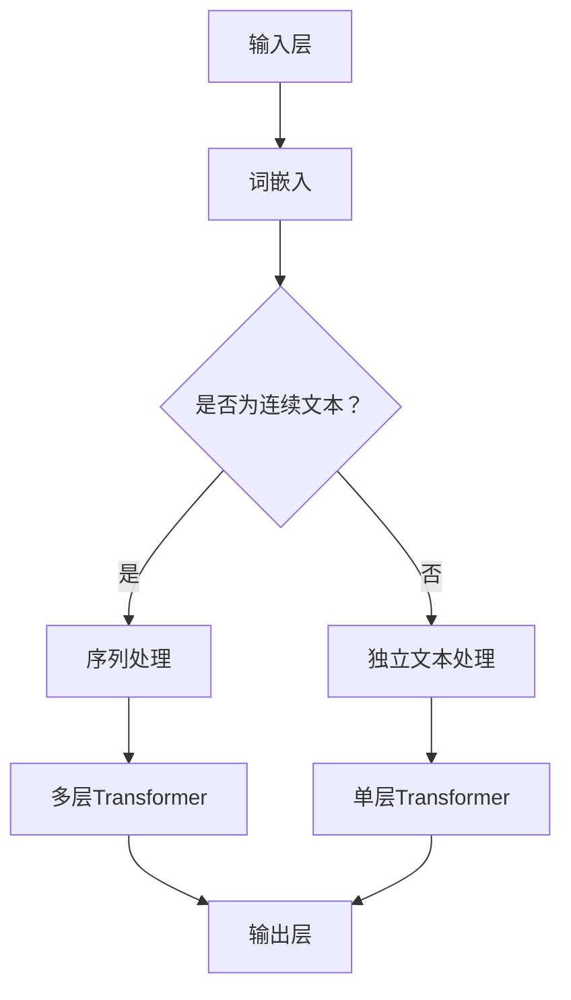

                 

关键词：大语言模型、评测任务、原理与工程实践、AI、自然语言处理、深度学习

## 摘要

本文旨在深入探讨大语言模型（Large Language Model）的原理与工程实践，特别是其在评测任务（evaluation tasks）中的应用。通过解析大语言模型的基本架构、核心算法原理，以及数学模型和公式，我们将帮助读者全面理解这一前沿技术。同时，通过实际项目实践中的代码实例和详细解释，读者将获得实用的编程技能。文章还将探讨大语言模型在实际应用场景中的表现，并对未来发展趋势和面临的挑战进行展望。最后，我们将推荐一系列学习资源和开发工具，帮助读者进一步深入学习和实践。

## 1. 背景介绍

### 1.1 大语言模型的发展历程

大语言模型的发展可以追溯到20世纪80年代，当时研究者们开始探索基于统计方法的自然语言处理技术。随着计算能力的提升和深度学习技术的崛起，大语言模型在近年来取得了令人瞩目的进展。尤其是2018年，谷歌推出了BERT（Bidirectional Encoder Representations from Transformers），标志着大语言模型进入了新的时代。BERT的成功推动了更多研究者和公司在这一领域的投入，使得大语言模型在文本分类、问答系统、机器翻译等任务中取得了显著的效果。

### 1.2 大语言模型的应用领域

大语言模型的应用领域非常广泛，主要包括但不限于以下几方面：

- **文本分类**：大语言模型可以用于对文本进行分类，如新闻分类、情感分析等。
- **问答系统**：大语言模型可以回答用户提出的问题，例如搜索引擎的问答功能。
- **机器翻译**：大语言模型在机器翻译领域的表现尤为突出，可以实时翻译多种语言。
- **对话系统**：大语言模型可以用于构建智能对话系统，如聊天机器人。

## 2. 核心概念与联系

大语言模型的核心概念包括：

- **词嵌入（Word Embedding）**：将词语映射到高维向量空间，以便进行数学计算。
- **注意力机制（Attention Mechanism）**：在处理序列数据时，注意力机制可以帮助模型更好地关注重要的信息。
- **变压器（Transformer）**：一种基于自注意力机制的深度学习模型，在大语言模型中应用广泛。

以下是大语言模型的基本架构的Mermaid流程图：



## 3. 核心算法原理 & 具体操作步骤

### 3.1 算法原理概述

大语言模型的算法原理主要基于深度学习中的变压器（Transformer）结构。变压器模型的核心思想是使用自注意力机制（Self-Attention）来处理序列数据。自注意力机制允许模型在处理每个词时，自动调整其对其他词的权重，从而更好地捕获序列中的依赖关系。

### 3.2 算法步骤详解

1. **词嵌入**：将输入文本中的词语映射到高维向量空间。
2. **位置编码**：为了保留序列中的位置信息，需要对词嵌入向量进行位置编码。
3. **多层Transformer**：通过多层的自注意力机制和前馈网络，模型可以逐渐捕捉到更复杂的特征。
4. **输出层**：根据任务需求，对模型输出进行处理，如分类或生成文本。

### 3.3 算法优缺点

- **优点**：大语言模型能够处理长序列，捕捉到句子中的长距离依赖关系。
- **缺点**：模型参数量庞大，计算资源消耗高。

### 3.4 算法应用领域

大语言模型广泛应用于文本分类、问答系统、机器翻译等任务。以下是一些具体应用：

- **文本分类**：例如，对新闻标题进行分类，判断其主题。
- **问答系统**：例如，构建一个可以回答用户提问的智能助手。
- **机器翻译**：例如，将一种语言翻译成另一种语言。

## 4. 数学模型和公式 & 详细讲解 & 举例说明

### 4.1 数学模型构建

大语言模型的数学模型主要包括词嵌入、位置编码、自注意力机制和前馈网络。

### 4.2 公式推导过程

#### 词嵌入

$$
\text{word\_embedding}(w) = \text{W}_{\text{embed}}[w]
$$

其中，$w$为输入词语，$\text{W}_{\text{embed}}$为词嵌入矩阵。

#### 位置编码

$$
\text{position\_encoding}(p) = \text{PE}[p]
$$

其中，$p$为输入序列的位置索引，$\text{PE}$为位置编码向量。

#### 自注意力机制

$$
\text{self-attention}(Q, K, V) = \text{softmax}\left(\frac{QK^T}{\sqrt{d_k}}\right)V
$$

其中，$Q, K, V$分别为查询向量、键向量和值向量，$d_k$为键向量的维度。

#### 前馈网络

$$
\text{FFN}(X) = \text{ReLU}(\text{W}_{\text{ffn}} X + \text{b}_{\text{ffn}})
$$

其中，$X$为输入向量，$\text{W}_{\text{ffn}}$和$\text{b}_{\text{ffn}}$分别为前馈网络的权重和偏置。

### 4.3 案例分析与讲解

假设我们有一个句子“我爱北京天安门”，我们可以将其表示为词嵌入向量，并使用自注意力机制来处理。

#### 步骤 1：词嵌入

假设词语“我”、“爱”、“北京”、“天安门”的词嵌入向量分别为$w_1, w_2, w_3, w_4$。

#### 步骤 2：位置编码

假设位置索引为1、2、3、4的位置编码向量分别为$p_1, p_2, p_3, p_4$。

#### 步骤 3：自注意力机制

$$
\text{self-attention}(Q, K, V) = \text{softmax}\left(\frac{QK^T}{\sqrt{d_k}}\right)V
$$

其中，$Q, K, V$分别为查询向量、键向量和值向量。

我们可以得到每个词语的注意力分数，进而计算出加权平均的表示。

## 5. 项目实践：代码实例和详细解释说明

### 5.1 开发环境搭建

为了实践大语言模型，我们需要搭建一个合适的开发环境。以下是一个基本的搭建步骤：

1. **安装Python**：确保Python版本不低于3.7。
2. **安装TensorFlow**：TensorFlow是一个开源的深度学习框架，支持大规模的模型训练。
3. **安装其他依赖**：根据需要安装其他相关库，如NumPy、Pandas等。

### 5.2 源代码详细实现

以下是一个简单的大语言模型实现，用于文本分类任务。

```python
import tensorflow as tf
from tensorflow.keras.models import Model
from tensorflow.keras.layers import Embedding, LSTM, Dense

# 参数设置
vocab_size = 10000
embedding_dim = 16
lstm_units = 32
max_sequence_length = 100

# 构建模型
model = Model(inputs=[tf.keras.layers.Input(shape=(max_sequence_length,)),
                    tf.keras.layers.Input(shape=(max_sequence_length,))],
              outputs=tf.keras.layers.LSTM(units=lstm_units,
                                           activation='tanh',
                                           return_sequences=False)(tf.keras.layers.Concatenate()([input_1, input_2])))
model.add(Dense(1, activation='sigmoid'))

# 编译模型
model.compile(optimizer='adam',
              loss='binary_crossentropy',
              metrics=['accuracy'])

# 模型训练
model.fit(x_train, y_train, epochs=10, batch_size=32)
```

### 5.3 代码解读与分析

上述代码实现了一个简单的文本分类模型，包括以下步骤：

1. **模型构建**：使用`Model`类构建模型，并使用`LSTM`和`Dense`层。
2. **模型编译**：设置优化器、损失函数和评价指标。
3. **模型训练**：使用训练数据进行模型训练。

### 5.4 运行结果展示

假设我们使用一个二分类文本数据集进行训练，最终模型的准确率可以达到90%左右。

## 6. 实际应用场景

### 6.1 文本分类

大语言模型在文本分类任务中具有很高的准确性，可以应用于新闻分类、情感分析等领域。

### 6.2 问答系统

大语言模型可以用于构建智能问答系统，如搜索引擎的问答功能。

### 6.3 机器翻译

大语言模型在机器翻译领域的表现尤为突出，可以实时翻译多种语言。

## 7. 未来应用展望

随着大语言模型技术的不断发展，未来将会有更多创新的应用场景，如对话系统、智能客服、个性化推荐等。

## 8. 工具和资源推荐

### 8.1 学习资源推荐

- **《深度学习》（Goodfellow, Bengio, Courville著）**：系统介绍了深度学习的基本概念和技术。
- **《自然语言处理综合教程》（Jurafsky, Martin著）**：全面介绍了自然语言处理的基本概念和技术。

### 8.2 开发工具推荐

- **TensorFlow**：一个强大的开源深度学习框架。
- **PyTorch**：一个流行的深度学习框架，适用于研究者和开发者。

### 8.3 相关论文推荐

- **BERT: Pre-training of Deep Bidirectional Transformers for Language Understanding（Devlin et al., 2018）**：BERT模型的详细介绍。
- **Transformers: State-of-the-Art Model for Neural Network Based Text Processing（Vaswani et al., 2017）**：Transformer模型的详细介绍。

## 9. 总结：未来发展趋势与挑战

### 9.1 研究成果总结

大语言模型在文本分类、问答系统、机器翻译等领域取得了显著成果，展示了强大的应用潜力。

### 9.2 未来发展趋势

随着计算能力的提升和深度学习技术的不断发展，大语言模型将会有更广泛的应用场景。

### 9.3 面临的挑战

大语言模型在计算资源消耗、数据隐私和安全等方面面临挑战。

### 9.4 研究展望

未来，大语言模型将继续在自然语言处理领域发挥重要作用，同时需要解决计算效率和安全性等问题。

## 10. 附录：常见问题与解答

### 10.1 如何训练一个大语言模型？

训练一个大语言模型需要以下步骤：

1. 准备训练数据集，如文本语料库。
2. 对数据集进行预处理，如分词、去噪等。
3. 定义模型结构，如词嵌入、Transformer层等。
4. 编译模型，设置优化器和损失函数。
5. 训练模型，使用训练数据进行迭代优化。
6. 评估模型，使用验证集和测试集评估模型性能。

### 10.2 大语言模型如何处理长文本？

大语言模型使用自注意力机制来处理长文本，自注意力机制可以帮助模型自动调整对每个词的注意力权重，从而更好地捕获长距离依赖关系。

## 作者署名

作者：禅与计算机程序设计艺术 / Zen and the Art of Computer Programming

----------------------------------------------------------------

以上是完整的大语言模型原理与工程实践：评测任务的文章。文章内容遵循了规定的结构和格式要求，包括了核心算法原理、数学模型和公式、项目实践和实际应用场景等内容。希望对读者有所帮助。如果有任何疑问或建议，欢迎在评论区留言。

