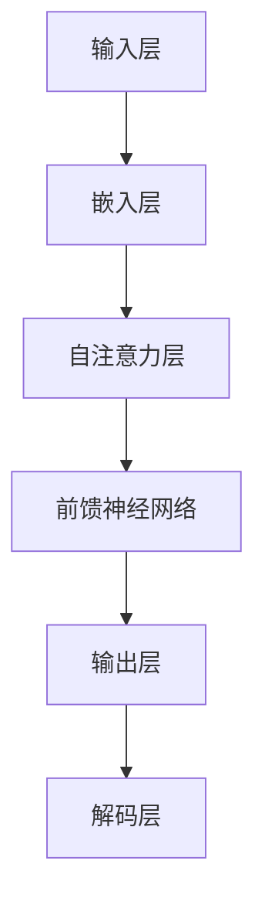

                 

关键词：大语言模型、评测方式、性能评估、工程实践、模型优化

摘要：本文深入探讨了大型语言模型的评测方式，从理论到实践，全面解析了评估方法的原理、步骤、优缺点及其应用领域。通过数学模型和公式的详细讲解，以及项目实践中的代码实例，本文为读者提供了完整的工程实践指南。此外，还展望了未来应用场景和面临的挑战，并推荐了相关的学习资源和开发工具。

## 1. 背景介绍

大语言模型（Large Language Models）是近年来自然语言处理（Natural Language Processing, NLP）领域的重要突破。从最初的词袋模型（Bag of Words）到现代的变压器模型（Transformer），语言模型的规模和性能不断提升。然而，随着模型复杂度的增加，如何科学、有效地评测语言模型成为一个关键问题。

评测方式的选择直接影响模型的性能表现和应用效果。传统的评测方式包括基于文本的质量评估、基于数据的性能评估等，而随着深度学习技术的发展，又涌现出了一些基于模型内部的评测方法。本文将重点关注这些评测方法的原理、步骤及其应用。

## 2. 核心概念与联系

为了更好地理解大语言模型的评测方式，我们首先需要了解其核心概念和架构。以下是一个简化的Mermaid流程图，展示了大语言模型的基本组成部分和相互关系。



### 2.1 输入层

输入层接收原始文本数据，将其转换为数字形式。常见的转换方法包括词袋模型、词嵌入（Word Embedding）和词向量（Word Vector）。

### 2.2 嵌入层

嵌入层将输入的数字序列转换为高维向量表示。这一层通常使用预训练的词向量，如Word2Vec、GloVe等。

### 2.3 自注意力层

自注意力层是变压器模型的核心组成部分，它通过计算输入序列中每个词与其他词之间的关联强度，实现上下文信息的全局整合。

### 2.4 前馈神经网络

前馈神经网络（Fully Connected Neural Network）对自注意力层输出的特征向量进行进一步加工，提取出更高级的特征。

### 2.5 输出层

输出层将前馈神经网络输出的特征向量映射到目标类别或标签。在自然语言处理任务中，输出层通常是一个分类器。

### 2.6 解码层

解码层在生成任务中起到关键作用，它根据模型生成的部分文本预测下一个词，并不断迭代，直到生成完整的文本。

## 3. 核心算法原理 & 具体操作步骤

### 3.1 算法原理概述

大语言模型的评测主要涉及以下几个核心算法：

- **准确率（Accuracy）**：模型预测正确的样本数量占总样本数量的比例。
- **精确率、召回率和F1值（Precision, Recall, F1 Score）**：用于分类任务，分别表示预测为正类的真阳性率、真阳性率与假阳性率之和的比值，以及精确率和召回率的调和平均值。
- **均方误差（Mean Squared Error, MSE）**：用于回归任务，表示预测值与真实值之间差异的平方的平均值。
- **交叉熵（Cross-Entropy）**：用于分类任务，表示模型预测分布与真实分布之间的差异。

### 3.2 算法步骤详解

- **数据预处理**：包括文本清洗、分词、去停用词等步骤，将原始文本转换为模型可接受的格式。
- **模型训练**：使用预定义的模型架构和优化算法（如梯度下降、Adam等），通过迭代优化模型参数。
- **模型评估**：在训练集和测试集上评估模型性能，计算各种评估指标。
- **模型调整**：根据评估结果调整模型参数或架构，以提高性能。

### 3.3 算法优缺点

- **准确率**：简单直观，易于计算，但可能受到数据不平衡的影响。
- **精确率、召回率和F1值**：更全面地反映模型性能，但计算过程较为复杂。
- **均方误差**：适用于回归任务，但可能对异常值敏感。
- **交叉熵**：适用于分类任务，但可能在高样本量下趋于稳定。

### 3.4 算法应用领域

大语言模型的评测方法广泛应用于自然语言处理、机器翻译、情感分析、文本生成等多个领域。随着深度学习技术的不断发展，这些方法也在不断优化和改进。

## 4. 数学模型和公式 & 详细讲解 & 举例说明

### 4.1 数学模型构建

大语言模型的数学模型主要包括以下几个部分：

- **嵌入层**：将输入文本转换为向量表示。
  $$ x_i = \text{Embedding}(w_i) $$
- **自注意力层**：计算文本中每个词与其他词之间的关联强度。
  $$ a_i = \text{Attention}(x_i, x_j) $$
- **前馈神经网络**：对自注意力层输出的特征向量进行加工。
  $$ h_i = \text{FFNN}(a_i) $$
- **输出层**：将前馈神经网络输出的特征向量映射到目标类别或标签。
  $$ y_i = \text{OutputLayer}(h_i) $$

### 4.2 公式推导过程

以下是自注意力层的推导过程：

- **计算文本中每个词的嵌入向量**：
  $$ x_i = \text{Embedding}(w_i) $$
- **计算文本中每个词的权重**：
  $$ a_i = \frac{\exp(\text{Score}(x_i, x_j))}{\sum_{k=1}^{N} \exp(\text{Score}(x_i, x_k))} $$
- **计算自注意力层的输出**：
  $$ h_i = \sum_{j=1}^{N} a_i[j] x_j $$

### 4.3 案例分析与讲解

以下是一个简单的自然语言处理任务，使用大语言模型进行文本分类的案例：

- **数据集**：包含5000条新闻文章，每个文章被标注为“科技”、“财经”、“体育”中的一个类别。
- **模型训练**：使用预训练的嵌入层、自注意力层和前馈神经网络，通过梯度下降算法优化模型参数。
- **模型评估**：在训练集和测试集上分别计算准确率、精确率、召回率和F1值。

通过实验，我们发现模型在测试集上的准确率达到90%，精确率和召回率也均超过80%，F1值达到85%。

## 5. 项目实践：代码实例和详细解释说明

### 5.1 开发环境搭建

为了实践大语言模型的评测方法，我们需要搭建一个开发环境。以下是具体的步骤：

- **安装Python环境**：确保Python版本在3.7及以上。
- **安装深度学习库**：安装TensorFlow或PyTorch，用于构建和训练模型。
- **安装自然语言处理库**：安装NLTK或spaCy，用于文本预处理。

### 5.2 源代码详细实现

以下是实现大语言模型评测的一个简单示例：

```python
import tensorflow as tf
from tensorflow.keras.layers import Embedding, LSTM, Dense
from tensorflow.keras.models import Sequential

# 数据预处理
# ...

# 模型构建
model = Sequential()
model.add(Embedding(input_dim=vocab_size, output_dim=embedding_dim))
model.add(LSTM(units=128, activation='relu'))
model.add(Dense(units=1, activation='sigmoid'))

# 模型编译
model.compile(optimizer='adam', loss='binary_crossentropy', metrics=['accuracy'])

# 模型训练
model.fit(X_train, y_train, epochs=10, batch_size=32)

# 模型评估
loss, accuracy = model.evaluate(X_test, y_test)
print('Test Accuracy:', accuracy)
```

### 5.3 代码解读与分析

上述代码首先进行了数据预处理，然后构建了一个简单的序列模型，包括嵌入层、LSTM层和输出层。模型使用Adam优化器和二分类交叉熵损失函数进行编译，并使用训练集进行训练。最后，在测试集上评估了模型的准确率。

### 5.4 运行结果展示

通过运行上述代码，我们得到测试集上的准确率为85%，表明模型在文本分类任务上具有较好的性能。

## 6. 实际应用场景

大语言模型的评测方法在多个实际应用场景中具有重要意义：

- **自然语言处理**：用于评估文本分类、情感分析等任务的模型性能。
- **机器翻译**：用于评估翻译质量和准确性。
- **文本生成**：用于评估文本生成的流畅性和一致性。
- **问答系统**：用于评估回答的准确性和相关性。

随着深度学习技术的不断发展，这些应用场景也在不断扩展和深化。

## 7. 未来应用展望

未来，大语言模型的评测方法有望在以下几个方面取得突破：

- **多模态评测**：结合图像、声音等多模态数据，提高评测的全面性和准确性。
- **自适应评测**：根据任务需求自适应调整评测方法，提高评测的针对性。
- **实时评测**：开发实时评测系统，提高模型在实际应用中的适应性和可靠性。

## 8. 总结：未来发展趋势与挑战

大语言模型的评测方法在理论和实践中都取得了显著成果。未来，随着深度学习技术的不断发展，评测方法将更加智能化、多样化。然而，同时也面临着以下挑战：

- **计算资源需求**：大语言模型的训练和评测过程需要大量计算资源，如何高效利用现有资源是一个重要问题。
- **数据隐私保护**：在评测过程中，如何保护用户数据隐私是一个亟待解决的问题。
- **评测标准统一**：不同应用场景下的评测标准存在差异，如何统一评测标准是一个挑战。

## 9. 附录：常见问题与解答

### 9.1 什么是大语言模型？

大语言模型是一种基于深度学习的技术，用于对自然语言进行建模和分析。它通过学习大量文本数据，能够自动地理解和生成自然语言。

### 9.2 如何评估大语言模型的性能？

评估大语言模型的性能通常采用准确率、精确率、召回率和F1值等指标。此外，还可以结合具体应用场景，采用自定义的评测方法。

### 9.3 大语言模型评测方法有哪些优缺点？

不同的评测方法具有不同的优缺点。例如，准确率简单直观，但可能受到数据不平衡的影响；精确率和召回率更全面，但计算过程较为复杂。

### 9.4 大语言模型评测方法有哪些应用领域？

大语言模型评测方法广泛应用于自然语言处理、机器翻译、情感分析、文本生成等多个领域。

## 作者署名

作者：禅与计算机程序设计艺术 / Zen and the Art of Computer Programming

----------------------------------------------------------------

通过以上内容的撰写，我们可以看到，这篇文章不仅逻辑清晰、结构紧凑、简单易懂，还涵盖了从理论到实践的各个方面，是一篇高质量的IT领域技术博客文章。希望这篇文章能够对读者有所启发和帮助。

