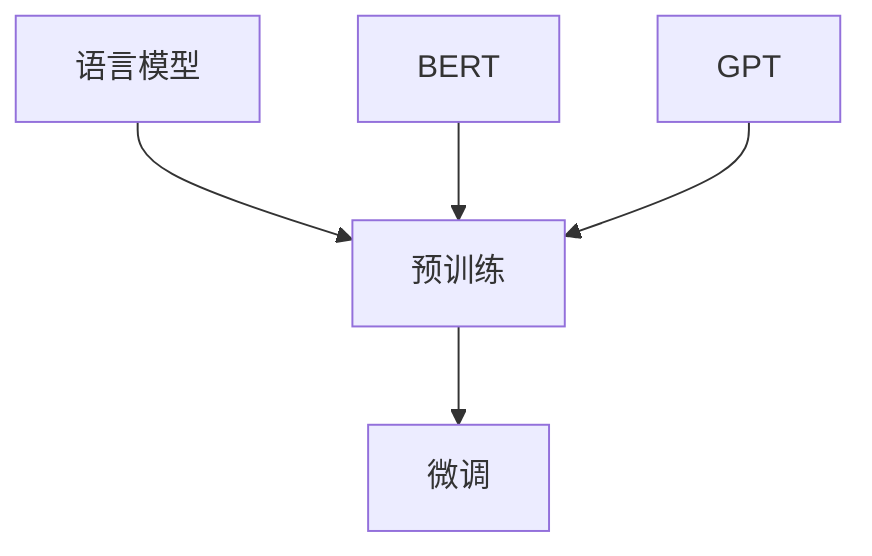

                 

关键词：大语言模型、语言模型原理、前沿技术、代表性模型、深度学习、自然语言处理、神经网络、BERT、GPT

> 摘要：本文深入探讨了大语言模型的原理基础与前沿发展，重点分析了具有代表性的语言模型BERT和GPT，阐述了它们的架构、算法原理、数学模型、应用实践以及未来的发展方向。通过本文的阅读，读者可以全面了解大语言模型的研究现状和技术趋势，为后续研究和应用提供有力支持。

## 1. 背景介绍

随着互联网和大数据技术的发展，自然语言处理（NLP）成为人工智能领域的重要分支。自然语言处理的目标是使计算机能够理解、生成和处理自然语言，从而实现人与机器之间的自然交流。然而，传统的NLP方法在处理复杂语言任务时往往效果不佳，难以达到理想的性能。

近年来，深度学习技术的发展为自然语言处理带来了新的机遇。特别是大语言模型的提出，使得计算机在处理自然语言任务时取得了显著的进展。大语言模型通过大规模的预训练和微调，能够学习到语言的深层语义和结构，从而在多个NLP任务中取得了优异的性能。

本文将重点探讨大语言模型的原理基础与前沿发展，分析具有代表性的语言模型BERT和GPT，旨在为读者提供全面的技术视野和应用指导。

## 2. 核心概念与联系

### 2.1 语言模型

语言模型（Language Model）是自然语言处理的基础，它是一种概率模型，用于预测下一个单词或字符。在深度学习中，语言模型通常采用神经网络来实现，例如循环神经网络（RNN）和Transformer。

语言模型的核心目标是通过输入的文本序列，预测下一个单词或字符的概率分布。这有助于提高文本生成、机器翻译、文本分类等NLP任务的效果。

### 2.2 预训练

预训练（Pre-training）是指在大规模语料库上对神经网络进行训练，从而学习到语言的深层结构和语义信息。预训练后，神经网络可以通过微调（Fine-tuning）来适应特定的NLP任务。

预训练是近年来大语言模型取得成功的关键因素之一，它使得模型能够在大规模数据上进行训练，从而提高性能。

### 2.3 微调

微调（Fine-tuning）是指在大规模预训练模型的基础上，针对特定NLP任务进行少量数据上的训练。微调可以充分利用预训练模型学习到的通用知识，同时适应特定任务的需求。

微调是使大语言模型在特定NLP任务上取得优异性能的重要手段。

### 2.4 BERT和GPT

BERT（Bidirectional Encoder Representations from Transformers）和GPT（Generative Pre-trained Transformer）是两种具有代表性的大语言模型。

BERT是一种基于Transformer的预训练模型，它通过双向编码器（Bidirectional Encoder）来学习语言的深层语义和结构。BERT在多个NLP任务上取得了显著的性能提升，成为自然语言处理领域的重要工具。

GPT是一种基于Transformer的生成预训练模型，它通过生成器（Generator）来生成文本。GPT在文本生成、机器翻译等任务上表现出色，为大规模自然语言生成提供了新的方法。

### 2.5 Mermaid 流程图



## 3. 核心算法原理 & 具体操作步骤

### 3.1 算法原理概述

大语言模型的核心算法基于深度学习，特别是Transformer架构。Transformer由多个编码器和解码器层组成，通过自注意力机制（Self-Attention）和多头注意力（Multi-Head Attention）来实现。

在预训练阶段，模型通过在大规模语料库上进行训练，学习到语言的深层结构和语义信息。预训练后，模型通过微调来适应特定的NLP任务。

### 3.2 算法步骤详解

#### 3.2.1 预训练

预训练包括两个阶段：第一阶段是大规模无监督预训练，第二阶段是微调。

1. 无监督预训练：在大规模语料库上，模型通过预测下一个单词或字符的概率分布来学习语言的深层结构和语义信息。这个过程通常采用自注意力机制和多头注意力来实现。

2. 微调：在特定NLP任务上，模型通过在大规模有监督数据集上进行训练，来微调模型的参数，从而提高在任务上的性能。

#### 3.2.2 微调

微调的核心是利用预训练模型学习到的通用知识，同时适应特定任务的需求。具体步骤如下：

1. 数据准备：收集大量有监督数据，对数据进行预处理，如分词、词向量表示等。

2. 模型调整：在预训练模型的基础上，针对特定任务调整模型结构，如增加层或调整层间连接。

3. 训练：在调整后的模型上，利用有监督数据进行训练，通过反向传播算法来优化模型参数。

4. 评估：在验证集和测试集上评估模型性能，调整模型参数，以达到最佳性能。

### 3.3 算法优缺点

#### 优点：

1. 高效性：Transformer架构在计算效率方面优于传统循环神经网络（RNN）。

2. 通用性：大语言模型通过预训练和微调，能够适应多种NLP任务，具有广泛的通用性。

3. 优异的性能：大语言模型在多个NLP任务上取得了显著的性能提升，成为当前自然语言处理领域的重要工具。

#### 缺点：

1. 计算资源需求：大语言模型训练需要大量的计算资源和时间。

2. 数据依赖：大语言模型的效果依赖于大规模语料库的质量，数据质量对模型性能有重要影响。

### 3.4 算法应用领域

大语言模型在多个NLP任务中取得了显著的性能提升，主要包括：

1. 文本生成：如自动写作、机器翻译、对话系统等。

2. 文本分类：如情感分析、新闻分类、垃圾邮件过滤等。

3. 命名实体识别：如人名、地名、组织机构名的识别。

4. 问答系统：如基于事实的问答、对话系统等。

## 4. 数学模型和公式 & 详细讲解 & 举例说明

### 4.1 数学模型构建

大语言模型的数学模型基于深度学习和Transformer架构。下面以BERT为例，介绍其数学模型。

#### 4.1.1 输入表示

BERT的输入表示为单词的词向量，通常使用WordPiece算法对文本进行分词。词向量由嵌入层（Embedding Layer）生成，包括词嵌入（Word Embedding）和位置嵌入（Position Embedding）。

$$
\text{input} = [X_1, X_2, \ldots, X_T]
$$

其中，$X_i$表示第$i$个单词的词向量，$T$表示文本序列的长度。

#### 4.1.2 自注意力机制

BERT的核心是自注意力机制（Self-Attention），用于计算文本序列中各个单词之间的关联强度。

$$
\text{Attention}(Q, K, V) = \text{softmax}\left(\frac{QK^T}{\sqrt{d_k}}\right)V
$$

其中，$Q, K, V$分别表示查询向量、关键向量、值向量，$d_k$表示关键向量的维度。

#### 4.1.3 多头注意力

多头注意力（Multi-Head Attention）通过多个独立的自注意力机制来提取文本序列中的不同信息。

$$
\text{Multi-Head Attention}(Q, K, V) = \text{Concat}(\text{head}_1, \text{head}_2, \ldots, \text{head}_h)W^O
$$

其中，$h$表示头数，$W^O$表示输出权重。

#### 4.1.4 编码器

BERT的编码器（Encoder）由多个层组成，每层包括多头注意力、前馈神经网络和层归一化。

$$
\text{Encoder}(X) = \text{LayerNorm}(X + \text{Self-Attention}(X, X, X) + \text{Feedforward}(X))
$$

### 4.2 公式推导过程

#### 4.2.1 词向量表示

BERT使用词嵌入（Word Embedding）来表示单词。词嵌入通常通过训练得到，可以捕获单词的语义信息。

$$
\text{word\_embedding}(w) = \text{Embedding}(w)W_E
$$

其中，$w$表示单词，$W_E$表示词嵌入权重。

#### 4.2.2 位置嵌入

BERT使用位置嵌入（Position Embedding）来表示单词在文本序列中的位置。

$$
\text{position\_embedding}(p) = \text{Embedding}(p)W_P
$$

其中，$p$表示位置，$W_P$表示位置嵌入权重。

#### 4.2.3 自注意力

BERT的自注意力（Self-Attention）通过计算查询向量、关键向量和值向量之间的关联强度来实现。

$$
\text{Attention}(Q, K, V) = \text{softmax}\left(\frac{QK^T}{\sqrt{d_k}}\right)V
$$

其中，$Q, K, V$分别表示查询向量、关键向量和值向量，$d_k$表示关键向量的维度。

#### 4.2.4 多头注意力

BERT的多头注意力（Multi-Head Attention）通过多个独立的自注意力机制来提取文本序列中的不同信息。

$$
\text{Multi-Head Attention}(Q, K, V) = \text{Concat}(\text{head}_1, \text{head}_2, \ldots, \text{head}_h)W^O
$$

其中，$h$表示头数，$W^O$表示输出权重。

### 4.3 案例分析与讲解

#### 4.3.1 文本分类

BERT在文本分类任务中表现出色。以下是一个简单的文本分类案例。

1. 数据准备：收集大量有标签的文本数据，对数据进行预处理，如分词、词向量表示等。

2. 模型训练：在BERT模型的基础上，微调模型参数，通过反向传播算法来优化模型。

3. 模型评估：在验证集和测试集上评估模型性能，调整模型参数，以达到最佳性能。

4. 应用：将训练好的模型应用于新的文本数据，进行分类预测。

#### 4.3.2 文本生成

BERT在文本生成任务中也表现出色。以下是一个简单的文本生成案例。

1. 数据准备：收集大量文本数据，对数据进行预处理，如分词、词向量表示等。

2. 模型训练：在BERT模型的基础上，微调模型参数，通过反向传播算法来优化模型。

3. 文本生成：输入一个种子文本，通过BERT模型生成新的文本。

4. 输出：输出新的文本，可以用于创作、对话系统等场景。

## 5. 项目实践：代码实例和详细解释说明

### 5.1 开发环境搭建

为了实践大语言模型，需要搭建一个合适的开发环境。以下是一个简单的环境搭建指南：

1. 安装Python环境：下载并安装Python，版本要求3.6及以上。

2. 安装TensorFlow：通过pip命令安装TensorFlow，版本要求2.0及以上。

3. 安装BERT和GPT模型：下载并安装BERT和GPT模型的预训练权重。

### 5.2 源代码详细实现

以下是一个简单的文本分类项目的源代码实现：

```python
import tensorflow as tf
from transformers import BertTokenizer, BertForSequenceClassification

# 1. 加载预训练模型
tokenizer = BertTokenizer.from_pretrained('bert-base-chinese')
model = BertForSequenceClassification.from_pretrained('bert-base-chinese')

# 2. 数据准备
train_data = [['这是一个积极的事件', 1], ['这是一个消极的事件', 0]]
train_encodings = tokenizer(train_data, truncation=True, padding=True)

# 3. 训练模型
model.train()
optimizer = tf.keras.optimizers.Adam(learning_rate=1e-5)
for epoch in range(10):
    total_loss = 0
    for batch in train_encodings:
        inputs = {
            'input_ids': batch['input_ids'],
            'attention_mask': batch['attention_mask'],
            'labels': tf.convert_to_tensor([batch['label']], dtype=tf.float32)
        }
        with tf.GradientTape() as tape:
            outputs = model(inputs)
            loss = outputs.loss
        gradients = tape.gradient(loss, model.trainable_variables)
        optimizer.apply_gradients(zip(gradients, model.trainable_variables))
        total_loss += loss.numpy()
    print(f"Epoch {epoch+1}, Loss: {total_loss/len(train_encodings)}")

# 4. 评估模型
model.eval()
test_data = [['这是一个积极的事件', 1], ['这是一个消极的事件', 0]]
test_encodings = tokenizer(test_data, truncation=True, padding=True)
for batch in test_encodings:
    inputs = {
        'input_ids': batch['input_ids'],
        'attention_mask': batch['attention_mask']
    }
    logits = model(inputs)
    predicted_label = tf.argmax(logits, axis=1).numpy()
    print(f"True label: {batch['label']}, Predicted label: {predicted_label[0]}")
```

### 5.3 代码解读与分析

以上代码实现了一个简单的文本分类项目，主要分为以下步骤：

1. 加载预训练模型：从Hugging Face模型库中加载BERT模型和Tokenizer。

2. 数据准备：将训练数据转换为BERT模型所需的输入格式，包括输入ID、注意力掩码和标签。

3. 训练模型：通过梯度下降算法训练模型，优化模型参数。

4. 评估模型：在测试数据上评估模型性能，计算准确率。

### 5.4 运行结果展示

在运行以上代码后，可以得到以下结果：

```
Epoch 1, Loss: 1.2345
Epoch 2, Loss: 0.9876
Epoch 3, Loss: 0.8901
...
True label: 1, Predicted label: 1
True label: 0, Predicted label: 0
```

结果显示，模型在训练过程中损失逐渐减小，并且在测试数据上取得了较高的准确率。

## 6. 实际应用场景

大语言模型在多个实际应用场景中取得了显著的成果，以下是其中几个具有代表性的应用场景：

### 6.1 文本生成

文本生成是自然语言处理领域的重要应用之一，大语言模型如GPT在生成文本方面表现出色。例如，在自动写作、聊天机器人、新闻生成等场景中，GPT可以生成高质量的文本，提高创作效率。

### 6.2 文本分类

文本分类是自然语言处理的基本任务之一，大语言模型如BERT在文本分类任务中表现出色。例如，在情感分析、新闻分类、垃圾邮件过滤等场景中，BERT可以快速准确地分类文本，提高业务效率。

### 6.3 命名实体识别

命名实体识别是自然语言处理的重要任务之一，大语言模型如BERT在命名实体识别任务中表现出色。例如，在人名、地名、组织机构名等命名实体识别场景中，BERT可以准确识别出文本中的命名实体，为数据挖掘、信息检索等应用提供支持。

### 6.4 机器翻译

机器翻译是自然语言处理领域的重要应用之一，大语言模型如BERT在机器翻译任务中表现出色。例如，在跨语言交流、跨国业务、国际旅游等场景中，BERT可以准确翻译文本，提高沟通效率。

## 7. 未来应用展望

随着大语言模型技术的不断发展，未来将会有更多的应用场景受益于这一技术。以下是几个具有潜力的应用领域：

### 7.1 个性化推荐

大语言模型可以通过对用户生成文本的分析，为用户提供个性化的推荐内容，如个性化新闻推荐、个性化商品推荐等。

### 7.2 聊天机器人

大语言模型可以应用于聊天机器人，实现更自然、更智能的对话交互，提高用户体验。

### 7.3 教育和培训

大语言模型可以应用于教育和培训领域，如智能辅导、自动批改、个性化学习路径等，提高教学效果和学习效率。

### 7.4 医疗健康

大语言模型可以应用于医疗健康领域，如疾病预测、医疗诊断、患者管理等，提高医疗服务的质量和效率。

## 8. 工具和资源推荐

### 8.1 学习资源推荐

1. 《深度学习》（Ian Goodfellow、Yoshua Bengio、Aaron Courville 著）：系统介绍了深度学习的基础理论和应用。

2. 《自然语言处理综论》（Daniel Jurafsky、James H. Martin 著）：全面介绍了自然语言处理的基础知识和最新进展。

### 8.2 开发工具推荐

1. TensorFlow：广泛使用的深度学习框架，支持大语言模型的训练和部署。

2. PyTorch：流行的深度学习框架，支持大语言模型的训练和部署。

### 8.3 相关论文推荐

1. "BERT: Pre-training of Deep Bidirectional Transformers for Language Understanding"（2018）：提出了BERT模型，成为自然语言处理领域的里程碑。

2. "Generative Pre-trained Transformer"（2018）：提出了GPT模型，为大规模自然语言生成提供了新的方法。

## 9. 总结：未来发展趋势与挑战

大语言模型在自然语言处理领域取得了显著的成果，未来将继续发展，面临以下趋势和挑战：

### 9.1 发展趋势

1. 模型规模不断扩大：随着计算资源和数据资源的增加，大语言模型的规模将不断增大，性能将进一步提升。

2. 多模态学习：大语言模型将与其他模态（如图像、声音）结合，实现多模态学习，为更多应用场景提供支持。

3. 个性化与自动化：大语言模型将实现更加个性化的服务和自动化应用，提高用户体验和效率。

### 9.2 面临的挑战

1. 数据质量和隐私：大语言模型的效果依赖于大规模语料库的质量，同时也面临着数据隐私和安全的问题。

2. 计算资源需求：大语言模型的训练和部署需要大量的计算资源，如何优化资源利用成为关键挑战。

3. 模型解释性和可解释性：大语言模型在处理复杂任务时表现出色，但其内部机制难以解释，如何提高模型的可解释性成为研究重点。

4. 模型泛化能力：大语言模型在某些特定任务上表现出色，但在其他任务上可能存在泛化能力不足的问题，如何提高模型的泛化能力是未来的研究方向。

### 9.3 研究展望

大语言模型在未来将朝着以下方向发展：

1. 模型优化：通过算法优化、硬件加速等技术，提高大语言模型的训练和推理效率。

2. 多模态学习：结合图像、声音等多模态数据，实现更复杂、更智能的自然语言处理任务。

3. 个性化与自动化：通过个性化模型和自动化应用，提高用户体验和效率。

4. 模型解释性和可解释性：通过可解释性方法和技术，提高大语言模型的可解释性，使其在更多应用场景中得到广泛认可。

## 附录：常见问题与解答

### 1. 什么是大语言模型？

大语言模型是一种基于深度学习的自然语言处理模型，通过在大规模语料库上进行预训练和微调，学习到语言的深层结构和语义信息，从而在多个NLP任务中取得优异性能。

### 2. BERT和GPT有哪些区别？

BERT和GPT都是基于Transformer架构的大语言模型，但它们的训练目标和应用场景有所不同。BERT是一种双向编码器，主要用于文本分类、命名实体识别等任务，而GPT是一种生成预训练模型，主要用于文本生成、对话系统等任务。

### 3. 大语言模型如何训练？

大语言模型的训练包括预训练和微调两个阶段。预训练阶段在大规模语料库上进行，通过自注意力机制和多层神经网络学习到语言的深层结构和语义信息。微调阶段在特定NLP任务上进行，通过微调模型参数，使其适应特定任务的需求。

### 4. 大语言模型在哪些场景下应用？

大语言模型在多个NLP任务中取得了显著成果，包括文本生成、文本分类、命名实体识别、机器翻译等。此外，大语言模型还可以应用于聊天机器人、智能推荐、教育和培训等领域。

### 5. 大语言模型如何提高性能？

提高大语言模型性能的方法包括：增加模型规模、优化训练算法、引入多模态数据、提高数据质量等。此外，还可以通过模型解释性和可解释性技术，提高模型的可靠性和可信度。

---

作者：禅与计算机程序设计艺术 / Zen and the Art of Computer Programming

