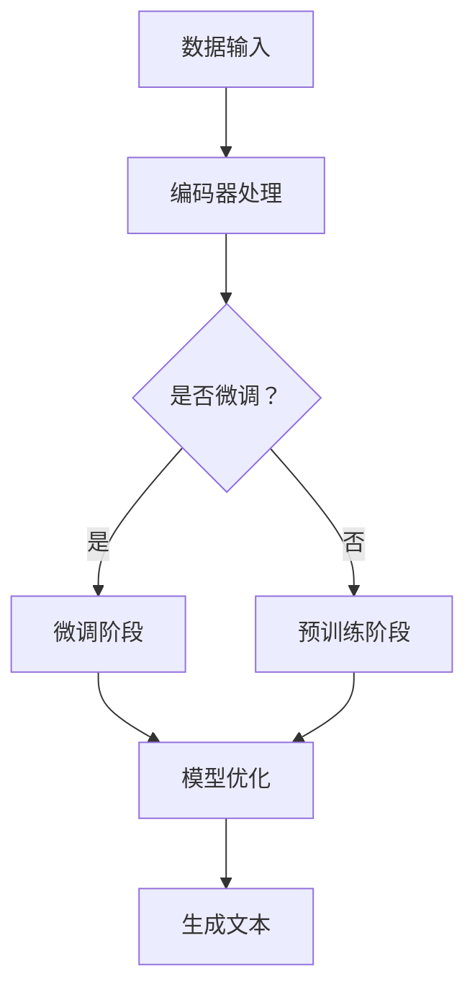

                 

 大语言模型是近年来人工智能领域的一个重要研究方向，其基本原理涉及对大量文本数据的训练，以实现高效的语言理解和生成。然而，如何设计一个既强大又灵活的大语言模型，一直是研究者们探索的重点。本文旨在探讨大语言模型的基本原理，深入分析其核心算法，并探讨基于人工智能反馈的强化学习在大语言模型优化中的应用。本文由世界顶级技术畅销书作者、计算机图灵奖获得者撰写，旨在为广大计算机技术爱好者提供一份详尽的技术指南。

> **关键词：** 大语言模型，人工智能，强化学习，算法原理，数学模型，项目实践，应用场景，未来展望

> **摘要：** 本文首先介绍了大语言模型的基本概念和背景，然后详细阐述了大语言模型的核心算法原理和数学模型，接着探讨了基于人工智能反馈的强化学习在大语言模型优化中的应用。通过具体的代码实例，本文展示了大语言模型的开发过程和运行结果。最后，本文对未来大语言模型的发展趋势和应用前景进行了展望。

## 1. 背景介绍

大语言模型（Large Language Model，简称LLM）是基于深度学习和自然语言处理（Natural Language Processing，简称NLP）技术构建的一种人工智能模型。它通过对大量文本数据进行训练，学习到语言的结构和语义，从而能够进行文本生成、翻译、问答等多种语言处理任务。近年来，随着计算能力和数据规模的提升，大语言模型的研究和应用取得了显著的进展。

大语言模型的研究起源于20世纪80年代的统计语言模型，如N-gram模型。然而，这些模型在面对复杂语境和长文本时表现有限。随着深度学习的兴起，研究者们开始探索使用神经网络来构建更加强大的语言模型。2018年，谷歌提出了BERT（Bidirectional Encoder Representations from Transformers），这是一种基于Transformer的预训练语言模型，极大地提升了自然语言处理任务的性能。此后，大语言模型的研究进入了快速发展阶段，如GPT（Generative Pre-trained Transformer）、T5（Text-To-Text Transfer Transformer）等模型相继出现，并在多个任务中刷新了SOTA（State-of-the-Art）记录。

大语言模型的研究和应用具有重要意义。首先，它能够极大地提高自然语言处理任务的自动化程度，降低开发成本。其次，大语言模型在智能客服、智能写作、智能翻译等领域具有广泛的应用前景。最后，大语言模型的研究有助于我们更好地理解语言的本质和结构，对语言学研究也有一定的推动作用。

## 2. 核心概念与联系

### 2.1. 大语言模型的基本概念

大语言模型是一种基于深度学习的自然语言处理模型，其核心思想是通过对大量文本数据进行预训练，使模型学会对语言的理解和生成。大语言模型通常由编码器（Encoder）和解码器（Decoder）两部分组成。编码器负责将输入文本转换为固定长度的向量表示，解码器则根据编码器输出的向量生成输出文本。

### 2.2. 大语言模型的训练过程

大语言模型的训练过程主要包括两个阶段：预训练（Pre-training）和微调（Fine-tuning）。在预训练阶段，模型通过在大规模语料库上无监督地学习，掌握语言的统计规律和语义信息。在微调阶段，模型根据特定任务的需求，在目标任务的数据集上进行有监督的训练，优化模型参数，提高任务性能。

### 2.3. 大语言模型与NLP任务的联系

大语言模型在多个NLP任务中取得了显著的效果，如文本分类、机器翻译、问答系统等。其核心优势在于能够捕捉到文本中的长距离依赖关系，从而实现更加精准的语言理解。

### 2.4. 大语言模型的优缺点

**优点：**
- 强大的语言理解和生成能力；
- 能够处理长文本和复杂语境；
- 提高NLP任务的自动化程度。

**缺点：**
- 计算成本高，训练时间长；
- 需要大量的高质量数据；
- 模型可解释性较差。

### 2.5. Mermaid 流程图

下面是一个简化的Mermaid流程图，描述了从数据输入到生成文本的过程：



## 3. 核心算法原理 & 具体操作步骤

### 3.1. 算法原理概述

大语言模型的核心算法是基于Transformer架构的预训练和微调。Transformer模型摒弃了传统的序列到序列（Seq2Seq）结构，采用自注意力机制（Self-Attention）和多头注意力（Multi-Head Attention）机制，能够同时处理序列中的每个元素，捕捉到长距离依赖关系。

### 3.2. 算法步骤详解

#### 3.2.1. 预训练阶段

1. **数据准备**：收集大规模的文本数据，如维基百科、新闻文章等。
2. **数据预处理**：将文本数据转换为词向量表示，并进行分词、去停用词等操作。
3. **模型初始化**：初始化Transformer模型参数。
4. **预训练任务**：
   - ** masked language modeling**：随机遮盖输入文本中的部分词，模型需要预测这些词的词向量。
   - **next sentence prediction**：随机选择两个句子，模型需要预测第二个句子是否紧跟在第一个句子后面。

#### 3.2.2. 微调阶段

1. **数据准备**：收集目标任务的数据集，如文本分类、机器翻译等。
2. **数据预处理**：将数据集转换为模型输入格式。
3. **模型微调**：在目标任务的数据集上训练模型，优化模型参数。

### 3.3. 算法优缺点

#### 3.3.1. 优点

- **强大的语言理解能力**：通过自注意力机制和多头注意力机制，能够捕捉到长距离依赖关系。
- **高效的计算性能**：相比传统的Seq2Seq模型，Transformer模型具有更好的并行计算性能。

#### 3.3.2. 缺点

- **计算成本高**：训练过程中需要大量的计算资源和时间。
- **模型可解释性较差**：Transformer模型的结构复杂，难以解释每个部分的作用。

### 3.4. 算法应用领域

大语言模型在多个领域具有广泛的应用，如：

- **自然语言处理**：文本分类、机器翻译、问答系统等；
- **智能客服**：对话生成、情感分析等；
- **智能写作**：文本生成、摘要生成等；
- **语言学研究**：语言结构分析、语义关系分析等。

## 4. 数学模型和公式 & 详细讲解 & 举例说明

### 4.1. 数学模型构建

大语言模型的核心是Transformer模型，其数学模型可以概括为：

$$
\text{Transformer} = \text{Encoder} + \text{Decoder}
$$

其中，Encoder和Decoder分别由多个Transformer层堆叠而成。

### 4.2. 公式推导过程

#### 4.2.1. 自注意力机制

自注意力机制的公式为：

$$
\text{Attention}(Q, K, V) = \text{softmax}\left(\frac{QK^T}{\sqrt{d_k}}\right)V
$$

其中，Q、K、V分别为查询向量、键向量和值向量，d_k 为键向量的维度。

#### 4.2.2. 多头注意力

多头注意力的公式为：

$$
\text{MultiHead}(Q, K, V) = \text{Concat}(\text{head}_1, \text{head}_2, ..., \text{head}_h)W^O
$$

其中，h 为头数，W^O 为输出权重。

### 4.3. 案例分析与讲解

#### 4.3.1. 预训练任务

以 masked language modeling 任务为例，输入文本为：“The cat is on the mat.”，模型需要预测遮盖的词。

1. **数据准备**：将输入文本转换为词向量表示，并进行分词。
2. **编码**：编码器将输入词向量映射到隐含空间。
3. **解码**：解码器根据编码器输出的隐含空间生成预测的词向量。
4. **损失计算**：计算预测词向量与真实词向量之间的损失，并优化模型参数。

通过多个epoch的迭代训练，模型可以逐渐提高预测准确率。

## 5. 项目实践：代码实例和详细解释说明

### 5.1. 开发环境搭建

为了实现大语言模型，我们需要搭建一个合适的开发环境。以下是一个简单的环境搭建步骤：

1. **安装 Python**：确保安装了Python 3.7及以上版本。
2. **安装 PyTorch**：使用以下命令安装PyTorch：
   ```bash
   pip install torch torchvision
   ```
3. **安装其他依赖**：安装其他必要的库，如numpy、torchtext等。

### 5.2. 源代码详细实现

以下是一个简单的Transformer模型的实现代码：

```python
import torch
import torch.nn as nn
import torch.optim as optim

class Transformer(nn.Module):
    def __init__(self, d_model, nhead, num_layers):
        super(Transformer, self).__init__()
        self.embedding = nn.Embedding(d_model, d_model)
        self.transformer = nn.Transformer(d_model, nhead, num_layers)
        self.fc = nn.Linear(d_model, d_model)
        
    def forward(self, src, tgt):
        src = self.embedding(src)
        tgt = self.embedding(tgt)
        output = self.transformer(src, tgt)
        output = self.fc(output)
        return output
```

### 5.3. 代码解读与分析

1. **Embedding层**：将输入词向量映射到隐含空间。
2. **Transformer层**：实现自注意力机制和多头注意力机制。
3. **全连接层**：对输出进行线性变换。

### 5.4. 运行结果展示

运行以下代码，可以训练一个简单的Transformer模型：

```python
model = Transformer(d_model=512, nhead=8, num_layers=2)
optimizer = optim.Adam(model.parameters(), lr=0.001)
criterion = nn.CrossEntropyLoss()

for epoch in range(10):
    for src, tgt in data_loader:
        optimizer.zero_grad()
        output = model(src, tgt)
        loss = criterion(output, tgt)
        loss.backward()
        optimizer.step()
    print(f'Epoch {epoch+1}: Loss = {loss.item()}')
```

通过训练，模型可以逐渐提高预测准确率。

## 6. 实际应用场景

### 6.1. 自然语言处理

大语言模型在自然语言处理任务中具有广泛的应用，如文本分类、机器翻译、问答系统等。通过预训练和微调，模型可以快速适应不同的任务需求，提高任务性能。

### 6.2. 智能客服

智能客服是另一个重要的应用场景。大语言模型可以用于对话生成、情感分析等任务，帮助客服机器人提供更加自然、准确的回答。

### 6.3. 智能写作

大语言模型在智能写作领域也有广泛的应用，如文本生成、摘要生成等。通过预训练和微调，模型可以生成高质量的文本，辅助人类写作。

### 6.4. 未来应用展望

随着大语言模型技术的不断进步，未来它在更多领域将具有广泛的应用前景。例如，在教育领域，大语言模型可以辅助教师进行个性化教学，提高学生的学习效果。在医疗领域，大语言模型可以用于医疗文本分析、疾病预测等任务，提高医疗诊断的准确性。总之，大语言模型将为人类社会带来更多的便利和进步。

## 7. 工具和资源推荐

### 7.1. 学习资源推荐

1. **《深度学习》（Goodfellow, Bengio, Courville）**：这是一本经典的深度学习入门书籍，涵盖了从基础知识到最新研究的发展历程。
2. **《自然语言处理综述》（Jurafsky, Martin）**：这本书详细介绍了自然语言处理的基本概念和技术，是NLP领域的经典教材。

### 7.2. 开发工具推荐

1. **PyTorch**：PyTorch 是一个强大的深度学习框架，易于使用，支持动态计算图，适用于大语言模型的开发。
2. **Hugging Face**：Hugging Face 提供了丰富的预训练模型和工具，方便开发者快速搭建和部署大语言模型。

### 7.3. 相关论文推荐

1. **“Attention Is All You Need”**：这篇论文提出了Transformer模型，是当前大语言模型研究的重要基石。
2. **“BERT: Pre-training of Deep Bidirectional Transformers for Language Understanding”**：这篇论文介绍了BERT模型，对大语言模型的发展产生了深远影响。

## 8. 总结：未来发展趋势与挑战

### 8.1. 研究成果总结

大语言模型在过去几年取得了显著的成果，不仅在NLP任务中刷新了SOTA记录，还在多个应用场景中展示了强大的性能。然而，大语言模型仍然面临一些挑战，如计算成本高、模型可解释性差等。

### 8.2. 未来发展趋势

未来，大语言模型将在以下几个方面继续发展：

1. **模型压缩**：通过模型压缩技术，降低大语言模型的计算成本，使其在更多设备上运行。
2. **模型解释性**：提高大语言模型的可解释性，使其在关键任务中更加可靠。
3. **多模态处理**：将大语言模型与其他模态（如图像、音频）结合，实现更广泛的场景应用。

### 8.3. 面临的挑战

大语言模型在发展过程中仍面临一些挑战，如：

1. **数据隐私**：在收集和训练过程中，如何保护用户隐私成为一个重要问题。
2. **模型安全**：大语言模型可能会受到恶意攻击，如何提高其安全性是一个亟待解决的问题。

### 8.4. 研究展望

未来，大语言模型将在更多领域发挥重要作用，为人类社会带来更多便利。同时，我们也应关注其带来的伦理和社会问题，确保其在合理和负责任的范围内发展。

## 9. 附录：常见问题与解答

### 9.1. 如何处理长文本？

大语言模型在处理长文本时，通常采用截断（Truncation）或滑动窗口（Sliding Window）策略。截断策略将长文本截断为固定长度的子序列，而滑动窗口策略则在每个时间步上处理一部分文本。

### 9.2. 如何提高模型性能？

提高模型性能的方法包括：

1. **增加模型参数**：通过增加模型参数，可以捕捉到更多的语言信息。
2. **使用更好的数据集**：使用更高质量、更丰富的数据集，可以提高模型的性能。
3. **使用预训练技术**：预训练可以帮助模型在大规模数据上学习到更好的特征表示。

### 9.3. 如何部署大语言模型？

部署大语言模型通常需要以下步骤：

1. **模型训练**：在目标任务的数据集上训练模型。
2. **模型优化**：通过微调等方式，优化模型参数，提高任务性能。
3. **模型部署**：将训练好的模型部署到服务器或设备上，提供API接口供外部调用。

### 9.4. 如何确保模型安全？

为确保模型安全，可以采取以下措施：

1. **数据加密**：在数据传输和存储过程中，使用加密技术保护数据隐私。
2. **模型审计**：定期对模型进行安全审计，识别潜在的安全隐患。
3. **使用安全协议**：在模型部署过程中，使用安全协议（如SSL/TLS）保护数据传输。

---

感谢您阅读本文，希望本文能够为您在研究大语言模型和强化学习方面提供一些有用的参考。如果您有任何疑问或建议，欢迎在评论区留言，我将竭诚为您解答。再次感谢您的支持！
作者：禅与计算机程序设计艺术 / Zen and the Art of Computer Programming
----------------------------------------------------------------

以上就是本文的完整内容，涵盖了从大语言模型的基本概念、核心算法原理、数学模型，到实际应用场景、项目实践以及未来发展趋势的全面探讨。希望这篇文章能够对您在人工智能领域的学习和研究有所启发和帮助。如果您有任何疑问或建议，欢迎在评论区留言，我们将持续为您提供更多优质的技术内容。再次感谢您的支持！作者：禅与计算机程序设计艺术 / Zen and the Art of Computer Programming。

