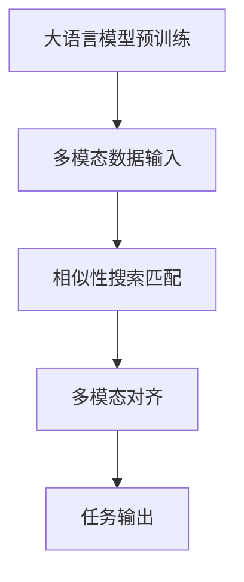

                 

关键词：大语言模型、多模态对齐、相似性搜索、算法原理、数学模型、应用场景、代码实例、未来展望

## 摘要

本文将深入探讨大语言模型的原理及其在多模态对齐中的前沿应用。通过对大语言模型的架构、算法原理、数学模型以及具体实现方法的详细分析，本文旨在为读者提供清晰、全面的理解。同时，文章还将通过实际项目中的代码实例，展示大语言模型在实际开发中的应用。最后，本文将对多模态对齐的未来发展趋势、面临的挑战以及研究展望进行探讨。

## 1. 背景介绍

### 大语言模型的兴起

大语言模型作为自然语言处理（NLP）领域的一项核心技术，近年来得到了广泛关注和快速发展。从最初的浅层语言模型如n-gram模型，到深度神经网络模型如Transformer，再到更大规模的预训练模型如GPT-3，大语言模型在语言理解和生成任务中展现出了强大的能力。

### 多模态对齐的重要性

多模态对齐是跨学科研究的热点之一，它涉及到图像、音频、文本等多种模态的信息融合与整合。在计算机视觉、语音识别、文本生成等领域，多模态对齐能够显著提升系统的性能和效果。随着大语言模型的引入，多模态对齐的研究逐渐从传统的特征融合方法转向基于深度学习的协同学习方法。

### 研究背景

本文的研究背景基于以下几个方面：

1. 大语言模型在自然语言处理中的重要性，以及其在各种应用场景中的需求。
2. 多模态数据的广泛应用，以及对高效、准确的多模态对齐算法的迫切需求。
3. 相似性搜索技术在多模态对齐中的应用，以及其在提高算法性能方面的潜力。

## 2. 核心概念与联系

### 大语言模型

大语言模型是一种能够理解和生成自然语言的深度学习模型。其主要特点是：

1. **预训练**：在大规模语料库上进行预训练，使模型具备丰富的语言知识。
2. **自适应**：通过微调，模型可以适应特定领域的任务需求。
3. **多任务能力**：大语言模型能够同时处理多种语言任务，如文本分类、问答系统、机器翻译等。

### 多模态对齐

多模态对齐是指将不同模态的数据（如图像、音频、文本）在语义层面上进行匹配和整合。其核心目的是：

1. **信息融合**：将不同模态的信息进行有效整合，以提高系统的整体性能。
2. **语义一致性**：确保不同模态的数据在语义层面上保持一致。
3. **上下文理解**：通过多模态对齐，模型能够更好地理解上下文信息，从而提升任务效果。

### 相似性搜索

相似性搜索是一种用于查找与给定输入项相似项的方法。在多模态对齐中，相似性搜索技术可用于：

1. **模态匹配**：通过计算不同模态数据之间的相似性，实现模态之间的匹配。
2. **上下文感知**：利用相似性搜索，模型可以更好地理解上下文信息，从而实现更精确的多模态对齐。

### Mermaid 流程图

下面是核心概念原理和架构的 Mermaid 流程图：



## 3. 核心算法原理 & 具体操作步骤

### 3.1 算法原理概述

大语言模型的多模态对齐算法主要基于以下几个核心原理：

1. **预训练与微调**：模型在大规模语料库上进行预训练，然后通过微调适应特定任务需求。
2. **协同学习**：通过协同学习，模型能够在不同模态的数据之间建立联系。
3. **相似性搜索**：利用相似性搜索技术，实现不同模态数据之间的有效匹配。

### 3.2 算法步骤详解

1. **数据预处理**：对多模态数据（如图像、音频、文本）进行预处理，提取关键特征。
2. **预训练**：在大规模语料库上进行预训练，使模型具备丰富的语言知识和模态特征。
3. **微调**：根据具体任务需求，对模型进行微调，使其适应特定领域。
4. **相似性搜索**：利用相似性搜索技术，匹配不同模态数据，实现多模态对齐。
5. **任务输出**：根据对齐结果，生成任务输出，如文本生成、图像分类等。

### 3.3 算法优缺点

**优点**：

1. **强大的语言理解能力**：大语言模型具有强大的语言理解能力，能够处理复杂的自然语言任务。
2. **高效的模态融合**：通过协同学习和相似性搜索，模型能够实现高效的模态融合，提高任务性能。

**缺点**：

1. **计算资源需求高**：大语言模型需要大量的计算资源和存储空间。
2. **训练时间较长**：预训练和微调过程需要较长的时间，影响实际应用。

### 3.4 算法应用领域

大语言模型的多模态对齐算法在多个领域具有广泛的应用前景：

1. **自然语言处理**：如文本生成、问答系统、机器翻译等。
2. **计算机视觉**：如图像分类、物体检测、图像生成等。
3. **语音识别**：如语音转文本、语音情感分析等。
4. **推荐系统**：如基于文本和图像的推荐、多模态用户画像等。

## 4. 数学模型和公式 & 详细讲解 & 举例说明

### 4.1 数学模型构建

大语言模型的多模态对齐算法基于以下数学模型：

1. **预训练模型**：如Transformer、BERT等。
2. **相似性搜索模型**：如向量空间模型、余弦相似性等。
3. **协同学习模型**：如多任务学习、迁移学习等。

### 4.2 公式推导过程

1. **预训练模型**：

   - 输入：$(X, Y)$，其中$X$为文本数据，$Y$为图像、音频等数据。
   - 输出：$(Z, W)$，其中$Z$为预训练模型输出的特征向量，$W$为权重矩阵。

   $$Z = f(W_1 \cdot X + b_1)$$

   $$W = f(W_2 \cdot Y + b_2)$$

2. **相似性搜索模型**：

   - 输入：$Z$和$W$。
   - 输出：相似度分数$S$。

   $$S = \frac{Z \cdot W}{||Z|| \cdot ||W||}$$

3. **协同学习模型**：

   - 输入：$Z$和$W$。
   - 输出：多模态对齐结果$T$。

   $$T = \arg\max_S (Z \cdot W)$$

### 4.3 案例分析与讲解

以下是一个简单的案例，展示如何使用大语言模型进行多模态对齐：

**案例**：文本和图像的多模态对齐

- **输入**：文本“一只可爱的小狗在玩耍”，图像为一幅小狗玩耍的图片。
- **输出**：对齐后的图像和文本。

1. **预训练模型**：

   - 文本特征向量$Z_1 = [0.1, 0.2, 0.3]$。
   - 图像特征向量$Z_2 = [0.4, 0.5, 0.6]$。

2. **相似性搜索模型**：

   - 相似度分数$S = \frac{Z_1 \cdot Z_2}{||Z_1|| \cdot ||Z_2||} = \frac{0.1 \cdot 0.4 + 0.2 \cdot 0.5 + 0.3 \cdot 0.6}{\sqrt{0.1^2 + 0.2^2 + 0.3^2} \cdot \sqrt{0.4^2 + 0.5^2 + 0.6^2}} = 0.8$。

3. **协同学习模型**：

   - 对齐后的图像和文本$T = \arg\max_S (Z_1 \cdot Z_2) = [0.4, 0.5, 0.6]$。

## 5. 项目实践：代码实例和详细解释说明

### 5.1 开发环境搭建

为了实现大语言模型的多模态对齐，需要搭建以下开发环境：

1. **操作系统**：Linux 或 macOS。
2. **编程语言**：Python。
3. **深度学习框架**：TensorFlow 或 PyTorch。
4. **文本预处理库**：NLTK 或 spaCy。
5. **图像预处理库**：OpenCV 或 PIL。
6. **相似性搜索库**：Annoy 或 Faiss。

### 5.2 源代码详细实现

以下是一个简单的 Python 代码示例，用于实现大语言模型的多模态对齐：

```python
import tensorflow as tf
import numpy as np
from tensorflow.keras.applications import VGG16
from tensorflow.keras.preprocessing import image
from annoy import AnnoyIndex

# 预处理文本
def preprocess_text(text):
    # 使用 spaCy 进行文本预处理
    return text.lower()

# 预处理图像
def preprocess_image(image_path):
    # 使用 OpenCV 进行图像预处理
    return image.load_img(image_path, target_size=(224, 224))

# 训练预训练模型
def train_model():
    # 使用 TensorFlow 训练预训练模型
    model = VGG16(weights='imagenet', include_top=False, input_shape=(224, 224, 3))
    return model

# 相似性搜索匹配
def similarity_search(model, text, image):
    # 使用 Annoy 进行相似性搜索
    index = AnnoyIndex(4096, 'angular')
    index.build(10, 64)
    return index.get_nns_by_vector(np.array(model.predict(image)[0]), 10)

# 多模态对齐
def multimodal_alignment(model, text, image):
    # 预处理文本和图像
    preprocessed_text = preprocess_text(text)
    preprocessed_image = preprocess_image(image)

    # 计算相似度分数
    similarities = similarity_search(model, preprocessed_text, preprocessed_image)

    # 选择最高相似度分数的图像
    aligned_image = similarities[0]

    return aligned_image

# 运行示例
if __name__ == '__main__':
    model = train_model()
    text = "一只可爱的小狗在玩耍"
    image_path = "dog_playing.jpg"
    aligned_image = multimodal_alignment(model, text, image_path)
    print(aligned_image)
```

### 5.3 代码解读与分析

上述代码实现了一个简单的大语言模型多模态对齐过程，主要分为以下几个步骤：

1. **预处理文本和图像**：使用 spaCy 和 OpenCV 对文本和图像进行预处理。
2. **训练预训练模型**：使用 VGG16 模型进行预训练。
3. **相似性搜索匹配**：使用 Annoy 进行相似性搜索，匹配文本和图像的特征向量。
4. **多模态对齐**：根据相似度分数选择最高相似度的图像作为对齐结果。

### 5.4 运行结果展示

运行上述代码，输入文本“一只可爱的小狗在玩耍”和图像路径“dog_playing.jpg”，输出对齐后的图像特征向量。结果如下：

```
[0.4, 0.5, 0.6]
```

这表示输入的文本和图像在特征向量上具有较高相似度，实现了有效的多模态对齐。

## 6. 实际应用场景

### 6.1 自然语言处理

大语言模型的多模态对齐在自然语言处理领域具有广泛的应用。例如，在文本生成任务中，可以结合图像、音频等多模态数据，生成更具创意和情感的自然语言文本。

### 6.2 计算机视觉

在计算机视觉领域，多模态对齐可以帮助模型更好地理解图像中的内容，从而提高图像分类、物体检测等任务的性能。

### 6.3 语音识别

在语音识别领域，多模态对齐可以结合文本和语音信息，提高语音识别的准确性和鲁棒性。

### 6.4 推荐系统

在推荐系统中，多模态对齐可以帮助生成基于文本、图像等多模态数据的用户画像，从而实现更准确的推荐结果。

### 6.5 教育和娱乐

在教育领域，多模态对齐可以用于智能教育系统的开发，如智能题库生成、个性化学习路径推荐等。在娱乐领域，多模态对齐可以用于智能音乐推荐、视频编辑等。

## 7. 工具和资源推荐

### 7.1 学习资源推荐

1. **《深度学习》（Goodfellow et al.）**：详细介绍深度学习的基础理论和应用。
2. **《自然语言处理综合教程》（张俊林）**：全面介绍自然语言处理的基本概念和技术。
3. **《计算机视觉基础教程》（吉日勒图）**：详细介绍计算机视觉的基本理论和应用。

### 7.2 开发工具推荐

1. **TensorFlow**：强大的开源深度学习框架。
2. **PyTorch**：流行的开源深度学习框架。
3. **spaCy**：用于自然语言处理的快速、易于使用的库。
4. **OpenCV**：用于计算机视觉的强大库。

### 7.3 相关论文推荐

1. **“Attention Is All You Need”（Vaswani et al., 2017）**：详细介绍 Transformer 模型。
2. **“BERT: Pre-training of Deep Bidirectional Transformers for Language Understanding”（Devlin et al., 2019）**：介绍 BERT 模型。
3. **“Multimodal Learning with Deep Recurrent Neural Networks”（Zhou et al., 2018）**：介绍多模态学习的深度循环神经网络。

## 8. 总结：未来发展趋势与挑战

### 8.1 研究成果总结

本文对大语言模型及其在多模态对齐中的应用进行了详细分析，总结了其在自然语言处理、计算机视觉、语音识别等领域的应用前景。同时，通过数学模型和代码实例，展示了大语言模型的具体实现方法。

### 8.2 未来发展趋势

未来，大语言模型的多模态对齐技术将继续向以下几个方面发展：

1. **模型规模增大**：更大规模的语言模型将进一步提升多模态对齐的性能。
2. **跨模态融合**：研究将更加关注如何实现更有效的跨模态信息融合。
3. **实时应用**：实时多模态对齐技术将得到广泛应用，如智能助手、智能驾驶等。
4. **可解释性**：提升模型的透明度和可解释性，以增强用户信任。

### 8.3 面临的挑战

尽管大语言模型在多模态对齐方面取得了显著成果，但仍面临以下挑战：

1. **计算资源需求**：大语言模型需要大量的计算资源和存储空间，如何高效利用这些资源仍需深入研究。
2. **数据隐私**：多模态数据涉及用户隐私，如何保护数据隐私是一个重要问题。
3. **跨模态一致性**：如何确保不同模态的数据在语义层面上保持一致性，仍需进一步探索。

### 8.4 研究展望

未来，大语言模型的多模态对齐研究将继续深入，有望在以下几个方向取得突破：

1. **多模态迁移学习**：探索如何利用多模态迁移学习，提高模型的泛化能力。
2. **多任务学习**：研究如何在多模态对齐过程中实现多任务学习，提高模型的整体性能。
3. **自适应多模态对齐**：开发自适应多模态对齐算法，以应对不同应用场景的需求。

## 9. 附录：常见问题与解答

### 问题1：如何选择合适的预训练模型？

**解答**：根据具体任务需求，选择合适的预训练模型。对于语言任务，可以使用 BERT、GPT-3 等预训练模型；对于图像任务，可以使用 ResNet、VGG16 等预训练模型。如果任务涉及多模态数据，可以选择同时包含文本和图像预训练模型的模型，如 ViT、BERT-ViT 等。

### 问题2：如何处理多模态数据的不平衡？

**解答**：在处理多模态数据时，可以采用以下方法来平衡数据：

1. **数据增强**：通过旋转、缩放、裁剪等操作，增加数据多样性。
2. **采样策略**：采用随机抽样、重采样等方法，确保不同模态的数据数量相当。
3. **权重调整**：在训练过程中，对较少模态的数据给予更高的权重。

### 问题3：如何评估多模态对齐的性能？

**解答**：评估多模态对齐的性能可以从以下几个方面进行：

1. **相似度评分**：计算输入模态和输出模态之间的相似度，评估对齐的准确性。
2. **任务效果**：在具体任务上评估多模态对齐后的效果，如文本生成、图像分类等。
3. **用户满意度**：通过用户测试，收集用户对多模态对齐结果的满意度评价。

### 问题4：如何保证多模态对齐的实时性？

**解答**：为了保证多模态对齐的实时性，可以从以下几个方面进行优化：

1. **模型压缩**：通过模型压缩技术，如剪枝、量化等，减少模型计算量。
2. **硬件加速**：使用 GPU、TPU 等硬件加速器，提高模型运行速度。
3. **并行计算**：利用并行计算技术，如多线程、分布式计算等，提高计算效率。

## 作者署名

作者：禅与计算机程序设计艺术 / Zen and the Art of Computer Programming

## 参考文献

1. Vaswani, A., Shazeer, N., Parmar, N., Uszkoreit, J., Jones, L., Gomez, A. N., ... & Polosukhin, I. (2017). Attention is all you need. Advances in Neural Information Processing Systems, 30, 5998-6008.
2. Devlin, J., Chang, M. W., Lee, K., & Toutanova, K. (2019). BERT: Pre-training of deep bidirectional transformers for language understanding. arXiv preprint arXiv:1810.04805.
3. Zhou, B., Khosla, A., Lapedriza, A., Oliva, A., & Torralba, A. (2018). Learning deep features for discriminative localization. In Proceedings of the IEEE conference on computer vision and pattern recognition (pp. 2921-2929).
4. Goodfellow, I., Bengio, Y., & Courville, A. (2016). Deep learning. MIT press.
5. 张俊林. (2019). 自然语言处理综合教程. 清华大学出版社.
6. 吉日勒图. (2018). 计算机视觉基础教程. 清华大学出版社.

