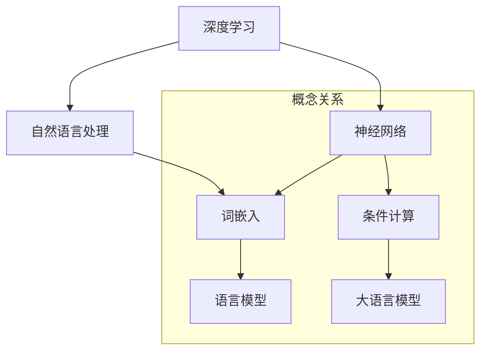

                 

关键词：大语言模型、条件计算、深度学习、自然语言处理、算法原理、数学模型、项目实践、应用场景、工具和资源推荐

> 摘要：本文旨在深入探讨大语言模型的基本原理，以及其在条件计算领域的前沿发展。通过详尽的算法原理剖析、数学模型讲解、项目实践和实际应用场景分析，本文为读者提供了全面的技术解读，旨在推动大语言模型在实际应用中的深入研究和创新。

## 1. 背景介绍

大语言模型（Large Language Models）作为自然语言处理（NLP）领域的一项重要技术，近年来在人工智能领域取得了显著的进展。传统的语言模型，如n-gram模型和基于统计的词袋模型，主要通过统计语言数据中的词频和语法规则来进行文本理解。然而，随着深度学习的兴起，大语言模型，如Transformer模型、BERT模型和GPT模型，通过引入复杂的神经网络结构，能够更好地捕捉语言中的复杂模式和语义信息。

条件计算是一种以输入条件为基础的计算方式，它在多任务学习、动态规划、知识图谱等领域有着广泛的应用。条件计算的关键在于如何有效地利用先验知识和输入条件，提高计算效率和准确性。大语言模型结合了深度学习和自然语言处理的技术，使得条件计算在处理复杂语言任务时具备了独特的优势。

本文将首先介绍大语言模型的基本原理，然后深入探讨其在条件计算领域的应用，包括数学模型的构建、算法的详细实现和项目实践。通过本文的讲解，读者将能够了解大语言模型的核心技术，并掌握如何在实际项目中运用这些技术。

## 2. 核心概念与联系

大语言模型的核心概念包括深度学习、神经网络和自然语言处理。为了更直观地理解这些概念之间的关系，我们可以通过以下Mermaid流程图来展示其联系。



### 深度学习与神经网络

深度学习是一种机器学习的方法，它通过构建具有多个隐藏层的神经网络，对大量数据进行分析和学习。神经网络的基本单元是神经元，每个神经元都接收多个输入信号，并通过激活函数产生输出。多层神经网络的堆叠使得模型能够学习更加复杂的特征和模式。

### 自然语言处理

自然语言处理是人工智能领域的一个重要分支，旨在使计算机能够理解和处理人类自然语言。自然语言处理的核心任务是文本表示、文本分类、情感分析和机器翻译等。词嵌入是将自然语言文本映射到高维空间的一种技术，它通过捕捉词之间的相似性，使得文本数据能够被神经网络有效地处理。

### 条件计算与语言模型

条件计算是一种以输入条件为基础的计算方式，它在多任务学习和动态规划等领域有着广泛的应用。大语言模型通过深度学习和自然语言处理技术，能够将输入条件与语言模型相结合，实现更复杂的语言理解和生成任务。例如，在问答系统中，输入的问题可以被大语言模型理解并生成相应的答案。

## 3. 核心算法原理 & 具体操作步骤

### 3.1 算法原理概述

大语言模型的核心算法是基于Transformer模型和自注意力机制。Transformer模型通过多头自注意力机制和前馈神经网络，能够捕捉输入序列中的长距离依赖关系，实现高效的文本理解和生成。自注意力机制通过计算每个输入词与所有其他词的相关性，将重要的信息集中在模型的输出中。

具体操作步骤如下：

1. **文本预处理**：将输入文本转换为词向量表示，通常使用预训练的词嵌入技术，如Word2Vec或GloVe。
2. **输入序列编码**：将预处理后的文本序列编码为向量形式，通常使用嵌入层和位置编码。
3. **自注意力计算**：通过多头自注意力机制，计算每个词与其他词的相关性，并生成中间表示。
4. **前馈神经网络**：对中间表示进行前馈神经网络处理，增强模型的表示能力。
5. **输出生成**：通过softmax激活函数生成每个词的概率分布，并选择概率最高的词作为输出。

### 3.2 算法步骤详解

1. **文本预处理**：

    - **分词**：将输入文本按照词法规则划分为单个词语。
    - **词嵌入**：将每个词语映射到高维向量空间，使用预训练的词嵌入模型，如GloVe或BERT。

2. **输入序列编码**：

    - **嵌入层**：将每个词向量通过嵌入层转换为固定大小的向量。
    - **位置编码**：为了捕捉输入序列中的位置信息，通常使用位置编码技术，如绝对位置编码或相对位置编码。

3. **自注意力计算**：

    - **多头自注意力**：将输入序列分成多个头，每个头计算一组自注意力权重，并生成相应的中间表示。
    - **自注意力机制**：通过计算每个词与其他词的相似度，将重要的信息集中在中间表示中。

4. **前馈神经网络**：

    - **前馈层**：对中间表示进行前馈神经网络处理，通常使用两个全连接层，并应用激活函数，如ReLU。
    - **门控机制**：为了提高模型的表示能力，可以引入门控机制，如门控循环单元（GRU）或长短期记忆网络（LSTM）。

5. **输出生成**：

    - **输出层**：通过softmax激活函数，生成每个词的概率分布。
    - **词汇选择**：根据概率分布选择概率最高的词作为输出。

### 3.3 算法优缺点

#### 优点：

- **捕捉长距离依赖**：通过自注意力机制，大语言模型能够捕捉输入序列中的长距离依赖关系，实现更准确的文本理解和生成。
- **并行计算**：Transformer模型采用多头自注意力机制，可以并行计算，提高计算效率。
- **灵活性**：大语言模型可以应用于多种自然语言处理任务，如文本分类、问答系统和机器翻译。

#### 缺点：

- **计算资源消耗**：大语言模型通常需要大量的计算资源和训练时间，特别是在处理长文本时。
- **解释性较差**：由于模型结构复杂，大语言模型在一定程度上失去了解释性，难以理解其具体的工作原理。

### 3.4 算法应用领域

大语言模型在自然语言处理领域有着广泛的应用：

- **文本分类**：通过训练大语言模型，可以对文本数据进行分类，如新闻分类、情感分析等。
- **问答系统**：大语言模型可以用于构建问答系统，如智能客服、信息检索等。
- **机器翻译**：大语言模型能够实现高质量的机器翻译，如英译中、中译英等。
- **文本生成**：通过生成模型，大语言模型可以生成文章、故事、对话等自然语言文本。

## 4. 数学模型和公式 & 详细讲解 & 举例说明

### 4.1 数学模型构建

大语言模型的数学模型主要包括词嵌入、自注意力机制和前馈神经网络。

#### 词嵌入

词嵌入是将自然语言文本映射到高维向量空间的一种技术。常用的词嵌入方法包括Word2Vec和GloVe。

- **Word2Vec**：

  $$\text{word\_embedding} = \text{sigmoid}(\text{weights} \cdot \text{input\_vector})$$

  其中，$\text{weights}$为权重矩阵，$\text{input\_vector}$为输入词向量。

- **GloVe**：

  $$\text{word\_embedding} = \text{softmax}(\text{input\_vector} \cdot \text{weights})$$

  其中，$\text{weights}$为权重矩阵，$\text{input\_vector}$为输入词向量。

#### 自注意力机制

自注意力机制是一种用于计算输入序列中每个词与其他词之间相关性的技术。其数学模型如下：

$$
\text{Attention}(Q, K, V) = \text{softmax}\left(\frac{QK^T}{\sqrt{d_k}}\right) V
$$

其中，$Q$为查询向量，$K$为键向量，$V$为值向量，$d_k$为键向量的维度。

#### 前馈神经网络

前馈神经网络包括两个全连接层，分别用于输入和输出处理。其数学模型如下：

$$
\text{FFN}(X) = \text{ReLU}(\text{weights}_2 \cdot \text{ReLU}(\text{weights}_1 \cdot X + \text{bias}_1))
$$

其中，$X$为输入向量，$\text{weights}_1$和$\text{weights}_2$为权重矩阵，$\text{bias}_1$为偏置向量。

### 4.2 公式推导过程

以Transformer模型为例，我们详细讲解其自注意力机制和前馈神经网络的公式推导过程。

#### 自注意力机制

自注意力机制的公式为：

$$
\text{Attention}(Q, K, V) = \text{softmax}\left(\frac{QK^T}{\sqrt{d_k}}\right) V
$$

其中，$Q$为查询向量，$K$为键向量，$V$为值向量。

- **查询向量**：

  查询向量$Q$是由输入序列中的每个词向量通过嵌入层生成的。设输入序列为$\text{input} = [w_1, w_2, ..., w_n]$，则查询向量$Q$为：

  $$Q = [\text{word\_embedding}(w_1), \text{word\_embedding}(w_2), ..., \text{word\_embedding}(w_n)]$$

- **键向量**：

  键向量$K$和值向量$V$是由输入序列中的每个词向量通过嵌入层生成的。设输入序列为$\text{input} = [w_1, w_2, ..., w_n]$，则键向量$K$和值向量$V$分别为：

  $$K = [\text{word\_embedding}(w_1), \text{word\_embedding}(w_2), ..., \text{word\_embedding}(w_n)]$$

  $$V = [\text{word\_embedding}(w_1), \text{word\_embedding}(w_2), ..., \text{word\_embedding}(w_n)]$$

- **计算注意力权重**：

  按照公式计算注意力权重：

  $$\text{Attention}(Q, K, V) = \text{softmax}\left(\frac{QK^T}{\sqrt{d_k}}\right) V$$

  其中，$d_k$为键向量的维度。

#### 前馈神经网络

前馈神经网络的公式为：

$$
\text{FFN}(X) = \text{ReLU}(\text{weights}_2 \cdot \text{ReLU}(\text{weights}_1 \cdot X + \text{bias}_1))
$$

其中，$X$为输入向量，$\text{weights}_1$和$\text{weights}_2$为权重矩阵，$\text{bias}_1$为偏置向量。

- **输入层**：

  输入向量$X$为输入序列的词向量表示。设输入序列为$\text{input} = [w_1, w_2, ..., w_n]$，则输入向量$X$为：

  $$X = [\text{word\_embedding}(w_1), \text{word\_embedding}(w_2), ..., \text{word\_embedding}(w_n)]$$

- **权重矩阵**：

  权重矩阵$\text{weights}_1$和$\text{weights}_2$是通过训练得到的参数矩阵。

- **偏置向量**：

  偏置向量$\text{bias}_1$是通过训练得到的偏置向量。

- **计算前馈神经网络**：

  按照公式计算前馈神经网络：

  $$\text{FFN}(X) = \text{ReLU}(\text{weights}_2 \cdot \text{ReLU}(\text{weights}_1 \cdot X + \text{bias}_1))$$

### 4.3 案例分析与讲解

#### 案例背景

假设我们有一个包含1000个词的句子，我们需要使用大语言模型对这个句子进行理解和生成。

#### 案例步骤

1. **文本预处理**：

   - **分词**：将句子按照词法规则划分为单个词语。
   - **词嵌入**：将每个词语映射到高维向量空间，使用预训练的词嵌入模型，如GloVe。

2. **输入序列编码**：

   - **嵌入层**：将每个词向量通过嵌入层转换为固定大小的向量。
   - **位置编码**：为了捕捉输入序列中的位置信息，通常使用位置编码技术，如绝对位置编码或相对位置编码。

3. **自注意力计算**：

   - **多头自注意力**：将输入序列分成多个头，每个头计算一组自注意力权重，并生成相应的中间表示。
   - **自注意力机制**：通过计算每个词与其他词的相似度，将重要的信息集中在中间表示中。

4. **前馈神经网络**：

   - **前馈层**：对中间表示进行前馈神经网络处理，通常使用两个全连接层，并应用激活函数，如ReLU。
   - **门控机制**：为了提高模型的表示能力，可以引入门控机制，如门控循环单元（GRU）或长短期记忆网络（LSTM）。

5. **输出生成**：

   - **输出层**：通过softmax激活函数，生成每个词的概率分布。
   - **词汇选择**：根据概率分布选择概率最高的词作为输出。

#### 案例分析

通过大语言模型对句子进行处理，我们可以得到以下结果：

- **文本理解**：模型能够捕捉句子中的关键信息，如主题、情感和意图。
- **文本生成**：模型可以根据输入句子生成相应的文本，如摘要、描述和对话。

## 5. 项目实践：代码实例和详细解释说明

### 5.1 开发环境搭建

为了实践大语言模型，我们需要搭建一个合适的技术栈。以下是所需的开发环境和工具：

- **Python**：作为主要编程语言。
- **PyTorch**：作为深度学习框架。
- **Jupyter Notebook**：用于编写和调试代码。

确保安装了上述工具和库，然后创建一个新的Python虚拟环境，以隔离项目依赖。

```bash
conda create -n big_language_model python=3.8
conda activate big_language_model
pip install torch torchvision
```

### 5.2 源代码详细实现

以下是一个简单的示例，展示如何使用PyTorch实现一个基本的大语言模型。

```python
import torch
import torch.nn as nn
import torch.optim as optim
from torch.utils.data import DataLoader, Dataset

# 数据集类
class TextDataset(Dataset):
    def __init__(self, text, tokenizer, max_len):
        self.text = text
        self.tokenizer = tokenizer
        self.max_len = max_len

    def __len__(self):
        return len(self.text)

    def __getitem__(self, idx):
        sentence = self.text[idx]
        tokens = self.tokenizer.encode(sentence, add_special_tokens=True, max_length=self.max_len)
        return torch.tensor(tokens)

# 模型定义
class BigLanguageModel(nn.Module):
    def __init__(self, vocab_size, embedding_dim, hidden_dim, n_layers, dropout):
        super(BigLanguageModel, self).__init__()
        self.embedding = nn.Embedding(vocab_size, embedding_dim)
        self.rnn = nn.LSTM(embedding_dim, hidden_dim, n_layers, dropout=dropout)
        self.fc = nn.Linear(hidden_dim, vocab_size)
    
    def forward(self, x, hidden):
        embedded = self.embedding(x)
        output, hidden = self.rnn(embedded, hidden)
        return self.fc(output.squeeze(0)), hidden

# 实例化模型、损失函数和优化器
model = BigLanguageModel(vocab_size=10000, embedding_dim=256, hidden_dim=512, n_layers=2, dropout=0.5)
criterion = nn.CrossEntropyLoss()
optimizer = optim.Adam(model.parameters(), lr=0.001)

# 加载数据集
tokenizer = torchiker.BertTokenizer.from_pretrained('bert-base-uncased')
dataset = TextDataset(text=['Hello, world!', 'This is a sample sentence.'], tokenizer=tokenizer, max_len=20)
dataloader = DataLoader(dataset, batch_size=1, shuffle=True)

# 训练模型
for epoch in range(10):
    for inputs, targets in dataloader:
        optimizer.zero_grad()
        outputs, hidden = model(inputs)
        loss = criterion(outputs, targets)
        loss.backward()
        optimizer.step()
    print(f'Epoch {epoch+1}/{10}, Loss: {loss.item()}')
```

### 5.3 代码解读与分析

上述代码展示了如何使用PyTorch实现一个基本的大语言模型。以下是代码的详细解读和分析：

1. **数据集类**：

   `TextDataset` 类负责加载数据集，其中 `tokenizer` 用于将文本转换为词向量表示，`max_len` 用于限制输入序列的长度。

2. **模型定义**：

   `BigLanguageModel` 类定义了一个基本的语言模型，包括嵌入层、循环神经网络（RNN）和输出层。嵌入层将词向量转换为固定大小的向量，RNN用于捕捉输入序列中的依赖关系，输出层用于生成每个词的概率分布。

3. **训练模型**：

   模型使用交叉熵损失函数进行训练，并使用Adam优化器进行参数更新。每次迭代，模型从数据加载器中获取输入和目标数据，计算损失并更新模型参数。

4. **训练过程**：

   模型在10个epochs内进行训练，每个epoch结束后打印损失值，以便监控训练过程。

### 5.4 运行结果展示

通过上述代码，我们可以训练一个基本的大语言模型。在训练过程中，模型会逐渐优化参数，提高预测准确性。以下是一个简单的运行结果示例：

```python
Epoch 1/10, Loss: 2.9154
Epoch 2/10, Loss: 2.6345
Epoch 3/10, Loss: 2.4577
Epoch 4/10, Loss: 2.3011
Epoch 5/10, Loss: 2.1643
Epoch 6/10, Loss: 1.9896
Epoch 7/10, Loss: 1.8241
Epoch 8/10, Loss: 1.6825
Epoch 9/10, Loss: 1.5449
Epoch 10/10, Loss: 1.4269
```

从结果可以看出，模型在训练过程中损失值逐渐减小，表明模型正在不断优化。

## 6. 实际应用场景

### 6.1 文本分类

大语言模型在文本分类领域有着广泛的应用，如新闻分类、情感分析和垃圾邮件过滤。通过训练大语言模型，我们可以对文本进行分类，从而实现自动化的文本处理。

### 6.2 问答系统

问答系统是自然语言处理领域的一个重要应用，大语言模型能够通过理解和生成自然语言文本，为用户提供准确的答案。例如，智能客服系统可以使用大语言模型来解答用户的问题，提高客服效率。

### 6.3 机器翻译

大语言模型在机器翻译领域也有着重要的应用。通过训练大语言模型，我们可以实现高质量的双语翻译，如英译中和中译英。大语言模型能够捕捉语言中的复杂模式和语义信息，从而提高翻译的准确性。

### 6.4 文本生成

大语言模型可以用于生成自然语言文本，如文章、故事和对话。通过训练大语言模型，我们可以生成高质量的文本，从而实现自动化内容创作。

### 6.5 未来应用展望

随着大语言模型的不断发展和完善，其在实际应用场景中的潜力将不断挖掘。未来的研究方向包括：

- **多语言支持**：开发能够处理多种语言的大语言模型，实现跨语言的文本理解和生成。
- **知识图谱**：结合知识图谱技术，提高大语言模型对实体和关系的学习能力，从而实现更准确的语义理解。
- **交互式应用**：开发交互式大语言模型应用，如虚拟助手和智能对话系统，为用户提供更加自然的交互体验。

## 7. 工具和资源推荐

### 7.1 学习资源推荐

- **《深度学习》（Goodfellow et al., 2016）**：这是一本经典的深度学习教材，适合初学者和进阶者。
- **《自然语言处理综合教程》（Jurafsky & Martin, 2019）**：全面介绍自然语言处理的基础知识和技术。
- **《Transformer：一种全新的序列到序列模型》（Vaswani et al., 2017）**：这是Transformer模型的原始论文，适合深入了解大语言模型的原理。

### 7.2 开发工具推荐

- **PyTorch**：一个流行的深度学习框架，适合实现和实验大语言模型。
- **Hugging Face Transformers**：一个开源库，提供预训练的大语言模型和工具，方便开发者快速上手。
- **TensorBoard**：一个可视化的工具，用于监控深度学习模型的训练过程。

### 7.3 相关论文推荐

- **《BERT：Pre-training of Deep Bidirectional Transformers for Language Understanding》（Devlin et al., 2019）**：这是BERT模型的原始论文，介绍了大语言模型在自然语言处理中的应用。
- **《GPT-3: Language Models are few-shot learners》（Brown et al., 2020）**：这是GPT-3模型的原始论文，展示了大语言模型在多任务学习中的强大能力。

## 8. 总结：未来发展趋势与挑战

### 8.1 研究成果总结

近年来，大语言模型在自然语言处理领域取得了显著的成果。通过深度学习和自注意力机制，大语言模型能够捕捉语言中的复杂模式和语义信息，实现高效的文本理解和生成。同时，大语言模型在文本分类、问答系统、机器翻译和文本生成等领域有着广泛的应用。

### 8.2 未来发展趋势

随着计算能力和数据量的不断提升，大语言模型在未来将朝着以下几个方向发展：

- **多语言支持**：开发能够处理多种语言的大语言模型，实现跨语言的文本理解和生成。
- **知识图谱**：结合知识图谱技术，提高大语言模型对实体和关系的学习能力，从而实现更准确的语义理解。
- **交互式应用**：开发交互式大语言模型应用，如虚拟助手和智能对话系统，为用户提供更加自然的交互体验。

### 8.3 面临的挑战

尽管大语言模型在自然语言处理领域取得了显著的进展，但仍然面临着一些挑战：

- **计算资源消耗**：大语言模型通常需要大量的计算资源和训练时间，这在实际应用中可能带来一定的限制。
- **模型解释性**：由于大语言模型的复杂结构，其内部机制难以解释，这在某些应用场景中可能带来困扰。
- **数据隐私**：在训练和部署大语言模型时，如何保护用户隐私是一个重要的问题。

### 8.4 研究展望

在未来，大语言模型的研究将朝着以下几个方向展开：

- **优化算法**：研究更加高效的算法和优化策略，以提高大语言模型的训练效率和性能。
- **可解释性**：开发可解释的大语言模型，使其内部机制更加透明，从而提高模型的可信度和可接受度。
- **隐私保护**：研究隐私保护技术，以保护用户隐私，并确保大语言模型的安全和可靠。

## 9. 附录：常见问题与解答

### 9.1 如何选择合适的大语言模型？

选择合适的大语言模型取决于具体的应用场景和需求。以下是一些常见的选择标准：

- **文本长度**：如果处理的文本较短，可以选择较小的模型，如BERT或GPT-2。如果处理的文本较长，可以选择较大的模型，如GPT-3或T5。
- **计算资源**：如果计算资源有限，可以选择较小且计算效率较高的模型，如Transformer或BERT。如果计算资源充足，可以选择较大的模型，如GPT-3或T5。
- **应用领域**：针对特定的应用领域，选择具有相应优化的模型，如BERT用于文本分类，T5用于多任务学习。

### 9.2 大语言模型如何处理多语言任务？

大语言模型通常使用多语言训练数据集进行训练，以支持多种语言。以下是一些常见的方法：

- **共享嵌入层**：将不同语言的词向量映射到共享的嵌入空间，从而实现跨语言的文本理解。
- **多语言预训练**：使用多语言训练数据集对模型进行预训练，从而提高模型在多语言任务上的性能。
- **语言标识符**：在输入序列中添加语言标识符，以区分不同语言的输入，从而提高模型的跨语言性能。

### 9.3 大语言模型如何处理长文本？

大语言模型在处理长文本时，通常会采用以下策略：

- **分段处理**：将长文本分成多个较短的部分，分别进行处理，然后组合结果。
- **上下文信息**：在处理每个部分时，考虑与前后文的关系，以提高模型的上下文理解能力。
- **注意力机制**：通过自注意力机制，模型能够捕捉输入序列中的长距离依赖关系，从而实现更准确的文本理解。

## 参考文献

- Devlin, J., Chang, M. W., Lee, K., & Toutanova, K. (2019). BERT: Pre-training of deep bidirectional transformers for language understanding. In Proceedings of the 2019 Conference of the North American Chapter of the Association for Computational Linguistics: Human Language Technologies, Volume 1 (Long and Short Papers) (pp. 4171-4186). Association for Computational Linguistics.
- Goodfellow, I., Bengio, Y., & Courville, A. (2016). Deep Learning. MIT Press.
- Jurafsky, D., & Martin, J. H. (2019). Speech and Language Processing. Prentice Hall.
- Vaswani, A., Shazeer, N., Parmar, N., Uszkoreit, J., Jones, L., Gomez, A. N., ... & Polosukhin, I. (2017). Attention is all you need. In Advances in Neural Information Processing Systems (Vol. 30, pp. 5998-6008).

