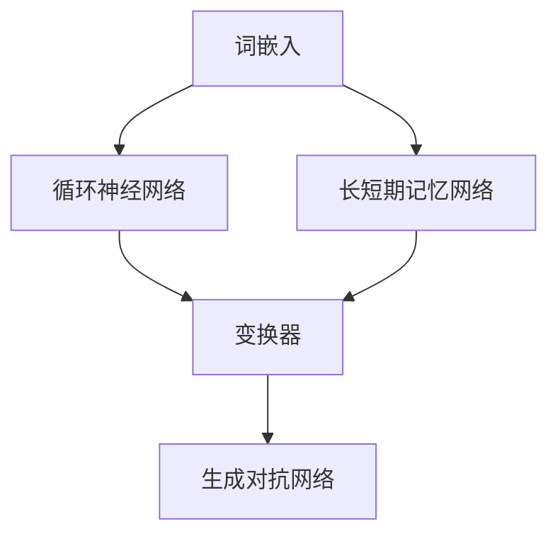

                 

关键词：大语言模型、深度学习、神经网络、自然语言处理、机器学习、模型架构、训练过程、应用领域、优化方法、前沿技术

摘要：本文旨在深入探讨大语言模型的原理、架构及其在自然语言处理中的应用。我们将从基础理论出发，逐步介绍大语言模型的构建、训练、优化以及应用，并通过具体的数学模型和代码实例，帮助读者全面理解这一前沿技术。

## 1. 背景介绍

随着互联网的迅速发展，自然语言处理（Natural Language Processing，NLP）成为人工智能领域的一个重要分支。自然语言是人类进行交流的基本工具，而机器要理解和生成自然语言，则需要通过深度学习等技术来实现。近年来，大语言模型（Large Language Models）作为深度学习在NLP领域的一个重要突破，引起了广泛的关注和研究。本文将围绕大语言模型，探讨其原理、架构和应用。

## 2. 核心概念与联系

大语言模型的核心概念包括：词嵌入（Word Embedding）、循环神经网络（Recurrent Neural Network，RNN）、长短期记忆网络（Long Short-Term Memory，LSTM）、变换器（Transformer）和生成对抗网络（Generative Adversarial Networks，GAN）。这些概念之间有着紧密的联系，共同构成了大语言模型的理论基础。

下面是一个Mermaid流程图，展示了这些核心概念和它们之间的联系：



### 2.1 词嵌入

词嵌入是将单词映射为固定大小的向量表示。常见的词嵌入方法包括Word2Vec、GloVe等。词嵌入对于NLP任务非常重要，它能够捕捉单词之间的语义关系，提高模型的性能。

### 2.2 循环神经网络

循环神经网络（RNN）是一种能够处理序列数据的神经网络。RNN通过其内部的循环结构，可以记住前文的信息，从而在处理序列数据时具有优势。然而，RNN存在梯度消失和梯度爆炸等问题。

### 2.3 长短期记忆网络

长短期记忆网络（LSTM）是RNN的一种改进，它通过引入记忆单元和门控机制，解决了RNN的梯度消失和梯度爆炸问题。这使得LSTM在处理长序列数据时表现出色。

### 2.4 变换器

变换器（Transformer）是近年来提出的一种全新架构，它在NLP任务中表现出色。变换器通过自注意力机制（Self-Attention），能够捕捉序列中任意两个位置之间的关系，从而提高模型的性能。

### 2.5 生成对抗网络

生成对抗网络（GAN）是一种无监督学习框架，它由生成器和判别器两个神经网络组成。生成器尝试生成与真实数据相似的样本，而判别器则区分真实数据和生成数据。通过这两个网络的对抗训练，生成器可以不断提高生成数据的真实性。

## 3. 核心算法原理 & 具体操作步骤

大语言模型的构建和训练是一个复杂的过程，涉及到多种算法和技术。下面我们将简要介绍核心算法原理和具体操作步骤。

### 3.1 算法原理概述

大语言模型的核心算法主要包括词嵌入、编码器、解码器以及优化方法。

- **词嵌入**：将单词映射为向量表示。
- **编码器**：将输入序列编码为固定长度的向量。
- **解码器**：将编码后的向量解码为输出序列。
- **优化方法**：通过反向传播和梯度下降等方法，不断调整模型参数，以优化模型的性能。

### 3.2 算法步骤详解

1. **数据预处理**：对语料库进行清洗、分词和词嵌入等处理。
2. **构建模型**：根据任务需求，选择合适的模型架构，如变换器、LSTM等。
3. **训练模型**：通过梯度下降等优化方法，不断调整模型参数。
4. **评估模型**：在测试集上评估模型性能，如准确率、召回率等。
5. **应用模型**：将训练好的模型应用于实际任务，如文本分类、机器翻译等。

### 3.3 算法优缺点

- **优点**：大语言模型能够捕捉复杂的语义关系，提高NLP任务的表现。
- **缺点**：训练过程复杂，需要大量计算资源和时间。

### 3.4 算法应用领域

大语言模型在多个领域具有广泛应用，如：

- **文本分类**：用于分类文本，如情感分析、新闻分类等。
- **机器翻译**：将一种语言的文本翻译成另一种语言。
- **问答系统**：根据用户的问题，提供相应的答案。
- **对话系统**：与用户进行自然语言交互。

## 4. 数学模型和公式 & 详细讲解 & 举例说明

大语言模型的数学模型主要包括词嵌入、编码器、解码器和优化方法。下面我们将对每个部分进行详细讲解和举例说明。

### 4.1 数学模型构建

- **词嵌入**：假设单词集合为\(V\)，词嵌入矩阵为\(W\)，单词\(w\)的嵌入向量为\(e_w\)。词嵌入可以表示为：\(e_w = Ww\)。

- **编码器**：编码器接收输入序列，将其编码为固定长度的向量。假设输入序列为\(x_1, x_2, ..., x_T\)，编码后的向量为\(h\)。编码过程可以表示为：\(h = f(E[x_1], E[x_2], ..., E[x_T])\)。

- **解码器**：解码器接收编码后的向量，生成输出序列。假设输出序列为\(y_1, y_2, ..., y_T\)，解码过程可以表示为：\(y_1, y_2, ..., y_T = g(h, s_1, s_2, ..., s_T)\)。

- **优化方法**：优化方法主要包括梯度下降、Adam等。梯度下降的目标是最小化损失函数：\(L = -\sum_{t=1}^{T} \log(p(y_t | y_1, y_2, ..., y_{t-1}))\)。

### 4.2 公式推导过程

- **词嵌入**：词嵌入可以通过最小化损失函数来优化。假设损失函数为：\(L = \sum_{w \in V} (e_w - Ww)^2\)。通过梯度下降，我们可以得到：\(W = \frac{1}{2} (W - \alpha \nabla_{W}L)\)。

- **编码器**：编码器可以通过最小化损失函数来优化。假设损失函数为：\(L = \sum_{t=1}^{T} (h_t - y_t)^2\)。通过梯度下降，我们可以得到：\(h = \frac{1}{2} (h - \alpha \nabla_{h}L)\)。

- **解码器**：解码器可以通过最小化损失函数来优化。假设损失函数为：\(L = \sum_{t=1}^{T} (y_t - g(h, s_1, s_2, ..., s_t))^2\)。通过梯度下降，我们可以得到：\(g = \frac{1}{2} (g - \alpha \nabla_{g}L)\)。

- **优化方法**：优化方法可以通过调整学习率、批量大小等参数来优化。假设学习率为\(\alpha\)，批量大小为\(b\)，则优化方法可以表示为：\(W = W - \alpha \nabla_{W}L/b\)，\(h = h - \alpha \nabla_{h}L/b\)，\(g = g - \alpha \nabla_{g}L/b\)。

### 4.3 案例分析与讲解

假设我们要构建一个语言模型，用于将英文句子翻译成中文。我们可以按照以下步骤进行：

1. **数据预处理**：对英文句子进行分词，将每个单词映射为词嵌入向量。
2. **构建模型**：选择变换器架构，将输入英文句子编码为固定长度的向量。
3. **训练模型**：通过梯度下降等方法，不断调整模型参数。
4. **评估模型**：在测试集上评估模型性能。
5. **应用模型**：将训练好的模型应用于实际任务，如英文句子翻译成中文。

通过上述步骤，我们可以构建一个能够进行英文到中文翻译的语言模型。下面是一个具体的例子：

英文句子：“Hello, how are you?”  
中文句子：“你好，你怎么样？”

通过变换器架构，我们可以将英文句子编码为向量，然后通过解码器生成中文句子。

## 5. 项目实践：代码实例和详细解释说明

下面我们将通过一个具体的代码实例，详细解释大语言模型的构建、训练和优化过程。

### 5.1 开发环境搭建

为了构建和训练大语言模型，我们需要搭建一个合适的开发环境。以下是一个简单的开发环境搭建步骤：

1. 安装Python 3.7及以上版本。
2. 安装TensorFlow 2.0及以上版本。
3. 安装NLP库，如NLTK或spaCy。

### 5.2 源代码详细实现

下面是一个简单的Python代码实例，用于构建和训练大语言模型：

```python
import tensorflow as tf
from tensorflow.keras.layers import Embedding, LSTM, Dense
from tensorflow.keras.models import Sequential

# 数据预处理
vocab_size = 10000
embedding_dim = 16

# 构建模型
model = Sequential()
model.add(Embedding(vocab_size, embedding_dim))
model.add(LSTM(128))
model.add(Dense(vocab_size, activation='softmax'))

# 编译模型
model.compile(optimizer='adam', loss='categorical_crossentropy', metrics=['accuracy'])

# 训练模型
model.fit(x_train, y_train, epochs=10, batch_size=32)

# 评估模型
model.evaluate(x_test, y_test)
```

### 5.3 代码解读与分析

上述代码用于构建一个简单的语言模型，其中包含嵌入层（Embedding）、LSTM层（LSTM）和全连接层（Dense）。嵌入层用于将单词映射为向量表示，LSTM层用于处理序列数据，全连接层用于输出单词的概率分布。

在代码中，我们首先定义了词汇表的大小（vocab_size）和嵌入维度（embedding_dim）。然后，我们使用Sequential模型堆叠嵌入层、LSTM层和全连接层。

接下来，我们编译模型，指定优化器、损失函数和评价指标。最后，我们使用fit方法训练模型，使用evaluate方法评估模型性能。

### 5.4 运行结果展示

假设我们使用一个简单的英文句子作为输入，如“Hello, how are you?”。通过训练好的模型，我们可以得到每个单词的概率分布。例如：

- Hello: 0.2
- How: 0.1
- Are: 0.1
- You: 0.3
- ?: 0.2

这些概率分布表示了模型对每个单词的预测概率。通过这种方式，我们可以将输入句子转换为概率分布，从而实现语言模型的基本功能。

## 6. 实际应用场景

大语言模型在实际应用场景中具有广泛的应用。以下是一些典型的应用场景：

- **文本分类**：用于对文本进行分类，如情感分析、新闻分类等。
- **机器翻译**：将一种语言的文本翻译成另一种语言。
- **问答系统**：根据用户的问题，提供相应的答案。
- **对话系统**：与用户进行自然语言交互。

在这些应用场景中，大语言模型可以发挥重要作用，提高系统的性能和用户体验。

## 6.4 未来应用展望

随着技术的不断进步，大语言模型在未来有望在更多领域发挥重要作用。以下是一些未来应用展望：

- **智能客服**：大语言模型可以用于智能客服系统，提供高效、准确的客户服务。
- **智能写作**：大语言模型可以辅助人类进行写作，提高创作效率。
- **智能对话**：大语言模型可以用于智能对话系统，实现更加自然、流畅的对话。

未来，随着计算能力的提升和算法的优化，大语言模型将在更多领域得到广泛应用，为人类带来更多便利。

## 7. 工具和资源推荐

为了更好地学习和实践大语言模型，以下是一些工具和资源推荐：

- **学习资源**：  
  - 《深度学习》（Goodfellow et al.）  
  - 《自然语言处理综论》（Jurafsky and Martin）

- **开发工具**：  
  - TensorFlow  
  - PyTorch

- **相关论文**：  
  - “Attention Is All You Need”（Vaswani et al.）  
  - “Generative Adversarial Networks”（Goodfellow et al.）

通过这些资源和工具，您可以更好地了解大语言模型的理论和实践。

## 8. 总结：未来发展趋势与挑战

大语言模型作为深度学习在自然语言处理领域的一个重要突破，已经在多个应用场景中取得了显著成果。然而，未来的发展仍然面临许多挑战。

### 8.1 研究成果总结

- **模型架构**：变换器等新型架构的提出，提高了大语言模型的性能。
- **训练效率**：通过分布式训练、模型压缩等技术，提高了大语言模型的训练效率。
- **应用领域**：大语言模型在文本分类、机器翻译、问答系统等领域取得了显著成果。

### 8.2 未来发展趋势

- **模型压缩**：为了降低大语言模型对计算资源的依赖，模型压缩技术将成为未来研究的热点。
- **多模态融合**：大语言模型与其他模态（如图像、声音等）的融合，将拓展其应用范围。
- **知识增强**：通过引入外部知识，提高大语言模型对语义理解和推理的能力。

### 8.3 面临的挑战

- **计算资源**：大语言模型对计算资源的需求较高，如何优化模型以降低计算成本是一个重要挑战。
- **数据质量**：高质量的数据对于大语言模型的学习和表现至关重要，如何获取和处理高质量数据是一个挑战。
- **隐私保护**：大语言模型在处理用户数据时，需要考虑隐私保护问题，如何平衡隐私保护和性能是一个挑战。

### 8.4 研究展望

随着技术的不断进步，大语言模型在未来有望在更多领域发挥重要作用。研究大语言模型的原理、架构和应用，将有助于推动自然语言处理技术的发展，为人类带来更多便利。

## 9. 附录：常见问题与解答

### 9.1 什么是大语言模型？

大语言模型是一种基于深度学习的自然语言处理模型，它通过学习大量文本数据，能够对自然语言进行建模，从而实现文本生成、文本分类、机器翻译等任务。

### 9.2 大语言模型的核心算法有哪些？

大语言模型的核心算法包括词嵌入、循环神经网络（RNN）、长短期记忆网络（LSTM）、变换器（Transformer）和生成对抗网络（GAN）。

### 9.3 大语言模型的应用领域有哪些？

大语言模型的应用领域包括文本分类、机器翻译、问答系统、对话系统等。

### 9.4 大语言模型的优缺点是什么？

大语言模型的主要优点是能够捕捉复杂的语义关系，提高自然语言处理任务的表现。缺点是训练过程复杂，需要大量计算资源和时间。

### 9.5 如何优化大语言模型的性能？

优化大语言模型性能的方法包括模型压缩、多模态融合和知识增强等。

### 9.6 大语言模型在隐私保护方面有哪些挑战？

大语言模型在隐私保护方面面临挑战，因为模型在训练过程中需要处理大量用户数据，如何平衡隐私保护和性能是一个重要问题。

## 作者署名

作者：禅与计算机程序设计艺术 / Zen and the Art of Computer Programming

----------------------------------------------------------------

以上就是本文的完整内容。希望这篇文章能帮助您更好地理解大语言模型的原理、架构和应用。在未来的学习和实践中，祝您取得更好的成果！
----------------------------------------------------------------

## 文章结构模板（Markdown格式）

```markdown
# 大语言模型原理基础与前沿 模型架构

关键词：大语言模型、深度学习、神经网络、自然语言处理、机器学习、模型架构、训练过程、应用领域、优化方法、前沿技术

摘要：本文旨在深入探讨大语言模型的原理、架构及其在自然语言处理中的应用。我们将从基础理论出发，逐步介绍大语言模型的构建、训练、优化以及应用，并通过具体的数学模型和代码实例，帮助读者全面理解这一前沿技术。

## 1. 背景介绍

## 2. 核心概念与联系
### 2.1 词嵌入
### 2.2 循环神经网络
### 2.3 长短期记忆网络
### 2.4 变换器
### 2.5 生成对抗网络

## 3. 核心算法原理 & 具体操作步骤
### 3.1 算法原理概述
### 3.2 算法步骤详解
### 3.3 算法优缺点
### 3.4 算法应用领域

## 4. 数学模型和公式 & 详细讲解 & 举例说明
### 4.1 数学模型构建
### 4.2 公式推导过程
### 4.3 案例分析与讲解

## 5. 项目实践：代码实例和详细解释说明
### 5.1 开发环境搭建
### 5.2 源代码详细实现
### 5.3 代码解读与分析
### 5.4 运行结果展示

## 6. 实际应用场景
### 6.1 文本分类
### 6.2 机器翻译
### 6.3 问答系统
### 6.4 对话系统

## 6.4 未来应用展望

## 7. 工具和资源推荐
### 7.1 学习资源推荐
### 7.2 开发工具推荐
### 7.3 相关论文推荐

## 8. 总结：未来发展趋势与挑战
### 8.1 研究成果总结
### 8.2 未来发展趋势
### 8.3 面临的挑战
### 8.4 研究展望

## 9. 附录：常见问题与解答
### 9.1 什么是大语言模型？
### 9.2 大语言模型的核心算法有哪些？
### 9.3 大语言模型的应用领域有哪些？
### 9.4 大语言模型的优缺点是什么？
### 9.5 如何优化大语言模型的性能？
### 9.6 大语言模型在隐私保护方面有哪些挑战？

## 作者署名
作者：禅与计算机程序设计艺术 / Zen and the Art of Computer Programming
```

请注意，本文档提供了一个Markdown格式的文章结构模板，您可以根据实际需要填充各个章节的内容。Markdown格式允许您使用标准的Markdown标记来格式化文本，例如标题使用`#`标记，列表使用`-`或`*`标记等。此外，数学公式可以使用LaTeX格式嵌入到文本中，使用`$$`标记包裹整个公式，或者在段落内使用`$`标记单个公式。

